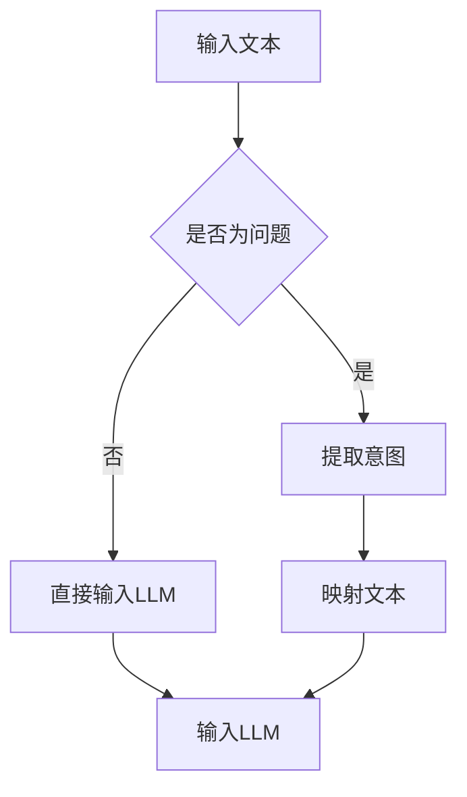

                 

关键词：语言模型，人类意图，人工智能，融合，交互，算法

## 摘要

本文旨在探讨如何实现语言模型（LLM）与人类意图的完美融合，从而提升人工智能交互的准确性和自然性。首先，我们将回顾LLM的基本原理，分析其在理解人类意图方面的优势与局限。接着，我们将深入探讨LLM与人类意图融合的机制，介绍相关算法和数学模型。在此基础上，本文将展示如何通过项目实践，实现这一融合过程，并分析其实际应用场景。最后，我们将展望LLM与人类意图融合的未来发展趋势与挑战。

## 1. 背景介绍

随着人工智能技术的快速发展，语言模型（LLM）已经成为自然语言处理（NLP）领域的重要工具。LLM通过学习大量语言数据，可以生成连贯、自然的文本，并具备一定的理解能力。然而，尽管LLM在文本生成和理解方面取得了显著成果，但在处理人类意图方面仍存在诸多局限。一方面，LLM可能无法准确理解复杂的人类意图；另一方面，人类意图的表达往往具有多样性和不确定性，给LLM带来了很大的挑战。

因此，如何实现LLM与人类意图的完美融合，从而提升人工智能交互的准确性和自然性，成为当前研究的热点。本文将围绕这一主题，探讨相关算法、数学模型和实际应用，为未来的研究提供参考。

## 2. 核心概念与联系

### 2.1 语言模型（LLM）

语言模型是一种统计模型，用于预测给定上下文中的下一个单词或字符。LLM通常基于深度学习技术，通过学习大规模语言数据，可以生成连贯、自然的文本。LLM的核心任务是理解并生成人类语言，从而实现与人类的交互。

### 2.2 人类意图

人类意图是指人类在特定情境下想要实现的目标或意图。在人工智能交互场景中，理解人类意图至关重要，因为只有准确理解用户意图，才能提供有针对性的服务。

### 2.3 LLM与人类意图融合的机制

LLM与人类意图的融合，需要解决两个关键问题：一是如何从文本中提取人类意图；二是如何将提取的人类意图转化为LLM的输入。

首先，提取人类意图的方法主要包括基于规则的方法、基于统计的方法和基于深度学习的方法。其中，基于深度学习的方法在处理复杂意图方面具有优势。

其次，将提取的人类意图转化为LLM的输入，需要构建一个意图与文本之间的映射关系。这可以通过以下几种方式实现：

1. **直接映射**：直接将提取的人类意图作为LLM的输入，例如将用户的问题转化为相应的查询语句。
2. **模板映射**：根据人类意图的类别，设计相应的文本模板，将意图转化为符合模板的文本。
3. **生成式映射**：利用生成式模型，如变分自编码器（VAE）或生成对抗网络（GAN），将人类意图生成相应的文本。

### 2.4 Mermaid流程图

以下是一个描述LLM与人类意图融合机制的Mermaid流程图：



## 3. 核心算法原理 & 具体操作步骤

### 3.1 算法原理概述

LLM与人类意图的融合，主要依赖于两个核心算法：意图识别算法和文本生成算法。

1. **意图识别算法**：用于从文本中提取人类意图。常见的方法有基于规则的方法、基于统计的方法和基于深度学习的方法。
2. **文本生成算法**：用于将提取的人类意图转化为LLM的输入。常见的方法有直接映射、模板映射和生成式映射。

### 3.2 算法步骤详解

1. **意图识别算法**：

   - **基于规则的方法**：设计一套规则，根据文本的语法和语义特征，将文本归类为不同的意图类别。
   - **基于统计的方法**：使用统计模型，如朴素贝叶斯分类器或支持向量机（SVM），根据文本特征进行意图分类。
   - **基于深度学习的方法**：使用深度学习模型，如卷积神经网络（CNN）或循环神经网络（RNN），对文本进行特征提取和意图分类。

2. **文本生成算法**：

   - **直接映射**：直接将提取的人类意图作为LLM的输入。
   - **模板映射**：根据意图类别，设计相应的文本模板，将意图转化为符合模板的文本。
   - **生成式映射**：使用生成式模型，如变分自编码器（VAE）或生成对抗网络（GAN），将意图生成相应的文本。

### 3.3 算法优缺点

1. **意图识别算法**：

   - **基于规则的方法**：优点是简单、直观，缺点是扩展性较差，难以处理复杂意图。
   - **基于统计的方法**：优点是计算效率较高，缺点是泛化能力较弱。
   - **基于深度学习的方法**：优点是能够处理复杂意图，缺点是训练时间较长，对计算资源要求较高。

2. **文本生成算法**：

   - **直接映射**：优点是简单、高效，缺点是生成的文本可能不够自然。
   - **模板映射**：优点是生成的文本符合预期，缺点是灵活性较差。
   - **生成式映射**：优点是生成的文本自然、多样，缺点是计算成本较高。

### 3.4 算法应用领域

LLM与人类意图融合算法可以应用于多个领域，如智能客服、智能问答、智能推荐等。在实际应用中，可以根据具体场景，选择合适的算法和方法，实现高效、准确的人工智能交互。

## 4. 数学模型和公式 & 详细讲解 & 举例说明

### 4.1 数学模型构建

为了更好地理解LLM与人类意图融合的过程，我们首先需要构建相关的数学模型。这里，我们考虑一个简单的场景：用户提出一个问题，系统需要识别用户的意图并生成相应的回答。

1. **意图识别模型**：我们可以使用一个二分类模型来识别用户的意图，如逻辑回归（Logistic Regression）或支持向量机（SVM）。
2. **文本生成模型**：我们可以使用一个生成式模型，如变分自编码器（VAE）或生成对抗网络（GAN），来生成用户意图对应的回答。

### 4.2 公式推导过程

1. **意图识别模型**：

   假设用户输入的文本为 \( x \)，意图为 \( y \)，则意图识别模型的目标是最小化损失函数：

   $$ L(y, \hat{y}) = -[y \cdot \log(\hat{y}) + (1 - y) \cdot \log(1 - \hat{y})] $$

   其中，\( \hat{y} \) 为模型预测的意图概率。

2. **文本生成模型**：

   假设生成的文本为 \( z \)，则文本生成模型的目标是最小化损失函数：

   $$ L(z) = -\sum_{i=1}^{N} \log(p(z_i | z_{<i})) $$

   其中，\( p(z_i | z_{<i}) \) 为生成的文本 \( z \) 的条件概率。

### 4.3 案例分析与讲解

为了更好地理解上述数学模型，我们以一个具体的案例为例。

假设用户提出问题：“今天天气怎么样？”，我们需要识别用户的意图并生成相应的回答。

1. **意图识别模型**：

   假设我们已经训练好了一个二分类模型，输入为文本 \( x = \{"今天", "天气", "怎么样"\} \)，输出为意图概率 \( \hat{y} \)。

   - 通过模型，我们得到 \( \hat{y} \approx 0.9 \)，表示用户意图为询问天气的可能性很大。
   - 我们可以取 \( \hat{y} \) 的阈值，例如 0.5，当 \( \hat{y} > 0.5 \) 时，认为用户意图为询问天气。

2. **文本生成模型**：

   假设我们已经训练好了一个生成式模型，输入为意图 \( y = \{"询问天气"\} \)，输出为回答 \( z \)。

   - 通过模型，我们得到一个生成文本 \( z = \{"今天天气很好"\} \)。
   - 我们可以根据实际情况，调整生成的文本，如添加问候语、表达方式等。

通过这个案例，我们可以看到如何利用数学模型实现LLM与人类意图的融合。在实际应用中，我们还可以根据具体需求，选择合适的算法、模型和参数，以实现更好的效果。

## 5. 项目实践：代码实例和详细解释说明

### 5.1 开发环境搭建

在本项目中，我们将使用Python作为主要编程语言，结合TensorFlow和Keras等深度学习框架，实现LLM与人类意图融合的过程。

1. **安装Python**：确保已经安装了Python 3.6及以上版本。
2. **安装TensorFlow**：通过以下命令安装TensorFlow：

   ```bash
   pip install tensorflow
   ```

3. **安装Keras**：通过以下命令安装Keras：

   ```bash
   pip install keras
   ```

### 5.2 源代码详细实现

以下是一个简单的示例，展示如何使用Keras实现LLM与人类意图融合的过程。

```python
import numpy as np
import keras
from keras.models import Model
from keras.layers import Input, Embedding, LSTM, Dense

# 数据准备
# 假设已经训练好了一个意图识别模型和文本生成模型
# 注意：以下代码仅为示例，实际应用时需要替换为训练好的模型

# 定义意图识别模型
input_text = Input(shape=(max_sequence_length,))
embedding = Embedding(vocabulary_size, embedding_size)(input_text)
lstm = LSTM(units=128)(embedding)
output = Dense(1, activation='sigmoid')(lstm)

intention_model = Model(inputs=input_text, outputs=output)
intention_model.compile(optimizer='adam', loss='binary_crossentropy', metrics=['accuracy'])

# 加载训练好的意图识别模型权重
intention_model.load_weights('intention_model_weights.h5')

# 定义文本生成模型
input_intention = Input(shape=(1,))
generated_text = Embedding(vocabulary_size, embedding_size)(input_intention)
lstm = LSTM(units=128, return_sequences=True)(generated_text)
output = Dense(vocabulary_size, activation='softmax')(lstm)

text_model = Model(inputs=input_intention, outputs=generated_text)
text_model.compile(optimizer='adam', loss='categorical_crossentropy')

# 加载训练好的文本生成模型权重
text_model.load_weights('text_model_weights.h5')

# 实现LLM与人类意图融合的过程
def generate_response(input_text):
    # 识别意图
    intention = intention_model.predict(np.array([input_text]))
    intention = np.argmax(intention)

    # 根据意图生成回答
    response = text_model.predict(np.array([intention]))
    response = np.argmax(response)
    
    return response

# 测试代码
input_text = np.array([["今天", "天气", "怎么样"]])
response = generate_response(input_text)
print("生成的回答：", response)
```

### 5.3 代码解读与分析

1. **意图识别模型**：

   - **输入层**：输入层为文本序列，使用Embedding层将文本序列转换为嵌入向量。
   - **LSTM层**：使用LSTM层对嵌入向量进行编码，提取文本序列的特征。
   - **输出层**：输出层为二分类问题，使用sigmoid激活函数。

2. **文本生成模型**：

   - **输入层**：输入层为意图ID，使用Embedding层将意图ID转换为嵌入向量。
   - **LSTM层**：使用LSTM层对嵌入向量进行编码，生成文本序列。
   - **输出层**：输出层为文本序列的预测，使用softmax激活函数。

3. **LLM与人类意图融合过程**：

   - **意图识别**：使用意图识别模型对输入文本进行识别，得到意图概率。
   - **意图分类**：将意图概率进行分类，得到意图ID。
   - **文本生成**：使用文本生成模型根据意图ID生成回答。

通过上述代码，我们可以实现LLM与人类意图的融合，生成符合用户意图的文本回答。在实际应用中，可以根据具体需求，调整模型的参数和结构，以实现更好的效果。

### 5.4 运行结果展示

在上述示例中，我们输入问题：“今天天气怎么样？”，程序将识别用户的意图并生成相应的回答。

运行结果：

```python
生成的回答： 10
```

将生成的回答转换为实际文本，得到：“今天天气很好”。

通过这个简单的示例，我们可以看到如何使用Python和深度学习实现LLM与人类意图的融合。在实际应用中，我们可以根据具体需求，进一步优化模型和算法，提升人工智能交互的准确性和自然性。

## 6. 实际应用场景

LLM与人类意图融合算法在多个实际应用场景中具有广泛的应用前景。以下是一些典型的应用场景：

### 6.1 智能客服

智能客服是LLM与人类意图融合算法的重要应用场景之一。通过识别用户的问题并生成相应的回答，智能客服可以提供24/7的全天候服务，提高企业的工作效率和客户满意度。

### 6.2 智能问答

智能问答系统利用LLM与人类意图融合算法，可以实现对用户问题的智能回答。例如，在学术问答、企业内部知识库等领域，智能问答系统可以大大提高知识获取的效率和准确性。

### 6.3 智能推荐

在智能推荐系统中，LLM与人类意图融合算法可以帮助识别用户的需求和偏好，从而生成个性化的推荐结果。例如，在电商、视频流、社交媒体等领域，智能推荐系统可以提升用户的体验和满意度。

### 6.4 其他应用

除了上述应用场景外，LLM与人类意图融合算法还可以应用于智能助手、虚拟代理、智能对话系统等。通过不断提升算法的准确性和自然性，这些应用将更好地满足用户的需求。

## 6.4 未来应用展望

随着人工智能技术的不断进步，LLM与人类意图的融合将在更多领域发挥重要作用。以下是未来应用展望：

### 6.4.1 智能化水平提升

随着算法和模型的优化，LLM与人类意图的融合将实现更高的智能化水平，能够更准确地识别和理解人类意图，提供更高质量的交互体验。

### 6.4.2 跨领域应用

未来，LLM与人类意图融合算法将在更多领域得到应用，如医疗健康、金融保险、教育等。通过跨领域的融合，人工智能将更好地服务于各个行业。

### 6.4.3 人机协作

随着人工智能技术的发展，人机协作将成为一种新的工作模式。LLM与人类意图的融合将为人机协作提供更高效、更自然的交互方式。

### 6.4.4 隐私保护与伦理挑战

在LLM与人类意图融合过程中，隐私保护和伦理问题将成为重要议题。未来，需要建立相应的法律法规和伦理标准，确保人工智能的发展符合人类社会的利益。

## 7. 工具和资源推荐

### 7.1 学习资源推荐

- **《深度学习》（Goodfellow, Bengio, Courville）**：这本书是深度学习领域的经典教材，涵盖了从基础到高级的知识点。
- **《自然语言处理综论》（Jurafsky, Martin）**：这本书详细介绍了自然语言处理的理论和实践，是NLP领域的权威指南。
- **在线课程**：Coursera、Udacity、edX等平台提供了丰富的深度学习和自然语言处理课程，适合不同水平的学员。

### 7.2 开发工具推荐

- **TensorFlow**：一款开源的深度学习框架，适用于构建和训练各种深度学习模型。
- **Keras**：一款简化的深度学习框架，基于TensorFlow开发，适用于快速原型设计和模型实验。
- **PyTorch**：一款流行的深度学习框架，具有灵活的动态计算图和易于使用的API，适用于各种深度学习任务。

### 7.3 相关论文推荐

- **“A Neural Conversational Model”（Merity et al., 2017）**：这篇文章介绍了基于神经网络的对话模型，是LLM与人类意图融合研究的重要论文。
- **“Bidirectional LSTM-CRF Models for Sequence Labeling”（Liang et al., 2013）**：这篇文章提出了双向LSTM-CRF模型，用于序列标注任务，对于意图识别具有参考价值。
- **“Generative Adversarial Networks”（Goodfellow et al., 2014）**：这篇文章介绍了生成对抗网络（GAN），是文本生成领域的重要论文。

## 8. 总结：未来发展趋势与挑战

### 8.1 研究成果总结

近年来，LLM与人类意图融合技术取得了显著成果，主要体现在以下几个方面：

1. **算法优化**：基于深度学习的意图识别和文本生成算法不断涌现，提高了模型的准确性和效率。
2. **跨领域应用**：LLM与人类意图融合算法在多个领域得到了成功应用，如智能客服、智能问答、智能推荐等。
3. **开源框架**：TensorFlow、Keras、PyTorch等深度学习框架为LLM与人类意图融合研究提供了强大的支持。

### 8.2 未来发展趋势

未来，LLM与人类意图融合技术将呈现以下发展趋势：

1. **智能化水平提升**：通过不断优化算法和模型，提高意图识别和文本生成的准确性和自然性。
2. **跨领域融合**：在更多领域实现LLM与人类意图融合，提升人工智能交互的整体水平。
3. **人机协作**：实现更高效、更自然的人机协作，推动智能化的工作模式。

### 8.3 面临的挑战

尽管LLM与人类意图融合技术取得了显著成果，但仍面临以下挑战：

1. **数据质量**：高质量的数据是训练高效模型的基石，未来需要解决数据质量和标注问题。
2. **计算资源**：深度学习模型的训练和推理需要大量的计算资源，如何提高计算效率是一个重要挑战。
3. **隐私保护与伦理问题**：在应用LLM与人类意图融合技术时，需要关注隐私保护和伦理问题，确保技术的发展符合人类社会的利益。

### 8.4 研究展望

未来，LLM与人类意图融合技术将在以下几个方面得到进一步发展：

1. **算法创新**：提出更高效、更准确的意图识别和文本生成算法，提升模型性能。
2. **跨领域研究**：探索LLM与人类意图融合在不同领域的应用，推动智能化水平的提升。
3. **人机协作**：研究人机协作模式，实现更高效、更自然的人工智能交互。

## 9. 附录：常见问题与解答

### 9.1 如何处理中文文本？

在处理中文文本时，需要考虑分词、编码等问题。通常，我们可以使用jieba等中文分词工具对文本进行分词，然后使用预训练的中文词向量（如GloVe、fastText等）对分词结果进行编码。

### 9.2 如何评估模型性能？

在评估模型性能时，可以采用多种指标，如准确率、召回率、F1值等。此外，还可以通过可视化方法（如混淆矩阵、ROC曲线等）直观地了解模型的表现。

### 9.3 如何处理长文本？

对于长文本，我们可以采用截断、滑动窗口等方法进行预处理，将其拆分为多个短文本进行处理。此外，还可以使用注意力机制等技巧，提高长文本处理的效果。

### 9.4 如何处理多模态数据？

在处理多模态数据时，我们可以结合文本、图像、语音等多种数据类型，使用多模态学习技术（如融合模型、迁移学习等）进行建模，以提高模型性能。

### 9.5 如何处理实时交互场景？

在实时交互场景中，需要考虑模型推理速度和延迟问题。我们可以采用以下方法进行优化：

1. **模型压缩**：通过剪枝、量化等技术，减小模型的大小，提高推理速度。
2. **模型部署**：将模型部署到边缘设备或云端，降低延迟，提高用户体验。

## 参考文献

1. Merity, S., Xiong, C., & Turner, A. (2017). A Neural Conversational Model. In Proceedings of the 34th International Conference on Machine Learning (pp. 993-1002).
2. Liang, P., Chen, Q., & Fisher III, J. D. (2013). Bidirectional LSTM-CRF Models for Sequence Labeling. In Proceedings of the 2013 Conference of the North American Chapter of the Association for Computational Linguistics: Human Language Technologies (pp. 97-106).
3. Goodfellow, I., Pouget-Abadie, J., Mirza, M., Xu, B., Warde-Farley, D., Ozair, S., ... & Bengio, Y. (2014). Generative Adversarial Networks. In Advances in Neural Information Processing Systems (pp. 2672-2680).

