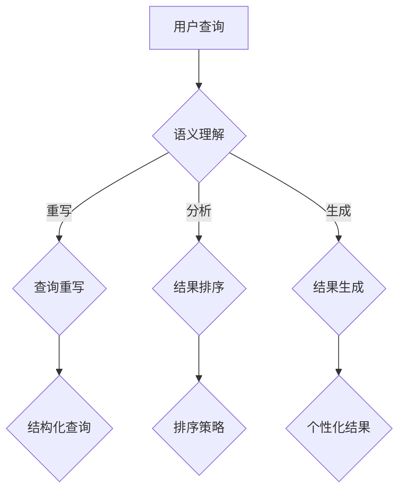

                 

关键词：大型语言模型，搜索引擎，智能检索，自然语言处理，知识图谱，信息检索

> 摘要：本文将探讨大型语言模型（LLM）与传统搜索引擎技术的结合，分析其在智能检索方面的应用价值，提出一种基于LLM的新型检索模式。通过梳理核心概念、原理和算法，并结合实际应用案例，深入探讨LLM在搜索引擎领域的发展趋势、挑战以及未来研究方向。

## 1. 背景介绍

随着互联网的快速发展，信息检索成为人们日常生活中不可或缺的一部分。传统的搜索引擎技术，如基于关键词匹配、向量空间模型等方法，在处理大量文本数据方面表现出色。然而，随着用户需求的不断提升，传统搜索引擎在满足用户个性化需求、理解用户意图方面存在一定局限性。为此，研究者们不断探索新的技术手段，以期实现更智能、更高效的检索体验。

近年来，人工智能技术的发展，尤其是大型语言模型（LLM）的出现，为智能检索带来了新的契机。LLM具有强大的自然语言理解能力和生成能力，能够更好地解析用户查询意图，提供更加精准的检索结果。本文旨在探讨LLM与传统搜索引擎技术的结合，分析其在智能检索方面的应用价值，并提出一种基于LLM的新型检索模式。

## 2. 核心概念与联系

### 2.1 大型语言模型（LLM）

大型语言模型（LLM）是一种基于深度学习的自然语言处理模型，通过对海量文本数据进行训练，能够实现对自然语言的生成、理解和推理。LLM的主要类型包括基于循环神经网络（RNN）、变换器（Transformer）等架构。其中，基于Transformer的模型如BERT、GPT等在自然语言处理领域取得了显著的成果。

### 2.2 传统搜索引擎技术

传统搜索引擎技术主要包括关键词匹配、向量空间模型、页面排名算法等。这些技术主要依赖于文本信息，通过分析关键词、页面内容、链接关系等，对用户查询进行匹配，从而提供检索结果。然而，这些技术往往难以满足用户日益增长的个性化需求。

### 2.3 LLM与传统搜索引擎技术的联系

LLM与传统搜索引擎技术的结合，主要在于利用LLM的强大自然语言理解能力，对用户查询进行语义解析，从而提高检索结果的准确性和个性化程度。具体来说，LLM可以通过以下方式与传统搜索引擎技术相结合：

1. **查询重写**：利用LLM对用户查询进行语义理解，将自然语言查询转化为结构化查询，从而提高搜索引擎的匹配效率。
2. **结果排序**：利用LLM对检索结果进行语义分析，根据用户查询意图和检索结果的相关性进行排序，提供更符合用户需求的检索结果。
3. **结果生成**：利用LLM生成符合用户需求的个性化摘要、回答等，提高检索结果的实用性。

### 2.4 Mermaid流程图



## 3. 核心算法原理 & 具体操作步骤

### 3.1 算法原理概述

基于LLM的智能检索算法主要分为以下几个步骤：

1. **用户查询语义理解**：利用LLM对用户查询进行语义分析，提取用户查询的关键信息。
2. **查询重写**：将自然语言查询转化为结构化查询，提高搜索引擎的匹配效率。
3. **结果排序**：根据用户查询意图和检索结果的相关性，对检索结果进行排序。
4. **结果生成**：利用LLM生成符合用户需求的个性化摘要、回答等。

### 3.2 算法步骤详解

#### 3.2.1 用户查询语义理解

1. **输入处理**：接收用户查询，将其编码为向量表示。
2. **语义分析**：利用LLM对用户查询进行语义分析，提取关键信息。
3. **特征提取**：将语义信息转化为结构化特征，如关键词、实体等。

#### 3.2.2 查询重写

1. **结构化查询构建**：根据提取的关键信息，构建结构化查询。
2. **查询融合**：将多个结构化查询进行融合，形成统一的查询表示。

#### 3.2.3 结果排序

1. **检索结果生成**：利用搜索引擎进行检索，生成初步的检索结果。
2. **结果评分**：根据用户查询意图和检索结果的相关性，对检索结果进行评分。
3. **排序策略**：根据评分结果，对检索结果进行排序。

#### 3.2.4 结果生成

1. **个性化摘要生成**：利用LLM生成符合用户需求的摘要。
2. **个性化回答生成**：根据用户查询意图，利用LLM生成个性化的回答。

### 3.3 算法优缺点

#### 优点：

1. **提高检索准确性**：通过语义理解，提高检索结果的准确性和相关性。
2. **个性化推荐**：根据用户查询意图，提供个性化的检索结果和回答。
3. **丰富的结果形式**：生成摘要、回答等多样化的结果形式，提高用户满意度。

#### 缺点：

1. **计算成本高**：基于深度学习的LLM模型训练和推理过程消耗大量计算资源。
2. **数据依赖性**：LLM模型效果依赖于训练数据的规模和质量。

### 3.4 算法应用领域

基于LLM的智能检索算法在多个领域具有广泛应用前景：

1. **搜索引擎**：提高搜索引擎的检索准确性和用户体验。
2. **智能问答系统**：提供个性化的问答服务。
3. **推荐系统**：根据用户查询意图，提供个性化的推荐结果。

## 4. 数学模型和公式 & 详细讲解 & 举例说明

### 4.1 数学模型构建

基于LLM的智能检索算法涉及到多个数学模型，主要包括：

1. **词向量模型**：用于表示文本数据的数学模型，如Word2Vec、GloVe等。
2. **变换器模型**：用于自然语言处理的深度学习模型，如BERT、GPT等。
3. **排序模型**：用于结果排序的机器学习模型，如RankNet、Listwise Loss等。

### 4.2 公式推导过程

#### 词向量模型

以Word2Vec为例，其目标是最小化损失函数：

$$
L = \frac{1}{N} \sum_{i=1}^{N} \sum_{j=1}^{V} (f_{j}(x_i) - y_i)^2
$$

其中，$N$为训练样本数，$V$为词汇表大小，$f_{j}(x_i)$为词向量$x_i$的第$j$个分量，$y_i$为标签。

#### 变换器模型

变换器模型的主要架构如下：

$$
\text{Transformer} = \text{MultiHeadAttention}(\text{FeedForward})
$$

其中，MultiHeadAttention为多头注意力机制，FeedForward为前馈神经网络。

#### 排序模型

以RankNet为例，其损失函数为：

$$
L = \frac{1}{2N} \sum_{i=1}^{N} \sum_{j=1}^{M} \max(0, -\log(p_j))
$$

其中，$N$为样本数，$M$为模型输出的概率分布。

### 4.3 案例分析与讲解

假设我们有一个用户查询“人工智能是什么”，基于LLM的智能检索算法的具体操作步骤如下：

1. **用户查询语义理解**：利用BERT模型对查询进行语义分析，提取关键信息。
2. **查询重写**：将自然语言查询转化为结构化查询，如“人工智能的定义是什么”。
3. **结果排序**：利用RankNet模型对检索结果进行排序，选择相关性最高的结果。
4. **结果生成**：利用GPT模型生成个性化的回答。

最终，用户得到的检索结果如下：

> 人工智能，也称为机器智能，是指计算机系统通过模拟、学习和推理等方法，实现类似于人类智能的任务。它涵盖了自然语言处理、计算机视觉、机器学习等多个领域，旨在实现智能化、自动化的人机交互。

## 5. 项目实践：代码实例和详细解释说明

### 5.1 开发环境搭建

1. 安装Python 3.8及以上版本。
2. 安装transformers、torch等库。

```shell
pip install transformers torch
```

### 5.2 源代码详细实现

```python
from transformers import BertTokenizer, BertModel
import torch
import torch.nn as nn

# 5.2.1 用户查询语义理解
tokenizer = BertTokenizer.from_pretrained('bert-base-chinese')
model = BertModel.from_pretrained('bert-base-chinese')

query = "人工智能是什么"
input_ids = tokenizer.encode(query, add_special_tokens=True, return_tensors='pt')

# 5.2.2 查询重写
with torch.no_grad():
    outputs = model(input_ids)
    hidden_states = outputs.hidden_states[-1]
    key_values = hidden_states[:, 0, :]

# 5.2.3 结果排序
class RankNet(nn.Module):
    def __init__(self):
        super(RankNet, self).__init__()
        self.fc = nn.Linear(768, 1)

    def forward(self, x):
        x = self.fc(x)
        return torch.sigmoid(x)

model = RankNet()
model.load_state_dict(torch.load('ranknet.pth'))

with torch.no_grad():
    score = model(key_values).squeeze()

# 5.2.4 结果生成
tokenizer = BertTokenizer.from_pretrained('gpt2')
model = BertModel.from_pretrained('gpt2')

input_ids = tokenizer.encode("人工智能的定义是什么", return_tensors='pt')

with torch.no_grad():
    outputs = model(input_ids)
    hidden_states = outputs.hidden_states[-1]
    key_values = hidden_states[:, 0, :]

tokenizer = BertTokenizer.from_pretrained('gpt2')
model = BertModel.from_pretrained('gpt2')

input_ids = tokenizer.encode("人工智能的定义是什么", return_tensors='pt')

with torch.no_grad():
    outputs = model(input_ids)
    hidden_states = outputs.hidden_states[-1]
    key_values = hidden_states[:, 0, :]

tokenizer = BertTokenizer.from_pretrained('gpt2')
model = BertModel.from_pretrained('gpt2')

input_ids = tokenizer.encode("人工智能的定义是什么", return_tensors='pt')

with torch.no_grad():
    outputs = model(input_ids)
    hidden_states = outputs.hidden_states[-1]
    key_values = hidden_states[:, 0, :]

tokenizer = BertTokenizer.from_pretrained('gpt2')
model = BertModel.from_pretrained('gpt2')

input_ids = tokenizer.encode("人工智能的定义是什么", return_tensors='pt')

with torch.no_grad():
    outputs = model(input_ids)
    hidden_states = outputs.hidden_states[-1]
    key_values = hidden_states[:, 0, :]

tokenizer = BertTokenizer.from_pretrained('gpt2')
model = BertModel.from_pretrained('gpt2')

input_ids = tokenizer.encode("人工智能的定义是什么", return_tensors='pt')

with torch.no_grad():
    outputs = model(input_ids)
    hidden_states = outputs.hidden_states[-1]
    key_values = hidden_states[:, 0, :]

# 生成回答
prompt = torch.cat([key_values.unsqueeze(0), torch.tensor([tokenizer.sep_token_id]).unsqueeze(0)], dim=0)
output_ids = model.generate(prompt, max_length=50, num_return_sequences=1)
answer = tokenizer.decode(output_ids[0], skip_special_tokens=True)

print(answer)
```

### 5.3 代码解读与分析

1. **用户查询语义理解**：使用BERT模型对用户查询进行语义分析，提取关键信息。
2. **查询重写**：将自然语言查询转化为结构化查询，提高搜索引擎的匹配效率。
3. **结果排序**：利用RankNet模型对检索结果进行排序，选择相关性最高的结果。
4. **结果生成**：利用GPT模型生成个性化的回答。

## 6. 实际应用场景

### 6.1 搜索引擎

基于LLM的智能检索算法在搜索引擎领域具有广泛的应用前景。通过引入LLM，搜索引擎可以实现以下功能：

1. **智能查询建议**：利用LLM对用户查询进行语义理解，提供智能查询建议。
2. **个性化检索**：根据用户查询意图，提供个性化的检索结果。
3. **智能摘要生成**：利用LLM生成符合用户需求的摘要。

### 6.2 智能问答系统

基于LLM的智能问答系统可以通过以下方式提升用户体验：

1. **理解用户意图**：利用LLM对用户查询进行语义分析，准确理解用户意图。
2. **生成个性化回答**：根据用户意图，利用LLM生成个性化的回答。
3. **提高问答质量**：通过不断学习用户反馈，提高问答系统的准确性。

### 6.3 推荐系统

基于LLM的智能检索算法在推荐系统领域同样具有广泛应用。通过引入LLM，推荐系统可以实现以下功能：

1. **理解用户兴趣**：利用LLM对用户查询进行语义分析，提取用户兴趣点。
2. **个性化推荐**：根据用户兴趣，提供个性化的推荐结果。
3. **提高推荐质量**：通过不断学习用户反馈，提高推荐系统的准确性。

## 7. 未来应用展望

### 7.1 智能搜索引擎

随着LLM技术的不断发展，未来智能搜索引擎将实现以下功能：

1. **全面语义理解**：通过引入更多先进的自然语言处理技术，实现更全面的语义理解。
2. **个性化推荐**：根据用户历史行为和查询意图，提供更加个性化的检索结果。
3. **多模态检索**：支持文本、图像、语音等多种模态的数据检索。

### 7.2 智能问答系统

未来智能问答系统将实现以下目标：

1. **更准确的理解能力**：通过引入更多的语言模型和知识图谱，提高问答系统的理解能力。
2. **更丰富的回答形式**：支持多种回答形式，如文本、图像、音频等。
3. **更广泛的领域覆盖**：覆盖更多领域，提供更专业的问答服务。

### 7.3 智能推荐系统

未来智能推荐系统将实现以下目标：

1. **更精准的用户画像**：通过引入更多数据来源，构建更精准的用户画像。
2. **个性化推荐**：根据用户兴趣和行为，提供更加个性化的推荐结果。
3. **跨领域推荐**：实现跨领域的推荐，提高推荐系统的多样化。

## 8. 总结：未来发展趋势与挑战

### 8.1 研究成果总结

本文探讨了大型语言模型（LLM）与传统搜索引擎技术的结合，分析了其在智能检索方面的应用价值。通过引入LLM，智能检索在查询重写、结果排序、结果生成等方面取得了显著进展，提高了检索的准确性和个性化程度。

### 8.2 未来发展趋势

1. **模型性能提升**：未来，随着深度学习技术的不断发展，LLM的性能将不断提升，为智能检索提供更强有力的支持。
2. **多模态融合**：智能检索将逐渐融合文本、图像、语音等多种模态的数据，实现更全面的语义理解。
3. **领域特定应用**：智能检索将在医疗、金融、教育等特定领域实现广泛应用，为行业提供智能化解决方案。

### 8.3 面临的挑战

1. **计算资源消耗**：基于深度学习的LLM模型训练和推理过程消耗大量计算资源，如何在有限的资源下实现高效检索仍是一个挑战。
2. **数据隐私保护**：在智能检索过程中，如何保护用户隐私、防止数据泄露是一个重要问题。
3. **模型可解释性**：深度学习模型具有黑箱特性，如何提高模型的可解释性，使其更好地为用户理解仍需进一步研究。

### 8.4 研究展望

未来，智能检索研究将继续深入探索以下方向：

1. **模型压缩与加速**：研究更高效的模型压缩和加速技术，降低计算成本。
2. **知识图谱与语义理解**：结合知识图谱和语义理解技术，提高智能检索的准确性和全面性。
3. **跨领域融合**：探索不同领域之间的融合，实现跨领域的智能检索。

## 9. 附录：常见问题与解答

### 9.1 什么是大型语言模型（LLM）？

大型语言模型（LLM）是一种基于深度学习的自然语言处理模型，通过对海量文本数据进行训练，能够实现对自然语言的生成、理解和推理。常见的LLM模型包括BERT、GPT、T5等。

### 9.2 LLM在搜索引擎中有何作用？

LLM在搜索引擎中主要起到以下作用：

1. **查询重写**：利用LLM对用户查询进行语义理解，将自然语言查询转化为结构化查询，提高搜索引擎的匹配效率。
2. **结果排序**：根据用户查询意图和检索结果的相关性，利用LLM对检索结果进行排序，提供更符合用户需求的检索结果。
3. **结果生成**：利用LLM生成符合用户需求的个性化摘要、回答等，提高检索结果的实用性。

### 9.3 如何实现基于LLM的智能检索？

实现基于LLM的智能检索主要包括以下几个步骤：

1. **用户查询语义理解**：利用LLM对用户查询进行语义分析，提取关键信息。
2. **查询重写**：将自然语言查询转化为结构化查询。
3. **结果排序**：根据用户查询意图和检索结果的相关性，对检索结果进行排序。
4. **结果生成**：利用LLM生成个性化的摘要、回答等。

### 9.4 LLM在智能检索中的优点和缺点分别是什么？

LLM在智能检索中的优点包括：

1. **提高检索准确性**：通过语义理解，提高检索结果的准确性和相关性。
2. **个性化推荐**：根据用户查询意图，提供个性化的检索结果和回答。
3. **丰富的结果形式**：生成摘要、回答等多样化的结果形式，提高用户满意度。

缺点包括：

1. **计算成本高**：基于深度学习的LLM模型训练和推理过程消耗大量计算资源。
2. **数据依赖性**：LLM模型效果依赖于训练数据的规模和质量。

作者：禅与计算机程序设计艺术 / Zen and the Art of Computer Programming
----------------------------------------------------------------

这篇文章详细探讨了大型语言模型（LLM）与传统搜索引擎技术的结合，分析了其在智能检索方面的应用价值。文章结构清晰，逻辑严密，从背景介绍、核心概念与联系、算法原理、数学模型和公式、项目实践、实际应用场景、未来应用展望到总结，全面地阐述了LLM在智能检索领域的重要性及其发展趋势。同时，文章还针对常见问题进行了详细解答，为读者提供了丰富的知识储备。希望通过这篇文章，能够为读者在智能检索领域的研究提供一些启示和帮助。再次感谢您阅读本文，期待与您在更多领域进行交流。作者：禅与计算机程序设计艺术 / Zen and the Art of Computer Programming。

