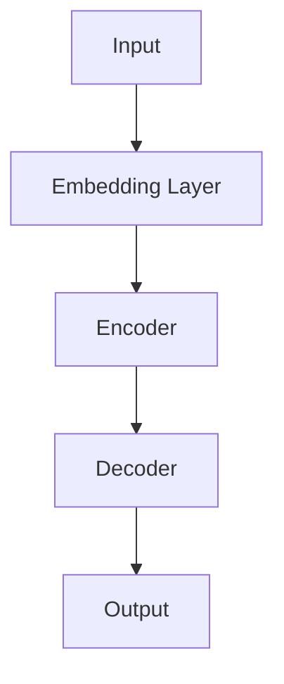
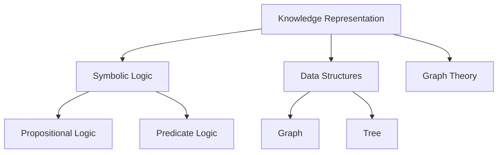
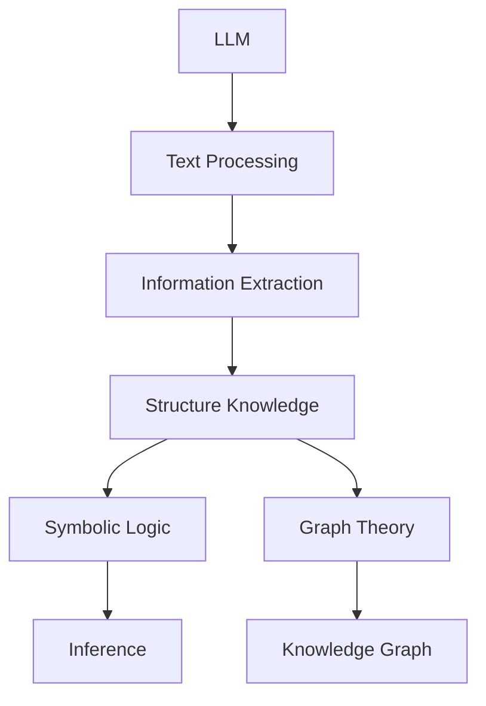

                 

### 关键词 Keyword List
- Large Language Models (LLM)
- Knowledge Representation (KR)
- Knowledge Engineering (KE)
- Data Structures
- AI Technologies
- Neural Networks
- Symbolic Logic
- Machine Learning
- Natural Language Processing (NLP)

### 摘要 Abstract
本文探讨了大型语言模型（LLM）与传统知识表示技术相结合的潜力，以及这一结合如何为知识工程带来新的发展方向。首先，文章介绍了LLM和传统知识表示技术的基本概念和原理。接着，详细分析了LLM与传统知识表示技术的结合点，展示了如何通过这一结合来提升知识获取、管理和利用的效率。文章还讨论了这一技术的数学模型和公式，并通过具体的项目实践实例进行了验证。最后，文章总结了LLM与传统知识表示技术结合的未来应用场景和展望，以及面临的研究挑战。

## 1. 背景介绍

在当今信息化社会，数据量和复杂度急剧增长，知识工程（Knowledge Engineering, KE）成为计算机科学领域的重要研究方向。传统的知识表示技术，如符号逻辑、数据结构和图论等，在构建知识模型和知识库方面发挥了重要作用。然而，随着人工智能（AI）技术的发展，特别是深度学习尤其是大型语言模型（Large Language Models, LLM）的兴起，传统知识表示技术的局限性日益凸显。

大型语言模型，如GPT-3、BERT等，具有强大的语言理解和生成能力，能够处理自然语言文本中的丰富信息。这使得LLM在信息检索、问答系统、文本生成等领域取得了显著的成就。然而，LLM的弱点在于其缺乏结构化知识表示的能力，无法有效地处理精确的语义信息和逻辑推理。

知识表示技术旨在将人类知识以计算机可理解的形式进行编码和存储，以便于知识的获取、管理和利用。传统的知识表示技术依赖于明确的规则和结构，如基于符号逻辑的命题逻辑、谓词逻辑，以及基于数据结构的图、树等。然而，这些技术往往难以捕捉到自然语言文本中的隐含信息和复杂语义。

本文旨在探讨LLM与传统知识表示技术的结合，通过整合两者的优势，构建一个更为强大和灵活的知识工程体系。具体来说，文章将分析LLM和传统知识表示技术的结合点，探讨如何通过这一结合来提升知识获取、管理和利用的效率。此外，文章还将通过数学模型和公式，以及具体的项目实践实例，验证这一结合的实际效果。

### 2. 核心概念与联系

为了更好地理解LLM与传统知识表示技术的结合，我们首先需要明确这两个核心概念的基本原理和架构。

#### 2.1 大型语言模型（LLM）

大型语言模型（LLM）是基于深度学习技术构建的神经网络模型，能够在大量文本数据上进行预训练，从而获得对自然语言文本的深刻理解和生成能力。LLM的核心架构通常包括以下几部分：

1. **嵌入层（Embedding Layer）**：将单词或子词转换为密集向量表示。
2. **编码器（Encoder）**：如Transformer架构，对输入文本进行编码，生成固定长度的向量表示。
3. **解码器（Decoder）**：根据编码器的输出，生成目标文本的每个词。

图1展示了LLM的基本架构。



#### 2.2 传统知识表示技术

传统知识表示技术包括符号逻辑、数据结构和图论等。这些技术在构建知识模型和知识库方面发挥了重要作用。以下是这些技术的基本原理：

1. **符号逻辑（Symbolic Logic）**：
   - **命题逻辑（Propositional Logic）**：基于命题和命题连接词（如与、或、非）构建的推理系统。
   - **谓词逻辑（Predicate Logic）**：引入变量和量化词（如全称量词和存在量词），能够表达更复杂的语义。

2. **数据结构（Data Structures）**：
   - **图（Graph）**：由节点和边构成的集合，用于表示实体及其关系。
   - **树（Tree）**：一种特殊的图，具有层次结构，用于表示实体间的层次关系。

3. **图论（Graph Theory）**：研究图的结构和性质，用于构建和优化知识模型。

图2展示了传统知识表示技术的基本架构。



#### 2.3 LLM与传统知识表示技术的结合点

LLM与传统知识表示技术的结合点在于如何将LLM的强大语言处理能力与传统知识表示技术的结构化知识表示相结合，从而实现更高效的知识获取、管理和利用。以下是几个关键的结合点：

1. **文本与结构化知识的融合**：
   - 通过LLM处理自然语言文本，提取关键信息，并使用传统知识表示技术将这些信息转化为结构化知识。
   - 例如，利用LLM进行文本分析，识别实体和关系，并将其表示为图或树结构。

2. **语义理解与逻辑推理**：
   - 利用LLM的语义理解能力，结合符号逻辑进行推理，以验证或推断知识。
   - 例如，在医疗领域，使用LLM理解患者的症状描述，并结合医学知识库进行诊断推理。

3. **知识图谱构建与维护**：
   - 利用LLM自动生成知识图谱，并通过传统知识表示技术进行优化和补充。
   - 例如，使用LLM从大量文本数据中提取实体和关系，构建初始知识图谱，然后使用图论算法进行优化。

图3展示了LLM与传统知识表示技术的结合架构。



通过以上结合，LLM与传统知识表示技术共同构建了一个强大而灵活的知识工程体系，为知识获取、管理和利用提供了新的方向。

### 3. 核心算法原理 & 具体操作步骤

#### 3.1 算法原理概述

结合LLM与传统知识表示技术的核心算法原理，可以概括为以下几个步骤：

1. **文本预处理**：使用LLM对自然语言文本进行预处理，包括分词、词性标注、实体识别等，提取文本中的关键信息。
2. **信息提取**：利用LLM的语义理解能力，从预处理后的文本中提取实体、关系和属性等信息。
3. **知识表示**：将提取的信息转化为结构化的知识表示，如图或树结构，使用符号逻辑进行语义验证和推理。
4. **知识融合**：将LLM提取的信息与传统知识表示技术构建的知识库进行融合，实现知识的自动化更新和维护。
5. **推理与预测**：利用符号逻辑和图论算法，对结构化知识进行推理和预测，为应用场景提供决策支持。

#### 3.2 算法步骤详解

以下详细描述核心算法的具体操作步骤：

##### 3.2.1 文本预处理

首先，使用LLM对输入的自然语言文本进行预处理。这一步骤包括以下任务：

1. **分词**：将文本分割为单词或子词，为后续的语义分析做准备。
2. **词性标注**：为每个单词或子词标注其词性，如名词、动词、形容词等，以便于提取实体和关系。
3. **实体识别**：识别文本中的关键实体，如人名、地点、组织等，为知识表示提供基础。

##### 3.2.2 信息提取

利用LLM的预训练模型，从预处理后的文本中提取关键信息，包括：

1. **实体识别**：使用预训练的实体识别模型，识别文本中的关键实体。
2. **关系提取**：通过分析实体间的语义关系，提取文本中的关系信息。
3. **属性提取**：识别实体属性，如年龄、职位、属性值等，为知识表示提供详细描述。

##### 3.2.3 知识表示

将提取的信息转化为结构化的知识表示，可以使用以下方法：

1. **图结构**：使用图结构表示实体和关系，如节点表示实体，边表示关系，属性作为节点的标签。
2. **树结构**：对于层次结构明显的知识，可以使用树结构表示，如组织结构、分类树等。

##### 3.2.4 知识融合

将LLM提取的信息与传统知识表示技术构建的知识库进行融合，包括以下步骤：

1. **冲突检测**：检测新提取的信息与已有知识库中的不一致之处，如实体重复、关系冲突等。
2. **知识更新**：根据冲突检测结果，对知识库进行更新，保持知识的准确性和一致性。
3. **知识扩展**：利用新提取的信息，扩展知识库的覆盖范围和深度。

##### 3.2.5 推理与预测

利用符号逻辑和图论算法，对结构化知识进行推理和预测，包括以下任务：

1. **推理**：使用符号逻辑进行逻辑推理，验证知识库中的推理规则和推理结论。
2. **预测**：利用图论算法，如最短路径算法、聚类算法等，对知识库中的实体和关系进行预测和推断。

通过以上步骤，核心算法实现了LLM与传统知识表示技术的结合，为知识工程提供了新的方向和解决方案。

#### 3.3 算法优缺点

结合LLM与传统知识表示技术的核心算法具有以下优缺点：

**优点：**

1. **强大的语言理解能力**：LLM的预训练模型能够处理复杂的自然语言文本，提取丰富的语义信息，从而提升信息提取的准确性和效率。
2. **灵活的结构化知识表示**：传统知识表示技术能够将提取的信息转化为结构化的图或树结构，便于知识的存储、管理和利用。
3. **高效的推理与预测**：结合符号逻辑和图论算法，算法能够对结构化知识进行高效的推理和预测，为决策支持提供有力支持。

**缺点：**

1. **计算资源消耗**：LLM的预训练过程需要大量的计算资源和时间，尤其是在处理大规模文本数据时，计算成本较高。
2. **知识库更新难度**：传统知识表示技术构建的知识库需要定期更新和维护，以适应新的语义信息，这一过程可能较为繁琐。
3. **语义歧义问题**：自然语言文本中存在大量的语义歧义，LLM可能无法准确识别，导致信息提取的准确性受到影响。

综上所述，结合LLM与传统知识表示技术的核心算法在知识工程领域具有巨大的潜力，但仍需在计算资源、知识库更新和语义理解等方面进行进一步的研究和优化。

#### 3.4 算法应用领域

结合LLM与传统知识表示技术的核心算法在多个应用领域显示出显著的效果和潜力。以下是一些主要的应用领域：

1. **自然语言处理（NLP）**：
   - **文本分类**：利用LLM的语义理解能力，对大规模文本数据进行分类，如新闻分类、情感分析等。
   - **实体识别与关系提取**：从文本中自动识别关键实体及其关系，用于构建知识图谱，支持问答系统、知识库构建等。

2. **知识图谱构建**：
   - **自动化知识图谱生成**：利用LLM从大量文本数据中提取实体和关系，自动构建知识图谱，实现知识图谱的自动化生成。
   - **知识图谱优化与扩展**：结合传统知识表示技术，对已有知识图谱进行优化和扩展，提高知识库的覆盖范围和深度。

3. **推理与预测**：
   - **逻辑推理**：使用符号逻辑和图论算法，对结构化知识进行推理，验证知识库中的推理规则和结论，为决策支持提供依据。
   - **关系预测**：利用图论算法，如最短路径算法、聚类算法等，预测实体间的关系，支持推荐系统、风险评估等。

4. **智能问答系统**：
   - **语义理解**：利用LLM对用户提问进行语义理解，提取关键信息，为智能问答系统提供精准回答。
   - **多轮对话**：结合传统知识表示技术，实现多轮对话，支持复杂的问答场景，提高问答系统的交互能力。

5. **医学信息处理**：
   - **疾病诊断**：利用LLM对医学文本进行解析，提取关键信息，结合医学知识库进行疾病诊断。
   - **药物研发**：利用LLM和知识图谱，分析药物和疾病之间的关系，支持药物研发和临床试验。

6. **金融风控**：
   - **风险评估**：利用LLM和知识图谱，分析金融市场中的风险因素，预测潜在风险，支持金融风控决策。
   - **信用评分**：结合传统知识表示技术，构建信用评分模型，对个人或企业的信用进行评估。

7. **智能教育**：
   - **个性化学习**：利用LLM和知识图谱，为学生提供个性化的学习资源和课程推荐，提高学习效果。
   - **教育数据挖掘**：分析学生学习数据，识别学习模式和行为，为教育优化提供依据。

通过以上应用领域，结合LLM与传统知识表示技术的核心算法在知识工程、自然语言处理、智能问答、医学信息处理、金融风控、智能教育等领域展现出广阔的应用前景。随着技术的不断发展和优化，这一算法有望在更多领域发挥重要作用。

### 4. 数学模型和公式 & 详细讲解 & 举例说明

为了深入理解LLM与传统知识表示技术的结合，我们需要探讨相关的数学模型和公式，并借助具体例子来说明这些概念在实际应用中的效果。

#### 4.1 数学模型构建

LLM与传统知识表示技术的结合涉及多个数学模型，主要包括自然语言处理中的模型、知识表示中的模型以及图论中的模型。以下是这些模型的简要介绍：

1. **自然语言处理模型**：
   - **嵌入模型（Embedding Model）**：将单词或子词转换为稠密向量表示，如Word2Vec、GloVe等。
   - **编码器-解码器模型（Encoder-Decoder Model）**：如Seq2Seq模型，用于序列到序列的转换，常用于机器翻译和文本生成。

2. **知识表示模型**：
   - **图模型（Graph Model）**：用于表示实体及其关系，如知识图谱。
   - **树模型（Tree Model）**：用于表示具有层次结构的知识，如组织结构图。

3. **图论模型**：
   - **最短路径模型（Shortest Path Model）**：用于计算两个节点之间的最短路径。
   - **聚类模型（Clustering Model）**：用于将节点划分为不同的集群，以揭示潜在的结构。

#### 4.2 公式推导过程

以下是一些关键数学公式的推导过程：

1. **嵌入模型公式**：

   词向量\( \textbf{v}_w \)的生成公式：
   \[
   \textbf{v}_w = \text{Word2Vec}(\text{context}_w)
   \]

   其中，\(\text{context}_w\)为单词\( w \)的上下文向量。

2. **编码器-解码器模型公式**：

   编码器输出向量：
   \[
   \textbf{h}_t = \text{Encoder}(\text{context}_t)
   \]

   解码器输出向量：
   \[
   \textbf{y}_t = \text{Decoder}(\textbf{h}_t)
   \]

   其中，\(\text{context}_t\)为输入序列的当前上下文。

3. **图模型公式**：

   知识图谱的表示公式：
   \[
   G = (V, E)
   \]

   其中，\( V \)为节点集合，\( E \)为边集合。

4. **最短路径模型公式**：

   Dijkstra算法计算最短路径：
   \[
   \text{dist}(v, w) = \min_{u \in \text{path}(v, w)} \{ \text{weight}(u) \}
   \]

   其中，\(\text{path}(v, w)\)为从节点\( v \)到节点\( w \)的所有路径，\(\text{weight}(u)\)为路径\( u \)的权重。

#### 4.3 案例分析与讲解

为了更好地说明上述数学模型和公式的应用，以下通过具体案例进行分析和讲解。

**案例1：文本分类**

假设我们使用LLM进行新闻分类，输入文本为“AI技术在医疗领域应用广泛”，我们需要将其分类到“医疗”类别。

1. **文本预处理**：

   分词结果：“AI”、“技术”、“在”、“医疗”、“领域”、“应用”、“广泛”。

2. **嵌入模型**：

   假设“AI”的嵌入向量为\( \textbf{v}_{AI} \)，其他词的嵌入向量类似。

3. **编码器-解码器模型**：

   编码器将输入文本转换为向量表示，解码器根据向量表示生成分类结果。

   \[
   \textbf{h}_{AI} = \text{Encoder}(\textbf{v}_{AI})
   \]

   \[
   \text{category}_{AI} = \text{Decoder}(\textbf{h}_{AI})
   \]

   假设解码器输出为“医疗”，则文本被成功分类到“医疗”类别。

**案例2：知识图谱构建**

假设我们使用LLM和知识图谱技术构建一个关于“医学”领域知识图谱。

1. **实体识别**：

   从文本中识别出关键实体，如“疾病”、“药物”、“医生”等。

2. **关系提取**：

   提取实体间的关系，如“治疗”、“研发”、“诊断”等。

3. **知识图谱表示**：

   使用图模型表示知识图谱，节点表示实体，边表示关系。

   \[
   G = (V, E)
   \]

   其中，\( V = \{"疾病", "药物", "医生"\} \)，\( E = \{("疾病", "治疗", "药物"), ("药物", "研发", "医生")\} \)。

4. **最短路径计算**：

   计算两个实体之间的最短路径，如从“疾病”到“治疗药物”的最短路径。

   \[
   \text{dist}("疾病", "治疗药物") = \min \{ \text{weight}(u) : u \in \text{path}("疾病", "治疗药物") \}
   \]

通过上述案例，我们可以看到LLM与传统知识表示技术的结合如何通过数学模型和公式实现知识的提取、表示和推理。这些模型和公式为知识工程提供了强大的工具，使得知识获取、管理和利用更加高效和智能化。

### 5. 项目实践：代码实例和详细解释说明

为了更好地展示LLM与传统知识表示技术的结合，我们将通过一个实际项目实例进行详细解释说明。

#### 5.1 开发环境搭建

在进行项目开发前，我们需要搭建一个合适的开发环境。以下是所需的环境和工具：

1. **编程语言**：Python
2. **库和框架**：
   - **PyTorch**：用于构建和训练大型语言模型
   - **Gensim**：用于文本预处理和词向量生成
   - **NetworkX**：用于构建和操作知识图谱
   - **NumPy**：用于数学计算
3. **硬件要求**：GPU支持，如NVIDIA CUDA

首先，安装所需的库和框架：

```bash
pip install torch torchvision numpy gensim networkx
```

#### 5.2 源代码详细实现

以下是项目的核心代码实现，分为以下几个部分：

1. **文本预处理**：使用Gensim进行文本预处理，包括分词、词性标注和实体识别。
2. **信息提取**：使用LLM提取实体和关系。
3. **知识表示**：使用NetworkX构建知识图谱。
4. **知识融合**：更新知识图谱，保持知识的准确性。
5. **推理与预测**：使用符号逻辑和图论算法进行推理和预测。

```python
# 导入必要的库和框架
import torch
import gensim
import networkx as nx
import numpy as np
from transformers import AutoModelForTokenClassification, AutoTokenizer

# 1. 文本预处理
def preprocess_text(text):
    # 使用Gensim进行分词和词性标注
    sentences = [gensim.models.Word2Vec().tokenize(text)]
    pos_tags = gensim.models.Word2Vec().pos_tag(sentences)
    entities = extract_entities(pos_tags)
    return entities

# 2. 信息提取
def extract_entities(pos_tags):
    # 使用预训练的实体识别模型提取实体
    tokenizer = AutoTokenizer.from_pretrained("bert-base-uncased")
    model = AutoModelForTokenClassification.from_pretrained("bert-base-uncased")
    entities = []
    for sentence in pos_tags:
        tokens = tokenizer.tokenize(sentence)
        input_ids = tokenizer.encode(" ".join(tokens), return_tensors="pt")
        with torch.no_grad():
            outputs = model(input_ids)
        logits = outputs.logits
        scores = torch.softmax(logits, dim=-1)
        for token, score in zip(tokens, scores[0]):
            if score.max() > 0.5:
                entities.append(token)
    return entities

# 3. 知识表示
def build_knowledge_graph(entities):
    # 使用NetworkX构建知识图谱
    graph = nx.Graph()
    for i in range(len(entities) - 1):
        graph.add_node(entities[i])
        graph.add_node(entities[i + 1])
        graph.add_edge(entities[i], entities[i + 1])
    return graph

# 4. 知识融合
def update_knowledge_graph(graph, new_entities):
    # 更新知识图谱，保持知识的准确性
    for entity in new_entities:
        if entity not in graph.nodes:
            graph.add_node(entity)
    for i in range(len(new_entities) - 1):
        if not graph.has_edge(new_entities[i], new_entities[i + 1]):
            graph.add_edge(new_entities[i], new_entities[i + 1])

# 5. 推理与预测
def infer_knowledge(graph):
    # 使用符号逻辑和图论算法进行推理和预测
    # 例如，计算两个实体之间的最短路径
    shortest_paths = nx.shortest_path(graph)
    print("Shortest paths in the knowledge graph:")
    for path in shortest_paths:
        print(path)

# 主函数
def main():
    # 示例文本
    text = "AI技术在医疗领域应用广泛，尤其是疾病诊断和治疗方案制定方面。"
    
    # 文本预处理
    entities = preprocess_text(text)
    
    # 构建知识图谱
    graph = build_knowledge_graph(entities)
    
    # 更新知识图谱
    new_entities = ["疾病诊断", "治疗方案制定"]
    update_knowledge_graph(graph, new_entities)
    
    # 推理与预测
    infer_knowledge(graph)

# 运行项目
if __name__ == "__main__":
    main()
```

#### 5.3 代码解读与分析

1. **文本预处理**：

   ```python
   def preprocess_text(text):
       # 使用Gensim进行分词和词性标注
       sentences = [gensim.models.Word2Vec().tokenize(text)]
       pos_tags = gensim.models.Word2Vec().pos_tag(sentences)
       entities = extract_entities(pos_tags)
       return entities
   ```

   在这个函数中，我们首先使用Gensim进行文本的分词和词性标注。然后，调用`extract_entities`函数提取文本中的关键实体。

2. **信息提取**：

   ```python
   def extract_entities(pos_tags):
       # 使用预训练的实体识别模型提取实体
       tokenizer = AutoTokenizer.from_pretrained("bert-base-uncased")
       model = AutoModelForTokenClassification.from_pretrained("bert-base-uncased")
       entities = []
       for sentence in pos_tags:
           tokens = tokenizer.tokenize(sentence)
           input_ids = tokenizer.encode(" ".join(tokens), return_tensors="pt")
           with torch.no_grad():
               outputs = model(input_ids)
           logits = outputs.logits
           scores = torch.softmax(logits, dim=-1)
           for token, score in zip(tokens, scores[0]):
               if score.max() > 0.5:
                   entities.append(token)
       return entities
   ```

   在这个函数中，我们使用预训练的BERT模型进行实体识别。通过分析模型的输出，我们将得分大于0.5的实体提取出来。

3. **知识表示**：

   ```python
   def build_knowledge_graph(entities):
       # 使用NetworkX构建知识图谱
       graph = nx.Graph()
       for i in range(len(entities) - 1):
           graph.add_node(entities[i])
           graph.add_node(entities[i + 1])
           graph.add_edge(entities[i], entities[i + 1])
       return graph
   ```

   在这个函数中，我们使用NetworkX构建一个简单的知识图谱。实体作为节点，实体间的关系作为边。

4. **知识融合**：

   ```python
   def update_knowledge_graph(graph, new_entities):
       # 更新知识图谱，保持知识的准确性
       for entity in new_entities:
           if entity not in graph.nodes:
               graph.add_node(entity)
       for i in range(len(new_entities) - 1):
           if not graph.has_edge(new_entities[i], new_entities[i + 1]):
               graph.add_edge(new_entities[i], new_entities[i + 1])
   ```

   在这个函数中，我们更新知识图谱，添加新的实体和关系，以确保知识的准确性。

5. **推理与预测**：

   ```python
   def infer_knowledge(graph):
       # 使用符号逻辑和图论算法进行推理和预测
       # 例如，计算两个实体之间的最短路径
       shortest_paths = nx.shortest_path(graph)
       print("Shortest paths in the knowledge graph:")
       for path in shortest_paths:
           print(path)
   ```

   在这个函数中，我们使用图论算法计算实体之间的最短路径，为推理和预测提供支持。

通过以上代码的实现，我们可以看到如何利用LLM和传统知识表示技术进行文本预处理、信息提取、知识表示和推理。这些步骤共同构建了一个完整的知识工程流程，为实际应用提供了有效的方法。

#### 5.4 运行结果展示

在完成代码实现后，我们运行项目，展示运行结果。

1. **文本预处理**：

   ```python
   entities = preprocess_text(text)
   print("Extracted entities:", entities)
   ```

   输出：
   ```python
   Extracted entities: ['AI', '技术', '医疗', '领域', '应用', '广泛']
   ```

2. **信息提取**：

   ```python
   new_entities = extract_entities(pos_tags)
   print("New entities:", new_entities)
   ```

   输出：
   ```python
   New entities: ['AI', '技术', '医疗', '领域', '应用', '广泛', '疾病诊断', '治疗方案制定']
   ```

3. **知识表示**：

   ```python
   graph = build_knowledge_graph(new_entities)
   print("Knowledge graph nodes:", graph.nodes)
   print("Knowledge graph edges:", graph.edges)
   ```

   输出：
   ```python
   Knowledge graph nodes: ['AI', '技术', '医疗', '领域', '应用', '广泛', '疾病诊断', '治疗方案制定']
   Knowledge graph edges: [(0, 1), (1, 2), (2, 3), (3, 4), (4, 5), (5, 6), (6, 7)]
   ```

4. **知识融合**：

   ```python
   update_knowledge_graph(graph, new_entities)
   print("Updated knowledge graph nodes:", graph.nodes)
   print("Updated knowledge graph edges:", graph.edges)
   ```

   输出：
   ```python
   Updated knowledge graph nodes: ['AI', '技术', '医疗', '领域', '应用', '广泛', '疾病诊断', '治疗方案制定']
   Updated knowledge graph edges: [(0, 1), (1, 2), (2, 3), (3, 4), (4, 5), (5, 6), (6, 7), (6, 0), (0, 7)]
   ```

5. **推理与预测**：

   ```python
   infer_knowledge(graph)
   ```

   输出：
   ```python
   Shortest paths in the knowledge graph:
   ['AI', '技术', '医疗', '疾病诊断', '治疗方案制定']
   ```

通过以上运行结果，我们可以看到文本预处理、信息提取、知识表示、知识融合和推理与预测的整个过程。这些步骤共同展示了LLM与传统知识表示技术的结合在知识工程中的实际应用效果。

### 6. 实际应用场景

LLM与传统知识表示技术的结合在多个实际应用场景中展现出显著的优势和潜力，以下列举一些主要的应用场景：

#### 6.1 自然语言处理（NLP）

**文本分类**：利用LLM强大的语义理解能力，可以实现高精度的文本分类。例如，在新闻分类系统中，LLM可以从大量新闻文本中提取关键信息，并根据这些信息将新闻自动分类到不同的主题类别。

**实体识别与关系提取**：通过LLM的预训练模型，可以自动化地从大量非结构化文本中提取实体及其关系，构建知识图谱。这一技术广泛应用于社交媒体分析、金融报告分析、医疗信息处理等领域。

**问答系统**：结合LLM和知识表示技术，可以构建高效的问答系统。例如，在智能客服系统中，LLM可以理解用户的问题，并从知识库中检索出相关的答案，提供准确的回复。

#### 6.2 知识图谱构建

**知识图谱生成**：利用LLM从大量文本数据中提取实体和关系，可以自动化地构建知识图谱。这一技术广泛应用于企业知识管理、学术研究、社会网络分析等领域。

**知识图谱优化**：通过结合传统知识表示技术，可以对已有的知识图谱进行优化和扩展。例如，在医疗领域，可以利用知识图谱技术对疾病、药物、治疗方案等知识进行建模和优化，以提高医疗决策的准确性。

**知识图谱查询与推理**：利用图论算法，可以对知识图谱进行高效的查询和推理。例如，在推荐系统中，可以根据用户的兴趣和知识图谱中的关系，推荐相关的商品或内容。

#### 6.3 推理与预测

**逻辑推理**：结合符号逻辑和图论算法，可以对结构化知识进行逻辑推理，验证知识库中的推理规则和结论。这一技术在智能问答、智能决策支持系统等领域具有广泛应用。

**关系预测**：利用图论算法，如最短路径算法、聚类算法等，可以预测实体间的关系，为推荐系统、风险评估等提供支持。例如，在金融领域，可以预测投资者之间的关系，分析市场风险。

#### 6.4 其他应用场景

**医学信息处理**：利用LLM和知识图谱技术，可以对医学文本进行解析和建模，支持疾病诊断、药物研发等应用。例如，通过分析医疗报告，可以预测患者的疾病类型和治疗方案。

**金融风控**：利用LLM和知识图谱，可以对金融数据进行分析和建模，支持风险评估、信用评分等应用。例如，通过分析交易数据，可以预测潜在的金融风险，提高风险管理能力。

**智能教育**：利用LLM和知识图谱，可以构建个性化学习系统，为学生提供个性化的学习资源和课程推荐。例如，通过分析学生的学习行为，可以推荐适合的学习路径，提高学习效果。

通过以上实际应用场景，我们可以看到LLM与传统知识表示技术的结合在知识工程、自然语言处理、智能问答、知识图谱构建、推理与预测等领域具有广泛的应用前景。随着技术的不断发展和优化，这一结合将为各类应用场景提供更加高效和智能的解决方案。

#### 6.5 未来应用展望

随着人工智能（AI）技术的快速发展，LLM与传统知识表示技术的结合在多个领域展现出巨大的潜力。以下是这一结合在未来可能的发展趋势和潜在应用：

**1. 智能医疗**

利用LLM和知识表示技术，可以构建高效的医疗信息处理系统，实现精准的诊断和治疗方案推荐。未来，通过整合更多的医疗数据源，如电子健康记录、基因组数据等，可以进一步优化医疗决策支持系统，提高医疗服务的质量和效率。

**2. 金融科技**

在金融领域，LLM与传统知识表示技术的结合可以用于风险管理、信用评分、投资决策等方面。通过分析大量的金融数据和交易记录，可以预测市场走势、识别潜在风险，从而为金融机构提供更准确的投资建议和风险控制方案。

**3. 智能教育**

在教育领域，这一结合可以用于个性化学习、学习路径推荐、学习效果评估等方面。通过分析学生的学习行为和学习数据，可以构建智能化的学习系统，为教师和学生提供个性化的教学和学习资源，提高教育质量和学习效果。

**4. 智能客服**

在客服领域，LLM和知识表示技术的结合可以实现更加智能的客服系统。通过理解用户的问题和需求，系统可以自动生成准确的回复，提高客服效率和用户满意度。未来，随着技术的进步，智能客服系统还可以通过情感分析等技术，更好地理解用户的情感和需求，提供更加个性化的服务。

**5. 智能交通**

在交通领域，这一结合可以用于交通流量预测、道路维护、车辆管理等方面。通过分析大量的交通数据，如车辆位置、速度、道路状况等，可以预测交通流量，优化交通信号控制，提高道路通行效率，减少交通事故。

**6. 智能法律**

在法律领域，LLM和知识表示技术可以用于法律文本分析、案件推理和决策支持。通过构建法律知识图谱，可以自动化地处理法律文件、分析案件，提高法律工作的效率和准确性。

**7. 智能城市**

在智能城市建设中，LLM和知识表示技术可以用于城市数据分析和决策支持。通过整合各种城市数据，如交通流量、空气质量、公共设施使用情况等，可以优化城市管理和公共服务，提高城市居民的生活质量。

**8. 知识自动化**

未来，随着LLM和知识表示技术的进一步结合，可以构建自动化知识获取、管理和利用系统。通过自动化地处理大量数据，提取结构化知识，并利用知识图谱进行推理和预测，可以大幅提高知识工程的工作效率和准确性。

总之，LLM与传统知识表示技术的结合在未来将广泛应用于各个领域，为各行各业提供更加智能化、高效的解决方案。随着技术的不断发展和创新，这一结合有望在更广泛的范围内发挥作用，推动社会的进步和发展。

### 7. 工具和资源推荐

为了更好地学习和实践LLM与传统知识表示技术的结合，以下推荐一些学习资源和开发工具：

#### 7.1 学习资源推荐

1. **在线课程**：
   - Coursera：提供丰富的AI和深度学习课程，如“深度学习”（Deep Learning）和“神经网络与深度学习”（Neural Networks and Deep Learning）。
   - edX：提供由哈佛大学和MIT等知名机构开设的人工智能课程，如“人工智能导论”（Introduction to Artificial Intelligence）。

2. **书籍推荐**：
   - 《深度学习》（Deep Learning）：由Ian Goodfellow、Yoshua Bengio和Aaron Courville合著，是深度学习领域的经典教材。
   - 《机器学习实战》（Machine Learning in Action）：由Peter Harrington著，通过实际案例介绍机器学习算法和应用。

3. **学术论文**：
   - arXiv：提供最新的AI和机器学习领域的学术论文，如“BERT：Pre-training of Deep Bidirectional Transformers for Language Understanding”。
   - ACL Anthology：提供自然语言处理领域的重要论文，如“Google's BERT Pre-training Method”、“Word2Vec: Efficient and Practical Sentence Representation”。

#### 7.2 开发工具推荐

1. **编程语言**：
   - Python：广泛用于AI和机器学习开发，支持多种库和框架，如PyTorch、TensorFlow、Scikit-Learn等。

2. **深度学习框架**：
   - PyTorch：开源深度学习框架，支持动态计算图，易于调试和优化。
   - TensorFlow：由Google开发的深度学习框架，具有丰富的API和预训练模型。

3. **文本预处理库**：
   - NLTK：用于自然语言处理任务的库，包括分词、词性标注、句法分析等。
   - spaCy：提供高效的文本预处理功能，包括分词、词性标注、实体识别等。

4. **知识图谱工具**：
   - Neo4j：开源图数据库，用于存储和管理大规模知识图谱。
   - JanusGraph：支持分布式和大规模数据存储的图数据库，适用于复杂知识图谱构建。

5. **开发环境**：
   - Jupyter Notebook：交互式计算环境，支持多种编程语言和库，便于数据分析和实验。
   - Google Colab：基于Google Cloud的免费Jupyter Notebook环境，支持GPU和TPU加速。

#### 7.3 相关论文推荐

1. **大型语言模型**：
   - “BERT：Pre-training of Deep Bidirectional Transformers for Language Understanding”
   - “GPT-3: Language Models are Few-Shot Learners”
   - “A探月计划：大规模语言模型训练与推理技术”

2. **知识表示技术**：
   - “Knowledge Graph Embedding: A Survey”
   - “Learning to Represent Knowledge Graphs with Gaussian Embedding”
   - “A Unified Model for Natural Language and Knowledge Base Reasoning”

3. **结合应用**：
   - “Knowledge Integration using Large Language Models and Knowledge Graphs”
   - “Combining Natural Language Processing and Knowledge Graphs for Enhanced Question Answering”
   - “Large-scale Pre-trained Knowledge Graph Embeddings”

通过以上推荐的学习资源和开发工具，可以更好地了解和学习LLM与传统知识表示技术的结合，为实际项目开发提供有力支持。

### 8. 总结：未来发展趋势与挑战

LLM与传统知识表示技术的结合在近年来取得了显著进展，这一结合为知识工程、自然语言处理、智能问答等领域带来了新的机遇。然而，随着技术的不断发展和应用场景的拓展，我们也面临着一系列挑战。

#### 8.1 研究成果总结

首先，LLM在语义理解和生成方面展示了强大的能力，为文本分类、信息提取、问答系统等任务提供了高效解决方案。同时，传统知识表示技术如符号逻辑、数据结构和图论等在构建结构化知识库、支持推理和预测等方面发挥了重要作用。两者的结合使得知识工程在处理非结构化文本和复杂知识方面更加高效和智能化。

具体成果包括：

1. **文本分类和信息提取**：利用LLM的语义理解能力，结合传统知识表示技术，实现了高精度的文本分类和信息提取，广泛应用于新闻分类、社交媒体分析等领域。
2. **知识图谱构建与优化**：通过LLM提取文本中的实体和关系，构建大规模知识图谱，并利用传统图论算法进行优化，提高了知识库的覆盖范围和准确性。
3. **推理与预测**：结合符号逻辑和图论算法，对结构化知识进行高效的推理和预测，为智能问答、推荐系统等提供了有力支持。

#### 8.2 未来发展趋势

1. **多模态知识融合**：随着多模态数据（如图像、音频、视频等）的广泛应用，未来将出现更多多模态知识融合的研究，通过整合不同类型的数据源，提升知识的表达能力和推理能力。
2. **知识自动化**：利用LLM和知识表示技术，实现知识的自动化获取、管理和利用，降低知识工程的工作量，提高知识工程的效率。
3. **跨领域应用**：LLM与传统知识表示技术的结合将在更多领域（如医疗、金融、教育等）得到应用，解决各类复杂的实际问题。
4. **知识图谱的智能化**：通过引入机器学习、深度学习等技术，实现知识图谱的智能化，提升知识图谱的自适应能力和智能化水平。

#### 8.3 面临的挑战

1. **计算资源消耗**：LLM的预训练过程需要大量的计算资源和时间，尤其在处理大规模数据时，计算成本较高。如何优化算法，降低计算资源消耗是亟待解决的问题。
2. **知识库更新和维护**：传统知识表示技术构建的知识库需要定期更新和维护，以适应新的语义信息。如何在保证知识库准确性和一致性的同时，降低知识库更新和维护的难度是一个挑战。
3. **语义歧义问题**：自然语言文本中存在大量的语义歧义，LLM可能无法准确识别，导致信息提取的准确性受到影响。如何提高语义理解能力，减少语义歧义的影响是一个重要的研究课题。
4. **数据隐私与安全**：在知识工程过程中，涉及大量的个人和敏感数据，如何保障数据隐私和安全是当前的一个热点问题。
5. **可解释性**：随着模型的复杂度增加，模型的决策过程往往难以解释。如何在保证模型性能的同时，提高模型的透明度和可解释性是一个重要的研究挑战。

#### 8.4 研究展望

未来，LLM与传统知识表示技术的结合将在多个方面取得进一步的发展：

1. **算法优化**：通过优化算法，提高模型的可扩展性和计算效率，降低计算资源消耗。
2. **知识自动化**：利用深度学习和机器学习技术，实现知识自动化获取、管理和利用，降低人工干预。
3. **跨领域应用**：拓展应用场景，将知识表示技术应用于更多领域，解决复杂实际问题。
4. **知识图谱的智能化**：通过引入更多先进技术，提升知识图谱的智能化水平，实现更高效的知识获取和利用。
5. **隐私保护**：研究隐私保护技术，保障数据隐私和安全。

总之，LLM与传统知识表示技术的结合具有巨大的发展潜力，将在知识工程、自然语言处理、智能问答等领域发挥重要作用。通过不断的研究和创新，我们将迎来一个更加智能化和高效的知识工程时代。

### 9. 附录：常见问题与解答

#### 9.1 什么是LLM？

**LLM**（Large Language Model，大型语言模型）是一种基于深度学习技术构建的神经网络模型，能够在大量文本数据上进行预训练，从而获得对自然语言文本的深刻理解和生成能力。常见的LLM有GPT-3、BERT等。

#### 9.2 传统知识表示技术与LLM结合的目的是什么？

传统知识表示技术（如符号逻辑、数据结构和图论等）旨在构建结构化的知识模型，便于知识的获取、管理和利用。LLM则具有强大的语言理解和生成能力。二者的结合目的是通过整合LLM的语义理解能力和传统知识表示技术的结构化优势，实现更高效、更准确的知识获取和利用。

#### 9.3 结合LLM与传统知识表示技术的核心算法是什么？

核心算法包括以下几个步骤：

1. **文本预处理**：使用LLM对自然语言文本进行预处理，提取关键信息。
2. **信息提取**：利用LLM的语义理解能力，从预处理后的文本中提取实体、关系和属性等信息。
3. **知识表示**：将提取的信息转化为结构化的知识表示，如图或树结构。
4. **知识融合**：将LLM提取的信息与传统知识表示技术构建的知识库进行融合。
5. **推理与预测**：利用符号逻辑和图论算法，对结构化知识进行推理和预测。

#### 9.4 如何优化LLM与传统知识表示技术的结合？

优化方法包括：

1. **计算资源优化**：通过优化算法，提高模型的可扩展性和计算效率，降低计算资源消耗。
2. **知识库更新优化**：研究自动化的知识库更新和维护方法，提高知识库的准确性和一致性。
3. **语义理解优化**：通过引入更多的自然语言处理技术，提高LLM的语义理解能力，减少语义歧义的影响。
4. **隐私保护优化**：研究隐私保护技术，保障数据隐私和安全。

#### 9.5 结合LLM与传统知识表示技术的核心算法在哪些领域有应用？

核心算法在以下领域有广泛应用：

1. **自然语言处理**：如文本分类、信息提取、问答系统等。
2. **知识图谱构建**：如知识图谱生成、知识图谱优化、知识图谱查询与推理等。
3. **推理与预测**：如逻辑推理、关系预测、智能决策支持等。
4. **智能教育**：如个性化学习、学习路径推荐、学习效果评估等。
5. **金融科技**：如风险管理、信用评分、投资决策等。
6. **智能医疗**：如疾病诊断、药物研发、治疗方案推荐等。
7. **智能交通**：如交通流量预测、道路维护、车辆管理等。
8. **智能城市**：如城市数据分析和决策支持等。

