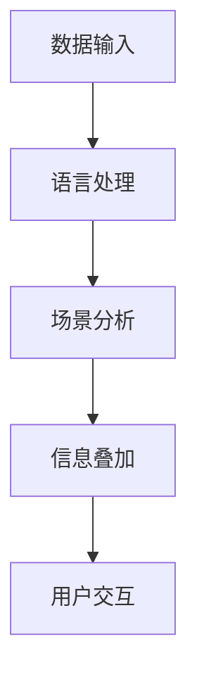

                 

关键词：增强现实，大型语言模型（LLM），人机交互，虚拟现实，技术融合，应用场景

> 摘要：随着人工智能技术的飞速发展，增强现实（AR）技术逐渐成为新的热点。本文将探讨如何将大型语言模型（LLM）与增强现实技术相结合，分析其在人机交互、虚拟现实等多个领域中的潜在应用，并展望未来的发展趋势与挑战。

## 1. 背景介绍

增强现实（AR）技术是一种将数字信息叠加到现实世界中的技术，通过特定的设备，如智能手机、平板电脑或头戴式显示器，用户能够看到增强的视图。近年来，随着计算能力的提升和传感器技术的进步，AR技术得到了广泛应用，从娱乐游戏到教育医疗，从工业制造到军事训练。

另一方面，大型语言模型（LLM）是自然语言处理（NLP）领域的重要进展。LLM通过深度学习算法，能够理解和生成人类语言，进行对话、文本生成、语言翻译等任务。典型的LLM包括GPT-3、BERT等，这些模型具有处理大量文本数据的能力，且性能卓越。

本文旨在探讨如何将LLM与AR技术相结合，利用两者的优势，创造出新的交互体验和应用场景。

## 2. 核心概念与联系

### 2.1 增强现实技术原理

增强现实技术主要依赖于摄像头、屏幕、传感器和处理器。其基本原理是通过摄像头捕捉现实世界的图像，然后利用计算机视觉技术对图像进行处理和分析，将虚拟信息叠加到真实场景中。

### 2.2 大型语言模型（LLM）原理

LLM是基于神经网络模型的，通过深度学习从大量文本数据中学习语言模式和结构。它们能够进行自然语言理解、生成和翻译等任务。

### 2.3 LLM与AR技术的结合架构

为了实现LLM与AR技术的结合，我们通常需要一个架构，它包括以下组件：

1. **数据输入**：用户通过语音或文本输入指令。
2. **语言处理**：LLM对输入的指令进行处理和理解。
3. **场景分析**：AR系统分析现实世界的图像和场景。
4. **信息叠加**：将处理后的信息以AR形式叠加到现实场景中。
5. **用户交互**：用户与AR场景进行交互，获得增强的体验。

### 2.4 Mermaid 流程图



## 3. 核心算法原理 & 具体操作步骤

### 3.1 算法原理概述

结合LLM与AR的核心算法包括自然语言处理（NLP）和增强现实（AR）算法。NLP负责理解用户的输入，AR算法则负责将处理后的信息叠加到现实场景中。

### 3.2 算法步骤详解

1. **数据输入**：用户通过语音或文本输入指令。
2. **语言处理**：LLM对输入的指令进行处理，生成语义理解。
3. **场景分析**：AR系统通过摄像头捕捉现实世界的图像，并使用计算机视觉算法进行分析。
4. **信息叠加**：根据语义理解和场景分析结果，生成AR内容。
5. **用户交互**：用户在AR环境中与叠加的虚拟信息进行交互。

### 3.3 算法优缺点

**优点**：
- **人机交互自然**：通过自然语言处理，用户无需学习特定操作界面。
- **增强现实体验**：虚拟信息与真实世界的结合，提供更加丰富的交互体验。

**缺点**：
- **计算资源要求高**：LLM和AR算法都依赖于强大的计算资源。
- **隐私和安全问题**：处理用户输入和生成虚拟信息可能涉及隐私和安全问题。

### 3.4 算法应用领域

- **教育**：利用AR技术，将抽象的知识点以更直观的方式呈现给学生。
- **医疗**：医生可以通过AR技术查看患者的实时信息，提高诊断和治疗的效率。
- **军事**：士兵在执行任务时，可以实时获取战场情报，提高战斗力。
- **娱乐**：游戏和电影中，AR技术可以为用户提供更加沉浸的体验。

## 4. 数学模型和公式 & 详细讲解 & 举例说明

### 4.1 数学模型构建

在结合LLM与AR技术的过程中，我们通常需要构建以下数学模型：

- **自然语言处理模型**：如GPT-3、BERT等。
- **计算机视觉模型**：如YOLO、SSD等。

### 4.2 公式推导过程

- **自然语言处理模型**：采用深度学习算法，如反向传播算法，对大量文本数据进行训练。
- **计算机视觉模型**：采用卷积神经网络（CNN）对图像进行特征提取和分类。

### 4.3 案例分析与讲解

#### 案例一：AR导航系统

1. **问题描述**：用户需要在一个陌生的城市中找到某个地点。
2. **解决方案**：使用AR技术，将导航信息叠加到用户的视野中。
3. **数学模型**：利用LLM处理用户的语音输入，计算机视觉模型分析环境图像，并将导航信息以AR形式显示。

#### 案例二：AR教育应用

1. **问题描述**：学生需要更直观地理解抽象的知识点。
2. **解决方案**：使用AR技术，将虚拟模型叠加到现实场景中。
3. **数学模型**：利用LLM生成虚拟模型的描述性文本，计算机视觉模型识别现实场景，并将虚拟模型叠加。

## 5. 项目实践：代码实例和详细解释说明

### 5.1 开发环境搭建

1. **硬件环境**：配备摄像头和显示器的计算机。
2. **软件环境**：安装Python环境，并配置TensorFlow和OpenCV库。

### 5.2 源代码详细实现

```python
# 这是一个简单的AR导航系统示例

import cv2
import numpy as np
import tensorflow as tf

# 加载计算机视觉模型
model = tf.keras.models.load_model('path/to/your/model')

# 加载自然语言处理模型
llm = tf.keras.models.load_model('path/to/your/llm_model')

# 摄像头捕获实时图像
cap = cv2.VideoCapture(0)

while True:
    # 读取图像
    ret, frame = cap.read()
    
    # 对图像进行处理
    processed_frame = preprocess_frame(frame)
    
    # 使用计算机视觉模型进行分析
    predictions = model.predict(processed_frame)
    
    # 根据预测结果生成AR内容
    ar_content = generate_ar_content(predictions)
    
    # 将AR内容叠加到原始图像上
    output_frame = overlay_ar_content(frame, ar_content)
    
    # 显示叠加后的图像
    cv2.imshow('AR Navigation', output_frame)
    
    if cv2.waitKey(1) & 0xFF == ord('q'):
        break

# 释放摄像头资源
cap.release()
cv2.destroyAllWindows()
```

### 5.3 代码解读与分析

- **摄像头捕获图像**：使用OpenCV库捕获实时图像。
- **模型加载**：加载计算机视觉模型和自然语言处理模型。
- **图像处理**：对捕获的图像进行预处理，以便于模型分析。
- **模型分析**：使用计算机视觉模型对预处理后的图像进行预测，并使用LLM生成AR内容。
- **图像叠加**：将AR内容叠加到原始图像上，形成最终的增强现实图像。
- **显示输出**：将叠加后的图像显示在屏幕上。

### 5.4 运行结果展示

运行上述代码后，摄像头捕获的实时图像将显示在屏幕上。根据计算机视觉模型的预测结果，导航信息将以AR形式叠加到图像中，用户可以看到叠加的导航标记，从而更直观地找到目的地。

## 6. 实际应用场景

### 6.1 教育领域

AR技术可以用于教育领域，帮助学生更直观地理解抽象的知识点。例如，在生物学课程中，学生可以通过AR技术观察细胞的结构和功能，甚至在数学课程中，学生可以通过AR技术构建和操作三维几何图形。

### 6.2 医疗领域

在医疗领域，AR技术可以帮助医生更准确地诊断和治疗疾病。医生可以通过AR设备查看患者的实时信息，如心电图、血压等，从而提高诊断的准确性。

### 6.3 军事领域

在军事领域，AR技术可以帮助士兵在执行任务时获取实时情报。例如，在战场中，士兵可以通过AR设备查看敌人的位置、地形等信息，从而更好地制定战术。

### 6.4 娱乐领域

在娱乐领域，AR技术可以为用户提供更加沉浸的体验。例如，在游戏中，玩家可以通过AR技术看到游戏中的虚拟角色在现实世界中移动和互动，从而增加游戏的趣味性。

## 7. 工具和资源推荐

### 7.1 学习资源推荐

- 《深度学习》（Goodfellow et al.）
- 《计算机视觉：算法与应用》（Richard Szeliski）
- 《自然语言处理综论》（Daniel Jurafsky and James H. Martin）

### 7.2 开发工具推荐

- TensorFlow：用于构建和训练深度学习模型。
- OpenCV：用于计算机视觉任务的图像处理和特征提取。
- Unity：用于开发AR和VR应用。

### 7.3 相关论文推荐

- “Large-scale Language Modeling for Speech Recognition” （Awni Y. Hannun et al.）
- “Real-time Scene Understanding with Multi-task Learning” （Fei-Fei Li et al.）
- “Generative Adversarial Networks for Real-time Image-to-Image Translation” （Jia-Yu Wu et al.）

## 8. 总结：未来发展趋势与挑战

### 8.1 研究成果总结

结合LLM与AR技术的应用已经取得了显著的成果，包括教育、医疗、军事和娱乐等多个领域。这种技术的优势在于提供了更加自然和直观的交互体验。

### 8.2 未来发展趋势

随着计算能力的提升和算法的优化，LLM与AR技术的结合将进一步发展，其应用范围也将不断扩大。未来的研究重点可能包括更高效的算法、更好的隐私保护和安全性等。

### 8.3 面临的挑战

尽管LLM与AR技术的结合具有巨大潜力，但也面临着一些挑战，如计算资源的高要求、隐私和安全问题、算法的优化和改进等。

### 8.4 研究展望

未来的研究可以在以下几个方面进行：1）开发更高效的算法；2）解决隐私和安全问题；3）探索新的应用场景；4）促进跨领域合作。

## 9. 附录：常见问题与解答

### 9.1 常见问题

1. **什么是LLM？**
   - LLM（大型语言模型）是一种基于深度学习的自然语言处理模型，能够理解和生成人类语言。

2. **什么是AR技术？**
   - AR（增强现实）技术是一种将虚拟信息叠加到现实世界中的技术，通过特定的设备，用户能够看到增强的视图。

3. **LLM与AR技术如何结合？**
   - LLM与AR技术的结合通常通过以下步骤实现：用户输入 → 语言处理 → 场景分析 → 信息叠加 → 用户交互。

### 9.2 解答

1. **什么是LLM？**
   - LLM（Large Language Model）是一种在自然语言处理（NLP）领域广泛应用的人工智能模型，它能够理解和生成人类语言。LLM通常通过训练大量的文本数据来学习语言的模式和结构，从而实现文本生成、对话系统、文本分类、机器翻译等多种任务。

2. **什么是AR技术？**
   - AR（Augmented Reality，增强现实）是一种将数字信息叠加到现实世界中的技术。通过使用特定的设备，如智能手机、平板电脑或头戴式显示器，用户可以在现实世界的视野中看到增强的视图，这些视图可以是虚拟的图像、文字、三维模型等。

3. **LLM与AR技术如何结合？**
   - LL

