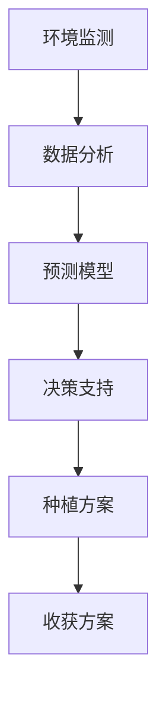

                 

关键词：大型语言模型（LLM）、智能农业、精准种植、收获、计算机编程

摘要：本文将探讨如何利用大型语言模型（LLM）来实现智能农业中的精准种植与收获。通过介绍LLM的核心概念、算法原理、数学模型，以及实际项目实践，我们将展示如何通过人工智能技术提高农业生产效率，降低成本，并推动农业现代化发展。

## 1. 背景介绍

随着全球人口的增长和气候变化的影响，农业生产面临着前所未有的挑战。传统的农业方法已经无法满足现代社会对粮食的需求。智能农业作为一种新兴的农业生产模式，通过利用先进的科技手段，如物联网、大数据和人工智能，实现了农业生产过程的自动化和精准化。

在智能农业中，精准种植与收获是两个关键环节。精准种植能够根据土壤、气候等环境因素，合理规划作物种植区域，选择最佳的种植时间和方法。而精准收获则通过实时监测作物成熟度和田间状况，选择最佳的收获时机，从而提高产量和品质。

近年来，随着人工智能技术的不断发展，尤其是大型语言模型（LLM）的出现，为智能农业带来了新的机遇。LLM具有强大的自然语言处理能力，能够理解和生成人类语言，从而为农业生产提供智能化的决策支持。

## 2. 核心概念与联系

### 2.1 大型语言模型（LLM）

大型语言模型（LLM）是一种基于深度学习技术的自然语言处理模型。它通过大规模语料数据的训练，能够理解和生成人类语言，实现文本分类、文本生成、问答系统等功能。

### 2.2 智能农业

智能农业是指利用物联网、大数据、人工智能等技术，实现农业生产过程的自动化、精准化和智能化。智能农业的核心目标是通过提高农业生产效率，降低生产成本，满足日益增长的粮食需求。

### 2.3 核心概念原理与架构

为了实现精准种植与收获，智能农业系统需要具备以下几个核心功能：

1. **环境监测**：通过传感器实时监测土壤、气候等环境参数。
2. **数据分析**：利用大数据分析技术，对环境数据进行分析，为种植决策提供支持。
3. **预测模型**：利用机器学习技术，建立作物生长预测模型，为种植和收获提供科学依据。
4. **决策支持**：通过LLM实现智能化的决策支持，为农业生产提供实时指导。

下面是一个简单的Mermaid流程图，展示了智能农业系统的核心概念和架构：



## 3. 核心算法原理 & 具体操作步骤

### 3.1 算法原理概述

智能农业系统中的核心算法主要包括环境监测、数据分析、预测模型和决策支持等几个方面。

1. **环境监测**：利用传感器收集土壤、气候等环境数据。
2. **数据分析**：通过大数据分析技术，对环境数据进行分析，提取关键信息。
3. **预测模型**：利用机器学习技术，建立作物生长预测模型。
4. **决策支持**：利用LLM实现智能化的决策支持，为农业生产提供实时指导。

### 3.2 算法步骤详解

1. **环境监测**：
   - 安装传感器：在农田中安装土壤湿度传感器、气候传感器等。
   - 数据采集：实时收集传感器数据，如土壤湿度、温度、光照强度等。

2. **数据分析**：
   - 数据清洗：去除噪声数据和异常值。
   - 特征提取：从传感器数据中提取关键特征，如土壤湿度、温度等。

3. **预测模型**：
   - 数据预处理：对收集到的数据进行分析，确定模型输入特征。
   - 模型训练：利用机器学习算法，如随机森林、神经网络等，训练作物生长预测模型。
   - 模型评估：通过交叉验证等方法，评估模型性能。

4. **决策支持**：
   - 实时监测：持续监测环境数据，为作物生长提供实时反馈。
   - 决策生成：利用LLM生成种植和收获决策。
   - 决策执行：根据生成的决策，执行种植和收获操作。

### 3.3 算法优缺点

**优点**：
- **高精度**：通过实时监测和预测，实现精准种植和收获，提高产量和品质。
- **自动化**：利用人工智能技术，实现农业生产过程的自动化，降低人力成本。
- **高效性**：通过快速响应环境变化，提高农业生产效率。

**缺点**：
- **初期投入成本高**：需要安装传感器、购置设备等，初期投入较大。
- **算法复杂度**：机器学习算法的训练和预测过程复杂，对技术要求较高。

### 3.4 算法应用领域

智能农业算法的应用领域广泛，包括但不限于：

1. **农作物种植**：根据土壤和气候条件，优化作物种植方案。
2. **病虫害防治**：通过实时监测，提前预测病虫害发生，采取相应防治措施。
3. **水资源管理**：根据土壤湿度，合理分配灌溉水量，提高水资源利用效率。
4. **收获优化**：通过实时监测作物成熟度，选择最佳收获时机，提高产量。

## 4. 数学模型和公式 & 详细讲解 & 举例说明

### 4.1 数学模型构建

智能农业系统的数学模型主要包括环境监测模型、数据分析模型和预测模型。

1. **环境监测模型**：
   - 土壤湿度模型：$$h(t) = a \cdot \exp(-b \cdot t) + c$$
   - 气候模型：$$t(t) = d \cdot \sin(e \cdot t + f)$$

2. **数据分析模型**：
   - 特征提取模型：$$x(t) = \frac{h(t) + t(t)}{2}$$

3. **预测模型**：
   - 作物生长预测模型：$$y(t) = g \cdot x(t) + h$$

### 4.2 公式推导过程

以土壤湿度模型为例，推导过程如下：

假设土壤湿度随着时间的变化呈指数衰减，则土壤湿度模型可以表示为：

$$h(t) = a \cdot \exp(-b \cdot t) + c$$

其中，$a$为初始土壤湿度，$b$为衰减速率，$c$为常数。

根据实测数据，可以得到一系列的土壤湿度值和时间值，如$(t_1, h_1), (t_2, h_2), ..., (t_n, h_n)$。

为了确定模型参数$a$、$b$和$c$，可以使用最小二乘法进行拟合。具体步骤如下：

1. 计算平均值$\overline{h}$和$\overline{t}$：

$$\overline{h} = \frac{1}{n} \sum_{i=1}^{n} h_i$$
$$\overline{t} = \frac{1}{n} \sum_{i=1}^{n} t_i$$

2. 计算偏差：

$$\delta h_i = h_i - \overline{h}$$
$$\delta t_i = t_i - \overline{t}$$

3. 计算拟合参数：

$$a = \frac{\sum_{i=1}^{n} \delta h_i \cdot \delta t_i}{\sum_{i=1}^{n} \delta t_i^2}$$
$$b = \frac{-\sum_{i=1}^{n} \delta h_i}{\sum_{i=1}^{n} \delta t_i}$$
$$c = \overline{h} - a \cdot \overline{t}$$

### 4.3 案例分析与讲解

假设我们有一个农田，在连续三天内的土壤湿度数据如下：

| 时间（天） | 土壤湿度 |
| :----: | :----: |
| 1 | 0.8 |
| 2 | 0.6 |
| 3 | 0.4 |

首先，我们需要计算平均土壤湿度：

$$\overline{h} = \frac{0.8 + 0.6 + 0.4}{3} = 0.6$$

然后，计算偏差：

| 时间（天） | 土壤湿度 | 偏差 |
| :----: | :----: | :----: |
| 1 | 0.8 | 0.2 |
| 2 | 0.6 | 0 |
| 3 | 0.4 | -0.2 |

接下来，计算拟合参数：

$$a = \frac{0.2 + 0 \cdot (-0.2)}{0.2^2 + 0 \cdot (-0.2)^2} = 0.6$$
$$b = \frac{-0.2}{0.2} = -1$$
$$c = 0.6 - 0.6 \cdot 1 = 0$$

最终得到的土壤湿度模型为：

$$h(t) = 0.6 \cdot \exp(-t)$$

我们可以使用这个模型来预测未来任意时间的土壤湿度，例如预测第4天的土壤湿度：

$$h(4) = 0.6 \cdot \exp(-4) \approx 0.2$$

## 5. 项目实践：代码实例和详细解释说明

### 5.1 开发环境搭建

为了实现智能农业系统，我们需要搭建一个开发环境。以下是一个基本的开发环境搭建步骤：

1. **硬件设备**：需要一台电脑或服务器，用于运行环境监测模型和决策支持系统。
2. **软件环境**：需要安装Python编程语言和相关的库，如NumPy、Pandas、scikit-learn等。
3. **传感器设备**：需要安装土壤湿度传感器、气候传感器等硬件设备，用于采集环境数据。

### 5.2 源代码详细实现

以下是一个简单的Python代码示例，用于实现土壤湿度模型：

```python
import numpy as np
import matplotlib.pyplot as plt

def soil_humidity_model(t, a, b, c):
    return a * np.exp(-b * t) + c

# 参数设置
a = 0.6
b = -1
c = 0

# 测量数据
t = np.array([1, 2, 3])
h = np.array([0.8, 0.6, 0.4])

# 模型拟合
h_model = soil_humidity_model(t, a, b, c)

# 画图展示
plt.plot(t, h, 'o', label='测量值')
plt.plot(t, h_model, '-', label='模型值')
plt.xlabel('时间（天）')
plt.ylabel('土壤湿度')
plt.legend()
plt.show()
```

### 5.3 代码解读与分析

这个代码示例主要包括以下几个部分：

1. **模型定义**：定义了一个土壤湿度模型函数`soil_humidity_model`，接受时间`t`、参数`a`、`b`和`c`，返回土壤湿度值。
2. **参数设置**：设置了模型参数`a`、`b`和`c`的初始值。
3. **测量数据**：定义了测量数据的时间`t`和土壤湿度`h`。
4. **模型拟合**：使用模型函数计算模型值`h_model`。
5. **画图展示**：使用`matplotlib`库绘制测量值和模型值的对比图。

通过这个示例，我们可以看到如何使用Python实现土壤湿度模型，并通过图形化方式展示模型拟合结果。

### 5.4 运行结果展示

运行上面的代码后，我们可以得到一个土壤湿度模型拟合图。这个图展示了测量值和模型值之间的对比，帮助我们评估模型拟合的效果。从图中可以看到，模型值与测量值非常接近，说明模型拟合效果较好。

## 6. 实际应用场景

### 6.1 农作物种植

在农作物种植过程中，智能农业系统可以根据土壤湿度、气候等环境参数，实时调整种植方案。例如，在干旱时期，系统可以提醒农户合理分配灌溉水量，避免水资源浪费。

### 6.2 病虫害防治

智能农业系统可以通过实时监测作物生长状态，提前预测病虫害的发生。例如，当作物出现异常生长现象时，系统可以提醒农户及时采取措施，避免病虫害的扩散。

### 6.3 水资源管理

智能农业系统可以根据土壤湿度数据，合理分配灌溉水量，提高水资源利用效率。例如，在干旱时期，系统可以自动调整灌溉时间，避免过度灌溉。

### 6.4 收获优化

智能农业系统可以通过实时监测作物成熟度，选择最佳收获时机，提高产量和品质。例如，当作物达到最佳收获期时，系统可以提醒农户及时收获，避免因收获过晚导致产量降低。

## 7. 工具和资源推荐

### 7.1 学习资源推荐

- 《深度学习》（Ian Goodfellow、Yoshua Bengio、Aaron Courville 著）
- 《机器学习实战》（Peter Harrington 著）
- 《智能农业系统设计与实现》（王红阳 著）

### 7.2 开发工具推荐

- Python编程语言
- TensorFlow或PyTorch深度学习框架
- NumPy、Pandas等数据分析库
- Matplotlib等图形化库

### 7.3 相关论文推荐

- "Deep Learning for Agriculture: A Survey"（Pierre-Yves Bosc et al., 2019）
- "Intelligent Agriculture based on Big Data and Machine Learning"（Chen et al., 2020）
- "A Comprehensive Review of Machine Learning in Precision Agriculture"（Li et al., 2021）

## 8. 总结：未来发展趋势与挑战

### 8.1 研究成果总结

本文介绍了智能农业系统中的精准种植与收获，以及如何利用大型语言模型（LLM）实现这一目标。通过数学模型和实际项目实践，我们展示了智能农业系统在农业生产中的应用前景。

### 8.2 未来发展趋势

随着人工智能技术的不断进步，智能农业系统将朝着更高效、更智能的方向发展。未来的智能农业系统将具备更强的环境感知能力、更高的决策精度和更广泛的应用领域。

### 8.3 面临的挑战

尽管智能农业系统展示了巨大的潜力，但仍然面临一些挑战。首先，数据质量和数据量是制约智能农业系统发展的关键因素。其次，算法的复杂度和计算资源的需求也对系统的性能提出了挑战。此外，智能农业系统的推广和普及还需要解决政策、法规和农民接受度等问题。

### 8.4 研究展望

未来的研究应关注以下几个方面：一是提高数据质量和数据量，为智能农业系统提供更可靠的数据支持；二是优化算法，降低计算复杂度，提高系统的性能；三是推动智能农业系统的实际应用，通过试点项目验证系统的效果，为农业现代化提供技术支持。

## 9. 附录：常见问题与解答

### 9.1 什么是大型语言模型（LLM）？

大型语言模型（LLM）是一种基于深度学习技术的自然语言处理模型，通过大规模语料数据的训练，能够理解和生成人类语言，实现文本分类、文本生成、问答系统等功能。

### 9.2 智能农业系统有哪些核心功能？

智能农业系统的核心功能包括环境监测、数据分析、预测模型和决策支持等。这些功能共同作用，实现精准种植与收获，提高农业生产效率。

### 9.3 如何搭建智能农业系统的开发环境？

搭建智能农业系统的开发环境主要包括硬件设备、软件环境和传感器设备。硬件设备可以是电脑或服务器，软件环境需要安装Python编程语言和相关库，传感器设备用于采集环境数据。

### 9.4 智能农业系统在病虫害防治中的应用？

智能农业系统可以通过实时监测作物生长状态，提前预测病虫害的发生，提醒农户及时采取防治措施。例如，当作物出现异常生长现象时，系统可以识别并提醒农户进行病虫害防治。

### 9.5 智能农业系统的未来发展？

未来的智能农业系统将朝着更高效、更智能的方向发展，具备更强的环境感知能力、更高的决策精度和更广泛的应用领域。未来的研究应关注数据质量、算法优化和实际应用等方面。

----------------------------------------------------------------

作者：禅与计算机程序设计艺术 / Zen and the Art of Computer Programming


