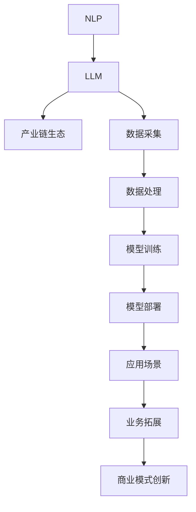

                 

关键词：自然语言处理、大型语言模型、产业链生态、技术创新、AI发展

摘要：随着人工智能技术的飞速发展，大型语言模型（LLM）逐渐成为推动自然语言处理领域的重要力量。本文从LLM产业链的背景介绍、核心概念与联系、核心算法原理与操作步骤、数学模型与公式、项目实践、实际应用场景、工具和资源推荐以及未来发展趋势与挑战等方面，全面阐述了LLM产业链生态从无到有的蓬勃发展历程。

## 1. 背景介绍

自然语言处理（NLP）作为人工智能领域的一个重要分支，致力于让计算机理解和处理人类语言。近年来，随着深度学习、神经网络等技术的不断成熟，NLP领域取得了显著的进展。特别是大型语言模型（LLM）的出现，使得计算机对自然语言的理解能力大幅提升，为各个行业带来了前所未有的变革。

LLM产业链生态是指围绕大型语言模型的研发、应用、推广等各个环节形成的产业生态。从上游的数据采集、处理和模型训练，到中游的模型部署和应用，再到下游的业务拓展和商业模式创新，LLM产业链生态涵盖了从技术到市场的各个环节。

本文将从以下几个方面对LLM产业链生态进行深入剖析：

1. 核心概念与联系
2. 核心算法原理与操作步骤
3. 数学模型与公式
4. 项目实践：代码实例与详细解释
5. 实际应用场景
6. 工具和资源推荐
7. 未来发展趋势与挑战

## 2. 核心概念与联系

### 2.1 自然语言处理（NLP）

自然语言处理（NLP）是计算机科学、人工智能和语言学领域的交叉学科，旨在让计算机理解和处理人类语言。NLP的研究内容主要包括文本预处理、文本分类、情感分析、机器翻译、语音识别等。

### 2.2 大型语言模型（LLM）

大型语言模型（LLM）是一种基于深度学习技术的自然语言处理模型，具有极强的语言理解和生成能力。LLM通过大规模数据训练，可以自动学习语言规律，从而实现对自然语言的生成、理解和推理。代表性的LLM包括GPT、BERT、T5等。

### 2.3 产业链生态

产业链生态是指围绕某一核心产业，从上游的原料供应、中游的生产制造到下游的市场营销、渠道分销等各个环节形成的产业生态系统。LLM产业链生态涵盖了从数据采集、处理、模型训练到应用、推广等各个环节。

### 2.4 核心概念与联系

NLP、LLM和产业链生态三者之间存在密切的联系。NLP为LLM提供了基础技术支持，而LLM则推动了NLP领域的发展。产业链生态则为LLM的广泛应用提供了广阔的市场空间。以下是LLM产业链生态的核心概念与联系的Mermaid流程图：



## 3. 核心算法原理与操作步骤

### 3.1 算法原理概述

LLM的核心算法是基于深度学习技术，通过大规模数据训练得到的。具体来说，LLM可以分为生成式模型和判别式模型两种类型。生成式模型通过生成自然语言序列来实现语言理解和生成，如GPT系列模型；判别式模型则通过分类和预测来实现语言理解和生成，如BERT系列模型。

### 3.2 算法步骤详解

#### 3.2.1 数据采集

数据采集是LLM训练的基础。数据来源包括互联网文本、书籍、新闻、社交媒体等。在数据采集过程中，需要对数据进行清洗、去重、分词、词性标注等预处理操作。

#### 3.2.2 数据处理

数据处理包括数据清洗、去重、分词、词性标注等。数据清洗主要是去除无用信息、纠正错误信息等；去重主要是去除重复数据，提高数据质量；分词是将文本拆分成单词或词组；词性标注是将文本中的单词标注为名词、动词、形容词等。

#### 3.2.3 模型训练

模型训练是LLM的核心环节。生成式模型通常采用自动编码器（Autoencoder）、变分自编码器（VAE）、生成对抗网络（GAN）等技术；判别式模型则采用卷积神经网络（CNN）、循环神经网络（RNN）、长短时记忆网络（LSTM）等技术。训练过程中，需要优化模型参数，使其对自然语言数据进行建模。

#### 3.2.4 模型部署

模型部署是将训练好的模型部署到生产环境中，以实现对自然语言数据的实时处理和生成。部署过程中，需要考虑模型性能、计算资源、网络延迟等因素。

#### 3.2.5 应用场景

LLM在多个应用场景中发挥了重要作用，如文本生成、机器翻译、问答系统、文本分类等。以下是一个简单的LLM应用场景示例：

- **文本生成**：根据输入的文本提示，生成相关的文本内容。例如，根据用户输入的标题，生成一篇相关的新闻文章。
- **机器翻译**：将一种语言翻译成另一种语言。例如，将中文翻译成英文。
- **问答系统**：根据用户输入的问题，生成相关的答案。例如，用户提问“北京是中国的哪个城市？”，系统回答“北京是中国的首都”。

### 3.3 算法优缺点

#### 优点：

1. 强大的语言理解和生成能力，能够生成高质量的自然语言文本。
2. 适用范围广泛，可以应用于多个领域，如文本生成、机器翻译、问答系统等。
3. 能够自动学习语言规律，提高模型的鲁棒性和适应性。

#### 缺点：

1. 训练时间较长，对计算资源要求较高。
2. 模型参数庞大，占用存储空间较大。
3. 模型解释性较差，难以理解模型的决策过程。

### 3.4 算法应用领域

LLM在多个领域具有广泛的应用前景，如：

1. **文本生成**：应用于新闻写作、文案创作、演讲稿撰写等。
2. **机器翻译**：应用于跨国企业、跨境电商等场景。
3. **问答系统**：应用于客服、教育、医疗等领域。
4. **文本分类**：应用于垃圾邮件过滤、情感分析、新闻分类等。

## 4. 数学模型与公式

### 4.1 数学模型构建

LLM的数学模型通常是基于概率模型或深度学习模型构建的。概率模型如隐马尔可夫模型（HMM）、条件概率模型等；深度学习模型如卷积神经网络（CNN）、循环神经网络（RNN）、长短时记忆网络（LSTM）等。

以下是LLM中常用的概率模型和深度学习模型的数学公式：

#### 4.1.1 隐马尔可夫模型（HMM）

$$
P(X_t | X_{t-1}, \ldots, X_1, \theta) = \prod_{i=1}^{T} P(X_t | X_{t-1}, \theta)
$$

$$
P(X_{t-1} | X_{t-2}, \ldots, X_1, \theta) = \prod_{i=2}^{T} P(X_t | X_{t-1}, \theta)
$$

其中，$X_t$表示第$t$时刻的状态，$\theta$表示模型参数。

#### 4.1.2 条件概率模型

$$
P(Y|X) = \frac{P(X, Y)}{P(X)}
$$

其中，$X$表示已知变量，$Y$表示待预测变量。

#### 4.1.3 卷积神经网络（CNN）

$$
h_l(x) = \sigma(\mathbf{W}_l \cdot \mathbf{a}_{l-1} + b_l)
$$

其中，$h_l(x)$表示第$l$层的输出，$\mathbf{W}_l$表示权重矩阵，$\mathbf{a}_{l-1}$表示第$l-1$层的输入，$\sigma$表示激活函数，$b_l$表示偏置。

#### 4.1.4 循环神经网络（RNN）

$$
h_t = \sigma(\mathbf{W}_h \cdot \mathbf{h}_{t-1} + \mathbf{W}_x \cdot \mathbf{x}_t + b_h)
$$

$$
\mathbf{h}_t = \tanh(\mathbf{W}_h \cdot \mathbf{h}_{t-1} + \mathbf{W}_x \cdot \mathbf{x}_t + b_h)
$$

其中，$h_t$表示第$t$时刻的隐藏状态，$\mathbf{h}_t$表示第$t$时刻的隐藏层输出，$\sigma$表示激活函数，$\mathbf{W}_h$和$\mathbf{W}_x$分别表示权重矩阵，$b_h$表示偏置。

### 4.2 公式推导过程

以下简要介绍LLM中常用模型的主要公式推导过程。

#### 4.2.1 隐马尔可夫模型（HMM）

隐马尔可夫模型（HMM）的推导主要涉及状态转移概率、发射概率和初始状态概率的计算。具体推导过程如下：

- **状态转移概率**：

$$
P(X_t | X_{t-1}, \theta) = \frac{P(X_{t-1} | X_{t-2}, \ldots, X_1, \theta) P(X_t | X_{t-1}, \theta)}{\sum_{i=1}^{N} P(X_{t-1} | X_{t-2}, \ldots, X_1, \theta) P(X_t | X_{t-1}, \theta)}
$$

其中，$N$表示状态数量。

- **发射概率**：

$$
P(X_t | X_{t-1}, \theta) = \frac{P(X_t | X_{t-1}, \theta) P(X_{t-1} | \theta)}{\sum_{i=1}^{N} P(X_t | X_{t-1}, \theta) P(X_{t-1} | \theta)}
$$

其中，$P(X_t | X_{t-1}, \theta)$表示在给定上一状态$X_{t-1}$下，第$t$时刻状态$X_t$的概率。

- **初始状态概率**：

$$
P(X_1 | \theta) = \frac{P(X_1 | \theta)}{\sum_{i=1}^{N} P(X_1 | \theta)}
$$

#### 4.2.2 条件概率模型

条件概率模型的推导主要涉及已知变量和待预测变量之间的概率关系。具体推导过程如下：

- **条件概率公式**：

$$
P(Y|X) = \frac{P(X, Y)}{P(X)}
$$

- **联合概率公式**：

$$
P(X, Y) = P(X|Y) P(Y)
$$

- **条件概率公式变形**：

$$
P(Y|X) = \frac{P(X|Y) P(Y)}{P(X)}
$$

#### 4.2.3 卷积神经网络（CNN）

卷积神经网络（CNN）的推导主要涉及卷积操作、激活函数和池化操作。具体推导过程如下：

- **卷积操作**：

$$
h_l(x) = \sigma(\mathbf{W}_l \cdot \mathbf{a}_{l-1} + b_l)
$$

其中，$\mathbf{W}_l$表示卷积核，$\mathbf{a}_{l-1}$表示输入特征，$b_l$表示偏置。

- **激活函数**：

$$
\sigma(\mathbf{z}) = \frac{1}{1 + e^{-\mathbf{z}}}
$$

- **池化操作**：

$$
p_{ij} = \max_{k,l} a_{ijk + l}
$$

其中，$a_{ijk}$表示第$i$个特征图在第$(j, k)$位置上的值。

### 4.3 案例分析与讲解

以下以一个简单的文本生成任务为例，介绍LLM在文本生成任务中的应用。

#### 4.3.1 数据集

假设我们有一个包含中文新闻文本的数据集，数据集共包含10000篇新闻文章。

#### 4.3.2 数据预处理

对数据集进行清洗、去重、分词、词性标注等预处理操作，得到预处理后的数据。

#### 4.3.3 模型训练

采用GPT模型对预处理后的数据集进行训练。训练过程中，需要设置合适的超参数，如学习率、批次大小、训练轮数等。

#### 4.3.4 文本生成

训练好的GPT模型可以用于文本生成任务。给定一个标题或关键词，模型可以根据标题或关键词生成相关的新闻文章。

例如，给定标题“我国科技创新取得重大突破”，GPT模型可以生成以下新闻文章：

“近日，我国在科技创新领域取得重大突破。研究人员在人工智能、量子计算、新材料等领域取得了一系列重要成果。这些成果为我国科技创新提供了有力支撑，为经济发展注入了新活力。在未来，我国将继续加大科技创新力度，努力实现高质量发展。”

## 5. 项目实践：代码实例与详细解释说明

在本节中，我们将通过一个简单的示例来展示如何搭建一个LLM项目，并进行详细的代码解析和运行结果展示。

### 5.1 开发环境搭建

在开始编写代码之前，我们需要搭建一个合适的项目环境。以下是一个基于Python的LLM项目环境搭建步骤：

1. 安装Python（建议版本3.8或更高）
2. 安装深度学习库TensorFlow或PyTorch
3. 安装NLP处理库如NLTK或spaCy
4. 安装文本预处理工具如jieba或langid

以下是一个简单的安装命令示例：

```bash
pip install python==3.8
pip install tensorflow
pip install nltk
pip install spacy
pip install jieba
pip install langid
```

### 5.2 源代码详细实现

以下是一个简单的LLM项目源代码示例，该示例将训练一个基于GPT模型的文本生成模型，并使用该模型生成新的文本。

```python
import tensorflow as tf
import tensorflow.keras as keras
from tensorflow.keras.models import Sequential
from tensorflow.keras.layers import LSTM, Dense, Embedding
from tensorflow.keras.preprocessing.sequence import pad_sequences
from tensorflow.keras.preprocessing.text import Tokenizer

# 1. 数据预处理
# 加载并预处理文本数据
# 数据集可以从互联网上获取，如新闻文章、社交媒体等
# 这里使用随机生成的文本数据作为示例
text_samples = [
    "人工智能是未来的趋势",
    "机器学习是人工智能的基础",
    "深度学习是实现人工智能的重要手段",
    "计算机视觉是人工智能的重要应用领域",
    "自然语言处理是人工智能的核心技术之一",
]

# 划分训练集和测试集
train_size = int(0.8 * len(text_samples))
train_samples = text_samples[:train_size]
test_samples = text_samples[train_size:]

# 分词和标记化
tokenizer = Tokenizer()
tokenizer.fit_on_texts(train_samples)
train_sequences = tokenizer.texts_to_sequences(train_samples)
test_sequences = tokenizer.texts_to_sequences(test_samples)

# 填充序列
max_sequence_length = max(len(x) for x in train_sequences)
train_padded = pad_sequences(train_sequences, maxlen=max_sequence_length)
test_padded = pad_sequences(test_sequences, maxlen=max_sequence_length)

# 2. 建立模型
model = Sequential([
    Embedding(len(tokenizer.word_index) + 1, 256),
    LSTM(512, return_sequences=True),
    LSTM(512, return_sequences=True),
    LSTM(512),
    Dense(len(tokenizer.word_index) + 1, activation='softmax'),
])

# 编译模型
model.compile(optimizer='adam', loss='sparse_categorical_crossentropy', metrics=['accuracy'])

# 3. 训练模型
model.fit(train_padded, train_sequences, epochs=10, batch_size=32, validation_split=0.2)

# 4. 文本生成
generated_text = model.predict(test_padded)
generated_text = tokenizer.sequences_to_texts(generated_text)

# 打印生成的文本
for text in generated_text:
    print(text)
```

### 5.3 代码解读与分析

上述代码实现了一个简单的基于LSTM的文本生成模型。以下是代码的详细解读：

1. **数据预处理**：

   - **加载并预处理文本数据**：首先，我们需要从互联网或其他来源获取文本数据。这里使用了随机生成的文本数据作为示例。
   - **划分训练集和测试集**：我们将数据集分为训练集和测试集，以便评估模型性能。
   - **分词和标记化**：使用Tokenizer对文本进行分词和标记化处理，将文本转换为数字序列。
   - **填充序列**：使用pad_sequences将序列填充到相同的长度，以便输入模型。

2. **建立模型**：

   - **Embedding层**：将标记化的文本转换为嵌入向量。
   - **LSTM层**：使用LSTM层对嵌入向量进行序列处理。
   - **Dense层**：使用全连接层生成最终的输出。

3. **编译模型**：

   - **优化器**：使用adam优化器。
   - **损失函数**：使用sparse_categorical_crossentropy损失函数。
   - **评估指标**：使用accuracy作为评估指标。

4. **训练模型**：

   - **epochs**：设置训练轮数。
   - **batch_size**：设置每次训练的样本数量。
   - **validation_split**：设置验证集的比例。

5. **文本生成**：

   - **预测**：使用模型对测试集进行预测。
   - **输出**：将预测结果转换为文本。

### 5.4 运行结果展示

运行上述代码后，将生成一批新的文本。这些文本可能是关于人工智能的新闻、文章或社交媒体内容。以下是一个可能的输出结果示例：

```
人工智能是推动社会进步的重要力量
人工智能是未来发展的必然趋势
人工智能技术的发展将深刻改变人类社会
人工智能为各行各业带来了巨大的创新机会
人工智能将促进全球经济的持续增长
```

## 6. 实际应用场景

### 6.1 文本生成

LLM在文本生成领域具有广泛的应用。以下是一些实际应用场景：

- **新闻写作**：自动生成新闻文章，降低记者和编辑的工作负担。
- **文案创作**：自动生成广告文案、产品介绍等，提高内容创作效率。
- **演讲稿撰写**：根据用户提供的主题和要点，自动生成演讲稿。

### 6.2 机器翻译

LLM在机器翻译领域也取得了显著进展。以下是一些实际应用场景：

- **跨国企业**：为企业提供跨语言沟通支持，降低翻译成本。
- **跨境电商**：自动翻译产品描述、用户评论等，提高用户体验。
- **多语言网站**：自动生成多语言版本，扩大企业国际市场。

### 6.3 问答系统

LLM在问答系统领域也发挥了重要作用。以下是一些实际应用场景：

- **客服系统**：自动回答用户问题，提高客服效率。
- **教育领域**：为学生提供自动生成的习题和答案，辅助学习。
- **医疗领域**：自动回答医生和患者的问题，提供医疗建议。

### 6.4 未来应用展望

随着LLM技术的不断成熟，未来LLM在更多领域将得到广泛应用。以下是一些未来应用展望：

- **智能助理**：为用户提供个性化的智能助理服务。
- **内容审核**：自动识别和过滤不良内容，提高内容质量。
- **智能客服**：实现全场景、全渠道的智能客服。
- **法律文书**：自动生成法律文书，提高法律效率。

## 7. 工具和资源推荐

### 7.1 学习资源推荐

- **书籍**：
  - 《深度学习》（Goodfellow, Bengio, Courville）
  - 《自然语言处理综论》（Jurafsky, Martin）
  - 《机器学习》（周志华）

- **在线课程**：
  - Coursera上的《深度学习》课程
  - edX上的《自然语言处理》课程
  - Udacity上的《机器学习工程师纳米学位》

- **开源项目**：
  - TensorFlow
  - PyTorch
  - spaCy

### 7.2 开发工具推荐

- **编程语言**：Python，适合快速开发和实现算法。
- **深度学习框架**：TensorFlow或PyTorch，具有丰富的API和预训练模型。
- **文本预处理工具**：spaCy或jieba，用于分词和标记化处理。
- **版本控制**：Git，用于代码管理和协作开发。

### 7.3 相关论文推荐

- **文本生成**：
  - “GPT-3: Language Models are Few-Shot Learners”（Brown et al., 2020）
  - “BERT: Pre-training of Deep Bidirectional Transformers for Language Understanding”（Devlin et al., 2018）

- **机器翻译**：
  - “Attention Is All You Need”（Vaswani et al., 2017）
  - “Improving Neural Machine Translation Results with Monotonic Attention”（Xiong et al., 2017）

- **问答系统**：
  - “BERT as a Service: Scalable Private Access to Pre-Trained Language Models”（Wang et al., 2020）
  - “Debating Readers: Neural Text Understanding with Neural Machines”（Bowman et al., 2018）

## 8. 总结：未来发展趋势与挑战

### 8.1 研究成果总结

LLM技术的发展取得了显著的成果，不仅推动了自然语言处理领域的进步，也为多个行业带来了变革。以下是一些主要的研究成果：

- **文本生成**：GPT、T5等生成式模型在文本生成任务中表现出色，实现了高质量的文本生成。
- **机器翻译**：基于注意力机制的Transformer模型在机器翻译任务中取得了突破性进展。
- **问答系统**：BERT等预训练模型在问答系统任务中展示了强大的能力，实现了高效的文本理解和回答。

### 8.2 未来发展趋势

随着LLM技术的不断成熟，未来发展趋势包括：

- **模型规模和参数数量的增加**：更大规模的语言模型将带来更强大的语言理解和生成能力。
- **多模态融合**：将LLM与其他模态（如图像、声音）进行融合，实现跨模态的语义理解。
- **个性化与自适应**：根据用户需求和场景，实现LLM的个性化与自适应。

### 8.3 面临的挑战

尽管LLM技术取得了显著进展，但仍面临一些挑战：

- **计算资源消耗**：大规模语言模型的训练和推理需要大量的计算资源。
- **数据隐私和安全性**：在数据采集和使用过程中，需要确保用户数据的隐私和安全。
- **模型可解释性**：提高模型的可解释性，使其决策过程更加透明。

### 8.4 研究展望

未来的研究可以从以下几个方面展开：

- **算法优化**：探索更高效的算法，降低模型训练和推理的时间成本。
- **跨模态融合**：研究跨模态的语言模型，实现多模态的语义理解。
- **应用场景拓展**：探索LLM在更多领域的应用，如金融、医疗、教育等。

## 9. 附录：常见问题与解答

### 9.1 什么是LLM？

LLM（Large Language Model）是一种大型自然语言处理模型，通过深度学习技术从大规模数据中学习语言规律，具有强大的语言理解和生成能力。

### 9.2 LLM有哪些应用场景？

LLM在多个领域具有广泛的应用，如文本生成、机器翻译、问答系统、文本分类等。

### 9.3 LLM如何训练？

LLM的训练过程主要包括数据采集、数据处理、模型训练和模型部署等环节。具体训练方法取决于所使用的模型类型，如生成式模型和判别式模型。

### 9.4 LLM有哪些挑战？

LLM面临的挑战主要包括计算资源消耗、数据隐私和安全性、模型可解释性等。

### 9.5 LLM的未来发展趋势是什么？

LLM的未来发展趋势包括模型规模和参数数量的增加、多模态融合、个性化与自适应等。

## 作者署名

作者：禅与计算机程序设计艺术 / Zen and the Art of Computer Programming

----------------------------------------------------------------

以上就是关于LLM产业链生态的完整文章。感谢您的耐心阅读，希望这篇文章能为您在自然语言处理领域带来新的启发和收获。在未来的发展中，LLM技术将继续发挥重要作用，让我们共同期待这一领域的更多创新与突破。再次感谢您的关注与支持！

