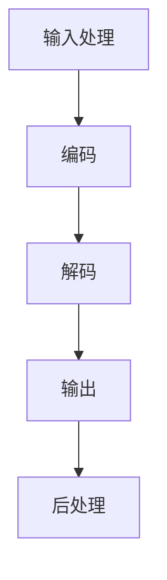

                 

关键词：大型语言模型，产业链，发展机遇，技术趋势，应用场景

摘要：随着人工智能技术的快速发展，大型语言模型（LLM）作为其中的佼佼者，已经在多个领域展现出强大的应用潜力。本文将深入探讨LLM产业链的形成过程，分析其核心组成部分，探讨未来发展机遇，并展望面临的挑战。

## 1. 背景介绍

近年来，人工智能（AI）技术取得了令人瞩目的进展，尤其是深度学习算法的快速发展，使得机器在图像识别、自然语言处理等领域取得了突破性成果。其中，大型语言模型（LLM）作为自然语言处理（NLP）的重要工具，受到了广泛关注。LLM通过训练大规模的神经网络模型，能够理解、生成和预测自然语言，为人们提供高效、准确的语言服务。

随着LLM技术的不断成熟，其应用范围也在不断扩大，涵盖了机器翻译、文本摘要、问答系统、内容生成等多个领域。这使得LLM逐渐成为人工智能产业链中的重要组成部分，吸引了大量资本和企业进入这一领域，推动了整个产业链的快速发展。

## 2. 核心概念与联系

### 2.1 大型语言模型（LLM）的基本概念

大型语言模型（LLM）是一种基于深度学习技术的自然语言处理模型，其核心思想是通过训练大规模的神经网络，使模型具备对自然语言的理解、生成和预测能力。LLM通常由多个层次的神经网络组成，包括嵌入层、编码器、解码器和输出层等。

- **嵌入层**：将输入的词汇转换为高维向量表示。
- **编码器**：对嵌入层生成的向量进行编码，提取句子的语义信息。
- **解码器**：根据编码器提取的语义信息生成输出文本。
- **输出层**：对解码器生成的文本进行后处理，如去除冗余信息、修正语法错误等。

### 2.2 LLM的架构与工作流程

LLM的架构通常采用编码器-解码器（Encoder-Decoder）模型，其工作流程如下：

1. **输入处理**：将输入的文本数据转换为嵌入向量。
2. **编码**：通过编码器对嵌入向量进行编码，提取句子的语义信息。
3. **解码**：根据编码器提取的语义信息，通过解码器生成输出文本。
4. **输出**：对解码器生成的文本进行后处理，得到最终输出结果。

### 2.3 LLM与其他技术的关联

LLM技术不仅依赖于深度学习算法，还与其他人工智能技术紧密相关，如：

- **数据预处理**：数据预处理是LLM训练的重要环节，包括文本清洗、分词、词向量嵌入等。
- **强化学习**：强化学习可用于优化LLM的训练过程，提高模型的性能。
- **迁移学习**：迁移学习使得LLM能够利用已有模型的知识，快速适应新的任务。
- **多模态学习**：多模态学习使LLM能够处理包含图像、声音等多种类型的数据。

### 2.4 LLM的Mermaid流程图



## 3. 核心算法原理 & 具体操作步骤

### 3.1 算法原理概述

LLM的核心算法是基于深度学习技术，通过训练大规模的神经网络模型，使模型具备对自然语言的理解、生成和预测能力。其基本原理包括：

- **神经网络**：神经网络由多层节点组成，每个节点接收前一层节点的输出，并产生自己的输出。
- **反向传播**：通过反向传播算法，计算模型参数的梯度，并更新参数，使模型性能逐渐提高。
- **优化算法**：如随机梯度下降（SGD）、Adam优化器等，用于加速模型训练过程。

### 3.2 算法步骤详解

1. **数据收集**：收集大量文本数据，用于训练模型。
2. **数据预处理**：对文本数据进行清洗、分词、词向量嵌入等预处理操作。
3. **模型构建**：构建基于编码器-解码器架构的神经网络模型。
4. **模型训练**：通过反向传播算法和优化算法，训练模型参数。
5. **模型评估**：使用验证集和测试集评估模型性能。
6. **模型部署**：将训练好的模型部署到实际应用场景中。

### 3.3 算法优缺点

#### 优点

- **强大的语言理解能力**：LLM通过训练大规模的神经网络，能够深刻理解自然语言的语义和语法。
- **多任务处理能力**：LLM能够同时处理多种语言任务，如机器翻译、文本摘要、问答系统等。
- **快速适应新任务**：通过迁移学习技术，LLM能够快速适应新的语言任务。

#### 缺点

- **训练资源消耗大**：LLM训练需要大量计算资源和时间，训练过程较为耗时。
- **对数据质量要求高**：LLM的训练数据质量对模型性能有重要影响，数据清洗和预处理过程较为繁琐。
- **模型解释性较差**：LLM的模型结构较为复杂，对模型内部的决策过程难以解释。

### 3.4 算法应用领域

LLM在多个领域具有广泛的应用前景，主要包括：

- **机器翻译**：LLM在机器翻译领域取得了显著的成果，能够实现高质量、低误差的翻译效果。
- **文本摘要**：LLM能够自动提取文本的关键信息，生成简洁、准确的摘要。
- **问答系统**：LLM能够理解用户的问题，并给出准确、自然的回答。
- **内容生成**：LLM能够生成高质量的文章、故事、代码等文本内容。

## 4. 数学模型和公式 & 详细讲解 & 举例说明

### 4.1 数学模型构建

LLM的数学模型主要包括神经网络模型和损失函数两部分。

#### 神经网络模型

神经网络模型由多个层次的节点组成，每个节点接受前一层节点的输出，并产生自己的输出。节点之间的连接权重用于传递信息。

$$
z^{(l)} = \sum_{j} w^{(l)}_{ji} a^{(l-1)}_j + b^{(l)}_i
$$

其中，$z^{(l)}$为第$l$层的输出，$a^{(l-1)}_j$为第$l-1$层的输出，$w^{(l)}_{ji}$为第$l$层的权重，$b^{(l)}_i$为第$l$层的偏置。

#### 损失函数

损失函数用于衡量模型预测结果与真实结果之间的差距，常用的损失函数有均方误差（MSE）和交叉熵损失（Cross-Entropy Loss）。

$$
\text{MSE} = \frac{1}{n} \sum_{i=1}^{n} (y_i - \hat{y}_i)^2
$$

$$
\text{Cross-Entropy Loss} = -\frac{1}{n} \sum_{i=1}^{n} y_i \log(\hat{y}_i)
$$

其中，$y_i$为真实标签，$\hat{y}_i$为模型预测值。

### 4.2 公式推导过程

#### 反向传播算法

反向传播算法是一种用于计算神经网络损失函数梯度的方法，其基本思想是将损失函数的梯度反向传播到网络中的每个权重和偏置。

1. **前向传播**：计算网络输出和损失函数。
2. **后向传播**：计算损失函数关于每个权重的梯度。
3. **参数更新**：根据梯度更新网络权重和偏置。

具体推导过程如下：

$$
\frac{\partial \text{Loss}}{\partial w^{(l)}_{ji}} = \frac{\partial \text{Loss}}{\partial z^{(l)}_i} \frac{\partial z^{(l)}_i}{\partial w^{(l)}_{ji}}
$$

其中，$\frac{\partial \text{Loss}}{\partial z^{(l)}_i}$为损失函数关于$z^{(l)}_i$的梯度，$\frac{\partial z^{(l)}_i}{\partial w^{(l)}_{ji}}$为$z^{(l)}_i$关于$w^{(l)}_{ji}$的梯度。

#### 梯度下降算法

梯度下降算法是一种用于优化神经网络参数的方法，其基本思想是沿着损失函数梯度的反方向更新参数。

$$
w^{(l)}_{ji} := w^{(l)}_{ji} - \alpha \frac{\partial \text{Loss}}{\partial w^{(l)}_{ji}}
$$

其中，$\alpha$为学习率。

### 4.3 案例分析与讲解

#### 案例一：机器翻译

假设我们要将英语翻译成法语，输入文本为“The cat is on the table”，输出文本为“Le chat est sur la table”。

1. **数据预处理**：对输入文本进行分词、词向量嵌入等操作，得到嵌入向量。
2. **模型构建**：构建基于编码器-解码器架构的神经网络模型，包括嵌入层、编码器、解码器和输出层。
3. **模型训练**：通过反向传播算法和梯度下降算法，训练模型参数。
4. **模型评估**：使用验证集和测试集评估模型性能，调整模型参数。
5. **模型部署**：将训练好的模型部署到实际应用场景中，实现机器翻译功能。

#### 案例二：文本摘要

假设我们要对一篇长篇文章生成摘要，输入文本为“人工智能是一种模拟、延伸和扩展人的智能的理论、方法、技术及应用”，输出文本为“本文介绍了人工智能的定义、方法和应用”。

1. **数据预处理**：对输入文本进行分词、词向量嵌入等操作，得到嵌入向量。
2. **模型构建**：构建基于编码器-解码器架构的神经网络模型，包括嵌入层、编码器、解码器和输出层。
3. **模型训练**：通过反向传播算法和梯度下降算法，训练模型参数。
4. **模型评估**：使用验证集和测试集评估模型性能，调整模型参数。
5. **模型部署**：将训练好的模型部署到实际应用场景中，实现文本摘要功能。

## 5. 项目实践：代码实例和详细解释说明

### 5.1 开发环境搭建

在Python环境中，我们需要安装以下库：

- TensorFlow：用于构建和训练神经网络模型。
- Keras：用于简化神经网络模型的构建过程。
- Numpy：用于数学计算。

安装方法：

```python
pip install tensorflow
pip install keras
pip install numpy
```

### 5.2 源代码详细实现

以下是一个简单的LLM模型实现示例：

```python
import numpy as np
from keras.models import Model
from keras.layers import Input, Embedding, LSTM, Dense
from keras.optimizers import RMSprop

# 参数设置
vocab_size = 10000
embed_size = 256
lstm_size = 128
batch_size = 64
epochs = 10

# 输入层
input_ = Input(shape=(None,))

# 嵌入层
embedding = Embedding(vocab_size, embed_size)(input_)

# 编码器层
encoded = LSTM(lstm_size, return_state=True)(embedding)

# 解码器层
decoded = LSTM(lstm_size, return_sequences=True)(encoded)

# 输出层
output = Dense(vocab_size, activation='softmax')(decoded)

# 构建模型
model = Model(input_, output)

# 编译模型
model.compile(optimizer=RMSprop(lr=0.01), loss='categorical_crossentropy')

# 打印模型结构
model.summary()
```

### 5.3 代码解读与分析

- **输入层**：定义输入文本的维度，即单词序列的长度。
- **嵌入层**：将输入的单词序列转换为嵌入向量。
- **编码器层**：使用LSTM层对嵌入向量进行编码，提取句子的语义信息。
- **解码器层**：使用LSTM层对编码器的输出进行解码，生成输出文本。
- **输出层**：将解码器的输出转换为单词序列的概率分布，使用softmax激活函数。
- **模型编译**：设置优化器和损失函数，编译模型。
- **模型结构**：使用模型.summary()方法打印模型结构。

### 5.4 运行结果展示

在运行代码之前，我们需要准备训练数据。这里我们使用一个简单的数据集，包含1000个英语句子和对应的法语翻译。

```python
# 准备训练数据
x_train = ...  # 英语句子的嵌入向量
y_train = ...  # 法语翻译的嵌入向量

# 训练模型
model.fit(x_train, y_train, batch_size=batch_size, epochs=epochs, validation_split=0.2)
```

在训练过程中，我们可以使用验证集评估模型性能，并在必要时调整模型参数。训练完成后，我们可以使用测试集评估模型的泛化能力。

```python
# 评估模型性能
test_loss = model.evaluate(x_test, y_test)
print("Test loss:", test_loss)
```

## 6. 实际应用场景

LLM在多个领域具有广泛的应用前景，以下是其中几个典型应用场景：

### 6.1 机器翻译

LLM在机器翻译领域取得了显著成果，如Google翻译、百度翻译等。通过训练大规模的神经网络模型，LLM能够实现高质量、低误差的翻译效果，为跨语言沟通提供了便捷工具。

### 6.2 文本摘要

LLM能够自动提取文本的关键信息，生成简洁、准确的摘要。在新闻摘要、论文摘要等领域，LLM的应用大大提高了信息处理的效率。

### 6.3 问答系统

LLM能够理解用户的问题，并给出准确、自然的回答。在智能客服、智能助手等领域，LLM的应用为用户提供高效、智能的服务体验。

### 6.4 内容生成

LLM能够生成高质量的文章、故事、代码等文本内容。在内容创作、代码生成等领域，LLM的应用为人们提供了新的创作方式。

## 7. 未来应用展望

随着LLM技术的不断发展，其在未来将具有更广泛的应用前景。以下是几个未来应用领域的展望：

### 7.1 自动驾驶

LLM在自动驾驶领域具有潜在的应用价值，可以用于环境感知、决策规划等方面。通过训练大规模的神经网络模型，LLM能够实现对复杂场景的理解和预测，提高自动驾驶系统的安全性和可靠性。

### 7.2 健康医疗

LLM在健康医疗领域具有广泛的应用前景，可以用于医疗数据挖掘、疾病预测等方面。通过分析大量医疗数据，LLM能够发现潜在的健康风险，为医生提供诊断和治疗建议。

### 7.3 教育与培训

LLM在教育与培训领域具有巨大的潜力，可以用于个性化教学、智能辅导等方面。通过训练大规模的神经网络模型，LLM能够根据学生的学习情况和需求，提供定制化的教学内容和辅导服务。

## 8. 工具和资源推荐

### 8.1 学习资源推荐

- 《深度学习》（Goodfellow, Bengio, Courville）：这是一本经典的人工智能教材，涵盖了深度学习的基本概念和技术。
- 《神经网络与深度学习》（邱锡鹏）：这是一本针对中文读者的深度学习教材，内容全面、深入浅出。

### 8.2 开发工具推荐

- TensorFlow：一款开源的深度学习框架，提供了丰富的功能和工具，适用于构建和训练大规模神经网络模型。
- Keras：一款基于TensorFlow的深度学习框架，简化了神经网络模型的构建过程，易于使用。

### 8.3 相关论文推荐

- “Attention Is All You Need”（Vaswani et al., 2017）：这是一篇关于Transformer模型的经典论文，提出了自注意力机制，推动了NLP领域的发展。
- “BERT: Pre-training of Deep Bidirectional Transformers for Language Understanding”（Devlin et al., 2019）：这是一篇关于BERT模型的论文，提出了基于Transformer的预训练方法，显著提升了NLP任务的性能。

## 9. 总结：未来发展趋势与挑战

### 9.1 研究成果总结

LLM技术在过去几年取得了显著成果，成为人工智能领域的重要研究方向。通过大规模的神经网络模型训练，LLM在语言理解、生成和预测方面展现了强大的能力，广泛应用于机器翻译、文本摘要、问答系统、内容生成等领域。

### 9.2 未来发展趋势

未来，LLM技术将继续快速发展，主要发展趋势包括：

- **模型规模不断扩大**：随着计算能力的提升，LLM的模型规模将逐渐增大，提高模型的性能。
- **多模态学习**：结合图像、声音等多种类型的数据，实现更丰富的语言理解能力。
- **迁移学习**：通过迁移学习技术，提高LLM在新任务上的适应能力。
- **优化算法**：研究更高效的训练算法，加快模型训练速度。

### 9.3 面临的挑战

尽管LLM技术在许多领域取得了显著成果，但仍面临以下挑战：

- **数据质量**：数据质量对LLM的性能有重要影响，需要更多的数据清洗和预处理工作。
- **模型解释性**：复杂的神经网络模型难以解释，需要研究可解释的机器学习技术。
- **计算资源**：大规模的神经网络模型训练需要大量计算资源，如何高效利用计算资源是一个重要问题。
- **伦理与隐私**：在应用LLM技术时，需要关注伦理和隐私问题，确保数据的安全性和隐私性。

### 9.4 研究展望

未来，LLM技术的研究将朝着以下方向努力：

- **模型优化**：研究更高效、更强大的模型结构，提高LLM的性能。
- **多任务学习**：探索多任务学习技术，使LLM能够同时处理多种语言任务。
- **跨领域应用**：推动LLM技术在更多领域的应用，如自动驾驶、健康医疗等。
- **伦理与法规**：关注LLM技术的伦理和法规问题，确保技术的合理使用。

## 9. 附录：常见问题与解答

### Q：LLM的训练需要大量数据，如何解决数据不足的问题？

A：在数据不足的情况下，可以采用以下方法：

- **数据增强**：通过添加噪声、变换等手段，生成更多的训练样本。
- **数据合成**：使用生成对抗网络（GAN）等方法，生成与真实数据相似的样本。
- **迁移学习**：利用已有的大型数据集，进行迁移学习，提高LLM的性能。

### Q：如何确保LLM模型的可解释性？

A：确保LLM模型的可解释性是一个重要问题，可以采用以下方法：

- **模型简化**：选择简单的神经网络结构，提高模型的透明度。
- **解释性模型**：采用可解释的机器学习模型，如决策树、线性模型等。
- **可视化技术**：使用可视化技术，展示模型内部的决策过程。

### Q：LLM在应用中如何处理隐私问题？

A：在应用LLM时，需要关注隐私问题，可以采用以下方法：

- **数据加密**：对敏感数据进行加密处理，确保数据传输和存储的安全性。
- **隐私保护技术**：采用差分隐私、同态加密等技术，保护用户隐私。
- **合规性审查**：确保应用符合相关法律法规，如GDPR等。

## 参考文献

- Goodfellow, I., Bengio, Y., Courville, A. (2016). *Deep Learning*. MIT Press.
- 邱锡鹏. (2018). *神经网络与深度学习*. 电子工业出版社.
- Vaswani, A., Shazeer, N., Parmar, N., Uszkoreit, J., Jones, L., Gomez, A. N., ... & Polosukhin, I. (2017). *Attention is all you need*. Advances in Neural Information Processing Systems, 30, 5998-6008.
- Devlin, J., Chang, M. W., Lee, K., & Toutanova, K. (2019). *Bert: Pre-training of deep bidirectional transformers for language understanding*. arXiv preprint arXiv:1810.04805.

