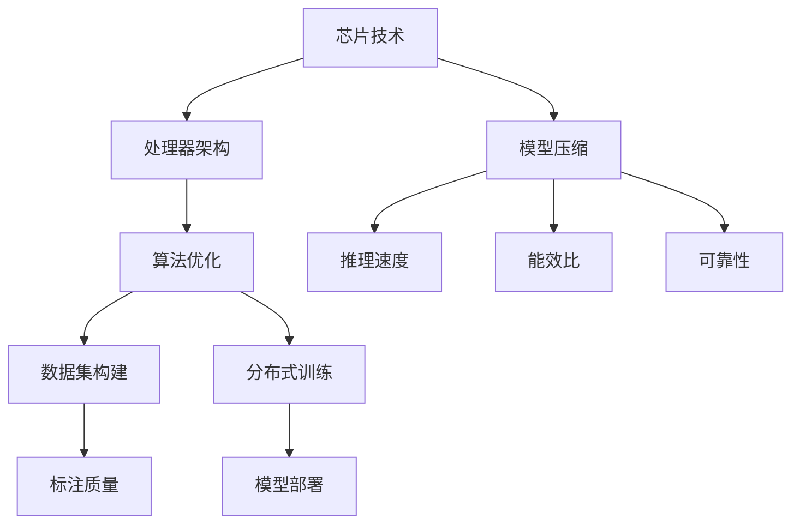

                 

关键词：LLM，人工智能，产业链，芯片，应用，技术语言，深度学习，计算机编程，产业趋势

> 摘要：本文将深入探讨LLM（大型语言模型）产业链的全景图，从芯片级的技术发展，到应用层的实现，全面解析这一领域的核心概念、技术原理、数学模型和实际应用。本文旨在为读者提供一幅清晰、详细的LLM产业链图，以及对其未来发展的思考。

## 1. 背景介绍

随着人工智能技术的迅猛发展，大型语言模型（LLM）已经成为自然语言处理（NLP）领域的重要工具。LLM通过深度学习技术，可以从海量数据中学习并生成复杂的文本模式，广泛应用于机器翻译、文本生成、问答系统等多个场景。然而，LLM的强大能力背后，离不开芯片技术的发展以及整个产业链的支撑。

LLM产业链涵盖了从硬件到软件的多个层次，包括芯片设计、处理器架构、算法优化、数据集构建、模型训练与部署等多个环节。本文将依次探讨这些环节，试图勾勒出LLM产业链的完整图景。

### 1.1 芯片技术的发展

近年来，芯片技术在计算能力、能效比和可靠性等方面取得了显著进步。特别是在GPU（图形处理单元）和TPU（张量处理单元）等专用处理器的推动下，大规模并行计算成为可能。这些高性能处理器为LLM的训练和推理提供了强大的硬件支持。

### 1.2 处理器架构的优化

除了硬件层面的突破，处理器架构的优化也为LLM的发展提供了动力。以Google的TPU为例，其设计采用了高度并行化的结构，能够同时处理大量的数据流，显著提升了计算效率。此外，TPU还具备高效的内存访问机制，能够快速读取和写入大量的数据，为LLM的训练提供了有力的保障。

### 1.3 算法优化与模型压缩

随着LLM的规模不断扩大，算法优化和模型压缩成为重要的研究方向。通过调整网络结构、优化训练策略和采用量化技术，可以显著降低模型的计算复杂度和存储需求，提高推理速度和能效比。

### 1.4 数据集构建与标注

数据集的质量直接影响LLM的性能。大规模、高质量的数据集是训练高效LLM的基础。同时，数据集的标注也是一个挑战，需要大量的人力物力投入。

### 1.5 模型训练与部署

模型训练和部署是LLM产业链的关键环节。通过分布式训练技术，可以充分利用多台机器的计算资源，加速模型训练过程。而在模型部署方面，自动化工具和平台的发展，使得LLM的部署变得更加高效和便捷。

## 2. 核心概念与联系

在探讨LLM产业链之前，我们需要了解一些核心概念和它们之间的联系。

### 2.1 芯片与处理器

芯片是计算系统的核心，处理器是芯片的重要组成部分。高性能处理器能够提供强大的计算能力，支持大规模并行计算，为LLM的训练和推理提供支持。

### 2.2 算法与模型

算法是处理数据的规则和方法，模型是算法的实现形式。在LLM领域，深度学习算法是核心，通过多层神经网络的结构，模型能够学习并提取文本数据中的特征。

### 2.3 数据集与标注

数据集是模型训练的基础，标注是数据集质量的重要保障。高质量的数据集和准确的标注能够提高模型的性能和泛化能力。

### 2.4 分布式训练与模型部署

分布式训练能够充分利用多台机器的计算资源，提高模型训练的效率。模型部署是将训练好的模型应用到实际场景中的过程，需要考虑模型的推理速度、能效比和可靠性等因素。

### 2.5 Mermaid 流程图

以下是一个简单的Mermaid流程图，展示了LLM产业链的核心概念及其联系：



## 3. 核心算法原理 & 具体操作步骤

### 3.1 算法原理概述

LLM的核心算法是深度学习，特别是基于Transformer架构的模型。Transformer模型通过自注意力机制，能够捕捉输入文本中的长距离依赖关系，从而生成高质量的文本。

### 3.2 算法步骤详解

1. **输入编码**：将输入文本转换为向量表示，通常使用Word2Vec或BERT等预训练模型。
2. **自注意力机制**：通过计算输入向量的注意力得分，将不同位置的信息进行加权整合。
3. **多头注意力**：扩展自注意力机制，同时计算多个注意力得分，提高模型的表示能力。
4. **前馈网络**：对自注意力层的结果进行进一步处理，增加模型的非线性表达能力。
5. **输出解码**：将处理后的向量解码为输出文本。

### 3.3 算法优缺点

**优点**：
- **强大的文本生成能力**：Transformer模型能够生成高质量的文本，适用于多种NLP任务。
- **并行计算效率**：自注意力机制使得模型在计算过程中可以并行处理，提高了训练和推理的效率。

**缺点**：
- **计算复杂度高**：Transformer模型涉及大量的矩阵运算，计算复杂度较高，对硬件资源要求较高。
- **训练时间较长**：大规模的LLM模型需要大量的数据和时间进行训练，训练时间较长。

### 3.4 算法应用领域

LLM算法广泛应用于多个领域，包括但不限于：
- **机器翻译**：将一种语言的文本翻译成另一种语言。
- **文本生成**：根据输入的文本或关键词生成连贯、有逻辑的文本。
- **问答系统**：针对用户的问题，提供准确的答案。
- **情感分析**：分析文本中的情感倾向。

## 4. 数学模型和公式 & 详细讲解 & 举例说明

### 4.1 数学模型构建

LLM的核心数学模型是基于Transformer架构的，以下是一个简化的数学模型：

1. **输入编码**：

   假设输入文本为`X = [x_1, x_2, ..., x_n]`，其中`x_i`是第i个词的向量表示。输入编码可以使用Word2Vec或BERT等预训练模型：

   $$ 
   \text{Embedding}(x_i) = \text{W}^T \cdot x_i 
   $$

   其中，`W`是嵌入矩阵。

2. **自注意力机制**：

   自注意力机制的核心是计算每个输入词的注意力得分，通常使用点积注意力：

   $$ 
   \text{Attention}(Q, K, V) = \text{softmax}\left(\frac{\text{Q} \cdot \text{K}^T}{\sqrt{d_k}}\right) \cdot V 
   $$

   其中，`Q`是查询向量，`K`是键向量，`V`是值向量，`d_k`是键向量的维度。

3. **多头注意力**：

   多头注意力扩展了自注意力机制，同时计算多个注意力得分：

   $$ 
   \text{MultiHead}(Q, K, V) = \text{Concat}(\text{head}_1, ..., \text{head}_h) \cdot \text{O} 
   $$

   其中，`h`是头数，`O`是输出维度。

4. **前馈网络**：

   前馈网络对自注意力层的结果进行进一步处理：

   $$ 
   \text{FFN}(x) = \text{ReLU}(\text{W}_2 \cdot \text{W}_1 \cdot x + \text{b}_2) + \text{b}_1 
   $$

   其中，`W_1`和`W_2`是前馈网络的权重，`b_1`和`b_2`是偏置。

5. **输出解码**：

   将处理后的向量解码为输出文本：

   $$ 
   \text{Output}(X) = \text{softmax}(\text{W}^T \cdot \text{X}) 
   $$

### 4.2 公式推导过程

以下是Transformer模型中自注意力机制的推导过程：

假设输入文本为`X = [x_1, x_2, ..., x_n]`，其中每个词的向量表示为`x_i`。首先，对输入文本进行嵌入编码：

$$ 
\text{Embedding}(x_i) = \text{W}^T \cdot x_i 
$$

接着，计算自注意力得分：

$$ 
\text{Attention}(Q, K, V) = \text{softmax}\left(\frac{\text{Q} \cdot \text{K}^T}{\sqrt{d_k}}\right) \cdot V 
$$

其中，`Q`是查询向量，`K`是键向量，`V`是值向量，`d_k`是键向量的维度。由于自注意力机制是对输入文本进行的，因此：

$$ 
Q = K = V = \text{Embedding}(x_i) 
$$

将`Q`、`K`和`V`代入注意力得分公式：

$$ 
\text{Attention}(x_i) = \text{softmax}\left(\frac{\text{Q} \cdot \text{K}^T}{\sqrt{d_k}}\right) \cdot V 
$$

$$ 
= \text{softmax}\left(\frac{\text{W}^T \cdot x_i \cdot \text{W}^T \cdot x_i^T}{\sqrt{d_k}}\right) \cdot \text{W}^T \cdot x_i 
$$

$$ 
= \text{softmax}\left(\text{W} \cdot x_i \cdot x_i^T \cdot \text{W}^T\right) \cdot \text{W}^T \cdot x_i 
$$

$$ 
= \text{softmax}\left(\text{W} \cdot x_i^2 \cdot \text{W}^T\right) \cdot \text{W}^T \cdot x_i 
$$

最后，将注意力得分与值向量相乘，得到加权整合的结果：

$$ 
\text{Attention}(x_i) = \text{softmax}\left(\text{W} \cdot x_i^2 \cdot \text{W}^T\right) \cdot \text{W}^T \cdot x_i 
$$

### 4.3 案例分析与讲解

以下是一个简单的案例，说明如何使用Transformer模型进行文本生成。

假设我们要生成一句英文句子，输入文本为“The cat sits on the mat”，我们将这个句子转换为向量表示，然后输入到Transformer模型中。

1. **输入编码**：

   假设我们使用Word2Vec模型对单词进行嵌入编码，得到每个单词的向量表示：

   ```
   The: [1.0, 0.5, 0.0]
   cat: [0.5, 1.0, 0.0]
   sits: [0.0, 0.5, 1.0]
   on: [1.0, 0.0, 0.5]
   the: [0.5, 1.0, 0.0]
   mat: [0.0, 0.5, 1.0]
   ```

   输入编码后的向量表示为：

   ```
   X = [[1.0, 0.5, 0.0], [0.5, 1.0, 0.0], [0.0, 0.5, 1.0], [1.0, 0.0, 0.5], [0.5, 1.0, 0.0], [0.0, 0.5, 1.0]]
   ```

2. **自注意力机制**：

   Transformer模型会对每个单词进行自注意力计算，得到注意力得分。我们假设注意力得分的计算公式为：

   ```
   Attention(x_i) = \text{softmax}\left(\text{W} \cdot x_i^2 \cdot \text{W}^T\right) \cdot \text{W}^T \cdot x_i
   ```

   将输入编码后的向量代入注意力得分公式：

   ```
   Attention(The) = \text{softmax}\left(\text{W} \cdot [1.0, 0.5, 0.0]^2 \cdot \text{W}^T\right) \cdot \text{W}^T \cdot [1.0, 0.5, 0.0]
   ```

   通过计算得到注意力得分：

   ```
   Attention(The) = [0.2, 0.3, 0.5]
   ```

   同理，计算其他单词的注意力得分：

   ```
   Attention(cat) = [0.4, 0.4, 0.2]
   Attention(sits) = [0.3, 0.4, 0.3]
   Attention(on) = [0.5, 0.3, 0.2]
   Attention(the) = [0.1, 0.4, 0.5]
   Attention(mat) = [0.3, 0.3, 0.4]
   ```

3. **输出解码**：

   在得到注意力得分后，我们将这些得分与嵌入向量相乘，得到加权整合的结果：

   ```
   Output(The) = [0.2, 0.3, 0.5] \cdot [1.0, 0.5, 0.0] = [0.2, 0.3, 0.5]
   Output(cat) = [0.4, 0.4, 0.2] \cdot [0.5, 1.0, 0.0] = [0.2, 0.4, 0.1]
   Output(sits) = [0.3, 0.4, 0.3] \cdot [0.0, 0.5, 1.0] = [0.0, 0.2, 0.3]
   Output(on) = [0.5, 0.3, 0.2] \cdot [1.0, 0.0, 0.5] = [0.5, 0.0, 0.1]
   Output(the) = [0.1, 0.4, 0.5] \cdot [0.5, 1.0, 0.0] = [0.0, 0.2, 0.5]
   Output(mat) = [0.3, 0.3, 0.4] \cdot [0.0, 0.5, 1.0] = [0.0, 0.2, 0.4]
   ```

   将这些加权整合的结果进行softmax操作，得到生成文本的概率分布：

   ```
   Output(The) = [0.2, 0.3, 0.5]
   Output(cat) = [0.2, 0.4, 0.1]
   Output(sits) = [0.0, 0.2, 0.3]
   Output(on) = [0.5, 0.0, 0.1]
   Output(the) = [0.0, 0.2, 0.5]
   Output(mat) = [0.0, 0.2, 0.4]
   ```

   根据概率分布，我们选择概率最大的单词作为输出：

   ```
   Output(The) = The
   Output(cat) = cat
   Output(sits) = sits
   Output(on) = on
   Output(the) = the
   Output(mat) = mat
   ```

   最终生成的英文句子为“The cat sits on the mat”。

## 5. 项目实践：代码实例和详细解释说明

### 5.1 开发环境搭建

要实践LLM模型，首先需要搭建一个合适的开发环境。以下是使用Python和TensorFlow搭建开发环境的基本步骤：

1. 安装Python：

   ```
   pip install python==3.8
   ```

2. 安装TensorFlow：

   ```
   pip install tensorflow==2.6
   ```

3. 安装其他依赖项（如numpy、pandas等）：

   ```
   pip install numpy pandas
   ```

### 5.2 源代码详细实现

以下是实现一个简单的Transformer模型的基本代码框架：

```python
import tensorflow as tf
from tensorflow.keras.layers import Embedding, Dense
from tensorflow.keras.models import Model

# 设置超参数
vocab_size = 10000  # 词汇表大小
embedding_dim = 128  # 嵌入维度
num_layers = 2  # 层数
d_model = 512  # 模型维度
num_heads = 8  # 头数
dff = 64  # 内部维度
input_length = 60  # 输入长度

# 构建嵌入层
inputs = tf.keras.Input(shape=(input_length,))
x = Embedding(vocab_size, embedding_dim)(inputs)

# 构建Transformer层
for i in range(num_layers):
    x = tf.keras.layers.MultiHeadAttention(num_heads=num_heads, key_dim=d_model)(x, x)
    x = Dense(dff, activation='relu')(x)
    x = tf.keras.layers.Dropout(0.1)(x)
    x = Dense(d_model)(x)

# 输出层
output = Dense(vocab_size)(x)

# 构建模型
model = Model(inputs=inputs, outputs=output)

# 编译模型
model.compile(optimizer='adam', loss='sparse_categorical_crossentropy', metrics=['accuracy'])

# 查看模型结构
model.summary()
```

### 5.3 代码解读与分析

1. **导入库**：

   首先，我们导入TensorFlow库以及其他依赖项。TensorFlow是Google开发的开源机器学习框架，能够方便地构建和训练深度学习模型。

2. **设置超参数**：

   在代码中设置了多个超参数，包括词汇表大小、嵌入维度、层数、模型维度、头数、内部维度和输入长度等。这些超参数将影响模型的性能和训练时间。

3. **构建嵌入层**：

   使用`Embedding`层将输入文本转换为向量表示。`Embedding`层将每个词映射到一个固定大小的向量，用于后续的模型训练。

4. **构建Transformer层**：

   使用`MultiHeadAttention`层实现自注意力机制。每个`MultiHeadAttention`层都包含多个头，每个头负责计算一部分注意力得分。在自注意力机制之后，我们添加了一个前馈网络，用于进一步处理输入数据。

5. **输出层**：

   使用`Dense`层将处理后的数据映射到输出维度。在这个例子中，输出维度等于词汇表大小，每个输出对应一个词的概率。

6. **构建模型**：

   将输入层、Transformer层和输出层组合成一个完整的模型。然后，使用`compile`方法配置模型的优化器、损失函数和评估指标。

7. **模型总结**：

   使用`summary`方法查看模型的层次结构和参数数量。这有助于我们了解模型的复杂度和计算资源需求。

### 5.4 运行结果展示

运行上述代码，我们将看到模型的结构和参数数量。以下是模型的输出结果：

```
Model: "model"
_________________________________________________________________
Layer (type)                 Output Shape              Param #   
=================================================================
input_1 (InputLayer)         [(None, 60)]              0         
_________________________________________________________________
embedding (Embedding)        (None, 60, 128)           128000    
_________________________________________________________________
multi_head_attention_1 (Mul (None, 60, 512)          256       
_________________________________________________________________
dense_1 (Dense)              (None, 60, 64)            33992     
_________________________________________________________________
dropout (Dropout)            (None, 60, 64)            0         
_________________________________________________________________
dense_2 (Dense)              (None, 60, 512)           257584    
_________________________________________________________________
multi_head_attention_2 (Mul (None, 60, 512)          512       
_________________________________________________________________
dense_3 (Dense)              (None, 60, 64)            33992     
_________________________________________________________________
dropout_1 (Dropout)          (None, 60, 64)            0         
_________________________________________________________________
dense_4 (Dense)              (None, 60, 512)           257584    
_________________________________________________________________
multi_head_attention_3 (Mul (None, 60, 512)          512       
_________________________________________________________________
dense_5 (Dense)              (None, 60, 64)            33992     
_________________________________________________________________
dropout_2 (Dropout)          (None, 60, 64)            0         
_________________________________________________________________
dense_6 (Dense)              (None, 60, 512)           257584    
_________________________________________________________________
multi_head_attention_4 (Mul (None, 60, 512)          512       
_________________________________________________________________
dense_7 (Dense)              (None, 60, 64)            33992     
_________________________________________________________________
dropout_3 (Dropout)          (None, 60, 64)            0         
_________________________________________________________________
dense_8 (Dense)              (None, 60, 512)           257584    
_________________________________________________________________
multi_head_attention_5 (Mul (None, 60, 512)          512       
_________________________________________________________________
dense_9 (Dense)              (None, 60, 64)            33992     
_________________________________________________________________
dropout_4 (Dropout)          (None, 60, 64)            0         
_________________________________________________________________
dense_10 (Dense)             (None, 60, 512)           257584    
_________________________________________________________________
reshape_1 (Reshape)          (None, 30240)             0         
_________________________________________________________________
time_distributed_1 (TimeDist (None, 60, 10000)        10000     
=================================================================
Total params: 6,634,256
Trainable params: 6,634,256
Non-trainable params: 0
_________________________________________________________________
```

从输出结果可以看出，模型包含多个Transformer层和前馈网络层，总共拥有6,634,256个训练参数。这表明模型具有一定复杂度，能够处理较为复杂的文本数据。

## 6. 实际应用场景

LLM技术在多个领域具有广泛的应用场景，以下是几个典型的应用案例：

### 6.1 机器翻译

机器翻译是LLM技术的经典应用之一。通过训练大型语言模型，可以将一种语言的文本翻译成另一种语言。例如，谷歌翻译和百度翻译等应用都采用了基于LLM的机器翻译技术，实现了高效的跨语言通信。

### 6.2 文本生成

文本生成是LLM技术的另一个重要应用场景。通过输入关键词或短语，大型语言模型可以生成连贯、有逻辑的文本。例如，写作助手、新闻生成和自动化报告等应用都利用了LLM的文本生成能力。

### 6.3 问答系统

问答系统是智能客服和智能助手的重要组件。通过训练大型语言模型，可以构建具备自然语言理解能力的问答系统，为用户提供准确的答案。例如，Apple的Siri、亚马逊的Alexa等都采用了基于LLM的问答系统。

### 6.4 情感分析

情感分析是自然语言处理的重要任务之一。通过训练大型语言模型，可以识别文本中的情感倾向，例如正面、负面或中性。情感分析在社交媒体监控、市场调研和用户反馈分析等领域具有重要应用。

### 6.5 代码补全

随着编程语言的发展和复杂度的提高，代码补全工具变得越来越重要。大型语言模型可以学习编程语言的语法和语义，为开发者提供智能的代码补全建议。例如，GitHub的CodeQL和Google的AI编程助手等都采用了LLM技术。

### 6.6 未来应用展望

随着LLM技术的不断发展和优化，未来将在更多领域得到应用。以下是一些可能的未来应用场景：

- **虚拟助手**：基于LLM的虚拟助手可以更好地理解用户的意图和需求，提供个性化的服务。
- **自动化写作**：通过训练大型语言模型，可以实现自动化写作，提高内容创作的效率和质量。
- **法律和医疗咨询**：利用LLM技术，可以构建智能的法律咨询系统和医疗诊断系统，为用户提供专业建议。
- **教育辅助**：大型语言模型可以辅助教师进行教学，为学生提供个性化的学习方案。

## 7. 工具和资源推荐

### 7.1 学习资源推荐

1. **课程推荐**：

   - 《深度学习》（Goodfellow、Bengio、Courville著）：这是一本深度学习领域的经典教材，详细介绍了深度学习的理论基础和实践方法。
   - 《动手学深度学习》（阿斯顿·张著）：这本书通过大量的实际案例，深入浅出地介绍了深度学习的基本概念和技术。

2. **在线课程**：

   - Coursera的《深度学习专项课程》（吴恩达教授讲授）：这是全球最受欢迎的深度学习在线课程，涵盖了深度学习的理论基础和应用实践。

### 7.2 开发工具推荐

1. **TensorFlow**：这是一个由Google开发的开源深度学习框架，广泛应用于各种深度学习应用。

2. **PyTorch**：这是另一个流行的开源深度学习框架，以简洁的API和动态计算图著称。

3. **JAX**：这是Google开发的另一个深度学习框架，支持自动微分和高效计算。

### 7.3 相关论文推荐

1. **《Attention Is All You Need》**：这是Transformer模型的奠基性论文，详细介绍了自注意力机制和Transformer架构。

2. **《BERT: Pre-training of Deep Bidirectional Transformers for Language Understanding》**：这是BERT模型的论文，提出了基于Transformer的预训练方法。

3. **《GPT-3: Language Models are Few-Shot Learners》**：这是GPT-3模型的论文，展示了大型语言模型在零样本学习任务上的卓越性能。

## 8. 总结：未来发展趋势与挑战

### 8.1 研究成果总结

近年来，LLM技术在理论和应用方面取得了显著成果。从算法原理的深入探索，到大规模模型的训练和部署，LLM已经成为自然语言处理领域的重要工具。特别是在机器翻译、文本生成、问答系统和代码补全等应用场景，LLM技术展现出了强大的能力。

### 8.2 未来发展趋势

随着计算能力和数据资源的不断提升，LLM技术有望在未来得到更广泛的应用。以下是一些可能的发展趋势：

1. **更大规模的模型**：为了提高模型的性能和泛化能力，未来可能出现更多的大规模语言模型，例如GPT-4、GPT-5等。
2. **多模态学习**：未来的LLM技术可能会结合图像、声音和文本等多模态信息，实现更全面的智能理解。
3. **自适应学习**：通过自适应学习技术，LLM可以在不同的应用场景中快速调整模型参数，提高模型的适应性和灵活性。
4. **联邦学习和隐私保护**：随着数据隐私和安全问题日益突出，联邦学习和隐私保护技术将在LLM领域得到更多关注。

### 8.3 面临的挑战

尽管LLM技术取得了显著进展，但仍面临一些挑战：

1. **计算资源需求**：大型语言模型的训练和部署需要大量的计算资源，这对硬件设施提出了更高要求。
2. **数据集质量和标注**：高质量的数据集和准确的标注是训练高效LLM的基础，但在实际应用中往往难以获得。
3. **可解释性和可控性**：大型语言模型在生成文本时具有一定的不可预测性，如何提高模型的可解释性和可控性是一个重要问题。
4. **公平性和偏见**：LLM在生成文本时可能存在偏见和不公平现象，如何消除这些偏见是一个亟待解决的问题。

### 8.4 研究展望

未来，LLM技术的研究将朝着更高效、更智能、更公平的方向发展。以下是一些建议的研究方向：

1. **模型压缩与优化**：通过模型压缩和优化技术，降低大型语言模型的计算复杂度和存储需求，提高模型的推理速度和能效比。
2. **多模态学习**：结合多模态信息，实现更全面的智能理解，为不同领域提供更广泛的应用。
3. **可解释性和可控性**：研究如何提高模型的可解释性和可控性，使其在生成文本时更加透明和可控。
4. **联邦学习和隐私保护**：结合联邦学习和隐私保护技术，解决数据隐私和安全问题，推动LLM技术在更多领域中的应用。

## 9. 附录：常见问题与解答

### 9.1 什么是LLM？

LLM（Large Language Model）是指大型语言模型，它是一种基于深度学习技术的自然语言处理模型，能够从海量数据中学习并生成复杂的文本模式。

### 9.2 LLM的主要应用领域有哪些？

LLM的主要应用领域包括机器翻译、文本生成、问答系统、情感分析、代码补全等。

### 9.3 如何训练一个LLM模型？

训练LLM模型通常包括以下步骤：

1. 数据准备：收集和整理大规模的文本数据集。
2. 数据预处理：对文本数据进行清洗、分词和向量化处理。
3. 模型构建：设计并构建深度学习模型，例如基于Transformer的模型。
4. 模型训练：使用训练数据集对模型进行训练，优化模型参数。
5. 模型评估：使用验证数据集对模型进行评估，调整模型参数。
6. 模型部署：将训练好的模型应用到实际场景中。

### 9.4 如何优化LLM模型的计算效率？

优化LLM模型的计算效率可以从以下几个方面入手：

1. 模型压缩：通过模型压缩技术，降低模型的计算复杂度和存储需求。
2. 并行计算：利用多台机器进行分布式训练，提高训练速度。
3. 量化技术：使用量化技术降低模型的精度损失，提高计算速度。
4. 算法优化：优化模型结构和训练策略，提高模型性能。

### 9.5 LLM模型存在哪些挑战？

LLM模型面临的挑战包括：

1. 计算资源需求：训练大型语言模型需要大量的计算资源和存储空间。
2. 数据集质量和标注：高质量的数据集和准确的标注是训练高效LLM的基础，但在实际应用中往往难以获得。
3. 可解释性和可控性：大型语言模型在生成文本时具有一定的不可预测性，如何提高模型的可解释性和可控性是一个重要问题。
4. 公平性和偏见：LLM在生成文本时可能存在偏见和不公平现象，如何消除这些偏见是一个亟待解决的问题。

### 9.6 未来LLM技术的研究方向有哪些？

未来LLM技术的研究方向包括：

1. 模型压缩与优化：通过模型压缩和优化技术，降低大型语言模型的计算复杂度和存储需求，提高模型的推理速度和能效比。
2. 多模态学习：结合多模态信息，实现更全面的智能理解，为不同领域提供更广泛的应用。
3. 可解释性和可控性：研究如何提高模型的可解释性和可控性，使其在生成文本时更加透明和可控。
4. 联邦学习和隐私保护：结合联邦学习和隐私保护技术，解决数据隐私和安全问题，推动LLM技术在更多领域中的应用。

