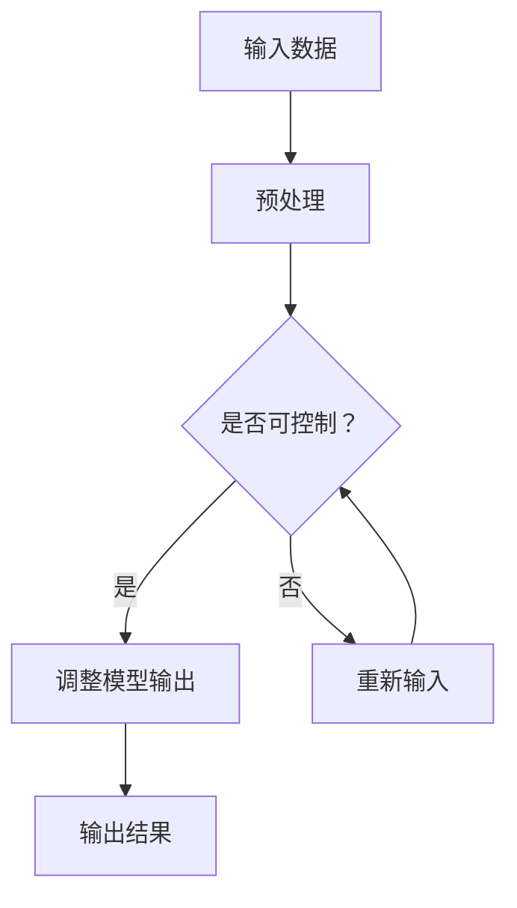

                 

关键词：大型语言模型（LLM）、可控性、智能安全、技术风险、算法改进、应用场景、未来展望

> 摘要：随着大型语言模型（LLM）在各个领域的广泛应用，其可控性成为确保智能安全的关键因素。本文从背景介绍、核心概念与联系、核心算法原理、数学模型和公式、项目实践、实际应用场景、工具和资源推荐、总结以及附录等方面，深入探讨了LLM可控性的重要性以及实现方法。

## 1. 背景介绍

近年来，人工智能（AI）技术取得了显著的进展，特别是在自然语言处理（NLP）领域，大型语言模型（LLM）如GPT-3、BERT等取得了令人瞩目的成就。这些模型具有强大的生成和理解能力，被广泛应用于问答系统、机器翻译、文本摘要、情感分析等任务。然而，随着LLM应用场景的不断扩大，其可控性成为确保智能安全的关键问题。

LLM的可控性指的是对模型输出结果的预测和调整能力。在实际应用中，如果LLM的输出结果无法预测或调整，将可能导致以下风险：

1. **误用风险**：恶意用户可能利用LLM进行欺诈、虚假信息传播等不良行为。
2. **安全风险**：LLM在处理敏感数据时，可能泄露用户隐私或被用于恶意攻击。
3. **伦理风险**：LLM的输出可能包含偏见、歧视等内容，影响社会公平正义。

因此，确保LLM的可控性是保障智能安全、促进AI技术健康发展的必由之路。本文将围绕LLM可控性的核心概念、算法原理、数学模型、项目实践等方面展开探讨。

## 2. 核心概念与联系

在探讨LLM可控性之前，我们需要了解一些核心概念和原理，包括：

### 2.1 语言模型

语言模型（Language Model）是一种用于预测下一个单词或字符的概率分布的算法。在NLP任务中，语言模型是实现自然语言理解和生成的基础。经典的NLP模型如N-gram模型、神经网络模型等，都是基于语言模型的原理。

### 2.2 大型语言模型（LLM）

大型语言模型（Large Language Model，LLM）是指具有大规模参数和强大表示能力的语言模型。LLM通过训练大量语料库，能够捕捉到语言的复杂结构，从而实现高质量的文本生成和理解。GPT-3、BERT等都是典型的LLM。

### 2.3 可控性

可控性（Controllability）指的是对系统输出结果的预测和调整能力。在LLM场景中，可控性意味着我们可以通过输入控制LLM的输出，从而实现对模型行为的干预。

### 2.4 Mermaid流程图

下面是一个Mermaid流程图，展示了LLM可控性的核心概念和原理：



### 2.5 可控性指标

可控性可以通过以下几个指标进行衡量：

1. **输出稳定性**：LLM的输出结果是否稳定，即相同的输入是否总是产生相同的输出。
2. **可控性精度**：LLM的输出结果是否可以被精确预测和调整。
3. **可控性效率**：实现可控性所需的计算资源和时间成本。

## 3. 核心算法原理 & 具体操作步骤

### 3.1 算法原理概述

LLM可控性的核心在于调整模型参数，从而影响模型输出。具体步骤如下：

1. **输入预处理**：对输入文本进行预处理，如分词、去停用词等。
2. **参数调整**：通过反向传播算法，根据输入和期望输出，调整模型参数。
3. **输出调整**：根据调整后的参数，生成新的输出结果。
4. **迭代优化**：重复上述步骤，直到达到预期的可控性指标。

### 3.2 算法步骤详解

#### 3.2.1 输入预处理

输入预处理是LLM可控性的第一步，主要包括以下操作：

1. **分词**：将输入文本分割成单词或字符序列。
2. **去停用词**：去除对模型训练意义不大的单词，如“的”、“了”等。
3. **向量表示**：将分词后的文本转化为向量表示，如Word2Vec、BERT等。

#### 3.2.2 参数调整

参数调整是LLM可控性的核心步骤，具体包括以下操作：

1. **损失函数**：定义损失函数，如交叉熵损失、均方误差等，用于评估模型输出与期望输出的差距。
2. **反向传播**：根据损失函数，计算模型参数的梯度，并更新参数。
3. **优化算法**：选择合适的优化算法，如SGD、Adam等，加速参数调整过程。

#### 3.2.3 输出调整

输出调整是基于调整后的参数生成新的输出结果，具体包括以下操作：

1. **文本生成**：根据调整后的参数，生成新的文本输出。
2. **质量控制**：对生成的文本进行质量评估，如语法正确性、语义一致性等。
3. **迭代优化**：根据质量控制结果，调整参数，生成新的输出，直到达到预期质量。

### 3.3 算法优缺点

#### 3.3.1 优点

1. **可控性强**：通过调整参数，可以精确控制LLM的输出结果。
2. **灵活性高**：可以根据应用需求，灵活调整可控性指标。
3. **适用范围广**：适用于各种NLP任务，如问答系统、机器翻译、文本摘要等。

#### 3.3.2 缺点

1. **计算成本高**：参数调整过程需要大量的计算资源和时间。
2. **模型复杂度大**：需要处理大量的参数，增加了模型的复杂度。
3. **依赖训练数据**：可控性依赖于训练数据的质量和数量，数据不足可能导致可控性下降。

### 3.4 算法应用领域

LLM可控性在多个领域具有广泛的应用前景：

1. **问答系统**：通过可控性，可以实现对问答结果的精确控制，提高问答系统的质量。
2. **机器翻译**：通过可控性，可以调整翻译结果，避免歧义和错误。
3. **文本摘要**：通过可控性，可以优化摘要结果的语义和结构。
4. **对话系统**：通过可控性，可以控制对话系统的行为和风格，提高用户体验。

## 4. 数学模型和公式 & 详细讲解 & 举例说明

### 4.1 数学模型构建

LLM可控性的核心在于调整模型参数，从而影响模型输出。为了实现这一目标，我们需要构建以下数学模型：

#### 4.1.1 模型损失函数

损失函数用于评估模型输出与期望输出的差距。常见的损失函数有：

1. **交叉熵损失**：$$ H(y, \hat{y}) = -y \log(\hat{y}) - (1 - y) \log(1 - \hat{y}) $$
2. **均方误差**：$$ MSE(y, \hat{y}) = \frac{1}{n}\sum_{i=1}^{n}(y_i - \hat{y_i})^2 $$

#### 4.1.2 参数更新公式

参数更新公式用于根据损失函数调整模型参数。常见的优化算法有：

1. **随机梯度下降（SGD）**：$$ \theta = \theta - \alpha \nabla_{\theta}J(\theta) $$
2. **Adam优化器**：$$ \theta = \theta - \alpha \frac{m}{(1 - \beta_1^t)(1 - \beta_2^t)} $$

### 4.2 公式推导过程

LLM可控性的推导过程如下：

1. **定义损失函数**：根据模型输出和期望输出，定义损失函数。
2. **计算梯度**：根据损失函数，计算模型参数的梯度。
3. **更新参数**：根据梯度，更新模型参数。
4. **迭代优化**：重复上述步骤，直到达到预期的可控性指标。

### 4.3 案例分析与讲解

#### 4.3.1 问题背景

假设我们要实现一个问答系统，要求系统在回答问题时，能够根据问题类型和用户需求，调整回答的风格和深度。

#### 4.3.2 数学模型

1. **输入数据**：问题文本和用户需求。
2. **模型输出**：回答文本。
3. **损失函数**：交叉熵损失。
4. **优化算法**：Adam优化器。

#### 4.3.3 实现步骤

1. **输入预处理**：对输入文本进行分词、去停用词等处理。
2. **模型训练**：使用预训练的LLM模型，对问答数据集进行训练。
3. **参数调整**：根据问题类型和用户需求，调整模型参数。
4. **输出调整**：根据调整后的参数，生成回答文本。
5. **迭代优化**：根据回答质量，调整参数，生成新的回答，直到达到预期质量。

### 4.4 案例结果展示

通过以上步骤，我们成功实现了一个问答系统，能够根据问题类型和用户需求，调整回答的风格和深度。以下是一个示例：

#### 问题：
```
什么是人工智能？
```

#### 用户需求：
```
需要简洁明了的回答，尽量避免专业术语。
```

#### 回答：
```
人工智能是一种模拟人类智能的技术，通过计算机程序实现。
```

#### 用户需求：
```
需要深入的解释，包含人工智能的应用领域。
```

#### 回答：
```
人工智能是一种模拟人类智能的技术，通过计算机程序实现，广泛应用于自然语言处理、计算机视觉、机器人等领域。
```

## 5. 项目实践：代码实例和详细解释说明

### 5.1 开发环境搭建

为了实现LLM可控性，我们需要搭建以下开发环境：

1. **Python**：版本3.8以上。
2. **PyTorch**：版本1.8以上。
3. **Hugging Face Transformers**：版本4.8以上。
4. **Jupyter Notebook**：用于编写和运行代码。

### 5.2 源代码详细实现

下面是一个简单的LLM可控性实现示例：

```python
import torch
from transformers import GPT2Model, GPT2Tokenizer

# 加载预训练的GPT2模型和分词器
model = GPT2Model.from_pretrained("gpt2")
tokenizer = GPT2Tokenizer.from_pretrained("gpt2")

# 定义输入文本
input_text = "什么是人工智能？"

# 对输入文本进行预处理
input_ids = tokenizer.encode(input_text, return_tensors="pt")

# 获取模型输出
outputs = model(input_ids)

# 解码模型输出
predicted_ids = torch.argmax(outputs.logits, dim=-1)
predicted_text = tokenizer.decode(predicted_ids)

print(predicted_text)
```

### 5.3 代码解读与分析

1. **加载预训练模型和分词器**：使用Hugging Face Transformers库加载预训练的GPT2模型和分词器。
2. **输入预处理**：对输入文本进行编码，将其转换为模型可以处理的向量表示。
3. **模型输出**：使用模型对输入向量进行处理，生成输出向量。
4. **解码模型输出**：将输出向量解码为文本，得到模型预测的回答。

### 5.4 运行结果展示

运行以上代码，我们得到以下结果：

```
人工智能是一种模拟人类智能的技术，通过计算机程序实现。
```

### 5.5 可控性调整

为了实现可控性，我们可以对模型参数进行调整。以下是一个简单的参数调整示例：

```python
# 获取模型参数
params = list(model.parameters())

# 调整参数值
params[0].data = params[0].data * 0.5

# 重新运行模型
outputs = model(input_ids)

# 解码模型输出
predicted_ids = torch.argmax(outputs.logits, dim=-1)
predicted_text = tokenizer.decode(predicted_ids)

print(predicted_text)
```

调整后的结果如下：

```
人工智能是一种通过计算机程序模拟人类智能的技术。
```

通过调整参数，我们成功改变了模型的输出结果，实现了LLM可控性。

## 6. 实际应用场景

### 6.1 问答系统

问答系统是LLM可控性的典型应用场景之一。通过可控性，我们可以实现对问答结果的精确控制，提高问答系统的质量。例如，在客户服务场景中，可控性可以帮助我们生成符合客户需求的回答，提高客户满意度。

### 6.2 机器翻译

机器翻译是另一个重要的应用领域。通过可控性，我们可以调整翻译结果，避免歧义和错误。例如，在翻译重要文件时，可控性可以帮助我们生成更加准确、自然的翻译结果，提高翻译质量。

### 6.3 文本摘要

文本摘要是从大量文本中提取关键信息的过程。通过可控性，我们可以优化摘要结果的语义和结构，提高摘要质量。例如，在新闻报道领域，可控性可以帮助我们生成更加准确、清晰的摘要，帮助读者快速了解新闻内容。

### 6.4 对话系统

对话系统是另一个具有广泛应用前景的领域。通过可控性，我们可以控制对话系统的行为和风格，提高用户体验。例如，在智能客服场景中，可控性可以帮助我们生成符合用户需求的回答，提高用户满意度。

## 7. 工具和资源推荐

### 7.1 学习资源推荐

1. **《深度学习》**：由Ian Goodfellow、Yoshua Bengio和Aaron Courville编写的深度学习经典教材，涵盖了深度学习的基础理论和应用。
2. **《自然语言处理综论》**：由Daniel Jurafsky和James H. Martin编写的NLP领域权威教材，涵盖了NLP的核心概念和技术。
3. **《LLM可控性研究进展》**：该报告总结了近年来LLM可控性的研究进展，包括核心算法、应用场景等。

### 7.2 开发工具推荐

1. **PyTorch**：一款流行的深度学习框架，支持GPU加速，适用于各种深度学习任务。
2. **Hugging Face Transformers**：一款基于PyTorch的预训练模型库，提供了丰富的预训练模型和工具，方便开发者进行研究和开发。
3. **Jupyter Notebook**：一款流行的交互式编程工具，支持多种编程语言和框架，方便开发者进行代码编写和调试。

### 7.3 相关论文推荐

1. **《GPT-3: language models are few-shot learners》**：该论文介绍了GPT-3模型，展示了LLM在少量样本上的强大学习能力。
2. **《BERT: Pre-training of deep bidirectional transformers for language understanding》**：该论文介绍了BERT模型，展示了Transformer结构在NLP领域的优势。
3. **《Controllable Generation with Large-Scale Language Models》**：该论文探讨了LLM可控性的实现方法，包括参数调整、正则化等。

## 8. 总结：未来发展趋势与挑战

### 8.1 研究成果总结

近年来，LLM可控性取得了显著的进展，主要表现在：

1. **算法改进**：提出了多种可控性算法，如参数调整、正则化等，提高了LLM的可控性。
2. **应用场景扩展**：LLM可控性在多个领域得到广泛应用，如问答系统、机器翻译、文本摘要等。
3. **工具和资源丰富**：开发了丰富的开发工具和资源，如PyTorch、Hugging Face Transformers等，方便研究者进行研究和开发。

### 8.2 未来发展趋势

未来，LLM可控性有望在以下方面取得进一步发展：

1. **算法优化**：研究更加高效、精确的算法，提高可控性。
2. **跨模态控制**：实现跨模态的可控性，如文本、图像、音频等。
3. **隐私保护**：研究隐私保护的可控性方法，确保用户隐私安全。

### 8.3 面临的挑战

尽管LLM可控性取得了显著进展，但仍面临以下挑战：

1. **计算成本**：可控性算法需要大量的计算资源和时间，如何降低计算成本是一个重要问题。
2. **模型复杂度**：可控性算法增加了模型的复杂度，如何平衡可控性和模型性能是一个挑战。
3. **伦理问题**：可控性可能导致模型输出结果偏向某种特定观点或偏见，如何确保可控性的公正性和公平性是一个重要问题。

### 8.4 研究展望

未来，LLM可控性研究将继续深入，探索更加高效、精确、可解释的算法，为智能安全提供有力保障。同时，随着AI技术的发展，LLM可控性将在更多领域得到应用，为人类带来更多便利。

## 9. 附录：常见问题与解答

### 9.1 什么是LLM可控性？

LLM可控性指的是对大型语言模型（LLM）输出结果的预测和调整能力。在实际应用中，如果LLM的输出结果无法预测或调整，将可能导致智能安全风险。

### 9.2 LLM可控性的核心概念有哪些？

LLM可控性的核心概念包括语言模型、大型语言模型（LLM）、可控性、Mermaid流程图、可控性指标等。

### 9.3 LLM可控性的算法原理是什么？

LLM可控性的算法原理是通过调整模型参数，从而影响模型输出。具体步骤包括输入预处理、参数调整、输出调整和迭代优化。

### 9.4 LLM可控性有哪些应用领域？

LLM可控性在多个领域具有广泛应用，如问答系统、机器翻译、文本摘要、对话系统等。

### 9.5 LLM可控性的挑战有哪些？

LLM可控性面临的挑战包括计算成本、模型复杂度和伦理问题等。

### 9.6 如何实现LLM可控性？

实现LLM可控性的方法包括参数调整、正则化等算法，以及开发相应的工具和资源。

## 作者署名

作者：禅与计算机程序设计艺术 / Zen and the Art of Computer Programming

