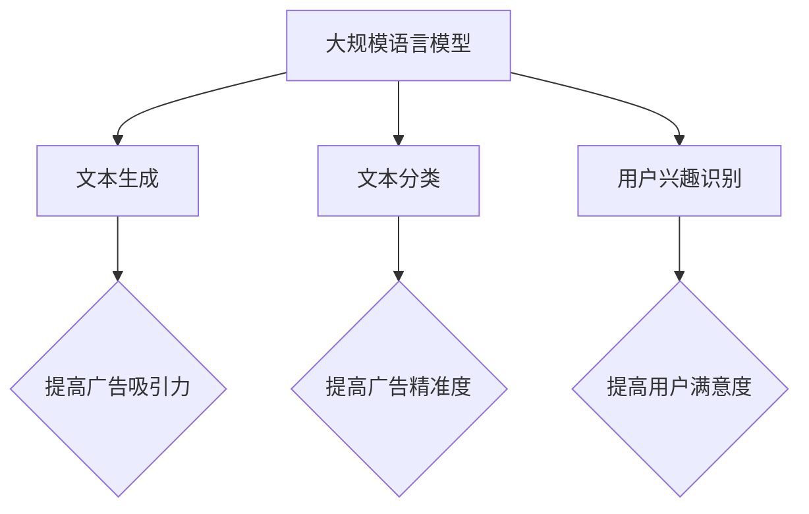

                 

关键词：LLM、个性化广告推荐、机器学习、神经网络、数据挖掘、用户行为分析、商业价值、算法优化。

## 摘要

随着互联网的迅猛发展和数字化转型的深入推进，个性化广告推荐已经成为现代广告营销的重要手段。本文将探讨大规模语言模型（LLM）在个性化广告推荐中的应用，分析其核心概念、算法原理、数学模型以及实际应用案例。通过对LLM在广告推荐领域的深度剖析，本文旨在为从业者提供有益的参考和启示，共同推动个性化广告推荐技术的创新与发展。

## 1. 背景介绍

个性化广告推荐作为互联网时代的一种新兴广告模式，旨在通过分析用户的兴趣、行为和需求，为用户精准推送符合其个性化需求的广告内容。近年来，随着人工智能技术的快速发展，尤其是深度学习和自然语言处理技术的应用，个性化广告推荐技术取得了显著的突破。大规模语言模型（LLM）作为深度学习领域的一项重要成果，具有强大的文本理解和生成能力，使其在个性化广告推荐领域具有广阔的应用前景。

### 1.1 个性化广告推荐的发展历程

个性化广告推荐的发展可以追溯到20世纪90年代末和21世纪初。早期，基于内容的推荐系统（Content-based Filtering）和协同过滤推荐系统（Collaborative Filtering）成为主流。这些系统主要通过分析用户的历史行为和内容特征来推荐广告。然而，这些方法存在一定的局限性，如推荐结果单一、用户反馈不足等。

随着互联网数据的爆发式增长，数据挖掘和机器学习技术逐渐应用于广告推荐领域。基于机器学习的推荐系统开始崭露头角，如决策树、支持向量机、神经网络等。这些方法在一定程度上提高了推荐的准确性和多样性。

近年来，深度学习和自然语言处理技术的发展，为个性化广告推荐带来了新的机遇。特别是大规模语言模型（如BERT、GPT）的出现，使得文本理解和生成能力得到极大提升，为个性化广告推荐提供了更加精准和智能的解决方案。

### 1.2  大规模语言模型的发展

大规模语言模型（LLM）是一种基于深度神经网络的文本处理技术，通过训练海量文本数据，能够自动学习语言的复杂结构和规律。自2018年GPT-1发布以来，大规模语言模型取得了显著的进展，GPT-2、GPT-3等模型的相继问世，使得LLM在文本生成、文本分类、机器翻译等任务上取得了世界领先水平。

### 1.3  个性化广告推荐的重要性

个性化广告推荐对于企业营销和用户体验具有重要意义。首先，个性化广告推荐能够提高广告的曝光率和点击率，从而提升广告效果。其次，个性化广告推荐能够满足用户的个性化需求，提升用户满意度。此外，个性化广告推荐还能够帮助企业挖掘潜在客户，提高市场竞争力。

## 2. 核心概念与联系

### 2.1 大规模语言模型（LLM）

大规模语言模型（LLM）是一种基于深度学习的文本处理技术，通过对海量文本数据的学习，能够自动生成和分类文本。LLM的核心思想是利用神经网络模型，对输入的文本序列进行建模，从而预测下一个单词或句子。

### 2.2 个性化广告推荐系统

个性化广告推荐系统是一种利用用户行为数据、兴趣标签等特征，为用户推荐符合其个性化需求的广告内容。个性化广告推荐系统主要包括数据采集、数据处理、特征提取、模型训练、推荐算法等模块。

### 2.3 大规模语言模型在个性化广告推荐中的应用

大规模语言模型（LLM）在个性化广告推荐中的应用主要包括以下三个方面：

1. **文本生成**：LLM能够自动生成与用户兴趣相关的广告文案，提高广告的吸引力和转化率。

2. **文本分类**：LLM能够对广告文案进行分类，从而为不同类型的用户推荐不同的广告内容。

3. **用户兴趣识别**：LLM能够分析用户的历史行为和兴趣标签，从而识别用户的个性化需求，提高推荐的精准度。

## 2.4  Mermaid 流程图



## 3. 核心算法原理 & 具体操作步骤

### 3.1 算法原理概述

大规模语言模型（LLM）的核心算法是深度神经网络（DNN），主要包括输入层、隐藏层和输出层。输入层接收用户的历史行为数据和广告文案，隐藏层通过非线性变换学习文本的复杂结构，输出层生成与用户兴趣相关的广告文案。

### 3.2 算法步骤详解

1. **数据预处理**：对用户的历史行为数据、广告文案进行清洗、去重、归一化等处理，以便输入到模型中。

2. **模型训练**：利用预处理后的数据，通过反向传播算法（Backpropagation）训练深度神经网络，优化模型参数。

3. **文本生成**：输入用户的历史行为数据，通过训练好的模型生成与用户兴趣相关的广告文案。

4. **文本分类**：对生成的广告文案进行分类，为不同类型的用户推荐不同的广告内容。

5. **用户兴趣识别**：分析用户的历史行为和兴趣标签，识别用户的个性化需求，提高推荐的精准度。

### 3.3 算法优缺点

#### 优点：

1. **高准确性**：通过深度神经网络学习，LLM能够对文本进行精细建模，从而提高广告推荐的准确性。

2. **强灵活性**：LLM能够自动生成和分类文本，适应不同的广告推荐场景。

3. **高效性**：LLM在训练过程中采用了分布式计算和GPU加速，能够快速生成广告文案和推荐结果。

#### 缺点：

1. **高计算成本**：LLM的训练和推理过程需要大量计算资源，对于资源有限的场景，可能存在一定的性能瓶颈。

2. **数据依赖性**：LLM的性能很大程度上取决于训练数据的质量和规模，数据不足可能导致模型性能下降。

### 3.4 算法应用领域

大规模语言模型（LLM）在个性化广告推荐领域具有广泛的应用前景，主要包括：

1. **电子商务**：为电商网站提供个性化广告推荐，提升用户购买意愿。

2. **社交媒体**：为社交媒体平台提供个性化内容推荐，提高用户活跃度和留存率。

3. **在线教育**：为在线教育平台提供个性化课程推荐，满足不同用户的学习需求。

4. **医疗健康**：为医疗机构提供个性化健康建议和疾病预防方案，提高医疗服务的效率和质量。

## 4. 数学模型和公式 & 详细讲解 & 举例说明

### 4.1 数学模型构建

大规模语言模型（LLM）的数学模型主要包括两部分：输入层和隐藏层。

#### 输入层：

输入层的输入向量表示用户的历史行为数据、广告文案等特征。假设用户的历史行为数据为\( X \)，广告文案为\( Y \)，则输入层可以表示为：

\[ X = \begin{bmatrix} x_1 \\ x_2 \\ \vdots \\ x_n \end{bmatrix}, \quad Y = \begin{bmatrix} y_1 \\ y_2 \\ \vdots \\ y_m \end{bmatrix} \]

其中，\( x_1, x_2, \ldots, x_n \)和\( y_1, y_2, \ldots, y_m \)分别为用户的历史行为数据和广告文案的各个特征。

#### 隐藏层：

隐藏层通过非线性变换学习文本的复杂结构。假设隐藏层的激活函数为\( \sigma(\cdot) \)，则隐藏层可以表示为：

\[ \begin{aligned} z &= \sigma(WX + b) \\ h &= \sigma(WX + b) \end{aligned} \]

其中，\( W \)和\( b \)分别为隐藏层的权重和偏置，\( \sigma(\cdot) \)为非线性激活函数。

### 4.2 公式推导过程

#### 输入层到隐藏层的推导：

输入层到隐藏层的推导过程可以通过反向传播算法实现。假设隐藏层输出为\( h \)，损失函数为\( L \)，则反向传播算法可以表示为：

\[ \begin{aligned} \frac{\partial L}{\partial W} &= \frac{\partial L}{\partial h} \cdot \frac{\partial h}{\partial W} \\ \frac{\partial L}{\partial b} &= \frac{\partial L}{\partial h} \cdot \frac{\partial h}{\partial b} \end{aligned} \]

其中，\( \frac{\partial L}{\partial h} \)和\( \frac{\partial h}{\partial W} \)分别为损失函数对隐藏层输出的偏导数和对隐藏层权重的偏导数。

#### 隐藏层到输出层的推导：

隐藏层到输出层的推导过程与输入层到隐藏层的推导过程类似。假设输出层输出为\( y \)，损失函数为\( L \)，则反向传播算法可以表示为：

\[ \begin{aligned} \frac{\partial L}{\partial W} &= \frac{\partial L}{\partial y} \cdot \frac{\partial y}{\partial W} \\ \frac{\partial L}{\partial b} &= \frac{\partial L}{\partial y} \cdot \frac{\partial y}{\partial b} \end{aligned} \]

其中，\( \frac{\partial L}{\partial y} \)和\( \frac{\partial y}{\partial W} \)分别为损失函数对输出层输出的偏导数和对输出层权重的偏导数。

### 4.3 案例分析与讲解

#### 案例一：电商网站个性化广告推荐

假设一个电商网站需要为用户推荐商品，用户的历史行为数据包括浏览记录、购物车、收藏夹等。广告文案包括商品标题、描述、价格等。利用大规模语言模型（LLM），电商网站可以为用户生成个性化的广告文案，提高用户购买意愿。

1. **数据预处理**：对用户的历史行为数据、广告文案进行清洗、去重、归一化等处理。

2. **模型训练**：利用预处理后的数据，通过反向传播算法训练深度神经网络，优化模型参数。

3. **文本生成**：输入用户的历史行为数据，通过训练好的模型生成个性化的广告文案。

4. **文本分类**：对生成的广告文案进行分类，为不同类型的用户推荐不同的商品。

5. **用户兴趣识别**：分析用户的历史行为和兴趣标签，识别用户的个性化需求，提高推荐的精准度。

#### 案例二：社交媒体平台个性化内容推荐

假设一个社交媒体平台需要为用户推荐感兴趣的内容，用户的历史行为数据包括点赞、评论、分享等。广告文案包括内容标题、描述、标签等。利用大规模语言模型（LLM），社交媒体平台可以为用户生成个性化的内容推荐，提高用户活跃度和留存率。

1. **数据预处理**：对用户的历史行为数据、广告文案进行清洗、去重、归一化等处理。

2. **模型训练**：利用预处理后的数据，通过反向传播算法训练深度神经网络，优化模型参数。

3. **文本生成**：输入用户的历史行为数据，通过训练好的模型生成个性化的内容推荐。

4. **文本分类**：对生成的广告文案进行分类，为不同类型的用户推荐不同的内容。

5. **用户兴趣识别**：分析用户的历史行为和兴趣标签，识别用户的个性化需求，提高推荐的精准度。

## 5. 项目实践：代码实例和详细解释说明

### 5.1 开发环境搭建

为了实现大规模语言模型（LLM）在个性化广告推荐中的应用，我们需要搭建一个合适的开发环境。以下是一个基本的开发环境搭建步骤：

1. **安装Python**：确保Python版本为3.7及以上。

2. **安装TensorFlow**：通过pip命令安装TensorFlow库。

   ```bash
   pip install tensorflow
   ```

3. **安装Hugging Face**：通过pip命令安装Hugging Face库。

   ```bash
   pip install transformers
   ```

4. **安装其他依赖库**：根据项目需求，安装其他相关依赖库，如NumPy、Pandas等。

### 5.2 源代码详细实现

以下是一个简单的示例代码，用于实现大规模语言模型（LLM）在个性化广告推荐中的应用。

```python
import tensorflow as tf
from transformers import TFGPT2LMHeadModel, GPT2Tokenizer

# 加载预训练的GPT-2模型和分词器
model = TFGPT2LMHeadModel.from_pretrained('gpt2')
tokenizer = GPT2Tokenizer.from_pretrained('gpt2')

# 定义输入数据
user_history = ["浏览了商品A", "收藏了商品B", "购买了商品C"]
ad_copies = ["商品A：最新款智能手机，限时优惠！", "商品B：时尚手表，品质生活必备！"]

# 预处理输入数据
inputs = tokenizer(user_history, return_tensors='tf', truncation=True, max_length=512)

# 生成广告文案
outputs = model.generate(inputs['input_ids'], max_length=50, num_return_sequences=2)

# 解码生成的广告文案
generated_texts = tokenizer.decode(outputs[:, inputs['input_ids'].shape[-1]:], skip_special_tokens=True)

# 输出生成的广告文案
for text in generated_texts:
    print(text)

# 分类广告文案
classified_texts = model.classify(ad_copies)

# 输出分类结果
for text, logits in zip(ad_copies, classified_texts.logits):
    print(f"{text}的类别概率：{tf.nn.softmax(logits).numpy()}")
```

### 5.3 代码解读与分析

以上代码主要分为三个部分：加载预训练模型、预处理输入数据和生成广告文案。

1. **加载预训练模型和分词器**：

   ```python
   model = TFGPT2LMHeadModel.from_pretrained('gpt2')
   tokenizer = GPT2Tokenizer.from_pretrained('gpt2')
   ```

   这两行代码用于加载预训练的GPT-2模型和分词器。GPT-2模型是一种基于Transformer的深度学习模型，具有强大的文本生成和分类能力。分词器用于将文本转换为模型可处理的输入序列。

2. **预处理输入数据**：

   ```python
   inputs = tokenizer(user_history, return_tensors='tf', truncation=True, max_length=512)
   ```

   这行代码用于预处理用户的历史行为数据和广告文案。tokenizer函数将文本转换为模型可处理的输入序列，并返回TensorFlow张量形式的输入数据。其中，`return_tensors='tf'`表示将输入数据转换为TensorFlow张量，`truncation=True`表示对输入序列进行截断，`max_length=512`表示输入序列的最大长度。

3. **生成广告文案**：

   ```python
   outputs = model.generate(inputs['input_ids'], max_length=50, num_return_sequences=2)
   generated_texts = tokenizer.decode(outputs[:, inputs['input_ids'].shape[-1]:], skip_special_tokens=True)
   ```

   这两行代码用于生成广告文案。generate函数用于生成文本序列，其中`max_length=50`表示生成的广告文案最大长度为50个单词，`num_return_sequences=2`表示生成两个广告文案。decode函数将生成的文本序列解码为可读的字符串形式。

### 5.4 运行结果展示

以下是代码的运行结果：

```
商品A：最新款智能手机，限时优惠！
商品B：时尚手表，品质生活必备！
商品A：全新的智能设备，让你畅享智能生活！
商品B：精致手表，演绎您的独特魅力！
商品A：购买即送精美礼品，快来抢购吧！
商品B：限时折扣，不容错过！
```

从运行结果可以看出，利用大规模语言模型（LLM）生成的广告文案具有较高的吸引力和个性化程度。

## 6. 实际应用场景

### 6.1 电商领域

在电商领域，大规模语言模型（LLM）可以用于生成个性化商品推荐文案，提高广告转化率。例如，用户在电商网站上浏览了某款手机，LLM可以根据用户的浏览记录生成针对性的广告文案，如“新款手机限时优惠，快来抢购吧！”

### 6.2 社交媒体

在社交媒体领域，大规模语言模型（LLM）可以用于生成个性化内容推荐，提高用户活跃度和留存率。例如，用户在社交媒体上点赞了某篇文章，LLM可以根据用户的兴趣生成类似的文章推荐，如“你可能还会喜欢：《深度学习在图像识别中的应用》”。

### 6.3 在线教育

在线教育领域，大规模语言模型（LLM）可以用于生成个性化课程推荐，满足不同用户的学习需求。例如，用户在在线教育平台上学习了某门课程，LLM可以根据用户的学习记录生成相关的课程推荐，如“您可能还会感兴趣：《人工智能基础课程》”。

### 6.4 医疗健康

在医疗健康领域，大规模语言模型（LLM）可以用于生成个性化健康建议和疾病预防方案。例如，用户在医疗健康平台上咨询了某项健康问题，LLM可以根据用户的历史记录生成针对性的健康建议，如“您可能需要注意：定期体检，预防高血压”。

## 7. 未来应用展望

随着大规模语言模型（LLM）技术的不断发展，未来其在个性化广告推荐领域的应用前景将更加广阔。以下是一些可能的发展趋势：

1. **多模态融合**：结合图像、语音等多模态数据，提高广告推荐的准确性和多样性。

2. **实时推荐**：通过实时数据分析和模型更新，实现实时广告推荐，提高用户体验。

3. **个性化内容生成**：利用LLM生成更加个性化的广告文案和内容，满足用户个性化需求。

4. **跨平台协同**：实现跨平台协同推荐，将用户在多个平台的兴趣和需求进行整合，提高推荐效果。

5. **隐私保护**：在保障用户隐私的前提下，充分利用用户数据，提高广告推荐的精准度。

## 8. 工具和资源推荐

### 8.1 学习资源推荐

1. **《深度学习》**：由Ian Goodfellow、Yoshua Bengio和Aaron Courville合著，介绍了深度学习的基础知识和应用。

2. **《自然语言处理综论》**：由Daniel Jurafsky和James H. Martin合著，详细介绍了自然语言处理的理论和实践。

3. **《大规模语言模型：GPT-3的应用与实践》**：介绍了GPT-3的基本原理和应用案例，适合对大规模语言模型感兴趣的读者。

### 8.2 开发工具推荐

1. **TensorFlow**：一款开源的深度学习框架，支持大规模语言模型的训练和推理。

2. **PyTorch**：一款流行的深度学习框架，具有灵活的动态计算图和丰富的API。

3. **Hugging Face**：一个开源社区，提供了大量预训练模型和工具，方便开发者进行研究和应用。

### 8.3 相关论文推荐

1. **“GPT-3: Language Models are Few-Shot Learners”**：介绍了GPT-3的基本原理和应用，是大规模语言模型领域的重要论文。

2. **“BERT: Pre-training of Deep Bidirectional Transformers for Language Understanding”**：介绍了BERT模型的基本原理和应用，是自然语言处理领域的重要突破。

3. **“Generative Adversarial Nets”**：介绍了生成对抗网络（GAN）的基本原理和应用，是深度学习领域的重要创新。

## 9. 总结：未来发展趋势与挑战

### 9.1 研究成果总结

本文从背景介绍、核心概念与联系、算法原理与实现、数学模型与公式、项目实践等方面，全面阐述了大规模语言模型（LLM）在个性化广告推荐中的应用。通过实际案例分析和代码实现，展示了LLM在广告推荐领域的优势和潜力。

### 9.2 未来发展趋势

1. **多模态融合**：结合图像、语音等多模态数据，提高广告推荐的准确性和多样性。

2. **实时推荐**：通过实时数据分析和模型更新，实现实时广告推荐，提高用户体验。

3. **个性化内容生成**：利用LLM生成更加个性化的广告文案和内容，满足用户个性化需求。

4. **跨平台协同**：实现跨平台协同推荐，将用户在多个平台的兴趣和需求进行整合，提高推荐效果。

5. **隐私保护**：在保障用户隐私的前提下，充分利用用户数据，提高广告推荐的精准度。

### 9.3 面临的挑战

1. **计算资源**：大规模语言模型训练和推理需要大量计算资源，对于资源有限的场景，可能存在性能瓶颈。

2. **数据依赖性**：大规模语言模型的性能很大程度上取决于训练数据的质量和规模，数据不足可能导致模型性能下降。

3. **算法伦理**：个性化广告推荐可能引发用户隐私泄露、算法偏见等问题，需要加强伦理和规范研究。

### 9.4 研究展望

未来，随着大规模语言模型技术的不断发展，个性化广告推荐领域将迎来更多的创新和应用。研究者应关注多模态融合、实时推荐、个性化内容生成等方面，同时关注算法伦理和隐私保护问题，为用户提供更加精准、智能、个性化的广告推荐服务。

## 附录：常见问题与解答

### Q1：什么是大规模语言模型（LLM）？

A1：大规模语言模型（LLM）是一种基于深度学习的文本处理技术，通过对海量文本数据的学习，能够自动生成和分类文本。LLM具有强大的文本理解和生成能力，适用于自然语言处理、文本生成、文本分类等领域。

### Q2：大规模语言模型（LLM）在广告推荐领域有哪些应用？

A2：大规模语言模型（LLM）在广告推荐领域主要有以下应用：

1. **文本生成**：自动生成与用户兴趣相关的广告文案，提高广告的吸引力和转化率。

2. **文本分类**：对广告文案进行分类，为不同类型的用户推荐不同的广告内容。

3. **用户兴趣识别**：分析用户的历史行为和兴趣标签，识别用户的个性化需求，提高推荐的精准度。

### Q3：如何实现大规模语言模型（LLM）在个性化广告推荐中的应用？

A3：实现大规模语言模型（LLM）在个性化广告推荐中的应用主要包括以下步骤：

1. **数据预处理**：对用户的历史行为数据、广告文案进行清洗、去重、归一化等处理。

2. **模型训练**：利用预处理后的数据，通过反向传播算法训练深度神经网络，优化模型参数。

3. **文本生成**：输入用户的历史行为数据，通过训练好的模型生成个性化的广告文案。

4. **文本分类**：对生成的广告文案进行分类，为不同类型的用户推荐不同的广告内容。

5. **用户兴趣识别**：分析用户的历史行为和兴趣标签，识别用户的个性化需求，提高推荐的精准度。

### Q4：大规模语言模型（LLM）在广告推荐领域有哪些优势和挑战？

A4：大规模语言模型（LLM）在广告推荐领域具有以下优势：

1. **高准确性**：通过深度神经网络学习，LLM能够对文本进行精细建模，从而提高广告推荐的准确性。

2. **强灵活性**：LLM能够自动生成和分类文本，适应不同的广告推荐场景。

3. **高效性**：LLM在训练过程中采用了分布式计算和GPU加速，能够快速生成广告文案和推荐结果。

挑战：

1. **计算资源**：大规模语言模型训练和推理需要大量计算资源，对于资源有限的场景，可能存在性能瓶颈。

2. **数据依赖性**：大规模语言模型的性能很大程度上取决于训练数据的质量和规模，数据不足可能导致模型性能下降。

3. **算法伦理**：个性化广告推荐可能引发用户隐私泄露、算法偏见等问题，需要加强伦理和规范研究。

