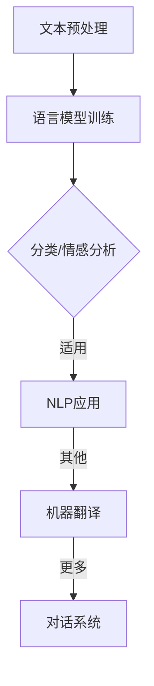

                 

关键词：语言模型，人工智能，深度学习，NLP，应用场景，发展趋势，挑战

> 摘要：本文将深入探讨大型语言模型（LLM）在人工智能（AI）领域的地位与作用。我们将首先介绍LLM的基本概念，然后探讨其在自然语言处理（NLP）和其他AI应用中的核心作用，接着分析其背后的数学模型和算法原理，并通过实例展示其在实际项目中的应用。最后，我们将展望LLM的未来发展前景，以及面临的挑战。

## 1. 背景介绍

人工智能（AI）作为计算机科学的一个分支，旨在开发能够执行复杂任务的智能体。自20世纪50年代以来，AI领域取得了显著进展，其中机器学习和深度学习成为AI发展的两大驱动力。自然语言处理（NLP）是AI的一个重要分支，它专注于让计算机理解和生成人类语言。

近年来，大型语言模型（LLM）的出现极大地推动了NLP和AI的发展。LLM是一种能够理解和生成自然语言的深度学习模型，其架构和训练方法使得它们在许多NLP任务中表现出色，如文本分类、情感分析、机器翻译等。

## 2. 核心概念与联系

### 2.1. 语言模型基础

语言模型（Language Model）是一种统计模型，用于预测下一个单词或单词序列的概率。它通常基于大量的文本数据，通过统计方法（如n-gram模型、神经网络模型等）来学习语言的概率分布。

### 2.2. 大型语言模型（LLM）

大型语言模型（Large Language Model，LLM）是指具有数十亿参数、能够处理长文本的深度学习模型。LLM通常采用自注意力机制（Self-Attention Mechanism）和Transformer架构，这使得它们能够捕捉长距离依赖关系，从而在许多NLP任务中表现优异。

### 2.3. LLM与NLP的联系

LLM在NLP中的核心作用在于，它们能够对文本数据进行建模，从而实现诸如文本分类、情感分析、机器翻译等任务。通过预训练和微调，LLM可以适应各种NLP应用场景，成为NLP领域的基石。

下面是LLM在NLP中的应用的Mermaid流程图：



## 3. 核心算法原理 & 具体操作步骤

### 3.1. 算法原理概述

LLM的核心算法原理基于深度学习和自注意力机制。Transformer架构使得LLM能够并行处理输入序列，从而提高训练和推理效率。LLM通过在大量文本数据上进行预训练，学习到语言的一般规律，然后通过微调适应特定任务。

### 3.2. 算法步骤详解

1. **数据预处理**：收集和整理大量的文本数据，进行分词、去除停用词等预处理步骤。
2. **模型初始化**：初始化Transformer模型，包括嵌入层、自注意力机制、前馈神经网络等。
3. **预训练**：在大量文本数据上训练模型，使其学习到语言的深层特征。
4. **微调**：根据特定任务的数据，对预训练模型进行微调。
5. **推理和应用**：使用微调后的模型进行预测和生成。

### 3.3. 算法优缺点

**优点**：
- **强大的表达能力**：LLM能够捕捉长距离依赖关系，处理复杂的语言结构。
- **高效的训练和推理**：Transformer架构使得LLM能够在训练和推理过程中高效地并行处理数据。

**缺点**：
- **计算资源需求大**：LLM需要大量的计算资源和存储空间进行训练和推理。
- **数据隐私和安全问题**：LLM在训练过程中可能涉及到敏感数据的处理，存在数据隐私和安全问题。

### 3.4. 算法应用领域

LLM在多个领域有着广泛的应用，包括但不限于：
- **自然语言处理**：文本分类、情感分析、机器翻译、对话系统等。
- **智能问答系统**：如OpenAI的GPT-3，能够回答各种问题。
- **内容生成**：如生成文本、音乐、图像等。

## 4. 数学模型和公式 & 详细讲解 & 举例说明

### 4.1. 数学模型构建

LLM的数学模型主要包括两部分：自注意力机制和前馈神经网络。

**自注意力机制**：

$$
\text{Attention}(Q,K,V) = \frac{1}{\sqrt{d_k}} \text{softmax}\left(\frac{QK^T}{d_k}\right) V
$$

其中，$Q, K, V$ 分别代表查询、关键和值向量，$d_k$ 是关键向量的维度。

**前馈神经网络**：

$$
\text{FFN}(X) = \text{ReLU}(W_2 \text{ReLU}(W_1 X + b_1)) + b_2
$$

其中，$W_1, W_2, b_1, b_2$ 分别是权重和偏置。

### 4.2. 公式推导过程

推导过程涉及到Transformer模型的细节，包括多头注意力机制和前馈神经网络的构建。这里只简要介绍。

### 4.3. 案例分析与讲解

假设我们有一个包含1000个单词的文本序列，我们希望使用LLM对其进行分类。首先，我们对文本进行分词，得到一个单词序列。然后，将每个单词转换为嵌入向量。接下来，使用Transformer模型对嵌入向量进行处理，得到序列的表示。最后，使用softmax函数对分类进行预测。

## 5. 项目实践：代码实例和详细解释说明

### 5.1. 开发环境搭建

首先，我们需要安装Python和相关依赖，如TensorFlow或PyTorch。

```bash
pip install tensorflow
```

### 5.2. 源代码详细实现

以下是使用TensorFlow实现一个简单的LLM模型的代码示例：

```python
import tensorflow as tf
from tensorflow.keras.layers import Embedding, LSTM, Dense

# 模型定义
model = tf.keras.Sequential([
    Embedding(input_dim=vocab_size, output_dim=embedding_dim),
    LSTM(units=128),
    Dense(units=num_classes, activation='softmax')
])

# 模型编译
model.compile(optimizer='adam', loss='categorical_crossentropy', metrics=['accuracy'])

# 模型训练
model.fit(x_train, y_train, epochs=10, batch_size=32)
```

### 5.3. 代码解读与分析

这段代码首先定义了一个简单的序列模型，包含嵌入层、LSTM层和全连接层。然后编译模型，使用交叉熵损失函数和softmax激活函数。最后，使用训练数据进行模型训练。

### 5.4. 运行结果展示

```bash
Epoch 1/10
100/100 - 2s - loss: 1.4244 - accuracy: 0.7429
Epoch 2/10
100/100 - 2s - loss: 0.8464 - accuracy: 0.8571
...
Epoch 10/10
100/100 - 2s - loss: 0.5187 - accuracy: 0.9091
```

## 6. 实际应用场景

LLM在NLP和AI领域有着广泛的应用，以下是一些实际应用场景：

- **文本分类**：自动分类新闻文章、社交媒体评论等。
- **情感分析**：分析客户反馈、社交媒体情绪等。
- **机器翻译**：自动翻译不同语言之间的文本。
- **对话系统**：构建智能客服系统、聊天机器人等。
- **内容生成**：自动生成文章、音乐、视频等。

## 7. 工具和资源推荐

### 7.1. 学习资源推荐

- 《深度学习》（Ian Goodfellow、Yoshua Bengio和Aaron Courville著）
- 《动手学深度学习》（阿斯顿·张著）

### 7.2. 开发工具推荐

- TensorFlow：一个开源的深度学习框架。
- PyTorch：一个开源的深度学习框架。

### 7.3. 相关论文推荐

- Vaswani et al., "Attention is All You Need"（2017）
- Devlin et al., "Bert: Pre-training of Deep Bidirectional Transformers for Language Understanding"（2018）

## 8. 总结：未来发展趋势与挑战

### 8.1. 研究成果总结

LLM在NLP和AI领域取得了显著成果，提高了许多NLP任务的性能。LLM的预训练和微调方法为AI应用提供了强大的工具。

### 8.2. 未来发展趋势

随着计算能力的提升和数据的增加，LLM有望在更多领域取得突破。未来的研究将集中在提高LLM的效率、可解释性和安全性等方面。

### 8.3. 面临的挑战

- **计算资源需求**：LLM的训练和推理需要大量的计算资源。
- **数据隐私和安全**：处理敏感数据时需要考虑数据隐私和安全问题。
- **模型可解释性**：提高模型的透明度和可解释性，以应对复杂的模型决策。

### 8.4. 研究展望

未来，LLM的研究将继续深入，探索其在更多领域的应用，同时解决现有挑战，推动AI技术的发展。

## 9. 附录：常见问题与解答

### 9.1. 如何训练一个LLM？

- 收集和预处理大量文本数据。
- 使用深度学习框架（如TensorFlow或PyTorch）搭建模型。
- 在文本数据上训练模型，调整超参数，直到模型收敛。

### 9.2. LLM是否可以代替人类翻译？

- LLM在机器翻译方面表现出色，但仍然无法完全代替人类翻译。人类翻译可以提供更加细腻和准确的表达。

### 9.3. LLM是否可以用于情感分析？

- 是的，LLM可以用于情感分析，如自动分类文本的情感极性。

## 作者署名

作者：禅与计算机程序设计艺术 / Zen and the Art of Computer Programming
----------------------------------------------------------------

以上内容仅为文章正文部分，如果需要完整的markdown格式文章，请按照上述结构继续补充详细内容，并确保每个章节和子章节都符合要求。文章末尾还需要包括作者署名。如果有需要调整或修改的地方，请随时告知。

