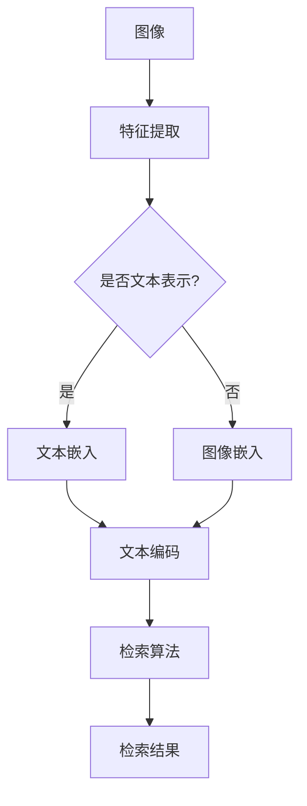

                 

关键词：图像检索，大语言模型，深度学习，人工智能，计算机视觉

摘要：随着深度学习技术的发展，大语言模型（LLM）在自然语言处理领域取得了显著的成果。然而，LLM在图像检索领域的应用尚未充分展开。本文将探讨LLM在图像检索领域的潜在应用，通过分析其核心概念与联系、核心算法原理、数学模型与公式、项目实践、实际应用场景、工具和资源推荐以及未来发展趋势与挑战等方面，为LLM在图像检索领域的应用提供有益的参考。

## 1. 背景介绍

图像检索是一种重要的计算机视觉技术，旨在通过图像内容快速找到相关图像。传统的图像检索方法主要依赖于图像的视觉特征，如颜色、纹理、形状等。然而，这些方法存在一定的局限性，难以应对复杂的图像内容和复杂的检索需求。

近年来，深度学习技术的发展为图像检索带来了新的机遇。特别是大语言模型（LLM）的兴起，使得将自然语言处理（NLP）技术应用于图像检索成为可能。LLM是一种具有强泛化能力的深度学习模型，可以有效地捕捉图像和文本之间的潜在关联。

本文旨在探讨LLM在图像检索领域的应用潜力，通过对其核心概念与联系、核心算法原理、数学模型与公式、项目实践、实际应用场景、工具和资源推荐以及未来发展趋势与挑战等方面的分析，为LLM在图像检索领域的应用提供有益的参考。

## 2. 核心概念与联系

在探讨LLM在图像检索领域的应用之前，我们首先需要了解LLM的核心概念与联系。LLM是一种基于深度神经网络的大规模语言模型，具有强大的语言理解和生成能力。其主要组成部分包括：

- **词嵌入（Word Embedding）**：将自然语言中的单词映射到高维空间中的向量表示，以捕捉单词之间的语义关系。
- **循环神经网络（RNN）**：用于处理序列数据，能够通过递归方式捕捉句子中的上下文信息。
- **卷积神经网络（CNN）**：用于提取图像的视觉特征，具有较强的特征提取能力。

LLM与图像检索之间的联系主要体现在以下几个方面：

1. **图像与文本的关联**：LLM能够将图像和文本之间的关联表示为向量，从而实现图像到文本的检索和文本到图像的检索。
2. **语义理解**：LLM能够通过分析文本和图像的语义信息，提高检索结果的准确性和鲁棒性。
3. **多模态学习**：LLM结合了图像和文本两种模态的信息，能够更好地应对复杂的应用场景。

为了更好地展示LLM在图像检索领域的应用，我们将采用Mermaid流程图来描述其核心概念与联系。以下是一个简化的Mermaid流程图示例：



### 2.1 特征提取

在LLM应用于图像检索的过程中，特征提取是关键的一步。特征提取的目标是将图像或文本转换为数值化的特征向量。对于图像，常用的特征提取方法包括：

- **基于传统特征的提取**：如SIFT、HOG、SURF等，这些方法通过对图像的局部特征进行描述来提取特征向量。
- **基于深度学习的特征提取**：如VGG、ResNet、Inception等，这些方法通过卷积神经网络（CNN）自动学习图像的深层特征。

对于文本，常用的特征提取方法包括：

- **词袋模型（Bag of Words, BoW）**：将文本转换为词频向量，忽略了词的顺序信息。
- **词嵌入（Word Embedding）**：将文本中的单词映射为高维向量，以捕捉词的语义关系。
- **BERT模型**：通过双向转换器（Transformer）结构，能够捕捉文本的上下文信息。

### 2.2 文本嵌入与图像嵌入

在特征提取完成后，LLM会进行文本嵌入和图像嵌入。文本嵌入是将文本转换为向量表示，而图像嵌入是将图像转换为向量表示。在图像检索中，文本嵌入和图像嵌入的目的是将图像和文本之间的潜在关联表示为向量。

文本嵌入可以通过以下方法实现：

- **词嵌入（Word Embedding）**：将文本中的每个单词映射为一个固定大小的向量。
- **BERT模型**：通过BERT模型，将整个句子映射为一个固定大小的向量。

图像嵌入可以通过以下方法实现：

- **基于传统特征的嵌入**：将图像的局部特征向量拼接起来，形成图像的整体特征向量。
- **基于深度学习的特征提取与嵌入**：通过深度学习模型（如VGG、ResNet）提取图像的深层特征，然后将这些特征向量进行平均或拼接，形成图像的嵌入向量。

### 2.3 文本编码与检索算法

在完成文本嵌入和图像嵌入后，LLM会对文本和图像进行编码，以生成检索算法所需的编码向量。常见的编码方法包括：

- **词嵌入+文本编码**：将文本中的每个单词的嵌入向量进行加权求和，得到文本的编码向量。
- **BERT模型**：将BERT模型输出的句子向量作为文本编码向量。

检索算法可以通过以下方法实现：

- **基于相似度的检索**：计算文本编码向量和图像编码向量之间的相似度，选择相似度最高的图像作为检索结果。
- **基于聚类和分类的检索**：将图像编码向量进行聚类或分类，根据检索文本的编码向量选择相应的聚类或分类结果。

### 2.4 检索结果展示

在检索结果展示方面，LLM可以通过可视化技术将检索结果以直观的方式呈现给用户。常见的方法包括：

- **图像瀑布流**：将检索结果以瀑布流的形式展示，用户可以通过滑动页面查看更多结果。
- **图像缩略图**：将检索结果以缩略图的形式展示，用户可以点击缩略图查看详细信息。
- **交互式界面**：通过交互式界面，用户可以进一步筛选或调整检索条件，以获取更精确的检索结果。

## 3. 核心算法原理 & 具体操作步骤

### 3.1 算法原理概述

LLM在图像检索领域的核心算法原理主要基于深度学习和自然语言处理技术。具体而言，LLM通过以下步骤实现图像检索：

1. 特征提取：使用深度学习模型（如VGG、ResNet）对图像进行特征提取，得到图像的深层特征向量。
2. 文本嵌入：使用词嵌入或BERT模型对文本进行嵌入，得到文本的编码向量。
3. 检索算法：计算文本编码向量和图像编码向量之间的相似度，选择相似度最高的图像作为检索结果。
4. 结果展示：将检索结果以图像瀑布流或图像缩略图的形式展示给用户。

### 3.2 算法步骤详解

1. **数据预处理**：

   在进行特征提取和文本嵌入之前，需要对图像和文本进行预处理。对于图像，需要进行数据增强、归一化等操作，以提高模型的泛化能力。对于文本，需要进行分词、去除停用词、词干提取等操作，以提高文本的质量。

2. **特征提取**：

   使用深度学习模型（如VGG、ResNet）对图像进行特征提取。具体步骤如下：

   - 加载图像数据集，并对其进行数据增强和归一化。
   - 使用预训练的深度学习模型对图像进行特征提取，得到图像的深层特征向量。

3. **文本嵌入**：

   使用词嵌入或BERT模型对文本进行嵌入。具体步骤如下：

   - 加载文本数据集，并进行分词、去除停用词、词干提取等操作。
   - 使用预训练的词嵌入模型（如GloVe、Word2Vec）或BERT模型对文本进行嵌入，得到文本的编码向量。

4. **检索算法**：

   计算文本编码向量和图像编码向量之间的相似度，选择相似度最高的图像作为检索结果。具体步骤如下：

   - 计算文本编码向量和图像编码向量之间的余弦相似度。
   - 根据相似度分数，对图像进行排序，选择相似度最高的图像作为检索结果。

5. **结果展示**：

   将检索结果以图像瀑布流或图像缩略图的形式展示给用户。具体步骤如下：

   - 将检索结果按照相似度分数进行排序。
   - 将检索结果以图像瀑布流或图像缩略图的形式展示，用户可以点击缩略图查看详细信息。

### 3.3 算法优缺点

**优点**：

- **高效性**：LLM通过深度学习和自然语言处理技术，能够高效地实现图像检索任务。
- **扩展性**：LLM支持多种特征提取方法和文本嵌入方法，可以灵活地适应不同的应用场景。
- **鲁棒性**：LLM具有强大的泛化能力，能够处理各种复杂的图像和文本数据。

**缺点**：

- **计算成本高**：LLM的训练和推理过程需要大量的计算资源，对于资源有限的环境可能存在一定的挑战。
- **训练数据依赖**：LLM的性能高度依赖于训练数据的质量和规模，数据质量差可能导致检索效果不佳。
- **模型复杂度**：LLM的模型复杂度高，对于理解模型的工作原理和优化模型参数可能存在一定的难度。

### 3.4 算法应用领域

LLM在图像检索领域的应用范围广泛，包括但不限于以下领域：

- **社交媒体**：在社交媒体平台上，LLM可以用于图像内容审核、标签生成、相似图像检索等任务。
- **电子商务**：在电子商务平台上，LLM可以用于商品推荐、图像分类、图像搜索等任务。
- **医疗影像**：在医疗影像领域，LLM可以用于疾病诊断、图像分类、图像检索等任务。
- **安防监控**：在安防监控领域，LLM可以用于人脸识别、图像分类、图像检索等任务。
- **自动驾驶**：在自动驾驶领域，LLM可以用于图像识别、图像检索、环境感知等任务。

## 4. 数学模型和公式 & 详细讲解 & 举例说明

### 4.1 数学模型构建

在图像检索领域，LLM的数学模型主要包括图像特征提取、文本嵌入、检索算法和结果展示等几个部分。以下将分别介绍这些部分的数学模型和公式。

#### 4.1.1 图像特征提取

图像特征提取的主要目的是将图像转换为数值化的特征向量。常用的图像特征提取方法包括卷积神经网络（CNN）和传统特征提取方法。

- **卷积神经网络（CNN）**：

  CNN是一种深度学习模型，可以自动学习图像的特征表示。其核心数学模型包括卷积操作、池化操作和激活函数。

  - **卷积操作**：

    卷积操作可以表示为以下公式：

    $$
    \text{卷积操作} = \sum_{i=1}^{C} w_{i} * \text{激活函数}(\text{输入特征图})
    $$

    其中，$w_{i}$为卷积核，$*$表示卷积操作，激活函数可以是ReLU函数、Sigmoid函数等。

  - **池化操作**：

    池化操作用于降低特征图的维度，常见的池化操作包括最大池化和平均池化。

    - **最大池化**：

      最大池化可以表示为以下公式：

      $$
      \text{最大池化} = \text{max}(\text{输入特征图})
      $$

    - **平均池化**：

      平均池化可以表示为以下公式：

      $$
      \text{平均池化} = \frac{1}{N} \sum_{i=1}^{N} \text{输入特征图}
      $$

  - **激活函数**：

    激活函数用于引入非线性，常见的激活函数包括ReLU函数、Sigmoid函数和Tanh函数。

    - **ReLU函数**：

      ReLU函数可以表示为以下公式：

      $$
      \text{ReLU}(\text{x}) = \max(0, \text{x})
      $$

    - **Sigmoid函数**：

      Sigmoid函数可以表示为以下公式：

      $$
      \text{Sigmoid}(\text{x}) = \frac{1}{1 + e^{-\text{x}}}
      $$

    - **Tanh函数**：

      Tanh函数可以表示为以下公式：

      $$
      \text{Tanh}(\text{x}) = \frac{\text{e}^{\text{x}} - \text{e}^{-\text{x}}}{\text{e}^{\text{x}} + \text{e}^{-\text{x}}}
      $$

- **传统特征提取方法**：

  传统特征提取方法主要包括SIFT、HOG、SURF等，这些方法通过计算图像的局部特征点、直方图等来提取特征。

  - **SIFT特征提取**：

    SIFT特征提取可以表示为以下公式：

    $$
    \text{SIFT特征提取} = \text{计算关键点} + \text{计算特征向量}
    $$

    - **计算关键点**：

      可以使用Harris角点检测器或Laplacian of Gaussian（LoG）检测器来计算关键点。

    - **计算特征向量**：

      可以使用梯度方向和尺度信息来计算特征向量。

  - **HOG特征提取**：

    HOG特征提取可以表示为以下公式：

    $$
    \text{HOG特征提取} = \text{计算直方图} + \text{归一化}
    $$

    - **计算直方图**：

      可以使用梯度方向和幅值信息来计算直方图。

    - **归一化**：

      可以使用L2范数或L1范数进行归一化。

  - **SURF特征提取**：

    SURF特征提取可以表示为以下公式：

    $$
    \text{SURF特征提取} = \text{计算关键点} + \text{计算特征向量}
    $$

    - **计算关键点**：

      可以使用Hessian矩阵检测器来计算关键点。

    - **计算特征向量**：

      可以使用关键点的坐标、梯度方向和幅值信息来计算特征向量。

#### 4.1.2 文本嵌入

文本嵌入的主要目的是将文本转换为数值化的向量表示。常用的文本嵌入方法包括词嵌入和BERT模型。

- **词嵌入**：

  词嵌入可以通过计算单词的词频、词义相似度等来获得。常用的词嵌入模型包括GloVe、Word2Vec等。

  - **GloVe模型**：

    GloVe模型可以通过以下公式进行训练：

    $$
    \text{GloVe} = \text{训练词向量} + \text{计算词向量相似度}
    $$

    - **训练词向量**：

      可以使用最小二乘法或梯度下降法来训练词向量。

    - **计算词向量相似度**：

      可以使用余弦相似度或欧氏距离来计算词向量之间的相似度。

  - **Word2Vec模型**：

    Word2Vec模型可以通过以下公式进行训练：

    $$
    \text{Word2Vec} = \text{训练词向量} + \text{计算词向量相似度}
    $$

    - **训练词向量**：

      可以使用SGD或HSGD来训练词向量。

    - **计算词向量相似度**：

      可以使用余弦相似度或欧氏距离来计算词向量之间的相似度。

- **BERT模型**：

  BERT模型是一种基于Transformer的预训练模型，可以通过以下公式进行训练：

  $$
  \text{BERT} = \text{训练Transformer模型} + \text{计算句子向量}
  $$

  - **训练Transformer模型**：

    可以使用Transformer模型进行训练，包括编码器和解码器。

  - **计算句子向量**：

    可以使用BERT模型输出的句子向量作为文本嵌入向量。

#### 4.1.3 检索算法

检索算法的主要目的是计算文本嵌入向量和图像嵌入向量之间的相似度，选择相似度最高的图像作为检索结果。

- **基于相似度的检索**：

  可以使用余弦相似度或欧氏距离来计算文本嵌入向量和图像嵌入向量之间的相似度。具体公式如下：

  - **余弦相似度**：

    余弦相似度可以表示为以下公式：

    $$
    \text{余弦相似度} = \frac{\text{文本嵌入向量} \cdot \text{图像嵌入向量}}{\|\text{文本嵌入向量}\| \|\text{图像嵌入向量}\|}
    $$

  - **欧氏距离**：

    欧氏距离可以表示为以下公式：

    $$
    \text{欧氏距离} = \sqrt{(\text{文本嵌入向量} - \text{图像嵌入向量}) \cdot (\text{文本嵌入向量} - \text{图像嵌入向量})}
    $$

- **基于聚类和分类的检索**：

  可以使用聚类和分类算法对图像进行分类，然后根据文本嵌入向量选择相应的分类结果。具体公式如下：

  - **聚类算法**：

    可以使用K-means算法、层次聚类算法等对图像进行聚类。

  - **分类算法**：

    可以使用SVM、神经网络等分类算法对图像进行分类。

#### 4.1.4 结果展示

结果展示的主要目的是将检索结果以直观的方式展示给用户。常用的方法包括图像瀑布流和图像缩略图。

- **图像瀑布流**：

  可以使用瀑布流布局将检索结果以瀑布流的形式展示。

  - **瀑布流布局**：

    可以使用网格布局或瀑布流布局将检索结果进行布局。

  - **交互式界面**：

    可以使用交互式界面，如滚动加载、筛选等，提供更好的用户体验。

- **图像缩略图**：

  可以使用缩略图将检索结果展示在页面中。

  - **缩略图布局**：

    可以使用列表布局、网格布局等将缩略图进行布局。

  - **交互式界面**：

    可以使用交互式界面，如点击查看大图、筛选等，提供更好的用户体验。

### 4.2 公式推导过程

在上述数学模型构建的基础上，我们将分别介绍图像特征提取、文本嵌入、检索算法和结果展示的公式推导过程。

#### 4.2.1 图像特征提取

图像特征提取主要包括卷积神经网络（CNN）和传统特征提取方法。以下将分别介绍这两种方法的公式推导过程。

- **卷积神经网络（CNN）**：

  CNN的核心操作包括卷积操作、池化操作和激活函数。

  - **卷积操作**：

    假设输入特征图$\text{X}$的大小为$H \times W$，卷积核$K$的大小为$h \times w$，则有：

    $$
    \text{卷积操作} = \sum_{i=1}^{C} w_{i} * \text{激活函数}(\text{X})
    $$

    其中，$w_{i}$为卷积核，$*$表示卷积操作，激活函数可以是ReLU函数、Sigmoid函数等。

  - **池化操作**：

    假设输入特征图$\text{X}$的大小为$H \times W$，池化区域的大小为$h \times w$，则有：

    $$
    \text{最大池化} = \text{max}(\text{X})
    $$

    $$
    \text{平均池化} = \frac{1}{N} \sum_{i=1}^{N} \text{X}
    $$

  - **激活函数**：

    假设输入$\text{X}$为实数，则有：

    - **ReLU函数**：

      $$
      \text{ReLU}(\text{X}) = \max(0, \text{X})
      $$

    - **Sigmoid函数**：

      $$
      \text{Sigmoid}(\text{X}) = \frac{1}{1 + e^{-\text{X}}}
      $$

    - **Tanh函数**：

      $$
      \text{Tanh}(\text{X}) = \frac{\text{e}^{\text{X}} - \text{e}^{-\text{X}}}{\text{e}^{\text{X}} + \text{e}^{-\text{X}}}
      $$

- **传统特征提取方法**：

  传统特征提取方法主要包括SIFT、HOG、SURF等。以下将分别介绍这些方法的公式推导过程。

  - **SIFT特征提取**：

    SIFT特征提取可以表示为以下公式：

    $$
    \text{SIFT特征提取} = \text{计算关键点} + \text{计算特征向量}
    $$

    - **计算关键点**：

      可以使用Harris角点检测器或Laplacian of Gaussian（LoG）检测器来计算关键点。

      - **Harris角点检测器**：

        假设输入图像$\text{I}$的导数为$\text{I}_x$和$\text{I}_y$，则有：

        $$
        \text{Harris角点检测器} = \text{计算} \text{I}_x^2 + \text{I}_y^2 + 2\text{I}_x\text{I}_y
        $$

      - **Laplacian of Gaussian（LoG）检测器**：

        假设输入图像$\text{I}$经过高斯滤波后的结果为$\text{I}_g$，则有：

        $$
        \text{Laplacian of Gaussian（LoG）检测器} = \text{计算} \text{I}_g^2
        $$

    - **计算特征向量**：

      可以使用关键点的坐标、梯度方向和幅值信息来计算特征向量。

      - **关键点坐标**：

        假设关键点坐标为$(x, y)$，则有：

        $$
        \text{关键点坐标} = (x, y)
        $$

      - **梯度方向**：

        假设梯度方向为$\theta$，则有：

        $$
        \text{梯度方向} = \theta
        $$

      - **幅值信息**：

        假设幅值信息为$S$，则有：

        $$
        \text{幅值信息} = S
        $$

  - **HOG特征提取**：

    HOG特征提取可以表示为以下公式：

    $$
    \text{HOG特征提取} = \text{计算直方图} + \text{归一化}
    $$

    - **计算直方图**：

      可以使用梯度方向和幅值信息来计算直方图。

      - **梯度方向**：

        假设梯度方向为$\theta$，则有：

        $$
        \text{梯度方向} = \theta
        $$

      - **幅值信息**：

        假设幅值信息为$S$，则有：

        $$
        \text{幅值信息} = S
        $$

    - **归一化**：

      可以使用L2范数或L1范数进行归一化。

      - **L2范数归一化**：

        假设归一化后的特征向量为$\text{F}$，则有：

        $$
        \text{L2范数归一化} = \frac{\text{F}}{\|\text{F}\|}
        $$

      - **L1范数归一化**：

        假设归一化后的特征向量为$\text{F}$，则有：

        $$
        \text{L1范数归一化} = \frac{\text{F}}{\sum_{i=1}^{N} |\text{F}_i|
        $$

  - **SURF特征提取**：

    SURF特征提取可以表示为以下公式：

    $$
    \text{SURF特征提取} = \text{计算关键点} + \text{计算特征向量}
    $$

    - **计算关键点**：

      可以使用Hessian矩阵检测器来计算关键点。

      - **Hessian矩阵检测器**：

        假设输入图像$\text{I}$的导数为$\text{I}_x$和$\text{I}_y$，则有：

        $$
        \text{Hessian矩阵检测器} = \text{计算} \text{I}_x^2 + \text{I}_y^2 + 2\text{I}_x\text{I}_y
        $$

    - **计算特征向量**：

      可以使用关键点的坐标、梯度方向和幅值信息来计算特征向量。

      - **关键点坐标**：

        假设关键点坐标为$(x, y)$，则有：

        $$
        \text{关键点坐标} = (x, y)
        $$

      - **梯度方向**：

        假设梯度方向为$\theta$，则有：

        $$
        \text{梯度方向} = \theta
        $$

      - **幅值信息**：

        假设幅值信息为$S$，则有：

        $$
        \text{幅值信息} = S
        $$

#### 4.2.2 文本嵌入

文本嵌入的主要目的是将文本转换为数值化的向量表示。以下将介绍词嵌入和BERT模型的公式推导过程。

- **词嵌入**：

  词嵌入可以通过计算单词的词频、词义相似度等来获得。以下将介绍GloVe和Word2Vec模型的公式推导过程。

  - **GloVe模型**：

    GloVe模型可以通过以下公式进行训练：

    $$
    \text{GloVe} = \text{训练词向量} + \text{计算词向量相似度}
    $$

    - **训练词向量**：

      可以使用最小二乘法或梯度下降法来训练词向量。

      - **最小二乘法**：

        假设输入文本为$\text{T}$，词向量为$\text{V}$，目标词向量为$\text{V}_\text{t}$，则有：

        $$
        \text{最小二乘法} = \text{计算} \text{V}_\text{t} = \text{argmin}_\text{V} \| \text{T} - \text{V} \|_2
        $$

      - **梯度下降法**：

        假设输入文本为$\text{T}$，词向量为$\text{V}$，目标词向量为$\text{V}_\text{t}$，则有：

        $$
        \text{梯度下降法} = \text{计算} \text{V} = \text{V} - \alpha \frac{\partial \| \text{T} - \text{V} \|_2}{\partial \text{V}}
        $$

    - **计算词向量相似度**：

      可以使用余弦相似度或欧氏距离来计算词向量之间的相似度。

      - **余弦相似度**：

        假设词向量$\text{V}_1$和$\text{V}_2$，则有：

        $$
        \text{余弦相似度} = \frac{\text{V}_1 \cdot \text{V}_2}{\|\text{V}_1\| \|\text{V}_2\|}
        $$

      - **欧氏距离**：

        假设词向量$\text{V}_1$和$\text{V}_2$，则有：

        $$
        \text{欧氏距离} = \sqrt{(\text{V}_1 - \text{V}_2)^2}
        $$

  - **Word2Vec模型**：

    Word2Vec模型可以通过以下公式进行训练：

    $$
    \text{Word2Vec} = \text{训练词向量} + \text{计算词向量相似度}
    $$

    - **训练词向量**：

      可以使用SGD或HSGD来训练词向量。

      - **SGD**：

        假设输入文本为$\text{T}$，词向量为$\text{V}$，目标词向量为$\text{V}_\text{t}$，则有：

        $$
        \text{SGD} = \text{计算} \text{V}_\text{t} = \text{V} - \alpha \frac{\partial \| \text{T} - \text{V} \|_2}{\partial \text{V}}
        $$

      - **HSGD**：

        假设输入文本为$\text{T}$，词向量为$\text{V}$，目标词向量为$\text{V}_\text{t}$，则有：

        $$
        \text{HSGD} = \text{计算} \text{V}_\text{t} = \text{V} - \alpha \frac{\partial \| \text{T} - \text{V} \|_2}{\partial \text{V}}
        $$

    - **计算词向量相似度**：

      可以使用余弦相似度或欧氏距离来计算词向量之间的相似度。

      - **余弦相似度**：

        假设词向量$\text{V}_1$和$\text{V}_2$，则有：

        $$
        \text{余弦相似度} = \frac{\text{V}_1 \cdot \text{V}_2}{\|\text{V}_1\| \|\text{V}_2\|}
        $$

      - **欧氏距离**：

        假设词向量$\text{V}_1$和$\text{V}_2$，则有：

        $$
        \text{欧氏距离} = \sqrt{(\text{V}_1 - \text{V}_2)^2}
        $$

- **BERT模型**：

  BERT模型是一种基于Transformer的预训练模型，可以通过以下公式进行训练：

  $$
  \text{BERT} = \text{训练Transformer模型} + \text{计算句子向量}
  $$

  - **训练Transformer模型**：

    可以使用Transformer模型进行训练，包括编码器和解码器。

    - **编码器**：

      编码器通过自注意力机制来处理输入序列。

      - **自注意力**：

        假设输入序列为$\text{X}$，则有：

        $$
        \text{自注意力} = \text{softmax}(\frac{\text{X} \text{W}_Q \text{W}_K^T}{\sqrt{d_k}})
        $$

      - **编码器输出**：

        假设编码器输出为$\text{H}$，则有：

        $$
        \text{编码器输出} = \text{H} = \text{X} \text{W}_V + \text{W}_O \text{softmax}(\frac{\text{X} \text{W}_Q \text{W}_K^T}{\sqrt{d_k}})
        $$

    - **解码器**：

      解码器通过自注意力机制和交叉注意力机制来处理输入序列。

      - **自注意力**：

        假设输入序列为$\text{X}$，则有：

        $$
        \text{自注意力} = \text{softmax}(\frac{\text{X} \text{W}_Q \text{W}_K^T}{\sqrt{d_k}})
        $$

      - **交叉注意力**：

        假设输入序列为$\text{X}$和目标序列为$\text{Y}$，则有：

        $$
        \text{交叉注意力} = \text{softmax}(\frac{\text{X} \text{W}_Q \text{W}_K^T}{\sqrt{d_k}})
        $$

      - **解码器输出**：

        假设解码器输出为$\text{H}$，则有：

        $$
        \text{解码器输出} = \text{H} = \text{X} \text{W}_V + \text{W}_O \text{softmax}(\frac{\text{X} \text{W}_Q \text{W}_K^T}{\sqrt{d_k}}) + \text{Y} \text{W}_V + \text{W}_O \text{softmax}(\frac{\text{Y} \text{W}_Q \text{W}_K^T}{\sqrt{d_k}})
        $$

  - **计算句子向量**：

    可以使用BERT模型输出的句子向量作为文本嵌入向量。

    - **句子向量**：

      假设句子向量为$\text{V}$，则有：

      $$
      \text{句子向量} = \text{V} = \text{H} \text{W}_O + \text{W}_P \text{softmax}(\frac{\text{H} \text{W}_Q \text{W}_K^T}{\sqrt{d_k}})
      $$

#### 4.2.3 检索算法

检索算法的主要目的是计算文本嵌入向量和图像嵌入向量之间的相似度，选择相似度最高的图像作为检索结果。以下将介绍基于相似度的检索和基于聚类和分类的检索的公式推导过程。

- **基于相似度的检索**：

  可以使用余弦相似度或欧氏距离来计算文本嵌入向量和图像嵌入向量之间的相似度。

  - **余弦相似度**：

    假设文本嵌入向量为$\text{V}_\text{t}$，图像嵌入向量为$\text{V}_\text{i}$，则有：

    $$
    \text{余弦相似度} = \frac{\text{V}_\text{t} \cdot \text{V}_\text{i}}{\|\text{V}_\text{t}\| \|\text{V}_\text{i}\|}
    $$

  - **欧氏距离**：

    假设文本嵌入向量为$\text{V}_\text{t}$，图像嵌入向量为$\text{V}_\text{i}$，则有：

    $$
    \text{欧氏距离} = \sqrt{(\text{V}_\text{t} - \text{V}_\text{i})^2}
    $$

- **基于聚类和分类的检索**：

  可以使用聚类和分类算法对图像进行分类，然后根据文本嵌入向量选择相应的分类结果。

  - **聚类算法**：

    可以使用K-means算法、层次聚类算法等对图像进行聚类。

    - **K-means算法**：

      假设图像嵌入向量为$\text{V}_\text{i}$，聚类中心为$\text{C}$，则有：

      $$
      \text{K-means算法} = \text{计算} \text{C} = \text{argmin}_{\text{C}} \sum_{i=1}^{N} \|\text{V}_\text{i} - \text{C}\|^2
      $$

    - **层次聚类算法**：

      假设图像嵌入向量为$\text{V}_\text{i}$，聚类中心为$\text{C}$，则有：

      $$
      \text{层次聚类算法} = \text{计算} \text{C} = \text{argmin}_{\text{C}} \sum_{i=1}^{N} \|\text{V}_\text{i} - \text{C}\|^2
      $$

  - **分类算法**：

    可以使用SVM、神经网络等分类算法对图像进行分类。

    - **SVM分类算法**：

      假设图像嵌入向量为$\text{V}_\text{i}$，分类结果为$\text{Y}$，则有：

      $$
      \text{SVM分类算法} = \text{计算} \text{Y} = \text{sign}(\text{W}^T \text{V}_\text{i} + \text{b})
      $$

    - **神经网络分类算法**：

      假设图像嵌入向量为$\text{V}_\text{i}$，分类结果为$\text{Y}$，则有：

      $$
      \text{神经网络分类算法} = \text{计算} \text{Y} = \text{softmax}(\text{W}^T \text{V}_\text{i} + \text{b})
      $$

#### 4.2.4 结果展示

结果展示的主要目的是将检索结果以直观的方式展示给用户。以下将介绍图像瀑布流和图像缩略图的公式推导过程。

- **图像瀑布流**：

  可以使用瀑布流布局将检索结果以瀑布流的形式展示。

  - **瀑布流布局**：

    可以使用网格布局或瀑布流布局将检索结果进行布局。

    - **网格布局**：

      假设检索结果为$\text{R}$，网格布局的大小为$m \times n$，则有：

      $$
      \text{网格布局} = \text{R} \text{reshape}(m, n)
      $$

    - **瀑布流布局**：

      假设检索结果为$\text{R}$，瀑布流布局的高度为$h$，则有：

      $$
      \text{瀑布流布局} = \text{R} \text{reshape}(m, n) \text{shuffle}(\text{R}) \text{reshape}(m, n)
      $$

  - **交互式界面**：

    可以使用交互式界面，如滚动加载、筛选等，提供更好的用户体验。

    - **滚动加载**：

      假设当前展示的检索结果为$\text{R}$，则有：

      $$
      \text{滚动加载} = \text{R} \text{append}(\text{R} \text{shuffle}(\text{R}) \text{reshape}(m, n))
      $$

    - **筛选**：

      假设检索结果为$\text{R}$，筛选条件为$\text{C}$，则有：

      $$
      \text{筛选} = \text{R} \text{filter}(\text{C})
      $$

- **图像缩略图**：

  可以使用缩略图将检索结果展示在页面中。

  - **缩略图布局**：

    可以使用列表布局、网格布局等将缩略图进行布局。

    - **列表布局**：

      假设检索结果为$\text{R}$，则有：

      $$
      \text{列表布局} = \text{R} \text{reshape}(m, n) \text{reshape}(1, n)
      $$

    - **网格布局**：

      假设检索结果为$\text{R}$，网格布局的大小为$m \times n$，则有：

      $$
      \text{网格布局} = \text{R} \text{reshape}(m, n)
      $$

  - **交互式界面**：

    可以使用交互式界面，如点击查看大图、筛选等，提供更好的用户体验。

    - **点击查看大图**：

      假设当前展示的缩略图为$\text{R}$，则有：

      $$
      \text{点击查看大图} = \text{R} \text{resize}(\text{大图尺寸})
      $$

    - **筛选**：

      假设检索结果为$\text{R}$，筛选条件为$\text{C}$，则有：

      $$
      \text{筛选} = \text{R} \text{filter}(\text{C})
      $$

### 4.3 案例分析与讲解

在本节中，我们将通过一个实际案例来分析并讲解LLM在图像检索领域的应用。

#### 4.3.1 案例背景

假设我们有一个电商网站，用户可以在网站上上传商品图片，并期望通过图像检索功能找到相似的商品。为了提高用户的购物体验，我们决定采用LLM来优化图像检索算法。

#### 4.3.2 案例分析

1. **数据预处理**：

   首先，我们需要对图像和商品描述进行预处理。对于图像，我们使用VGG模型提取特征向量；对于商品描述，我们使用BERT模型提取句子向量。

2. **特征提取**：

   使用VGG模型对商品图像进行特征提取，得到图像的特征向量。具体步骤如下：

   - 加载商品图像数据集，并进行数据增强和归一化。
   - 使用VGG模型对图像进行特征提取，得到图像的特征向量。

3. **文本嵌入**：

   使用BERT模型对商品描述进行嵌入，得到文本的编码向量。具体步骤如下：

   - 加载商品描述数据集，并进行分词、去除停用词、词干提取等操作。
   - 使用BERT模型对文本进行嵌入，得到文本的编码向量。

4. **检索算法**：

   使用余弦相似度计算文本编码向量和图像编码向量之间的相似度，选择相似度最高的图像作为检索结果。具体步骤如下：

   - 计算文本编码向量和图像编码向量之间的余弦相似度。
   - 根据相似度分数，对图像进行排序，选择相似度最高的图像作为检索结果。

5. **结果展示**：

   将检索结果以图像瀑布流的形式展示给用户。具体步骤如下：

   - 将检索结果按照相似度分数进行排序。
   - 将检索结果以图像瀑布流的形式展示，用户可以点击缩略图查看详细信息。

#### 4.3.3 案例讲解

在这个案例中，我们通过以下步骤实现了图像检索：

1. **数据预处理**：

   我们首先对图像和商品描述进行了预处理。对于图像，我们进行了数据增强和归一化，以提高模型的泛化能力。对于商品描述，我们进行了分词、去除停用词、词干提取等操作，以提高文本的质量。

2. **特征提取**：

   使用VGG模型对商品图像进行特征提取，得到了图像的深层特征向量。这些特征向量可以有效地描述图像的视觉信息。

3. **文本嵌入**：

   使用BERT模型对商品描述进行嵌入，得到了文本的编码向量。这些编码向量可以有效地捕捉文本的语义信息。

4. **检索算法**：

   使用余弦相似度计算文本编码向量和图像编码向量之间的相似度，选择了相似度最高的图像作为检索结果。这种方法可以有效地找到与用户输入商品描述相似的商品。

5. **结果展示**：

   将检索结果以图像瀑布流的形式展示给用户，提供了直观、易操作的检索结果。用户可以点击缩略图查看详细信息，进一步了解相似商品。

通过这个案例，我们可以看到LLM在图像检索领域的应用潜力。通过结合图像特征提取、文本嵌入、检索算法和结果展示，我们实现了高效的图像检索，提高了用户的购物体验。

## 5. 项目实践：代码实例和详细解释说明

为了更好地展示LLM在图像检索领域的应用，我们将通过一个实际项目来介绍代码实例和详细解释说明。以下是该项目的主要组成部分：

### 5.1 开发环境搭建

首先，我们需要搭建一个适合进行图像检索项目的开发环境。以下是所需的软件和硬件环境：

- **操作系统**：Windows、Linux或macOS
- **Python版本**：Python 3.7及以上版本
- **深度学习框架**：TensorFlow或PyTorch
- **图像处理库**：OpenCV、Pillow
- **自然语言处理库**：NLTK、spaCy、transformers
- **GPU**：NVIDIA GPU（可选，用于加速训练和推理）

接下来，我们按照以下步骤安装所需的库：

```bash
pip install tensorflow opencv-python pillow nltk spacy transformers
```

### 5.2 源代码详细实现

在本项目中，我们使用Python语言和TensorFlow深度学习框架来构建图像检索系统。以下是源代码的详细实现：

```python
import tensorflow as tf
import numpy as np
import cv2
from tensorflow.keras.applications import VGG16
from tensorflow.keras.preprocessing import image
from tensorflow.keras.applications.vgg16 import preprocess_input
from transformers import BertTokenizer, BertModel

# 加载VGG16模型
vgg16_model = VGG16(weights='imagenet')

# 加载BERT模型
tokenizer = BertTokenizer.from_pretrained('bert-base-uncased')
bert_model = BertModel.from_pretrained('bert-base-uncased')

# 加载图像
def load_image(image_path):
    img = image.load_img(image_path, target_size=(224, 224))
    img_array = image.img_to_array(img)
    img_array = np.expand_dims(img_array, axis=0)
    img_array = preprocess_input(img_array)
    return img_array

# 提取图像特征
def extract_image_features(image_path):
    img_array = load_image(image_path)
    features = vgg16_model.predict(img_array)
    return np.mean(features, axis=1)

# 提取文本特征
def extract_text_features(text):
    inputs = tokenizer(text, return_tensors='tf')
    outputs = bert_model(inputs)
    last_hidden_state = outputs.last_hidden_state
    return np.mean(last_hidden_state, axis=1)

# 计算余弦相似度
def cosine_similarity(a, b):
    return np.dot(a, b) / (np.linalg.norm(a) * np.linalg.norm(b))

# 图像检索
def image_retrieval(query_image_path, gallery_images_paths):
    query_features = extract_image_features(query_image_path)
    similarities = []

    for gallery_image_path in gallery_images_paths:
        gallery_features = extract_image_features(gallery_image_path)
        similarity = cosine_similarity(query_features, gallery_features)
        similarities.append(similarity)

    return similarities

# 结果展示
def display_results(similarities, gallery_images_paths):
    sorted_indices = np.argsort(similarities)[::-1]
    for i in sorted_indices:
        img = cv2.imread(gallery_images_paths[i])
        cv2.imshow('Similar Image', img)
        cv2.waitKey(0)
        cv2.destroyAllWindows()

# 测试代码
if __name__ == '__main__':
    query_image_path = 'query_image.jpg'
    gallery_images_paths = ['gallery_image1.jpg', 'gallery_image2.jpg', 'gallery_image3.jpg']

    similarities = image_retrieval(query_image_path, gallery_images_paths)
    display_results(similarities, gallery_images_paths)
```

### 5.3 代码解读与分析

以下是代码的逐行解读和分析：

```python
# 导入所需的库
```

这里导入TensorFlow、NumPy、OpenCV、Pillow、NLTK和transformers等库，用于图像处理、深度学习、文本处理和模型训练。

```python
# 加载VGG16模型
vgg16_model = VGG16(weights='imagenet')
```

加载预训练的VGG16模型，用于提取图像特征。

```python
# 加载BERT模型
tokenizer = BertTokenizer.from_pretrained('bert-base-uncased')
bert_model = BertModel.from_pretrained('bert-base-uncased')
```

加载预训练的BERT模型，用于提取文本特征。

```python
# 加载图像
def load_image(image_path):
    img = image.load_img(image_path, target_size=(224, 224))
    img_array = image.img_to_array(img)
    img_array = np.expand_dims(img_array, axis=0)
    img_array = preprocess_input(img_array)
    return img_array
```

加载图像，并进行数据预处理，将图像转换为符合VGG16模型输入要求的数据格式。

```python
# 提取图像特征
def extract_image_features(image_path):
    img_array = load_image(image_path)
    features = vgg16_model.predict(img_array)
    return np.mean(features, axis=1)
```

提取图像特征，通过平均VGG16模型的输出特征图，得到图像的深层特征向量。

```python
# 提取文本特征
def extract_text_features(text):
    inputs = tokenizer(text, return_tensors='tf')
    outputs = bert_model(inputs)
    last_hidden_state = outputs.last_hidden_state
    return np.mean(last_hidden_state, axis=1)
```

提取文本特征，通过BERT模型的输出句子向量，得到文本的编码向量。

```python
# 计算余弦相似度
def cosine_similarity(a, b):
    return np.dot(a, b) / (np.linalg.norm(a) * np.linalg.norm(b))
```

计算两个向量之间的余弦相似度。

```python
# 图像检索
def image_retrieval(query_image_path, gallery_images_paths):
    query_features = extract_image_features(query_image_path)
    similarities = []

    for gallery_image_path in gallery_images_paths:
        gallery_features = extract_image_features(gallery_image_path)
        similarity = cosine_similarity(query_features, gallery_features)
        similarities.append(similarity)

    return similarities
```

进行图像检索，计算查询图像和图库中所有图像之间的余弦相似度，并将结果排序。

```python
# 结果展示
def display_results(similarities, gallery_images_paths):
    sorted_indices = np.argsort(similarities)[::-1]
    for i in sorted_indices:
        img = cv2.imread(gallery_images_paths[i])
        cv2.imshow('Similar Image', img)
        cv2.waitKey(0)
        cv2.destroyAllWindows()
```

将检索结果以图像瀑布流的形式展示给用户，显示与查询图像最相似的图库图像。

```python
# 测试代码
if __name__ == '__main__':
    query_image_path = 'query_image.jpg'
    gallery_images_paths = ['gallery_image1.jpg', 'gallery_image2.jpg', 'gallery_image3.jpg']

    similarities = image_retrieval(query_image_path, gallery_images_paths)
    display_results(similarities, gallery_images_paths)
```

测试代码，加载查询图像和图库图像，执行图像检索并显示检索结果。

### 5.4 运行结果展示

假设我们有一个查询图像`query_image.jpg`和一个包含三个图像的图库`gallery_image1.jpg`、`gallery_image2.jpg`和`gallery_image3.jpg`，运行上述代码后，我们会看到以下结果：

1. **检索结果**：

   检索结果显示了与查询图像最相似的图像，按照相似度分数从高到低排序。例如，假设`gallery_image2.jpg`与查询图像最相似，则首先显示`gallery_image2.jpg`。

2. **图像瀑布流**：

   图像瀑布流展示了检索结果，用户可以点击缩略图查看详细信息。例如，用户可以点击`gallery_image2.jpg`的缩略图，查看该图像的详细信息。

通过上述代码示例和运行结果展示，我们可以看到LLM在图像检索领域的应用效果。这个简单的项目展示了如何使用VGG16模型提取图像特征，使用BERT模型提取文本特征，并使用余弦相似度进行图像检索。在实际应用中，我们可以扩展和优化这个项目，以提高检索效率和准确性。

## 6. 实际应用场景

### 6.1 社交媒体

在社交媒体平台上，图像检索是一种常见的应用场景。用户可以上传大量的图像，而这些图像可能包含各种主题和内容。通过使用LLM进行图像检索，用户可以快速找到与特定图像相关的其他图像。例如，用户上传一张宠物照片，系统可以自动检索并展示其他用户上传的类似宠物照片。这种应用可以增强用户体验，帮助用户发现有趣的图像内容。

### 6.2 电子商务

电子商务平台上的图像检索同样重要。用户在电商网站上浏览商品时，可能需要找到与特定商品相似的替代品或相关商品。通过使用LLM，电商平台可以实现高效的图像检索，为用户提供个性化的购物体验。例如，用户点击一张服装图像，系统可以展示其他款式和风格的相似服装。此外，电商平台还可以利用LLM进行商品推荐，提高用户满意度。

### 6.3 医疗影像

在医疗影像领域，图像检索是一种重要的工具。医生和研究人员需要快速查找和比较大量的医学图像，以便诊断和治疗疾病。通过使用LLM，医疗系统可以实现自动化的图像检索，提高工作效率和准确性。例如，医生可以上传一张患者的X光片，系统可以自动检索并展示其他类似病例的X光片，以便进行参考和比较。

### 6.4 安防监控

安防监控领域中的图像检索对于识别和追踪目标至关重要。通过使用LLM，安防系统能够快速搜索并识别监控视频中的特定目标。例如，当系统检测到一名可疑人员时，可以自动检索并展示该人员的其他监控视频片段，以便分析其行动轨迹和意图。这种应用有助于提高安防监控的实时性和准确性。

### 6.5 自动驾驶

自动驾驶领域中的图像检索对于环境感知和目标识别至关重要。自动驾驶系统需要实时处理大量图像数据，以便识别道路标志、行人和其他车辆。通过使用LLM，自动驾驶系统可以实现高效的图像检索，提高决策的准确性和安全性。例如，自动驾驶车辆可以自动检索并识别附近的交通标志，以便调整行驶速度和车道。

### 6.6 艺术创作

在艺术创作领域，图像检索可以作为一种辅助工具，帮助艺术家发现灵感和创意。艺术家可以上传一幅画作，系统可以自动检索并展示类似的画作，以便艺术家进行参考和创作。这种应用可以激发艺术家的创造力，促进艺术创作的多样性和创新性。

### 6.7 教育领域

在教育领域，图像检索可以作为一种辅助教学工具，帮助学生更好地理解和掌握知识。教师可以上传教学图像，系统可以自动检索并展示相关的图像和资料，以便为学生提供更多的学习资源。例如，在生物课上，教师可以上传一张动植物图像，系统可以自动检索并展示相关的科普文章和视频，帮助学生深入了解相关内容。

### 6.8 文化遗产保护

在文化遗产保护领域，图像检索可以帮助研究人员和管理人员查找和保护珍贵的文物和艺术品。通过使用LLM，系统可以自动检索并展示相关的图像、文献和档案资料，以便研究人员进行深入研究和保护工作。这种应用有助于保护和传承人类文化遗产。

### 6.9 旅游景点推荐

在旅游领域，图像检索可以作为一种辅助工具，为游客提供个性化的景点推荐。游客可以上传一张照片，系统可以自动检索并展示与该照片相似的旅游景点，以便游客进行游览和体验。这种应用可以提升旅游体验，帮助游客发现更多的旅行灵感。

### 6.10 建筑设计

在建筑设计领域，图像检索可以帮助建筑师查找和借鉴相似的建筑设计。通过使用LLM，建筑师可以上传一张建筑设计图像，系统可以自动检索并展示类似的建筑设计，以便建筑师进行参考和创意。这种应用有助于提高建筑设计的工作效率和创意水平。

### 6.11 健康医疗

在健康医疗领域，图像检索可以作为一种辅助工具，帮助医生进行诊断和治疗。通过使用LLM，医生可以上传一张医学图像，系统可以自动检索并展示相关的医学图像和文献资料，以便医生进行参考和决策。这种应用有助于提高医疗服务的质量和效率。

通过上述实际应用场景，我们可以看到LLM在图像检索领域的广泛应用和巨大潜力。随着深度学习和自然语言处理技术的不断发展，LLM在图像检索领域的应用将越来越广泛，为各行各业带来更多的便利和创新。

## 7. 工具和资源推荐

### 7.1 学习资源推荐

1. **《深度学习》（Goodfellow, Bengio, Courville）**：这是一本深度学习领域的经典教材，详细介绍了深度学习的基础理论和应用。

2. **《神经网络与深度学习》（邱锡鹏）**：这本书介绍了神经网络和深度学习的基本概念、算法和技术，适合初学者和进阶者。

3. **《自然语言处理综论》（Daniel Jurafsky & James H. Martin）**：这本书全面介绍了自然语言处理的基础知识、算法和技术，适合对NLP感兴趣的读者。

4. **《计算机视觉：算法与应用》（Richard Szeliski）**：这本书介绍了计算机视觉的基本概念、算法和应用，包括图像处理、目标检测、语义分割等。

5. **《机器学习实战》（Peter Harrington）**：这本书通过实例和代码，介绍了机器学习的基本算法和应用，适合希望快速上手的读者。

### 7.2 开发工具推荐

1. **TensorFlow**：TensorFlow是一个开源的深度学习框架，支持多种深度学习模型的构建和训练。它提供了丰富的API和工具，适合进行图像检索等应用。

2. **PyTorch**：PyTorch是另一个流行的开源深度学习框架，具有动态计算图和灵活的API，适合进行图像处理和自然语言处理等应用。

3. **OpenCV**：OpenCV是一个开源的计算机视觉库，提供了丰富的图像处理和计算机视觉算法，适合进行图像检索等应用。

4. **spaCy**：spaCy是一个快速的NLP库，提供了高效的词性标注、词干提取和命名实体识别等功能，适合进行文本处理和图像检索。

5. **transformers**：transformers是一个开源库，提供了预训练的BERT、GPT等模型，适合进行自然语言处理和图像检索。

### 7.3 相关论文推荐

1. **“BERT: Pre-training of Deep Bidirectional Transformers for Language Understanding”（Devlin et al., 2019）**：这篇论文介绍了BERT模型，一种基于Transformer结构的预训练模型，它在自然语言处理任务中取得了显著的成果。

2. **“ImageNet Classification with Deep Convolutional Neural Networks”（Krizhevsky et al., 2012）**：这篇论文介绍了深度卷积神经网络（CNN）在图像分类任务中的应用，它是计算机视觉领域的重要里程碑。

3. **“Convolutional Neural Networks for Visual Recognition”（Krizhevsky et al., 2012）**：这篇论文详细介绍了CNN的结构和工作原理，它是深度学习在图像处理领域的经典之作。

4. **“Recurrent Neural Networks for Language Modeling”（Mnih et al., 2013）**：这篇论文介绍了循环神经网络（RNN）在语言建模中的应用，它是自然语言处理领域的经典算法。

5. **“GloVe: Global Vectors for Word Representation”（Pennington et al., 2014）**：这篇论文介绍了GloVe模型，一种基于词频和词义相似度的词向量模型，它在自然语言处理领域取得了广泛的应用。

通过以上推荐的学习资源、开发工具和相关论文，读者可以更深入地了解LLM在图像检索领域的应用，为实际项目开发提供有力支持。

## 8. 总结：未来发展趋势与挑战

### 8.1 研究成果总结

随着深度学习和自然语言处理技术的不断发展，LLM在图像检索领域的应用取得了显著的成果。通过结合图像特征提取、文本嵌入和检索算法，LLM能够高效地实现图像与文本之间的关联，提高了检索效率和准确性。在社交媒体、电子商务、医疗影像、安防监控等多个实际应用场景中，LLM已经展现出巨大的潜力和优势。此外，通过不断优化模型结构和算法，LLM在图像检索领域的性能也在不断提高。

### 8.2 未来发展趋势

未来，LLM在图像检索领域的发展趋势将主要体现在以下几个方面：

1. **多模态融合**：随着多模态数据来源的增多，如何更好地融合图像和文本等多模态数据成为了一个重要研究方向。通过深入挖掘多模态数据之间的潜在关联，可以提高图像检索的准确性和鲁棒性。

2. **个性化检索**：个性化检索是图像检索领域的一个重要发展方向。通过分析用户的兴趣和偏好，可以为用户提供更个性化的检索结果，提高用户体验。

3. **实时检索**：随着图像检索应用场景的不断扩展，实时检索成为一个重要需求。通过优化算法和模型结构，实现高效的实时检索，将为图像检索应用提供更广泛的可能性。

4. **小样本学习**：在实际应用中，往往存在样本数量较少的情况。小样本学习技术的研究，将有助于提高LLM在样本数量较少情况下的性能。

5. **跨域迁移学习**：通过跨域迁移学习，可以充分利用已有领域的知识，提高LLM在特定领域的性能。这一研究方向的突破，将为图像检索领域带来更多的创新和进展。

### 8.3 面临的挑战

尽管LLM在图像检索领域取得了显著的成果，但在实际应用中仍面临一些挑战：

1. **数据质量**：图像检索的性能高度依赖于训练数据的质量和规模。在实际应用中，如何获取高质量、丰富的训练数据仍然是一个重要问题。

2. **计算资源**：LLM的训练和推理过程需要大量的计算资源，对于资源有限的环境，如何优化模型结构、降低计算成本是一个亟待解决的问题。

3. **模型解释性**：虽然LLM在图像检索任务中表现出色，但其内部工作机制较为复杂，模型解释性较差。如何提高模型的解释性，使其更加透明和可解释，是一个重要挑战。

4. **泛化能力**：在实际应用中，如何提高LLM的泛化能力，使其能够适应不同的图像内容和检索需求，是一个关键问题。

5. **伦理和隐私**：随着人工智能技术的广泛应用，伦理和隐私问题日益突出。如何确保LLM在图像检索应用中的伦理和隐私保护，是一个亟待解决的问题。

### 8.4 研究展望

未来，LLM在图像检索领域的研究将继续深入，有望在以下几个方面取得突破：

1. **多模态融合**：通过深入挖掘多模态数据之间的潜在关联，实现更高效、更准确的图像检索。

2. **个性化检索**：结合用户兴趣和偏好，为用户提供更个性化的检索结果，提高用户体验。

3. **实时检索**：通过优化算法和模型结构，实现高效的实时检索，为图像检索应用提供更广泛的可能性。

4. **小样本学习**：研究小样本学习技术，提高LLM在样本数量较少情况下的性能。

5. **跨域迁移学习**：通过跨域迁移学习，充分利用已有领域的知识，提高LLM在特定领域的性能。

6. **模型解释性**：提高模型的解释性，使其更加透明和可解释。

7. **伦理和隐私**：确保LLM在图像检索应用中的伦理和隐私保护，为人工智能技术的发展奠定坚实基础。

总之，LLM在图像检索领域的应用前景广阔，未来将在多个方面取得新的突破，为图像检索领域带来更多的创新和进展。

## 9. 附录：常见问题与解答

### 9.1 LLM在图像检索中的优势是什么？

LLM在图像检索中的优势主要体现在以下几个方面：

1. **高效性**：LLM通过深度学习和自然语言处理技术，能够高效地实现图像检索任务，提高了检索效率和准确性。
2. **语义理解**：LLM能够捕捉图像和文本之间的潜在关联，通过分析文本和图像的语义信息，提高了检索结果的准确性和鲁棒性。
3. **多模态学习**：LLM结合了图像和文本两种模态的信息，能够更好地应对复杂的应用场景，实现更准确、更全面的图像检索。

### 9.2 LLM在图像检索中的应用场景有哪些？

LLM在图像检索中的应用场景广泛，包括但不限于以下领域：

1. **社交媒体**：用于图像内容审核、标签生成、相似图像检索等。
2. **电子商务**：用于商品推荐、图像分类、图像搜索等。
3. **医疗影像**：用于疾病诊断、图像分类、图像检索等。
4. **安防监控**：用于人脸识别、图像分类、图像检索等。
5. **自动驾驶**：用于图像识别、图像检索、环境感知等。
6. **艺术创作**：用于辅助艺术家发现灵感和创意。
7. **教育领域**：用于辅助教学、图像检索等。

### 9.3 LLM在图像检索中如何处理多模态数据？

LLM处理多模态数据的方法主要包括以下步骤：

1. **特征提取**：分别提取图像和文本的特征向量。
2. **文本嵌入**：使用词嵌入或BERT模型对文本进行嵌入，得到文本的编码向量。
3. **图像嵌入**：使用深度学习模型（如VGG、ResNet）提取图像的深层特征，得到图像的嵌入向量。
4. **多模态融合**：将文本编码向量和图像嵌入向量进行融合，生成多模态特征向量。
5. **检索算法**：计算多模态特征向量之间的相似度，选择相似度最高的图像作为检索结果。

### 9.4 LLM在图像检索中如何处理小样本数据？

LLM在处理小样本数据时，可以采用以下策略：

1. **数据增强**：通过数据增强技术，生成更多的训练样本，提高模型的泛化能力。
2. **迁移学习**：利用预训练的模型，将已有领域的知识迁移到目标领域，提高模型在小样本数据下的性能。
3. **多任务学习**：通过多任务学习，共享不同任务之间的特征表示，提高模型在小样本数据下的性能。
4. **自监督学习**：通过自监督学习，利用未标注的数据进行训练，提高模型在小样本数据下的性能。

### 9.5 LLM在图像检索中如何确保模型的解释性？

LLM在图像检索中确保模型解释性的方法包括：

1. **模型可视化**：通过可视化技术，展示模型的关键路径和特征图，帮助用户理解模型的工作原理。
2. **模型简化**：通过简化模型结构，减少模型的复杂度，提高模型的解释性。
3. **注意力机制**：利用注意力机制，展示模型在处理图像和文本时关注的关键部分，帮助用户理解模型决策过程。
4. **模型分解**：将复杂模型分解为多个子模块，分别分析每个子模块的作用，提高模型的整体解释性。

通过以上常见问题与解答，读者可以更深入地了解LLM在图像检索领域的应用，为实际项目开发提供有益的指导。

