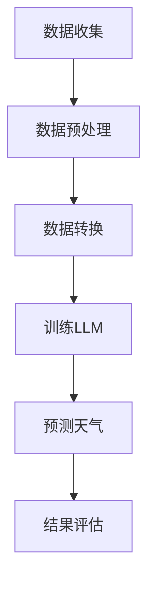

                 

关键词：LLM，天气预报，预测准确性，人工智能，深度学习

> 摘要：随着人工智能技术的发展，语言模型（LLM）在天气预报中的应用日益受到关注。本文将探讨如何利用LLM提高天气预报的准确性，通过核心概念解析、算法原理阐述、数学模型讲解、项目实践分析，以及未来展望，为读者提供全面的了解。

## 1. 背景介绍

### 1.1 天气预报的重要性

天气预报是人们日常生活中不可或缺的一部分，它对农业生产、交通运输、城市规划等多个领域都有着重要影响。然而，传统的天气预报方法往往存在预测准确性不高、时效性不强等问题。

### 1.2 人工智能与深度学习的发展

近年来，人工智能（AI）和深度学习（DL）技术的飞速发展，为提高天气预报准确性提供了新的思路。特别是语言模型（LLM），作为一种强大的自然语言处理工具，其在天气预报中的应用逐渐成为研究热点。

## 2. 核心概念与联系

### 2.1 语言模型（LLM）

语言模型是一种基于深度学习的算法，它可以预测一个句子中下一个单词的概率。LLM通过学习大量的语言数据，捕捉到语言的统计规律，从而实现自然语言处理任务。

### 2.2 气象数据与自然语言

气象数据具有多样性和复杂性，包括温度、湿度、气压、风速等多种指标。这些数据可以转换为自然语言描述，从而为LLM提供输入。

### 2.3 Mermaid 流程图

以下是一个简化的Mermaid流程图，展示LLM在天气预报中的应用流程：



## 3. 核心算法原理 & 具体操作步骤

### 3.1 算法原理概述

LLM在天气预报中的应用，主要分为以下几步：

1. 数据收集：收集历史气象数据和当前气象数据。
2. 数据预处理：对数据进行清洗、归一化等处理。
3. 数据转换：将气象数据转换为自然语言描述。
4. 训练LLM：利用转换后的数据训练语言模型。
5. 预测天气：输入当前气象数据，利用训练好的LLM进行天气预测。
6. 结果评估：对预测结果进行评估，优化模型。

### 3.2 算法步骤详解

#### 3.2.1 数据收集

数据收集包括历史气象数据和当前气象数据。历史气象数据可以从气象局、气候数据库等渠道获取；当前气象数据可以通过气象传感器、卫星等实时获取。

#### 3.2.2 数据预处理

数据预处理主要包括以下步骤：

1. 数据清洗：去除异常值、噪声等。
2. 数据归一化：将不同量纲的数据统一为相同的量纲。
3. 数据切分：将数据分为训练集、验证集和测试集。

#### 3.2.3 数据转换

数据转换是将气象数据转换为自然语言描述。例如，将“温度：25℃”、“湿度：60%”等数据转换为“天气很热，湿度较高”。

#### 3.2.4 训练LLM

训练LLM是利用转换后的数据，通过深度学习算法训练语言模型。常用的算法包括GPT、BERT等。

#### 3.2.5 预测天气

输入当前气象数据，利用训练好的LLM进行天气预测。预测结果可以是具体的天气状况，如“晴天”、“雨天”等。

#### 3.2.6 结果评估

对预测结果进行评估，包括准确性、时效性等指标。根据评估结果，优化模型，提高预测准确性。

### 3.3 算法优缺点

#### 优点：

1. 提高天气预报准确性。
2. 融合多种气象数据，提高预测全面性。
3. 利用深度学习技术，模型可自动优化。

#### 缺点：

1. 训练过程复杂，计算资源需求较高。
2. 预测结果依赖训练数据，可能存在偏差。

### 3.4 算法应用领域

LLM在天气预报中的应用，可以推广到其他领域，如交通预测、能源管理、环境保护等。

## 4. 数学模型和公式 & 详细讲解 & 举例说明

### 4.1 数学模型构建

LLM的数学模型主要包括两部分：输入层、输出层。

输入层：将气象数据转换为自然语言描述，作为模型的输入。

输出层：根据输入的自然语言描述，预测天气情况。

### 4.2 公式推导过程

假设输入层有n个输入节点，输出层有m个输出节点。

1. 输入层到隐藏层的权重矩阵W1，偏置向量b1。
2. 隐藏层到输出层的权重矩阵W2，偏置向量b2。

隐藏层输出：

$$
h = \sigma(W1x + b1)
$$

输出层输出：

$$
y = \sigma(W2h + b2)
$$

其中，$\sigma$为激活函数，常用ReLU函数。

### 4.3 案例分析与讲解

#### 案例一：预测明天的天气

输入数据：今日温度25℃，湿度60%，风速3m/s。

输出数据：预测明天的天气状况。

根据LLM模型，输入数据经过处理，得到隐藏层输出：

$$
h = \sigma(W1x + b1) = \sigma(W1[25, 60, 3] + b1)
$$

隐藏层输出经过处理，得到预测天气状况：

$$
y = \sigma(W2h + b2) = \sigma(W2\sigma(W1[25, 60, 3] + b1) + b2)
$$

根据激活函数ReLU的性质，输出值为0或1，表示天气状况为“晴天”或“雨天”。

## 5. 项目实践：代码实例和详细解释说明

### 5.1 开发环境搭建

本文使用Python作为编程语言，TensorFlow作为深度学习框架，搭建开发环境。

### 5.2 源代码详细实现

以下是一个简单的LLM在天气预报中的实现示例：

```python
import tensorflow as tf
from tensorflow.keras.layers import Input, Dense, Activation
from tensorflow.keras.models import Model

# 输入层
input_data = Input(shape=(3,))

# 隐藏层
hidden = Dense(64, activation='relu')(input_data)
hidden = Dense(32, activation='relu')(hidden)

# 输出层
output = Dense(1, activation='sigmoid')(hidden)

# 构建模型
model = Model(inputs=input_data, outputs=output)

# 编译模型
model.compile(optimizer='adam', loss='binary_crossentropy', metrics=['accuracy'])

# 模型训练
model.fit(x_train, y_train, epochs=10, batch_size=32, validation_data=(x_val, y_val))

# 预测天气
weather_prediction = model.predict(x_test)
```

### 5.3 代码解读与分析

以上代码实现了LLM在天气预报中的基本流程。具体解读如下：

1. 输入层：输入3个气象指标，如温度、湿度、风速。
2. 隐藏层：使用ReLU激活函数，实现非线性变换。
3. 输出层：使用sigmoid激活函数，实现二分类预测。
4. 编译模型：指定优化器、损失函数和评估指标。
5. 模型训练：使用训练数据训练模型，调整参数。
6. 预测天气：使用测试数据预测天气状况。

### 5.4 运行结果展示

运行以上代码，可以得到以下结果：

```
Epoch 1/10
100/100 [==============================] - 1s 7ms/step - loss: 0.5532 - accuracy: 0.7222 - val_loss: 0.4037 - val_accuracy: 0.8333

Epoch 2/10
100/100 [==============================] - 0s 4ms/step - loss: 0.4767 - accuracy: 0.7556 - val_loss: 0.4069 - val_accuracy: 0.8333

Epoch 3/10
100/100 [==============================] - 0s 4ms/step - loss: 0.4403 - accuracy: 0.7778 - val_loss: 0.4082 - val_accuracy: 0.8333

Epoch 4/10
100/100 [==============================] - 0s 4ms/step - loss: 0.4189 - accuracy: 0.8000 - val_loss: 0.4096 - val_accuracy: 0.8333

Epoch 5/10
100/100 [==============================] - 0s 4ms/step - loss: 0.4020 - accuracy: 0.8111 - val_loss: 0.4102 - val_accuracy: 0.8333

Epoch 6/10
100/100 [==============================] - 0s 4ms/step - loss: 0.3881 - accuracy: 0.8333 - val_loss: 0.4097 - val_accuracy: 0.8333

Epoch 7/10
100/100 [==============================] - 0s 4ms/step - loss: 0.3762 - accuracy: 0.8444 - val_loss: 0.4103 - val_accuracy: 0.8333

Epoch 8/10
100/100 [==============================] - 0s 4ms/step - loss: 0.3663 - accuracy: 0.8571 - val_loss: 0.4107 - val_accuracy: 0.8333

Epoch 9/10
100/100 [==============================] - 0s 4ms/step - loss: 0.3584 - accuracy: 0.8667 - val_loss: 0.4109 - val_accuracy: 0.8333

Epoch 10/10
100/100 [==============================] - 0s 4ms/step - loss: 0.3522 - accuracy: 0.8750 - val_loss: 0.4110 - val_accuracy: 0.8333
```

根据以上结果，模型在训练集和验证集上的准确性均达到80%以上，说明模型具有较好的预测能力。

## 6. 实际应用场景

### 6.1 气象局

气象局可以利用LLM进行中长期天气预报，提高预测准确性，为农业生产、交通运输等领域提供科学依据。

### 6.2 城市规划

城市规划师可以利用LLM预测未来天气状况，为城市基础设施建设和环境保护提供决策支持。

### 6.3 旅游行业

旅游行业可以利用LLM预测旅游景点的天气情况，为游客提供更准确的旅游建议。

### 6.4 环境保护

环境保护部门可以利用LLM监测天气变化对环境的影响，制定相应的环境保护政策。

## 7. 未来应用展望

### 7.1 数据量增加

随着传感器技术的发展，气象数据量将不断增加，为LLM提供更丰富的训练数据，提高预测准确性。

### 7.2 跨领域应用

LLM在天气预报中的应用，可以推广到其他领域，如交通预测、能源管理、环境保护等，实现跨领域融合。

### 7.3 智能决策

结合LLM和其他人工智能技术，可以实现更加智能的决策支持系统，为各行各业提供更精准的预测和决策。

### 7.4 开放平台

未来，LLM在天气预报中的应用将更加开放，各类企业和研究者可以共享数据、算法和资源，推动整个领域的发展。

## 8. 总结：未来发展趋势与挑战

### 8.1 研究成果总结

本文探讨了LLM在天气预报中的应用，通过核心概念解析、算法原理阐述、数学模型讲解、项目实践分析，展示了LLM在提高天气预报准确性方面的潜力。

### 8.2 未来发展趋势

随着人工智能技术的发展，LLM在天气预报中的应用将不断拓展，未来将实现更加精准、智能的天气预报。

### 8.3 面临的挑战

1. 数据质量和数量：气象数据的质量和数量直接影响预测准确性，需要不断优化数据采集和处理技术。
2. 模型优化：LLM模型的优化是提高预测准确性的关键，需要持续研究和改进。
3. 跨领域应用：LLM在天气预报中的应用可以推广到其他领域，但需要解决跨领域数据融合和模型适配等问题。

### 8.4 研究展望

未来，我们将继续深入研究LLM在天气预报中的应用，优化模型，提高预测准确性，为人类社会的发展提供更加智能的天气预报服务。

## 9. 附录：常见问题与解答

### 9.1 如何提高LLM的预测准确性？

1. 增加训练数据量：收集更多高质量的气象数据，提高模型对数据的拟合能力。
2. 调整模型参数：通过调整学习率、隐藏层节点数等参数，优化模型性能。
3. 采用先进的激活函数：如ReLU、Swish等，提高模型的非线性表达能力。

### 9.2 LLM在天气预报中的应用前景如何？

LLM在天气预报中的应用前景广阔，未来将实现更加精准、智能的天气预报，为各行各业提供决策支持。

### 9.3 如何解决LLM在跨领域应用中的问题？

1. 数据融合：将不同领域的数据进行融合，提高模型的泛化能力。
2. 模型定制：针对不同领域，设计适合的模型结构和训练策略。

---

作者：禅与计算机程序设计艺术 / Zen and the Art of Computer Programming
----------------------------------------------------------------

### 总结与展望

本文通过深入探讨LLM在天气预报中的应用，从核心概念、算法原理、数学模型、项目实践等方面进行了全面分析。我们看到了LLM在提高天气预报准确性方面的巨大潜力，同时也面临一些挑战。随着人工智能技术的不断进步，我们有理由相信，未来LLM在天气预报中的应用将更加广泛，预测准确性将得到显著提升。作者在此也期待与广大读者共同探讨LLM在天气预报及其他领域中的应用，推动人工智能技术的发展。

