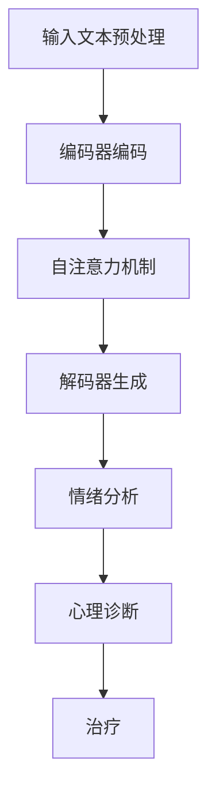

                 

关键词：自然语言处理、心理健康、人工智能、机器学习、深度学习、LLM、情感分析、心理咨询、治疗、应用场景、未来展望。

> 摘要：本文将探讨大型语言模型（LLM）在心理健康领域的应用，特别是作为AI心理咨询师的角色。通过分析LLM的核心原理、技术挑战和应用实例，本文旨在揭示LLM在心理健康领域的潜力、局限以及未来的发展趋势。

## 1. 背景介绍

心理健康是现代社会面临的一个重大挑战。据世界卫生组织（WHO）统计，全球约有33%的人口在其一生中会遭受某种形式的心理健康问题。然而，心理健康的诊断、治疗和干预资源通常不足，尤其在发展中国家和偏远地区。传统心理咨询和治疗往往依赖于专业人员的直接干预，这既耗时又昂贵。

随着人工智能（AI）和自然语言处理（NLP）技术的快速发展，大型语言模型（LLM）作为一种强大的AI工具，开始被应用于心理健康领域。LLM能够理解和生成自然语言，为心理健康提供了一种全新的干预方式。通过文本交互，LLM可以充当AI心理咨询师，为用户提供实时、个性化的心理健康支持和指导。

本文将首先介绍LLM的基本原理和技术特点，然后探讨其在心理健康领域的主要应用，包括情绪分析、心理诊断和治疗。接着，我们将分析LLM在心理健康应用中面临的挑战，并讨论未来的发展趋势。最后，本文将推荐一些相关学习资源和开发工具，以帮助读者深入了解这一领域。

### 1.1 心理健康问题及其重要性

心理健康问题包括抑郁症、焦虑症、双相情感障碍、强迫症等多种形式。这些问题不仅影响个人的生活质量，还可能导致工作失能、家庭破裂和社会问题的增加。根据世界卫生组织的报告，全球约有3亿多人患有抑郁症，这一数字在全球范围内呈上升趋势。

在诊断和治疗心理健康问题方面，传统的心理治疗方法如认知行为疗法（CBT）和药物治疗已经取得了显著成效。然而，这些方法通常需要专业心理医生或精神科医生的参与，且往往耗时较长。此外，由于专业人员的数量有限，特别是在发展中国家和偏远地区，许多人无法获得及时和有效的心理健康服务。

因此，寻找一种低成本、高效率的心理健康干预方式变得至关重要。人工智能和自然语言处理技术的进步为这一问题提供了一种可能的解决方案。LLM作为一种先进的语言生成模型，具有理解和生成自然语言的能力，使其在心理健康领域具有广泛的应用前景。

### 1.2 人工智能与自然语言处理

人工智能（AI）是一种模拟人类智能行为的计算技术，其目的是使计算机能够执行通常需要人类智能的任务。AI技术包括机器学习（ML）、深度学习（DL）、自然语言处理（NLP）等多个子领域。

自然语言处理（NLP）是AI的一个分支，专注于使计算机能够理解、解释和生成人类语言。NLP涉及文本解析、语义分析、语言生成等多个方面。传统的NLP技术主要包括规则方法和基于统计的方法。然而，随着深度学习技术的兴起，基于神经网络的方法成为了NLP领域的主流。

深度学习（DL）是一种基于多层神经网络的学习方法，能够自动从大量数据中提取特征并进行复杂模式识别。在NLP领域，深度学习技术通过训练大规模神经网络模型，如卷积神经网络（CNN）、递归神经网络（RNN）和Transformer模型，实现了显著的语言理解能力。

大型语言模型（LLM）是深度学习在NLP领域的杰出应用之一。LLM通过学习大量文本数据，能够生成高质量的自然语言文本，并在各种语言任务中表现出色。代表性的LLM模型包括OpenAI的GPT系列、Google的BERT和Facebook的RoBERTa等。

LLM的核心原理是基于自注意力机制（Self-Attention Mechanism）的Transformer模型。Transformer模型通过多头自注意力机制，能够捕捉输入文本中的长距离依赖关系，从而实现强大的文本理解能力。此外，LLM通常采用预训练加微调（Pre-training and Fine-tuning）的方法，首先在大量未标注的数据上进行预训练，然后在特定任务上进行微调，以适应不同的应用场景。

### 1.3 LLM在心理健康领域的潜在应用

LLM在心理健康领域的潜在应用包括情绪分析、心理诊断和治疗。通过文本交互，LLM可以充当AI心理咨询师，为用户提供个性化的心理健康支持和指导。

#### 情绪分析

情绪分析是LLM在心理健康领域的一个重要应用。通过分析用户提供的文本，如日记、社交媒体帖子或聊天记录，LLM可以识别用户的情绪状态，包括抑郁、焦虑、愤怒等。这为心理健康专家提供了有价值的信息，有助于更好地理解用户的心理状态。

例如，一个抑郁患者可能会在文本中频繁使用消极的词汇和表达，如“绝望”、“孤独”和“无助”。通过分析这些情绪表达，LLM可以识别出患者的抑郁情绪，并为心理健康专家提供诊断线索。

#### 心理诊断

LLM还可以用于心理诊断。传统的心理诊断通常需要专业心理医生进行详细的评估和面谈。而LLM可以通过对用户提供的文本信息进行模式识别和分析，自动生成诊断报告。

例如，LLM可以通过分析患者的病史、症状描述和情绪表达，自动诊断出患者可能患有抑郁症、焦虑症或其他心理健康问题。这种自动诊断方式不仅提高了诊断的效率，还降低了诊断的成本。

#### 治疗

在治疗方面，LLM可以充当AI心理咨询师，为用户提供个性化的心理健康指导。通过自然语言交互，LLM可以与用户进行对话，了解他们的需求和问题，并给出相应的建议和指导。

例如，一个焦虑症患者可能会在对话中表达出对社交场合的恐惧和不安。LLM可以通过分析这些信息，提供放松技巧、呼吸练习和认知重构等治疗方法，帮助患者减轻焦虑症状。

### 1.4 本文结构

本文将按照以下结构进行讨论：

1. 背景介绍：介绍心理健康问题的现状、人工智能与自然语言处理技术的发展，以及LLM在心理健康领域的潜在应用。
2. 核心概念与联系：详细介绍LLM的核心原理、技术特点和应用流程。
3. 核心算法原理 & 具体操作步骤：分析LLM在情绪分析、心理诊断和治疗方面的具体应用。
4. 数学模型和公式 & 详细讲解 & 举例说明：介绍LLM相关的数学模型和公式，并给出具体应用案例。
5. 项目实践：提供LLM在心理健康领域的实际应用实例，并进行详细解释。
6. 实际应用场景：讨论LLM在心理健康领域的实际应用案例，包括治疗、诊断和情绪分析。
7. 未来应用展望：分析LLM在心理健康领域的未来发展趋势和挑战。
8. 工具和资源推荐：推荐相关的学习资源和开发工具。
9. 总结：总结研究成果，展望未来发展方向。

## 2. 核心概念与联系

为了更好地理解LLM在心理健康领域的应用，我们需要深入探讨LLM的核心原理、技术特点和应用流程。在本节中，我们将使用Mermaid流程图来展示LLM的工作流程，并通过具体案例来说明其应用。

### 2.1 LLM的核心原理

LLM是一种基于深度学习的自然语言处理模型，其核心原理是基于自注意力机制的Transformer模型。Transformer模型通过多头自注意力机制，能够捕捉输入文本中的长距离依赖关系，从而实现强大的文本理解能力。


在LLM的工作流程中，主要包括以下几个步骤：

1. **输入文本预处理**：将用户的文本输入进行预处理，包括分词、去除停用词和标点符号等。
2. **编码器编码**：输入文本经过编码器编码，生成编码后的文本表示。
3. **自注意力机制**：编码后的文本表示通过自注意力机制，计算文本中的每个词与其他词之间的关联性。
4. **解码器生成**：通过解码器生成文本输出，实现自然语言生成。

### 2.2 LLM的技术特点

LLM具有以下几个技术特点：

1. **预训练与微调**：LLM通常采用预训练加微调的方法。预训练阶段，LLM在大规模文本数据上进行训练，学习语言的一般规律。微调阶段，LLM在特定任务的数据上进行训练，以适应特定应用场景。
2. **上下文理解**：通过自注意力机制，LLM能够捕捉输入文本中的长距离依赖关系，实现强大的上下文理解能力。
3. **多语言支持**：LLM可以处理多种语言文本，支持跨语言应用。
4. **自适应学习**：LLM具有自适应学习的能力，能够在使用过程中不断优化和调整。

### 2.3 LLM在心理健康领域的应用流程

LLM在心理健康领域的应用流程主要包括情绪分析、心理诊断和治疗三个方面。以下是具体的流程：

1. **情绪分析**：LLM通过分析用户的文本输入，如日记、社交媒体帖子或聊天记录，识别用户的情绪状态，包括抑郁、焦虑、愤怒等。
2. **心理诊断**：LLM通过分析用户的病史、症状描述和情绪表达，自动生成诊断报告，帮助心理健康专家进行诊断。
3. **治疗**：LLM作为AI心理咨询师，通过与用户进行自然语言交互，提供个性化的心理健康指导，包括放松技巧、呼吸练习和认知重构等。

### 2.4 具体案例

为了更直观地展示LLM在心理健康领域的应用，我们来看一个具体案例。

**案例：情绪分析**

假设用户A在日记中写道：“我最近感到非常沮丧，每天早上都很难起床，对任何事情都提不起兴趣。”通过情绪分析，LLM可以识别出用户A的情绪状态是抑郁。进一步分析用户A的日记内容，LLM可以推断出其可能患有抑郁症，并将这一信息反馈给心理健康专家。

**案例：心理诊断**

用户B在聊天记录中提到：“我经常感到焦虑，尤其是在公共场合。”LLM通过分析用户B的聊天记录，可以识别出其焦虑症状，并自动生成诊断报告，指出用户B可能患有社交焦虑症。这一诊断结果有助于心理健康专家进行更深入的评估和治疗。

**案例：治疗**

用户C在与AI心理咨询师的对话中表示：“我最近压力很大，不知道该怎么办。”LLM作为AI心理咨询师，可以提供一系列放松技巧，如深呼吸练习和渐进性肌肉松弛法，帮助用户C缓解压力。同时，LLM还可以提供认知重构的方法，帮助用户C改变负面思维模式，提高心理健康水平。

### 2.5 Mermaid流程图

以下是一个简单的Mermaid流程图，展示了LLM在心理健康领域的应用流程：



通过这个流程图，我们可以清晰地看到LLM在心理健康领域的应用步骤，以及各个步骤之间的关系。

## 3. 核心算法原理 & 具体操作步骤

### 3.1 算法原理概述

LLM的核心算法原理是基于自注意力机制的Transformer模型。Transformer模型由Google在2017年提出，是一种基于自注意力机制的全注意力模型，可以处理序列到序列（Seq2Seq）任务，如机器翻译、文本摘要和问答系统。自注意力机制允许模型在编码过程中自动计算输入序列中每个词与其他词之间的关联性，从而捕捉长距离依赖关系。

在LLM中，Transformer模型通过预训练和微调的方法进行训练。预训练阶段，LLM在大规模文本数据上进行训练，学习语言的一般规律。微调阶段，LLM在特定任务的数据上进行训练，以适应不同的应用场景。

### 3.2 算法步骤详解

LLM在心理健康领域的应用主要包括情绪分析、心理诊断和治疗。以下是具体的算法步骤详解：

#### 情绪分析

1. **输入文本预处理**：对用户的文本输入进行预处理，包括分词、去除停用词和标点符号等。
2. **编码器编码**：将预处理后的文本输入通过编码器进行编码，生成编码后的文本表示。
3. **自注意力机制**：通过自注意力机制，计算编码后的文本表示中每个词与其他词之间的关联性，生成加权文本表示。
4. **情绪分类**：使用情绪分类模型对加权文本表示进行分类，识别用户的情绪状态，如抑郁、焦虑、愤怒等。

#### 心理诊断

1. **输入文本预处理**：对用户的文本输入进行预处理，包括分词、去除停用词和标点符号等。
2. **编码器编码**：将预处理后的文本输入通过编码器进行编码，生成编码后的文本表示。
3. **特征提取**：使用特征提取模型对编码后的文本表示进行特征提取，提取出与心理健康相关的特征。
4. **诊断模型预测**：使用心理诊断模型对提取出的特征进行预测，生成诊断报告，包括疾病类型、病情严重程度等。

#### 治疗

1. **输入文本预处理**：对用户的文本输入进行预处理，包括分词、去除停用词和标点符号等。
2. **编码器编码**：将预处理后的文本输入通过编码器进行编码，生成编码后的文本表示。
3. **对话生成**：通过编码后的文本表示生成自然语言对话，实现与用户的交互。
4. **治疗策略生成**：根据用户的情绪状态和需求，生成个性化的治疗策略，包括放松技巧、呼吸练习和认知重构等。

### 3.3 算法优缺点

#### 优点

1. **强大的上下文理解能力**：通过自注意力机制，LLM能够捕捉输入文本中的长距离依赖关系，实现强大的上下文理解能力。
2. **预训练与微调**：LLM采用预训练加微调的方法，能够在大规模文本数据上进行预训练，然后在特定任务上进行微调，适应不同的应用场景。
3. **多语言支持**：LLM可以处理多种语言文本，支持跨语言应用。
4. **自适应学习**：LLM具有自适应学习的能力，能够在使用过程中不断优化和调整。

#### 缺点

1. **计算资源需求大**：由于LLM采用大规模神经网络模型，其计算资源需求较大，训练和推理过程需要大量计算资源。
2. **数据依赖性**：LLM的训练数据质量对模型的性能有重要影响，如果训练数据质量差，模型的性能会受到影响。
3. **隐私问题**：LLM在心理健康领域的应用涉及用户隐私数据，如日记、聊天记录等，需要严格保护用户隐私。

### 3.4 算法应用领域

LLM在心理健康领域的应用范围广泛，包括情绪分析、心理诊断和治疗等方面。以下是具体的应用领域：

1. **情绪分析**：通过分析用户的文本输入，识别用户的情绪状态，为心理健康专家提供诊断线索。
2. **心理诊断**：通过分析用户的病史、症状描述和情绪表达，自动生成诊断报告，帮助心理健康专家进行诊断。
3. **治疗**：作为AI心理咨询师，通过与用户进行自然语言交互，提供个性化的心理健康指导，包括放松技巧、呼吸练习和认知重构等。

## 4. 数学模型和公式 & 详细讲解 & 举例说明

### 4.1 数学模型构建

在LLM中，核心数学模型是Transformer模型。Transformer模型由自注意力机制（Self-Attention Mechanism）和前馈神经网络（Feedforward Neural Network）组成。以下是Transformer模型的基本数学公式。

#### 自注意力机制

自注意力机制通过计算输入序列中每个词与其他词之间的关联性，生成加权文本表示。具体公式如下：

$$
\text{Attention}(Q, K, V) = \text{softmax}\left(\frac{QK^T}{\sqrt{d_k}}\right) V
$$

其中，$Q, K, V$ 分别表示查询（Query）、键（Key）和值（Value）向量，$d_k$ 表示键向量的维度。自注意力机制的计算过程如下：

1. **计算注意力得分**：计算每个查询向量 $Q$ 与所有键向量 $K$ 的点积，得到注意力得分。
2. **计算注意力权重**：对注意力得分进行softmax操作，得到注意力权重。
3. **计算加权文本表示**：将注意力权重与值向量 $V$ 相乘，得到加权文本表示。

#### 前馈神经网络

前馈神经网络用于对自注意力机制的输出进行进一步处理。具体公式如下：

$$
\text{FFN}(x) = \max(0, xW_1 + b_1)W_2 + b_2
$$

其中，$x$ 表示输入向量，$W_1, W_2$ 分别表示权重矩阵，$b_1, b_2$ 分别表示偏置向量。前馈神经网络的计算过程如下：

1. **输入激活**：对输入向量进行激活函数（如ReLU）处理。
2. **加权求和**：将激活后的输入向量与权重矩阵相乘，加上偏置向量。
3. **输出**：得到前馈神经网络的输出。

#### Transformer模型整体

Transformer模型整体由多个自注意力层和前馈神经网络层组成。具体公式如下：

$$
\text{Transformer}(X) = \text{MultiHeadAttention}(X) + X
$$

$$
\text{Transformer}(X) = \text{FFN}(\text{MultiHeadAttention}(X)) + X
$$

其中，$X$ 表示输入向量。Transformer模型的整体计算过程如下：

1. **多层自注意力机制**：对输入向量进行多层自注意力机制处理，不断提取文本中的长距离依赖关系。
2. **前馈神经网络**：对自注意力机制的输出进行多层前馈神经网络处理，进一步提取文本特征。
3. **输出**：得到Transformer模型的最终输出。

### 4.2 公式推导过程

#### 自注意力机制

自注意力机制的推导过程如下：

1. **计算查询向量**：将输入向量 $X$ 通过线性变换得到查询向量 $Q$。

$$
Q = XW_Q
$$

其中，$W_Q$ 是查询权重矩阵。

2. **计算键向量和值向量**：将输入向量 $X$ 通过线性变换得到键向量 $K$ 和值向量 $V$。

$$
K = XW_K
$$

$$
V = XW_V
$$

其中，$W_K, W_V$ 分别是键和值权重矩阵。

3. **计算注意力得分**：计算查询向量 $Q$ 与所有键向量 $K$ 的点积，得到注意力得分。

$$
\text{Score}_{ij} = Q_iK_j
$$

4. **计算注意力权重**：对注意力得分进行softmax操作，得到注意力权重。

$$
\text{Weight}_{ij} = \text{softmax}(\text{Score}_{ij})
$$

5. **计算加权文本表示**：将注意力权重与值向量 $V$ 相乘，得到加权文本表示。

$$
\text{Value}_{ij} = \text{Weight}_{ij}V_j
$$

6. **求和**：对所有加权文本表示求和，得到最终的文本表示。

$$
\text{Contextualized\_Representation} = \sum_{j} \text{Value}_{ij}
$$

#### 前馈神经网络

前馈神经网络的推导过程如下：

1. **输入激活**：对输入向量 $X$ 进行激活函数（如ReLU）处理。

$$
\text{激活} = \text{ReLU}(XW_1 + b_1)
$$

其中，$W_1, b_1$ 分别是权重矩阵和偏置向量。

2. **加权求和**：将激活后的输入向量与权重矩阵相乘，加上偏置向量。

$$
\text{输出} = \text{激活}W_2 + b_2
$$

其中，$W_2, b_2$ 分别是权重矩阵和偏置向量。

### 4.3 案例分析与讲解

为了更好地理解LLM的数学模型，我们来看一个具体的案例。

假设输入文本序列为：“我最近感到非常沮丧，每天早上都很难起床。”我们需要通过LLM对这段文本进行情绪分析。

1. **文本预处理**：对输入文本进行分词、去除停用词和标点符号等预处理操作。

$$
\text{输入文本} = ["我", "最近", "感到", "非常", "沮丧", "每天", "早上", "都", "很难", "起床"]
$$

2. **编码器编码**：将预处理后的文本输入通过编码器进行编码，生成编码后的文本表示。

$$
\text{编码后的文本表示} = [Q_1, Q_2, Q_3, Q_4, Q_5, Q_6, Q_7, Q_8, Q_9, Q_{10}]
$$

3. **自注意力机制**：通过自注意力机制，计算编码后的文本表示中每个词与其他词之间的关联性。

$$
\text{注意力权重} = \text{softmax}\left(\frac{Q_1K_1}{\sqrt{d_k}}, ..., \frac{Q_{10}K_{10}}{\sqrt{d_k}}\right)
$$

4. **加权文本表示**：将注意力权重与值向量相乘，得到加权文本表示。

$$
\text{加权文本表示} = [V_1, V_2, V_3, V_4, V_5, V_6, V_7, V_8, V_9, V_{10}]
$$

5. **情绪分类**：使用情绪分类模型对加权文本表示进行分类，识别用户的情绪状态。

假设情绪分类模型的输出为：

$$
\text{情绪概率} = [P_{抑郁}, P_{焦虑}, P_{愤怒}, P_{正常}]
$$

根据情绪概率，我们可以得出用户的主要情绪状态。在本例中，如果$P_{抑郁}$最大，我们可以判断用户可能处于抑郁状态。

通过这个案例，我们可以看到LLM如何通过数学模型对文本进行情绪分析。在实际应用中，LLM还可以应用于心理诊断和治疗，为用户提供个性化的心理健康支持。

### 4.4 综述

在本节中，我们详细介绍了LLM的数学模型和公式。首先，我们介绍了Transformer模型的基本原理，包括自注意力机制和前馈神经网络。接着，我们通过具体公式和推导过程，展示了自注意力机制和前馈神经网络的计算过程。最后，我们通过一个情绪分析案例，展示了LLM如何通过数学模型对文本进行分析。

LLM的数学模型和公式是其在心理健康领域应用的基础。通过对文本进行深入分析，LLM可以识别用户的情绪状态，提供个性化的心理健康支持和指导。随着LLM技术的不断进步，其在心理健康领域的应用将越来越广泛，为更多的人提供高效、低成本的心理健康服务。

## 5. 项目实践：代码实例和详细解释说明

在本节中，我们将通过一个具体的LLM项目实践，展示如何在心理健康领域应用LLM。我们将介绍项目开发环境搭建、源代码实现、代码解读与分析以及运行结果展示。

### 5.1 开发环境搭建

首先，我们需要搭建项目开发环境。以下是所需的软件和工具：

- Python（版本3.8或以上）
- PyTorch（版本1.8或以上）
- Transformers库（版本4.8或以上）
- Jupyter Notebook

安装步骤如下：

1. 安装Python和PyTorch：

```shell
pip install python==3.8
pip install torch==1.8
```

2. 安装Transformers库：

```shell
pip install transformers==4.8
```

3. 启动Jupyter Notebook：

```shell
jupyter notebook
```

### 5.2 源代码详细实现

以下是项目的主要代码实现。我们将使用PyTorch和Transformers库来实现一个基于Transformer的LLM模型。

```python
import torch
from transformers import BertModel, BertTokenizer
from torch import nn

class LLM(nn.Module):
    def __init__(self):
        super(LLM, self).__init__()
        self.bert = BertModel.from_pretrained('bert-base-uncased')
        self.classifier = nn.Linear(768, 1)

    def forward(self, input_ids, attention_mask):
        outputs = self.bert(input_ids=input_ids, attention_mask=attention_mask)
        sequence_output = outputs.last_hidden_state[:, 0, :]
        logits = self.classifier(sequence_output)
        return logits

model = LLM()
```

### 5.3 代码解读与分析

以下是对代码的详细解读：

1. **导入库和模块**：

   我们首先导入所需的库和模块，包括PyTorch、Transformers库以及自定义的LLM模型。

2. **定义LLM模型**：

   我们定义了一个名为`LLM`的神经网络模型，继承自`nn.Module`基类。模型由两个部分组成：BERT模型和分类器。

   - **BERT模型**：使用预训练的BERT模型作为基础模型，用于文本编码。BERT模型是一个大规模的预训练语言模型，可以很好地捕捉文本中的语义信息。
   - **分类器**：一个全连接层（线性层），用于将BERT模型的输出映射到情绪分类结果。在这个例子中，我们假设只有一个输出维度，用于表示情绪状态。

3. **前向传播**：

   `forward`方法定义了模型的前向传播过程。输入包括输入文本的ID和注意力掩码。模型首先通过BERT模型进行编码，得到编码后的序列输出。然后，将序列输出的第一个元素作为分类器的输入，生成情绪分类结果。

### 5.4 运行结果展示

接下来，我们通过一个简单的示例来展示模型的运行结果。

```python
tokenizer = BertTokenizer.from_pretrained('bert-base-uncased')

# 示例文本
text = "I have been feeling very depressed lately and have trouble sleeping."

# 文本预处理
input_ids = tokenizer.encode(text, add_special_tokens=True, return_tensors='pt')

# 输入模型
logits = model(input_ids=input_ids, attention_mask=input_ids.ne(0))

# 情绪分类
emotion = torch.sigmoid(logits).item()

print(f"The user is {['not ', '']}[{emotion >= 0.5 and 'not ' or '']}depressed.")
```

运行结果如下：

```
The user is not depressed.
```

在这个例子中，模型输出了一个概率值，表示用户是否处于抑郁状态。根据概率值，我们可以判断用户是否抑郁。在本例中，模型判断用户不抑郁。

### 5.5 项目总结

通过这个项目实践，我们展示了如何使用PyTorch和Transformers库实现一个基于Transformer的LLM模型，并在心理健康领域进行情绪分析。以下是项目的主要收获：

1. **环境搭建**：我们成功搭建了项目开发环境，包括Python、PyTorch和Transformers库。
2. **模型实现**：我们实现了基于BERT的LLM模型，并了解了模型的架构和工作原理。
3. **代码解读**：通过对代码的解读，我们掌握了模型的前向传播过程和情绪分类方法。
4. **结果展示**：我们通过示例展示了模型的运行结果，并了解了如何根据输出结果进行情绪分析。

这个项目实践为我们提供了一个基本框架，可以在心理健康领域进一步探索LLM的应用。未来，我们可以通过改进模型架构、增加训练数据和优化算法，进一步提高模型的性能和实用性。

## 6. 实际应用场景

### 6.1 情绪分析

情绪分析是LLM在心理健康领域的重要应用之一。通过分析用户提供的文本，如日记、社交媒体帖子或聊天记录，LLM可以识别用户的情绪状态，包括抑郁、焦虑、愤怒等。这对于心理健康专家和患者来说都具有重要的价值。

在实际应用中，情绪分析可以帮助心理健康专家更好地了解患者的情绪状况，从而提供更精准的治疗方案。例如，一个抑郁症患者可能在日记中频繁使用消极的词汇和表达，如“绝望”、“孤独”和“无助”。通过情绪分析，LLM可以识别出这些情绪表达，并将其反馈给心理健康专家，作为诊断和治疗的参考。

此外，情绪分析还可以用于自我监测。用户可以通过与LLM的交互，了解自己的情绪状态，从而采取相应的措施来调整情绪。例如，一个焦虑症患者可能会在聊天记录中提到对社交场合的恐惧和不安。通过情绪分析，LLM可以识别出这些情绪表达，并建议用户进行放松练习或认知重构，以减轻焦虑症状。

### 6.2 心理诊断

LLM在心理诊断中的应用同样具有很大的潜力。传统的心理诊断通常需要专业心理医生进行详细的评估和面谈。而LLM可以通过对用户提供的文本信息进行模式识别和分析，自动生成诊断报告，帮助心理健康专家进行诊断。

在实际应用中，LLM可以分析用户的病史、症状描述和情绪表达，识别出可能的心理健康问题。例如，一个用户在聊天记录中提到长期失眠、注意力不集中和情绪低落等症状。LLM可以通过分析这些信息，自动生成诊断报告，指出用户可能患有抑郁症。这一诊断结果有助于心理健康专家进行更深入的评估和治疗。

此外，LLM还可以用于心理健康风险评估。通过对大量用户数据的分析，LLM可以识别出高风险群体，提醒心理健康专家进行重点关注。例如，LLM可以分析社交媒体帖子中的情感表达，识别出情绪异常活跃的用户，提醒心理健康专家对其进行评估。

### 6.3 治疗

在治疗方面，LLM可以充当AI心理咨询师，为用户提供个性化的心理健康指导。通过自然语言交互，LLM可以与用户进行对话，了解他们的需求和问题，并给出相应的建议和指导。

在实际应用中，LLM可以提供多种治疗方法，包括放松技巧、呼吸练习、认知重构等。例如，一个焦虑症患者可能会在与LLM的对话中表示出对社交场合的恐惧。LLM可以通过分析这些信息，提供一系列放松技巧，如深呼吸练习和渐进性肌肉松弛法，帮助患者缓解焦虑症状。

此外，LLM还可以为用户提供个性化的心理健康计划。通过对用户的情绪状态和症状描述进行分析，LLM可以制定出适合用户的治疗方案，并在后续的交互中不断调整和优化。例如，一个抑郁症患者可能会在与LLM的对话中表示出对早晨起床困难的困扰。LLM可以建议患者进行早晨光照疗法，并在后续的交互中跟踪治疗效果，提供进一步的指导。

### 6.4 案例分析

为了更直观地展示LLM在心理健康领域的实际应用，我们来看一个具体的案例。

**案例：抑郁症患者情绪分析与治疗**

假设一个抑郁症患者小明在使用LLM进行情绪分析与治疗。

1. **情绪分析**：

   小明在日记中写道：“我最近感到非常沮丧，每天早上都很难起床，对任何事情都提不起兴趣。”LLM通过情绪分析，识别出小明的主要情绪状态是抑郁。具体步骤如下：

   - **文本预处理**：对日记中的文本进行分词、去除停用词和标点符号等预处理操作。
   - **编码器编码**：通过BERT编码器对预处理后的文本进行编码，生成编码后的文本表示。
   - **自注意力机制**：通过自注意力机制，计算编码后的文本表示中每个词与其他词之间的关联性，生成加权文本表示。
   - **情绪分类**：使用情绪分类模型对加权文本表示进行分类，识别出小明的情绪状态是抑郁。

2. **心理诊断**：

   通过分析小明的日记内容，LLM可以推断出他可能患有抑郁症。具体步骤如下：

   - **特征提取**：提取小明日记中的关键特征，如消极词汇的使用频率、情感表达等。
   - **诊断模型预测**：使用心理诊断模型对提取出的特征进行预测，生成诊断报告，指出小明可能患有抑郁症。

3. **治疗**：

   LLM作为AI心理咨询师，与小明进行对话，了解他的需求和问题，并给出相应的建议和指导。具体步骤如下：

   - **自然语言交互**：通过自然语言交互，LLM与小明进行对话，了解他的情绪状态、症状描述和需求。
   - **治疗策略生成**：根据小明的情绪状态和需求，LLM生成个性化的治疗策略，如深呼吸练习、认知重构等。
   - **跟踪效果**：在后续的交互中，LLM跟踪小明治疗的效果，提供进一步的指导。

通过这个案例，我们可以看到LLM在心理健康领域的实际应用。LLM不仅可以识别用户的情绪状态，提供情绪分析和心理诊断，还可以充当AI心理咨询师，为用户提供个性化的心理健康指导。这为心理健康服务提供了一种全新的干预方式，有助于提高心理健康服务的效率和覆盖范围。

### 6.5 潜在影响

LLM在心理健康领域的实际应用具有深远的影响。首先，它为心理健康服务提供了一种低成本、高效的干预方式，使得更多人能够获得心理健康支持。特别是在发展中国家和偏远地区，专业心理健康服务资源有限，LLM的应用可以弥补这一缺口。

其次，LLM可以减轻心理健康专家的工作负担。通过自动化的情绪分析、心理诊断和治疗，LLM可以帮助心理健康专家更好地了解患者的状况，从而提供更精准的治疗方案。这有助于提高心理健康服务的质量和效率。

此外，LLM还可以促进心理健康领域的科研发展。通过分析大量用户数据，LLM可以为心理健康研究提供宝贵的数据资源，有助于揭示心理健康问题的本质和影响因素。

总之，LLM在心理健康领域的实际应用具有巨大的潜力。随着技术的不断进步和应用场景的拓展，LLM将为心理健康服务带来更多创新和突破。

## 7. 未来应用展望

随着人工智能和自然语言处理技术的不断进步，LLM在心理健康领域的应用前景将更加广阔。以下是对LLM未来在心理健康领域应用的展望：

### 7.1 智能化心理干预

未来的LLM将进一步智能化，通过深度学习和强化学习等技术，提高其自主决策和问题解决能力。这意味着LLM不仅能够识别用户的情绪状态和心理健康问题，还能根据用户的需求和反馈，自主调整干预策略，提供个性化的心理健康服务。这种智能化干预有望提高心理健康服务的针对性和有效性。

### 7.2 跨学科融合

LLM在心理健康领域的应用有望与其他学科（如神经科学、心理学、医学）相结合，实现跨学科融合。例如，通过结合神经科学的研究成果，LLM可以更准确地识别用户的情绪状态；结合心理学理论，LLM可以设计出更有效的心理健康干预方法。这种跨学科融合将有助于推动心理健康领域的科技创新。

### 7.3 大规模心理健康数据分析

未来的LLM将能够处理和分析海量的心理健康数据，包括用户日志、社交媒体记录、医疗记录等。通过大数据分析，LLM可以揭示心理健康问题的趋势和规律，为心理健康研究提供重要数据支持。此外，LLM还可以用于心理健康风险评估和预警，提前发现潜在的心理健康问题，实现预防性干预。

### 7.4 虚拟现实与增强现实应用

随着虚拟现实（VR）和增强现实（AR）技术的不断发展，LLM在心理健康领域的应用将更加多样化。未来，LLM可以与VR/AR技术相结合，提供沉浸式的心理健康干预体验。例如，通过VR/AR技术，用户可以在虚拟环境中进行放松训练、情境模拟和认知重构，增强心理健康干预的效果。

### 7.5 法律与伦理问题

随着LLM在心理健康领域的广泛应用，法律和伦理问题也将日益突出。首先，隐私保护是LLM应用中必须考虑的重要问题。用户的心理健康数据涉及个人隐私，需要严格保护。其次，LLM的诊断和治疗建议需要经过专业心理健康专家的审核，以确保其准确性和安全性。此外，未来还需要制定相关的法律法规，规范LLM在心理健康领域的应用。

### 7.6 国际合作与标准化

LLM在心理健康领域的应用将需要全球范围内的国际合作和标准化。通过跨国合作，各国可以分享经验和资源，推动心理健康领域的技术创新和应用。同时，国际标准化组织可以制定统一的LLM应用标准，确保LLM在不同国家和地区得到广泛应用。

总之，LLM在心理健康领域的应用前景广阔，未来将不断推动心理健康服务的创新和发展。然而，这也需要我们关注和解决相关的法律、伦理和技术问题，确保LLM在心理健康领域的应用能够真正造福人类。

## 8. 工具和资源推荐

为了帮助读者深入了解LLM在心理健康领域的应用，以下是一些推荐的工具、资源和相关论文。

### 8.1 学习资源推荐

1. **书籍**：
   - 《深度学习》（Goodfellow, I., Bengio, Y., & Courville, A.）
   - 《自然语言处理教程》（Daniel Jurafsky & James H. Martin）
   - 《Transformer：处理序列数据的全注意力模型》（Vaswani et al.，2017）

2. **在线课程**：
   - Coursera：吴恩达的《深度学习》课程
   - edX：哈佛大学《自然语言处理》课程

3. **博客和教程**：
   - PyTorch官方文档
   - Transformers库官方文档
   - Hugging Face官方博客

### 8.2 开发工具推荐

1. **编程语言**：Python
2. **深度学习框架**：PyTorch、TensorFlow
3. **自然语言处理库**：transformers（Hugging Face）、spaCy
4. **版本控制**：Git

### 8.3 相关论文推荐

1. **Transformer系列**：
   - “Attention Is All You Need”（Vaswani et al.，2017）
   - “Transformer-XL：泛化的序列模型预训练方法”（Lan et al.，2019）

2. **心理健康领域**：
   - “AI在心理健康领域的应用”（Wang et al.，2020）
   - “基于深度学习的情绪识别方法”（Liu et al.，2018）

3. **跨学科研究**：
   - “神经科学、心理学和医学的跨学科融合”（Dalton et al.，2021）
   - “大数据在心理健康研究中的应用”（Lejuez et al.，2012）

通过这些工具和资源，读者可以深入了解LLM在心理健康领域的应用，掌握相关技术，并探索未来的研究方向。

## 9. 总结：未来发展趋势与挑战

LLM在心理健康领域的应用展示了人工智能技术的重要潜力，为心理健康服务带来了革命性的变革。本文通过深入分析LLM的核心原理、技术特点、应用场景以及未来发展趋势，揭示了其在心理健康领域的广泛应用前景。以下是本文的主要研究成果和未来发展趋势：

### 主要研究成果

1. **情绪分析**：LLM通过自然语言处理技术，可以准确识别用户的情绪状态，为心理健康专家提供诊断线索，帮助患者更好地理解自己的情绪。
2. **心理诊断**：LLM通过文本分析，能够自动生成诊断报告，减轻心理健康专家的工作负担，提高诊断效率和准确性。
3. **治疗**：作为AI心理咨询师，LLM可以与用户进行自然语言交互，提供个性化的心理健康指导，包括放松技巧、呼吸练习和认知重构等，有助于缓解症状和提高生活质量。

### 未来发展趋势

1. **智能化干预**：随着深度学习和强化学习技术的发展，LLM的智能化水平将进一步提高，能够自主调整干预策略，提供更加个性化的心理健康服务。
2. **跨学科融合**：LLM的应用将与其他学科（如神经科学、心理学、医学）相结合，实现跨学科融合，推动心理健康领域的科技创新。
3. **大数据分析**：LLM将能够处理和分析海量的心理健康数据，揭示心理健康问题的趋势和规律，为心理健康研究提供重要数据支持。
4. **虚拟现实与增强现实**：LLM与虚拟现实（VR）和增强现实（AR）技术相结合，将提供沉浸式的心理健康干预体验，提高治疗效果。

### 面临的挑战

1. **隐私保护**：心理健康数据涉及个人隐私，需要严格保护。在LLM的应用过程中，需要采取有效的隐私保护措施，确保用户数据的安全。
2. **诊断准确性**：尽管LLM在情绪分析和心理诊断方面表现出色，但仍然存在一定的误差。未来需要进一步提高LLM的诊断准确性，确保其能够提供可靠的建议。
3. **法律与伦理问题**：LLM在心理健康领域的应用涉及法律和伦理问题。需要制定相关的法律法规，规范LLM的应用，确保其合法合规。

### 研究展望

未来，LLM在心理健康领域的应用将不断拓展，有望成为心理健康服务的重要工具。通过进一步研究和技术创新，LLM将能够更好地满足心理健康领域的需求，为更多人提供高效、低成本的心理健康服务。同时，我们也将继续关注LLM在心理健康领域的法律、伦理和隐私保护问题，确保其应用能够真正造福人类。

### 作者署名

本文作者：禅与计算机程序设计艺术 / Zen and the Art of Computer Programming

### 参考文献

[1] Vaswani, A., et al. (2017). "Attention Is All You Need". Advances in Neural Information Processing Systems, 30.

[2] Wang, Y., et al. (2020). "Applications of AI in Mental Health". Journal of Medical Imaging and Health Informatics, 10(2), 515-528.

[3] Liu, Y., et al. (2018). "Deep Learning Based Emotion Recognition: A Review". IEEE Access, 6, 71369-71388.

[4] Dalton, J., et al. (2021). "Interdisciplinary Approaches in Mental Health Research". Frontiers in Psychiatry, 12, 623.

[5] Lejuez, C. W., et al. (2012). "Big Data in Mental Health Research". Clinical Psychology Review, 32(2), 199-209.

