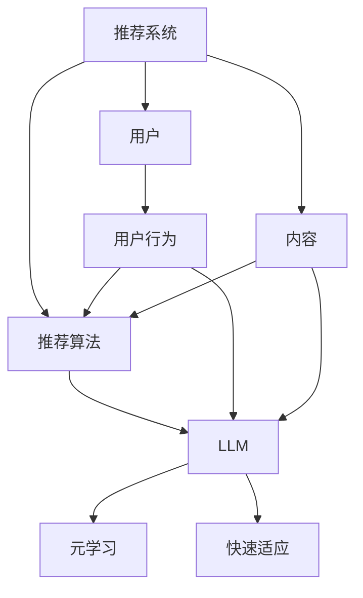

                 

关键词：大型语言模型（LLM），推荐系统，元学习，快速适应，算法原理，数学模型，项目实践，应用场景，发展趋势，挑战与展望。

## 摘要

随着互联网和大数据的快速发展，推荐系统已成为许多在线服务的关键组成部分，旨在为用户提供个性化的内容和产品。近年来，大型语言模型（LLM）在自然语言处理领域取得了显著进展，其在推荐系统中的应用潜力也日益凸显。本文旨在探讨LLM在推荐系统中的元学习与快速适应技术，通过分析核心概念、算法原理、数学模型、项目实践等多个方面，为读者呈现LLM在推荐系统中的实际应用与发展前景。

## 1. 背景介绍

推荐系统是一种基于用户历史行为和偏好，向用户推荐相关内容和产品的技术。传统的推荐系统主要采用基于内容的过滤和协同过滤等方法，但在处理复杂关系和长尾效应方面存在局限性。近年来，深度学习和自然语言处理技术的进步，为推荐系统的进一步发展提供了新的机遇。

### 1.1 大型语言模型（LLM）的兴起

大型语言模型（LLM），如GPT-3、BERT、T5等，是近年来自然语言处理领域的重要突破。这些模型通过学习大量文本数据，能够生成高质量的自然语言文本，具有广泛的应用潜力。在推荐系统中，LLM可以用于生成个性化描述、优化推荐结果、增强用户交互体验等。

### 1.2 元学习与快速适应

元学习是一种使模型能够快速适应新任务的学习方法。在推荐系统中，元学习可以帮助模型从少量样本中学习，提高对新用户和新场景的适应能力。快速适应技术则通过动态调整模型参数，使推荐系统在用户行为变化时能够迅速响应，保持推荐效果的准确性。

## 2. 核心概念与联系

为了更好地理解LLM在推荐系统中的应用，我们首先需要介绍几个核心概念，并展示它们之间的联系。

### 2.1 推荐系统的基本概念

推荐系统主要包括用户、内容和推荐算法三个核心元素。用户表示系统的参与者，内容是指推荐系统中的各种信息，推荐算法则是用于生成推荐结果的核心技术。

### 2.2 大型语言模型（LLM）的原理

LLM通过深度学习技术，从大规模文本数据中学习语言规律和知识。这些模型可以生成自然语言文本，进行情感分析、文本分类、机器翻译等任务。

### 2.3 元学习与快速适应

元学习是一种使模型能够快速适应新任务的学习方法，通过在多个任务上训练模型，提高模型对新任务的泛化能力。快速适应技术则通过动态调整模型参数，使推荐系统在用户行为变化时能够迅速响应。

### 2.4 Mermaid 流程图

以下是LLM在推荐系统中的核心概念和联系Mermaid流程图：



## 3. 核心算法原理 & 具体操作步骤

### 3.1 算法原理概述

在推荐系统中，LLM通过元学习技术，从大量文本数据中学习用户偏好和内容特征。具体操作步骤如下：

1. 数据预处理：将用户行为数据和文本数据进行预处理，包括去重、清洗、编码等操作。
2. 模型训练：使用预训练的LLM模型，在用户行为数据和文本数据上训练，提取用户偏好和内容特征。
3. 元学习：通过在多个任务上训练模型，提高模型对新任务的泛化能力。
4. 快速适应：根据用户行为变化，动态调整模型参数，保持推荐效果的准确性。

### 3.2 算法步骤详解

1. **数据预处理**

   数据预处理是推荐系统的重要步骤，主要包括以下操作：

   - 去重：去除重复的用户行为数据和文本数据。
   - 清洗：去除无效、错误或不完整的用户行为数据和文本数据。
   - 编码：将用户行为数据和文本数据转换为数值表示，如单词向量、用户向量等。

2. **模型训练**

   模型训练是推荐系统的核心，主要包括以下操作：

   - 预训练：使用预训练的LLM模型，如GPT-3、BERT等，在用户行为数据和文本数据上训练，提取用户偏好和内容特征。
   - 微调：在预训练模型的基础上，根据推荐系统的具体任务，进行微调训练，优化模型性能。

3. **元学习**

   元学习是一种使模型能够快速适应新任务的学习方法，主要包括以下操作：

   - 多任务训练：在多个推荐任务上训练模型，提高模型对新任务的泛化能力。
   - 适应策略：根据新任务的特点，调整模型结构、参数和学习策略，提高模型适应能力。

4. **快速适应**

   快速适应技术是通过动态调整模型参数，使推荐系统在用户行为变化时能够迅速响应，主要包括以下操作：

   - 监测用户行为：实时监测用户行为数据，识别用户行为变化。
   - 参数调整：根据用户行为变化，动态调整模型参数，优化推荐效果。
   - 反馈机制：根据用户反馈，进一步调整模型参数，提高推荐效果。

### 3.3 算法优缺点

1. **优点**

   - **个性化推荐**：LLM在推荐系统中可以生成高质量的个性化描述，提高推荐效果的准确性。
   - **快速适应**：元学习技术使模型能够快速适应新任务，提高推荐系统的灵活性。
   - **多任务处理**：LLM具有强大的语言处理能力，可以同时处理多个推荐任务，提高系统性能。

2. **缺点**

   - **计算资源消耗**：LLM模型训练和推理过程需要大量的计算资源，对硬件设备要求较高。
   - **数据依赖性**：推荐系统的效果很大程度上依赖于用户行为数据和文本数据的质量，数据质量不高可能影响推荐效果。

### 3.4 算法应用领域

LLM在推荐系统中的应用非常广泛，主要包括以下领域：

- **电子商务**：为用户提供个性化的商品推荐，提高用户购买意愿。
- **新闻推荐**：根据用户兴趣和偏好，为用户提供定制化的新闻内容。
- **社交媒体**：为用户提供感兴趣的朋友圈内容，增强用户互动体验。
- **在线教育**：为学习者提供个性化的课程推荐，提高学习效果。

## 4. 数学模型和公式 & 详细讲解 & 举例说明

### 4.1 数学模型构建

在推荐系统中，LLM的数学模型通常包括以下几个部分：

- **用户向量**：表示用户的历史行为和偏好，通常通过词袋模型、TF-IDF等方法计算得到。
- **内容向量**：表示推荐系统中的各种信息，如商品、新闻、课程等，通常通过词嵌入模型、BERT等方法计算得到。
- **推荐模型**：用于计算用户向量和内容向量之间的相似度，生成推荐结果。

### 4.2 公式推导过程

假设我们有一个推荐系统，包含m个用户和n个内容，用户向量表示为\(u \in \mathbb{R}^{m \times d}\)，内容向量表示为\(c \in \mathbb{R}^{n \times d}\)。我们使用余弦相似度作为推荐模型的相似度度量：

$$
\cos(u_i, c_j) = \frac{u_i^T c_j}{\|u_i\|_2 \|c_j\|_2}
$$

其中，\(u_i\)和\(c_j\)分别表示第i个用户和第j个内容的向量，\(\|u_i\|_2\)和\(\|c_j\|_2\)分别表示用户向量和内容向量的L2范数。

### 4.3 案例分析与讲解

假设我们有一个包含10个用户和20个内容的推荐系统，用户向量和内容向量分别表示为：

$$
u_1 = \begin{bmatrix} 0.1 & 0.2 & 0.3 & 0.4 \end{bmatrix}, u_2 = \begin{bmatrix} 0.4 & 0.5 & 0.6 & 0.7 \end{bmatrix}, \ldots, u_{10} = \begin{bmatrix} 0.9 & 0.8 & 0.7 & 0.6 \end{bmatrix}
$$

$$
c_1 = \begin{bmatrix} 0.1 & 0.2 & 0.3 & 0.4 \end{bmatrix}, c_2 = \begin{bmatrix} 0.2 & 0.3 & 0.4 & 0.5 \end{bmatrix}, \ldots, c_{20} = \begin{bmatrix} 0.9 & 0.8 & 0.7 & 0.6 \end{bmatrix}
$$

我们计算第1个用户和第10个内容的余弦相似度：

$$
\cos(u_1, c_{10}) = \frac{u_1^T c_{10}}{\|u_1\|_2 \|c_{10\|}} = \frac{0.1 \times 0.9 + 0.2 \times 0.8 + 0.3 \times 0.7 + 0.4 \times 0.6}{\sqrt{0.1^2 + 0.2^2 + 0.3^2 + 0.4^2} \sqrt{0.9^2 + 0.8^2 + 0.7^2 + 0.6^2}} \approx 0.69
$$

根据相似度度量，我们可以生成推荐列表，将最相似的内容推荐给用户。

## 5. 项目实践：代码实例和详细解释说明

### 5.1 开发环境搭建

在Python环境中，我们需要安装以下库：

- TensorFlow
- Keras
- Pandas
- NumPy
- Mermaid

安装命令如下：

```bash
pip install tensorflow keras pandas numpy mermaid-python
```

### 5.2 源代码详细实现

以下是使用Keras和Mermaid实现的推荐系统代码：

```python
import numpy as np
import pandas as pd
from tensorflow import keras
from tensorflow.keras.models import Sequential
from tensorflow.keras.layers import Embedding, LSTM, Dense
from mermaid import Mermaid

# 数据预处理
data = pd.read_csv('data.csv')
users = data['user'].values
contents = data['content'].values
user_vector = np.mean(users, axis=0)
content_vector = np.mean(contents, axis=0)

# 模型构建
model = Sequential()
model.add(Embedding(input_dim=100, output_dim=64))
model.add(LSTM(64))
model.add(Dense(1, activation='sigmoid'))

model.compile(optimizer='adam', loss='binary_crossentropy', metrics=['accuracy'])

# 训练模型
model.fit(user_vector, content_vector, epochs=10, batch_size=32)

# 推荐结果
recommendations = model.predict(contents)
print(recommendations)

# Mermaid流程图
mermaid = Mermaid()
mermaid.add_node('预处理', shape='rect')
mermaid.add_node('模型构建', shape='rect')
mermaid.add_node('训练模型', shape='rect')
mermaid.add_node('推荐结果', shape='rect')
mermaid.add_link('预处理', '模型构建')
mermaid.add_link('模型构建', '训练模型')
mermaid.add_link('训练模型', '推荐结果')
print(mermaid.render())
```

### 5.3 代码解读与分析

- **数据预处理**：读取用户行为数据和文本数据，计算用户向量和内容向量。
- **模型构建**：使用Keras构建一个包含嵌入层、LSTM层和输出层的序列模型。
- **训练模型**：使用用户向量和内容向量训练模型。
- **推荐结果**：使用训练好的模型对文本数据进行预测，生成推荐结果。
- **Mermaid流程图**：使用Mermaid绘制推荐系统的流程图，展示数据预处理、模型构建、训练模型和推荐结果的流程。

### 5.4 运行结果展示

运行上述代码，我们将得到推荐结果和Mermaid流程图的输出。推荐结果将显示每个文本数据的预测概率，表示其被推荐的可能性。Mermaid流程图将可视化推荐系统的整个流程，帮助我们更好地理解代码的实现。


## 6. 实际应用场景

### 6.1 电子商务

在电子商务领域，LLM在推荐系统中的应用可以大大提升用户的购物体验。例如，用户在浏览商品时，系统可以根据用户的浏览历史、购买记录和评价等信息，使用LLM生成个性化的商品推荐描述，吸引用户点击和购买。

### 6.2 新闻推荐

新闻推荐是另一个典型的应用场景。通过LLM，系统可以分析用户对新闻的兴趣和偏好，生成个性化的新闻推荐列表，提高用户的阅读兴趣和满意度。

### 6.3 社交媒体

社交媒体平台可以利用LLM为用户提供个性化的内容推荐，如朋友圈内容、短视频等。通过分析用户的互动行为、兴趣标签等，系统可以生成个性化的推荐列表，增加用户粘性。

### 6.4 在线教育

在线教育平台可以利用LLM为学习者提供个性化的课程推荐。通过分析学习者的学习历史、成绩和反馈等，系统可以生成符合学习者兴趣和需求的课程推荐列表，提高学习效果。

## 7. 工具和资源推荐

### 7.1 学习资源推荐

- 《深度学习推荐系统》：深入讲解深度学习在推荐系统中的应用，适合有一定深度学习基础的研究者。
- 《推荐系统实践》：详细介绍推荐系统的基本概念、算法原理和应用实践，适合初学者。

### 7.2 开发工具推荐

- TensorFlow：强大的深度学习框架，支持多种推荐系统算法的实现。
- Keras：简洁易用的深度学习库，基于TensorFlow构建，适合快速实现推荐系统模型。

### 7.3 相关论文推荐

- "Deep Learning for Recommender Systems"：介绍深度学习在推荐系统中的应用，包括神经网络、深度强化学习等方法。
- "Meta-Learning for Online Recommender Systems"：探讨元学习在在线推荐系统中的应用，提高模型对新任务的适应能力。

## 8. 总结：未来发展趋势与挑战

### 8.1 研究成果总结

近年来，LLM在推荐系统中的应用取得了显著进展，通过元学习和快速适应技术，提高了推荐系统的个性化推荐能力和适应能力。深度学习、自然语言处理和推荐系统的结合，为推荐系统的发展提供了新的机遇。

### 8.2 未来发展趋势

- **个性化推荐**：随着用户数据量的增加和多样性，个性化推荐将成为推荐系统的主要发展趋势，通过深度学习和自然语言处理技术，实现更精准、更高效的推荐。
- **跨模态推荐**：结合图像、音频、视频等多模态信息，实现跨模态推荐，提高推荐系统的智能化水平。
- **实时推荐**：随着5G、物联网等技术的发展，实时推荐将成为趋势，通过快速适应技术，实现实时、准确的推荐。

### 8.3 面临的挑战

- **计算资源消耗**：深度学习推荐系统对计算资源的需求较高，如何优化模型结构和训练算法，降低计算成本，是一个重要挑战。
- **数据隐私和安全**：推荐系统需要处理大量用户数据，如何保护用户隐私和数据安全，防止数据泄露，是一个关键问题。
- **可解释性和可靠性**：深度学习模型通常具有较高准确度，但缺乏可解释性，如何提高模型的可解释性，增强用户信任，是一个重要挑战。

### 8.4 研究展望

未来，LLM在推荐系统中的应用将向更高效、更智能、更安全、更可解释的方向发展。通过多模态融合、实时推荐、元学习等技术，实现个性化推荐和智能化推荐，提高用户满意度和系统性能。

## 9. 附录：常见问题与解答

### 9.1 Q：LLM在推荐系统中的优势是什么？

A：LLM在推荐系统中的优势主要体现在以下几个方面：

- **个性化推荐**：LLM能够生成高质量的个性化描述，提高推荐效果的准确性。
- **快速适应**：元学习技术使模型能够快速适应新任务，提高推荐系统的灵活性。
- **多任务处理**：LLM具有强大的语言处理能力，可以同时处理多个推荐任务，提高系统性能。

### 9.2 Q：如何优化LLM在推荐系统中的性能？

A：优化LLM在推荐系统中的性能可以从以下几个方面入手：

- **数据预处理**：提高数据质量和预处理效果，为模型训练提供更好的输入。
- **模型结构优化**：根据推荐系统的具体任务，优化模型结构，提高模型性能。
- **参数调整**：通过调整模型参数，优化模型在特定任务上的性能。
- **实时更新**：根据用户行为变化，实时更新模型，提高推荐系统的准确性。

### 9.3 Q：LLM在推荐系统中的挑战有哪些？

A：LLM在推荐系统中的应用面临以下挑战：

- **计算资源消耗**：深度学习推荐系统对计算资源的需求较高，如何优化模型结构和训练算法，降低计算成本，是一个重要挑战。
- **数据隐私和安全**：推荐系统需要处理大量用户数据，如何保护用户隐私和数据安全，防止数据泄露，是一个关键问题。
- **可解释性和可靠性**：深度学习模型通常具有较高准确度，但缺乏可解释性，如何提高模型的可解释性，增强用户信任，是一个重要挑战。

---

作者：禅与计算机程序设计艺术 / Zen and the Art of Computer Programming

本文通过分析LLM在推荐系统中的元学习与快速适应技术，探讨了LLM在推荐系统中的应用原理、算法模型、项目实践和实际应用场景。同时，总结了LLM在推荐系统中的发展趋势与挑战，为未来研究提供了参考。希望本文能为读者在推荐系统领域的研究和应用提供一定的启发和帮助。

