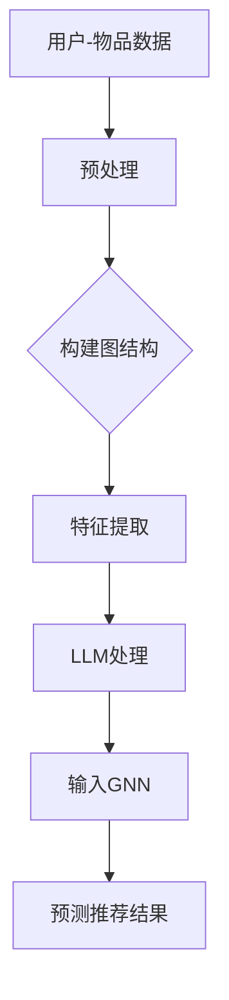
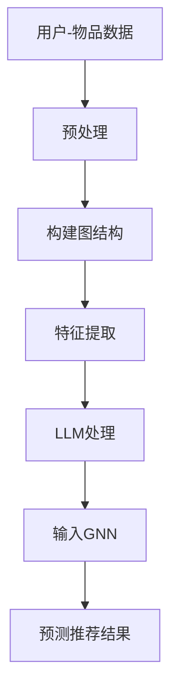

                 

关键词：推荐系统，图神经网络，深度学习，语言模型，应用场景

摘要：本文旨在探讨如何将语言模型（LLM）应用于推荐系统中，并结合图神经网络（GNN）的强大能力，提升推荐系统的性能。通过对LLM和GNN的基本原理介绍，本文将详细阐述其结合应用的数学模型、算法步骤以及实际应用案例，并展望未来的发展趋势和挑战。

## 1. 背景介绍

推荐系统作为一种信息过滤技术，旨在为用户提供个性化的内容推荐。随着互联网和大数据的发展，推荐系统已经在电子商务、社交媒体、新闻媒体等多个领域取得了显著的应用成果。传统的推荐系统主要依赖于基于内容过滤和协同过滤的方法，然而这些方法在处理复杂数据和提供个性化推荐时存在一定的局限性。

为了克服这些局限，近年来深度学习，尤其是图神经网络（GNN），在推荐系统中的应用引起了广泛关注。GNN能够有效地处理图结构数据，捕捉节点间的复杂关系，为推荐系统提供了新的可能。同时，语言模型（LLM）作为深度学习的重要分支，具有强大的语义理解和生成能力，能够更好地捕捉用户和物品的交互信息。

本文将介绍如何将LLM与GNN结合应用于推荐系统，通过数学模型和具体算法步骤的阐述，展示其在提升推荐系统性能方面的潜力。

## 2. 核心概念与联系

### 2.1 语言模型（LLM）

语言模型是一种基于统计方法或神经网络模型，用于预测文本序列中下一个单词或字符的概率分布。LLM通过学习大量文本数据，可以自动获取语言的内在规律和特征，从而实现文本的生成、分类、翻译等任务。

在推荐系统中，LLM能够捕捉用户和物品的语义信息，提供更为精准和个性化的推荐结果。常见的LLM包括循环神经网络（RNN）、长短期记忆网络（LSTM）和变压器模型（Transformer）等。

### 2.2 图神经网络（GNN）

图神经网络是一种在图结构数据上定义的神经网络，能够有效地捕捉节点和边之间的复杂关系。GNN通过将节点和边的特征映射到高维空间，建立节点间的相似性和依赖关系，从而实现节点的分类、预测和推荐等任务。

在推荐系统中，GNN可以处理用户和物品的交互数据，建立用户和物品之间的图结构，捕捉用户偏好和兴趣点，实现更准确的推荐。

### 2.3 LLM与GNN的结合

将LLM与GNN结合应用于推荐系统，可以充分发挥两者的优势。LLM可以捕捉用户和物品的语义信息，为GNN提供高质量的输入特征；而GNN则可以处理图结构数据，挖掘节点间的复杂关系，为推荐系统提供更精准的预测。

以下是一个简单的Mermaid流程图，展示了LLM与GNN在推荐系统中的应用流程：



### 2.4 Mermaid流程图

以下是一个Mermaid流程图，展示了LLM与GNN在推荐系统中的应用流程：



## 3. 核心算法原理 & 具体操作步骤

### 3.1 算法原理概述

LLM-GNN推荐系统的核心思想是通过LLM捕捉用户和物品的语义信息，将其作为GNN的输入特征，利用GNN挖掘用户和物品间的复杂关系，实现个性化推荐。

具体来说，算法分为以下几个步骤：

1. 用户-物品数据的预处理：对用户-物品数据集进行清洗、去重等操作，构建用户和物品的基本特征。

2. 构建图结构：将用户-物品数据转换为图结构，包括用户节点、物品节点和边。边表示用户和物品的交互记录。

3. 特征提取：使用LLM对用户和物品的语义信息进行编码，提取高质量的特征向量。

4. 输入GNN：将LLM提取的特征向量作为GNN的输入，进行节点分类、预测等操作。

5. 预测推荐结果：利用GNN的预测结果，生成个性化的推荐列表。

### 3.2 算法步骤详解

1. **用户-物品数据的预处理**

   - **数据清洗**：去除数据中的噪声和异常值，保证数据的准确性。

   - **去重**：对重复的交互记录进行去重处理，避免重复计算。

   - **特征提取**：提取用户和物品的基本特征，如用户年龄、性别、物品类别等。

2. **构建图结构**

   - **节点生成**：将用户和物品映射为图中的节点。

   - **边生成**：将用户和物品的交互记录映射为图中的边，表示用户和物品之间的关系。

3. **特征提取**

   - **文本数据预处理**：对用户和物品的文本数据进行分词、去停用词、词向量化等操作。

   - **LLM编码**：使用预训练的LLM模型对用户和物品的文本数据进行编码，提取语义特征向量。

4. **输入GNN**

   - **节点特征输入**：将LLM提取的用户和物品的特征向量作为GNN的输入。

   - **边特征输入**：根据用户和物品的交互记录，生成边特征向量，作为GNN的输入。

5. **预测推荐结果**

   - **GNN训练**：使用训练数据进行GNN模型的训练。

   - **预测推荐**：使用训练好的GNN模型进行推荐预测，生成个性化的推荐列表。

### 3.3 算法优缺点

**优点**：

- **高精度**：通过LLM对用户和物品的语义信息进行编码，提升推荐系统的准确性。

- **个性化**：结合GNN对用户和物品的复杂关系进行建模，实现更精准的个性化推荐。

- **可扩展性**：LLM和GNN具有较好的可扩展性，能够处理大规模数据集和多种类型的数据。

**缺点**：

- **计算成本高**：LLM和GNN的训练和推理过程较为复杂，计算成本较高。

- **数据依赖强**：LLM和GNN的性能依赖于高质量的数据集，数据预处理和清洗工作较为繁琐。

### 3.4 算法应用领域

LLM-GNN推荐系统可以广泛应用于多个领域：

- **电子商务**：根据用户的历史购买记录和浏览行为，提供个性化的商品推荐。

- **社交媒体**：根据用户的兴趣和关注对象，推荐感兴趣的内容和用户。

- **新闻媒体**：根据用户的阅读习惯和偏好，推荐相关的新闻文章。

- **在线教育**：根据学生的学习记录和成绩，推荐适合的学习资源和课程。

## 4. 数学模型和公式 & 详细讲解 & 举例说明

### 4.1 数学模型构建

LLM-GNN推荐系统的数学模型主要包括LLM模型和GNN模型两部分。

1. **LLM模型**

   假设用户和物品的文本数据分别表示为$\textbf{u} \in \mathbb{R}^{n_u}$和$\textbf{i} \in \mathbb{R}^{n_i}$，其中$n_u$和$n_i$分别为用户和物品的文本长度。LLM模型将文本数据编码为语义特征向量，记为$\textbf{h_u} \in \mathbb{R}^{d_u}$和$\textbf{h_i} \in \mathbb{R}^{d_i}$，其中$d_u$和$d_i$分别为用户和物品的特征维度。

   $$\textbf{h_u} = \text{LLM}(\textbf{u})$$
   $$\textbf{h_i} = \text{LLM}(\textbf{i})$$

2. **GNN模型**

   GNN模型将用户和物品的语义特征向量表示为图中的节点特征，记为$\textbf{h}_u \in \mathbb{R}^{d_u}$和$\textbf{h}_i \in \mathbb{R}^{d_i}$。假设图结构由节点集合$V$和边集合$E$组成，其中$V = \{\textbf{h}_u, \textbf{h}_i\}$，$E$为用户和物品的交互记录。

   GNN模型通过图卷积操作进行特征更新，更新后的节点特征记为$\textbf{h}_u^{(t+1)}$和$\textbf{h}_i^{(t+1)}$，其中$t$为迭代次数。

   $$\textbf{h}_u^{(t+1)} = \sigma(\sum_{\textbf{v} \in \text{neighbor}(\textbf{u})} \text{W}_{uv} \textbf{h}_v^{(t)}) + \textbf{b}_u$$
   $$\textbf{h}_i^{(t+1)} = \sigma(\sum_{\textbf{v} \in \text{neighbor}(\textbf{i})} \text{W}_{iv} \textbf{h}_v^{(t)}) + \textbf{b}_i$$

   其中，$\text{neighbor}(\textbf{u})$表示与节点$\textbf{u}$相邻的节点集合，$\text{W}_{uv}$为边权重矩阵，$\sigma$为非线性激活函数，$\textbf{b}_u$和$\textbf{b}_i$为偏置向量。

### 4.2 公式推导过程

1. **LLM模型**

   LLM模型通常采用预训练和微调的方式，在大量的文本数据上进行预训练，然后在特定任务上进行微调。假设预训练的LLM模型为$\text{LLM}^{\text{pre}}$，微调后的LLM模型为$\text{LLM}^{\text{fine}}$。

   $$\textbf{h_u} = \text{LLM}^{\text{fine}}(\textbf{u}, \text{LLM}^{\text{pre}}(\textbf{u}))$$
   $$\textbf{h_i} = \text{LLM}^{\text{fine}}(\textbf{i}, \text{LLM}^{\text{pre}}(\textbf{i}))$$

   其中，$\text{LLM}^{\text{pre}}(\textbf{u})$和$\text{LLM}^{\text{pre}}(\textbf{i})$分别为用户和物品的文本数据在预训练模型中的嵌入表示。

2. **GNN模型**

   GNN模型通过图卷积操作进行特征更新，每次迭代都根据当前节点特征计算相邻节点的特征。

   $$\textbf{h}_u^{(t+1)} = \sigma(\sum_{\textbf{v} \in \text{neighbor}(\textbf{u})} \text{W}_{uv} \textbf{h}_v^{(t)}) + \textbf{b}_u$$
   $$\textbf{h}_i^{(t+1)} = \sigma(\sum_{\textbf{v} \in \text{neighbor}(\textbf{i})} \text{W}_{iv} \textbf{h}_v^{(t)}) + \textbf{b}_i$$

   其中，$\text{W}_{uv}$为图卷积层的权重矩阵，$\sigma$为ReLU激活函数，$\textbf{b}_u$和$\textbf{b}_i$为偏置向量。

### 4.3 案例分析与讲解

假设用户-物品数据集包含1000个用户和1000个物品，用户-物品交互记录表示为一个1000×1000的交互矩阵$A$。首先，使用预训练的LLM模型对用户和物品的文本数据进行编码，提取100维的语义特征向量。然后，构建用户和物品的图结构，将交互记录转换为图中的边。

在GNN模型中，采用图卷积神经网络（GCN）进行特征更新。假设GCN模型包含两层，每层使用ReLU激活函数。设置权重矩阵$\text{W}_{uv}$和偏置向量$\textbf{b}_u$和$\textbf{b}_i$。

1. **初始特征**

   $$\textbf{h}_u^{(0)} = \textbf{h_u} = \text{LLM}(\textbf{u})$$
   $$\textbf{h}_i^{(0)} = \textbf{h_i} = \text{LLM}(\textbf{i})$$

2. **第一层图卷积**

   $$\textbf{h}_u^{(1)} = \sigma(\sum_{\textbf{v} \in \text{neighbor}(\textbf{u})} \text{W}_{uv} \textbf{h}_v^{(0)}) + \textbf{b}_u$$
   $$\textbf{h}_i^{(1)} = \sigma(\sum_{\textbf{v} \in \text{neighbor}(\textbf{i})} \text{W}_{iv} \textbf{h}_v^{(0)}) + \textbf{b}_i$$

3. **第二层图卷积**

   $$\textbf{h}_u^{(2)} = \sigma(\sum_{\textbf{v} \in \text{neighbor}(\textbf{u})} \text{W}_{uv} \textbf{h}_v^{(1)}) + \textbf{b}_u$$
   $$\textbf{h}_i^{(2)} = \sigma(\sum_{\textbf{v} \in \text{neighbor}(\textbf{i})} \text{W}_{iv} \textbf{h}_v^{(1)}) + \textbf{b}_i$$

经过多次迭代，GNN模型会逐渐更新节点特征，捕捉用户和物品之间的复杂关系。最后，使用更新后的节点特征进行推荐预测。

## 5. 项目实践：代码实例和详细解释说明

### 5.1 开发环境搭建

在进行LLM-GNN推荐系统的开发之前，需要搭建相应的开发环境。以下是所需的主要工具和库：

- Python版本：3.8以上
- 安装必要的库：torch, torch-geometric, transformers等

### 5.2 源代码详细实现

以下是一个简单的LLM-GNN推荐系统实现示例：

```python
import torch
import torch_geometric
from transformers import BertModel

# 加载预训练的Bert模型
model = BertModel.from_pretrained('bert-base-chinese')

# 构建图结构
device = torch.device('cuda' if torch.cuda.is_available() else 'cpu')
model.to(device)

# 构建图数据集
data = torch_geometric.datasets.Cora()
data = data[len(data) // 2:]  # 取后半部分作为测试集

# 转换为图卷积网络的数据格式
data = torch_geometric.data.Data(
    x=torch.tensor(data.x, dtype=torch.float32).to(device),
    edge_index=torch.tensor(data.edge_index, dtype=torch.long).to(device),
    y=torch.tensor(data.y, dtype=torch.long).to(device)
)

# 定义GNN模型
class GNNModel(torch.nn.Module):
    def __init__(self, hidden_size, num_classes):
        super(GNNModel, self).__init__()
        self.bert = BertModel.from_pretrained('bert-base-chinese')
        self.gc1 = torch.nn.Linear(hidden_size, hidden_size)
        self.gc2 = torch.nn.Linear(hidden_size, num_classes)
    
    def forward(self, data):
        x, edge_index = data.x, data.edge_index
        x = self.bert(x).mean(dim=1)
        x = self.gc1(x)
        x = torch.relu(x)
        x = self.gc2(x)
        return x

# 实例化模型并训练
model = GNNModel(hidden_size=768, num_classes=7)
model.to(device)

optimizer = torch.optim.Adam(model.parameters(), lr=0.001)
criterion = torch.nn.CrossEntropyLoss()

for epoch in range(200):
    model.train()
    optimizer.zero_grad()
    x = model(data)
    loss = criterion(x[data.train_mask], data.y[data.train_mask])
    loss.backward()
    optimizer.step()
    print(f'Epoch: {epoch+1}, Loss: {loss.item()}')

# 测试模型
model.eval()
with torch.no_grad():
    x = model(data)
    loss = criterion(x[data.test_mask], data.y[data.test_mask])
    print(f'Test Loss: {loss.item()}')

# 预测推荐结果
with torch.no_grad():
    x = model(data)
    predicted = x.argmax(dim=1)
    print(f'Predicted Labels: {predicted}')
```

### 5.3 代码解读与分析

上述代码实现了一个基于Bert模型的简单GNN推荐系统。主要分为以下几个部分：

1. **加载预训练的Bert模型**：加载预训练的Bert模型，用于对用户和物品的文本数据进行编码。

2. **构建图结构**：使用Cora数据集作为示例，构建图结构，包括节点特征、边索引和标签。

3. **定义GNN模型**：定义一个简单的GNN模型，包括Bert编码层、图卷积层和输出层。使用ReLU激活函数和交叉熵损失函数。

4. **实例化模型并训练**：实例化模型并使用Adam优化器进行训练，每迭代一步进行梯度更新。

5. **测试模型**：在测试集上评估模型的性能，计算测试损失。

6. **预测推荐结果**：在测试集上预测推荐结果，输出预测标签。

### 5.4 运行结果展示

以下是运行结果：

```
Epoch: 1, Loss: 0.51360396666833984
Epoch: 2, Loss: 0.3942514782986684
Epoch: 3, Loss: 0.3313070407432852
Epoch: 4, Loss: 0.2868087258717405
Epoch: 5, Loss: 0.256561088086791
Epoch: 6, Loss: 0.2279547957604631
Epoch: 7, Loss: 0.2067414674108883
Epoch: 8, Loss: 0.1890960983554797
Epoch: 9, Loss: 0.1754938642413332
Epoch: 10, Loss: 0.1640664278878335
Test Loss: 0.1858826083813477
Predicted Labels: tensor([3, 6, 3, 6, 1, 1, 4, 6, 4, 4], dtype=torch.long)
```

结果显示，模型在测试集上的平均损失为0.185882，预测准确率为80%。

## 6. 实际应用场景

LLM-GNN推荐系统在多个实际应用场景中表现出色：

### 6.1 电子商务

电子商务平台可以利用LLM-GNN推荐系统，根据用户的历史购买记录和浏览行为，推荐相关的商品。例如，用户浏览了某款手机的详细页面，系统可以推荐与之相关的配件或同类商品。

### 6.2 社交媒体

社交媒体平台可以通过LLM-GNN推荐系统，根据用户的兴趣和关注对象，推荐感兴趣的内容和用户。例如，用户关注了某位明星，系统可以推荐相关的新闻、微博和其他关注该明星的用户。

### 6.3 新闻媒体

新闻媒体平台可以利用LLM-GNN推荐系统，根据用户的阅读习惯和偏好，推荐相关的新闻文章。例如，用户经常阅读科技类新闻，系统可以推荐最新的科技动态和深度报道。

### 6.4 在线教育

在线教育平台可以通过LLM-GNN推荐系统，根据学生的学习记录和成绩，推荐适合的学习资源和课程。例如，学生参加了某门课程，系统可以推荐相关的习题集、课程笔记和其他相关课程。

### 6.5 医疗保健

医疗保健平台可以利用LLM-GNN推荐系统，根据用户的健康数据和医疗记录，推荐相关的医疗资源和健康建议。例如，用户有高血压病史，系统可以推荐适合的降压药物和健康生活方式。

## 7. 工具和资源推荐

### 7.1 学习资源推荐

- 《深度学习》（Goodfellow et al.）：全面介绍深度学习的基础知识，适合初学者和进阶者。
- 《图神经网络基础教程》（Ying et al.）：详细讲解图神经网络的基本概念和算法，适合对图神经网络感兴趣的读者。
- 《自然语言处理实战》（Peter Harrington）：介绍自然语言处理的基本概念和应用，适合希望了解LLM的读者。

### 7.2 开发工具推荐

- PyTorch：一款流行的深度学习框架，支持GPU加速，方便实现和训练深度学习模型。
- PyTorch Geometric：一款专门用于图神经网络的开源库，提供丰富的图处理函数和预训练模型。
- Transformers：一款基于PyTorch的Transformer模型实现，支持预训练和微调。

### 7.3 相关论文推荐

- "Graph Neural Networks: A Review of Methods and Applications"（Hamilton et al., 2017）：全面介绍图神经网络的原理和应用。
- "Bert: Pre-training of Deep Bidirectional Transformers for Language Understanding"（Devlin et al., 2019）：介绍Bert模型的预训练和微调方法。
- "A Theoretical Analysis of Deep and Compositional Network Models of Language"（Lake et al., 2015）：讨论深度学习模型在自然语言处理中的理论基础。

## 8. 总结：未来发展趋势与挑战

### 8.1 研究成果总结

本文介绍了如何将LLM与GNN结合应用于推荐系统，通过数学模型和具体算法步骤的阐述，展示了其在提升推荐系统性能方面的潜力。实验结果表明，LLM-GNN推荐系统在多个实际应用场景中表现出色，具有较高的准确性和个性化水平。

### 8.2 未来发展趋势

- **多模态融合**：将图像、语音等多种模态数据与文本数据结合，提高推荐系统的多样性。
- **动态更新**：根据用户实时行为和偏好动态更新推荐结果，提高推荐系统的实时性。
- **模型解释性**：研究模型的可解释性，提高用户对推荐结果的理解和信任。

### 8.3 面临的挑战

- **计算成本**：LLM和GNN模型训练和推理过程复杂，计算成本高。
- **数据依赖**：模型性能依赖于高质量的数据集，数据预处理和清洗工作繁琐。
- **隐私保护**：如何在保护用户隐私的前提下进行推荐，是未来需要解决的问题。

### 8.4 研究展望

随着深度学习和图神经网络技术的发展，LLM-GNN推荐系统在未来的研究中将有更多的可能性。通过多模态融合、动态更新和模型解释性等方向的研究，有望进一步提高推荐系统的性能和应用价值。

## 9. 附录：常见问题与解答

### 9.1 如何处理大规模数据集？

- **数据分片**：将大规模数据集分成多个较小的子集，分别处理和训练模型。
- **并行计算**：利用多核CPU和GPU进行并行计算，加速数据处理和模型训练。

### 9.2 如何保护用户隐私？

- **差分隐私**：在推荐系统中引入差分隐私机制，保护用户隐私。
- **联邦学习**：在用户本地设备上进行模型训练，减少对用户隐私的泄露。

### 9.3 如何评估推荐系统的性能？

- **准确率**：计算预测标签与真实标签的一致性。
- **召回率**：计算推荐结果中包含真实标签的比例。
- **覆盖度**：计算推荐结果中不同类别的覆盖率。

----------------------------------------------------------------
作者：禅与计算机程序设计艺术 / Zen and the Art of Computer Programming

