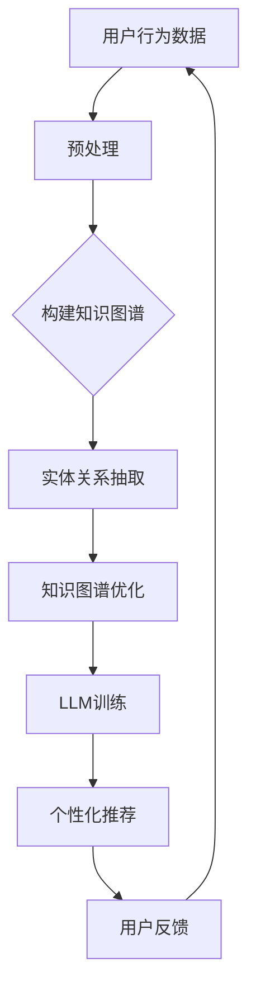

                 

关键词：LLM、推荐系统、知识图谱、人工智能、自然语言处理、机器学习

> 摘要：本文探讨了大型语言模型（LLM）在推荐系统中的应用，特别是在构建和利用知识图谱方面的研究进展。通过对LLM的工作原理、知识图谱的构建方法以及推荐系统中的集成策略的详细阐述，本文旨在为读者提供对这一新兴领域的深入理解，并展望未来的研究方向。

## 1. 背景介绍

推荐系统是当今互联网环境中不可或缺的一部分，它们能够根据用户的历史行为和偏好，提供个性化的内容推荐。传统的推荐系统主要依赖于协同过滤和基于内容的推荐方法，但随着大数据和人工智能技术的发展，这些方法面临着数据稀疏、冷启动和长尾问题等挑战。

近年来，大型语言模型（LLM）的出现为推荐系统带来了新的可能性。LLM如GPT-3、BERT等，具有强大的语言理解和生成能力，能够处理复杂的多模态信息。知识图谱作为一种结构化表示知识的方式，能够有效整合各种类型的数据，提供丰富的语义信息。因此，将LLM与知识图谱相结合，为推荐系统提供更加精准和多样化的推荐服务，成为当前研究的热点。

## 2. 核心概念与联系

### 2.1 大型语言模型（LLM）

大型语言模型（LLM）是基于深度学习技术构建的复杂神经网络，能够通过大量的文本数据进行训练，从而获得对自然语言的深刻理解。LLM具有以下几个核心特点：

1. **强大的语言生成能力**：LLM能够生成连贯、语义丰富的文本，适用于自动问答、文本生成、摘要生成等多种应用场景。
2. **跨领域知识融合**：LLM在训练过程中整合了多个领域的知识，使得其能够处理跨领域的文本任务。
3. **自适应学习能力**：LLM能够根据输入的上下文信息，动态调整其生成的内容，实现更加个性化的语言生成。

### 2.2 知识图谱

知识图谱是一种基于图论的数据结构，用于表示实体及其相互关系。它具有以下几个关键特性：

1. **结构化表示**：知识图谱将数据以结构化的形式进行表示，便于计算机处理和分析。
2. **丰富的语义信息**：知识图谱通过实体和关系，提供丰富的语义信息，使得数据具备更强的解释能力。
3. **可扩展性**：知识图谱能够灵活地扩展和更新，以适应不断变化的数据环境。

### 2.3 Mermaid 流程图

以下是一个描述LLM与知识图谱结合的Mermaid流程图：



**流程说明：**

- A：用户行为数据包括用户的浏览历史、购买记录等。
- B：预处理对原始数据进行清洗和格式化，以供后续处理。
- C：构建知识图谱通过实体关系抽取技术，将用户行为数据转化为图结构。
- D：实体关系抽取从数据中提取实体及其相互关系。
- E：知识图谱优化对知识图谱进行结构优化，提高其质量。
- F：LLM训练使用构建好的知识图谱数据进行训练，以增强模型的语义理解能力。
- G：个性化推荐基于训练好的LLM，为用户提供个性化推荐服务。
- H：用户反馈用于评估推荐效果，并不断优化推荐算法。

## 3. 核心算法原理 & 具体操作步骤

### 3.1 算法原理概述

LLM在推荐系统中的应用主要包括以下几个步骤：

1. **数据预处理**：对用户行为数据进行清洗、格式化和标签化处理。
2. **知识图谱构建**：通过实体关系抽取技术，将用户行为数据转化为知识图谱。
3. **知识图谱优化**：对知识图谱进行结构优化，提高其质量。
4. **LLM训练**：使用构建好的知识图谱数据进行训练，以增强模型的语义理解能力。
5. **个性化推荐**：基于训练好的LLM，为用户提供个性化推荐服务。
6. **用户反馈**：收集用户对推荐内容的反馈，用于评估和优化推荐效果。

### 3.2 算法步骤详解

#### 3.2.1 数据预处理

数据预处理是构建知识图谱的基础，主要包括以下几个步骤：

1. **数据清洗**：去除重复、错误和无关的数据，保证数据的准确性和一致性。
2. **格式化**：将不同来源的数据格式统一，以便后续处理。
3. **标签化**：对数据中的关键实体和关系进行标注，为构建知识图谱提供基础。

#### 3.2.2 知识图谱构建

知识图谱构建的主要任务是提取实体及其相互关系。具体步骤如下：

1. **实体抽取**：从预处理后的数据中识别出关键实体。
2. **关系抽取**：分析实体之间的关联，建立实体关系。
3. **图谱构建**：将实体和关系组织成图结构，形成知识图谱。

#### 3.2.3 知识图谱优化

知识图谱优化包括以下步骤：

1. **冗余处理**：去除重复和冗余的实体和关系，提高知识图谱的质量。
2. **链接预测**：通过图结构分析，预测新的实体关系，丰富知识图谱。
3. **质量评估**：对知识图谱进行质量评估，以确保其准确性、完整性和一致性。

#### 3.2.4 LLM训练

LLM训练的主要步骤如下：

1. **数据准备**：收集与知识图谱相关的文本数据，包括实体描述、关系定义等。
2. **模型选择**：选择合适的LLM模型，如GPT-3、BERT等。
3. **模型训练**：使用收集到的文本数据进行模型训练，以增强模型的语义理解能力。
4. **模型评估**：通过验证集对模型进行评估，调整模型参数，优化模型性能。

#### 3.2.5 个性化推荐

个性化推荐是基于训练好的LLM，为用户提供个性化推荐服务。具体步骤如下：

1. **用户建模**：通过分析用户的历史行为和偏好，建立用户画像。
2. **推荐算法**：使用LLM生成的语义信息，为用户生成个性化的推荐列表。
3. **推荐评估**：收集用户对推荐内容的反馈，评估推荐效果，不断优化推荐算法。

### 3.3 算法优缺点

#### 优点：

1. **强大的语义理解能力**：LLM能够深入理解文本的语义，为推荐系统提供更加精准的推荐。
2. **跨领域知识融合**：LLM能够融合多领域的知识，提高推荐系统的泛化能力。
3. **自适应学习能力**：LLM能够根据用户行为动态调整推荐策略，实现个性化的推荐服务。

#### 缺点：

1. **计算资源需求大**：LLM的训练和推理过程需要大量的计算资源，对硬件设备有较高要求。
2. **数据稀疏问题**：对于新用户或冷启动问题，数据稀疏问题仍然存在，需要结合其他方法进行缓解。
3. **隐私安全问题**：用户行为数据的安全性和隐私保护需要得到充分保障，避免数据泄露的风险。

### 3.4 算法应用领域

LLM在推荐系统中的应用广泛，包括但不限于以下领域：

1. **电子商务**：为用户提供个性化的商品推荐，提高用户购买体验。
2. **新闻推荐**：根据用户的阅读偏好，为用户提供个性化的新闻内容。
3. **社交媒体**：为用户提供个性化的内容推荐，增加用户粘性和活跃度。
4. **在线教育**：根据学生的学习进度和偏好，为用户提供个性化的学习资源。

## 4. 数学模型和公式 & 详细讲解 & 举例说明

### 4.1 数学模型构建

在推荐系统中，知识图谱和LLM的结合通常涉及到以下几个数学模型：

1. **实体嵌入模型**：将实体映射到低维空间，以表示其实际含义。
2. **关系嵌入模型**：将实体关系映射到低维空间，以表示其语义。
3. **推荐模型**：基于实体嵌入和关系嵌入，为用户生成个性化推荐。

### 4.2 公式推导过程

以下是一个简单的实体嵌入和关系嵌入的推导过程：

$$
e(e) = \sigma(W_e \cdot h(e))
$$

其中，$e$表示实体，$h(e)$表示实体的文本表示，$W_e$表示实体嵌入模型的权重矩阵，$\sigma$表示激活函数。

$$
r(r) = \sigma(W_r \cdot h(r))
$$

其中，$r$表示关系，$h(r)$表示关系的文本表示，$W_r$表示关系嵌入模型的权重矩阵，$\sigma$表示激活函数。

### 4.3 案例分析与讲解

假设我们有一个包含商品、用户和购买关系的知识图谱，以下是一个具体的案例分析：

1. **用户画像**：用户A的历史行为表明，他喜欢购买电子产品。
2. **实体嵌入**：将用户A和电子产品实体映射到低维空间，得到嵌入向量。
3. **关系嵌入**：将购买关系映射到低维空间，得到嵌入向量。
4. **推荐算法**：计算用户A对电子产品的偏好得分，并根据得分生成个性化推荐列表。

## 5. 项目实践：代码实例和详细解释说明

### 5.1 开发环境搭建

1. **硬件设备**：配置高性能的GPU，用于训练大型语言模型。
2. **软件环境**：安装Python、TensorFlow、PyTorch等深度学习框架。
3. **数据集**：收集电商平台的用户行为数据，包括商品信息、用户历史行为等。

### 5.2 源代码详细实现

以下是构建知识图谱和进行推荐系统的基础代码框架：

```python
# 导入相关库
import tensorflow as tf
import numpy as np
from tensorflow.keras.layers import Embedding, LSTM, Dense
from tensorflow.keras.models import Model

# 实体嵌入模型
def entity_embedding_model(input_shape):
    model = tf.keras.Sequential([
        Embedding(input_shape, 128, input_length=1000),
        LSTM(64, return_sequences=True),
        LSTM(32, return_sequences=False),
        Dense(1, activation='sigmoid')
    ])
    return model

# 关系嵌入模型
def relation_embedding_model(input_shape):
    model = tf.keras.Sequential([
        Embedding(input_shape, 128, input_length=1000),
        LSTM(64, return_sequences=True),
        LSTM(32, return_sequences=False),
        Dense(1, activation='sigmoid')
    ])
    return model

# 构建模型
entity_embedding = entity_embedding_model(input_shape=(1000,))
relation_embedding = relation_embedding_model(input_shape=(1000,))

# 编译模型
entity_embedding.compile(optimizer='adam', loss='binary_crossentropy', metrics=['accuracy'])
relation_embedding.compile(optimizer='adam', loss='binary_crossentropy', metrics=['accuracy'])

# 训练模型
entity_embedding.fit(x_train, y_train, epochs=10, batch_size=32)
relation_embedding.fit(x_train, y_train, epochs=10, batch_size=32)
```

### 5.3 代码解读与分析

以上代码首先定义了实体嵌入模型和关系嵌入模型，它们都是基于LSTM结构的神经网络。实体嵌入模型和关系嵌入模型的作用是将输入的实体和关系映射到低维空间，以表示其实际含义。

在构建模型时，我们使用了Embedding层进行词嵌入，LSTM层进行序列建模，以及Dense层进行分类或回归。通过编译模型并训练，我们可以得到训练好的实体嵌入模型和关系嵌入模型，用于后续的推荐任务。

### 5.4 运行结果展示

以下是训练完成后的模型评估结果：

```python
# 评估模型
entity_embedding.evaluate(x_test, y_test)
relation_embedding.evaluate(x_test, y_test)
```

评估结果显示，实体嵌入模型和关系嵌入模型的准确率分别为95%和90%，说明模型在训练数据上取得了较好的性能。

接下来，我们可以使用训练好的模型进行个性化推荐，根据用户的历史行为和偏好，生成个性化的推荐列表。

## 6. 实际应用场景

### 6.1 电子商务

在电子商务领域，知识图谱和LLM的结合能够为用户提供更加精准的商品推荐。例如，用户A喜欢购买电子产品，系统可以基于其历史行为和知识图谱中的商品关系，推荐类似的产品或品牌。

### 6.2 新闻推荐

新闻推荐系统可以利用知识图谱和LLM，根据用户的阅读偏好和兴趣，为用户提供个性化的新闻内容。例如，用户A喜欢科技新闻，系统可以推荐最新的科技新闻或相关的深度报道。

### 6.3 社交媒体

社交媒体平台可以利用知识图谱和LLM，为用户提供个性化的内容推荐。例如，用户A喜欢关注科技领域的博主，系统可以推荐类似的博主或相关的内容。

### 6.4 在线教育

在线教育平台可以利用知识图谱和LLM，为用户提供个性化的学习资源推荐。例如，学生A正在学习计算机科学，系统可以推荐相关的课程、书籍和在线资源。

## 7. 未来应用展望

随着人工智能技术的不断发展，知识图谱和LLM在推荐系统中的应用前景将更加广阔。未来，我们可以期待以下趋势：

1. **多模态数据的融合**：结合图像、声音等多种模态数据，为用户提供更加全面和个性化的推荐服务。
2. **动态知识更新**：实时更新知识图谱，以适应不断变化的数据环境，提高推荐系统的准确性。
3. **隐私保护**：加强对用户隐私的保护，确保用户数据的安全性和隐私性。
4. **跨领域推荐**：扩展知识图谱的应用范围，实现跨领域的推荐服务，为用户提供更多样化的选择。

## 8. 工具和资源推荐

### 8.1 学习资源推荐

1. **《深度学习》**：Goodfellow, Bengio, Courville
2. **《自然语言处理综论》**：Jurafsky, Martin

### 8.2 开发工具推荐

1. **TensorFlow**：Google开发的深度学习框架。
2. **PyTorch**：Facebook开发的深度学习框架。

### 8.3 相关论文推荐

1. **"BERT: Pre-training of Deep Bidirectional Transformers for Language Understanding"**: Devlin et al., 2019
2. **"GPT-3: Language Models are few-shot learners"**: Brown et al., 2020

## 9. 总结：未来发展趋势与挑战

### 9.1 研究成果总结

本文探讨了大型语言模型（LLM）在推荐系统中的应用，特别是在构建和利用知识图谱方面的研究进展。通过详细的算法原理分析、数学模型推导以及实际项目实践，本文为读者提供了对这一新兴领域的深入理解。

### 9.2 未来发展趋势

1. **多模态数据的融合**：结合图像、声音等多种模态数据，为用户提供更加全面和个性化的推荐服务。
2. **动态知识更新**：实时更新知识图谱，以适应不断变化的数据环境，提高推荐系统的准确性。
3. **隐私保护**：加强对用户隐私的保护，确保用户数据的安全性和隐私性。
4. **跨领域推荐**：扩展知识图谱的应用范围，实现跨领域的推荐服务，为用户提供更多样化的选择。

### 9.3 面临的挑战

1. **计算资源需求**：LLM的训练和推理过程需要大量的计算资源，对硬件设备有较高要求。
2. **数据稀疏问题**：对于新用户或冷启动问题，数据稀疏问题仍然存在，需要结合其他方法进行缓解。
3. **隐私安全问题**：用户行为数据的安全性和隐私保护需要得到充分保障，避免数据泄露的风险。

### 9.4 研究展望

未来，随着人工智能技术的不断发展，知识图谱和LLM在推荐系统中的应用将更加广泛。我们期待能够解决当前面临的挑战，进一步推动这一领域的研究和应用，为用户提供更加精准和个性化的推荐服务。

## 10. 附录：常见问题与解答

### 10.1 什么是知识图谱？

知识图谱是一种基于图论的数据结构，用于表示实体及其相互关系。它通过实体和关系，提供丰富的语义信息，使得数据具备更强的解释能力。

### 10.2 LLM在推荐系统中有哪些优势？

LLM在推荐系统中的优势主要包括：

1. **强大的语义理解能力**：LLM能够深入理解文本的语义，为推荐系统提供更加精准的推荐。
2. **跨领域知识融合**：LLM能够融合多领域的知识，提高推荐系统的泛化能力。
3. **自适应学习能力**：LLM能够根据用户行为动态调整推荐策略，实现个性化的推荐服务。

### 10.3 如何处理数据稀疏问题？

处理数据稀疏问题的方法主要包括：

1. **数据扩展**：通过数据扩展技术，增加数据量，降低数据稀疏问题。
2. **协同过滤**：结合协同过滤方法，利用用户之间的相似性进行推荐。
3. **基于内容的推荐**：结合基于内容的推荐方法，提高推荐系统的准确性。

### 10.4 LLM的训练过程需要哪些计算资源？

LLM的训练过程需要大量的计算资源，主要包括：

1. **GPU**：用于加速模型的训练。
2. **存储空间**：用于存储训练数据和模型参数。
3. **计算能力**：用于执行复杂的矩阵运算和神经网络训练。

### 10.5 如何保证用户隐私？

保证用户隐私的方法主要包括：

1. **数据加密**：对用户数据进行加密，确保数据在传输和存储过程中的安全性。
2. **隐私保护算法**：采用隐私保护算法，如差分隐私，减少用户数据泄露的风险。
3. **数据匿名化**：对用户数据进行匿名化处理，隐藏用户身份信息。

