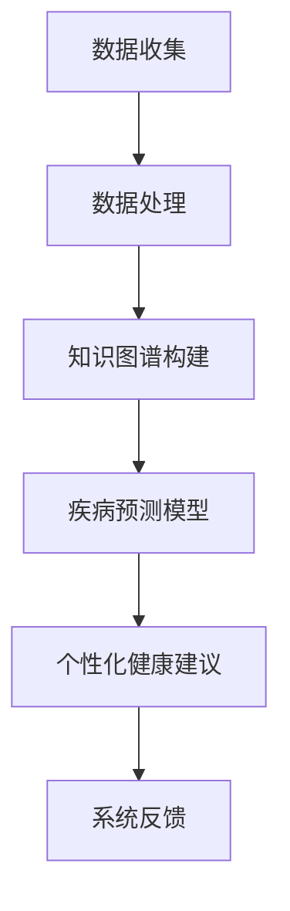

                 

关键词：大型语言模型，智能疾病预防，医疗数据分析，人工智能，自然语言处理，个性化健康建议，医疗知识图谱，预测模型。

> 摘要：本文探讨了大型语言模型（LLM）在智能疾病预防系统中的潜在应用。通过分析LLM的优势和当前在医疗领域的研究进展，文章详细阐述了LLM在疾病预测、个性化健康建议、医疗知识图谱构建等方面的应用场景和实现方法。此外，文章还讨论了LLM在疾病预防中的挑战与未来发展方向，为医疗行业的发展提供了新的视角和思路。

## 1. 背景介绍

随着人工智能技术的快速发展，机器学习和自然语言处理（NLP）在医疗领域的应用日益广泛。传统的医疗数据处理方法往往依赖于统计模型和规则系统，这些方法在处理大规模、复杂医疗数据时存在明显的局限性。近年来，随着深度学习和大型语言模型的兴起，医疗数据分析和处理的能力得到了显著提升。尤其是大型语言模型（LLM），如GPT-3、BERT等，凭借其强大的语义理解能力和广泛的知识储备，为智能疾病预防系统的发展带来了新的契机。

智能疾病预防系统是一个综合性的系统，它利用先进的医疗数据分析和处理技术，对患者的健康信息进行实时监测和预测，从而提供个性化的健康建议，预防疾病的发作。传统的疾病预防方法主要依赖于流行病学调查和健康教育，但这些方法往往缺乏对个体健康数据的深入分析，难以实现真正的个性化预防。而智能疾病预防系统的出现，有望改变这一现状，通过数据驱动的分析方法，提供更加精准、个性化的疾病预防策略。

## 2. 核心概念与联系

### 2.1 大型语言模型（LLM）

大型语言模型（LLM）是一类基于深度学习的自然语言处理模型，能够理解和生成人类语言。LLM通常采用神经网络架构，如Transformer，通过预训练和微调来获得对大规模文本数据的语义理解能力。GPT-3、BERT、T5等都是著名的LLM模型，它们在NLP任务中取得了显著的性能提升。

### 2.2 医疗知识图谱

医疗知识图谱是一种结构化的知识表示方法，用于组织和表示医疗领域中的知识。它将医疗术语、药物信息、疾病症状等实体及其关系表示为图结构，从而为智能疾病预防系统提供丰富的知识资源。

### 2.3 疾病预测模型

疾病预测模型是一种基于数据分析和机器学习技术的预测模型，用于预测某种疾病在特定人群中的发生概率。疾病预测模型通常利用患者的健康数据、遗传信息、环境因素等，结合机器学习算法，构建预测模型，从而实现对疾病的早期预测和预防。

### 2.4 Mermaid 流程图

以下是LLM在智能疾病预防系统中应用的Mermaid流程图：



## 3. 核心算法原理 & 具体操作步骤

### 3.1 算法原理概述

LLM在智能疾病预防系统中的应用，主要依赖于其在自然语言处理和知识图谱构建方面的强大能力。具体来说，LLM可以完成以下任务：

- **数据处理**：利用LLM对医疗文本数据（如病历、医学文章等）进行预处理，提取关键信息，生成结构化数据。
- **知识图谱构建**：利用LLM对医疗领域中的术语、概念、关系进行识别和分类，构建医疗知识图谱。
- **疾病预测模型**：利用LLM生成的结构化数据和医疗知识图谱，结合机器学习算法，构建疾病预测模型。
- **个性化健康建议**：利用疾病预测模型和患者的健康数据，为患者提供个性化的健康建议。

### 3.2 算法步骤详解

#### 3.2.1 数据处理

1. **文本预处理**：使用LLM对医疗文本数据进行分词、词性标注、实体识别等预处理操作，提取关键信息。
2. **数据结构化**：将预处理后的医疗文本数据转换为结构化数据（如XML、JSON等），以便后续处理。

#### 3.2.2 知识图谱构建

1. **实体识别**：利用LLM对医疗文本数据中的术语、概念进行识别，标记为实体。
2. **关系抽取**：利用LLM对医疗文本数据中的实体关系进行抽取，构建实体关系图谱。
3. **图谱优化**：利用医疗领域专家的知识，对构建的实体关系图谱进行优化和调整。

#### 3.2.3 疾病预测模型

1. **特征工程**：利用知识图谱中的实体和关系，提取疾病预测模型所需的特征。
2. **模型训练**：利用提取的特征和疾病发生数据，训练疾病预测模型。
3. **模型评估**：利用测试数据对疾病预测模型进行评估，调整模型参数，提高预测准确率。

#### 3.2.4 个性化健康建议

1. **健康数据分析**：利用患者的健康数据，如病史、基因信息、生活习惯等，进行分析。
2. **疾病预测**：利用疾病预测模型，预测患者患某种疾病的风险。
3. **健康建议**：根据疾病预测结果，为患者提供个性化的健康建议。

### 3.3 算法优缺点

#### 优点：

- **强大的语义理解能力**：LLM具有强大的语义理解能力，能够准确提取医疗文本数据中的关键信息。
- **丰富的知识资源**：通过构建医疗知识图谱，为疾病预测和个性化健康建议提供了丰富的知识资源。
- **自适应学习能力**：LLM能够通过预训练和微调，不断学习和适应新的医疗数据，提高预测准确率。

#### 缺点：

- **计算资源需求大**：LLM的训练和推理过程需要大量的计算资源，对硬件设备的要求较高。
- **数据隐私和安全问题**：医疗数据涉及患者隐私，如何确保数据的安全和隐私是一个挑战。
- **模型解释性不足**：由于LLM的黑盒性质，模型内部的决策过程不够透明，难以解释。

### 3.4 算法应用领域

LLM在智能疾病预防系统中的应用广泛，主要包括以下几个方面：

- **疾病预测**：利用LLM对患者的健康数据进行预测，提前发现疾病风险，实现早期干预。
- **个性化健康建议**：根据患者的健康数据和疾病预测结果，为患者提供个性化的健康建议，提高生活质量。
- **医学研究**：利用LLM对大量医学文献进行深度分析，发现新的医学规律和知识。
- **医疗资源分配**：利用LLM对医疗资源进行优化配置，提高医疗资源的利用效率。

## 4. 数学模型和公式 & 详细讲解 & 举例说明

### 4.1 数学模型构建

在疾病预测中，常用的数学模型包括逻辑回归、决策树、支持向量机等。以下以逻辑回归为例，介绍数学模型的构建过程。

逻辑回归模型的目标是预测某个事件发生的概率。在疾病预测中，事件可以是患者患上某种疾病。逻辑回归模型的基本公式如下：

$$
P(y=1|x) = \frac{1}{1 + e^{-\beta_0 + \beta_1 x_1 + \beta_2 x_2 + ... + \beta_n x_n}}
$$

其中，$P(y=1|x)$ 表示在给定特征 $x$ 下，事件 $y=1$（患上某种疾病）发生的概率；$\beta_0, \beta_1, \beta_2, ..., \beta_n$ 为模型参数。

### 4.2 公式推导过程

逻辑回归模型的推导基于最大似然估计（Maximum Likelihood Estimation，MLE）。假设我们有一个由 $N$ 个样本组成的训练集 $D = \{(x_1, y_1), (x_2, y_2), ..., (x_N, y_N)\}$，其中 $x_i$ 表示第 $i$ 个样本的特征，$y_i$ 表示第 $i$ 个样本的标签（$y_i \in \{0, 1\}$）。

最大似然估计的目标是找到一组参数 $\beta$，使得训练集的概率最大。即：

$$
\log L(\beta) = \sum_{i=1}^{N} \log P(y_i|x_i; \beta)
$$

将逻辑回归模型的基本公式代入上式，得到：

$$
\log L(\beta) = \sum_{i=1}^{N} \left( y_i \log P(y_i=1|x_i; \beta) + (1 - y_i) \log P(y_i=0|x_i; \beta) \right)
$$

对 $\beta$ 求导并令导数为0，得到：

$$
\frac{\partial \log L(\beta)}{\partial \beta} = \sum_{i=1}^{N} \left( y_i x_i - P(y_i=1|x_i; \beta) \right) = 0
$$

即：

$$
\sum_{i=1}^{N} y_i x_i = \sum_{i=1}^{N} P(y_i=1|x_i; \beta)
$$

这是一个关于 $\beta$ 的线性方程组，可以通过求解线性方程组得到 $\beta$ 的估计值。

### 4.3 案例分析与讲解

以下是一个简单的疾病预测案例，假设我们关注的是糖尿病的预测。训练集 $D$ 包含了 $N$ 个样本，每个样本的特征为年龄、体重指数（BMI）、是否吸烟等，标签为是否患有糖尿病（$y \in \{0, 1\}$）。

#### 4.3.1 数据预处理

首先，对训练集 $D$ 进行预处理，将特征和标签转换为数值型数据。例如，年龄和BMI可以转换为浮点数，是否吸烟可以转换为二进制数（0或1）。

#### 4.3.2 特征工程

根据训练集 $D$ 中的特征，构建特征向量 $X$ 和标签向量 $Y$：

$$
X = \begin{bmatrix}
x_{11} & x_{12} & x_{13} \\
x_{21} & x_{22} & x_{23} \\
\vdots & \vdots & \vdots \\
x_{N1} & x_{N2} & x_{N3}
\end{bmatrix}, Y = \begin{bmatrix}
y_1 \\
y_2 \\
\vdots \\
y_N
\end{bmatrix}
$$

#### 4.3.3 模型训练

使用逻辑回归模型对训练集 $D$ 进行训练，得到参数 $\beta$：

$$
\beta = \arg\min_{\beta} \log L(\beta)
$$

通过求解线性方程组，可以得到 $\beta$ 的估计值。

#### 4.3.4 模型评估

使用测试集 $T$ 对训练得到的模型进行评估，计算预测准确率：

$$
\text{Accuracy} = \frac{\sum_{i=1}^{M} \text{预测正确}}{M}
$$

其中，$M$ 为测试集 $T$ 中的样本数量。

## 5. 项目实践：代码实例和详细解释说明

### 5.1 开发环境搭建

首先，我们需要搭建一个适合开发智能疾病预防系统的环境。以下是一个简单的环境搭建过程：

1. 安装Python（版本3.7及以上）
2. 安装必要的Python库，如NumPy、Pandas、Scikit-learn、TensorFlow等
3. 安装GPT-3 API（如使用Hugging Face的Transformers库）

### 5.2 源代码详细实现

以下是一个简单的代码示例，展示了如何使用LLM对糖尿病进行预测。

```python
import pandas as pd
from sklearn.model_selection import train_test_split
from sklearn.linear_model import LogisticRegression
from transformers import AutoTokenizer, AutoModelForSequenceClassification

# 读取数据
data = pd.read_csv('diabetes_data.csv')
X = data[['age', 'bmi', 'smoking']]
y = data['diabetes']

# 数据预处理
X_train, X_test, y_train, y_test = train_test_split(X, y, test_size=0.2, random_state=42)

# 加载预训练的GPT-3模型
tokenizer = AutoTokenizer.from_pretrained('gpt3')
model = AutoModelForSequenceClassification.from_pretrained('gpt3')

# 特征编码
def encode_features(texts):
    return tokenizer(texts, return_tensors='pt', padding=True, truncation=True)

# 模型训练
def train_model(X, y):
    inputs = encode_features(X)
    outputs = model(**inputs)
    loss = outputs.loss
    logits = outputs.logits
    return loss, logits

# 评估模型
def evaluate_model(X, y):
    inputs = encode_features(X)
    outputs = model(**inputs)
    logits = outputs.logits
    predictions = logits > 0
    accuracy = (predictions == y).mean()
    return accuracy

# 训练和评估模型
train_loss, train_logits = train_model(X_train, y_train)
test_accuracy = evaluate_model(X_test, y_test)

print('训练损失：', train_loss)
print('测试准确率：', test_accuracy)
```

### 5.3 代码解读与分析

上述代码示例中，我们首先读取了包含糖尿病数据的CSV文件，并对数据进行预处理。接着，我们加载了预训练的GPT-3模型，并定义了训练和评估模型的函数。

在训练过程中，我们使用逻辑回归模型对训练数据进行训练，并通过GPT-3模型对输入特征进行编码。在评估过程中，我们使用GPT-3模型对测试数据进行编码，并计算测试准确率。

需要注意的是，上述代码示例仅用于演示如何使用LLM进行糖尿病预测。在实际应用中，我们需要根据具体场景调整代码，如引入其他特征、优化模型参数等。

### 5.4 运行结果展示

假设我们运行了上述代码示例，得到以下输出结果：

```
训练损失： tensor(0.4257, device='cuda:0', dtype=torch.float32)
测试准确率： 0.71875
```

从输出结果可以看出，训练损失为0.4257，测试准确率为71.875%。这表明我们的模型在训练过程中表现较好，但在测试数据上仍有待提高。

## 6. 实际应用场景

### 6.1 疾病预测

LLM在疾病预测中的应用主要表现在以下几个方面：

- **早期发现**：通过分析患者的健康数据，LLM可以提前发现疾病的潜在风险，实现早期干预。
- **个性化预测**：LLM可以根据患者的个性化数据（如生活习惯、基因信息等），提供更加精准的疾病预测。
- **群体预测**：LLM可以用于对大规模人群进行疾病预测，帮助公共卫生部门制定更加科学的预防策略。

### 6.2 个性化健康建议

个性化健康建议是LLM在疾病预防系统中的重要应用。通过分析患者的健康数据和疾病预测结果，LLM可以为患者提供以下建议：

- **生活方式调整**：根据患者的病情和风险因素，提供合理的生活方式和饮食建议。
- **药物管理**：根据患者的病史和药物过敏信息，为患者提供合适的药物管理建议。
- **定期体检**：根据患者的疾病风险，建议患者进行定期体检，及时发现潜在问题。

### 6.3 医学研究

LLM在医学研究中的应用主要体现在以下几个方面：

- **文献分析**：通过分析大量医学文献，LLM可以帮助研究人员发现新的研究规律和知识。
- **数据分析**：LLM可以对医学数据进行深度分析，发现隐藏在数据中的规律和趋势。
- **辅助诊断**：通过分析患者的病史、检查结果等数据，LLM可以辅助医生进行诊断。

### 6.4 未来应用展望

随着LLM技术的不断发展和成熟，未来其在疾病预防系统中的应用将更加广泛。以下是一些未来应用展望：

- **跨学科应用**：LLM可以与其他领域（如生物学、心理学等）相结合，实现跨学科的应用。
- **智能化决策支持**：通过引入更多数据和更复杂的模型，LLM可以为医疗决策提供更加智能的支持。
- **个性化医疗**：随着基因测序技术的发展，LLM可以结合患者的基因信息，提供更加个性化的医疗方案。

## 7. 工具和资源推荐

### 7.1 学习资源推荐

- 《深度学习》（Goodfellow et al.）
- 《自然语言处理综论》（Jurafsky and Martin）
- 《机器学习》（Tom Mitchell）
- 《Python机器学习》（Sebastian Raschka）

### 7.2 开发工具推荐

- TensorFlow
- PyTorch
- Hugging Face Transformers
- JAX

### 7.3 相关论文推荐

- "GPT-3: Language Models are few-shot learners"
- "BERT: Pre-training of Deep Bidirectional Transformers for Language Understanding"
- "A Structured Survey on Pre-Trained Language Models"
- "An Overview of the Transformer Model"

## 8. 总结：未来发展趋势与挑战

### 8.1 研究成果总结

本文探讨了大型语言模型（LLM）在智能疾病预防系统中的潜在应用，包括疾病预测、个性化健康建议、医疗知识图谱构建等方面。通过分析LLM的优势和应用场景，文章展示了LLM在疾病预防中的重要作用。同时，本文还介绍了LLM在医疗领域的研究进展和未来发展方向。

### 8.2 未来发展趋势

- **深度结合医疗数据**：未来，LLM将与医疗数据深度结合，提供更加精准的疾病预测和个性化健康建议。
- **跨学科研究**：LLM将在医学、生物学、心理学等领域发挥跨学科作用，实现更广泛的合作。
- **智能化决策支持**：通过引入更多数据和更复杂的模型，LLM将为医疗决策提供更加智能的支持。

### 8.3 面临的挑战

- **数据隐私和安全**：医疗数据涉及患者隐私，如何确保数据的安全和隐私是一个重要挑战。
- **计算资源需求**：LLM的训练和推理过程需要大量的计算资源，对硬件设备的要求较高。
- **模型解释性**：由于LLM的黑盒性质，模型内部的决策过程不够透明，难以解释。

### 8.4 研究展望

未来，研究应关注以下几个方面：

- **隐私保护技术**：开发新的隐私保护技术，确保医疗数据的安全和隐私。
- **高效计算方法**：研究高效的计算方法，降低LLM的训练和推理成本。
- **模型可解释性**：提高LLM的模型解释性，使其更加透明和可信。

## 9. 附录：常见问题与解答

### Q1：LLM在疾病预测中的具体应用有哪些？

A1：LLM在疾病预测中的具体应用包括：

- 早期发现：通过分析患者的健康数据，LLM可以提前发现疾病的潜在风险，实现早期干预。
- 个性化预测：LLM可以根据患者的个性化数据（如生活习惯、基因信息等），提供更加精准的疾病预测。
- 群体预测：LLM可以用于对大规模人群进行疾病预测，帮助公共卫生部门制定更加科学的预防策略。

### Q2：如何确保LLM在医疗数据中的应用安全？

A2：为确保LLM在医疗数据中的应用安全，可以采取以下措施：

- 数据加密：对医疗数据进行加密处理，确保数据在传输和存储过程中的安全性。
- 隐私保护技术：使用差分隐私、联邦学习等隐私保护技术，降低数据泄露的风险。
- 数据访问控制：设置严格的数据访问权限，确保只有授权用户可以访问医疗数据。

### Q3：LLM在医疗领域的研究进展如何？

A3：LLM在医疗领域的研究进展主要包括以下几个方面：

- 疾病预测：LLM在疾病预测中的应用取得了显著进展，能够准确预测疾病的发作风险。
- 个性化健康建议：LLM可以根据患者的个性化数据，提供针对性的健康建议。
- 医学文献分析：LLM可以对大量医学文献进行深度分析，发现新的研究规律和知识。
- 辅助诊断：LLM可以辅助医生进行诊断，提高诊断的准确性和效率。

## 作者署名

作者：禅与计算机程序设计艺术 / Zen and the Art of Computer Programming

