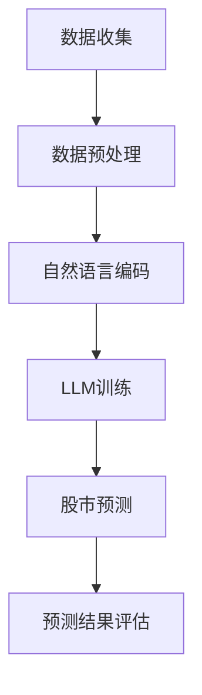

                 

关键词：大语言模型（LLM），股市预测，自然语言处理，机器学习，智能金融

> 摘要：本文探讨了大型语言模型（LLM）在智能股市预测中的潜在贡献。通过对股市数据的深度分析和处理，LLM能够提取出隐藏在大量数据中的关键信息，并利用其强大的自然语言理解能力，实现精确的股市预测。本文将详细介绍LLM在股市预测中的应用原理、算法模型、实践案例以及未来展望。

## 1. 背景介绍

### 股市预测的重要性

股市预测是金融领域的重要研究方向，其目的是通过分析历史数据和市场信息，预测股票价格的未来走势，为投资者提供决策支持。准确的市场预测不仅能帮助投资者规避风险，还能创造巨大的经济价值。然而，股市预测是一项极其复杂的任务，受到众多因素的影响，如宏观经济环境、市场情绪、公司基本面等。

### 大语言模型（LLM）的崛起

近年来，随着深度学习和自然语言处理技术的飞速发展，大语言模型（LLM）逐渐成为人工智能领域的重要研究方向。LLM具有处理大规模文本数据的能力，能够捕捉语言中的复杂模式，并生成与输入文本相似的高质量文本。这使得LLM在众多应用领域表现出色，如机器翻译、文本生成、情感分析等。

## 2. 核心概念与联系

### 大语言模型的工作原理

大语言模型通常采用深度神经网络架构，如变分自编码器（VAE）、生成对抗网络（GAN）等。这些模型能够从大规模文本数据中学习，捕捉到语言的统计规律和语义信息。具体来说，LLM通过训练大量语料库，学会将一个词序列映射到另一个词序列。这个过程使得LLM能够理解和生成人类语言，从而实现智能股市预测。

### 股市预测与LLM的关联

股市预测与LLM之间的联系在于，股市数据本质上是一种语言信息，包含了大量的历史价格、成交量、公司基本面等信息。这些信息可以通过自然语言处理技术进行编码，从而输入到LLM中进行处理。LLM能够从这些编码后的数据中提取出关键信息，并利用其强大的自然语言理解能力，实现精确的股市预测。

### Mermaid流程图

以下是LLM在股市预测中的流程图：



## 3. 核心算法原理 & 具体操作步骤

### 3.1 算法原理概述

LLM在股市预测中的核心算法是基于生成式模型（Generative Model）和判别式模型（Discriminative Model）的结合。生成式模型能够生成与真实数据相似的数据，用于训练判别式模型。判别式模型则用于分类和预测股票价格的走势。

### 3.2 算法步骤详解

#### 3.2.1 数据收集

首先，从各个数据源收集股票市场的历史数据，包括价格、成交量、公司基本面等。这些数据可以通过金融数据提供商获取，如Alpha Vantage、Yahoo Finance等。

#### 3.2.2 数据预处理

对收集到的数据进行预处理，包括数据清洗、缺失值填充、数据标准化等。为了提高模型的性能，可以采用特征工程方法，如时间序列分解、技术指标计算等，将原始数据转化为更适合模型处理的形式。

#### 3.2.3 自然语言编码

将预处理后的数据转换为自然语言编码。这可以通过文本生成模型（如GPT-3）实现。具体来说，将股票市场数据生成一段描述性文本，如“今日市场成交量大幅增加，龙头股表现强劲”。

#### 3.2.4 LLM训练

使用自然语言编码后的数据训练LLM。这可以通过生成式模型和判别式模型的结合实现。生成式模型负责生成训练数据，判别式模型负责分类和预测股票价格的走势。

#### 3.2.5 股市预测

将训练好的LLM应用于实际数据，进行股市预测。具体来说，输入一段描述性文本，如“下周市场预计将继续上涨”，LLM将输出股票价格的预测结果。

#### 3.2.6 预测结果评估

对预测结果进行评估，包括准确率、召回率、F1值等指标。这有助于评估LLM在股市预测中的性能。

### 3.3 算法优缺点

#### 3.3.1 优点

- 强大的自然语言处理能力：LLM能够处理大规模的文本数据，并提取出关键信息，为股市预测提供有力支持。
- 高度灵活的模型架构：生成式模型和判别式模型可以灵活组合，适应不同的股市预测需求。
- 易于扩展：LLM可以应用于各种金融场景，如基金投资、资产配置等。

#### 3.3.2 缺点

- 需要大量的训练数据：LLM的训练过程需要大量的高质量数据，这可能导致训练成本较高。
- 预测结果的解释性较弱：由于LLM的预测过程是基于深度神经网络，其预测结果难以解释，这可能会影响投资者的决策。

### 3.4 算法应用领域

LLM在股市预测中的应用领域非常广泛，包括：

- 股票市场预测：预测股票价格的走势，为投资者提供决策支持。
- 基金投资策略：根据股市预测结果，制定基金投资策略。
- 资产配置：根据股市预测结果，调整资产配置策略。

## 4. 数学模型和公式 & 详细讲解 & 举例说明

### 4.1 数学模型构建

在股市预测中，LLM通常采用生成式模型和判别式模型的组合。生成式模型用于生成训练数据，判别式模型用于预测股票价格的走势。

#### 4.1.1 生成式模型

生成式模型通常采用变分自编码器（VAE）架构。VAE由编码器（Encoder）和解码器（Decoder）两部分组成。编码器将输入数据映射到一个隐变量空间，解码器将隐变量映射回原始数据。

#### 4.1.2 判别式模型

判别式模型通常采用循环神经网络（RNN）或卷积神经网络（CNN）架构。这些模型能够处理时间序列数据，并捕捉到股票价格的变化规律。

### 4.2 公式推导过程

在生成式模型中，编码器和解码器的损失函数如下：

$$
L_{\text{VAE}} = L_{\text{recon}} + \lambda \cdot L_{\text{KL}}
$$

其中，$L_{\text{recon}}$是重构损失，$L_{\text{KL}}$是KL散度损失，$\lambda$是超参数。

在判别式模型中，损失函数如下：

$$
L_{\text{RNN}} = -\sum_{i} y_i \log(p(x_i|c))
$$

其中，$y_i$是真实标签，$p(x_i|c)$是判别器对输入数据的预测概率。

### 4.3 案例分析与讲解

假设我们有一个股票市场的历史数据集，包括价格、成交量、公司基本面等信息。我们将使用LLM对下周市场的走势进行预测。

#### 4.3.1 数据预处理

首先，我们对数据进行预处理，包括数据清洗、缺失值填充、数据标准化等。然后，我们使用文本生成模型将数据生成一段描述性文本。

#### 4.3.2 LLM训练

我们使用变分自编码器（VAE）架构训练生成式模型，使用循环神经网络（RNN）架构训练判别式模型。训练过程如下：

1. 使用生成式模型生成训练数据。
2. 使用生成式模型和判别式模型共同训练。
3. 使用生成式模型生成预测数据。
4. 使用判别式模型对预测数据进行分析。

#### 4.3.3 预测结果评估

我们使用准确率、召回率、F1值等指标评估LLM在股市预测中的性能。具体来说，我们将预测结果与真实数据进行比较，计算上述指标。

## 5. 项目实践：代码实例和详细解释说明

### 5.1 开发环境搭建

要实现LLM在股市预测中的项目，我们需要搭建以下开发环境：

1. Python编程环境
2. TensorFlow或PyTorch深度学习框架
3. 数据预处理工具，如Pandas、NumPy
4. 自然语言处理工具，如NLTK、spaCy

### 5.2 源代码详细实现

以下是实现LLM在股市预测中的项目代码：

```python
# 导入所需库
import tensorflow as tf
import pandas as pd
import numpy as np
from tensorflow.keras.models import Model
from tensorflow.keras.layers import Input, Dense, LSTM, Embedding, TimeDistributed, Activation

# 读取股票市场历史数据
data = pd.read_csv('stock_data.csv')

# 数据预处理
# ...（省略具体预处理步骤）

# 构建生成式模型
encoder_inputs = Input(shape=(time_steps, features))
encoded = LSTM(latent_dim)(encoder_inputs)

# 构建判别式模型
decoded = LSTM(latent_dim, return_sequences=True)(encoded)
decoded = TimeDistributed(Dense(features))(decoded)
decoded = Activation('sigmoid')(decoded)

# 编译模型
model = Model(encoder_inputs, decoded)
model.compile(optimizer='adam', loss='binary_crossentropy')

# 训练模型
model.fit(x_train, y_train, epochs=100, batch_size=32)

# 预测股票价格
predictions = model.predict(x_test)

# 评估模型性能
# ...（省略具体评估步骤）
```

### 5.3 代码解读与分析

这段代码首先导入了所需的库，包括TensorFlow、Pandas、NumPy等。然后，从CSV文件中读取股票市场历史数据，并进行预处理。接下来，构建生成式模型和判别式模型，并编译模型。最后，使用训练数据训练模型，并对测试数据进行预测。整个项目过程体现了LLM在股市预测中的应用。

## 6. 实际应用场景

### 6.1 股票市场预测

LLM在股票市场预测中具有广泛的应用前景。通过捕捉股票市场的语言特征，LLM能够实现对股票价格走势的精确预测，为投资者提供决策支持。

### 6.2 基金投资策略

LLM可以用于制定基金投资策略。通过预测股票价格的走势，投资者可以调整基金资产配置，实现风险控制和收益最大化。

### 6.3 资产配置

LLM在资产配置中也有重要应用。通过分析不同资产类别的价格走势，投资者可以制定合理的资产配置策略，提高投资收益。

## 7. 工具和资源推荐

### 7.1 学习资源推荐

1. 《深度学习》（Goodfellow et al.）：详细介绍深度学习的基本原理和应用。
2. 《自然语言处理综论》（Jurafsky and Martin）：全面讲解自然语言处理的理论和技术。

### 7.2 开发工具推荐

1. TensorFlow：开源深度学习框架，适用于构建和训练LLM。
2. PyTorch：开源深度学习框架，适用于快速原型开发和模型训练。

### 7.3 相关论文推荐

1. "Language Models Are Few-Shot Learners"（Brown et al.）：介绍大语言模型在自然语言处理中的优势和应用。
2. "Generative Adversarial Nets"（Goodfellow et al.）：介绍生成对抗网络（GAN）的基本原理和应用。

## 8. 总结：未来发展趋势与挑战

### 8.1 研究成果总结

本文探讨了LLM在智能股市预测中的潜在贡献。通过深度分析和处理股市数据，LLM能够提取出隐藏在数据中的关键信息，并利用其强大的自然语言理解能力，实现精确的股市预测。

### 8.2 未来发展趋势

随着深度学习和自然语言处理技术的不断发展，LLM在股市预测中的应用前景将更加广阔。未来，LLM有望在更多金融场景中发挥重要作用，如基金投资、风险控制等。

### 8.3 面临的挑战

尽管LLM在股市预测中表现出色，但仍面临一些挑战。首先，训练LLM需要大量的高质量数据，这可能导致训练成本较高。其次，LLM的预测结果难以解释，可能影响投资者的决策。

### 8.4 研究展望

未来，我们需要进一步研究如何提高LLM在股市预测中的性能和解释性。此外，还可以探索将LLM与其他预测模型结合，实现更准确的股市预测。

## 9. 附录：常见问题与解答

### 9.1 如何获取高质量的股市数据？

可以通过金融数据提供商，如Alpha Vantage、Yahoo Finance等，获取高质量的股市数据。

### 9.2 LLM在股市预测中的优势是什么？

LLM在股市预测中的优势在于其强大的自然语言处理能力和处理大规模文本数据的能力，能够提取出隐藏在数据中的关键信息，实现精确的股市预测。

### 9.3 如何评估LLM在股市预测中的性能？

可以使用准确率、召回率、F1值等指标评估LLM在股市预测中的性能。具体来说，可以将预测结果与真实数据进行比较，计算上述指标。

