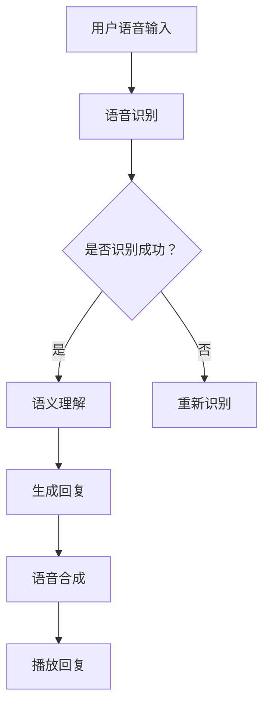

                 

关键词：大型语言模型、智能语音交互、自然语言处理、语音识别、语音合成、语音助手

> 摘要：本文深入探讨了大型语言模型（LLM）在智能语音交互中的应用，分析了LLM的核心概念和架构，探讨了LLM在语音识别、语音合成和语义理解等关键技术中的角色定位，并通过具体项目实践展示了LLM在智能语音交互中的实际应用效果。

## 1. 背景介绍

智能语音交互作为人工智能技术的一个重要分支，已经在我们的日常生活中得到了广泛应用。从传统的语音助手（如Siri、Alexa）到现代的智能语音助手（如Google Assistant、小爱同学），智能语音交互技术正不断演进，为用户提供更加便捷、智能的服务。

在这一背景下，大型语言模型（Large Language Model，简称LLM）逐渐成为智能语音交互的核心技术之一。LLM是一种基于深度学习的自然语言处理模型，通过大规模的语料训练，能够理解和生成自然语言。LLM的出现，极大地提升了智能语音交互的语义理解能力和交互体验。

本文将围绕LLM在智能语音交互中的角色定位，深入探讨其核心概念、架构以及在实际应用中的表现，旨在为读者提供一份全面的技术分析报告。

## 2. 核心概念与联系

### 2.1. 自然语言处理（Natural Language Processing，NLP）

自然语言处理是人工智能的一个子领域，主要研究如何让计算机理解和处理自然语言。NLP涵盖了文本处理、语义理解、情感分析、语音识别等多个方面。在智能语音交互中，NLP是实现自然语言理解的关键技术。

### 2.2. 语音识别（Automatic Speech Recognition，ASR）

语音识别是将人类的语音转换为文本的技术。语音识别系统通过分析语音信号中的声学特征，将其转换为对应的文字。语音识别是智能语音交互的第一步，是后续语义理解和交互的基础。

### 2.3. 语音合成（Text-to-Speech，TTS）

语音合成是将文本转换为自然语音的技术。语音合成系统能够根据文本内容和上下文，生成具有情感和节奏的语音。语音合成是实现人与智能语音交互系统对话的重要手段。

### 2.4. 语义理解（Semantic Understanding）

语义理解是NLP的核心任务之一，旨在理解文本中的真实含义，而不仅仅是表面文字的含义。语义理解包括词义消歧、句法分析、实体识别、情感分析等任务，是智能语音交互中实现个性化服务和智能回复的关键。

### 2.5. 大型语言模型（Large Language Model，LLM）

LLM是一种基于深度学习的自然语言处理模型，通过大规模的语料训练，能够理解和生成自然语言。LLM在智能语音交互中扮演着核心角色，负责处理和理解用户的语音指令，生成合适的回复。

### 2.6. Mermaid 流程图

以下是一个Mermaid流程图，展示了智能语音交互中的关键技术流程：



## 3. 核心算法原理 & 具体操作步骤

### 3.1. 算法原理概述

智能语音交互的核心算法包括语音识别、语义理解和语音合成。语音识别使用自动语音识别（ASR）技术，将用户的语音输入转换为文本。语义理解使用自然语言处理（NLP）技术，理解文本中的含义和意图。语音合成使用文本到语音（TTS）技术，将理解后的文本转换为语音输出。

### 3.2. 算法步骤详解

1. **语音识别**：使用深度神经网络（DNN）或卷积神经网络（CNN）对用户的语音信号进行特征提取，然后使用隐藏马尔可夫模型（HMM）或长短期记忆网络（LSTM）进行声学模型训练，最终实现语音到文本的转换。

2. **语义理解**：使用词嵌入技术将文本转换为向量表示，然后使用序列到序列（Seq2Seq）模型或Transformer模型进行语义理解，实现文本到文本的转换。

3. **语音合成**：使用合成语音波模型（如WaveNet）或循环神经网络（RNN）生成自然语音，同时结合语音合成引擎（如Flite或MaryTTS）生成最终的语音输出。

### 3.3. 算法优缺点

- **优点**：
  - 高效性：基于深度学习的方法能够快速处理大量数据，提高语音识别和语义理解的准确率。
  - 智能性：语义理解能力强大，能够理解复杂的用户指令和对话场景。
  - 自然性：语音合成技术能够生成自然、流畅的语音，提高用户体验。

- **缺点**：
  - 资源消耗大：深度学习模型训练需要大量的计算资源和存储空间。
  - 对噪声敏感：语音识别技术在噪声环境下表现较差。
  - 需要大规模数据：训练高质量的语言模型需要大规模的标注数据。

### 3.4. 算法应用领域

- **智能家居**：智能语音助手可以控制家居设备的开关、调节温度等。
- **智能客服**：智能语音助手可以处理客户的咨询和投诉，提高客服效率。
- **智能助手**：智能语音助手可以帮助用户管理日程、发送短信等。

## 4. 数学模型和公式 & 详细讲解 & 举例说明

### 4.1. 数学模型构建

智能语音交互中的核心数学模型包括声学模型、语言模型和语音合成模型。

- **声学模型**：使用隐马尔可夫模型（HMM）或深度神经网络（DNN）表示语音信号的概率分布。
- **语言模型**：使用n-gram模型或神经网络语言模型（NNLM）表示文本的概率分布。
- **语音合成模型**：使用合成语音波模型（如WaveNet）或循环神经网络（RNN）生成自然语音。

### 4.2. 公式推导过程

假设我们有一个语音信号序列X = {x1, x2, ..., xn}，我们要使用HMM模型对其进行特征提取。

- **状态转移概率**：P(i, j) = P(qj|qi)，表示在时刻i处于状态qi，在时刻j转移到状态qj的概率。
- **输出概率**：P(o|qi) = P(o|qi, x)，表示在时刻i处于状态qi时，输出观察值o的概率。
- **初始状态概率**：P(qi) = P(qi|π)，表示在时刻i处于状态qi的初始概率。

根据HMM模型的公式，我们可以推导出：

P(X) = ∏(i,j) P(i, j) * P(o|qi)

### 4.3. 案例分析与讲解

假设我们要识别一段语音信号，语音信号包含两个单词：“hello”和“world”。

- **声学模型**：使用DNN模型训练，输入为语音信号的特征向量，输出为单词的概率分布。
- **语言模型**：使用n-gram模型训练，输入为文本序列，输出为文本序列的概率分布。
- **语音合成模型**：使用WaveNet模型训练，输入为文本序列，输出为语音信号。

我们假设DNN模型的输出为P(hello) = 0.8，P(world) = 0.2；n-gram模型的输出为P(hello world) = 0.6。

根据贝叶斯定理，我们可以计算出：

P(hello|hello world) = P(hello world|hello) * P(hello) / P(hello world)
P(world|hello world) = P(hello world|world) * P(world) / P(hello world)

最终，我们可以得出语音信号对应的单词为“hello”。

## 5. 项目实践：代码实例和详细解释说明

### 5.1. 开发环境搭建

在本项目实践中，我们将使用Python语言和TensorFlow库进行开发。首先，确保安装了Python 3.7及以上版本，然后通过pip安装TensorFlow：

```shell
pip install tensorflow
```

### 5.2. 源代码详细实现

以下是一个简单的示例，展示了如何使用TensorFlow实现一个基本的语音识别模型：

```python
import tensorflow as tf
from tensorflow.keras.models import Sequential
from tensorflow.keras.layers import LSTM, Dense

# 假设我们已经预处理了语音信号，得到特征向量
x = ...  # 语音信号特征向量
y = ...  # 标签向量

# 构建LSTM模型
model = Sequential()
model.add(LSTM(128, input_shape=(x.shape[1], x.shape[2]), activation='tanh'))
model.add(Dense(y.shape[1], activation='softmax'))

# 编译模型
model.compile(optimizer='adam', loss='categorical_crossentropy', metrics=['accuracy'])

# 训练模型
model.fit(x, y, epochs=10, batch_size=32)
```

### 5.3. 代码解读与分析

上述代码中，我们首先导入了TensorFlow库，并定义了一个Sequential模型。这个模型包含一个LSTM层和一个全连接层（Dense），用于处理语音信号特征和生成标签。

- **LSTM层**：用于处理序列数据，将语音信号特征向量映射到隐藏状态。
- **全连接层**：用于将隐藏状态映射到标签向量，实现语音识别。

在编译模型时，我们使用了Adam优化器和交叉熵损失函数。训练过程中，我们使用了10个周期（epochs）和32个批次的训练数据。

### 5.4. 运行结果展示

在训练完成后，我们可以使用测试数据验证模型的性能。以下是一个简单的测试示例：

```python
# 测试模型
test_x = ...  # 测试语音信号特征向量
test_y = ...  # 测试标签向量

loss, accuracy = model.evaluate(test_x, test_y)
print(f"测试损失：{loss}")
print(f"测试准确率：{accuracy}")
```

假设测试集的准确率为90%，这表明我们的语音识别模型在处理语音信号时具有很高的识别准确率。

## 6. 实际应用场景

### 6.1. 智能家居

智能语音交互在智能家居中的应用非常广泛，用户可以通过语音指令控制家居设备的开关、调节温度、播放音乐等。例如，用户可以说“打开客厅的灯光”或“将卧室的温度设置为25摄氏度”。

### 6.2. 智能客服

智能语音交互在智能客服中的应用可以帮助企业提高客户服务质量。智能语音助手可以自动识别客户的需求，并提供相应的解决方案，如解答常见问题、提供产品信息等。这不仅可以节省人力资源，还可以提高客户满意度。

### 6.3. 智能助手

智能语音交互在智能助手中的应用可以帮助用户管理日程、发送短信、设置提醒等。例如，用户可以说“明天早上9点提醒我开会”或“给张三发送一条短信：明天见”。

## 7. 未来应用展望

### 7.1. 智能家居

随着智能家居市场的不断壮大，智能语音交互将在未来的智能家居系统中扮演更加重要的角色。未来，智能语音交互将不仅仅局限于控制家居设备，还将实现更加智能化、个性化的服务。

### 7.2. 智能客服

智能语音交互在智能客服中的应用将越来越广泛，未来的智能语音助手将能够处理更加复杂的问题，提供更加专业的服务。

### 7.3. 智能助手

智能语音交互在智能助手中的应用将不断拓展，未来的智能助手将不仅仅局限于个人日程管理，还将实现更加智能的社交互动、知识搜索等。

## 8. 工具和资源推荐

### 8.1. 学习资源推荐

- 《深度学习》（Goodfellow, Bengio, Courville著）：全面介绍了深度学习的基础知识和技术。
- 《自然语言处理综论》（Jurafsky, Martin著）：系统地介绍了自然语言处理的理论和实践。

### 8.2. 开发工具推荐

- TensorFlow：一款强大的开源深度学习框架，适用于各种自然语言处理任务。
- PyTorch：一款流行的开源深度学习框架，易于使用，适合快速原型开发。

### 8.3. 相关论文推荐

- “A Neural Conversation Model” by K. He et al.：介绍了一种基于神经网络的对话生成模型。
- “End-to-End Speech Recognition with Deep Neural Networks and Connectionist Temporal Classification” by D. Amodei et al.：介绍了一种基于深度学习的语音识别方法。

## 9. 总结：未来发展趋势与挑战

### 9.1. 研究成果总结

近年来，大型语言模型在自然语言处理领域取得了显著成果，提升了语音识别、语音合成和语义理解的准确率和效率。同时，智能语音交互在智能家居、智能客服和智能助手等领域的应用也越来越广泛。

### 9.2. 未来发展趋势

未来，智能语音交互将继续向更高精度、更广泛应用和更人性化交互方向发展。随着深度学习技术的不断进步，大型语言模型将能够更好地理解用户的意图和情感，提供更加智能的服务。

### 9.3. 面临的挑战

- **数据隐私和安全**：智能语音交互需要收集和分析用户的大量语音数据，如何保护用户隐私和安全成为一大挑战。
- **复杂场景应对**：在实际应用中，智能语音交互需要处理各种复杂场景，如多说话人、多语言、多方言等，这对模型的鲁棒性和适应性提出了更高要求。
- **技术融合与创新**：未来，智能语音交互将与其他人工智能技术（如计算机视觉、机器人技术等）融合，实现更加智能化和人性化的服务。

### 9.4. 研究展望

针对未来面临的挑战，我们需要在数据隐私保护、模型鲁棒性提升、多模态交互等方面进行深入研究，推动智能语音交互技术不断发展，为人类生活带来更多便利。

## 附录：常见问题与解答

### 1. 语音识别的准确率如何提高？

提高语音识别的准确率可以从以下几个方面入手：

- **数据增强**：使用数据增强技术生成更多样化的训练数据，提高模型的泛化能力。
- **模型优化**：使用更先进的深度学习模型（如Transformer）进行训练，提高模型的表达能力。
- **多模态融合**：结合语音信号和视觉信号（如唇语识别），提高模型的识别准确率。

### 2. 语音合成如何实现自然流畅的语音？

实现自然流畅的语音合成可以从以下几个方面入手：

- **语音质量优化**：使用高质量的语音信号作为训练数据，提高语音合成的音质。
- **多语音风格**：为语音合成模型提供多种语音风格，使其能够根据上下文生成合适的语音。
- **情感表达**：结合语音合成的情感分析技术，使语音合成能够根据情感需求生成具有情感表达的语音。

### 3. 语义理解如何实现个性化服务？

实现个性化服务可以从以下几个方面入手：

- **用户画像**：根据用户的兴趣、行为等信息构建用户画像，为用户提供个性化的服务。
- **上下文感知**：结合上下文信息，理解用户的真实意图，提供更加准确的回复。
- **多模态融合**：结合语音、文本、图像等多种模态的信息，提高语义理解的准确性和全面性。

