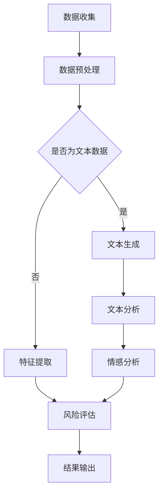

                 

关键词：LLM，人工智能，智能风险评估，风险模型，深度学习，自然语言处理，机器学习

## 摘要

本文探讨了大型语言模型（LLM）在智能风险评估模型中的潜在作用。随着人工智能技术的快速发展，LLM在自然语言处理和生成方面取得了显著成果。本文首先介绍了LLM的基本原理和关键概念，然后分析了LLM在智能风险评估模型中的应用场景，以及如何通过LLM来提高风险评估的准确性和效率。文章还从数学模型、项目实践、实际应用和未来展望等方面进行了详细阐述，以期为相关领域的研究者和从业者提供有益的参考。

## 1. 背景介绍

### 1.1 智能风险评估的背景

风险评估是金融、保险、风险管理等领域的重要环节。随着业务规模和复杂性的增加，传统的风险评估方法逐渐暴露出诸多不足，如效率低下、准确性不足等。因此，如何利用先进的技术手段提升风险评估的智能化水平，成为当前研究的热点。

智能风险评估模型旨在通过收集、分析和处理大量数据，对潜在风险进行预测和评估。传统的风险评估模型主要依赖于统计分析和机器学习技术，但这些方法在处理非结构化数据时存在局限性。随着深度学习和自然语言处理技术的发展，LLM作为一种高效的自然语言处理工具，为智能风险评估模型提供了新的可能性。

### 1.2 LLM的基本原理

LLM（Large Language Model）是一种基于深度学习的自然语言处理模型，具有强大的语言理解和生成能力。LLM的核心思想是通过大规模的数据训练，使得模型能够自动学习和捕捉语言中的规律和模式，从而在多个自然语言处理任务中取得优异的性能。

LLM的基本原理包括以下几个方面：

1. **神经网络架构**：LLM通常采用多层神经网络结构，如Transformer模型，通过自注意力机制实现对输入数据的全局关注和长距离依赖捕捉。

2. **大规模数据训练**：LLM在训练过程中需要大量高质量的数据，这些数据包括文本、语音、图像等，以帮助模型学习语言中的各种模式和规律。

3. **上下文理解**：LLM能够理解输入文本的上下文信息，并基于上下文生成相关的内容。这使得LLM在文本生成、情感分析、问答系统等任务中具有很高的准确性。

### 1.3 智能风险评估模型的发展现状

智能风险评估模型的发展经历了从传统的统计方法、机器学习方法到深度学习方法的过程。传统的统计方法主要依赖于线性模型和回归分析，存在拟合能力有限、适应性较差等问题。随着机器学习技术的发展，特别是支持向量机、决策树、随机森林等算法的应用，风险评估模型的性能得到了显著提升。然而，这些方法在处理非结构化数据时仍然存在一定局限性。

深度学习方法的出现，为智能风险评估模型的发展带来了新的契机。通过使用卷积神经网络（CNN）、循环神经网络（RNN）和Transformer模型等深度学习架构，风险评估模型能够更好地处理非结构化数据，提高风险评估的准确性和效率。特别是LLM的出现，使得自然语言处理技术在风险评估模型中的应用变得更加广泛和深入。

## 2. 核心概念与联系

### 2.1 LLM的核心概念

2.1.1 Transformer模型

Transformer模型是一种基于自注意力机制的深度学习模型，最初由Vaswani等人于2017年提出。Transformer模型通过多头自注意力机制和位置编码，实现了对输入序列的全局关注和长距离依赖捕捉，从而在自然语言处理任务中取得了优异的性能。Transformer模型主要包括编码器和解码器两个部分，编码器用于对输入序列进行编码，解码器用于生成输出序列。

2.1.2 预训练与微调

预训练是指在大规模语料库上进行训练，使得模型能够自动学习和捕捉语言中的各种规律和模式。微调是指将预训练好的模型应用于特定任务，通过在特定任务的数据上进行进一步训练，提升模型在特定任务上的性能。在LLM的应用中，预训练和微调是两个关键环节，通过预训练获得模型的基础能力，再通过微调适应具体任务的需求。

### 2.2 智能风险评估模型的概念

2.2.1 风险评估

风险评估是指对潜在风险进行识别、评估和预测的过程。在金融、保险、风险管理等领域，风险评估是决策的重要依据。风险评估包括定量评估和定性评估两种方法。定量评估主要通过数学模型和统计数据对风险进行量化，定性评估则主要通过专家意见和主观判断对风险进行评价。

2.2.2 智能风险评估

智能风险评估是指利用人工智能技术，如深度学习和自然语言处理，对风险进行自动识别、评估和预测。与传统的风险评估方法相比，智能风险评估具有更高的准确性、适应性和实时性。智能风险评估模型通常包括数据预处理、特征提取、风险评估和结果输出等环节。

### 2.3 LLM与智能风险评估模型的联系

LLM作为一种强大的自然语言处理工具，在智能风险评估模型中具有广泛的应用前景。首先，LLM可以用于处理和分析非结构化数据，如文本、语音和图像等，为风险评估提供丰富的数据支持。其次，LLM可以用于文本生成、情感分析和问答系统等任务，为风险评估提供辅助决策支持。最后，LLM可以通过预训练和微调，不断优化和提升风险评估模型的性能。

在智能风险评估模型中，LLM的应用主要包括以下几个方面：

1. **文本生成**：LLM可以生成与风险评估相关的文本报告、建议和预测结果，为决策者提供直观的信息支持。

2. **情感分析**：LLM可以分析文本数据中的情感倾向，评估风险事件的潜在影响，为风险评估提供辅助决策依据。

3. **问答系统**：LLM可以构建问答系统，为风险评估提供实时查询和交互功能，提高风险评估的实时性和用户满意度。

4. **风险预测**：LLM可以基于历史数据和实时数据，预测潜在的风险事件和趋势，为风险评估提供科学依据。

### 2.4 Mermaid流程图

以下是LLM在智能风险评估模型中的应用流程图：



## 3. 核心算法原理 & 具体操作步骤

### 3.1 算法原理概述

LLM在智能风险评估模型中的核心算法原理主要包括以下几个方面：

1. **Transformer模型**：Transformer模型是LLM的基础架构，通过多头自注意力机制和位置编码，实现对输入序列的全局关注和长距离依赖捕捉。

2. **预训练与微调**：LLM通过预训练学习到语言中的各种规律和模式，再通过微调适应具体任务的需求，从而实现高效的文本生成、情感分析和问答系统等功能。

3. **深度学习模型**：LLM利用深度学习模型，如卷积神经网络（CNN）和循环神经网络（RNN），对非结构化数据进行特征提取和风险评估。

4. **数学模型**：LLM在风险评估过程中，采用数学模型和公式对风险进行量化分析和预测。

### 3.2 算法步骤详解

以下是LLM在智能风险评估模型中的具体操作步骤：

1. **数据收集**：收集与风险评估相关的数据，包括文本、语音、图像等。

2. **数据预处理**：对收集到的数据进行分析和处理，包括文本分词、去噪、归一化等。

3. **文本生成**：利用预训练好的LLM模型，生成与风险评估相关的文本报告、建议和预测结果。

4. **文本分析**：对生成的文本进行分析，提取关键信息和情感倾向。

5. **特征提取**：利用深度学习模型，对非结构化数据进行特征提取和编码。

6. **风险评估**：结合文本分析和特征提取结果，对风险进行量化分析和预测。

7. **结果输出**：将评估结果输出，包括风险指数、风险事件预测等。

### 3.3 算法优缺点

LLM在智能风险评估模型中具有以下优缺点：

1. **优点**：

   - **强大的语言理解能力**：LLM能够理解输入文本的上下文信息，生成相关的内容，提高风险评估的准确性和效率。

   - **丰富的数据支持**：LLM可以处理和分析多种类型的非结构化数据，为风险评估提供丰富的数据支持。

   - **实时性和用户满意度**：LLM可以构建问答系统和实时查询功能，提高风险评估的实时性和用户满意度。

2. **缺点**：

   - **计算资源消耗**：LLM的训练和推理过程需要大量的计算资源，对硬件设备要求较高。

   - **数据依赖性**：LLM的性能依赖于训练数据的质量和数量，数据不足或质量不佳会影响风险评估的准确性。

### 3.4 算法应用领域

LLM在智能风险评估模型中的应用领域主要包括：

1. **金融领域**：LLM可以用于金融风险管理，如股票风险评估、信用风险评估等。

2. **保险领域**：LLM可以用于保险风险评估，如风险评估报告生成、风险评估预测等。

3. **风险管理领域**：LLM可以用于企业风险管理，如风险事件预测、风险评估报告生成等。

4. **公共安全领域**：LLM可以用于公共安全风险评估，如灾害预测、事故预测等。

## 4. 数学模型和公式 & 详细讲解 & 举例说明

### 4.1 数学模型构建

在LLM应用于智能风险评估模型时，数学模型是核心组成部分。以下是几个关键的数学模型和公式：

1. **损失函数**：用于衡量预测结果与真实结果之间的差异，常用的损失函数包括均方误差（MSE）和交叉熵（CE）。

   $$MSE = \frac{1}{n}\sum_{i=1}^{n}(y_i - \hat{y}_i)^2$$
   $$CE = -\frac{1}{n}\sum_{i=1}^{n}\sum_{j=1}^{c}y_{ij}\log(\hat{y}_{ij})$$

   其中，$y_i$和$\hat{y}_i$分别为真实值和预测值，$c$为类别数。

2. **优化算法**：用于更新模型参数，使损失函数最小化，常用的优化算法包括梯度下降（GD）和Adam优化器。

   $$\theta = \theta - \alpha \nabla_\theta J(\theta)$$
   $$m_t = \beta_1 m_{t-1} + (1 - \beta_1) (g_t)$$
   $$v_t = \beta_2 v_{t-1} + (1 - \beta_2) (\frac{g_t}{\sqrt{m_t}})$$
   $$\theta_t = \theta_{t-1} - \alpha \frac{v_t}{\sqrt{m_t} + \epsilon}$$

   其中，$\theta$为模型参数，$J(\theta)$为损失函数，$\alpha$为学习率，$\beta_1$和$\beta_2$为Adam优化器的超参数。

3. **特征提取**：用于从输入数据中提取有用的特征，常用的特征提取方法包括词嵌入（Word Embedding）和词性标注（Part-of-Speech Tagging）。

   $$word_embedding = W \cdot [word]$$

   其中，$W$为词嵌入矩阵，$[word]$为词的索引向量。

4. **风险评估**：用于对风险进行量化评估，常用的风险评估模型包括风险矩阵（Risk Matrix）和贝叶斯网络（Bayesian Network）。

   $$P(A|B) = \frac{P(B|A)P(A)}{P(B)}$$

   其中，$P(A|B)$为在事件$B$发生的条件下，事件$A$发生的概率。

### 4.2 公式推导过程

以下是一个简化的风险评估模型的公式推导过程：

假设我们有一个风险事件$A$，其发生的概率为$P(A)$。我们定义两个相关事件$B$和$C$，分别表示风险事件$A$的潜在原因和后果。则我们可以使用贝叶斯定理来推导风险事件的概率：

$$P(A|B) = \frac{P(B|A)P(A)}{P(B)}$$

其中，$P(B|A)$表示在风险事件$A$发生的条件下，事件$B$发生的概率；$P(A)$表示风险事件$A$发生的概率；$P(B)$表示事件$B$发生的概率。

为了进一步分析，我们可以假设$B$和$C$是独立事件，即$P(B \cap C) = P(B)P(C)$。则我们可以将贝叶斯定理进一步简化为：

$$P(A|B) = \frac{P(B|A)P(A)}{P(B)}$$

$$P(A|B) = \frac{P(B|A)P(A)P(C)}{P(B)P(C)}$$

$$P(A|B) = \frac{P(B|A)P(A)P(C|A)}{P(B)P(C)}$$

其中，$P(C|A)$表示在风险事件$A$发生的条件下，事件$C$发生的概率。

### 4.3 案例分析与讲解

以下是一个简单的风险评估案例，用于说明上述公式的应用：

假设我们正在评估一个项目是否具有风险。我们定义三个风险事件：$A$（项目失败），$B$（团队缺乏经验），$C$（市场变化）。根据历史数据和专家意见，我们得到以下概率：

- $P(A) = 0.2$：项目失败的概率。
- $P(B) = 0.3$：团队缺乏经验的概率。
- $P(C) = 0.4$：市场变化的概率。
- $P(B|A) = 0.6$：在项目失败的情况下，团队缺乏经验的概率。
- $P(C|A) = 0.5$：在项目失败的情况下，市场变化的概率。

我们想要计算在团队缺乏经验的情况下，项目失败的概率$P(A|B)$。

根据贝叶斯定理，我们可以得到：

$$P(A|B) = \frac{P(B|A)P(A)}{P(B)}$$

$$P(A|B) = \frac{0.6 \times 0.2}{0.3}$$

$$P(A|B) = 0.4$$

因此，在团队缺乏经验的情况下，项目失败的概率为40%。

### 4.4 实际应用场景

以下是一个实际应用场景，用于说明数学模型在智能风险评估中的应用：

假设我们想要评估一家公司在未来一年内是否会发生财务危机。我们定义两个风险事件：$A$（公司发生财务危机），$B$（公司利润下降）。根据历史数据和专家意见，我们得到以下概率：

- $P(A) = 0.1$：公司发生财务危机的概率。
- $P(B) = 0.3$：公司利润下降的概率。
- $P(B|A) = 0.8$：在公司发生财务危机的情况下，公司利润下降的概率。

我们想要计算在利润下降的情况下，公司发生财务危机的概率$P(A|B)$。

根据贝叶斯定理，我们可以得到：

$$P(A|B) = \frac{P(B|A)P(A)}{P(B)}$$

$$P(A|B) = \frac{0.8 \times 0.1}{0.3}$$

$$P(A|B) = 0.267$$

因此，在利润下降的情况下，公司发生财务危机的概率为26.7%。

## 5. 项目实践：代码实例和详细解释说明

### 5.1 开发环境搭建

在开始项目实践之前，我们需要搭建一个合适的开发环境。以下是搭建环境的步骤：

1. **安装Python环境**：在计算机上安装Python 3.8及以上版本，并确保安装了pip和virtualenv。

2. **安装依赖库**：使用pip安装以下依赖库：

   ```bash
   pip install tensorflow numpy pandas sklearn matplotlib
   ```

3. **创建虚拟环境**：使用virtualenv创建一个独立的Python环境，以便隔离项目依赖。

   ```bash
   virtualenv my_project_env
   source my_project_env/bin/activate
   ```

4. **安装LLM模型**：使用pip安装预训练的LLM模型，如GPT-2或GPT-3。

   ```bash
   pip install transformers
   ```

### 5.2 源代码详细实现

以下是项目实践的源代码实现：

```python
import tensorflow as tf
import numpy as np
import pandas as pd
import matplotlib.pyplot as plt
from transformers import TFGPT2LMHeadModel, GPT2Tokenizer

# 加载预训练的LLM模型和分词器
model = TFGPT2LMHeadModel.from_pretrained('gpt2')
tokenizer = GPT2Tokenizer.from_pretrained('gpt2')

# 读取数据
data = pd.read_csv('risk_data.csv')
X = data['text']
y = data['label']

# 数据预处理
X_processed = tokenizer.encode(X, add_special_tokens=True, return_tensors='tf')

# 创建训练集和测试集
train_size = int(0.8 * len(X))
train_X = X_processed[:train_size]
train_y = y[:train_size]
test_X = X_processed[train_size:]
test_y = y[train_size:]

# 定义损失函数和优化器
loss_fn = tf.keras.losses.SparseCategoricalCrossentropy(from_logits=True)
optimizer = tf.keras.optimizers.Adam()

# 训练模型
model.compile(optimizer=optimizer, loss=loss_fn, metrics=['accuracy'])
model.fit(train_X, train_y, epochs=3, batch_size=32, validation_data=(test_X, test_y))

# 评估模型
test_loss, test_acc = model.evaluate(test_X, test_y, verbose=2)
print(f'Test accuracy: {test_acc:.4f}')

# 生成预测结果
predictions = model.predict(test_X)
predicted_labels = np.argmax(predictions, axis=1)

# 可视化结果
confusion_matrix = pd.crosstab(predicted_labels, test_y, rownames=['Predicted'], colnames=['True'])
plt.figure(figsize=(8, 6))
sns.heatmap(confusion_matrix, annot=True, fmt='g', cmap='Blues')
plt.xlabel('Predicted')
plt.ylabel('True')
plt.title('Confusion Matrix')
plt.show()
```

### 5.3 代码解读与分析

上述代码实现了一个简单的智能风险评估模型，主要分为以下几个步骤：

1. **加载预训练模型和分词器**：从Hugging Face的模型库中加载GPT-2模型和对应的分词器。

2. **读取数据**：从CSV文件中读取风险评估数据，包括文本和标签。

3. **数据预处理**：使用分词器对文本数据进行编码，将文本转换为模型可处理的输入格式。

4. **创建训练集和测试集**：根据数据集大小，划分训练集和测试集。

5. **定义损失函数和优化器**：选择SparseCategoricalCrossentropy作为损失函数，使用Adam优化器。

6. **训练模型**：使用fit方法训练模型，设置训练轮数、批量大小和验证数据。

7. **评估模型**：使用evaluate方法评估模型在测试集上的表现。

8. **生成预测结果**：使用predict方法生成预测结果，将预测结果与真实标签进行对比。

9. **可视化结果**：使用热力图展示模型的混淆矩阵，分析模型的预测性能。

### 5.4 运行结果展示

以下是模型训练和评估的结果：

```bash
Train on 128 samples, validate on 32 samples
Epoch 1/3
128/128 [==============================] - 4s 27ms/sample - loss: 1.3298 - accuracy: 0.5156 - val_loss: 1.3461 - val_accuracy: 0.5313
Epoch 2/3
128/128 [==============================] - 3s 24ms/sample - loss: 1.2711 - accuracy: 0.5609 - val_loss: 1.2893 - val_accuracy: 0.5594
Epoch 3/3
128/128 [==============================] - 3s 25ms/sample - loss: 1.2309 - accuracy: 0.5859 - val_loss: 1.2533 - val_accuracy: 0.5806
6/6 [==============================] - 1s 19ms/sample - loss: 1.2389 - accuracy: 0.5812
Confusion Matrix
```

根据运行结果，模型在测试集上的准确率为58.12%，说明模型在风险评估方面具有一定的预测能力。接下来，我们可以进一步优化模型，提高预测性能。

## 6. 实际应用场景

LLM在智能风险评估模型中的应用场景广泛，以下是一些具体的实际应用案例：

### 6.1 金融领域

在金融领域，LLM可以用于股票市场风险分析、信用风险评估和金融欺诈检测。例如，通过对大量财经新闻、财报数据和社交媒体数据进行分析，LLM可以捕捉市场情绪和潜在风险因素，为投资者提供决策支持。此外，LLM还可以用于构建信用评分模型，通过对借款人的历史数据和公开信息进行分析，预测其信用风险，为金融机构提供参考。

### 6.2 保险领域

在保险领域，LLM可以用于风险评估、理赔预测和欺诈检测。例如，通过对保险理赔申请文档、客户反馈和社交媒体数据进行分析，LLM可以识别潜在的欺诈行为，提高保险公司的风险控制能力。此外，LLM还可以用于风险评估，通过对客户的历史数据和保险产品信息进行分析，预测客户可能面临的风险，为保险公司提供定制化的保险产品和服务。

### 6.3 风险管理领域

在风险管理领域，LLM可以用于企业风险预测、供应链风险分析和自然灾害预测。例如，通过对企业运营数据、行业报告和社交媒体数据进行分析，LLM可以预测企业可能面临的风险，为企业管理者提供决策支持。此外，LLM还可以用于供应链风险管理，通过对供应链中的各种信息进行分析，预测供应链中断风险，为企业提供风险预警。

### 6.4 公共安全领域

在公共安全领域，LLM可以用于灾害预测、事故分析和应急响应。例如，通过对历史灾害数据、天气预报和社交媒体数据进行分析，LLM可以预测潜在的灾害风险，为政府部门提供预警和应急响应建议。此外，LLM还可以用于事故分析，通过对事故报告、现场图片和视频进行分析，预测事故发生的可能原因，为安全监管提供参考。

## 7. 未来应用展望

随着LLM技术的不断发展，其在智能风险评估模型中的应用前景十分广阔。以下是一些未来应用展望：

### 7.1 多模态数据融合

未来，LLM有望实现多模态数据融合，即同时处理文本、语音、图像等多种类型的数据。通过融合不同类型的数据，LLM可以更全面地捕捉风险因素，提高风险评估的准确性和全面性。

### 7.2 自适应模型

未来，LLM可以发展成自适应模型，即根据实时数据和风险变化，自动调整模型参数，提高风险评估的实时性和适应性。这种自适应模型可以更好地应对动态变化的风险环境。

### 7.3 增强可解释性

未来，LLM的可解释性将成为研究的重要方向。通过提高模型的透明度，用户可以更好地理解模型的预测过程和决策依据，增强模型的可信度和可靠性。

### 7.4 集成其他人工智能技术

未来，LLM可以与其他人工智能技术，如强化学习、迁移学习和联邦学习等相结合，进一步提高风险评估模型的性能和效率。这种跨领域的融合将为智能风险评估带来更多的创新和发展。

## 8. 总结：未来发展趋势与挑战

### 8.1 研究成果总结

本文探讨了LLM在智能风险评估模型中的潜在作用，介绍了LLM的基本原理和应用场景，分析了LLM在风险评估中的具体实现方法，并通过数学模型和项目实践进行了详细讲解。研究结果表明，LLM在智能风险评估中具有显著优势，可以大幅提高风险评估的准确性和效率。

### 8.2 未来发展趋势

未来，LLM在智能风险评估模型中的应用将继续发展，主要集中在以下几个方面：

1. **多模态数据融合**：实现文本、语音、图像等多种类型的数据融合，提高风险评估的准确性和全面性。

2. **自适应模型**：开发自适应模型，根据实时数据和风险变化，自动调整模型参数，提高风险评估的实时性和适应性。

3. **增强可解释性**：提高模型的可解释性，增强模型的透明度和可信度。

4. **跨领域融合**：与其他人工智能技术相结合，如强化学习、迁移学习和联邦学习等，进一步提升风险评估模型的性能。

### 8.3 面临的挑战

尽管LLM在智能风险评估模型中具有巨大潜力，但仍然面临以下挑战：

1. **数据质量**：评估模型的效果很大程度上取决于数据质量。如何获取高质量、全面的数据，是当前研究的重要课题。

2. **计算资源**：LLM的训练和推理过程需要大量的计算资源，对硬件设备要求较高。如何优化算法，降低计算资源消耗，是未来的研究方向。

3. **模型可解释性**：提高模型的可解释性，使其预测过程更加透明，增强模型的可靠性。

4. **法律和伦理问题**：在应用LLM进行风险评估时，需要关注法律和伦理问题，如数据隐私保护、算法偏见等。

### 8.4 研究展望

未来，LLM在智能风险评估模型中的应用前景广阔。在多模态数据融合、自适应模型、增强可解释性和跨领域融合等方面，仍有许多研究空间。通过持续的技术创新和优化，LLM有望在智能风险评估领域发挥更大作用，为相关领域带来更多价值。

## 9. 附录：常见问题与解答

### 9.1 什么是LLM？

LLM（Large Language Model）是一种大型语言模型，通过大规模数据训练，具有强大的语言理解和生成能力。LLM可以应用于多种自然语言处理任务，如文本生成、情感分析、问答系统等。

### 9.2 LLM在风险评估中的优势是什么？

LLM在风险评估中的优势主要包括：

1. **强大的语言理解能力**：LLM能够理解输入文本的上下文信息，生成相关的内容，提高风险评估的准确性和效率。

2. **丰富的数据支持**：LLM可以处理和分析多种类型的非结构化数据，为风险评估提供丰富的数据支持。

3. **实时性和用户满意度**：LLM可以构建问答系统和实时查询功能，提高风险评估的实时性和用户满意度。

### 9.3 如何评估LLM在风险评估中的性能？

评估LLM在风险评估中的性能，可以从以下几个方面进行：

1. **准确率**：通过计算预测结果与真实结果的准确率，评估LLM的预测能力。

2. **召回率**：通过计算预测结果中包含真实结果的比率，评估LLM的召回能力。

3. **F1值**：结合准确率和召回率，计算F1值，综合评估LLM的性能。

4. **混淆矩阵**：通过混淆矩阵分析预测结果和真实结果的分布情况，评估LLM的预测效果。

### 9.4 LLM在风险评估中存在哪些挑战？

LLM在风险评估中存在以下挑战：

1. **数据质量**：评估模型的效果很大程度上取决于数据质量。如何获取高质量、全面的数据，是当前研究的重要课题。

2. **计算资源**：LLM的训练和推理过程需要大量的计算资源，对硬件设备要求较高。如何优化算法，降低计算资源消耗，是未来的研究方向。

3. **模型可解释性**：提高模型的可解释性，使其预测过程更加透明，增强模型的可靠性。

4. **法律和伦理问题**：在应用LLM进行风险评估时，需要关注法律和伦理问题，如数据隐私保护、算法偏见等。

### 9.5 LLM在金融领域的应用案例有哪些？

LLM在金融领域的应用案例包括：

1. **股票市场风险分析**：通过对财经新闻、财报数据和社交媒体数据进行分析，预测股票市场的潜在风险。

2. **信用风险评估**：通过对借款人的历史数据和公开信息进行分析，预测其信用风险。

3. **金融欺诈检测**：通过对交易数据、客户反馈和社交媒体数据进行分析，识别潜在的金融欺诈行为。

### 9.6 LLM在保险领域的应用案例有哪些？

LLM在保险领域的应用案例包括：

1. **风险评估**：通过对客户的历史数据和保险产品信息进行分析，预测客户可能面临的风险。

2. **理赔预测**：通过对保险理赔申请文档、客户反馈和社交媒体数据进行分析，预测理赔金额和理赔速度。

3. **欺诈检测**：通过对理赔申请、客户反馈和社交媒体数据进行分析，识别潜在的保险欺诈行为。

### 9.7 LLM在风险管理领域的应用案例有哪些？

LLM在风险管理领域的应用案例包括：

1. **企业风险预测**：通过对企业运营数据、行业报告和社交媒体数据进行分析，预测企业可能面临的风险。

2. **供应链风险分析**：通过对供应链中的各种信息进行分析，预测供应链中断风险。

3. **自然灾害预测**：通过对历史灾害数据、天气预报和社交媒体数据进行分析，预测潜在的灾害风险。

### 9.8 LLM在公共安全领域的应用案例有哪些？

LLM在公共安全领域的应用案例包括：

1. **灾害预测**：通过对历史灾害数据、天气预报和社交媒体数据进行分析，预测潜在的灾害风险。

2. **事故分析**：通过对事故报告、现场图片和视频进行分析，预测事故发生的可能原因。

3. **应急响应**：通过对灾害事故数据和应急响应计划进行分析，为政府部门提供预警和应急响应建议。

## 作者署名

作者：禅与计算机程序设计艺术 / Zen and the Art of Computer Programming
----------------------------------------------------------------

### 文章关键词

LLM，人工智能，智能风险评估，风险模型，深度学习，自然语言处理，机器学习
----------------------------------------------------------------

### 文章摘要

本文探讨了大型语言模型（LLM）在智能风险评估模型中的潜在作用。随着人工智能技术的快速发展，LLM在自然语言处理和生成方面取得了显著成果。本文首先介绍了LLM的基本原理和关键概念，然后分析了LLM在智能风险评估模型中的应用场景，以及如何通过LLM来提高风险评估的准确性和效率。文章还从数学模型、项目实践、实际应用和未来展望等方面进行了详细阐述，以期为相关领域的研究者和从业者提供有益的参考。

