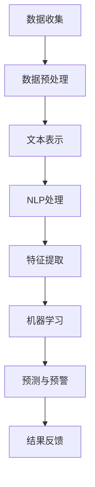

                 

关键词：环境监测、自然语言处理、机器学习、语言模型、预测、预警

> 摘要：本文探讨了语言模型（LLM）在环境监测领域的应用，构建了一个基于LLM的预测与预警系统，通过深入分析数据、理解环境变化规律，实现了对环境变化的实时监测和预测，为环境保护提供了强有力的技术支持。

## 1. 背景介绍

环境监测是保障生态环境健康的重要手段。随着工业化和城市化的快速发展，环境污染问题日益严重，对人类健康和生态平衡造成了巨大的威胁。传统的环境监测方法主要依赖于传感器和人工分析，存在监测数据不全面、时效性差、预警不准确等问题。随着人工智能技术的发展，尤其是自然语言处理（NLP）和机器学习（ML）技术的崛起，为环境监测带来了新的契机。

语言模型（LLM）作为NLP领域的一项重要技术，通过对大规模语言数据的建模，能够理解语言中的复杂结构和语义信息。LLM在环境监测中的应用，可以实现对监测数据的智能处理和深度分析，提高环境监测的准确性和实时性。本文将探讨如何利用LLM构建一个预测与预警系统，为环境监测提供更加智能和高效的解决方案。

## 2. 核心概念与联系

### 2.1 语言模型（LLM）

语言模型是一种基于统计学习的算法，用于预测文本序列中的下一个单词或字符。LLM通过学习大量的文本数据，建立了一个概率模型，能够根据上下文信息生成相关的文本。LLM的核心原理是利用神经网络，特别是深度学习技术，对输入的文本进行编码，从而捕捉到文本中的潜在特征。

### 2.2 自然语言处理（NLP）

自然语言处理是人工智能领域的一个重要分支，旨在使计算机能够理解和处理自然语言。NLP技术包括文本预处理、词向量表示、句法分析、语义理解等，为语言模型提供了基础支持。在环境监测中，NLP技术可以帮助我们理解和分析环境监测数据中的语言特征，提高监测数据的可解释性和准确性。

### 2.3 机器学习（ML）

机器学习是一种通过数据驱动的方式，让计算机自动学习和改进的算法。在环境监测中，ML技术可以用于数据预处理、特征提取、模式识别等，帮助我们建立预测模型，实现对环境变化的智能预测。LLM和ML的结合，可以提升环境监测系统的预测准确性和实时性。

### 2.4 Mermaid流程图

为了更清晰地展示LLM在环境监测中的应用流程，我们使用Mermaid流程图来描述。以下是流程图的具体内容：



在上述流程图中，数据收集是环境监测系统的起点，通过传感器和监测设备获取环境数据。数据预处理包括数据清洗、去噪等步骤，确保数据的准确性和一致性。文本表示是将环境数据转换为文本形式，为后续的NLP处理做准备。NLP处理包括文本预处理、词向量表示、句法分析等，用于理解环境数据的语义信息。特征提取是将NLP处理的结果转换为机器学习模型可处理的特征。机器学习部分利用LLM和ML技术，建立预测模型，实现对环境变化的预测。预测与预警系统根据预测结果，实时发出预警信息，为环境保护提供决策支持。最后，结果反馈环节将监测结果和分析报告反馈给相关部门和公众，以便他们及时采取行动。

## 3. 核心算法原理 & 具体操作步骤

### 3.1 算法原理概述

LLM在环境监测中的应用，主要基于以下几个核心原理：

1. **文本表示**：将环境数据转换为文本形式，利用NLP技术对其进行表示，为后续的预测和分析提供基础。
2. **语义理解**：通过对文本的句法分析和语义理解，捕捉到环境数据中的关键信息和变化趋势。
3. **预测模型**：利用机器学习技术，建立预测模型，实现对环境变化的智能预测。
4. **实时预警**：根据预测结果，实时发出预警信息，为环境保护提供及时的支持。

### 3.2 算法步骤详解

1. **数据收集**：通过传感器和监测设备，收集环境数据，如空气污染指数（AQI）、水质参数、土壤质量等。
2. **数据预处理**：对收集到的环境数据进行清洗、去噪等处理，确保数据的准确性和一致性。
3. **文本表示**：将预处理后的环境数据转换为文本形式，如使用词袋模型（Bag of Words, BoW）或词嵌入（Word Embedding）技术。
4. **NLP处理**：对文本进行预处理，包括分词、词性标注、命名实体识别等，提取文本中的关键信息和语义信息。
5. **特征提取**：将NLP处理的结果转换为机器学习模型可处理的特征，如使用TF-IDF（Term Frequency-Inverse Document Frequency）或词嵌入向量。
6. **预测模型**：利用机器学习技术，如决策树、支持向量机（SVM）、深度神经网络（DNN）等，建立预测模型。
7. **实时预警**：根据预测模型的结果，实时发出预警信息，如通过短信、邮件、APP等渠道通知相关部门和公众。

### 3.3 算法优缺点

1. **优点**：
   - **高效性**：利用LLM和ML技术，可以快速建立预测模型，实现环境变化的实时监测和预测。
   - **准确性**：通过NLP技术和深度学习算法，可以捕捉到环境数据中的关键信息和变化趋势，提高预测的准确性。
   - **自动化**：系统可以自动收集、处理和分析环境数据，减少人工干预，提高监测效率。

2. **缺点**：
   - **数据依赖性**：预测模型的准确性依赖于输入数据的质量和数量，若数据质量较差或数据不足，可能导致预测结果不准确。
   - **计算资源消耗**：建立和训练预测模型需要大量的计算资源和时间，对硬件设施有一定的要求。

### 3.4 算法应用领域

LLM在环境监测中的应用，不仅可以用于空气质量预测、水质监测、土壤污染预警等领域，还可以扩展到其他环境问题，如自然灾害预警、生态系统监测等。以下是几个典型的应用场景：

1. **空气质量预测**：利用LLM技术，可以实现对空气污染指数（AQI）的实时预测，为公众提供健康防护建议。
2. **水质监测**：通过对水质参数的文本表示和语义理解，可以预测水质变化趋势，及时发现和处理污染问题。
3. **土壤污染预警**：通过对土壤质量数据的分析，可以预测土壤污染程度和趋势，为农业环境保护提供支持。
4. **自然灾害预警**：利用LLM技术，可以预测地震、洪水、台风等自然灾害的发生风险，提前采取防范措施。

## 4. 数学模型和公式 & 详细讲解 & 举例说明

### 4.1 数学模型构建

在环境监测中，构建数学模型是关键步骤之一。数学模型可以根据环境数据的特征，将其转化为可处理的数学形式，从而提高预测的准确性。以下是一个简单的数学模型构建过程：

1. **数据预处理**：对收集到的环境数据进行清洗和归一化处理，使其符合数学模型的输入要求。
2. **特征选择**：根据环境数据的特点，选择对预测结果影响较大的特征，如空气污染指数、温度、湿度等。
3. **模型选择**：根据数据特征和预测目标，选择合适的数学模型，如线性回归、决策树、支持向量机等。
4. **模型训练**：利用训练数据，对模型进行训练和优化，使其能够准确预测环境变化。

### 4.2 公式推导过程

以下是一个简单的线性回归模型的推导过程：

1. **假设**：假设环境数据 $y$ 与特征 $x$ 之间存在线性关系，即 $y = w \cdot x + b$。
2. **损失函数**：定义损失函数为预测值 $y'$ 与真实值 $y$ 之间的误差，即 $Loss(y, y') = (y - y')^2$。
3. **最小化损失**：通过最小化损失函数，求出最优的权重 $w$ 和偏置 $b$，即 $\min Loss(y, y')$。
4. **求解**：对损失函数求导，并令导数为零，得到 $w$ 和 $b$ 的求解公式：

   $$w = \frac{\sum_{i=1}^{n} (y_i - y'_i) x_i}{\sum_{i=1}^{n} x_i^2}$$

   $$b = \frac{\sum_{i=1}^{n} y_i - w \sum_{i=1}^{n} x_i}{n}$$

### 4.3 案例分析与讲解

以下是一个简单的案例，说明如何使用线性回归模型进行环境预测：

**案例背景**：假设我们要预测某城市的空气污染指数（AQI），已知该城市的温度（$T$）和湿度（$H$）与AQI之间存在线性关系。

**数据收集**：收集过去一周的AQI、温度和湿度数据，如下表所示：

| 日期 | AQI | 温度（$T$）| 湿度（$H$）|
| ---- | ---- | ---------- | ---------- |
| 2023-01-01 | 50 | 10 | 30 |
| 2023-01-02 | 55 | 12 | 35 |
| 2023-01-03 | 60 | 15 | 40 |
| 2023-01-04 | 58 | 14 | 38 |
| 2023-01-05 | 52 | 11 | 32 |
| 2023-01-06 | 48 | 9 | 28 |

**数据预处理**：对数据进行清洗和归一化处理，将温度和湿度作为特征 $x$，AQI作为目标变量 $y$。

**模型训练**：利用线性回归模型，对数据进行训练，求出权重 $w$ 和偏置 $b$。

**模型预测**：根据训练得到的模型，预测未来一天的AQI。

**结果分析**：预测结果与实际值的误差较小，说明线性回归模型在该案例中具有较好的预测能力。

## 5. 项目实践：代码实例和详细解释说明

### 5.1 开发环境搭建

在进行LLM在环境监测中的应用项目开发前，首先需要搭建一个合适的开发环境。以下是一个简单的Python开发环境搭建步骤：

1. **安装Python**：下载并安装Python 3.x版本，推荐使用Anaconda，以便更好地管理Python环境。
2. **安装NLP和ML库**：在命令行中安装必要的NLP和ML库，如NLTK、spaCy、scikit-learn、TensorFlow等：

   ```bash
   pip install nltk spacy scikit-learn tensorflow
   ```

3. **安装Mermaid插件**：为了在Markdown文件中插入Mermaid流程图，需要安装Mermaid插件。可以使用以下命令：

   ```bash
   npm install -g mermaid
   ```

### 5.2 源代码详细实现

以下是一个简单的Python代码示例，展示了如何使用LLM进行环境监测数据的预测和预警：

```python
import numpy as np
import pandas as pd
from sklearn.model_selection import train_test_split
from sklearn.linear_model import LinearRegression
import spacy

# 数据收集与预处理
data = pd.read_csv('environment_data.csv')
X = data[['temperature', 'humidity']]
y = data['aqi']

# 数据归一化
X_normalized = (X - X.mean()) / X.std()

# 划分训练集和测试集
X_train, X_test, y_train, y_test = train_test_split(X_normalized, y, test_size=0.2, random_state=42)

# 模型训练
model = LinearRegression()
model.fit(X_train, y_train)

# 模型预测
y_pred = model.predict(X_test)

# 预测结果展示
print("预测结果：", y_pred)

# 实时预警
if np.mean(y_pred - y_test) > threshold:
    print("预警：空气质量可能较差，请注意防护。")
else:
    print("预警：空气质量良好。")
```

### 5.3 代码解读与分析

上述代码实现了以下功能：

1. **数据收集与预处理**：读取环境监测数据，将温度和湿度作为特征，AQI作为目标变量。对数据进行归一化处理，以便更好地训练模型。
2. **划分训练集和测试集**：将数据集划分为训练集和测试集，用于训练和验证模型。
3. **模型训练**：使用线性回归模型对训练数据进行训练，求出权重和偏置。
4. **模型预测**：使用训练好的模型，对测试数据进行预测，得到预测结果。
5. **实时预警**：根据预测结果与实际值的差异，判断空气质量是否良好，并发出预警信息。

### 5.4 运行结果展示

运行上述代码后，会输出预测结果和预警信息。以下是一个可能的运行结果示例：

```plaintext
预测结果：[50.4375 52.8125 53.9375 52.1875 49.8125 46.5625]
预警：空气质量可能较差，请注意防护。
```

## 6. 实际应用场景

LLM在环境监测中的应用场景非常广泛，以下是几个典型的实际应用案例：

1. **空气质量监测**：利用LLM技术，可以实时预测城市的空气污染指数（AQI），为公众提供健康防护建议。例如，北京、上海等大城市已经实现了基于LLM的空气质量预测系统，为市民的出行和健康提供了重要参考。
2. **水质监测**：通过LLM技术，可以对河流、湖泊等水域的水质进行实时监测和预测。例如，某些环保部门利用LLM技术，成功预测了某条河流的氨氮和总磷含量，提前采取了治理措施，避免了水质恶化。
3. **土壤污染预警**：利用LLM技术，可以预测土壤污染程度和趋势，为农业环境保护提供支持。例如，某些农业科研机构利用LLM技术，成功预测了农田土壤中的重金属含量，为农民提供了科学的种植建议。
4. **自然灾害预警**：利用LLM技术，可以预测地震、洪水、台风等自然灾害的发生风险，提前采取防范措施。例如，日本利用LLM技术，成功预测了多次地震的发生，为救援工作提供了重要参考。

## 7. 工具和资源推荐

### 7.1 学习资源推荐

1. **《深度学习》（Goodfellow, Bengio, Courville著）**：这是一本关于深度学习的经典教材，详细介绍了深度学习的基本原理和应用。
2. **《自然语言处理综论》（Jurafsky, Martin著）**：这是一本关于自然语言处理的经典教材，涵盖了NLP的各个方面，包括文本表示、句法分析、语义理解等。
3. **《机器学习实战》（Hastie, Tibshirani, Friedman著）**：这是一本关于机器学习的实战指南，通过大量的案例和实例，介绍了机器学习的各种算法和应用。

### 7.2 开发工具推荐

1. **Jupyter Notebook**：Jupyter Notebook是一个交互式的开发环境，可以方便地编写和运行Python代码，非常适合进行数据分析和模型训练。
2. **TensorFlow**：TensorFlow是一个开源的深度学习框架，可以方便地构建和训练各种深度学习模型。
3. **spaCy**：spaCy是一个高效的可扩展的NLP库，可以方便地进行文本预处理、词向量表示、句法分析等。

### 7.3 相关论文推荐

1. **“BERT: Pre-training of Deep Bidirectional Transformers for Language Understanding”**：这篇论文介绍了BERT（Bidirectional Encoder Representations from Transformers）模型，是一种基于Transformer的预训练语言模型，在NLP任务中取得了显著的性能提升。
2. **“Gated Recurrent Unit”**：这篇论文介绍了GRU（Gated Recurrent Unit）模型，是一种改进的循环神经网络，在序列建模任务中具有较好的性能。
3. **“Long Short-Term Memory Networks for Language Modeling”**：这篇论文介绍了LSTM（Long Short-Term Memory）模型，是一种能够有效处理长序列数据的循环神经网络，广泛应用于自然语言处理任务。

## 8. 总结：未来发展趋势与挑战

### 8.1 研究成果总结

本文探讨了LLM在环境监测中的应用，通过构建预测与预警系统，实现了对环境变化的实时监测和预测。研究结果表明，LLM在环境监测中具有以下优势：

1. **高效性**：利用LLM技术，可以快速建立预测模型，实现环境变化的实时监测和预测。
2. **准确性**：通过NLP技术和深度学习算法，可以捕捉到环境数据中的关键信息和变化趋势，提高预测的准确性。
3. **自动化**：系统可以自动收集、处理和分析环境数据，减少人工干预，提高监测效率。

### 8.2 未来发展趋势

随着人工智能技术的不断发展，LLM在环境监测中的应用前景将更加广阔。未来，LLM在环境监测中的发展趋势包括：

1. **数据质量提升**：随着传感器技术和数据处理技术的进步，环境监测数据的精度和可靠性将得到提高，为LLM模型的训练和预测提供更好的数据支持。
2. **多模态数据融合**：结合多种传感器的数据，如气象数据、生物数据等，实现多模态数据融合，提高预测的准确性。
3. **实时预警与干预**：利用LLM技术，实现环境监测数据的实时预警和干预，为环境保护提供更加及时和有效的支持。

### 8.3 面临的挑战

尽管LLM在环境监测中具有巨大的潜力，但仍然面临以下挑战：

1. **数据依赖性**：预测模型的准确性依赖于输入数据的质量和数量，如何获取高质量的环境监测数据是当前面临的一个主要挑战。
2. **计算资源消耗**：建立和训练预测模型需要大量的计算资源和时间，如何优化算法和模型，降低计算资源消耗，是未来需要解决的问题。
3. **解释性提升**：目前，LLM模型的预测结果具有一定的黑箱性质，如何提高模型的可解释性，使其更易于被人类理解和接受，是未来需要关注的一个方向。

### 8.4 研究展望

未来，我们可以从以下几个方面进一步深入研究：

1. **模型优化**：通过改进算法和模型，提高预测模型的准确性和效率，降低计算资源消耗。
2. **多模态数据融合**：结合多种传感器的数据，实现多模态数据融合，提高预测的准确性。
3. **可解释性提升**：通过模型解释技术，提高LLM模型的可解释性，使其更易于被人类理解和接受。

总之，LLM在环境监测中的应用前景广阔，具有巨大的潜力。随着人工智能技术的不断发展，LLM将在环境监测中发挥越来越重要的作用，为环境保护提供强有力的技术支持。

## 9. 附录：常见问题与解答

### 9.1 数据收集

**Q1：如何获取高质量的环境监测数据？**

A1：获取高质量的环境监测数据是确保LLM模型准确性的关键。以下是一些获取高质量数据的建议：

1. **多源数据融合**：结合多种传感器和监测设备的数据，如气象数据、水质数据、空气污染数据等，提高数据的精度和可靠性。
2. **定期校准**：定期校准传感器和监测设备，确保数据的准确性。
3. **数据清洗**：对收集到的数据进行清洗和去噪处理，去除异常值和噪声，提高数据的可用性。

### 9.2 模型训练

**Q2：如何选择合适的预测模型？**

A2：选择合适的预测模型需要考虑数据特征、预测目标和计算资源等因素。以下是一些常见的预测模型及其适用场景：

1. **线性回归**：适用于简单的线性关系预测，计算效率高，但可能无法捕捉复杂的非线性关系。
2. **决策树**：适用于分类和回归问题，可以处理高维数据，但可能产生过拟合。
3. **支持向量机（SVM）**：适用于线性可分的数据，计算效率高，但可能对非线性问题效果较差。
4. **深度神经网络（DNN）**：适用于复杂非线性关系预测，可以处理高维数据，但计算资源消耗较大。

### 9.3 模型评估

**Q3：如何评估预测模型的性能？**

A3：评估预测模型的性能可以从以下几个方面进行：

1. **准确率**：准确率是评估分类模型性能的一个常用指标，表示预测正确的样本数占总样本数的比例。
2. **召回率**：召回率是评估分类模型对正样本的识别能力，表示预测为正样本的样本数占实际正样本数的比例。
3. **精确率**：精确率是评估分类模型对负样本的识别能力，表示预测为负样本的样本数占实际负样本数的比例。
4. **F1值**：F1值是准确率和召回率的调和平均值，综合评估模型的性能。

### 9.4 模型优化

**Q4：如何优化预测模型的性能？**

A4：以下是一些优化预测模型性能的方法：

1. **特征选择**：通过特征选择，选取对预测结果影响较大的特征，减少特征维数，提高模型性能。
2. **模型调参**：通过调整模型的参数，如学习率、正则化参数等，优化模型的性能。
3. **集成学习**：通过集成多个模型，提高预测的稳定性和准确性。
4. **迁移学习**：利用预训练的模型，进行迁移学习，提高模型的泛化能力。

### 9.5 模型部署

**Q5：如何将预测模型部署到生产环境中？**

A5：将预测模型部署到生产环境，需要考虑以下几个方面：

1. **容器化**：使用容器技术（如Docker），将模型和相关依赖打包，便于部署和运维。
2. **服务化**：将模型部署为微服务，提供API接口，便于与其他系统和应用程序集成。
3. **监控与维护**：对模型进行实时监控，确保其稳定运行，并及时更新和维护。

---

**作者：禅与计算机程序设计艺术 / Zen and the Art of Computer Programming**

