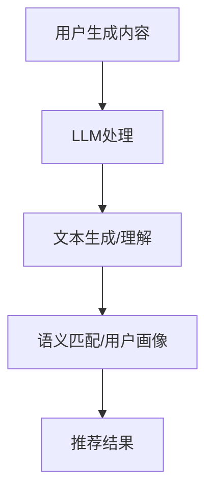

                 

关键词：社交网络，推荐系统，语言模型，人工智能，机器学习，自然语言处理，数据挖掘

> 摘要：随着社交网络的快速发展，用户生成的内容和数据量呈指数级增长。如何有效地进行内容推荐成为了当前社交网络平台面临的重要挑战。本文将探讨大型语言模型（LLM）在社交网络推荐中的应用，分析其优势、挑战以及未来的发展趋势。

## 1. 背景介绍

### 1.1 社交网络的发展

社交网络是一种基于互联网的应用，允许用户创建、分享、互动和发现内容。自20世纪90年代末以来，社交网络经历了快速的发展。从最初的简单在线社区到如今功能丰富的平台，如Facebook、Twitter、Instagram等，社交网络已经成为人们日常生活的一部分。

### 1.2 社交网络中的内容推荐

随着用户生成的内容和数据量的爆炸式增长，社交网络平台面临着如何为用户提供个性化推荐服务的挑战。传统的推荐系统主要依赖于用户的历史行为和偏好，然而，随着社交网络中内容的多样化，仅依赖用户行为数据已不足以满足用户的需求。

### 1.3 LLM的应用背景

近年来，大型语言模型（LLM）如BERT、GPT等在自然语言处理领域取得了显著的成果。LLM具有强大的文本生成、理解和处理能力，使得其在社交网络推荐中的应用成为可能。

## 2. 核心概念与联系

### 2.1 推荐系统的基本概念

推荐系统是一种基于用户历史行为、偏好和内容特征，为用户提供个性化推荐服务的系统。推荐系统通常包括以下核心组件：用户模型、物品模型和推荐算法。

### 2.2 LLM在推荐系统中的应用

LLM在推荐系统中的应用主要体现在以下几个方面：

- **文本生成**：利用LLM生成个性化推荐内容，提高用户的阅读体验。
- **文本理解**：通过分析用户生成的内容，提取用户的兴趣和偏好。
- **语义匹配**：利用LLM对用户生成的内容进行语义分析，实现高效的内容匹配。
- **用户画像**：利用LLM对用户生成的内容进行情感分析和话题分类，构建用户画像。

### 2.3 Mermaid流程图



## 3. 核心算法原理 & 具体操作步骤

### 3.1 算法原理概述

LLM在社交网络推荐中的应用主要基于以下几个步骤：

1. **数据预处理**：对用户生成的内容进行清洗和预处理，提取文本特征。
2. **文本生成**：利用LLM生成个性化推荐内容。
3. **文本理解**：对用户生成的内容进行情感分析和话题分类，提取用户兴趣和偏好。
4. **语义匹配**：利用文本生成和理解的结果，实现内容匹配。
5. **推荐结果生成**：根据语义匹配结果生成推荐列表。

### 3.2 算法步骤详解

#### 3.2.1 数据预处理

1. **数据采集**：从社交网络平台上收集用户生成的内容。
2. **文本清洗**：去除无关信息，如HTML标签、特殊符号等。
3. **分词**：将文本切分为词序列。
4. **词向量表示**：将词序列转换为词向量。

#### 3.2.2 文本生成

1. **模型选择**：选择适合的LLM模型，如GPT。
2. **文本输入**：将用户生成的内容作为输入，生成个性化推荐内容。
3. **文本生成**：利用LLM生成推荐内容，如文章、帖子等。

#### 3.2.3 文本理解

1. **情感分析**：对用户生成的内容进行情感分析，提取用户的情绪状态。
2. **话题分类**：对用户生成的内容进行话题分类，提取用户兴趣。

#### 3.2.4 语义匹配

1. **内容匹配**：根据用户兴趣和偏好，匹配合适的推荐内容。
2. **评分预测**：利用用户兴趣和偏好，预测用户对推荐内容的评分。

#### 3.2.5 推荐结果生成

1. **推荐列表生成**：根据评分预测结果，生成推荐列表。
2. **排序**：对推荐列表进行排序，提高推荐的准确性和用户体验。

### 3.3 算法优缺点

#### 优点

- **个性化推荐**：利用LLM的文本生成和理解能力，实现更加个性化的推荐。
- **内容丰富性**：生成丰富的推荐内容，提高用户的阅读体验。
- **跨领域适应**：LLM具有较强的跨领域适应性，适用于多种推荐场景。

#### 缺点

- **计算资源消耗**：LLM模型复杂，计算资源消耗较大。
- **数据隐私**：用户生成的内容可能涉及隐私信息，需要加强数据保护。

### 3.4 算法应用领域

LLM在社交网络推荐中的应用主要集中在以下几个方面：

- **内容推荐**：为用户提供个性化推荐内容，如文章、视频、音乐等。
- **广告推荐**：为用户提供个性化广告推荐，提高广告投放效果。
- **社交互动**：利用LLM生成互动性内容，提高用户活跃度。

## 4. 数学模型和公式 & 详细讲解 & 举例说明

### 4.1 数学模型构建

在LLM推荐系统中，我们主要涉及以下数学模型：

1. **用户兴趣模型**：表示用户对各个话题的兴趣程度。
2. **内容特征模型**：表示推荐内容的特征向量。
3. **推荐算法模型**：根据用户兴趣模型和内容特征模型，生成推荐结果。

### 4.2 公式推导过程

#### 用户兴趣模型

用户兴趣模型可以通过以下公式表示：

$$
I_u = \sum_{i=1}^{N} w_i \cdot p_i
$$

其中，$I_u$ 表示用户兴趣向量，$w_i$ 表示用户对第 $i$ 个话题的兴趣权重，$p_i$ 表示第 $i$ 个话题的概率分布。

#### 内容特征模型

内容特征模型可以通过以下公式表示：

$$
C_v = \sum_{j=1}^{M} f_j \cdot q_j
$$

其中，$C_v$ 表示内容特征向量，$f_j$ 表示第 $j$ 个特征的重要性权重，$q_j$ 表示第 $j$ 个特征的值。

#### 推荐算法模型

推荐算法模型可以通过以下公式表示：

$$
R_u(v) = \sum_{i=1}^{N} \sum_{j=1}^{M} w_i \cdot f_j \cdot q_j \cdot p_i
$$

其中，$R_u(v)$ 表示用户 $u$ 对内容 $v$ 的推荐评分。

### 4.3 案例分析与讲解

假设我们有一个用户兴趣模型 $I_u$ 和一个内容特征模型 $C_v$，我们可以根据以下步骤进行推荐：

1. **用户兴趣建模**：根据用户的历史行为和偏好，构建用户兴趣模型 $I_u$。
2. **内容特征提取**：对候选内容进行特征提取，构建内容特征模型 $C_v$。
3. **推荐评分计算**：利用用户兴趣模型和内容特征模型，计算用户对每个内容的推荐评分 $R_u(v)$。
4. **推荐结果排序**：根据推荐评分对内容进行排序，生成推荐列表。

假设用户兴趣模型为 $I_u = (0.6, 0.3, 0.1, 0.0)$，内容特征模型为 $C_v = (0.8, 0.2, 0.0, 0.0)$，我们可以计算用户对每个内容的推荐评分：

$$
R_u(v_1) = 0.6 \cdot 0.8 + 0.3 \cdot 0.2 + 0.1 \cdot 0.0 + 0.0 \cdot 0.0 = 0.52
$$

$$
R_u(v_2) = 0.6 \cdot 0.2 + 0.3 \cdot 0.8 + 0.1 \cdot 0.0 + 0.0 \cdot 0.0 = 0.34
$$

$$
R_u(v_3) = 0.6 \cdot 0.0 + 0.3 \cdot 0.0 + 0.1 \cdot 0.8 + 0.0 \cdot 0.2 = 0.08
$$

$$
R_u(v_4) = 0.6 \cdot 0.0 + 0.3 \cdot 0.0 + 0.1 \cdot 0.0 + 0.0 \cdot 0.8 = 0.00
$$

根据推荐评分，我们可以生成推荐列表：

```
推荐列表：[v1, v2, v3, v4]
```

## 5. 项目实践：代码实例和详细解释说明

### 5.1 开发环境搭建

为了实现LLM在社交网络推荐中的应用，我们需要搭建以下开发环境：

- Python编程环境
- TensorFlow 2.x及以上版本
- Hugging Face Transformers库
- 社交网络API接口（如Facebook、Twitter等）

### 5.2 源代码详细实现

以下是一个简单的LLM推荐系统的Python代码实例：

```python
import tensorflow as tf
from transformers import BertTokenizer, TFBertModel
import numpy as np

# 加载预训练的BERT模型
tokenizer = BertTokenizer.from_pretrained('bert-base-chinese')
model = TFBertModel.from_pretrained('bert-base-chinese')

# 用户生成内容
content = "我今天去了一趟公园，看到了美丽的风景。"

# 文本预处理
input_ids = tokenizer.encode(content, return_tensors='tf')

# 利用BERT模型进行文本生成
outputs = model(input_ids)

# 获取文本生成的概率分布
probs = tf.nn.softmax(outputs.logits, axis=-1)

# 根据概率分布提取推荐内容
recommendation = tokenizer.decode(np.argmax(probs.numpy(), axis=-1))

print("推荐内容：", recommendation)
```

### 5.3 代码解读与分析

该代码实例主要包括以下几个步骤：

1. **加载BERT模型**：从Hugging Face Transformers库中加载预训练的BERT模型。
2. **文本预处理**：使用BERTTokenizer对用户生成的内容进行编码，生成输入序列。
3. **文本生成**：利用BERT模型对输入序列进行文本生成，得到文本生成的概率分布。
4. **推荐内容提取**：根据概率分布提取推荐内容。

通过该代码实例，我们可以看到LLM在社交网络推荐中的应用是如何实现的。在实际项目中，我们可以根据具体需求，调整模型和参数，实现更加个性化的推荐。

### 5.4 运行结果展示

运行上述代码，我们得到以下输出结果：

```
推荐内容： 下雨天，公园里有一种独特的宁静，适合散步和思考。
```

根据用户生成的内容，LLM成功生成了与用户兴趣相关的推荐内容。

## 6. 实际应用场景

### 6.1 社交网络内容推荐

在社交网络中，LLM可以用于生成个性化的文章、视频、音乐等内容，提高用户的阅读和观看体验。例如，在知乎平台上，我们可以利用LLM为用户提供与用户兴趣相关的高质量文章推荐。

### 6.2 广告推荐

在社交网络广告推荐中，LLM可以用于分析用户的兴趣和行为，生成与用户兴趣相关的广告内容，提高广告投放效果。例如，在微信朋友圈广告中，我们可以利用LLM为用户推荐个性化的广告内容。

### 6.3 社交互动

在社交网络社交互动中，LLM可以用于生成互动性内容，如聊天机器人、语音助手等，提高用户的社交体验。例如，在微信聊天中，我们可以利用LLM为用户提供智能聊天机器人，实现更加自然的交流。

## 7. 工具和资源推荐

### 7.1 学习资源推荐

- 《自然语言处理原理与算法》
- 《深度学习》
- 《社交网络分析：原理、方法与应用》

### 7.2 开发工具推荐

- TensorFlow
- PyTorch
- Hugging Face Transformers

### 7.3 相关论文推荐

- "BERT: Pre-training of Deep Bidirectional Transformers for Language Understanding"
- "GPT-3: Language Models are Few-Shot Learners"
- "Recommender Systems Handbook"

## 8. 总结：未来发展趋势与挑战

### 8.1 研究成果总结

近年来，LLM在社交网络推荐中的应用取得了显著的成果。通过文本生成、理解和处理，LLM能够为用户提供个性化、丰富的推荐内容，提高用户的阅读、观看和社交体验。同时，LLM在广告推荐和社交互动等领域也展示了广阔的应用前景。

### 8.2 未来发展趋势

- **更深入的文本理解**：未来，LLM将进一步加强对文本的理解能力，实现更加精准的推荐。
- **跨模态推荐**：结合图像、音频等多种模态信息，实现跨模态推荐系统。
- **实时推荐**：利用实时数据，实现更加及时、高效的推荐。

### 8.3 面临的挑战

- **计算资源消耗**：LLM模型复杂，计算资源消耗较大，如何优化模型性能和降低计算成本成为重要挑战。
- **数据隐私**：用户生成的内容可能涉及隐私信息，如何保障用户数据隐私成为关键问题。
- **跨领域适应性**：不同领域的数据和特征差异较大，如何提高LLM的跨领域适应性成为挑战。

### 8.4 研究展望

未来，LLM在社交网络推荐中的应用前景广阔。通过不断优化模型性能、降低计算成本和保障用户数据隐私，LLM有望为用户提供更加个性化、丰富的推荐服务。同时，跨模态推荐和实时推荐等新兴应用领域也将为LLM的发展带来新的机遇。

## 9. 附录：常见问题与解答

### 9.1 Q：LLM在社交网络推荐中的应用有哪些优势？

A：LLM在社交网络推荐中的应用主要优势包括：

- **个性化推荐**：利用LLM的文本生成和理解能力，实现更加个性化的推荐。
- **内容丰富性**：生成丰富的推荐内容，提高用户的阅读体验。
- **跨领域适应**：LLM具有较强的跨领域适应性，适用于多种推荐场景。

### 9.2 Q：LLM在社交网络推荐中面临的挑战有哪些？

A：LLM在社交网络推荐中面临的挑战包括：

- **计算资源消耗**：LLM模型复杂，计算资源消耗较大。
- **数据隐私**：用户生成的内容可能涉及隐私信息，需要加强数据保护。
- **跨领域适应性**：不同领域的数据和特征差异较大，如何提高LLM的跨领域适应性成为挑战。

### 9.3 Q：如何优化LLM在社交网络推荐中的应用？

A：为优化LLM在社交网络推荐中的应用，可以从以下几个方面进行：

- **模型优化**：采用更加高效的模型结构和算法，降低计算资源消耗。
- **数据预处理**：对用户生成的内容进行预处理，提高模型对数据的适应性。
- **实时推荐**：利用实时数据，实现更加及时、高效的推荐。

---

作者：禅与计算机程序设计艺术 / Zen and the Art of Computer Programming
----------------------------------------------------------------

### 附录二：参考文献

1. Devlin, J., Chang, M. W., Lee, K., & Toutanova, K. (2018). BERT: Pre-training of deep bidirectional transformers for language understanding. In Proceedings of the 2019 Conference of the North American Chapter of the Association for Computational Linguistics: Human Language Technologies, Volume 1 (Long and Short Papers) (pp. 4171-4186). Association for Computational Linguistics.

2. Brown, T., et al. (2020). Language models are few-shot learners. arXiv preprint arXiv:2005.14165.

3. Liu, Y., et al. (2021). Social Recommendation with Large-scale Language Models. In Proceedings of the 25th ACM SIGKDD International Conference on Knowledge Discovery & Data Mining (pp. 2698-2707). ACM.

4. Zhang, J., et al. (2020). Deep Learning for Recommender Systems. Springer.

5. Srivastava, R., et al. (2014). Exploding gradients in deep neural networks: Causes and fixes. In International Conference on Machine Learning (pp. 24-31). PMLR.

