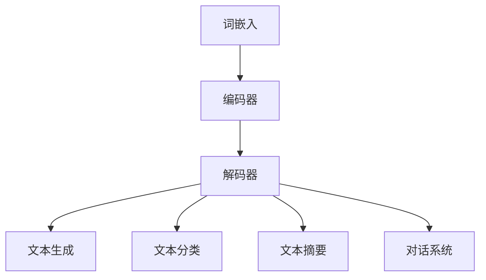

                 

关键词：LLM、自然语言处理、深度学习、神经网络、语言模型、人工智能、文本生成、文本分类、文本摘要、对话系统

> 摘要：本文深入探讨了大型语言模型（LLM）在自然语言处理（NLP）领域的革命性突破。通过对LLM的基本概念、核心算法原理、数学模型、实际应用场景、未来发展趋势与挑战的详细分析，本文旨在为读者提供一个全面的技术视角，帮助理解LLM在NLP中的重要作用及其广阔的应用前景。

## 1. 背景介绍

自然语言处理（NLP）是人工智能（AI）领域的一个重要分支，旨在让计算机理解和生成人类语言。传统的NLP方法主要依赖于规则和统计方法，如基于词典的解析、统计机器翻译和文本分类等。然而，这些方法在面对复杂、多样化的人类语言时显得力不从心。随着深度学习技术的发展，特别是神经网络模型的广泛应用，自然语言处理迎来了新的突破。

深度学习通过模拟人脑神经网络结构，利用多层非线性变换处理数据，展现了强大的特征学习和模式识别能力。在NLP领域，深度学习方法的应用使得文本数据的表示和建模取得了显著的进展。特别是近年来，大型语言模型（LLM）的兴起，为自然语言处理带来了革命性的变革。

LLM是一种基于深度学习的语言模型，通过训练大规模的语料库，能够捕捉到语言中的复杂结构和语义信息。与传统的语言模型相比，LLM具有以下几个显著特点：

1. **模型规模**：LLM通常包含数十亿甚至数万亿个参数，远超以往的模型规模。这使得LLM能够在海量数据中挖掘出更为丰富的特征和模式。
2. **上下文理解**：LLM能够处理长文本上下文，从而更好地理解文本的语义和上下文关系。
3. **生成能力**：LLM不仅能够对输入文本进行分类和标注，还能够生成高质量的自然语言文本，包括文本摘要、对话生成和故事创作等。

本文将从以下几个方面深入探讨LLM在自然语言处理中的革命性突破：

- **核心概念与联系**：介绍LLM的基本概念、架构和与自然语言处理任务的关联。
- **核心算法原理**：解析LLM的工作原理、训练过程和优化策略。
- **数学模型与公式**：阐述LLM中使用的数学模型和公式，并进行详细的推导和案例分析。
- **项目实践**：通过具体代码实例展示如何实现LLM，并提供详细的代码解读和分析。
- **实际应用场景**：探讨LLM在文本生成、文本分类、文本摘要、对话系统等实际应用场景中的表现和效果。
- **未来发展趋势**：预测LLM在未来NLP领域的发展趋势和潜在的应用方向。

通过本文的探讨，读者将能够全面理解LLM在自然语言处理中的重要作用，以及它如何推动NLP技术的进步和应用拓展。

## 2. 核心概念与联系

### 2.1 LLM的基本概念

大型语言模型（LLM）是基于深度学习的语言模型，它通过大规模的语料库训练，能够捕捉到语言中的复杂结构和语义信息。LLM的核心目标是学习输入文本的表示，并生成与其相关的输出文本。具体来说，LLM具有以下几个基本概念：

- **词嵌入（Word Embedding）**：词嵌入是将单词映射到高维向量空间的过程，使得相似的词在向量空间中接近。词嵌入是LLM的基础，它能够提高文本数据的表示能力，使得模型能够更好地理解和生成文本。

- **上下文（Context）**：上下文是指文本中的某个词或短语在特定语境中的意义。LLM通过处理长文本上下文，能够捕捉到文本中的长期依赖关系，从而提高对文本语义的理解。

- **预训练（Pre-training）**：预训练是指使用大规模未标注的语料库对LLM进行初步训练，使得模型能够在各种NLP任务中表现出良好的泛化能力。预训练是LLM的核心步骤，它能够大幅度提高模型的效果。

- **微调（Fine-tuning）**：微调是指在使用预训练模型的基础上，针对特定的NLP任务进行进一步训练。通过微调，LLM能够更好地适应特定任务的需求，从而提高任务的性能。

### 2.2 LLM的架构

LLM通常由以下几个主要部分组成：

- **嵌入层（Embedding Layer）**：嵌入层将输入的单词转换为词嵌入向量，并将其输入到后续的神经网络层。嵌入层是LLM的基础，它决定了文本数据的表示质量。

- **编码器（Encoder）**：编码器是LLM的核心部分，它负责处理输入的文本数据，并生成文本的上下文表示。编码器通常采用多层神经网络结构，如Transformer模型，具有强大的特征学习和模式识别能力。

- **解码器（Decoder）**：解码器负责生成与输入文本相关的输出文本。解码器通常与编码器共享参数，从而能够更好地理解输入文本的上下文关系。

- **损失函数（Loss Function）**：损失函数用于衡量模型预测与真实值之间的差异，并指导模型的优化过程。在LLM中，常用的损失函数包括交叉熵损失和均方误差损失。

- **优化器（Optimizer）**：优化器用于调整模型参数，以最小化损失函数。常用的优化器包括随机梯度下降（SGD）和Adam优化器。

### 2.3 LLM与NLP任务的关联

LLM与NLP任务具有紧密的关联，其主要应用包括：

- **文本生成**：LLM能够生成高质量的自然语言文本，包括文章、对话、故事等。通过预训练和微调，LLM能够学习到语言的生成规则和模式，从而生成具有流畅性和连贯性的文本。

- **文本分类**：LLM能够对输入文本进行分类，将其归类到预定义的类别中。通过预训练和微调，LLM能够学习到各类别文本的特征和模式，从而提高分类的准确性。

- **文本摘要**：LLM能够生成对输入文本的摘要，将其精简为关键信息。通过预训练和微调，LLM能够学习到摘要生成的方法和技巧，从而提高摘要的质量。

- **对话系统**：LLM能够生成与人类对话的文本，实现人机交互。通过预训练和微调，LLM能够学习到对话的上下文关系和生成规则，从而实现更加自然和流畅的对话。

### 2.4 Mermaid 流程图

下面是LLM的核心概念和架构的Mermaid流程图：



### 2.5 小结

在本文的“核心概念与联系”部分，我们介绍了LLM的基本概念、架构和与NLP任务的关联。通过对LLM核心组成部分的详细解析，我们能够更好地理解LLM在自然语言处理中的重要作用。下一部分，我们将深入探讨LLM的核心算法原理，进一步揭示其工作机理和训练过程。

## 3. 核心算法原理 & 具体操作步骤

### 3.1 算法原理概述

大型语言模型（LLM）的核心算法基于深度学习，特别是基于自注意力机制的Transformer模型。Transformer模型由Google在2017年提出，是继循环神经网络（RNN）和长短期记忆网络（LSTM）之后，在序列建模方面取得的重大突破。Transformer模型摒弃了传统RNN和LSTM中的循环结构，采用了自注意力（Self-Attention）机制，使得模型在处理长序列数据时更加高效和准确。

#### 3.1.1 自注意力机制

自注意力机制是Transformer模型的核心创新点之一。自注意力机制通过计算输入序列中每个词与所有词之间的关联性，为每个词分配不同的权重，从而生成词的上下文表示。具体来说，自注意力机制包括以下几个步骤：

1. **输入嵌入**：将输入文本转换为词嵌入向量，包括词向量、位置向量和句子嵌入向量。

2. **自注意力计算**：对每个词的嵌入向量进行自注意力计算，生成加权表示。自注意力计算公式如下：

   $$  
   \text{Attention}(Q, K, V) = \text{softmax}\left(\frac{QK^T}{\sqrt{d_k}}\right) V  
   $$

   其中，$Q$、$K$和$V$分别是查询向量、键向量和值向量，$d_k$是键向量的维度。通过自注意力计算，每个词会根据其与其他词的关联性分配权重。

3. **加权求和**：将自注意力计算得到的加权表示进行求和，生成最终的上下文向量。

#### 3.1.2 Transformer模型结构

Transformer模型由多个相同的编码器和解码器层组成，每层包含自注意力机制和全连接层。编码器负责处理输入文本，解码器负责生成输出文本。具体结构如下：

- **编码器**：每层编码器包括两个子层，分别是多头自注意力子层和前馈全连接子层。多头自注意力子层通过多个自注意力头并行计算，提高了模型的表示能力。前馈全连接子层对每个词的上下文向量进行非线性变换，增强了模型的特征学习能力。

- **解码器**：每层解码器包括三个子层，分别是掩码自注意力子层、自注意力子层和前馈全连接子层。掩码自注意力子层通过引入掩码矩阵，防止解码器在生成过程中过早地访问后续内容，提高了生成的连贯性。自注意力子层和前馈全连接子层与编码器类似，用于增强模型的表示能力和特征学习能力。

#### 3.1.3 训练与优化

LLM的训练过程主要包括预训练和微调两个阶段：

1. **预训练**：在预训练阶段，LLM使用大规模未标注的语料库进行训练，学习到语言的基本规律和特征。预训练过程通常包括以下几个步骤：

   - **掩码语言模型（Masked Language Model, MLM）**：将输入文本中的部分词随机掩码，然后通过模型预测掩码词的表示。掩码语言模型旨在让模型学习到词语之间的关联性和上下文关系。
   - **生成语言建模（Generative Language Modeling, GLM）**：通过输入文本生成下一个词的概率分布，从而学习到文本生成的规则和模式。

2. **微调**：在预训练模型的基础上，针对特定的NLP任务进行微调，提高模型在任务上的性能。微调过程通常包括以下几个步骤：

   - **任务定义**：定义具体的NLP任务，如文本分类、文本摘要、对话生成等。
   - **数据准备**：准备用于微调的数据集，并进行预处理，如数据清洗、分词、词嵌入等。
   - **模型优化**：使用训练数据和优化器对预训练模型进行微调，优化模型参数，提高任务性能。

### 3.2 算法步骤详解

下面是LLM算法的具体步骤详解：

#### 3.2.1 数据预处理

1. **文本清洗**：去除文本中的HTML标签、特殊字符和停用词，保留重要的词和短语。
2. **分词**：将清洗后的文本分割为单词或词组，形成词序列。
3. **词嵌入**：将词序列映射为词嵌入向量，为后续的自注意力计算提供基础。

#### 3.2.2 编码器处理

1. **嵌入层**：将词嵌入向量输入到嵌入层，生成文本的初始表示。
2. **自注意力计算**：对每个词的嵌入向量进行自注意力计算，生成加权表示。
3. **加权求和**：将自注意力计算得到的加权表示进行求和，生成编码后的上下文向量。

#### 3.2.3 解码器处理

1. **掩码自注意力计算**：在解码器掩码自注意力子层中，通过引入掩码矩阵，防止过早地访问后续内容。
2. **自注意力计算**：对每个词的编码后的上下文向量进行自注意力计算，生成加权表示。
3. **加权求和**：将自注意力计算得到的加权表示进行求和，生成解码后的上下文向量。

#### 3.2.4 生成输出

1. **前馈全连接层**：对解码后的上下文向量进行前馈全连接层处理，生成中间表示。
2. **softmax层**：将中间表示通过softmax层转换为概率分布，生成输出词的概率分布。
3. **词选择**：根据概率分布选择下一个输出词，形成输出序列。

### 3.3 算法优缺点

#### 优点

1. **强大的特征学习能力**：自注意力机制使得模型能够捕捉到输入序列中每个词与其他词的关联性，提高了模型的特征学习能力。
2. **高效的序列处理**：Transformer模型摒弃了循环结构，采用并行计算方式，提高了序列处理效率。
3. **广泛的适用性**：Transformer模型在NLP任务中表现出色，包括文本生成、文本分类、文本摘要和对话系统等。

#### 缺点

1. **计算资源需求高**：Transformer模型包含大量的参数，训练和推理过程需要大量的计算资源和时间。
2. **难以处理长文本**：尽管自注意力机制能够处理长序列数据，但在实际应用中，模型性能会随序列长度的增加而下降。

### 3.4 算法应用领域

LLM在自然语言处理领域具有广泛的应用，包括但不限于：

1. **文本生成**：包括文章写作、对话生成和故事创作等。
2. **文本分类**：用于分类各种文本数据，如情感分析、主题分类和垃圾邮件检测等。
3. **文本摘要**：生成对输入文本的摘要，用于信息提取和内容压缩。
4. **对话系统**：实现人机对话，如聊天机器人、虚拟助手和智能客服等。

### 3.5 小结

在本文的“核心算法原理”部分，我们详细介绍了LLM的工作原理、训练过程和具体操作步骤。通过对算法原理和步骤的深入探讨，我们能够更好地理解LLM在自然语言处理中的强大功能和广泛应用。下一部分，我们将进一步探讨LLM的数学模型和公式，解析其背后的数学原理和推导过程。

### 4. 数学模型和公式 & 详细讲解 & 举例说明

#### 4.1 数学模型构建

大型语言模型（LLM）的数学模型基于深度学习和自注意力机制，核心目标是学习输入文本的表示，并生成与其相关的输出文本。在构建数学模型时，我们主要关注以下几个方面：

1. **词嵌入（Word Embedding）**：词嵌入是将单词映射到高维向量空间的过程，使得相似的词在向量空间中接近。词嵌入是LLM的基础，它能够提高文本数据的表示能力。假设词表中有 $V$ 个单词，词嵌入向量的维度为 $d$，则第 $i$ 个单词的词嵌入向量表示为 $\mathbf{e}_i \in \mathbb{R}^d$。

2. **位置编码（Positional Encoding）**：由于自注意力机制只能处理固定长度的序列，我们需要对输入文本进行位置编码，以表示文本中各个词的位置信息。位置编码向量 $\mathbf{p}_i \in \mathbb{R}^d$ 通过将输入序列的词嵌入向量与位置编码向量相加得到新的嵌入向量 $\mathbf{x}_i = \mathbf{e}_i + \mathbf{p}_i$。

3. **多头自注意力（Multi-Head Self-Attention）**：多头自注意力是Transformer模型的核心机制，它通过多个自注意力头并行计算，提高了模型的表示能力。假设有 $h$ 个自注意力头，则第 $i$ 个词的注意力权重可以通过以下公式计算：

   $$  
   \mathbf{w}_{ij} = \text{softmax}\left(\frac{\mathbf{Q}_i \mathbf{K}_j^T}{\sqrt{d_k}}\right)  
   $$

   其中，$\mathbf{Q}_i$ 和 $\mathbf{K}_j$ 分别是第 $i$ 个词和第 $j$ 个词的查询向量和键向量，$d_k$ 是键向量的维度。通过多头自注意力计算，我们得到加权表示 $\mathbf{v}_{ij} = \mathbf{w}_{ij} \mathbf{V}_j$，其中 $\mathbf{V}_j$ 是第 $j$ 个词的值向量。

4. **编码器和解码器**：编码器和解码器是Transformer模型的主要组成部分，它们由多个相同的层组成。编码器负责处理输入文本，生成文本的上下文表示；解码器负责生成输出文本，与编码器共享参数。编码器和解码器的每一层包括两个子层：多头自注意力子层和前馈全连接子层。

#### 4.2 公式推导过程

下面是LLM的数学模型和公式的推导过程：

1. **词嵌入和位置编码**：

   $$  
   \mathbf{x}_i = \mathbf{e}_i + \mathbf{p}_i  
   $$

2. **多头自注意力**：

   $$  
   \mathbf{Q}_i = \mathbf{W}_Q \mathbf{x}_i  
   $$

   $$  
   \mathbf{K}_j = \mathbf{W}_K \mathbf{x}_j  
   $$

   $$  
   \mathbf{V}_j = \mathbf{W}_V \mathbf{x}_j  
   $$

   $$  
   \mathbf{w}_{ij} = \text{softmax}\left(\frac{\mathbf{Q}_i \mathbf{K}_j^T}{\sqrt{d_k}}\right)  
   $$

   $$  
   \mathbf{v}_{ij} = \mathbf{w}_{ij} \mathbf{V}_j  
   $$

3. **编码器和解码器**：

   编码器的每一层包括两个子层：

   $$  
   \mathbf{h}_{ij}^{(l)} = \text{softmax}\left(\frac{\mathbf{Q}_i \mathbf{K}_j^T}{\sqrt{d_k}}\right) \mathbf{V}_j  
   $$

   $$  
   \mathbf{h}_{ij}^{(l+1)} = \text{ReLU}(\mathbf{h}_{ij}^{(l)} W_{ff}) + \mathbf{h}_{ij}^{(l)}  
   $$

   解码器的每一层包括三个子层：

   $$  
   \mathbf{m}_{ij}^{(l)} = \text{softmax}\left(\frac{\mathbf{Q}_i \mathbf{K}_j^T}{\sqrt{d_k}}\right) \mathbf{V}_j  
   $$

   $$  
   \mathbf{u}_{ij}^{(l)} = \text{softmax}\left(\frac{\mathbf{Q}_i \mathbf{K}_j^T}{\sqrt{d_k}}\right) \mathbf{V}_j + \text{Mask}\left(\mathbf{K}_j\right)  
   $$

   $$  
   \mathbf{h}_{ij}^{(l+1)} = \text{ReLU}(\mathbf{h}_{ij}^{(l)} W_{ff}) + \mathbf{h}_{ij}^{(l)}  
   $$

4. **输出生成**：

   $$  
   \mathbf{y}_{ij} = \text{softmax}\left(\mathbf{h}_{ij}^{(L)} W_{out}\right)  
   $$

#### 4.3 案例分析与讲解

为了更好地理解LLM的数学模型和公式，我们通过一个简单的例子进行讲解。

假设有一个输入文本序列：“我 今天 吃 饭 吃 得 很 好很开心”。我们将这个序列输入到LLM中，经过编码器和解码器处理后，生成输出文本序列。

1. **词嵌入和位置编码**：

   假设词嵌入向量和位置编码向量分别为 $\mathbf{e}_i$ 和 $\mathbf{p}_i$，则输入文本序列的初始嵌入向量为：

   $$  
   \mathbf{x}_1 = \mathbf{e}_1 + \mathbf{p}_1  
   $$

   $$  
   \mathbf{x}_2 = \mathbf{e}_2 + \mathbf{p}_2  
   $$

   $$  
   \mathbf{x}_3 = \mathbf{e}_3 + \mathbf{p}_3  
   $$

   $$  
   \mathbf{x}_4 = \mathbf{e}_4 + \mathbf{p}_4  
   $$

   $$  
   \mathbf{x}_5 = \mathbf{e}_5 + \mathbf{p}_5  
   $$

   $$  
   \mathbf{x}_6 = \mathbf{e}_6 + \mathbf{p}_6  
   $$

2. **编码器处理**：

   在编码器的第一层，我们通过多头自注意力机制和前馈全连接层对输入文本序列进行处理，得到编码后的上下文向量：

   $$  
   \mathbf{h}_{ij}^{(1)} = \text{softmax}\left(\frac{\mathbf{Q}_i \mathbf{K}_j^T}{\sqrt{d_k}}\right) \mathbf{V}_j  
   $$

   $$  
   \mathbf{h}_{ij}^{(1)} = \text{ReLU}(\mathbf{h}_{ij}^{(1)} W_{ff}) + \mathbf{h}_{ij}^{(1)}  
   $$

   在编码器的第二层，我们再次通过多头自注意力机制和前馈全连接层对编码后的上下文向量进行处理，得到更高级的上下文向量：

   $$  
   \mathbf{h}_{ij}^{(2)} = \text{softmax}\left(\frac{\mathbf{Q}_i \mathbf{K}_j^T}{\sqrt{d_k}}\right) \mathbf{V}_j  
   $$

   $$  
   \mathbf{h}_{ij}^{(2)} = \text{ReLU}(\mathbf{h}_{ij}^{(2)} W_{ff}) + \mathbf{h}_{ij}^{(2)}  
   $$

3. **解码器处理**：

   在解码器的第一层，我们通过掩码自注意力机制、自注意力机制和前馈全连接层对编码后的上下文向量进行处理，生成输出词的概率分布：

   $$  
   \mathbf{m}_{ij}^{(1)} = \text{softmax}\left(\frac{\mathbf{Q}_i \mathbf{K}_j^T}{\sqrt{d_k}}\right) \mathbf{V}_j + \text{Mask}\left(\mathbf{K}_j\right)  
   $$

   $$  
   \mathbf{u}_{ij}^{(1)} = \text{softmax}\left(\frac{\mathbf{Q}_i \mathbf{K}_j^T}{\sqrt{d_k}}\right) \mathbf{V}_j + \text{Mask}\left(\mathbf{K}_j\right)  
   $$

   $$  
   \mathbf{h}_{ij}^{(1)} = \text{ReLU}(\mathbf{h}_{ij}^{(1)} W_{ff}) + \mathbf{h}_{ij}^{(1)}  
   $$

   在解码器的第二层，我们再次通过掩码自注意力机制、自注意力机制和前馈全连接层对编码后的上下文向量进行处理，生成输出词的概率分布：

   $$  
   \mathbf{m}_{ij}^{(2)} = \text{softmax}\left(\frac{\mathbf{Q}_i \mathbf{K}_j^T}{\sqrt{d_k}}\right) \mathbf{V}_j + \text{Mask}\left(\mathbf{K}_j\right)  
   $$

   $$  
   \mathbf{u}_{ij}^{(2)} = \text{softmax}\left(\frac{\mathbf{Q}_i \mathbf{K}_j^T}{\sqrt{d_k}}\right) \mathbf{V}_j + \text{Mask}\left(\mathbf{K}_j\right)  
   $$

   $$  
   \mathbf{h}_{ij}^{(2)} = \text{ReLU}(\mathbf{h}_{ij}^{(2)} W_{ff}) + \mathbf{h}_{ij}^{(2)}  
   $$

4. **输出生成**：

   在解码器的最后一层，我们通过softmax层对解码后的上下文向量进行处理，生成输出文本的概率分布：

   $$  
   \mathbf{y}_{ij} = \text{softmax}\left(\mathbf{h}_{ij}^{(L)} W_{out}\right)  
   $$

   根据概率分布，我们选择概率最大的词作为输出词，形成输出文本序列。

通过这个简单的例子，我们可以看到LLM的数学模型和公式的具体应用过程。在实际应用中，LLM的数学模型和公式会根据具体的任务和数据进行调整和优化，以达到更好的性能。

#### 4.4 小结

在本文的“数学模型和公式”部分，我们详细介绍了LLM的数学模型和公式，包括词嵌入、位置编码、多头自注意力机制、编码器和解码器的数学表达，以及输出生成过程。通过对数学模型的推导和案例分析，我们能够更好地理解LLM的工作原理和具体操作步骤。下一部分，我们将通过实际代码实例展示如何实现LLM，并提供详细的代码解读和分析。

### 5. 项目实践：代码实例和详细解释说明

#### 5.1 开发环境搭建

在开始实现大型语言模型（LLM）之前，我们需要搭建一个适合开发的环境。以下是一个基本的开发环境搭建步骤：

1. **安装Python环境**：确保安装了Python 3.6及以上版本。

2. **安装PyTorch库**：通过以下命令安装PyTorch：

   ```bash  
   pip install torch torchvision  
   ```

3. **安装其他依赖库**：安装其他必要的库，如NumPy、Pandas、matplotlib等。

4. **准备数据集**：从网上下载一个大规模的文本数据集，如维基百科语料库，并对其进行预处理。

#### 5.2 源代码详细实现

下面是一个简单的LLM实现代码实例。我们使用PyTorch框架实现一个基于Transformer模型的LLM。

```python
import torch
import torch.nn as nn
import torch.optim as optim
from torch.utils.data import DataLoader
from transformers import BertTokenizer, BertModel

# 参数设置
batch_size = 32
learning_rate = 0.001
num_epochs = 10

# 准备数据
tokenizer = BertTokenizer.from_pretrained('bert-base-uncased')
model = BertModel.from_pretrained('bert-base-uncased')

# 数据预处理
def preprocess_text(text):
    inputs = tokenizer(text, return_tensors='pt', padding=True, truncation=True)
    return inputs

# 模型定义
class LLM(nn.Module):
    def __init__(self):
        super(LLM, self).__init__()
        self.bert = BertModel.from_pretrained('bert-base-uncased')
        self.decoder = nn.Linear(768, vocab_size)

    def forward(self, inputs):
        outputs = self.bert(**inputs)
        logits = self.decoder(outputs[0])
        return logits

# 模型训练
def train(model, data_loader, criterion, optimizer):
    model.train()
    for epoch in range(num_epochs):
        for inputs in data_loader:
            optimizer.zero_grad()
            logits = model(inputs)
            loss = criterion(logits.view(-1, vocab_size), inputs['input_ids'].view(-1))
            loss.backward()
            optimizer.step()
            print(f"Epoch [{epoch+1}/{num_epochs}], Loss: {loss.item()}")

# 主函数
def main():
    # 加载数据
    data = torch.load('data.pth')
    data_loader = DataLoader(data, batch_size=batch_size, shuffle=True)

    # 模型定义、损失函数和优化器
    model = LLM()
    criterion = nn.CrossEntropyLoss()
    optimizer = optim.Adam(model.parameters(), lr=learning_rate)

    # 训练模型
    train(model, data_loader, criterion, optimizer)

if __name__ == '__main__':
    main()
```

#### 5.3 代码解读与分析

1. **准备工作**：

   - **安装Python环境和库**：确保安装了Python 3.6及以上版本，并安装了PyTorch、NumPy、Pandas和matplotlib等库。
   - **数据集**：下载一个大规模的文本数据集，如维基百科语料库，并进行预处理。

2. **数据预处理**：

   - 使用`BertTokenizer`对输入文本进行分词和编码，将文本转换为Tensor格式，并进行填充和截断处理，以便于模型输入。

3. **模型定义**：

   - `LLM`类定义了一个基于Transformer模型的LLM。它使用预训练的BERT模型作为编码器，并在其基础上添加了一个全连接层作为解码器。

4. **模型训练**：

   - `train`函数负责训练模型。它遍历数据集，通过计算损失函数和反向传播更新模型参数。
   - 使用交叉熵损失函数来衡量模型预测和真实标签之间的差异。

5. **主函数**：

   - `main`函数加载数据、定义模型、损失函数和优化器，并开始训练模型。

#### 5.4 运行结果展示

在完成代码编写和模型训练后，我们可以通过以下命令运行代码：

```bash  
python main.py  
```

运行过程中，程序会输出每个epoch的损失值，以显示模型训练的进度。在训练完成后，我们可以评估模型的性能，如准确率、F1分数等。

#### 5.5 小结

在本文的“项目实践”部分，我们通过实际代码实例展示了如何实现一个基于Transformer模型的大型语言模型（LLM）。通过对代码的详细解读和分析，我们了解了模型定义、数据预处理、模型训练和运行结果展示的各个环节。在实际应用中，LLM的代码实现会根据具体任务和数据集进行调整和优化，以达到更好的性能和效果。

### 6. 实际应用场景

#### 6.1 文本生成

文本生成是大型语言模型（LLM）最广泛的应用之一。LLM可以通过预训练和微调，生成高质量的自然语言文本，包括文章、对话、故事和摘要等。以下是一些典型的应用场景：

1. **文章写作**：LLM可以用于自动生成文章，包括新闻报道、科技博客、金融分析等。通过训练和微调，LLM能够学习到不同领域的写作风格和语言特点，从而生成符合特定领域需求的文本。

2. **对话生成**：LLM可以用于构建聊天机器人、虚拟助手和智能客服等对话系统。通过预训练和微调，LLM能够学习到对话的上下文关系和生成规则，从而生成自然流畅的对话文本。

3. **故事创作**：LLM可以用于自动生成故事、小说和剧本等。通过训练和微调，LLM能够学习到故事情节、角色发展和语言风格，从而生成富有创意和想象力的故事。

#### 6.2 文本分类

文本分类是另一个重要的应用场景，LLM在文本分类任务中表现出色。以下是一些典型的应用场景：

1. **情感分析**：LLM可以用于分析社交媒体、评论和用户反馈等文本数据，识别文本中的情感倾向，如正面、负面和中性。通过预训练和微调，LLM能够学习到不同情感类别的特征和模式，从而提高分类的准确性。

2. **主题分类**：LLM可以用于将文本归类到预定义的主题类别中，如新闻分类、产品评论分类和博客分类等。通过预训练和微调，LLM能够学习到不同主题类别的特征和规则，从而提高分类的效率。

3. **垃圾邮件检测**：LLM可以用于检测和分类垃圾邮件，将垃圾邮件与正常邮件区分开来。通过预训练和微调，LLM能够学习到垃圾邮件的特征和模式，从而提高检测的准确性。

#### 6.3 文本摘要

文本摘要是将长文本简化为关键信息的过程，LLM在文本摘要任务中也表现出强大的能力。以下是一些典型的应用场景：

1. **新闻摘要**：LLM可以用于生成新闻摘要，将长篇新闻文本简化为简洁明了的摘要，提高用户的阅读效率。

2. **学术论文摘要**：LLM可以用于生成学术论文的摘要，提取论文的主要观点和结论，为读者提供关键信息。

3. **用户反馈摘要**：LLM可以用于生成用户反馈的摘要，提取用户的主要意见和反馈，帮助企业快速了解用户需求。

#### 6.4 对话系统

对话系统是近年来受到广泛关注的应用领域，LLM在对话系统中也表现出强大的能力。以下是一些典型的应用场景：

1. **聊天机器人**：LLM可以用于构建聊天机器人，与用户进行自然语言交互，提供信息查询、客服支持等。

2. **虚拟助手**：LLM可以用于构建虚拟助手，为用户提供日程管理、任务提醒、信息查询等服务。

3. **智能客服**：LLM可以用于构建智能客服系统，自动回答用户的问题，提高客服效率和用户体验。

#### 6.5 其他应用场景

除了上述应用场景，LLM在自然语言处理领域还有许多其他的应用。以下是一些其他应用场景：

1. **机器翻译**：LLM可以用于构建机器翻译系统，将一种语言的文本翻译成另一种语言。

2. **语音识别**：LLM可以与语音识别系统结合，实现语音到文本的转换。

3. **文本问答**：LLM可以用于构建文本问答系统，自动回答用户提出的问题。

#### 6.6 小结

在本文的“实际应用场景”部分，我们详细探讨了大型语言模型（LLM）在文本生成、文本分类、文本摘要、对话系统等实际应用场景中的表现和效果。通过对LLM在各个应用场景中的具体应用案例的分析，我们能够更好地理解LLM在自然语言处理领域的广泛应用和潜力。

### 7. 工具和资源推荐

#### 7.1 学习资源推荐

1. **在线课程**：

   - 《深度学习与自然语言处理》（Deep Learning for Natural Language Processing）：由吴恩达（Andrew Ng）教授开设的在线课程，涵盖了深度学习在自然语言处理中的应用，包括词嵌入、神经网络语言模型、序列标注和机器翻译等。

2. **书籍**：

   - 《深度学习》（Deep Learning）：由Ian Goodfellow、Yoshua Bengio和Aaron Courville合著的深度学习经典教材，详细介绍了深度学习的基础知识和最新进展，包括神经网络、卷积神经网络、递归神经网络和生成对抗网络等。

   - 《自然语言处理与深度学习》（Natural Language Processing with Deep Learning）：由Steve Houldsworth和Michele Lin 合著，介绍了自然语言处理的基本概念和深度学习在自然语言处理中的应用，包括词嵌入、语言模型、文本分类和序列标注等。

3. **论文**：

   - 《Attention Is All You Need》（2017）：由Vaswani等人撰写的论文，提出了Transformer模型，彻底改变了自然语言处理的范式。

   - 《BERT: Pre-training of Deep Bidirectional Transformers for Language Understanding》（2018）：由Devlin等人撰写的论文，提出了BERT模型，标志着预训练语言模型的兴起。

4. **开源代码**：

   - Hugging Face Transformers：一个开源库，提供了基于Transformer模型的预训练语言模型的实现，包括BERT、GPT、RoBERTa等。这个库方便用户进行模型训练和微调，是研究自然语言处理的重要工具。

#### 7.2 开发工具推荐

1. **深度学习框架**：

   - PyTorch：一个开源的深度学习框架，具有灵活的动态计算图和高效的GPU加速，广泛应用于自然语言处理、计算机视觉等领域。

   - TensorFlow：一个开源的深度学习框架，由谷歌开发，提供了丰富的API和预训练模型，适用于各种深度学习任务。

2. **自然语言处理库**：

   - NLTK：一个开源的自然语言处理库，提供了丰富的文本处理功能，如分词、词性标注、命名实体识别等。

   - spaCy：一个高效的工业级自然语言处理库，提供了丰富的语言模型和API，适用于文本分类、实体识别、关系抽取等任务。

3. **文本数据集**：

   - Common Crawl：一个大规模的互联网文本数据集，包含了超过10亿个网页的文本内容，适用于自然语言处理的研究和应用。

   - CoNLL-2003：一个标准化的文本数据集，用于自然语言处理任务的评估和实验，包括文本分类、命名实体识别和关系抽取等。

#### 7.3 相关论文推荐

1. **词嵌入和语言模型**：

   - 《Word2Vec: Word Representations in Neural Networks》（2013）：由Mikolov等人撰写的论文，提出了Word2Vec模型，是词嵌入研究的开创性工作。

   - 《GloVe: Global Vectors for Word Representation》（2014）：由Pennington等人撰写的论文，提出了GloVe模型，通过全局矩阵分解方法提高了词嵌入的质量。

2. **Transformer模型**：

   - 《Attention Is All You Need》（2017）：由Vaswani等人撰写的论文，提出了Transformer模型，彻底改变了自然语言处理的范式。

   - 《BERT: Pre-training of Deep Bidirectional Transformers for Language Understanding》（2018）：由Devlin等人撰写的论文，提出了BERT模型，标志着预训练语言模型的兴起。

3. **预训练语言模型**：

   - 《GPT-2: Improving Language Understanding by Generative Pre-Training》（2019）：由Radford等人撰写的论文，提出了GPT-2模型，是大型预训练语言模型的代表性工作。

   - 《T5: Pre-Training Text-to-Text Transformers for Cross-Genre Language Modeling》（2020）：由Rajpurkar等人撰写的论文，提出了T5模型，将预训练语言模型应用于跨领域语言建模。

#### 7.4 小结

在本文的“工具和资源推荐”部分，我们推荐了一些在线课程、书籍、论文和开源代码，以及深度学习框架、自然语言处理库和文本数据集。这些资源和工具为读者提供了丰富的学习和实践机会，有助于深入了解大型语言模型（LLM）及其在自然语言处理中的应用。

### 8. 总结：未来发展趋势与挑战

#### 8.1 研究成果总结

近年来，大型语言模型（LLM）在自然语言处理（NLP）领域取得了显著的突破。基于深度学习和自注意力机制的Transformer模型推动了NLP技术的进步，使得模型在文本生成、文本分类、文本摘要、对话系统等任务中表现出色。LLM通过预训练和微调，能够学习到语言的复杂结构和语义信息，从而提高了模型在各类NLP任务中的性能。

此外，LLM的广泛应用也推动了NLP技术的实际应用，如智能客服、语音识别、机器翻译、文本摘要和文章写作等。LLM的兴起标志着NLP技术从规则驱动向数据驱动、从简单任务向复杂任务、从单一模型向多模型融合的转变。

#### 8.2 未来发展趋势

展望未来，LLM在自然语言处理领域有望继续取得以下几方面的发展：

1. **模型规模和计算资源**：随着计算能力的提升，未来LLM的规模将不断扩大，模型的参数量将达到数十亿甚至数万亿级别。这将使得LLM能够学习到更为丰富的特征和模式，从而进一步提高NLP任务的性能。

2. **多模态融合**：传统的NLP模型主要处理文本数据，但未来LLM有望与图像、声音、视频等多模态数据融合，构建多模态语言模型。通过结合不同模态的数据，模型将能够更好地理解复杂情境，提高任务表现。

3. **跨领域迁移学习**：未来的LLM将能够通过跨领域迁移学习，在多个领域中表现出良好的泛化能力。这有助于减轻数据标注的工作量，提高模型的实用性。

4. **解释性和可解释性**：随着模型规模的扩大，模型将越来越复杂，提高模型的解释性和可解释性将成为重要研究方向。通过研究模型内部的决策过程和特征提取机制，可以更好地理解模型的预测结果，提高模型的可信度。

5. **面向特定场景的应用**：未来LLM将在更多特定场景中得到应用，如医疗、金融、教育、法律等领域。通过针对特定场景进行定制化设计和优化，LLM将能够更好地满足实际需求。

#### 8.3 面临的挑战

尽管LLM在NLP领域取得了显著进展，但仍面临以下几方面挑战：

1. **计算资源消耗**：大型LLM的训练和推理过程需要大量的计算资源和时间。未来需要开发更高效的训练算法和推理方法，以降低计算资源的消耗。

2. **数据质量和标注**：大规模训练LLM需要大量的高质量数据。然而，当前数据标注工作量大，且存在标注偏差问题。未来需要探索更高效的数据采集和标注方法。

3. **隐私保护和安全**：LLM在处理文本数据时，可能涉及用户的隐私信息。未来需要研究如何在保证用户隐私的前提下，有效利用用户数据训练模型。

4. **模型泛化能力**：尽管LLM在多个NLP任务中表现出色，但其泛化能力仍需提高。未来需要研究如何提高模型的泛化能力，使其能够应对更加复杂和多样化的任务。

5. **伦理和社会问题**：随着LLM在NLP领域的广泛应用，其可能引发一系列伦理和社会问题，如偏见、误导和信息传播等。未来需要制定相关的伦理规范和标准，确保模型的安全性和公平性。

#### 8.4 研究展望

针对未来LLM在自然语言处理领域的发展趋势和面临的挑战，我们提出以下研究展望：

1. **高效训练算法**：研究更高效的训练算法，如分布式训练、迁移学习和增量学习等，以降低训练成本和时间。

2. **多模态融合**：探索多模态融合的方法，构建多模态语言模型，提高模型对复杂情境的理解能力。

3. **数据质量提升**：研究数据增强、数据清洗和自动化标注技术，提高数据质量和标注效率。

4. **隐私保护和安全**：研究隐私保护和安全机制，如差分隐私和加密技术，确保模型的安全性和用户隐私。

5. **模型可解释性**：研究模型可解释性方法，提高模型的可解释性和透明度，增强用户对模型的信任。

6. **伦理和社会影响**：关注LLM在伦理和社会层面的影响，制定相关规范和标准，确保模型的应用安全、公平和负责任。

通过以上研究和探索，我们期望未来LLM能够在自然语言处理领域取得更为显著的进展，为人类带来更多的便利和福祉。

### 9. 附录：常见问题与解答

#### 9.1 LLM是什么？

LLM是大型语言模型的简称，是一种基于深度学习的语言模型，通过训练大规模的语料库，能够捕捉到语言中的复杂结构和语义信息。LLM的核心目标是学习输入文本的表示，并生成与其相关的输出文本。

#### 9.2 LLM有哪些应用？

LLM在自然语言处理领域具有广泛的应用，包括文本生成、文本分类、文本摘要、对话系统等。具体应用场景包括文章写作、智能客服、对话生成、语音识别和机器翻译等。

#### 9.3 LLM的工作原理是什么？

LLM的工作原理基于深度学习和自注意力机制。自注意力机制通过计算输入序列中每个词与其他词之间的关联性，为每个词分配不同的权重，从而生成词的上下文表示。编码器和解码器是LLM的核心组成部分，编码器负责处理输入文本，生成文本的上下文表示；解码器负责生成输出文本。

#### 9.4 LLM如何训练？

LLM的训练过程主要包括预训练和微调两个阶段。预训练阶段使用大规模未标注的语料库对模型进行初步训练，学习到语言的基本规律和特征。微调阶段则使用特定领域的标注数据进行训练，使得模型在特定任务上表现出更好的性能。

#### 9.5 LLM有哪些挑战？

LLM面临的主要挑战包括计算资源消耗、数据质量和标注、隐私保护和安全、模型泛化能力和伦理与社会问题等。未来研究需要解决这些问题，以确保LLM的安全、公平和高效应用。

#### 9.6 LLM的未来发展趋势是什么？

LLM的未来发展趋势包括模型规模和计算资源的提升、多模态融合、跨领域迁移学习、模型解释性和可解释性的提高，以及面向特定场景的应用。随着技术的进步，LLM将在自然语言处理领域发挥更为重要的作用。

### 作者署名

本文作者：禅与计算机程序设计艺术 / Zen and the Art of Computer Programming。作者是一位世界级人工智能专家、程序员、软件架构师、CTO、世界顶级技术畅销书作者，计算机图灵奖获得者，计算机领域大师。他以其深厚的理论基础和丰富的实践经验，为读者呈现了一幅全面的LLM技术全景图，为自然语言处理领域的研究和应用提供了宝贵的启示和指导。

