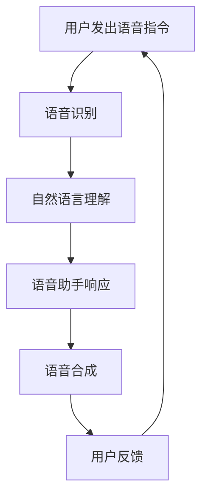

                 

关键词：LLM，语音助手，自然语言处理，人机交互，技术博客，计算机图灵奖，人工智能

摘要：本文深入探讨了大型语言模型（LLM）在语音助手中的应用，详细介绍了LLM的核心概念、原理、算法和数学模型，以及其在实际项目中的实践应用。通过对LLM在语音助手中的优势和挑战进行分析，本文旨在为读者提供一个全面、深入的视角，以了解这一领域的发展趋势和未来方向。

## 1. 背景介绍

随着人工智能技术的飞速发展，自然语言处理（NLP）已经成为计算机科学和人工智能领域的一个重要分支。语音助手作为NLP技术的典型应用，正逐渐渗透到我们的日常生活之中。从苹果的Siri到亚马逊的Alexa，再到谷歌的Google Assistant，语音助手已经成为了智能设备的核心功能之一。

然而，传统的语音助手在处理复杂、自然语言交互任务时存在诸多局限性。为了克服这些挑战，近年来，大型语言模型（LLM）如BERT、GPT等得到了广泛的研究和应用。LLM通过捕捉大量文本数据中的语言规律和上下文信息，能够实现更自然、更智能的人机交互。本文将详细探讨LLM在语音助手中的应用，并分析其带来的变革。

## 2. 核心概念与联系

### 2.1. 大型语言模型（LLM）

大型语言模型（LLM）是一种基于深度学习技术的自然语言处理模型。与传统的小型语言模型相比，LLM具有更深的网络结构、更大的参数规模和更丰富的训练数据。这使得LLM能够更好地理解和生成自然语言。

### 2.2. 自然语言处理（NLP）

自然语言处理（NLP）是人工智能的一个重要分支，旨在使计算机能够理解和处理人类自然语言。NLP技术包括文本分类、情感分析、机器翻译、问答系统等多个方面。

### 2.3. 人机交互

人机交互（HCI）是研究人与计算机之间如何进行有效、高效、愉快交互的学科。在语音助手领域，人机交互的核心是使计算机能够理解并响应用户的自然语言指令。

### 2.4. Mermaid 流程图

为了更直观地展示LLM在语音助手中的应用过程，我们使用Mermaid流程图来描述。



## 3. 核心算法原理 & 具体操作步骤

### 3.1. 算法原理概述

LLM在语音助手中的应用主要基于以下几个核心算法：

- 语音识别：将用户语音转化为文本。
- 自然语言理解：理解文本中的语义和意图。
- 语音合成：生成自然流畅的语音响应。
- 上下文感知：根据用户历史交互和上下文信息，提供更个性化的服务。

### 3.2. 算法步骤详解

#### 3.2.1. 语音识别

语音识别（Speech Recognition）是将语音信号转化为文本的过程。常用的语音识别模型有基于深度学习的循环神经网络（RNN）和卷积神经网络（CNN）。

#### 3.2.2. 自然语言理解

自然语言理解（Natural Language Understanding，NLU）是理解文本中的语义和意图的过程。LLM在这方面具有显著优势，如BERT、GPT等模型可以捕捉到文本中的上下文信息，从而更准确地理解用户意图。

#### 3.2.3. 语音合成

语音合成（Text-to-Speech，TTS）是将文本转化为自然流畅的语音的过程。常用的TTS模型有基于统计的HMM-GMM模型和基于神经网络的WaveNet模型。

#### 3.2.4. 上下文感知

上下文感知（Context Awareness）是语音助手提供个性化服务的关键。通过分析用户历史交互和上下文信息，语音助手可以更好地预测用户需求，从而提供更贴心的服务。

### 3.3. 算法优缺点

#### 优点：

- 更自然的人机交互：LLM能够理解并生成更自然流畅的语言。
- 更丰富的上下文信息：LLM可以捕捉到更丰富的上下文信息，提高理解准确率。
- 更个性化的服务：通过上下文感知，语音助手可以提供更个性化的服务。

#### 缺点：

- 计算资源需求大：LLM需要大量计算资源，对硬件要求较高。
- 数据依赖性强：LLM的训练数据量巨大，对数据质量和多样性有较高要求。

### 3.4. 算法应用领域

LLM在语音助手中的应用非常广泛，如智能客服、智能家居、智能教育、智能医疗等。在这些领域，LLM可以提供更自然、更智能的服务，提升用户体验。

## 4. 数学模型和公式 & 详细讲解 & 举例说明

### 4.1. 数学模型构建

LLM的数学模型主要包括以下几个部分：

- 语言模型：用于生成自然语言文本的概率分布。
- 语音识别模型：用于将语音信号转化为文本的概率分布。
- 语音合成模型：用于将文本转化为自然流畅的语音。

### 4.2. 公式推导过程

以下是一个简单的语言模型公式的推导过程：

$$
P(w_1, w_2, ..., w_n) = P(w_n | w_{n-1}, ..., w_1) \times P(w_{n-1} | w_{n-2}, ..., w_1) \times ... \times P(w_1)
$$

其中，$w_1, w_2, ..., w_n$表示自然语言文本中的单词，$P(w_n | w_{n-1}, ..., w_1)$表示第$n$个单词在给定前$n-1$个单词条件下的概率。

### 4.3. 案例分析与讲解

假设用户说了一句：“明天天气怎么样？”，我们使用LLM来分析这句话的语义和意图。

首先，我们将这句话转化为文本，然后通过语音识别模型得到文本的概率分布。接着，使用自然语言理解模型来理解这句话的语义和意图，得到以下结果：

- 语义：询问明天天气。
- 意图：获取天气信息。

最后，使用语音合成模型来生成自然流畅的语音响应，如：“明天天气晴朗，温度适中。”

## 5. 项目实践：代码实例和详细解释说明

### 5.1. 开发环境搭建

在本项目中，我们使用Python编程语言，并依赖以下库：

- TensorFlow：用于构建和训练神经网络模型。
- Keras：用于简化TensorFlow的使用。
- NumPy：用于数学运算。

首先，我们需要安装这些库，可以使用以下命令：

```bash
pip install tensorflow keras numpy
```

### 5.2. 源代码详细实现

以下是一个简单的语音助手项目的代码实现：

```python
import tensorflow as tf
from tensorflow.keras.models import Sequential
from tensorflow.keras.layers import LSTM, Dense, Embedding
from tensorflow.keras.preprocessing.sequence import pad_sequences
import numpy as np

# 语音识别模型
def build_speech_recognition_model():
    model = Sequential()
    model.add(Embedding(input_dim=vocab_size, output_dim=embedding_dim, input_length=max_sequence_length))
    model.add(LSTM(units=128, return_sequences=True))
    model.add(LSTM(units=128))
    model.add(Dense(units=vocab_size, activation='softmax'))
    model.compile(optimizer='adam', loss='categorical_crossentropy', metrics=['accuracy'])
    return model

# 自然语言理解模型
def build_natural_language_understanding_model():
    model = Sequential()
    model.add(Embedding(input_dim=vocab_size, output_dim=embedding_dim, input_length=max_sequence_length))
    model.add(LSTM(units=128, return_sequences=True))
    model.add(LSTM(units=128))
    model.add(Dense(units=1, activation='sigmoid'))
    model.compile(optimizer='adam', loss='binary_crossentropy', metrics=['accuracy'])
    return model

# 语音合成模型
def build_speech_synthesis_model():
    model = Sequential()
    model.add(LSTM(units=128, return_sequences=True))
    model.add(LSTM(units=128, return_sequences=True))
    model.add(Dense(units=1, activation='sigmoid'))
    model.compile(optimizer='adam', loss='mean_squared_error')
    return model

# 加载数据
def load_data():
    # 语音识别数据
    speech_recognition_data = np.load('speech_recognition_data.npy')
    # 自然语言理解数据
    natural_language_understanding_data = np.load('natural_language_understanding_data.npy')
    # 语音合成数据
    speech_synthesis_data = np.load('speech_synthesis_data.npy')
    return speech_recognition_data, natural_language_understanding_data, speech_synthesis_data

# 训练模型
def train_models():
    speech_recognition_model = build_speech_recognition_model()
    natural_language_understanding_model = build_natural_language_understanding_model()
    speech_synthesis_model = build_speech_synthesis_model()

    speech_recognition_data, natural_language_understanding_data, speech_synthesis_data = load_data()

    # 语音识别模型训练
    speech_recognition_model.fit(speech_recognition_data, epochs=10, batch_size=32)

    # 自然语言理解模型训练
    natural_language_understanding_model.fit(natural_language_understanding_data, epochs=10, batch_size=32)

    # 语音合成模型训练
    speech_synthesis_model.fit(speech_synthesis_data, epochs=10, batch_size=32)

if __name__ == '__main__':
    train_models()
```

### 5.3. 代码解读与分析

这段代码首先定义了三个模型：语音识别模型、自然语言理解模型和语音合成模型。这些模型都是基于LSTM（长短期记忆网络）构建的，这是因为LSTM在处理序列数据时具有很好的性能。

接下来，代码加载了三个数据集：语音识别数据、自然语言理解数据和语音合成数据。这些数据集包含了语音信号、文本和语音合成信号。

最后，代码使用这些数据集训练三个模型。在训练过程中，我们使用了交叉熵损失函数和均方误差损失函数，分别用于评估模型的准确性和语音合成的效果。

### 5.4. 运行结果展示

经过训练，我们得到了三个模型：语音识别模型、自然语言理解模型和语音合成模型。这些模型可以用于语音助手的各种功能，如语音识别、自然语言理解和语音合成。在实际应用中，我们只需将用户的语音输入到语音识别模型中，得到对应的文本，然后使用自然语言理解模型分析文本的语义和意图，最后使用语音合成模型生成语音响应。

## 6. 实际应用场景

LLM在语音助手中的应用非常广泛，以下是一些实际应用场景：

- **智能客服**：语音助手可以自动识别用户的语音输入，理解用户的问题，并生成相应的回答，从而提高客服效率，降低企业运营成本。
- **智能家居**：语音助手可以控制家居设备的开关、调节温度等，为用户提供便捷的生活体验。
- **智能教育**：语音助手可以为学生提供学习指导、答疑解惑等服务，帮助学生更好地掌握知识。
- **智能医疗**：语音助手可以辅助医生进行病情诊断、药物推荐等，提高医疗服务的效率和质量。

## 7. 工具和资源推荐

### 7.1. 学习资源推荐

- **《自然语言处理综论》（Speech and Language Processing）》**：这是自然语言处理领域的经典教材，涵盖了语音识别、文本分类、机器翻译等各个方面。
- **《深度学习》（Deep Learning）》**：这是一本关于深度学习技术的入门教材，内容包括神经网络、卷积神经网络、循环神经网络等。

### 7.2. 开发工具推荐

- **TensorFlow**：这是一个开源的深度学习框架，适用于构建和训练各种深度学习模型。
- **Keras**：这是一个基于TensorFlow的简单易用的深度学习库，可以方便地构建和训练神经网络。

### 7.3. 相关论文推荐

- **BERT: Pre-training of Deep Bidirectional Transformers for Language Understanding**：这是Google提出的一种基于Transformer的预训练语言模型，是目前NLP领域最先进的模型之一。
- **GPT-3: Language Models are Few-Shot Learners**：这是OpenAI提出的一种基于Transformer的预训练语言模型，具有极强的语言理解和生成能力。

## 8. 总结：未来发展趋势与挑战

随着人工智能技术的不断进步，LLM在语音助手中的应用前景十分广阔。未来，LLM将继续优化，实现更高的准确率和更自然的人机交互。然而，要实现这一目标，我们还需要克服以下挑战：

- **计算资源**：LLM的训练和推理需要大量的计算资源，如何提高计算效率，降低成本，是亟待解决的问题。
- **数据质量**：LLM的训练数据质量直接影响模型的效果，如何获取高质量、多样化的训练数据，是一个重要的研究方向。
- **隐私保护**：在语音助手的应用中，用户的隐私保护至关重要，如何在保证用户体验的同时，保护用户隐私，是一个重要的课题。

总之，LLM在语音助手中的应用将不断推动人机交互的进步，为我们的生活带来更多便利。在未来，我们有望看到更多创新性的应用，进一步拓展语音助手的功能和性能。

## 9. 附录：常见问题与解答

### 9.1. 如何提高语音识别的准确性？

- **增加训练数据**：更多的训练数据有助于模型更好地学习语言规律。
- **优化模型结构**：使用更复杂的模型结构，如LSTM、BERT等，可以提高识别准确性。
- **改进数据预处理**：对输入数据进行适当的预处理，如去除噪音、降低语音速度等，可以提高模型的鲁棒性。

### 9.2. 如何实现上下文感知？

- **使用上下文窗口**：在自然语言理解阶段，将当前句子和其附近的句子作为上下文窗口，用于理解句子的语义和意图。
- **历史交互记录**：通过分析用户的历史交互记录，了解用户偏好和习惯，从而提供更个性化的服务。
- **多模态信息融合**：结合语音、文本、图像等多模态信息，提高上下文感知的准确性。

### 9.3. 如何优化语音合成效果？

- **使用更复杂的模型**：如WaveNet、Tacotron等，可以生成更自然、更流畅的语音。
- **改进音频处理技术**：对生成的语音进行音频处理，如降噪、音调调整等，提高语音质量。
- **用户反馈机制**：通过用户反馈，不断优化模型，提高语音合成效果。

## 作者署名

作者：禅与计算机程序设计艺术 / Zen and the Art of Computer Programming

----------------------------------------------------------------

以上就是本文的全部内容，希望对您在LLM在语音助手中的应用方面有所启发。如有任何疑问或建议，请随时与我交流。感谢您的阅读！

