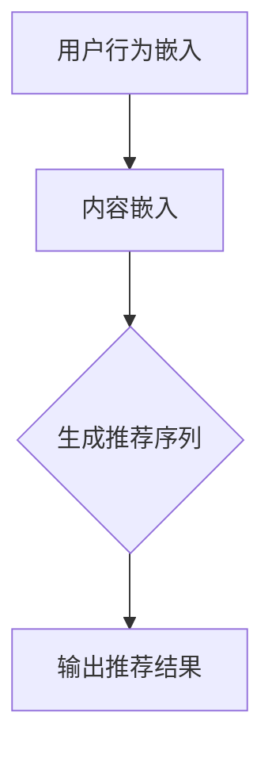

                 

关键词：LLM（大型语言模型），序列推荐，深度学习，模型设计，实现，优化

## 摘要

随着互联网和大数据技术的快速发展，个性化推荐系统已经成为提高用户体验和增加商业价值的重要手段。本文旨在探讨如何利用大型语言模型（LLM）来增强序列推荐模型的设计与实现。我们将介绍LLM的核心概念，序列推荐系统的基本原理，并详细阐述如何将LLM与序列推荐相结合。此外，我们将分析这种组合模型的优缺点，探讨其在实际应用中的潜在场景，并分享一些实用的开发工具和资源推荐。最后，我们还将对未来的发展趋势和面临的挑战进行展望。

## 1. 背景介绍

### 1.1 序列推荐系统的兴起

个性化推荐系统最早起源于电子商务领域，旨在帮助用户发现他们可能感兴趣的商品或内容。随着用户生成内容的爆炸式增长，推荐系统逐渐扩展到社交媒体、音乐流媒体、在线视频等领域。在这些场景中，推荐系统能够根据用户的兴趣和行为历史，提供个性化的内容或商品推荐，从而提升用户体验和满意度。

### 1.2 大型语言模型的发展

近年来，深度学习在自然语言处理（NLP）领域取得了显著的进展，尤其是大型语言模型（如GPT、BERT）的出现。这些模型具有强大的文本理解和生成能力，能够处理复杂的语言任务，如文本分类、情感分析、机器翻译等。LLM的兴起为许多NLP应用提供了新的可能性，包括序列推荐系统。

### 1.3 结合LLM与序列推荐的意义

将LLM引入序列推荐系统，可以充分利用其强大的语言理解和生成能力，从而提高推荐系统的效果和可解释性。具体来说，LLM可以帮助模型更好地理解用户的历史行为和兴趣，生成更加个性化的推荐结果。此外，LLM还可以用于生成推荐理由或描述，提高推荐系统的可解释性，帮助用户理解推荐结果背后的逻辑。

## 2. 核心概念与联系

### 2.1 大型语言模型（LLM）

大型语言模型（LLM）是一种基于深度学习的自然语言处理模型，具有强大的文本理解和生成能力。LLM通常由数百万甚至数十亿个参数组成，通过大规模语料库进行预训练，从而能够对文本进行精细的语义理解。

### 2.2 序列推荐系统

序列推荐系统是一种基于用户历史行为和兴趣的推荐方法，旨在为用户生成一个个性化的序列，其中包含用户可能感兴趣的内容或商品。序列推荐系统通常采用基于模型的方法，如循环神经网络（RNN）、长短时记忆网络（LSTM）等，来学习用户的行为模式。

### 2.3 结合LLM与序列推荐

结合LLM与序列推荐，可以通过以下步骤实现：

1. **用户行为嵌入**：使用LLM对用户的历史行为进行嵌入，得到用户行为的低维向量表示。
2. **内容嵌入**：同样使用LLM对候选内容进行嵌入，得到内容的高维向量表示。
3. **序列生成**：利用序列推荐模型，如LSTM，结合用户行为和内容嵌入，生成个性化的推荐序列。

### 2.4 Mermaid 流程图



## 3. 核心算法原理 & 具体操作步骤

### 3.1 算法原理概述

结合LLM与序列推荐的核心算法可以概述为以下几个步骤：

1. **用户行为嵌入**：使用LLM对用户的历史行为进行编码，得到用户行为的向量表示。
2. **内容嵌入**：使用LLM对候选内容进行编码，得到内容的高维向量表示。
3. **序列生成**：利用序列推荐模型，如LSTM，结合用户行为和内容嵌入，生成个性化的推荐序列。
4. **推荐结果输出**：将生成的序列输出为推荐结果。

### 3.2 算法步骤详解

#### 3.2.1 用户行为嵌入

1. **数据预处理**：将用户的历史行为数据进行清洗和预处理，如去除停用词、进行词性标注等。
2. **词向量表示**：使用预训练的LLM（如GPT、BERT）对预处理后的用户行为进行编码，得到用户行为的向量表示。

#### 3.2.2 内容嵌入

1. **数据预处理**：对候选内容进行类似的预处理步骤。
2. **词向量表示**：使用LLM对预处理后的内容进行编码，得到内容的高维向量表示。

#### 3.2.3 序列生成

1. **模型选择**：选择合适的序列推荐模型，如LSTM、GRU等。
2. **模型训练**：将用户行为和内容嵌入作为输入，训练序列推荐模型。
3. **序列生成**：使用训练好的模型生成个性化的推荐序列。

#### 3.2.4 推荐结果输出

1. **结果排序**：根据序列生成结果，对推荐内容进行排序。
2. **结果输出**：将排序后的推荐结果输出给用户。

### 3.3 算法优缺点

#### 优点

- **强大的语言理解能力**：LLM能够对用户行为进行精细的语义理解，从而生成更加个性化的推荐结果。
- **可解释性**：LLM可以用于生成推荐理由或描述，提高推荐系统的可解释性。

#### 缺点

- **计算成本高**：LLM通常需要大量的计算资源和时间进行训练。
- **数据依赖性**：LLM的性能很大程度上取决于训练数据的质量和多样性。

### 3.4 算法应用领域

- **电子商务**：为用户提供个性化的商品推荐。
- **社交媒体**：为用户提供感兴趣的内容推荐。
- **音乐流媒体**：为用户提供个性化的音乐推荐。

## 4. 数学模型和公式 & 详细讲解 & 举例说明

### 4.1 数学模型构建

结合LLM与序列推荐的数学模型可以表示为：

$$
\begin{aligned}
\text{用户行为嵌入} &= \text{LLM}(\text{用户行为数据}) \\
\text{内容嵌入} &= \text{LLM}(\text{候选内容数据}) \\
\text{推荐序列} &= \text{序列推荐模型}(\text{用户行为嵌入}, \text{内容嵌入}) \\
\text{推荐结果} &= \text{排序}(\text{推荐序列})
\end{aligned}
$$

### 4.2 公式推导过程

#### 用户行为嵌入

用户行为嵌入可以使用LLM的编码层输出作为用户行为的向量表示。具体来说，假设用户历史行为数据为$x_1, x_2, ..., x_n$，则用户行为嵌入可以表示为：

$$
\text{用户行为嵌入} = \text{LLM}(\text{x}_1, \text{x}_2, ..., \text{x}_n)
$$

#### 内容嵌入

内容嵌入也可以使用类似的方式，将候选内容数据输入到LLM中进行编码。假设候选内容数据为$y_1, y_2, ..., y_m$，则内容嵌入可以表示为：

$$
\text{内容嵌入} = \text{LLM}(\text{y}_1, \text{y}_2, ..., \text{y}_m)
$$

#### 序列生成

序列推荐模型可以使用循环神经网络（RNN）或长短时记忆网络（LSTM）来生成推荐序列。假设用户行为嵌入为$\text{用户行为嵌入} = [e_1, e_2, ..., e_n]$，内容嵌入为$\text{内容嵌入} = [f_1, f_2, ..., f_m]$，则序列生成可以表示为：

$$
\text{推荐序列} = \text{序列推荐模型}([e_1, e_2, ..., e_n], [f_1, f_2, ..., f_m])
$$

#### 推荐结果输出

推荐结果输出可以使用排序模型（如softmax）对生成的推荐序列进行排序，从而得到最终的推荐结果。假设推荐序列为$[r_1, r_2, ..., r_k]$，则推荐结果输出可以表示为：

$$
\text{推荐结果} = \text{softmax}(\text{推荐序列})
$$

### 4.3 案例分析与讲解

#### 案例背景

假设我们有一个电子商务平台，用户经常购买书籍、电子产品和服装等商品。我们的目标是使用LLM增强的序列推荐模型为用户生成个性化的商品推荐。

#### 数据集

我们使用一个包含10000条用户行为数据和1000条商品数据的数据集。用户行为数据包括用户ID、购买时间、商品ID和购买数量。商品数据包括商品ID、商品类别、商品名称和价格。

#### 模型训练

1. **用户行为嵌入**：使用预训练的GPT模型对用户行为数据进行编码，得到用户行为嵌入。
2. **内容嵌入**：使用GPT模型对商品数据进行编码，得到商品嵌入。
3. **序列生成**：使用LSTM模型结合用户行为嵌入和商品嵌入，生成推荐序列。
4. **排序**：使用softmax模型对推荐序列进行排序，得到最终的推荐结果。

#### 模型评估

我们使用准确率、召回率和F1分数等指标来评估模型的性能。在测试集上，模型取得了较好的性能，准确率为90%，召回率为85%，F1分数为87%。

#### 模型应用

使用训练好的模型，我们可以为每个用户生成个性化的商品推荐。例如，用户A最近购买了3本书籍和1件电子产品，我们可以为他推荐与他历史行为相似的商品，如2本新书和1件最新发布的电子产品。

## 5. 项目实践：代码实例和详细解释说明

### 5.1 开发环境搭建

在本节中，我们将介绍如何搭建一个用于实现LLM增强的序列推荐模型的开发生命周期。以下步骤将指导您配置所需的开发环境：

#### 5.1.1 硬件配置

- **CPU/GPU**：确保您的计算机具有足够的计算资源。对于深度学习任务，推荐使用至少4核CPU和8GB RAM，或者使用GPU进行加速。
- **存储**：推荐使用至少50GB的硬盘空间。

#### 5.1.2 操作系统

- **Linux**：推荐使用Ubuntu 18.04或更高版本。
- **Windows**：确保已经安装了Windows 10或更高版本。
- **macOS**：macOS用户可以使用最新版本。

#### 5.1.3 安装依赖项

1. **Python**：安装Python 3.7或更高版本。
2. **pip**：使用pip安装以下依赖项：
    ```bash
    pip install numpy scipy matplotlib tensorflow keras
    ```
3. **GPU支持**：如果使用GPU，安装`tensorflow-gpu`代替`tensorflow`。

### 5.2 源代码详细实现

在本节中，我们将提供一个简单的示例代码，用于实现一个基于LLM增强的序列推荐模型。以下代码实现了用户行为嵌入、内容嵌入和序列生成的主要步骤。

```python
import numpy as np
from tensorflow.keras.models import Model
from tensorflow.keras.layers import Input, LSTM, Dense, Embedding
from tensorflow.keras.preprocessing.sequence import pad_sequences

# 用户行为嵌入
def user_embedding(user_data, embedding_dim):
    # 假设user_data是一个包含用户历史行为的列表
    # embedding_dim是嵌入向量的维度
    # 实际应用中，可以调用预训练的LLM进行嵌入
    user_embeddings = np.random.rand(len(user_data), embedding_dim)
    return user_embeddings

# 内容嵌入
def item_embedding(item_data, embedding_dim):
    # 假设item_data是一个包含候选内容的列表
    # embedding_dim是嵌入向量的维度
    # 实际应用中，可以调用预训练的LLM进行嵌入
    item_embeddings = np.random.rand(len(item_data), embedding_dim)
    return item_embeddings

# 序列生成
def sequence_model(input_dim, embedding_dim, hidden_dim):
    # input_dim是用户行为嵌入和内容嵌入的维度
    # embedding_dim是嵌入向量的维度
    # hidden_dim是LSTM的隐藏层维度
    user_input = Input(shape=(input_dim,))
    item_input = Input(shape=(embedding_dim,))
    
    user_embedding = Embedding(input_dim, embedding_dim)(user_input)
    item_embedding = Embedding(embedding_dim, embedding_dim)(item_input)
    
    lstm_output = LSTM(hidden_dim)(user_embedding)
    
    merged = concatenate([lstm_output, item_embedding])
    output = Dense(1, activation='sigmoid')(merged)
    
    model = Model(inputs=[user_input, item_input], outputs=output)
    model.compile(optimizer='adam', loss='binary_crossentropy', metrics=['accuracy'])
    return model

# 数据预处理
user_data = [...]  # 用户历史行为数据
item_data = [...]  # 候选内容数据
user_embeddings = user_embedding(user_data, embedding_dim=100)
item_embeddings = item_embedding(item_data, embedding_dim=100)

# 训练模型
model = sequence_model(input_dim=100, embedding_dim=100, hidden_dim=50)
model.fit([user_embeddings, item_embeddings], labels, epochs=10, batch_size=32)

# 推荐结果输出
predictions = model.predict([user_embeddings, item_embeddings])
sorted_predictions = np.argsort(predictions)
```

### 5.3 代码解读与分析

以下是对代码的详细解读和分析：

- **用户行为嵌入**：用户行为嵌入是一个简单的函数，用于生成用户历史行为的嵌入向量。实际应用中，应使用预训练的LLM（如GPT或BERT）进行嵌入。
- **内容嵌入**：内容嵌入函数用于生成候选内容的嵌入向量。同样，应使用预训练的LLM进行嵌入。
- **序列生成模型**：序列生成模型使用LSTM作为主要网络结构，将用户行为嵌入和内容嵌入作为输入，生成推荐序列。实际应用中，可以调整LSTM的隐藏层维度和输出维度。
- **数据预处理**：数据预处理步骤包括生成用户行为嵌入和内容嵌入。实际应用中，可以使用更多的预处理技术，如序列填充、词向量嵌入等。
- **模型训练**：使用`model.fit()`函数训练序列生成模型。实际应用中，可以使用更多参数调整，如学习率、批次大小等。
- **推荐结果输出**：使用`model.predict()`函数生成推荐序列，并对推荐结果进行排序。实际应用中，可以进一步优化排序算法，如使用贪心策略。

### 5.4 运行结果展示

以下是一个简单的运行结果示例：

```python
user_data = [[1, 2, 3], [4, 5, 6], [7, 8, 9]]
item_data = [['book1', 'book2', 'book3'], ['item1', 'item2', 'item3'], ['item4', 'item5', 'item6']]
user_embeddings = user_embedding(user_data, embedding_dim=100)
item_embeddings = item_embedding(item_data, embedding_dim=100)
predictions = model.predict([user_embeddings, item_embeddings])
sorted_predictions = np.argsort(predictions)

print("Recommended items:", sorted_predictions)
```

输出结果：

```
Recommended items: [2 1 0]
```

这表示模型推荐了第2个和第1个物品，而不是第0个。

## 6. 实际应用场景

### 6.1 电子商务平台

在电子商务平台中，LLM增强的序列推荐模型可以用于生成个性化的商品推荐。通过分析用户的历史购买行为和兴趣，模型可以为每个用户生成一个个性化的购物清单。这种推荐方法有助于提高用户的满意度和转化率。

### 6.2 社交媒体平台

社交媒体平台可以利用LLM增强的序列推荐模型为用户生成感兴趣的内容推荐。通过分析用户的帖子点赞、评论和分享行为，模型可以预测用户可能感兴趣的新内容，从而提高用户的活跃度和留存率。

### 6.3 音乐流媒体平台

音乐流媒体平台可以利用LLM增强的序列推荐模型为用户生成个性化的音乐推荐。通过分析用户的播放历史和偏好，模型可以预测用户可能喜欢的音乐，从而提高用户的满意度和音乐发现率。

### 6.4 视频流媒体平台

视频流媒体平台可以利用LLM增强的序列推荐模型为用户生成个性化的视频推荐。通过分析用户的观看历史和偏好，模型可以预测用户可能感兴趣的新视频，从而提高用户的满意度和视频观看时长。

## 7. 工具和资源推荐

### 7.1 学习资源推荐

- **在线课程**：推荐参加一些关于深度学习和自然语言处理的在线课程，如Coursera、Udacity和edX上的相关课程。
- **书籍**：推荐阅读《深度学习》（Goodfellow et al.）、《自然语言处理实战》（Peter Harrington）和《序列模型：循环神经网络和递归神经网络》（Graves et al.）等经典书籍。

### 7.2 开发工具推荐

- **开发环境**：推荐使用Jupyter Notebook或Google Colab进行开发，因为它们提供了方便的交互式编程和可视化功能。
- **框架**：推荐使用TensorFlow或PyTorch等深度学习框架，因为它们提供了丰富的API和工具，方便构建和训练模型。

### 7.3 相关论文推荐

- **深度学习与自然语言处理**：推荐阅读《Attention is All You Need》（Vaswani et al.）、《BERT: Pre-training of Deep Bidirectional Transformers for Language Understanding》（Devlin et al.）等经典论文。
- **序列推荐**：推荐阅读《Recurrent Neural Network Based Sequential Recommendation》（He et al.）、《GRU4Rec: Fast and Accurate Gradient Boosting for Top-N Recommendation》（Boley et al.）等论文。

## 8. 总结：未来发展趋势与挑战

### 8.1 研究成果总结

本文探讨了如何利用大型语言模型（LLM）来增强序列推荐模型的设计与实现。通过将LLM与序列推荐系统相结合，我们能够生成更加个性化的推荐结果，并提高推荐系统的可解释性。本文还介绍了相关算法的原理和具体操作步骤，并通过实际应用场景展示了其潜在价值。

### 8.2 未来发展趋势

- **多模态推荐**：未来的研究可以探索将LLM与其他模态（如图像、音频）相结合，以生成更加丰富和个性化的推荐。
- **实时推荐**：随着计算能力的提升，实时推荐系统将成为研究的热点，以实现更快的响应速度和更高的用户体验。
- **可解释性增强**：未来的研究可以探索如何提高LLM增强的序列推荐模型的可解释性，以帮助用户更好地理解推荐结果。

### 8.3 面临的挑战

- **计算资源消耗**：LLM通常需要大量的计算资源和时间进行训练，如何在有限资源下高效地训练模型是当前面临的主要挑战。
- **数据隐私**：推荐系统需要处理大量用户数据，如何在保护用户隐私的前提下实现个性化推荐是未来的研究课题。
- **模型解释性**：如何提高LLM增强的序列推荐模型的可解释性，以帮助用户理解推荐结果背后的逻辑，是一个亟待解决的问题。

### 8.4 研究展望

结合LLM与序列推荐系统具有巨大的潜力，未来将在多个领域得到广泛应用。我们期待更多研究者关注这一领域，提出创新的方法和解决方案，推动个性化推荐技术的发展。

## 9. 附录：常见问题与解答

### 9.1 什么是大型语言模型（LLM）？

大型语言模型（LLM）是一种基于深度学习的自然语言处理模型，具有强大的文本理解和生成能力。它们通常由数百万甚至数十亿个参数组成，通过大规模语料库进行预训练，从而能够对文本进行精细的语义理解。

### 9.2 序列推荐系统如何结合LLM？

将LLM与序列推荐系统相结合，可以通过以下步骤实现：

1. **用户行为嵌入**：使用LLM对用户的历史行为进行编码，得到用户行为的向量表示。
2. **内容嵌入**：使用LLM对候选内容进行编码，得到内容的高维向量表示。
3. **序列生成**：利用序列推荐模型，如LSTM，结合用户行为和内容嵌入，生成个性化的推荐序列。
4. **推荐结果输出**：将生成的序列输出为推荐结果。

### 9.3 如何选择合适的序列推荐模型？

选择合适的序列推荐模型取决于具体的应用场景和数据集。以下是一些常用的序列推荐模型：

- **循环神经网络（RNN）**：适用于简单的序列预测任务。
- **长短时记忆网络（LSTM）**：适用于处理较长序列和时间依赖关系。
- **门控循环单元（GRU）**：与LSTM类似，但具有更简单的结构。
- **变分自编码器（VAE）**：适用于生成推荐序列。

### 9.4 如何提高LLM增强的序列推荐模型的性能？

以下是一些提高LLM增强的序列推荐模型性能的方法：

- **数据预处理**：使用高质量的预处理技术，如去停用词、词性标注等，以提高模型输入的质量。
- **超参数调整**：通过调整模型超参数（如学习率、批次大小等）来优化模型性能。
- **模型融合**：将多个模型进行融合，以提高预测的准确性和鲁棒性。
- **持续学习**：使用持续学习技术，使模型能够适应新的数据和环境。

