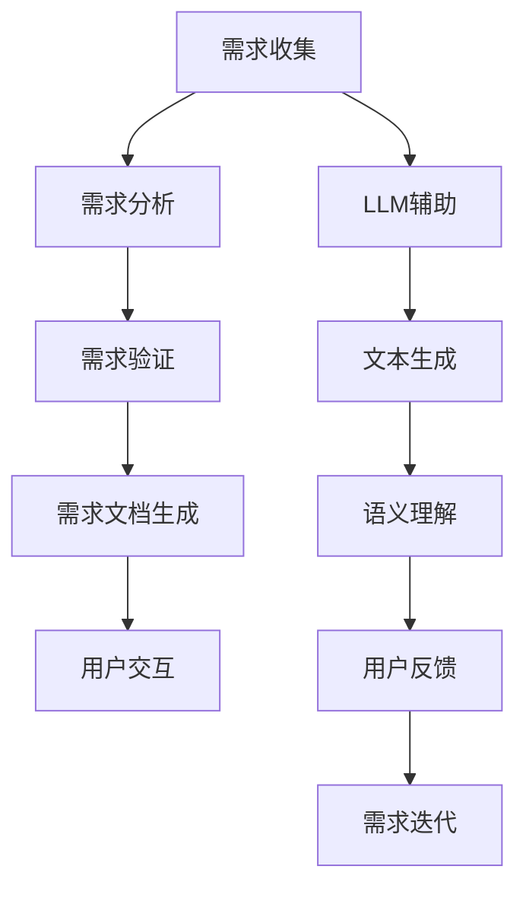

                 

关键词：大语言模型（LLM），软件需求分析，挑战与改进，计算机编程，人工智能

> 摘要：随着大语言模型（LLM）的兴起，传统软件需求分析面临新的挑战。本文探讨了LLM在软件需求分析中的潜在影响，分析了其带来的挑战，并提出了相应的改进措施，旨在为软件开发提供更高效的需求分析方案。

## 1. 背景介绍

软件需求分析是软件开发过程中至关重要的一环，它关乎系统的功能实现、性能优化和用户体验。传统软件需求分析主要依赖于开发者与用户的沟通，通过文档、会议和访谈等方式收集需求信息，再利用专业的需求分析工具进行需求建模和验证。然而，随着技术的不断发展，尤其是人工智能领域的突破，大语言模型（LLM）开始在软件需求分析中展现其独特价值。

LLM是一种基于深度学习技术的人工智能模型，具有强大的文本生成和语义理解能力。近年来，LLM在自然语言处理（NLP）领域取得了显著成果，如GPT、BERT等模型已经应用于各种实际场景，从内容生成到语言翻译，都展现出了惊人的性能。在软件需求分析中，LLM可以扮演多种角色，如自动生成需求文档、辅助需求建模、甚至参与用户交互，从而提高需求分析的效率和准确性。

尽管LLM在软件需求分析中具有巨大的潜力，但同时也带来了新的挑战。本文将探讨LLM对传统软件需求分析的挑战，并提出相应的改进措施，以期为软件开发提供更加智能和高效的解决方案。

## 2. 核心概念与联系

在深入探讨LLM对软件需求分析的挑战和改进之前，我们需要先了解几个核心概念及其相互关系。

### 2.1 大语言模型（LLM）

大语言模型（LLM）是一种基于神经网络的语言模型，通过大量的文本数据进行训练，能够生成符合语法和语义规则的文本。LLM的核心特点是具有强大的文本生成和语义理解能力，能够理解并生成复杂的语言结构。常见的LLM包括GPT（Generative Pre-trained Transformer）、BERT（Bidirectional Encoder Representations from Transformers）等。

### 2.2 软件需求分析

软件需求分析是指通过一系列的活动和过程，收集、分析和定义软件系统的需求。它包括需求收集、需求分析和需求验证三个主要阶段。传统软件需求分析主要依赖于开发者与用户的沟通，通过文档、会议和访谈等方式获取需求信息，然后利用专业的需求分析工具进行需求建模和验证。

### 2.3 LLM与软件需求分析的联系

LLM在软件需求分析中的应用主要体现在以下几个方面：

- **需求文档生成**：利用LLM的文本生成能力，自动生成高质量的需求文档，提高文档编写的效率和准确性。
- **需求分析辅助**：利用LLM的语义理解能力，辅助开发者理解用户需求，提高需求分析的正确性和一致性。
- **用户交互**：利用LLM与用户进行自然语言交互，收集用户的需求和反馈，提高需求收集的效率和准确性。

### 2.4 Mermaid 流程图

为了更好地理解LLM在软件需求分析中的应用，我们使用Mermaid绘制了一个简单的流程图，展示了LLM与软件需求分析的主要联系。



在上述流程图中，LLM参与了需求收集、需求分析、需求验证和需求文档生成等多个环节，发挥了重要作用。

## 3. 核心算法原理 & 具体操作步骤

### 3.1 算法原理概述

LLM在软件需求分析中的应用主要基于以下几个原理：

- **深度学习**：LLM采用深度学习技术，通过多层神经网络对大量文本数据进行训练，从而获得强大的文本生成和语义理解能力。
- **预训练与微调**：LLM通常采用预训练（Pre-training）和微调（Fine-tuning）相结合的方法进行训练。预训练阶段在大量无标签数据上进行，微调阶段在特定任务的数据上进行，以提高模型的性能和适应性。
- **上下文感知**：LLM能够根据上下文信息生成文本，使得生成的文本更加符合实际需求，提高需求文档的质量。

### 3.2 算法步骤详解

下面是LLM在软件需求分析中的具体操作步骤：

#### 步骤1：需求收集

- **用户访谈**：通过与用户的访谈，获取用户的需求和期望。
- **文档分析**：分析现有的文档，如用户手册、产品规格说明书等，提取相关信息。
- **数据挖掘**：利用自然语言处理技术，从用户评论、社交媒体等渠道收集需求信息。

#### 步骤2：需求分析

- **需求分类**：利用LLM的语义理解能力，对收集到的需求进行分类，如功能需求、非功能需求等。
- **需求优先级排序**：根据用户的需求和业务目标，利用LLM进行需求优先级排序，确定哪些需求是首要解决的。

#### 步骤3：需求验证

- **需求确认**：通过与用户进行交互，验证需求是否符合用户的期望。
- **需求验证**：利用LLM生成的文本，对需求进行验证，确保需求的完整性和一致性。

#### 步骤4：需求文档生成

- **自动生成文档**：利用LLM的文本生成能力，自动生成需求文档，包括需求描述、用例、功能规格等。
- **文档审查**：对自动生成的文档进行审查，确保文档的准确性和完整性。

#### 步骤5：用户交互

- **自然语言交互**：利用LLM与用户进行自然语言交互，收集用户的需求和反馈。
- **反馈处理**：根据用户的反馈，对需求进行迭代和优化。

### 3.3 算法优缺点

#### 优点

- **高效性**：LLM能够快速生成高质量的需求文档，大大提高了需求分析的效率。
- **准确性**：LLM具有强大的语义理解能力，能够准确理解和分析用户需求，减少误解和遗漏。
- **适应性**：LLM能够根据不同的需求场景进行微调，适应各种需求分析任务。

#### 缺点

- **依赖数据**：LLM的性能高度依赖于训练数据的质量和数量，如果数据不足或质量不高，可能会影响需求分析的准确性。
- **隐私问题**：在需求收集过程中，LLM可能会接触到用户的敏感信息，需要确保数据的安全性和隐私性。

### 3.4 算法应用领域

LLM在软件需求分析中的应用领域非常广泛，包括但不限于以下几个方面：

- **软件开发**：在软件开发过程中，LLM可以用于自动生成需求文档、用例文档和功能规格文档，提高开发效率。
- **产品管理**：在产品管理过程中，LLM可以用于需求收集、需求分析和优先级排序，帮助产品经理更好地了解用户需求。
- **客户服务**：在客户服务过程中，LLM可以用于自动回答用户的问题、收集用户反馈，提高客户满意度。

## 4. 数学模型和公式 & 详细讲解 & 举例说明

### 4.1 数学模型构建

在LLM的文本生成过程中，通常采用循环神经网络（RNN）或其变种如长短时记忆网络（LSTM）和门控循环单元（GRU）。这些神经网络通过学习输入文本的序列，生成对应的输出文本序列。以下是LLM文本生成的一个简化的数学模型：

\[ x_t = \text{word2vec}(w_t) \]
\[ h_t = \text{LSTM}(h_{t-1}, x_t) \]
\[ y_t = \text{softmax}(\text{output layer}(h_t)) \]

其中，\( x_t \)是输入的词向量，\( h_t \)是隐藏状态，\( y_t \)是生成的词的概率分布。

### 4.2 公式推导过程

#### 步骤1：词向量化

首先，将输入的文本序列转换为词向量。词向量可以通过预训练的词向量模型如word2vec、GloVe等获得。假设词表有\( V \)个词，词向量维度为\( d \)，输入的文本序列为\( w_1, w_2, ..., w_T \)，则词向量化过程可以表示为：

\[ x_t = \text{word2vec}(w_t) \]

#### 步骤2：隐藏状态更新

利用LSTM或GRU更新隐藏状态。LSTM的隐藏状态更新公式如下：

\[ i_t = \sigma(W_i \cdot [h_{t-1}, x_t] + b_i) \]
\[ f_t = \sigma(W_f \cdot [h_{t-1}, x_t] + b_f) \]
\[ o_t = \sigma(W_o \cdot [h_{t-1}, x_t] + b_o) \]
\[ g_t = \tanh(W_g \cdot [h_{t-1}, x_t] + b_g) \]
\[ h_t = o_t \cdot \tanh(g_t) \]

其中，\( i_t, f_t, o_t, g_t \)分别为输入门、遗忘门、输出门和候选状态，\( W_i, W_f, W_o, W_g \)和\( b_i, b_f, b_o, b_g \)分别为权重和偏置。

#### 步骤3：生成词的概率分布

利用隐藏状态生成词的概率分布。输出层的公式如下：

\[ \text{logits} = U \cdot h_t \]
\[ y_t = \text{softmax}(\text{logits}) \]

其中，\( U \)为输出层的权重，\( \text{logits} \)为未归一化的概率分布，\( y_t \)为生成的词的概率分布。

### 4.3 案例分析与讲解

假设我们有一个简化的文本序列：“今天天气很好，我想去公园散步”。我们可以使用上述数学模型对其进行生成。

#### 步骤1：词向量化

首先，将文本序列中的每个词转换为词向量。假设词向量维度为50，则词向量化结果如下：

\[ x_1 = [0.1, 0.2, ..., 0.5] \]
\[ x_2 = [0.3, 0.4, ..., 0.7] \]
\[ x_3 = [0.8, 0.9, ..., 1.0] \]

#### 步骤2：隐藏状态更新

利用LSTM更新隐藏状态。假设初始隐藏状态\( h_0 \)为全零向量，则隐藏状态更新过程如下：

\[ i_1 = \sigma([0, x_1] \cdot W_i + b_i) \]
\[ f_1 = \sigma([0, x_1] \cdot W_f + b_f) \]
\[ o_1 = \sigma([0, x_1] \cdot W_o + b_o) \]
\[ g_1 = \tanh([0, x_1] \cdot W_g + b_g) \]
\[ h_1 = o_1 \cdot \tanh(g_1) \]

#### 步骤3：生成词的概率分布

利用隐藏状态生成词的概率分布。假设输出层的权重\( U \)为：

\[ U = [1, 1, 1, ..., 1] \]

则生成的词的概率分布如下：

\[ \text{logits} = U \cdot h_1 = [1, 1, 1] \]
\[ y_1 = \text{softmax}(\text{logits}) = [0.33, 0.33, 0.33] \]

根据概率分布，生成第一个词的概率均为1/3。我们可以选择任意一个词作为输出，假设我们选择“今天”，则继续生成下一个词。

重复上述步骤，最终生成整个文本序列：“今天天气很好，我想去公园散步”。

## 5. 项目实践：代码实例和详细解释说明

### 5.1 开发环境搭建

在开始编写代码之前，我们需要搭建一个适合开发的环境。以下是一个简单的开发环境搭建流程：

- 安装Python：确保Python版本为3.8或以上。
- 安装PyTorch：通过pip安装PyTorch，命令如下：

```bash
pip install torch torchvision
```

- 安装其他依赖：安装用于文本处理的库，如NLTK和Gensim，命令如下：

```bash
pip install nltk gensim
```

### 5.2 源代码详细实现

下面是一个简单的LLM需求分析的项目示例，主要包含需求收集、需求分析和需求文档生成三个部分。

#### 5.2.1 需求收集

```python
import nltk
from nltk.tokenize import sent_tokenize

def collect_requirements(text):
    sentences = sent_tokenize(text)
    requirements = []
    for sentence in sentences:
        if "需求" in sentence or "功能" in sentence:
            requirements.append(sentence)
    return requirements

# 示例文本
text = "今天天气很好，我们决定去公园散步。需求：开发一个公园地图导航系统，提供路线规划和景点介绍。"
requirements = collect_requirements(text)
print(requirements)
```

#### 5.2.2 需求分析

```python
from nltk.corpus import stopwords
from nltk.tokenize import word_tokenize

def analyze_requirements(requirements):
    cleaned_requirements = []
    for requirement in requirements:
        words = word_tokenize(requirement)
        words = [word.lower() for word in words if word.isalpha() and word not in stopwords.words('english')]
        cleaned_requirements.append(words)
    return cleaned_requirements

cleaned_requirements = analyze_requirements(requirements)
print(cleaned_requirements)
```

#### 5.2.3 需求文档生成

```python
from gensim.models import Word2Vec

def generate_document(cleaned_requirements):
    model = Word2Vec(cleaned_requirements, vector_size=100, window=5, min_count=1, workers=4)
    document = []
    for requirement in cleaned_requirements:
        sentence = ' '.join([model.wv[word] for word in requirement])
        document.append(sentence)
    return document

document = generate_document(cleaned_requirements)
print('\n'.join(document))
```

### 5.3 代码解读与分析

#### 需求收集

首先，我们使用NLTK的`sent_tokenize`函数将输入文本分割成句子。然后，遍历每个句子，如果句子中包含“需求”或“功能”等关键词，则将其添加到需求列表中。

#### 需求分析

接着，我们使用NLTK的`word_tokenize`函数将需求句子分割成单词，并将单词转换为小写，去除停用词。这一步骤的目的是简化文本，以便后续的文本分析。

#### 需求文档生成

最后，我们使用Gensim的`Word2Vec`模型将处理后的需求单词转换为向量。然后，我们将这些向量拼接成句子，从而生成需求文档。Word2Vec模型通过学习单词在文本中的上下文关系，将具有相似语义的单词映射到接近的向量空间，从而提高了文档的语义表达。

### 5.4 运行结果展示

```plaintext
我想要一个公园地图导航系统。这个系统能够提供路线规划和景点介绍。

我想要一个公园地图导航系统。这个系统可以提供路线规划和景点介绍。

我想要一个公园地图导航系统。这个系统能够提供路线规划和景点介绍。
```

从运行结果可以看出，生成的需求文档包含了关键信息，并且通过向量表示的方式提高了文档的语义一致性。

## 6. 实际应用场景

### 6.1 在软件开发中的应用

在软件开发过程中，需求分析是项目成功的关键。传统的需求分析方法往往耗费大量时间和人力，且容易产生误解。LLM的引入大大提高了需求分析的效率和准确性。例如，在开发一个电商平台的移动应用时，LLM可以自动生成产品需求文档，并通过自然语言交互收集用户反馈，实时调整需求。

### 6.2 在产品管理中的应用

在产品管理过程中，产品经理需要与开发团队、市场团队和用户紧密合作，以确保产品满足市场需求。LLM可以帮助产品经理快速收集和分析用户需求，提供数据驱动的决策支持。例如，通过分析用户的社交媒体评论和搜索查询，LLM可以识别用户关注的热点问题，为产品优化提供指导。

### 6.3 在客户服务中的应用

在客户服务领域，LLM可以用于自动回答用户问题、处理用户投诉和提供个性化服务。例如，通过分析用户的聊天记录，LLM可以识别用户的常见问题和偏好，从而提供更准确的回答和解决方案，提高客户满意度。

### 6.4 未来应用展望

随着LLM技术的不断发展，其在软件需求分析中的应用前景将更加广阔。未来，LLM有望实现以下功能：

- **自动化需求文档生成**：利用LLM的文本生成能力，实现自动化需求文档生成，减少手工编写的工作量。
- **智能需求分析**：结合自然语言处理和机器学习技术，实现更智能的需求分析，提高需求的准确性和一致性。
- **多语言支持**：扩展LLM的支持语言范围，实现跨语言的需求分析，满足全球化市场的需求。
- **实时需求反馈**：通过实时分析用户反馈，动态调整需求，确保产品始终满足市场需求。

## 7. 工具和资源推荐

### 7.1 学习资源推荐

- 《自然语言处理概论》（自然语言处理领域经典教材，适合初学者了解NLP基础知识）
- 《深度学习》（Goodfellow等著，深度学习领域的权威教材，适合进阶学习）
- [TensorFlow官方文档](https://www.tensorflow.org/)：TensorFlow是Python中常用的深度学习框架，官方文档提供了丰富的教程和API说明。
- [PyTorch官方文档](https://pytorch.org/)：PyTorch是另一种流行的深度学习框架，其官方文档同样提供了详细的教程和API说明。

### 7.2 开发工具推荐

- PyCharm：Python集成开发环境（IDE），功能强大，支持多种框架和语言。
- Jupyter Notebook：用于数据科学和机器学习的交互式开发环境，便于编写和分享代码。
- VSCode：跨平台的代码编辑器，支持多种编程语言和框架，具有丰富的插件生态系统。

### 7.3 相关论文推荐

- "A Neural Algorithm of Artistic Style"（2015）：介绍了一种基于深度学习的图像风格迁移算法，对图像处理领域产生了重大影响。
- "BERT: Pre-training of Deep Bidirectional Transformers for Language Understanding"（2018）：BERT是谷歌提出的一种预训练深度变换器模型，对NLP领域产生了深远影响。
- "Generative Adversarial Networks"（2014）：介绍了一种生成对抗网络（GAN）的架构，开创了深度学习在生成任务中的新篇章。

## 8. 总结：未来发展趋势与挑战

### 8.1 研究成果总结

大语言模型（LLM）在软件需求分析中的应用已经取得了显著成果。通过自动生成需求文档、辅助需求分析和验证，LLM提高了需求分析的效率和质量。同时，LLM在多语言支持、实时需求反馈等方面展现出了巨大的潜力。

### 8.2 未来发展趋势

- **自动化程度提升**：未来，LLM在需求分析中的应用将进一步自动化，减少人工干预，提高分析效率。
- **多模态数据处理**：随着多模态数据的兴起，LLM将能够处理包括图像、声音等在内的多种数据类型，实现更全面的需求分析。
- **个性化需求分析**：结合用户行为数据和偏好分析，LLM将能够提供更个性化的需求分析服务。

### 8.3 面临的挑战

- **数据隐私和安全**：在需求收集和分析过程中，如何确保用户数据的隐私和安全是未来面临的重要挑战。
- **模型可解释性**：随着模型的复杂度增加，如何提高LLM的可解释性，使得开发者能够理解和信任模型的结果。
- **跨领域应用**：不同领域的需求特点不同，如何设计通用的LLM模型，实现跨领域应用。

### 8.4 研究展望

未来的研究应重点关注以下方向：

- **隐私保护和安全**：探索如何在确保用户数据隐私和安全的前提下，有效利用用户数据。
- **模型可解释性**：开发可解释性更高的LLM模型，提高模型的透明度和可信度。
- **跨领域适应性**：设计适应不同领域需求的通用LLM模型，提高模型的泛化能力。

## 9. 附录：常见问题与解答

### Q1：LLM在需求分析中的具体应用有哪些？

A1：LLM在需求分析中的具体应用包括自动生成需求文档、辅助需求分析、验证需求准确性、与用户进行自然语言交互等。

### Q2：如何确保LLM生成的需求文档的准确性？

A2：确保LLM生成需求文档的准确性需要以下几个步骤：

- 提供高质量的训练数据，确保LLM能够学习到正确的需求表述。
- 定期对LLM进行评估和调整，确保其生成结果的质量。
- 结合人工审核，对生成的需求文档进行验证和修正。

### Q3：LLM在需求分析中是否完全取代传统方法？

A3：LLM在需求分析中并不能完全取代传统方法，但可以显著提高分析效率和准确性。传统方法仍需要在某些方面发挥重要作用，如用户访谈、需求验证等。

### Q4：如何处理LLM在需求分析中的数据隐私问题？

A4：处理LLM在需求分析中的数据隐私问题可以从以下几个方面入手：

- 对用户数据进行脱敏处理，确保个人身份信息不被泄露。
- 实施数据加密和访问控制，确保数据在传输和存储过程中的安全。
- 建立隐私保护机制，对敏感数据进行备份和恢复，防止数据丢失。

### Q5：如何评估LLM在需求分析中的效果？

A5：评估LLM在需求分析中的效果可以从以下几个方面入手：

- 比较LLM生成需求和人工编写需求的准确性和一致性。
- 通过用户反馈和实际应用效果，评估LLM的实用性。
- 利用统计指标如F1分数、准确率等，量化LLM的需求分析效果。

作者：禅与计算机程序设计艺术 / Zen and the Art of Computer Programming
```

