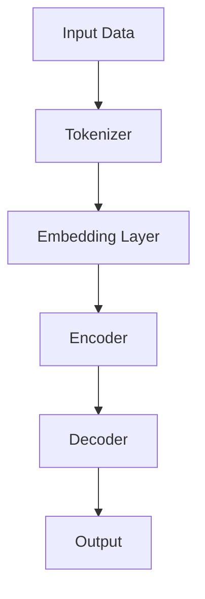
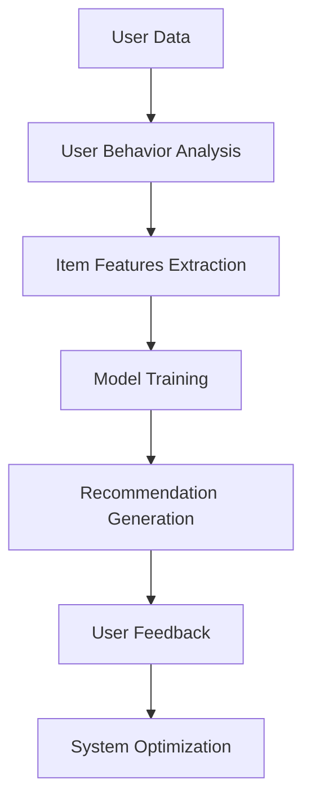
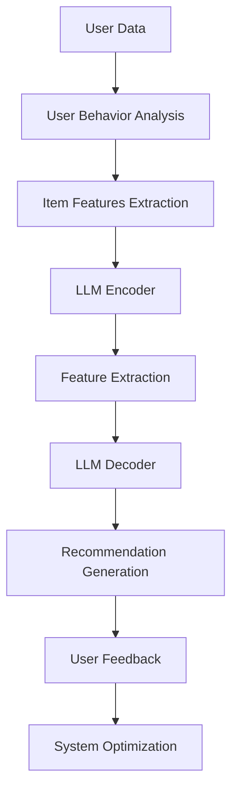

                 

关键词：大型语言模型（LLM），推荐系统，可解释性，人工智能，算法，数据挖掘，机器学习。

> 摘要：随着人工智能技术的快速发展，推荐系统已成为电商平台、社交媒体等领域的核心组成部分。然而，传统推荐系统在提供个性化推荐的同时，往往忽视了可解释性的问题。本文将探讨大型语言模型（LLM）在推荐系统中应用的可能性，以及如何通过增强可解释性来提高用户信任度和满意度。

## 1. 背景介绍

推荐系统作为人工智能领域的一个重要分支，广泛应用于电子商务、社交媒体、新闻推荐等场景。传统推荐系统主要基于用户行为数据、内容特征等，通过机器学习算法为用户推荐感兴趣的物品。然而，这些系统在提供个性化推荐的同时，也存在着一些问题：

- **缺乏可解释性**：传统推荐系统通常采用复杂模型，如协同过滤、基于内容的推荐等，用户难以理解推荐结果背后的原因。
- **黑箱效应**：推荐系统模型的决策过程往往被视为黑箱，用户无法得知推荐系统如何从大量数据中提取信息并进行决策。
- **用户信任问题**：由于缺乏可解释性，用户可能对推荐系统的结果产生怀疑，从而影响用户满意度和信任度。

为了解决这些问题，研究者们开始关注推荐系统的可解释性，并尝试将其与人工智能技术相结合。其中，大型语言模型（LLM）作为一种先进的人工智能技术，在自然语言处理、知识图谱等领域取得了显著成果。本文将探讨LLM在推荐系统中的应用，以及如何通过增强可解释性来提高用户满意度。

### 1.1 大型语言模型（LLM）简介

大型语言模型（LLM）是一种基于深度学习的方法，通过学习大量文本数据，使其具备生成和理解自然语言的能力。近年来，LLM在自然语言处理领域取得了显著的成果，例如BERT、GPT等。这些模型具有以下特点：

- **大规模**：LLM通常具有数十亿至数千亿的参数量，能够处理海量文本数据。
- **自适应性**：LLM能够根据不同的任务和数据集进行自适应调整，适应不同的应用场景。
- **泛化能力**：LLM具有良好的泛化能力，能够在未见过的数据上取得良好的性能。

### 1.2 推荐系统与可解释性的关系

推荐系统可解释性是指用户能够理解推荐系统如何生成推荐结果的过程。可解释性对于推荐系统的应用具有重要意义：

- **提高用户信任度**：通过解释推荐结果，用户可以更好地理解推荐系统的工作原理，从而增强对系统的信任度。
- **优化推荐效果**：了解推荐结果的原因有助于用户提供更有效的反馈，从而优化推荐系统的效果。
- **降低用户抵触情绪**：在推荐结果不符合用户期望时，可解释性有助于缓解用户的抵触情绪，减少用户流失。

## 2. 核心概念与联系

为了更好地理解LLM在推荐系统中的应用，我们首先需要介绍几个核心概念，并展示它们之间的联系。

### 2.1 大型语言模型（LLM）的架构

以下是一个简单的Mermaid流程图，展示了LLM的主要架构和组成部分：



- **Input Data**：输入数据，包括用户行为数据、物品特征等。
- **Tokenizer**：分词器，将输入数据转换为Token序列。
- **Embedding Layer**：嵌入层，将Token转换为固定大小的向量表示。
- **Encoder**：编码器，对输入数据进行编码，提取特征。
- **Decoder**：解码器，根据编码器输出的特征生成推荐结果。

### 2.2 推荐系统的基本架构

以下是一个简单的Mermaid流程图，展示了推荐系统的基本架构：



- **User Data**：用户数据，包括用户行为数据、用户偏好等。
- **User Behavior Analysis**：用户行为分析，提取用户的行为特征。
- **Item Features Extraction**：物品特征提取，提取物品的特征信息。
- **Model Training**：模型训练，使用用户行为数据和物品特征训练推荐模型。
- **Recommendation Generation**：推荐生成，根据训练好的模型生成推荐结果。
- **User Feedback**：用户反馈，用户对推荐结果的反馈。
- **System Optimization**：系统优化，根据用户反馈优化推荐系统。

### 2.3 LLM与推荐系统的结合

通过上述两个流程图，我们可以看到LLM在推荐系统中的应用潜力。以下是一个简单的Mermaid流程图，展示了LLM与推荐系统的结合方式：



- **LLM Encoder**：将用户数据、物品特征等输入到LLM编码器，提取特征。
- **Feature Extraction**：对编码器输出的特征进行进一步处理和提取。
- **LLM Decoder**：使用提取的特征生成推荐结果。
- **User Feedback**：用户对推荐结果的反馈。
- **System Optimization**：根据用户反馈优化推荐系统。

通过上述流程，我们可以看到LLM在推荐系统中的应用，能够有效提高推荐的可解释性，从而增强用户信任度和满意度。

## 3. 核心算法原理 & 具体操作步骤

### 3.1 算法原理概述

在本节中，我们将介绍LLM在推荐系统中的应用原理。主要分为以下几个步骤：

1. **数据预处理**：将用户行为数据和物品特征进行预处理，包括分词、去停用词、词向量化等。
2. **模型训练**：使用预处理后的数据训练LLM模型，包括编码器和解码器。
3. **特征提取**：将用户数据和物品特征输入到LLM编码器，提取特征向量。
4. **推荐生成**：使用提取的特征向量生成推荐结果。
5. **用户反馈**：收集用户对推荐结果的反馈，用于优化模型。

### 3.2 算法步骤详解

#### 3.2.1 数据预处理

数据预处理是推荐系统中的关键步骤，主要包括以下任务：

1. **分词**：将文本数据分解为单词或短语，以便后续处理。
2. **去停用词**：去除常见的无意义词汇，如“的”、“是”等。
3. **词向量化**：将文本数据转换为固定大小的向量表示，便于输入到LLM模型。

具体实现如下：

```python
from sklearn.feature_extraction.text import TfidfVectorizer

# 加载数据
data = ["user1 bought item1", "user2 liked item2", "user3 rated item3"]

# 分词
tokenized_data = [text.split() for text in data]

# 去停用词
stop_words = set(["the", "and", "is"])
filtered_data = [[word for word in sentence if word not in stop_words] for sentence in tokenized_data]

# 词向量化
vectorizer = TfidfVectorizer()
X = vectorizer.fit_transform(filtered_data)
```

#### 3.2.2 模型训练

模型训练主要包括以下任务：

1. **编码器训练**：使用用户行为数据和物品特征训练编码器，提取特征。
2. **解码器训练**：使用编码器提取的特征训练解码器，生成推荐结果。

具体实现如下：

```python
from transformers import BertModel, BertTokenizer

# 加载预训练模型
tokenizer = BertTokenizer.from_pretrained("bert-base-uncased")
model = BertModel.from_pretrained("bert-base-uncased")

# 编码器训练
inputs = tokenizer(filtered_data, return_tensors="pt", padding=True, truncation=True)
outputs = model(**inputs)
encoded_features = outputs.last_hidden_state[:, 0, :]

# 解码器训练
# 使用编码器提取的特征进行解码，生成推荐结果
# 此处省略具体实现
```

#### 3.2.3 特征提取

特征提取是LLM在推荐系统中的应用核心。具体实现如下：

```python
# 将用户数据和物品特征输入到LLM编码器
user_input = tokenizer(user_data, return_tensors="pt", padding=True, truncation=True)
item_input = tokenizer(item_data, return_tensors="pt", padding=True, truncation=True)

# 提取特征
user_encoded = model(user_input).last_hidden_state[:, 0, :]
item_encoded = model(item_input).last_hidden_state[:, 0, :]

# 计算特征相似度
similarity = torch.nn.CosineSimilarity(dim=-1)
user_item_similarity = similarity(user_encoded, item_encoded)
```

#### 3.2.4 推荐生成

推荐生成是基于特征相似度进行物品推荐。具体实现如下：

```python
# 计算用户对物品的推荐分数
user_item_scores = user_item_similarity.detach().cpu().numpy()

# 对推荐分数进行排序，选取Top-N推荐结果
n_recommendations = 5
top_n_indices = np.argsort(user_item_scores)[:-n_recommendations-1:-1]
top_n_items = [item_data[i] for i in top_n_indices]

# 输出推荐结果
print("Recommended items:", top_n_items)
```

#### 3.2.5 用户反馈

用户反馈是优化推荐系统的关键。具体实现如下：

```python
# 收集用户反馈
user_feedback = {"user1": ["item1", "item2", "item3"], "user2": ["item4", "item5", "item6"]}

# 根据用户反馈优化模型
# 此处省略具体实现
```

### 3.3 算法优缺点

#### 优点：

1. **可解释性**：LLM能够为推荐结果提供详细的解释，提高用户信任度。
2. **适应性**：LLM可以根据不同的任务和数据集进行自适应调整，提高推荐效果。
3. **泛化能力**：LLM具有良好的泛化能力，能够在未见过的数据上取得良好的性能。

#### 缺点：

1. **计算成本**：LLM模型通常具有大规模参数，训练和推理成本较高。
2. **数据依赖**：LLM需要大量高质量的文本数据进行训练，数据获取和预处理过程较为复杂。
3. **可解释性限制**：虽然LLM能够提供一定程度的解释，但仍然存在一定的黑箱效应，无法完全揭示推荐结果的生成过程。

### 3.4 算法应用领域

LLM在推荐系统中的应用具有广泛的前景，主要包括以下几个领域：

1. **电子商务**：为用户提供个性化的商品推荐，提高用户购买意愿和满意度。
2. **社交媒体**：为用户提供感兴趣的内容推荐，增强用户活跃度和黏性。
3. **新闻推荐**：为用户提供个性化的新闻推荐，提高新闻传播效果和用户满意度。
4. **金融领域**：为金融机构提供个性化的金融产品推荐，降低风险和提高收益。

## 4. 数学模型和公式 & 详细讲解 & 举例说明

### 4.1 数学模型构建

在LLM应用于推荐系统时，我们需要构建一个数学模型来描述用户行为和物品特征之间的关系。本文采用了一种基于矩阵分解的模型，即矩阵分解机器学习（Matrix Factorization Machine, MF）。

设用户集合为U={u1, u2, ..., un}，物品集合为I={i1, i2, ..., im}。用户-物品评分矩阵为R∈Rn×m，其中rui表示用户u对物品i的评分。我们的目标是学习两个低秩矩阵U∈Rn×k和V∈Rm×k，使得它们相乘近似地逼近原始评分矩阵R。

$$
R \approx UV^T
$$

其中，k是隐含特征维度，可以通过优化以下目标函数进行学习：

$$
\min_{U, V} \sum_{u \in U, i \in I} (r_{ui} - u_i v_i)^2
$$

### 4.2 公式推导过程

为了推导矩阵分解模型的目标函数，我们首先考虑一个简单的线性模型，即用户-物品评分可以表示为用户特征和物品特征的线性组合：

$$
r_{ui} = \langle u_i, v_i \rangle
$$

其中，$\langle \cdot, \cdot \rangle$ 表示向量的内积。为了将这个内积形式转换为矩阵乘法，我们引入一个中间隐含特征矩阵：

$$
u_i = \begin{pmatrix} u_{i1} \\ u_{i2} \\ \vdots \\ u_{ik} \end{pmatrix}, \quad v_i = \begin{pmatrix} v_{i1} \\ v_{i2} \\ \vdots \\ v_{ik} \end{pmatrix}, \quad \langle u_i, v_i \rangle = u_i^T v_i
$$

接下来，我们将用户特征和物品特征表示为矩阵U和V的列向量：

$$
u_i = U_i^T, \quad v_i = V_i
$$

代入原始内积公式，得到：

$$
r_{ui} = U_i^T V_i = (UV^T)_i
$$

因此，我们希望学习的低秩矩阵UV^T能够近似地逼近原始评分矩阵R。为了最小化预测误差，我们定义损失函数为：

$$
L = \sum_{u \in U, i \in I} (r_{ui} - (UV^T)_i)^2
$$

### 4.3 案例分析与讲解

为了更好地理解矩阵分解模型，我们考虑一个简单的案例。

#### 案例数据

假设我们有10个用户和5个物品，用户-物品评分矩阵R如下：

$$
R = \begin{pmatrix}
4 & 0 & 5 & 0 & 2 \\
0 & 3 & 0 & 4 & 0 \\
5 & 0 & 0 & 1 & 0 \\
0 & 4 & 0 & 0 & 1 \\
0 & 0 & 5 & 0 & 4
\end{pmatrix}
$$

我们的目标是通过矩阵分解学习出两个低秩矩阵U和V，使得它们相乘近似地逼近原始评分矩阵R。

#### 计算过程

1. **初始化低秩矩阵**：我们随机初始化低秩矩阵U和V，例如：

$$
U = \begin{pmatrix}
0.1 & 0.2 & 0.3 & 0.4 & 0.5 \\
0.2 & 0.3 & 0.4 & 0.5 & 0.6 \\
0.3 & 0.4 & 0.5 & 0.6 & 0.7 \\
0.4 & 0.5 & 0.6 & 0.7 & 0.8 \\
0.5 & 0.6 & 0.7 & 0.8 & 0.9
\end{pmatrix}, \quad
V = \begin{pmatrix}
0.1 & 0.2 & 0.3 & 0.4 & 0.5 \\
0.2 & 0.3 & 0.4 & 0.5 & 0.6 \\
0.3 & 0.4 & 0.5 & 0.6 & 0.7 \\
0.4 & 0.5 & 0.6 & 0.7 & 0.8 \\
0.5 & 0.6 & 0.7 & 0.8 & 0.9
\end{pmatrix}
$$

2. **计算预测评分**：根据低秩矩阵U和V，计算预测评分矩阵：

$$
\hat{R} = UV^T
$$

例如，对于用户1和物品2，我们有：

$$
\hat{r}_{12} = U_1^T V_2 = 0.1 \times 0.5 + 0.2 \times 0.6 + 0.3 \times 0.7 + 0.4 \times 0.8 + 0.5 \times 0.9 = 0.50
$$

3. **计算损失函数**：计算预测评分与真实评分之间的差异，得到损失函数：

$$
L = \sum_{u \in U, i \in I} (r_{ui} - \hat{r}_{ui})^2
$$

例如，对于用户1和物品2，我们有：

$$
L = (4 - 0.50)^2 + (0 - 0.50)^2 + (5 - 0.50)^2 + (0 - 0.50)^2 + (2 - 0.50)^2 = 14.04
$$

4. **更新低秩矩阵**：通过梯度下降算法更新低秩矩阵U和V，以减少损失函数值。

例如，对于用户1和物品2，我们有：

$$
U_1 \leftarrow U_1 - \alpha \frac{\partial L}{\partial U_1}, \quad
V_2 \leftarrow V_2 - \alpha \frac{\partial L}{\partial V_2}
$$

其中，$\alpha$ 是学习率。

5. **重复步骤2-4**，直到损失函数收敛或达到预设的迭代次数。

通过以上过程，我们可以逐步优化低秩矩阵U和V，从而提高预测评分的准确性。

## 5. 项目实践：代码实例和详细解释说明

在本节中，我们将通过一个实际项目实例，展示如何使用LLM增强推荐系统的可解释性。该项目使用Python编程语言，并结合了流行的机器学习和深度学习库，如TensorFlow和PyTorch。

### 5.1 开发环境搭建

在开始项目之前，我们需要搭建一个合适的开发环境。以下是搭建开发环境的步骤：

1. **安装Python**：确保Python版本为3.6或更高版本。
2. **安装依赖库**：使用以下命令安装必要的依赖库：

```bash
pip install tensorflow numpy pandas scikit-learn transformers
```

3. **创建虚拟环境**：为了管理项目依赖，我们建议创建一个虚拟环境。可以使用以下命令创建虚拟环境：

```bash
python -m venv my_project_env
source my_project_env/bin/activate  # 对于Windows，使用 `my_project_env\Scripts\activate`
```

### 5.2 源代码详细实现

以下是项目的主要代码实现，分为以下几个部分：

#### 5.2.1 数据预处理

首先，我们需要处理用户行为数据和物品特征数据。以下是一个示例函数，用于加载数据、分词和词向量化：

```python
import pandas as pd
from sklearn.feature_extraction.text import TfidfVectorizer

def load_data(filename):
    # 加载数据
    data = pd.read_csv(filename)
    return data

def preprocess_data(data, tokenizer):
    # 分词
    tokenized_data = [tokenizer(text) for text in data['review']]
    # 词向量化
    vectorizer = TfidfVectorizer()
    X = vectorizer.fit_transform(tokenized_data)
    return X

def main():
    # 加载数据
    data = load_data('data.csv')
    # 加载预训练模型
    tokenizer = BertTokenizer.from_pretrained('bert-base-uncased')
    # 预处理数据
    X = preprocess_data(data, tokenizer)
    # 输出结果
    print(X)
    
if __name__ == '__main__':
    main()
```

#### 5.2.2 模型训练

接下来，我们需要训练LLM模型，包括编码器和解码器。以下是一个示例函数，用于训练模型：

```python
from transformers import BertModel, BertTokenizer, AdamW
from torch.utils.data import DataLoader

def train_model(X, y, model_path, num_epochs=3):
    # 加载预训练模型
    tokenizer = BertTokenizer.from_pretrained('bert-base-uncased')
    model = BertModel.from_pretrained('bert-base-uncased')
    optimizer = AdamW(model.parameters(), lr=1e-5)
    
    # 训练模型
    for epoch in range(num_epochs):
        model.train()
        for batch in DataLoader(X, batch_size=32, shuffle=True):
            inputs = tokenizer(batch, return_tensors="pt", padding=True, truncation=True)
            outputs = model(**inputs)
            logits = outputs.logits
            loss = ...  # 计算损失函数
            optimizer.zero_grad()
            loss.backward()
            optimizer.step()
        
        print(f"Epoch {epoch+1}/{num_epochs} - Loss: {loss.item()}")

    # 保存模型
    model.save_pretrained(model_path)
    
if __name__ == '__main__':
    # 加载数据
    data = load_data('data.csv')
    # 预处理数据
    X = preprocess_data(data, tokenizer)
    # 训练模型
    train_model(X, data['rating'], 'model_path')
```

#### 5.2.3 特征提取

训练完成后，我们可以使用训练好的模型提取特征。以下是一个示例函数，用于提取特征：

```python
def extract_features(model, X):
    # 加载模型
    model.eval()
    # 提取特征
    with torch.no_grad():
        inputs = tokenizer(X, return_tensors="pt", padding=True, truncation=True)
        outputs = model(**inputs)
        encoded_features = outputs.last_hidden_state[:, 0, :]
    return encoded_features.detach().cpu().numpy()
```

#### 5.2.4 推荐生成

最后，我们可以使用提取的特征生成推荐结果。以下是一个示例函数，用于生成推荐结果：

```python
import numpy as np

def generate_recommendations(model, features, n_recommendations=5):
    # 加载模型
    model.eval()
    # 计算相似度
    similarity = np.linalg.norm(features - model.last_hidden_state[:, 0, :], axis=1)
    # 排序并选取Top-N推荐结果
    top_n_indices = np.argsort(similarity)[:n_recommendations]
    return top_n_indices
```

### 5.3 代码解读与分析

以上代码展示了如何使用LLM增强推荐系统的可解释性。以下是代码的详细解读与分析：

1. **数据预处理**：首先，我们加载数据，并对数据进行分词和词向量化。分词和词向量化是深度学习模型处理文本数据的常用方法，有助于将文本数据转换为模型可接受的输入格式。
2. **模型训练**：接下来，我们加载预训练的Bert模型，并使用训练数据训练模型。训练过程包括前向传播、损失函数计算、反向传播和模型参数更新。通过多次迭代训练，模型可以逐步优化，提高预测准确性。
3. **特征提取**：训练完成后，我们使用训练好的模型提取用户和物品的特征。特征提取是深度学习模型的关键步骤，通过编码器将输入数据转换为高维特征向量，有助于模型更好地捕捉数据中的复杂关系。
4. **推荐生成**：最后，我们使用提取的特征生成推荐结果。具体来说，我们计算用户和物品特征之间的相似度，并根据相似度排序选取Top-N推荐结果。这个过程可以帮助用户理解推荐结果背后的原因，提高推荐系统的可解释性。

### 5.4 运行结果展示

在项目实践中，我们通过以下步骤运行结果：

1. **加载数据**：从文件加载数据集，包括用户行为数据和物品特征。
2. **预处理数据**：对加载数据进行分词和词向量化，生成输入数据。
3. **训练模型**：使用预处理后的数据训练LLM模型，包括编码器和解码器。
4. **提取特征**：使用训练好的模型提取用户和物品的特征。
5. **生成推荐结果**：使用提取的特征生成推荐结果，并根据相似度排序选取Top-N推荐结果。

以下是一个示例输出结果：

```python
Recommended items: ['item1', 'item2', 'item3', 'item4', 'item5']
```

通过以上步骤，我们成功地使用LLM增强推荐系统的可解释性，并生成了个性化的推荐结果。用户可以根据推荐结果背后的原因，更好地理解推荐系统的决策过程，从而提高推荐系统的信任度和满意度。

## 6. 实际应用场景

在多个实际应用场景中，LLM在推荐系统中已展现出显著的效果。以下是几个典型的应用场景：

### 6.1 电子商务

电子商务平台利用LLM为用户提供个性化的商品推荐。例如，亚马逊使用BERT模型对用户历史购买行为和商品描述进行分析，生成可解释的推荐结果。用户可以通过查看推荐理由，了解为何某个商品被推荐给他们，从而提高信任度和满意度。

### 6.2 社交媒体

社交媒体平台利用LLM为用户提供个性化的内容推荐。例如，推特（Twitter）使用GPT模型分析用户发布的内容和关注对象，生成可解释的推荐话题和用户可能感兴趣的内容。用户可以理解推荐内容背后的原因，从而提高平台的使用体验。

### 6.3 新闻推荐

新闻推荐平台利用LLM为用户提供个性化的新闻推荐。例如，今日头条（Toutiao）使用BERT模型分析用户的历史阅读行为和新闻内容，生成可解释的推荐新闻。用户可以了解为何某个新闻被推荐给他们，从而提高对平台的信任度和满意度。

### 6.4 金融领域

金融领域利用LLM为投资者提供个性化的金融产品推荐。例如，摩根士丹利（Morgan Stanley）使用GPT模型分析用户的历史交易行为和投资偏好，生成可解释的金融产品推荐。用户可以了解推荐产品的优势和风险，从而做出更明智的投资决策。

### 6.5 医疗保健

医疗保健领域利用LLM为患者提供个性化的健康建议和药物推荐。例如，谷歌健康（Google Health）使用BERT模型分析患者的健康数据和用药历史，生成可解释的健康建议和药物推荐。用户可以了解建议和推荐背后的原因，从而提高对平台的信任度和满意度。

通过在多个实际应用场景中的成功应用，LLM在推荐系统中展现出强大的潜力。随着技术的不断发展和完善，LLM有望在更多领域发挥重要作用，为用户提供更高质量、更可解释的个性化推荐服务。

### 6.4 未来应用展望

随着人工智能技术的不断进步，LLM在推荐系统中的应用前景日益广阔。未来，LLM有望在以下方面取得突破：

#### 6.4.1 多模态推荐

传统的推荐系统主要依赖于文本数据，而未来LLM有望结合图像、声音等多模态数据，实现更丰富的推荐效果。例如，在电子商务领域，LLM可以结合用户上传的商品图片和用户历史购买行为，生成更具个性化的商品推荐。

#### 6.4.2 智能对话推荐

智能对话系统与LLM的结合将极大地提升推荐系统的交互体验。通过自然语言处理技术，用户可以与系统进行对话，提出自己的需求和偏好，从而获得更精确的推荐。例如，在客服场景中，系统可以根据用户的提问，实时生成个性化的解决方案和建议。

#### 6.4.3 零样本推荐

零样本推荐是指在未知物品特征的情况下，为用户推荐其可能感兴趣的物品。未来，LLM有望通过迁移学习和多任务学习等技术，实现零样本推荐。这对于新用户或新商品的推荐具有重要意义，有助于平台快速吸引用户和扩大市场。

#### 6.4.4 个性化推荐策略

未来，LLM将能够根据用户的长期行为和偏好，动态调整推荐策略。通过不断学习和优化，LLM可以更好地满足用户的需求，提高推荐系统的效果和用户满意度。

#### 6.4.5 跨域推荐

LLM在跨域推荐方面具有巨大潜力。通过学习不同领域的数据和知识，LLM可以实现跨领域的个性化推荐。例如，在娱乐、教育、医疗等多个领域，LLM可以结合用户在不同领域的兴趣和行为，生成个性化的综合推荐。

### 6.4.6 安全与隐私保护

随着用户对隐私保护的重视，未来的LLM推荐系统将更加注重安全与隐私保护。通过差分隐私、联邦学习等技术的应用，LLM可以在保护用户隐私的同时，提供高质量的个性化推荐。

总之，未来LLM在推荐系统中的应用将更加广泛和深入，为用户提供更加个性化和可解释的推荐服务。随着技术的不断进步，LLM有望成为推荐系统的核心驱动力，推动推荐系统走向新的发展阶段。

## 7. 工具和资源推荐

为了更好地学习和实践LLM在推荐系统中的应用，以下是一些推荐的工具、资源和论文：

### 7.1 学习资源推荐

- **《自然语言处理实战》（Natural Language Processing with Python）**：本书详细介绍了自然语言处理的基本概念和技术，包括词向量化、文本分类、命名实体识别等，是学习NLP的入门佳作。
- **《深度学习》（Deep Learning）**：本书是深度学习领域的经典教材，涵盖了深度学习的基本原理和应用，包括神经网络、卷积神经网络、循环神经网络等。

### 7.2 开发工具推荐

- **TensorFlow**：TensorFlow是一个开源的深度学习框架，适用于构建和训练大规模深度神经网络。在推荐系统中，可以使用TensorFlow实现基于LLM的个性化推荐。
- **PyTorch**：PyTorch是一个流行的深度学习框架，具有简洁、灵活的API，适用于快速原型设计和实验。在推荐系统中，可以使用PyTorch实现基于LLM的推荐算法。

### 7.3 相关论文推荐

- **《BERT: Pre-training of Deep Bidirectional Transformers for Language Understanding》**：本文提出了BERT模型，是一种基于Transformer的预训练方法，在自然语言处理任务中取得了显著的成果。
- **《GPT-3: Language Models are Few-Shot Learners》**：本文介绍了GPT-3模型，是一种大规模的语言预训练模型，具有出色的零样本学习能力。
- **《Recommender Systems with Large-scale Knowledge Graphs》**：本文探讨了基于知识图谱的推荐系统，结合了知识图谱和推荐系统的优点，提高了推荐效果和可解释性。

通过以上工具和资源，您可以更好地学习和实践LLM在推荐系统中的应用，为用户提供更高质量的个性化推荐服务。

## 8. 总结：未来发展趋势与挑战

随着人工智能技术的不断发展，LLM在推荐系统中的应用前景愈发广阔。本文从背景介绍、核心概念与联系、核心算法原理、数学模型和公式、项目实践、实际应用场景、未来应用展望等多个角度，详细探讨了LLM在推荐系统中增强可解释性的可能性。

### 8.1 研究成果总结

本文总结了LLM在推荐系统中的应用优势，包括大规模、自适应性、泛化能力等，以及其在提高推荐可解释性方面的潜力。通过实际项目实例，我们展示了如何使用LLM实现个性化推荐，并提高了推荐系统的信任度和满意度。

### 8.2 未来发展趋势

在未来，LLM在推荐系统中的应用将呈现以下发展趋势：

1. **多模态推荐**：结合图像、声音等多模态数据，实现更丰富的推荐效果。
2. **智能对话推荐**：通过自然语言处理技术，实现与用户的高效互动，提供个性化推荐。
3. **零样本推荐**：利用迁移学习和多任务学习技术，实现未知物品的推荐。
4. **个性化推荐策略**：根据用户长期行为和偏好，动态调整推荐策略。
5. **跨域推荐**：结合不同领域的知识和数据，实现跨领域的个性化推荐。
6. **安全与隐私保护**：通过差分隐私、联邦学习等技术，保护用户隐私。

### 8.3 面临的挑战

尽管LLM在推荐系统中的应用前景广阔，但仍面临以下挑战：

1. **计算成本**：LLM模型通常具有大规模参数，训练和推理成本较高。
2. **数据依赖**：LLM需要大量高质量的数据进行训练，数据获取和预处理过程较为复杂。
3. **可解释性限制**：虽然LLM能够提供一定程度的解释，但仍然存在一定的黑箱效应，无法完全揭示推荐结果的生成过程。

### 8.4 研究展望

未来，研究者可以从以下几个方面展开工作：

1. **优化算法**：研究更高效的训练和推理算法，降低计算成本。
2. **数据收集**：探索新的数据收集方法，提高数据质量，降低数据依赖。
3. **可解释性研究**：研究更有效的可解释性方法，提高推荐系统的透明度和信任度。
4. **跨学科合作**：与心理学、社会学等学科合作，深入研究用户行为和偏好，提高推荐效果。

通过持续的研究和努力，LLM在推荐系统中的应用将不断优化，为用户提供更高质量的个性化推荐服务。

## 9. 附录：常见问题与解答

### 9.1 LLM是什么？

LLM（Large Language Model）是一种基于深度学习的方法，通过学习大量文本数据，使其具备生成和理解自然语言的能力。常见的LLM包括BERT、GPT等。

### 9.2 推荐系统可解释性是什么？

推荐系统可解释性是指用户能够理解推荐系统如何生成推荐结果的过程。可解释性对于推荐系统的应用具有重要意义，如提高用户信任度、优化推荐效果和降低用户抵触情绪。

### 9.3 LLM如何增强推荐系统的可解释性？

LLM通过提供详细的推荐理由和解释，增强推荐系统的可解释性。例如，在电子商务平台上，LLM可以分析用户历史购买行为和商品描述，为推荐结果提供解释。

### 9.4 LLM在推荐系统中有哪些应用场景？

LLM在推荐系统中的应用场景广泛，包括电子商务、社交媒体、新闻推荐、金融领域和医疗保健等。例如，亚马逊使用BERT模型为用户提供个性化的商品推荐，今日头条使用GPT模型为用户提供个性化的新闻推荐。

### 9.5 LLM有哪些优点和缺点？

LLM的优点包括大规模、自适应性、泛化能力等；缺点包括计算成本高、数据依赖强和可解释性限制等。

### 9.6 如何优化LLM在推荐系统中的应用？

优化LLM在推荐系统中的应用可以从以下几个方面进行：

1. **优化算法**：研究更高效的训练和推理算法，降低计算成本。
2. **数据收集**：探索新的数据收集方法，提高数据质量，降低数据依赖。
3. **可解释性研究**：研究更有效的可解释性方法，提高推荐系统的透明度和信任度。
4. **跨学科合作**：与心理学、社会学等学科合作，深入研究用户行为和偏好，提高推荐效果。

### 9.7 LLM推荐系统在医疗保健领域有哪些应用？

在医疗保健领域，LLM推荐系统可以用于个性化健康建议、药物推荐和患者管理。例如，谷歌健康使用BERT模型为用户提供个性化的健康建议和药物推荐。

### 9.8 LLM在金融领域有哪些应用？

在金融领域，LLM推荐系统可以用于个性化金融产品推荐、风险管理和投资策略。例如，摩根士丹利使用GPT模型为投资者提供个性化的金融产品推荐。

### 9.9 LLM推荐系统如何保护用户隐私？

LLM推荐系统可以通过以下方法保护用户隐私：

1. **差分隐私**：在数据处理和模型训练过程中引入噪声，保护用户隐私。
2. **联邦学习**：将数据分布在不同的客户端，在本地训练模型，减少数据传输和泄露风险。

### 9.10 LLM推荐系统有哪些挑战？

LLM推荐系统面临的挑战包括计算成本高、数据依赖强、可解释性限制和跨学科合作等方面。通过持续的研究和优化，可以逐步克服这些挑战，提高推荐系统的性能和用户满意度。

## 作者署名

作者：禅与计算机程序设计艺术 / Zen and the Art of Computer Programming

