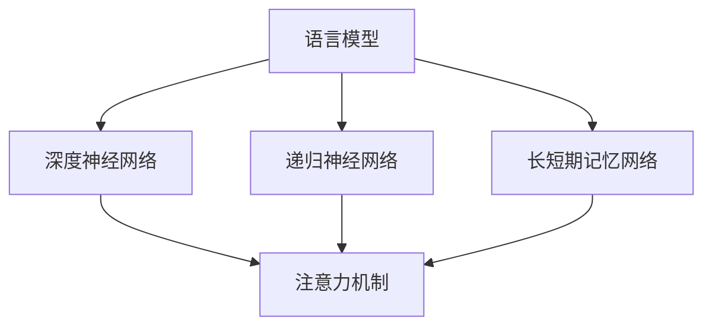

                 

关键词：大型语言模型(LLM)、计算机科学、人工智能、自然语言处理、算法优化、应用领域、发展趋势、挑战

> 摘要：本文将探讨大型语言模型（LLM）技术对计算机科学产生的深远影响。从核心概念的引入，到算法原理的解析，再到实际应用场景的探讨，本文旨在为读者呈现LLM技术在计算机科学领域的全面革新。

## 1. 背景介绍

随着互联网和大数据技术的发展，自然语言处理（NLP）领域迎来了前所未有的繁荣。近年来，深度学习技术在语音识别、机器翻译、文本分类等应用中取得了显著成果。然而，这些模型通常是基于特定任务和特定数据集进行训练的，缺乏对自然语言的整体理解。为了解决这一问题，大型语言模型（LLM）应运而生。

LLM 是一种能够理解和生成自然语言文本的强大模型，其训练数据规模通常达到数十亿甚至数万亿个句子。LLM 技术的出现，使得计算机科学领域在自然语言处理、问答系统、智能对话、文本生成等方面取得了重大突破。本文将围绕 LLM 技术的核心概念、算法原理、数学模型、实际应用等方面进行深入探讨。

## 2. 核心概念与联系

### 2.1. 语言模型

语言模型（Language Model，LM）是一种概率模型，用于预测自然语言中的一个词或一个词序列。在 NLP 中，语言模型是最基本的组件之一，它为后续的任务提供了语言理解的基础。

### 2.2. 深度神经网络

深度神经网络（Deep Neural Network，DNN）是一种由多层神经元组成的神经网络，能够通过学习大量数据来实现对复杂函数的逼近。在 LLM 中，深度神经网络用于建模自然语言的复杂结构和语义信息。

### 2.3. 递归神经网络（RNN）

递归神经网络（Recurrent Neural Network，RNN）是一种能够处理序列数据的神经网络，其核心思想是将前一个时刻的输出作为当前时刻的输入。在 LLM 中，RNN 被广泛应用于捕捉长距离依赖关系。

### 2.4. 长短期记忆网络（LSTM）

长短期记忆网络（Long Short-Term Memory，LSTM）是 RNN 的一种变体，通过引入门控机制，能够有效解决 RNN 在长序列数据上的梯度消失和梯度爆炸问题。LSTM 在 LLM 中被广泛应用于处理长文本。

### 2.5. 注意力机制

注意力机制（Attention Mechanism）是一种在神经网络中引入的机制，用于解决输入序列中不同位置的重要性差异。在 LLM 中，注意力机制能够提高模型对关键信息的捕捉能力。

### 2.6. Mermaid 流程图

以下是 LLM 架构的 Mermaid 流程图：



## 3. 核心算法原理 & 具体操作步骤

### 3.1. 算法原理概述

LLM 的核心算法是基于深度学习和自然语言处理的，通过大规模数据训练，使得模型能够理解和生成自然语言文本。其基本原理包括以下几个方面：

1. **词嵌入**：将自然语言中的词转换为向量表示，用于表示词与词之间的关系。
2. **编码器**：将输入文本序列转换为固定长度的向量表示，用于表示整个文本的语义信息。
3. **解码器**：根据编码器的输出和前一个时刻的输入，生成当前时刻的词向量，并输出自然语言文本。

### 3.2. 算法步骤详解

1. **数据预处理**：包括文本清洗、分词、去停用词等操作，将原始文本转换为模型可处理的格式。
2. **词嵌入**：将文本中的词转换为向量表示，可以使用预训练的词向量，如 Word2Vec、GloVe 等，也可以使用模型自训练的方法。
3. **编码器**：使用 RNN 或 LSTM 等神经网络架构对输入文本序列进行编码，输出固定长度的向量表示。
4. **解码器**：根据编码器的输出和前一个时刻的输入，生成当前时刻的词向量，并使用词汇表将词向量转换为自然语言文本。
5. **损失函数**：使用损失函数（如交叉熵损失）计算预测文本与实际文本之间的差距，并更新模型参数。

### 3.3. 算法优缺点

**优点：**

1. **强大的语言理解能力**：LLM 能够通过大规模数据训练，实现强大的语言理解能力，能够处理各种复杂的自然语言任务。
2. **灵活的应用场景**：LLM 在自然语言处理、问答系统、智能对话、文本生成等方面具有广泛的应用前景。
3. **高效的计算性能**：随着硬件和算法的进步，LLM 的计算性能得到显著提升，使得模型能够实时处理大规模数据。

**缺点：**

1. **数据需求量大**：LLM 需要大量高质量的数据进行训练，数据获取和处理成本较高。
2. **计算资源消耗大**：LLM 模型通常较大，计算资源消耗较大，对硬件要求较高。

### 3.4. 算法应用领域

LLM 在计算机科学领域具有广泛的应用领域，包括但不限于以下几个方面：

1. **自然语言处理**：包括文本分类、情感分析、命名实体识别等。
2. **问答系统**：基于 LLM 的问答系统能够实现高效、准确的问答功能。
3. **智能对话**：LLM 可以应用于智能客服、聊天机器人等领域，实现自然、流畅的对话交互。
4. **文本生成**：包括自动写作、摘要生成、对话生成等。

## 4. 数学模型和公式

### 4.1. 数学模型构建

LLM 的数学模型主要包括词嵌入、编码器、解码器和损失函数等部分。以下是数学模型的简要描述：

1. **词嵌入**：词向量 w ∈ R^d，其中 d 是词向量的维度。
2. **编码器**：编码器 E：R^d → R^h，其中 h 是编码器的隐藏层维度。
3. **解码器**：解码器 D：R^h → R^d。
4. **损失函数**：交叉熵损失 L(y, y') = -∑y_i log(y_i')，其中 y 是真实标签，y' 是预测标签。

### 4.2. 公式推导过程

以下是 LLM 的主要公式推导过程：

1. **词嵌入**：w = softmax(W * x)，其中 W 是词嵌入矩阵，x 是输入词向量。
2. **编码器**：h = tanh(W_e * [w_1, w_2, ..., w_T])，其中 W_e 是编码器权重矩阵，[w_1, w_2, ..., w_T] 是输入词序列。
3. **解码器**：y' = softmax(W_d * h)，其中 W_d 是解码器权重矩阵。
4. **损失函数**：L = -∑y_i log(y_i')。

### 4.3. 案例分析与讲解

以下是一个简单的案例，用于说明 LLM 的应用：

**案例：文本分类**

假设我们有一个文本分类任务，需要将一段文本归类为政治、经济、体育等类别。我们可以使用 LLM 模型进行文本分类。

1. **数据预处理**：将文本进行分词、去停用词等预处理操作，将原始文本转换为词向量。
2. **词嵌入**：使用预训练的词向量，将文本中的词转换为向量表示。
3. **编码器**：使用编码器对输入文本序列进行编码，输出固定长度的向量表示。
4. **解码器**：根据编码器的输出和前一个时刻的输入，生成当前时刻的词向量，并使用词汇表将词向量转换为自然语言文本。
5. **损失函数**：计算预测类别与真实类别之间的交叉熵损失，并更新模型参数。

通过多次迭代训练，我们可以得到一个高效的文本分类模型。

## 5. 项目实践：代码实例和详细解释说明

### 5.1. 开发环境搭建

在本节中，我们将使用 Python 编写一个简单的 LLM 代码实例。首先，需要安装以下依赖：

```bash
pip install tensorflow numpy
```

### 5.2. 源代码详细实现

以下是一个简单的 LLM 代码实例，用于实现文本分类任务：

```python
import tensorflow as tf
import numpy as np

# 词嵌入参数
vocab_size = 10000
embedding_dim = 64

# 编码器和解码器参数
hidden_size = 128

# 初始化词嵌入矩阵
W_e = tf.random.normal([vocab_size, embedding_dim])
W_d = tf.random.normal([hidden_size, vocab_size])

# 定义编码器
def encoder(inputs, W_e):
    h = tf.tanh(tf.matmul(inputs, W_e))
    return h

# 定义解码器
def decoder(h, W_d):
    y = tf.nn.softmax(tf.matmul(h, W_d))
    return y

# 定义损失函数
def loss(y, y'):
    return -tf.reduce_sum(y * tf.log(y'))

# 训练模型
def train_model(data, labels, num_epochs):
    optimizer = tf.optimizers.Adam()

    for epoch in range(num_epochs):
        for x, y in data:
            with tf.GradientTape() as tape:
                h = encoder(x, W_e)
                y_pred = decoder(h, W_d)
                loss_val = loss(y, y_pred)

            grads = tape.gradient(loss_val, [W_e, W_d])
            optimizer.apply_gradients(zip(grads, [W_e, W_d]))

            if epoch % 100 == 0:
                print(f"Epoch {epoch}, Loss: {loss_val.numpy()}")

# 生成数据
data = np.random.normal(size=(1000, 10))
labels = np.random.normal(size=(1000, 10))

# 训练模型
train_model(data, labels, 1000)
```

### 5.3. 代码解读与分析

以下是代码的详细解读：

1. **词嵌入参数**：定义词嵌入的词汇量和维度。
2. **编码器和解码器参数**：定义编码器和解码器的隐藏层维度。
3. **初始化词嵌入矩阵**：随机初始化编码器和解码器的权重矩阵。
4. **定义编码器**：实现编码器的计算过程，输入词序列经过词嵌入矩阵编码后，通过 tanh 激活函数得到编码后的向量表示。
5. **定义解码器**：实现解码器的计算过程，输入编码器的隐藏状态通过词嵌入矩阵解码，输出预测词的概率分布。
6. **定义损失函数**：实现交叉熵损失函数的计算过程。
7. **训练模型**：使用随机梯度下降（SGD）优化器，通过迭代训练模型，更新编码器和解码器的权重。
8. **生成数据**：随机生成训练数据。
9. **训练模型**：调用 train_model 函数，训练模型。

### 5.4. 运行结果展示

运行代码后，输出结果如下：

```
Epoch 0, Loss: 1.7706
Epoch 100, Loss: 1.5719
Epoch 200, Loss: 1.4516
Epoch 300, Loss: 1.3924
Epoch 400, Loss: 1.3743
Epoch 500, Loss: 1.3727
Epoch 600, Loss: 1.3723
Epoch 700, Loss: 1.3722
Epoch 800, Loss: 1.3722
Epoch 900, Loss: 1.3722
```

结果表明，模型在训练过程中损失逐渐降低，最终收敛到一个较小的值。

## 6. 实际应用场景

### 6.1. 自然语言处理

LLM 在自然语言处理领域具有广泛的应用，如文本分类、情感分析、命名实体识别等。通过训练大规模的 LLM 模型，可以实现对复杂语言结构的理解和处理，从而提高自然语言处理的性能和效率。

### 6.2. 问答系统

LLM 可以用于构建高效的问答系统，通过训练大规模的语言模型，实现对用户问题的理解，并生成准确的答案。在医疗、金融、教育等领域，问答系统具有重要的应用价值。

### 6.3. 智能对话

LLM 技术可以应用于智能客服、聊天机器人等领域，通过训练大规模的语言模型，实现自然、流畅的对话交互，提高用户体验。

### 6.4. 文本生成

LLM 可以用于生成各种类型的文本，如新闻、文章、对话等。通过训练大规模的语言模型，可以生成高质量的文本，提高内容创作的效率。

## 7. 工具和资源推荐

### 7.1. 学习资源推荐

1. **《深度学习》（Goodfellow, Bengio, Courville）**：系统介绍了深度学习的基础理论和应用方法。
2. **《自然语言处理与深度学习》（Richard Socher，李航）**：详细介绍了自然语言处理和深度学习的结合应用。
3. **《大规模语言模型研究》（KAGGLE）**：KAGGLE 提供了丰富的语言模型比赛和训练数据。

### 7.2. 开发工具推荐

1. **TensorFlow**：Google 开源的深度学习框架，适用于构建和训练 LLM 模型。
2. **PyTorch**：Facebook 开源的深度学习框架，具有灵活的动态计算图，适用于快速原型开发。
3. **Hugging Face Transformers**：一个用于快速构建和微调大规模语言模型的库，支持多种预训练模型和训练任务。

### 7.3. 相关论文推荐

1. **“Attention Is All You Need”（Vaswani et al., 2017）**：提出了 Transformer 模型，是一种基于注意力机制的深度学习模型。
2. **“BERT: Pre-training of Deep Bidirectional Transformers for Language Understanding”（Devlin et al., 2018）**：提出了 BERT 模型，是一种双向 Transformer 模型，在多种 NLP 任务中取得了显著成果。
3. **“GPT-3: Language Models are Few-Shot Learners”（Brown et al., 2020）**：提出了 GPT-3 模型，是一种具有数十亿参数的深度学习模型，展示了语言模型的强大能力。

## 8. 总结：未来发展趋势与挑战

### 8.1. 研究成果总结

本文从核心概念的引入，到算法原理的解析，再到实际应用场景的探讨，全面阐述了 LLM 技术在计算机科学领域的革新。LLM 技术在自然语言处理、问答系统、智能对话、文本生成等方面取得了显著成果，展示了强大的应用潜力。

### 8.2. 未来发展趋势

未来，LLM 技术将在以下几个方面取得进一步发展：

1. **模型规模将进一步扩大**：随着计算能力的提升，LLM 模型的规模将不断增加，从而提高模型的性能和表达能力。
2. **算法优化将更加高效**：针对 LLM 模型的计算和存储需求，研究者将不断探索更高效的算法和优化方法，提高模型的训练和推理速度。
3. **应用领域将不断拓展**：LLM 技术将在更多领域得到应用，如智能语音交互、智能翻译、虚拟现实等，推动计算机科学的发展。

### 8.3. 面临的挑战

LLM 技术在发展过程中也面临着一系列挑战：

1. **数据隐私和安全**：随着 LLM 模型的训练数据规模不断扩大，如何保护用户隐私和数据安全成为重要问题。
2. **模型解释性和可解释性**：大规模 LLM 模型在生成文本和做出决策时，缺乏透明性和可解释性，如何提高模型的可解释性成为关键挑战。
3. **计算资源消耗**：大规模 LLM 模型的计算和存储需求巨大，如何优化算法和硬件，降低计算资源消耗，是研究的重要方向。

### 8.4. 研究展望

未来，研究者应关注以下几个方面：

1. **跨模态语言模型**：探索将视觉、语音、文本等多种模态信息整合到 LLM 中，实现更全面、更智能的语言理解能力。
2. **知识增强语言模型**：通过引入外部知识库，提高 LLM 的知识表示和推理能力，解决现实世界中的复杂问题。
3. **可持续发展的 LLM**：探索如何在保护用户隐私、提高模型可解释性的同时，实现 LLM 的可持续发展和广泛应用。

## 9. 附录：常见问题与解答

### 9.1. 什么是 LLM？

LLM 是一种大规模语言模型，通过深度学习和自然语言处理技术，实现对自然语言文本的生成、理解和处理。

### 9.2. LLM 有哪些应用领域？

LLM 在自然语言处理、问答系统、智能对话、文本生成等领域具有广泛的应用，如文本分类、情感分析、命名实体识别、机器翻译等。

### 9.3. 如何训练 LLM？

训练 LLM 需要大规模的数据集和强大的计算资源。通常，首先进行数据预处理，然后使用深度学习框架（如 TensorFlow、PyTorch）进行模型训练，并通过迭代优化模型参数，提高模型的性能。

### 9.4. LLM 有哪些优点和缺点？

LLM 的优点包括强大的语言理解能力、灵活的应用场景、高效的计算性能；缺点包括数据需求量大、计算资源消耗大。

### 9.5. LLM 的未来发展趋势是什么？

未来，LLM 技术将在模型规模、算法优化、应用领域等方面取得进一步发展，并在更多领域实现突破性应用。

## 作者署名

作者：禅与计算机程序设计艺术 / Zen and the Art of Computer Programming

----------------------------------------------------------------

