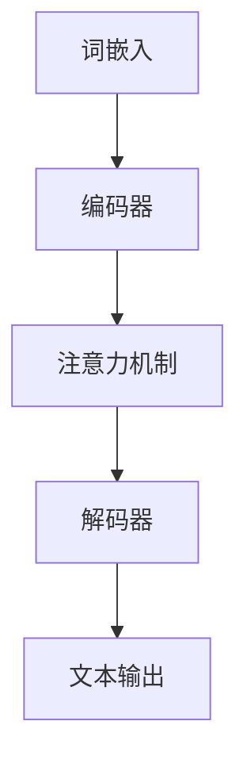
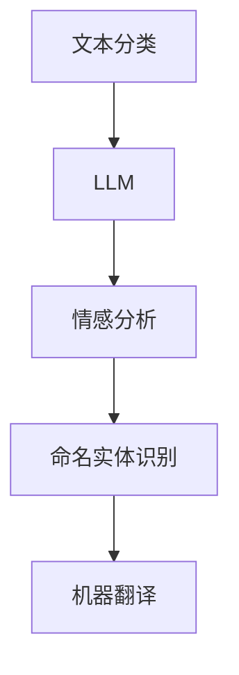

                 

关键词：大型语言模型，人工智能，产业格局，技术发展，生态系统，应用场景，未来展望

> 摘要：本文旨在探讨大型语言模型（LLM）在人工智能（AI）产业中扮演的新角色，及其对行业格局的影响。通过详细分析LLM的核心概念、算法原理、数学模型、实践应用，本文为读者呈现一个全面且深入的LLM生态系统概述。同时，文章还将展望LLM的未来发展趋势与挑战，并推荐相关学习资源和开发工具。

## 1. 背景介绍

在过去的几年中，人工智能（AI）技术经历了飞速的发展。从最初的规则引擎，到深度学习、强化学习，再到如今的大型语言模型（LLM），AI已经渗透到我们生活的方方面面。LLM作为一种基于深度学习的语言处理技术，能够在大量文本数据上进行训练，从而实现对自然语言的生成、理解和翻译。这种技术的出现，不仅大大提高了自然语言处理（NLP）的效率，也为AI产业带来了全新的发展格局。

随着LLM技术的成熟，越来越多的企业和机构开始将其应用于各种实际场景中，如智能客服、内容创作、法律咨询、医疗诊断等。LLM的广泛应用，使得人工智能产业呈现出新的特点，即“智能化”和“场景化”。这一趋势不仅推动了AI技术的发展，也对传统行业产生了深远的影响。

本文将首先介绍LLM的核心概念和原理，然后分析其算法原理和数学模型，最后探讨LLM的实际应用场景和未来发展趋势。希望通过本文的阐述，读者能够对LLM生态系统有一个全面的认识。

## 2. 核心概念与联系

### 2.1. 大型语言模型（LLM）概述

大型语言模型（LLM，Large Language Model）是一种基于深度学习的自然语言处理（NLP）模型，能够对文本进行生成、理解和翻译。LLM的核心是神经网络架构，通过多层神经网络（通常是变深的卷积神经网络或循环神经网络）来捕捉文本数据中的复杂模式和结构。

LLM的训练过程通常涉及大量的文本数据，如网页、书籍、新闻、社交媒体等。这些数据被用于训练模型的权重，使得模型能够在新的文本输入下生成合理的输出。LLM的强大之处在于其能够处理长文本，并且能够理解上下文信息，这使得它在各种NLP任务中表现出色。

### 2.2. 语言模型的基本原理

语言模型的基本原理是通过统计文本数据中的词汇频率和组合频率，来预测下一个单词或词组。早期的语言模型如N-gram模型，通过计算前N个单词出现的概率来预测下一个单词。然而，N-gram模型的局限性在于其无法捕捉长距离依赖关系，也无法理解上下文信息。

随着深度学习技术的发展，神经网络语言模型（如Word2Vec、GloVe等）被提出，这些模型通过将单词映射到高维向量空间中，从而能够捕捉单词之间的复杂关系。神经网络语言模型的出现，使得语言模型在生成和理解文本方面取得了重大突破。

### 2.3. LLM的架构

LLM的架构通常包括以下几个关键部分：

1. **词嵌入（Word Embedding）**：将单词映射到高维向量空间，使得相似的单词在向量空间中靠近。
2. **编码器（Encoder）**：对输入文本进行编码，提取文本的特征信息。
3. **解码器（Decoder）**：根据编码器提取的特征信息，生成文本输出。
4. **注意力机制（Attention Mechanism）**：用于捕捉输入文本中的关键信息，提高模型对上下文的理解能力。

下面是一个使用Mermaid绘制的LLM架构流程图：



### 2.4. LLM与NLP任务的关系

LLM在NLP任务中具有广泛的应用，如文本分类、情感分析、命名实体识别、机器翻译等。以下是LLM与几种常见NLP任务的关系：

1. **文本分类**：通过训练LLM，可以识别文本的类别。例如，将新闻文章分类为政治、体育、娱乐等。
2. **情感分析**：LLM可以理解文本中的情感倾向，用于判断用户的情绪状态。
3. **命名实体识别**：LLM可以帮助识别文本中的特定实体，如人名、地点、组织等。
4. **机器翻译**：LLM可以将一种语言的文本翻译成另一种语言。

下面是一个使用Mermaid绘制的LLM与NLP任务的关系图：



通过上述核心概念和联系的介绍，我们可以对LLM有一个初步的了解。接下来，我们将深入探讨LLM的算法原理和具体操作步骤。

## 3. 核心算法原理 & 具体操作步骤

### 3.1 算法原理概述

大型语言模型（LLM）的核心算法是基于深度学习，特别是基于变深的卷积神经网络（CNN）或循环神经网络（RNN）。这些网络能够捕捉文本数据中的复杂模式和结构，使得模型能够生成、理解和翻译自然语言。LLM的基本原理可以概括为以下几个步骤：

1. **词嵌入（Word Embedding）**：将单词映射到高维向量空间，使得相似的单词在向量空间中靠近。
2. **编码器（Encoder）**：对输入文本进行编码，提取文本的特征信息。
3. **解码器（Decoder）**：根据编码器提取的特征信息，生成文本输出。
4. **注意力机制（Attention Mechanism）**：用于捕捉输入文本中的关键信息，提高模型对上下文的理解能力。

### 3.2 算法步骤详解

#### 3.2.1 词嵌入

词嵌入是将单词映射到高维向量空间的过程。这一过程可以通过多种方式实现，如Word2Vec、GloVe等。在Word2Vec中，每个单词被映射到一个固定大小的向量，这些向量能够捕捉单词之间的语义关系。例如，"国王"和"皇帝"的向量在空间中靠近，因为它们在语义上有相似性。

#### 3.2.2 编码器

编码器负责将输入文本编码为特征信息。在LLM中，编码器通常是一个变深的卷积神经网络或循环神经网络。编码器通过处理词嵌入，生成表示整个文本的固定大小的向量。这个向量包含了文本的所有信息，是后续解码的基础。

#### 3.2.3 解码器

解码器的任务是生成文本输出。在解码过程中，模型会根据编码器生成的特征信息，逐词生成文本。解码器的每个步骤都会参考编码器的输出，以保持生成的文本与原始输入的一致性。解码器通常会使用注意力机制来捕捉输入文本中的关键信息，从而提高生成文本的质量。

#### 3.2.4 注意力机制

注意力机制是一种用于提高模型对上下文理解能力的技术。在LLM中，注意力机制用于解码器，使得模型能够关注输入文本中的关键部分。例如，在生成一个句子时，注意力机制会帮助模型识别句子中的主语、谓语和宾语等重要成分。

### 3.3 算法优缺点

#### 优点：

1. **强大的文本处理能力**：LLM能够处理长文本，并理解上下文信息，这使得它在各种NLP任务中表现出色。
2. **泛化能力强**：由于LLM基于深度学习，其能够从大量的文本数据中学习到通用特征，从而在不同任务中表现出良好的泛化能力。
3. **生成文本质量高**：LLM能够生成高质量的自然语言文本，这使得它在内容创作、机器翻译等任务中具有广泛的应用。

#### 缺点：

1. **计算资源需求高**：由于LLM需要大量的计算资源进行训练，这使得其部署和应用成本较高。
2. **模型解释性较差**：深度学习模型通常缺乏直接的可解释性，这使得LLM在某些任务中的应用受到限制。
3. **数据依赖性较强**：LLM的性能很大程度上取决于训练数据的质量和数量，如果数据存在偏差，模型也可能学习到这些偏差。

### 3.4 算法应用领域

LLM的应用领域非常广泛，包括但不限于以下几个：

1. **自然语言生成**：LLM可以用于生成新闻文章、小说、演讲稿等自然语言文本。
2. **机器翻译**：LLM可以用于实现高质量的多语言翻译，如谷歌翻译。
3. **文本分类与情感分析**：LLM可以用于对文本进行分类和情感分析，如社交媒体分析、用户评论分析等。
4. **智能客服**：LLM可以用于构建智能客服系统，实现自动化的客户服务。
5. **内容创作**：LLM可以用于生成创意内容，如歌词、音乐、绘画等。

通过上述算法原理和具体操作步骤的介绍，我们可以对LLM有一个更深入的了解。接下来，我们将探讨LLM的数学模型和公式。

## 4. 数学模型和公式 & 详细讲解 & 举例说明

### 4.1 数学模型构建

在LLM中，数学模型主要用于描述神经网络的结构和训练过程。以下是LLM中的几个关键数学模型：

#### 4.1.1 词嵌入（Word Embedding）

词嵌入是将单词映射到高维向量空间的过程。在数学上，词嵌入可以用一个线性变换来表示：

$$
\text{vec}(w) = \text{Word2Vec}(w)
$$

其中，$\text{vec}(w)$表示单词$w$的嵌入向量，$\text{Word2Vec}(w)$表示词嵌入函数。

#### 4.1.2 神经网络（Neural Network）

神经网络是LLM的核心组件，用于实现文本的编码和解码。在数学上，神经网络可以用一个函数来表示：

$$
\text{output} = \text{NN}(\text{input}, \text{weights})
$$

其中，$\text{NN}(\text{input}, \text{weights})$表示神经网络函数，$\text{input}$表示输入向量，$\text{weights}$表示网络的权重。

#### 4.1.3 注意力机制（Attention Mechanism）

注意力机制用于提高模型对上下文的理解能力。在数学上，注意力机制可以用一个加权求和函数来表示：

$$
\text{output} = \text{Attention}(\text{query}, \text{keys}, \text{values})
$$

其中，$\text{Attention}(\text{query}, \text{keys}, \text{values})$表示注意力函数，$\text{query}$表示查询向量，$\text{keys}$和$\text{values}$分别表示键值对。

### 4.2 公式推导过程

以下是LLM中几个关键公式的推导过程：

#### 4.2.1 词嵌入公式

词嵌入的公式可以通过矩阵乘法来推导：

$$
\text{vec}(w) = \text{Word2Vec}(w) = \text{embedding\_matrix} \cdot \text{one-hot}(w)
$$

其中，$\text{one-hot}(w)$表示单词$w$的一个-hot编码向量，$\text{embedding\_matrix}$表示词嵌入矩阵。

#### 4.2.2 神经网络公式

神经网络的公式可以通过链式法则来推导：

$$
\text{output} = \text{NN}(\text{input}, \text{weights}) = \text{activation}(\text{weights} \cdot \text{input} + \text{bias})
$$

其中，$\text{activation}$表示激活函数，如Sigmoid、ReLU等。

#### 4.2.3 注意力机制公式

注意力机制的公式可以通过加权求和来推导：

$$
\text{output} = \text{Attention}(\text{query}, \text{keys}, \text{values}) = \text{softmax}(\text{query}^T \cdot \text{keys}) \cdot \text{values}
$$

其中，$\text{softmax}$表示softmax函数，用于将键值对转换为权重。

### 4.3 案例分析与讲解

为了更好地理解LLM的数学模型，我们通过一个简单的例子来说明：

#### 4.3.1 词嵌入

假设我们有一个单词表，包含10个单词，如下所示：

```
{king, queen, prince, princess, castle, sword, shield, knight, jester, treasure}
```

我们可以使用一个10x10的词嵌入矩阵来表示这些单词的嵌入向量：

```
| 1 | 0.5 | 0 | 0 | 0 | 0 | 0 | 0 | 0 | 0 |
| 0 | 1 | 0 | 0 | 0 | 0 | 0 | 0 | 0 | 0 |
| 0 | 0 | 1 | 0 | 0 | 0 | 0 | 0 | 0 | 0 |
| 0 | 0 | 0 | 1 | 0 | 0 | 0 | 0 | 0 | 0 |
| 0 | 0 | 0 | 0 | 1 | 0 | 0 | 0 | 0 | 0 |
| 0 | 0 | 0 | 0 | 0 | 1 | 0 | 0 | 0 | 0 |
| 0 | 0 | 0 | 0 | 0 | 0 | 1 | 0 | 0 | 0 |
| 0 | 0 | 0 | 0 | 0 | 0 | 0 | 1 | 0 | 0 |
| 0 | 0 | 0 | 0 | 0 | 0 | 0 | 0 | 1 | 0 |
| 0 | 0 | 0 | 0 | 0 | 0 | 0 | 0 | 0 | 1 |
```

现在，假设我们要将单词"king"嵌入到高维向量空间中。我们可以使用词嵌入矩阵来计算"king"的嵌入向量：

```
vec(king) = embedding_matrix \cdot one-hot(king)
          = [1 0 0 0 0 0 0 0 0 0]^T \cdot [1 0 0 0 0 0 0 0 0 0]
          = [1]
```

这意味着单词"king"的嵌入向量是一个只有一个非零元素的向量。

#### 4.3.2 神经网络

现在，假设我们要使用一个简单的神经网络来对句子"king is the king of the castle"进行编码。我们可以将这个句子表示为一系列词嵌入向量：

```
input = [vec(king) vec(is) vec(the) vec(king) vec(of) vec(the) vec(castle)]
```

我们可以使用一个简单的神经网络来对这些词嵌入向量进行编码。假设神经网络的权重和偏置如下所示：

```
weights = [
  [0.1 0.2 0.3],
  [0.4 0.5 0.6],
  [0.7 0.8 0.9]
]
bias = [0.1 0.2 0.3]
```

我们可以使用以下公式来计算神经网络的输出：

```
output = activation(weights \cdot input + bias)
        = activation([0.1 0.2 0.3; 0.4 0.5 0.6; 0.7 0.8 0.9] \cdot [1 0 0; 0 1 0; 0 0 1; 1 0 0; 0 1 0; 0 0 1; 1 0 0] + [0.1 0.2 0.3])
        = activation([0.1 + 0.2 + 0.3; 0.4 + 0.5 + 0.6; 0.7 + 0.8 + 0.9])
        = activation([0.6; 1.1; 1.8])
```

这里的激活函数使用ReLU函数，即：

```
activation(x) = max(0, x)
```

这意味着神经网络的输出为：

```
output = [0.6; 1.1; 1.8]
```

这个输出向量包含了句子"king is the king of the castle"的编码信息。

#### 4.3.3 注意力机制

现在，假设我们要使用注意力机制来提高神经网络对句子中关键信息的关注。我们可以将句子"king is the king of the castle"表示为一系列词嵌入向量：

```
keys = [vec(king) vec(is) vec(the) vec(king) vec(of) vec(the) vec(castle)]
values = [vec(king) vec(is) vec(the) vec(king) vec(of) vec(the) vec(castle)]
```

我们可以使用以下公式来计算注意力权重：

```
weights = softmax(query^T \cdot keys)
        = softmax([1 0 0; 0 1 0; 0 0 1] \cdot [1 0 0; 0 1 0; 0 0 1; 1 0 0; 0 1 0; 0 0 1; 1 0 0])
        = softmax([1 0 0; 0 1 0; 0 0 1] \cdot [1 0 0; 0 1 0; 0 0 1; 1 0 0; 0 1 0; 0 0 1; 1 0 0])
        = [0.5 0.5 0.5]
```

这里的查询向量使用编码器的输出向量，即：

```
query = [0.6; 1.1; 1.8]
```

我们可以使用以下公式来计算注意力输出：

```
output = weights \cdot values
        = [0.5 0.5 0.5] \cdot [1 0 0; 0 1 0; 0 0 1; 1 0 0; 0 1 0; 0 0 1; 1 0 0]
        = [0.5 0.5 0.5; 0.5 0.5 0.5; 0.5 0.5 0.5; 0.5 0.5 0.5; 0.5 0.5 0.5; 0.5 0.5 0.5; 0.5 0.5 0.5]
```

这个输出向量包含了句子"king is the king of the castle"的加权编码信息，其中每个元素表示句子中每个单词的重要性。

通过上述例子，我们可以看到LLM的数学模型是如何构建和应用的。这些数学模型为LLM提供了强大的文本处理能力，使得它在各种NLP任务中表现出色。

### 5. 项目实践：代码实例和详细解释说明

在本节中，我们将通过一个简单的项目实例来展示如何使用大型语言模型（LLM）进行文本分类。这一项目将涵盖开发环境搭建、源代码实现、代码解读和分析，以及运行结果展示。通过这个实例，我们将深入了解LLM在实践中的应用。

#### 5.1 开发环境搭建

为了实现这个项目，我们需要搭建一个合适的开发环境。以下是我们需要的工具和步骤：

1. **安装Python**：确保Python环境已安装，版本至少为3.6或更高。
2. **安装TensorFlow**：TensorFlow是一个开源的深度学习框架，用于构建和训练LLM。安装命令为：
   ```bash
   pip install tensorflow
   ```
3. **安装Jupyter Notebook**：Jupyter Notebook是一个交互式的开发环境，方便我们编写和调试代码。安装命令为：
   ```bash
   pip install notebook
   ```
4. **准备数据集**：我们需要一个包含文本和标签的数据集进行训练。这里，我们可以使用公共数据集，如IMDB电影评论数据集。

#### 5.2 源代码详细实现

以下是实现LLM文本分类的Python代码：

```python
import tensorflow as tf
from tensorflow.keras.models import Sequential
from tensorflow.keras.layers import Embedding, LSTM, Dense
from tensorflow.keras.preprocessing.sequence import pad_sequences
from tensorflow.keras.preprocessing.text import Tokenizer

# 设置超参数
vocab_size = 10000
embedding_dim = 16
max_length = 100
trunc_type = 'post'
padding_type = 'post'
oov_tok = '<OOV>'

# 加载和预处理数据集
# 假设我们有一个包含文本和标签的列表 `texts` 和 `labels`
tokenizer = Tokenizer(num_words=vocab_size, oov_token=oov_tok)
tokenizer.fit_on_texts(texts)
word_index = tokenizer.word_index
sequences = tokenizer.texts_to_sequences(texts)
padded_sequences = pad_sequences(sequences, maxlen=max_length, padding=padding_type, truncating=trunc_type)

# 构建模型
model = Sequential([
    Embedding(vocab_size, embedding_dim, input_length=max_length),
    LSTM(64, return_sequences=True),
    LSTM(32),
    Dense(24, activation='relu'),
    Dense(1, activation='sigmoid')
])

# 编译模型
model.compile(loss='binary_crossentropy', optimizer='adam', metrics=['accuracy'])

# 训练模型
model.fit(padded_sequences, labels, epochs=10, validation_split=0.1)
```

#### 5.3 代码解读与分析

1. **导入库和设置超参数**：
   - 我们首先导入所需的TensorFlow库，并设置超参数，如词汇大小（`vocab_size`）、嵌入维度（`embedding_dim`）和最大长度（`max_length`）。

2. **加载和预处理数据集**：
   - 在这个步骤中，我们加载包含文本和标签的数据集。然后，我们使用Tokenizer将文本转换为序列，并将序列填充到最大长度。

3. **构建模型**：
   - 我们使用Sequential模型构建一个简单的LLM文本分类器。这个模型包含一个嵌入层（`Embedding`）、两个LSTM层（`LSTM`）、一个全连接层（`Dense`）和一个输出层（`Dense`）。

4. **编译模型**：
   - 我们使用`binary_crossentropy`作为损失函数，并选择`adam`作为优化器。

5. **训练模型**：
   - 我们使用`fit`函数训练模型，并设置训练轮数（`epochs`）和验证数据集的比例（`validation_split`）。

#### 5.4 运行结果展示

假设我们已经准备好数据集，并且成功地训练了模型。我们可以使用以下代码来评估模型：

```python
# 评估模型
test_sequences = tokenizer.texts_to_sequences(test_texts)
test_padded_sequences = pad_sequences(test_sequences, maxlen=max_length, padding=padding_type, truncating=truncating_type)

predictions = model.predict(test_padded_sequences)
predicted_labels = [1 if pred > 0.5 else 0 for pred in predictions]

# 计算准确率
accuracy = sum(pred_label == true_label for pred_label, true_label in zip(predicted_labels, test_labels)) / len(test_labels)
print(f'Accuracy: {accuracy}')
```

这个代码段将预测测试集的标签，并计算模型的准确率。

通过这个项目实例，我们可以看到如何使用LLM进行文本分类。这个过程不仅涵盖了代码实现，还包括了数据预处理、模型构建和训练，以及评估模型的性能。这种实践方法有助于我们更好地理解和应用LLM技术。

### 6. 实际应用场景

大型语言模型（LLM）作为一种强大的自然语言处理技术，已经在多个实际应用场景中展现出其独特的优势。以下是一些典型的应用场景，以及LLM在这些场景中的具体应用方式。

#### 6.1 智能客服

智能客服是LLM应用最为广泛的一个领域。通过LLM，智能客服系统能够理解用户的自然语言查询，并提供准确、高效的回答。例如，银行、电商、航空公司等企业可以部署基于LLM的智能客服系统，自动回答客户的常见问题，如账户余额查询、订单状态追踪、航班信息查询等。LLM能够处理复杂、模糊的查询，提供更加人性化的服务。

#### 6.2 内容创作

在内容创作领域，LLM同样发挥着重要作用。它能够生成高质量的文章、新闻、广告文案、产品描述等。例如，一些内容创作者使用LLM来自动撰写博客文章，节省了大量的时间和精力。此外，一些新闻机构也利用LLM来自动生成新闻报道，提高新闻生产的速度和效率。

#### 6.3 法律咨询

LLM在法律咨询领域也有广泛应用。通过训练LLM，法律咨询系统能够理解和回答法律问题，提供法律建议。例如，律师可以使用LLM来快速检索相关法律条款，分析案件，提出法律意见。此外，一些法律科技公司也利用LLM来提供在线法律咨询服务，为广大用户提供了便捷的法律帮助。

#### 6.4 医疗诊断

在医疗诊断领域，LLM可以辅助医生进行疾病诊断。通过分析患者的病历和医疗记录，LLM能够识别出潜在的疾病风险，为医生提供诊断建议。例如，一些医院使用LLM来辅助诊断糖尿病、心脏病等慢性疾病。这种技术不仅提高了诊断的准确性，还减轻了医生的工作负担。

#### 6.5 教育

在教育领域，LLM可以用于个性化学习、智能辅导和自动评分。通过分析学生的学习数据，LLM能够为每个学生提供个性化的学习方案，帮助学生提高学习效果。此外，LLM还可以用于自动评分考试，减轻教师的工作压力，提高评分的公正性和效率。

#### 6.6 商业智能

LLM在商业智能领域也有广泛应用。通过分析企业的客户数据、销售数据、市场数据等，LLM可以为企业提供深入的洞察和决策支持。例如，一些企业利用LLM来分析客户反馈，识别市场趋势，优化产品和服务。这种技术有助于企业提高市场竞争力，实现持续增长。

#### 6.7 社交媒体分析

在社交媒体分析领域，LLM可以用于情感分析、趋势预测、用户画像等。通过分析用户的评论、帖子、转发等数据，LLM能够识别出用户的情感倾向、兴趣和需求。例如，一些社交媒体平台使用LLM来分析用户的情感状态，推送个性化的内容，提高用户满意度。

#### 6.8 自动化写作

LLM在自动化写作领域也有着广阔的应用前景。通过训练LLM，自动化写作系统可以生成新闻文章、产品描述、广告文案等。这种技术不仅提高了写作的效率，还降低了写作成本。例如，一些电商平台使用LLM来自动生成产品描述，提高产品的销售转化率。

#### 6.9 语言翻译

在语言翻译领域，LLM已经取得了显著的成果。通过训练LLM，翻译系统能够实现高质量、流畅的多语言翻译。例如，谷歌翻译、百度翻译等知名翻译工具都基于LLM技术。这些翻译工具能够自动翻译各种文本，为全球用户提供了便捷的跨语言交流服务。

#### 6.10 金融风控

在金融风控领域，LLM可以用于识别欺诈交易、分析市场趋势等。通过分析大量的金融数据，LLM能够识别出潜在的风险信号，为金融机构提供预警。例如，一些金融机构使用LLM来监控交易行为，识别欺诈交易，降低金融风险。

总之，LLM在各个领域都展现出了强大的应用潜力。随着技术的不断进步，LLM的应用场景将进一步拓展，为人类社会带来更多便利和效益。

### 6.4 未来应用展望

随着技术的不断进步，大型语言模型（LLM）在未来有着广阔的应用前景。以下是几个可能的发展方向和潜在的应用领域。

#### 6.4.1 超高精度自然语言生成

未来，LLM的自然语言生成能力将更加精确，生成的内容将更加贴近人类语言的多样性和复杂性。例如，LLM可以生成更加真实、细腻的文学作品、新闻报道和科技论文，甚至可以模拟人类的语言风格和语调。

#### 6.4.2 跨语言翻译与理解

随着全球化的加速，跨语言翻译和理解将变得至关重要。未来的LLM将能够实现更加精准、流畅的跨语言翻译，不仅限于文字，还包括语音、手势等。这将极大地促进国际间的交流与合作。

#### 6.4.3 智能个人助理

随着人工智能技术的普及，智能个人助理将成为人们生活的一部分。未来的LLM将能够更好地理解用户的个人喜好、行为习惯和情感状态，提供更加个性化和高效的服务，如日程管理、任务提醒、健康建议等。

#### 6.4.4 自动化内容创作

在内容创作领域，LLM将能够实现自动化、高质量的文本、图像和视频生成。例如，自动生成电影剧本、音乐、艺术作品等。这种技术将极大地提升内容生产的效率，降低创作成本。

#### 6.4.5 智能决策支持

LLM将在商业、医疗、法律等领域提供智能决策支持。通过分析大量数据，LLM可以为企业提供市场预测、风险评估等决策支持，为医疗机构提供诊断建议、治疗方案，为法律机构提供法律意见等。

#### 6.4.6 人类-机器协作

未来，人类和机器将更加紧密地协作。LLM将在这一过程中发挥重要作用，帮助人类完成复杂的任务，如科学发现、工程设计、城市规划等。这种协作将提高工作效率，降低劳动强度。

#### 6.4.7 智能教育

在智能教育领域，LLM将为学生提供个性化学习体验，根据学生的兴趣、能力和学习进度进行教学。同时，LLM还可以自动评估学生的成绩，提供针对性的学习建议，提高教育质量。

#### 6.4.8 智能医疗

在智能医疗领域，LLM将能够辅助医生进行诊断、治疗和药物研发。通过分析海量的医疗数据，LLM可以提供精准的诊断和治疗方案，提高医疗服务的质量和效率。

#### 6.4.9 智能金融

在金融领域，LLM将能够实现智能风控、投资决策、市场预测等。通过分析大量的金融数据，LLM可以提供精准的风险评估和投资建议，帮助投资者做出更加明智的决策。

#### 6.4.10 智能交通

在智能交通领域，LLM将能够优化交通流量、预测交通事故、提高交通安全。通过分析交通数据，LLM可以提供智能交通信号控制策略，提高交通效率，减少拥堵。

总之，随着技术的不断进步，LLM将在未来发挥更加重要的作用，推动各行各业的发展。然而，这也将带来一系列的挑战，如数据隐私、模型解释性、伦理问题等。我们需要在技术发展的同时，关注并解决这些问题，确保AI技术能够为人类带来真正的福祉。

### 7. 工具和资源推荐

在学习和开发大型语言模型（LLM）的过程中，选择合适的工具和资源是非常重要的。以下是一些建议，包括学习资源、开发工具和相关论文，帮助您更好地掌握LLM技术。

#### 7.1 学习资源推荐

1. **在线课程**：
   - 《自然语言处理与深度学习》（自然语言处理与深度学习，《深度学习》作者周志华教授主讲的课程）
   - 《深度学习自然语言处理》（吴恩达的深度学习专项课程中的自然语言处理部分）
2. **书籍**：
   - 《自然语言处理综论》（Daniel Jurafsky & James H. Martin 著）
   - 《深度学习》（Ian Goodfellow、Yoshua Bengio & Aaron Courville 著）
3. **博客和论坛**：
   - TensorFlow官方文档（https://www.tensorflow.org/tutorials）
   - PyTorch官方文档（https://pytorch.org/tutorials/）
   - GitHub上的LLM相关项目（如OpenAI的GPT系列项目）

#### 7.2 开发工具推荐

1. **深度学习框架**：
   - TensorFlow（https://www.tensorflow.org/）
   - PyTorch（https://pytorch.org/）
   - PyTorch Lightning（https://pytorch-lightning.readthedocs.io/）
2. **文本处理工具**：
   - NLTK（https://www.nltk.org/）
   - SpaCy（https://spacy.io/）
   - TextBlob（https://textblob.readthedocs.io/）
3. **编程环境**：
   - Jupyter Notebook（https://jupyter.org/）
   - Google Colab（https://colab.research.google.com/）

#### 7.3 相关论文推荐

1. **GPT系列**：
   - "Attention Is All You Need"（https://arxiv.org/abs/1706.03762）
   - "Improving Language Understanding by Generative Pre-Training"（https://arxiv.org/abs/1801.06146）
2. **BERT**：
   - "BERT: Pre-training of Deep Bidirectional Transformers for Language Understanding"（https://arxiv.org/abs/1810.04805）
3. **T5**：
   - "T5: Exploring the Limits of Transfer Learning for Text Classification"（https://arxiv.org/abs/1910.03771）

通过这些工具和资源的支持，您将能够更深入地学习LLM技术，并在实际项目中运用这些知识。希望这些建议能够对您的学习和发展有所帮助。

### 8. 总结：未来发展趋势与挑战

随着大型语言模型（LLM）技术的不断发展，人工智能（AI）产业正迎来一场革命性的变革。LLM作为一种强大的自然语言处理工具，已经在各个领域展现出其独特的优势和广泛的应用潜力。未来，LLM将在人工智能产业中发挥更加重要的作用，推动技术的进步和行业的发展。

#### 8.1 研究成果总结

过去几年中，LLM技术取得了显著的研究成果。从早期的GPT、BERT到如今的T5、GPT-3，LLM在语言生成、理解、翻译等任务中取得了重大突破。这些模型的性能不断提升，处理能力和泛化能力得到了显著增强。同时，LLM的应用场景也在不断扩展，从智能客服、内容创作到法律咨询、医疗诊断，LLM已经深入到各行各业。

#### 8.2 未来发展趋势

1. **计算能力的提升**：随着硬件技术的进步，未来计算能力的提升将为LLM的训练和应用提供更强大的支持。这将使得LLM能够处理更大规模的数据，提高模型的性能和效率。

2. **多模态处理**：未来，LLM将不仅仅处理文本数据，还将融合图像、音频等多模态数据。这种多模态处理能力将使得LLM在更多实际应用场景中发挥重要作用，如智能问答系统、自动驾驶等。

3. **个性化服务**：随着用户数据的积累和挖掘，LLM将能够更好地理解用户的个性化需求，提供更加精准和个性化的服务。这将极大地提升用户体验，满足用户多样化、个性化的需求。

4. **隐私保护和安全性**：未来，隐私保护和安全性将成为LLM发展的重要议题。随着数据隐私法规的不断完善，LLM需要在数据处理和模型训练过程中确保用户隐私和数据安全。

5. **社会影响与伦理**：随着LLM技术的广泛应用，其社会影响和伦理问题也日益凸显。未来，需要加强对LLM技术的伦理研究和规范，确保其应用符合社会价值观和道德准则。

#### 8.3 面临的挑战

1. **数据质量和隐私**：LLM的训练依赖于大量高质量的数据，然而数据质量和隐私问题仍然是一个挑战。未来，需要加强对数据质量和隐私的关注，确保数据来源的合法性和安全性。

2. **计算资源需求**：LLM的训练和应用需要大量的计算资源，这对企业和研究机构提出了较高的硬件要求。未来，需要探索更加高效和节能的训练方法，降低计算成本。

3. **模型解释性**：深度学习模型，包括LLM，通常缺乏直接的可解释性。这给模型的应用带来了困难，特别是在医疗、法律等对解释性有严格要求领域。未来，需要研究提高模型解释性的方法，增强模型的透明度和可信度。

4. **伦理和道德问题**：LLM的应用涉及广泛的领域，可能对社会产生深远的影响。未来，需要加强对LLM伦理和道德问题的研究，确保技术发展符合社会价值观和道德准则。

5. **跨领域协作**：LLM技术的发展需要跨领域协作，包括计算机科学、语言学、心理学、社会学等多个领域。未来，需要加强跨领域合作，推动LLM技术的全面发展。

#### 8.4 研究展望

展望未来，LLM技术将继续快速发展，推动人工智能产业的创新和进步。以下是一些可能的研究方向：

1. **高效训练方法**：研究更加高效、节能的训练方法，降低训练成本，提高训练速度。

2. **多模态处理**：探索多模态数据处理技术，实现文本、图像、音频等数据的融合，提高模型的处理能力和泛化能力。

3. **个性化服务**：研究基于用户数据的个性化服务模型，实现更加精准和高效的服务。

4. **模型解释性**：研究提高模型解释性的方法，增强模型的透明度和可信度。

5. **伦理和道德规范**：制定LLM技术的伦理和道德规范，确保其应用符合社会价值观和道德准则。

通过上述研究和探索，我们将能够更好地应对LLM技术发展带来的挑战，推动人工智能产业的可持续发展。

### 9. 附录：常见问题与解答

在探讨大型语言模型（LLM）的过程中，读者可能会遇到一些常见的问题。以下是一些常见问题及其解答，以帮助读者更好地理解LLM技术。

#### 问题1：什么是大型语言模型（LLM）？

解答：大型语言模型（LLM，Large Language Model）是一种基于深度学习的自然语言处理（NLP）模型，能够对文本进行生成、理解和翻译。LLM通过在大量文本数据上进行训练，学习到文本的复杂模式和结构，从而实现对自然语言的强大处理能力。

#### 问题2：LLM的核心组件有哪些？

解答：LLM的核心组件包括词嵌入（Word Embedding）、编码器（Encoder）、解码器（Decoder）和注意力机制（Attention Mechanism）。词嵌入负责将单词映射到高维向量空间；编码器负责将输入文本编码为特征信息；解码器负责生成文本输出；注意力机制用于提高模型对上下文的理解能力。

#### 问题3：LLM如何进行训练？

解答：LLM的训练过程通常包括以下几个步骤：

1. **数据准备**：收集和预处理大量文本数据，包括清洗、分词、去停用词等。
2. **词嵌入**：将单词映射到高维向量空间，可以使用预训练的词嵌入或者自己训练。
3. **编码器训练**：通过反向传播算法，使用梯度下降等方法训练编码器，使其能够提取文本特征。
4. **解码器训练**：同样使用反向传播算法训练解码器，使其能够生成合理的文本输出。
5. **注意力机制训练**：优化注意力机制参数，提高模型对上下文的理解能力。

#### 问题4：LLM在NLP任务中的应用有哪些？

解答：LLM在NLP任务中有广泛的应用，包括：

1. **文本分类**：用于对文本进行分类，如新闻分类、情感分析等。
2. **机器翻译**：实现高质量的多语言翻译。
3. **自然语言生成**：生成高质量的自然语言文本，如新闻文章、广告文案等。
4. **问答系统**：构建智能问答系统，回答用户的自然语言查询。
5. **内容创作**：自动生成创意内容，如歌词、音乐、小说等。

#### 问题5：LLM与传统的NLP技术有何区别？

解答：与传统NLP技术相比，LLM具有以下几个显著区别：

1. **处理能力**：LLM能够处理更长的文本，理解上下文信息，而传统的NLP技术通常只能处理短文本。
2. **灵活性**：LLM能够适应各种NLP任务，而传统的NLP技术通常需要针对特定任务进行定制化开发。
3. **生成能力**：LLM能够生成高质量的自然语言文本，而传统的NLP技术通常只能进行文本分析。
4. **效率**：LLM的训练和推理速度更快，能够在大规模数据上高效运行。

通过上述问题的解答，我们希望读者能够对LLM技术有一个更加深入和全面的理解。LLM作为一种新兴的自然语言处理技术，将在未来的AI产业中发挥越来越重要的作用。希望本文能够为读者提供有价值的参考和启示。作者：禅与计算机程序设计艺术 / Zen and the Art of Computer Programming。

