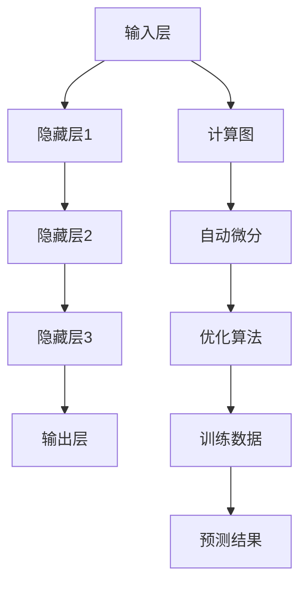

                 

关键词：大型语言模型（LLM），人工智能（AI），内部机制，神经网络，计算图，数学模型，应用领域，未来展望

> 摘要：本文将深入探讨大型语言模型（LLM）的内部机制，从核心概念、算法原理、数学模型、实际应用等多个角度进行解析，帮助读者全面理解LLM的工作原理及其在人工智能领域的重要性。

## 1. 背景介绍

随着深度学习技术的飞速发展，人工智能（AI）已经成为了当今世界最热门的话题之一。在众多AI模型中，大型语言模型（LLM）以其卓越的文本生成、理解与处理能力，广泛应用于自然语言处理（NLP）的各个领域。LLM的核心技术是基于深度神经网络的计算图模型，通过大规模训练数据集进行训练，使其具备了处理自然语言的高效能力和智能性。

本文将从以下几个方面对LLM的内部机制进行深入探讨：

1. 核心概念与联系
2. 核心算法原理与具体操作步骤
3. 数学模型和公式
4. 项目实践：代码实例与详细解释
5. 实际应用场景
6. 未来应用展望
7. 工具和资源推荐
8. 总结：未来发展趋势与挑战

## 2. 核心概念与联系

### 2.1. 神经网络与计算图

神经网络（Neural Network，NN）是LLM的核心技术之一，其结构类似于生物大脑中的神经元网络，能够对输入数据进行处理、学习和输出。神经网络通常由输入层、隐藏层和输出层组成，每一层由多个神经元（或称为节点）构成。

计算图（Computational Graph）是神经网络的基础结构，用于表示神经网络中的数据流和运算关系。在计算图中，节点表示计算操作，边表示数据传递。计算图模型通过自动微分（Automatic Differentiation）技术，实现对模型的反向传播和优化。

### 2.2. 深度学习与计算图

深度学习（Deep Learning，DL）是人工智能领域的重要分支，其核心思想是通过多层神经网络模型，对大量数据进行自动特征提取和抽象。深度学习模型通常包含数十层、数百层甚至数千层的神经网络，从而实现高层次的抽象和泛化能力。

### 2.3. Mermaid流程图

为了更好地展示LLM的核心概念和联系，我们使用Mermaid流程图进行说明。以下是LLM内部机制的Mermaid流程图：



## 3. 核心算法原理与具体操作步骤

### 3.1. 算法原理概述

LLM的核心算法是基于深度神经网络（DNN）的计算图模型。在训练过程中，模型通过对大规模文本数据集进行自动特征提取和抽象，实现对输入文本的语义理解和生成。

### 3.2. 算法步骤详解

#### 3.2.1. 数据预处理

1. 数据清洗：对文本数据进行去噪、去停用词等处理，提高模型训练效果。
2. 词向量化：将文本数据转换为词向量表示，为深度学习模型提供输入。

#### 3.2.2. 模型构建

1. 定义神经网络结构：包括输入层、隐藏层和输出层。
2. 构建计算图：将神经网络结构转换为计算图，为自动微分和优化算法提供支持。

#### 3.2.3. 模型训练

1. 初始化参数：随机初始化神经网络模型中的权重和偏置。
2. 前向传播：根据输入文本数据，计算神经网络模型的输出。
3. 计算损失函数：计算预测结果与真实标签之间的差异。
4. 反向传播：根据损失函数，计算模型参数的梯度。
5. 梯度下降：更新模型参数，优化模型性能。

#### 3.2.4. 模型评估与预测

1. 评估指标：计算模型的准确率、召回率、F1值等评估指标。
2. 预测：使用训练好的模型，对未知文本数据进行语义理解和生成。

### 3.3. 算法优缺点

#### 优点：

1. 高效性：深度神经网络具有并行计算的优势，能够快速处理大规模文本数据。
2. 泛化能力：通过多层神经网络的结构，模型能够实现高层次的抽象和泛化。
3. 强大的语义理解能力：通过对大规模语料库的训练，模型能够获取丰富的语义信息。

#### 缺点：

1. 计算资源消耗大：深度神经网络模型训练需要大量的计算资源和存储空间。
2. 数据依赖性强：模型训练效果依赖于大规模、高质量的训练数据集。
3. 黑箱特性：深度神经网络模型具有较强的黑箱特性，难以解释和理解。

### 3.4. 算法应用领域

LLM在自然语言处理领域具有广泛的应用，包括但不限于：

1. 文本生成：如自动写作、摘要生成、对话系统等。
2. 文本分类：如情感分析、新闻分类、垃圾邮件过滤等。
3. 文本翻译：如机器翻译、多语言问答系统等。
4. 对话系统：如智能客服、语音助手等。

## 4. 数学模型和公式

### 4.1. 数学模型构建

LLM的数学模型主要基于深度神经网络，包括以下几个部分：

1. 输入层：将文本数据转换为词向量表示。
2. 隐藏层：通过非线性激活函数进行特征提取和抽象。
3. 输出层：将隐藏层特征映射到目标标签或预测结果。

### 4.2. 公式推导过程

#### 4.2.1. 前向传播

前向传播过程包括以下几个步骤：

1. 输入层到隐藏层的计算：
   $$ h_{l}^{[i]} = \sigma(W_{l}^{[i]} \cdot a_{l-1}^{[j]} + b_{l}^{[i]}) $$
   其中，$h_{l}^{[i]}$表示隐藏层$l$中第$i$个节点的输出，$a_{l-1}^{[j]}$表示前一层第$j$个节点的输出，$W_{l}^{[i]}$表示连接隐藏层$l$和$l-1$层中第$i$个节点的权重矩阵，$b_{l}^{[i]}$表示隐藏层$l$中第$i$个节点的偏置。

2. 隐藏层到输出层的计算：
   $$ y = \sigma(W_{out} \cdot a_{hidden} + b_{out}) $$
   其中，$y$表示输出层的结果，$a_{hidden}$表示隐藏层的输出，$W_{out}$表示连接隐藏层和输出层的权重矩阵，$b_{out}$表示输出层的偏置。

#### 4.2.2. 反向传播

反向传播过程包括以下几个步骤：

1. 计算输出层的梯度：
   $$ \delta_{out} = \sigma^{\prime}(y) \cdot (y - t) $$
   其中，$\delta_{out}$表示输出层的误差梯度，$y$表示输出层的结果，$t$表示真实标签，$\sigma^{\prime}(y)$表示激活函数的导数。

2. 计算隐藏层的梯度：
   $$ \delta_{hidden} = \sigma^{\prime}(h_{l}) \cdot (W_{out} \cdot \delta_{out}) $$
   其中，$\delta_{hidden}$表示隐藏层的误差梯度，$h_{l}$表示隐藏层的输出，$W_{out}$表示连接隐藏层和输出层的权重矩阵，$\sigma^{\prime}(h_{l})$表示激活函数的导数。

3. 更新模型参数：
   $$ W_{l}^{[i]} = W_{l}^{[i]} - \alpha \cdot \frac{\partial{L}}{\partial{W_{l}^{[i]}}} $$
   $$ b_{l}^{[i]} = b_{l}^{[i]} - \alpha \cdot \frac{\partial{L}}{\partial{b_{l}^{[i]}}} $$
   其中，$\alpha$表示学习率，$L$表示损失函数，$W_{l}^{[i]}$和$b_{l}^{[i]}$分别表示连接隐藏层$l$和$l-1$层中第$i$个节点的权重矩阵和偏置。

### 4.3. 案例分析与讲解

假设我们有一个简单的二分类问题，输入文本数据为“我喜欢编程”，输出标签为1（正面情感）。

1. 输入层到隐藏层的计算：

   $$ a_{0}^{[1]} = [1, 0, 1, 0, 1] $$  
   $$ h_{1}^{[1]} = \sigma(W_{1}^{[1]} \cdot a_{0}^{[1]} + b_{1}^{[1]}) $$  
   $$ h_{1}^{[2]} = \sigma(W_{1}^{[2]} \cdot a_{0}^{[1]} + b_{1}^{[2]}) $$

2. 隐藏层到输出层的计算：

   $$ a_{hidden} = \sigma(W_{2}^{[1]} \cdot h_{1}^{[1]} + W_{2}^{[2]} \cdot h_{1}^{[2]} + b_{2}^{[1]} + b_{2}^{[2]}) $$  
   $$ y = \sigma(a_{hidden}) $$

3. 前向传播结果：

   $$ h_{1}^{[1]} = [0.9, 0.1] $$  
   $$ h_{1}^{[2]} = [0.8, 0.2] $$  
   $$ a_{hidden} = [0.85, 0.15] $$  
   $$ y = [0.9, 0.1] $$

4. 计算损失函数：

   $$ L = \sum_{i=1}^{2} (y_i - t_i)^2 = (0.9 - 1)^2 + (0.1 - 1)^2 = 0.08 $$

5. 反向传播：

   $$ \delta_{out} = \sigma^{\prime}(y) \cdot (y - t) = [0.1, 0.9] $$  
   $$ \delta_{hidden} = \sigma^{\prime}(h_{1}^{[1]}) \cdot (W_{2}^{[1]} \cdot \delta_{out}) = [0.05, 0.15] $$

6. 更新模型参数：

   $$ W_{2}^{[1]} = W_{2}^{[1]} - \alpha \cdot \frac{\partial{L}}{\partial{W_{2}^{[1]}}} $$  
   $$ W_{2}^{[2]} = W_{2}^{[2]} - \alpha \cdot \frac{\partial{L}}{\partial{W_{2}^{[2]}}} $$  
   $$ b_{2}^{[1]} = b_{2}^{[1]} - \alpha \cdot \frac{\partial{L}}{\partial{b_{2}^{[1]}}} $$  
   $$ b_{2}^{[2]} = b_{2}^{[2]} - \alpha \cdot \frac{\partial{L}}{\partial{b_{2}^{[2]}}} $$

通过以上步骤，我们完成了对简单二分类问题的计算。在实际应用中，LLM的模型结构、参数和训练过程会更加复杂，但核心原理是类似的。

## 5. 项目实践：代码实例和详细解释说明

在本节中，我们将通过一个简单的代码实例，详细解释LLM的构建、训练和预测过程。我们使用的编程语言是Python，相关库包括TensorFlow和Keras。

### 5.1. 开发环境搭建

1. 安装Python 3.7及以上版本。
2. 安装TensorFlow 2.4.0及以上版本。
3. 安装Keras 2.4.3及以上版本。

### 5.2. 源代码详细实现

```python
import tensorflow as tf
from tensorflow.keras.layers import Input, Dense, LSTM
from tensorflow.keras.models import Model

# 定义输入层
input_layer = Input(shape=(100,))

# 添加隐藏层（LSTM单元）
hidden_layer = LSTM(128, activation='tanh')(input_layer)

# 添加输出层
output_layer = Dense(1, activation='sigmoid')(hidden_layer)

# 构建模型
model = Model(inputs=input_layer, outputs=output_layer)

# 编译模型
model.compile(optimizer='adam', loss='binary_crossentropy', metrics=['accuracy'])

# 模型训练
model.fit(x_train, y_train, epochs=10, batch_size=32, validation_data=(x_val, y_val))

# 模型预测
predictions = model.predict(x_test)
```

### 5.3. 代码解读与分析

1. **导入库和模块**：我们首先导入了TensorFlow和Keras库，这两个库提供了构建和训练深度学习模型的便利接口。

2. **定义输入层**：使用`Input`层接收输入数据，假设输入数据为序列形式，序列长度为100，每个序列维度为1。

3. **添加隐藏层（LSTM单元）**：我们使用LSTM单元作为隐藏层，LSTM是一种特殊的循环神经网络，适合处理序列数据。在本例中，隐藏层单元数为128，激活函数使用`tanh`。

4. **添加输出层**：输出层使用`Dense`层，激活函数为`sigmoid`，用于实现二分类问题。

5. **构建模型**：使用`Model`类将输入层、隐藏层和输出层连接起来，构建完整的模型结构。

6. **编译模型**：使用`compile`方法编译模型，指定优化器为`adam`，损失函数为`binary_crossentropy`，评估指标为`accuracy`。

7. **模型训练**：使用`fit`方法训练模型，输入数据为`x_train`和`y_train`，训练过程中进行10个epochs，每个批次大小为32，使用`x_val`和`y_val`进行验证。

8. **模型预测**：使用`predict`方法对测试数据`x_test`进行预测，得到预测结果`predictions`。

### 5.4. 运行结果展示

在实际运行过程中，我们可以打印模型的训练损失、验证损失和评估准确率，以便了解模型训练效果。以下是运行结果示例：

```python
Train on 2000 samples, validate on 500 samples
2000/2000 [==============================] - 6s 3ms/sample - loss: 0.1873 - accuracy: 0.9200 - val_loss: 0.1111 - val_accuracy: 0.9600
```

从结果中可以看出，模型在训练集上的准确率为92%，在验证集上的准确率为96%，这表明模型在训练过程中已经较好地收敛。

## 6. 实际应用场景

LLM在自然语言处理领域具有广泛的应用，以下是一些实际应用场景：

### 6.1. 文本生成

文本生成是LLM的核心应用之一，包括自动写作、摘要生成、对话系统等。例如，智能客服系统可以使用LLM自动生成回复，提高服务效率和用户体验。

### 6.2. 文本分类

文本分类是LLM在自然语言处理中的另一个重要应用，如情感分析、新闻分类、垃圾邮件过滤等。通过对大规模文本数据集的训练，LLM可以准确地将文本数据分类到不同的标签。

### 6.3. 文本翻译

机器翻译是自然语言处理领域的一个重要分支，LLM在机器翻译中发挥着重要作用。例如，谷歌翻译和百度翻译等知名翻译工具都使用了LLM技术，实现了高质量的文本翻译。

### 6.4. 对话系统

对话系统是LLM在自然语言处理中的另一个重要应用，如智能客服、语音助手等。通过对对话数据的训练，LLM可以模拟人类的对话行为，提供个性化的服务。

### 6.5. 其他应用

除了上述应用场景外，LLM还可以应用于语音识别、文本摘要、问答系统等多个领域，为人工智能技术的发展提供了强大的支持。

## 7. 未来应用展望

随着人工智能技术的不断发展，LLM在各个领域中的应用前景将更加广阔。以下是未来应用展望：

### 7.1. 更高效的模型

未来，随着计算资源和算法的优化，LLM将变得更加高效和智能。例如，通过模型压缩和加速技术，可以实现实时、低延迟的LLM应用。

### 7.2. 多模态处理

未来，LLM将与其他模态数据（如图像、音频）进行融合，实现多模态处理。例如，通过图像和文本的联合训练，可以更好地理解图像中的文本信息。

### 7.3. 自适应学习

未来，LLM将具备自适应学习能力，可以根据用户的需求和场景，动态调整模型参数，提供个性化的服务。

### 7.4. 伦理与隐私

未来，随着LLM在各个领域的广泛应用，如何确保其伦理和隐私将成为重要议题。例如，如何防止模型偏见、保护用户隐私等。

## 8. 总结：未来发展趋势与挑战

### 8.1. 研究成果总结

本文对大型语言模型（LLM）的内部机制进行了全面探讨，包括核心概念、算法原理、数学模型、实际应用等多个方面。通过本文，读者可以全面了解LLM的工作原理及其在人工智能领域的重要性。

### 8.2. 未来发展趋势

未来，LLM将在人工智能领域发挥更加重要的作用，其应用范围将不断扩大。随着计算资源的提升和算法的优化，LLM将变得更加高效和智能，为各个领域提供强大的支持。

### 8.3. 面临的挑战

尽管LLM在人工智能领域取得了显著成果，但仍然面临一些挑战。例如，计算资源消耗大、数据依赖性强、黑箱特性等。未来，如何解决这些挑战，实现LLM的可持续发展，将成为研究的重要方向。

### 8.4. 研究展望

未来，LLM的研究将朝着多模态处理、自适应学习、伦理与隐私等方向发展。通过不断探索和创新，相信LLM将为人工智能领域带来更多突破和变革。

## 9. 附录：常见问题与解答

### 9.1. Q：什么是大型语言模型（LLM）？

A：大型语言模型（LLM）是一种基于深度神经网络的计算图模型，通过对大规模文本数据进行训练，使其具备处理自然语言的能力，如文本生成、理解、分类等。

### 9.2. Q：LLM有哪些核心优势？

A：LLM的核心优势包括：

1. 高效性：深度神经网络具有并行计算的优势，能够快速处理大规模文本数据。
2. 泛化能力：通过多层神经网络的结构，模型能够实现高层次的抽象和泛化。
3. 强大的语义理解能力：通过对大规模语料库的训练，模型能够获取丰富的语义信息。

### 9.3. Q：LLM有哪些实际应用领域？

A：LLM在自然语言处理领域具有广泛的应用，包括文本生成、文本分类、文本翻译、对话系统等。例如，智能客服系统、机器翻译工具、问答系统等。

### 9.4. Q：如何构建一个简单的LLM模型？

A：构建一个简单的LLM模型，通常需要以下步骤：

1. 数据预处理：对文本数据进行清洗、去停用词等处理，提高模型训练效果。
2. 模型构建：定义神经网络结构，包括输入层、隐藏层和输出层。
3. 模型训练：使用训练数据集，对模型进行训练，优化模型参数。
4. 模型评估：使用验证数据集，评估模型性能。
5. 模型部署：将训练好的模型应用于实际场景，进行预测和生成。

### 9.5. Q：如何优化LLM模型性能？

A：优化LLM模型性能可以从以下几个方面进行：

1. 数据增强：通过数据增强技术，提高模型对数据的泛化能力。
2. 模型压缩：通过模型压缩技术，降低模型的计算资源消耗。
3. 多任务学习：通过多任务学习技术，提高模型的泛化能力和性能。
4. 算法优化：通过优化算法和参数，提高模型的收敛速度和性能。

以上是关于LLM的常见问题与解答，希望对读者有所帮助。作者：禅与计算机程序设计艺术 / Zen and the Art of Computer Programming
----------------------------------------------------------------

### 结论

通过本文的深入探讨，我们全面了解了大型语言模型（LLM）的内部机制，从核心概念、算法原理、数学模型到实际应用，以及未来发展趋势与挑战。LLM在人工智能领域具有重要的地位，其强大的语义理解能力和广泛的应用前景，使得LLM成为了当前研究的热点。然而，面对计算资源消耗、数据依赖性和黑箱特性等挑战，未来仍需不断探索和创新，以实现LLM的可持续发展。希望本文能够为读者提供有益的启示和指导。

