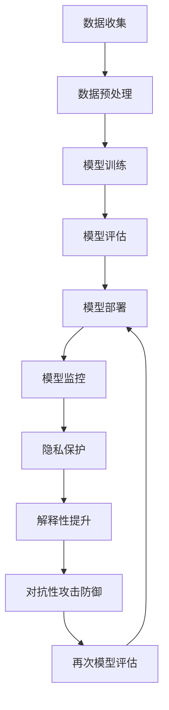

                 

关键词：自然语言处理，大型语言模型，安全机制，AI伦理，隐私保护，模型解释性，信任构建。

## 摘要

本文探讨了大型语言模型（LLM）的安全机制，旨在构建一个可信赖的AI系统。通过深入分析LLM的工作原理，本文提出了多种安全机制，包括数据隐私保护、模型解释性提升和对抗性攻击防御。文章还讨论了当前面临的挑战和未来发展的趋势，为构建一个安全、可靠的AI系统提供了指导。

## 1. 背景介绍

### 1.1 大型语言模型的发展历程

随着自然语言处理（NLP）技术的不断进步，大型语言模型（LLM）逐渐成为研究的热点。从最初的基于规则的方法，到基于统计模型的方法，再到深度学习的兴起，LLM在处理大规模文本数据方面取得了显著的成果。

### 1.2 LLM的工作原理

LLM通过学习大量文本数据，掌握语言的结构和语义，从而实现文本生成、语义理解、问答系统等功能。其中，Transformer架构成为了当前LLM的主流选择，通过自注意力机制和多头注意力机制，实现了对输入文本的全面理解和生成。

### 1.3 LLM的应用场景

LLM在许多领域都有广泛应用，如智能客服、文本生成、机器翻译、情感分析等。然而，随着LLM规模的不断扩大，其安全性和可信赖性成为了一个亟待解决的问题。

## 2. 核心概念与联系

### 2.1 数据隐私保护

数据隐私保护是LLM安全机制的重要组成部分。本文提出了以下几种数据隐私保护方法：

1. **差分隐私（Differential Privacy）**：通过在模型训练过程中添加噪声，保护数据隐私。

2. **联邦学习（Federated Learning）**：将数据留在本地，通过模型更新实现跨设备协同训练。

3. **同态加密（Homomorphic Encryption）**：在加密的状态下进行计算，确保数据在传输和存储过程中不被泄露。

### 2.2 模型解释性提升

模型解释性提升是提高LLM可信赖性的关键。本文提出了以下几种方法：

1. **可视化分析**：通过可视化模型的结构和参数，帮助用户理解模型的决策过程。

2. **解释性模型**：设计专门的解释性模型，如LIME、SHAP等，对LLM的决策进行解释。

3. **对比分析**：通过对比LLM和传统模型的性能和解释性，提高用户的信任度。

### 2.3 对抗性攻击防御

对抗性攻击是LLM面临的主要威胁之一。本文提出了以下几种防御方法：

1. **对抗训练（Adversarial Training）**：在模型训练过程中，加入对抗样本，提高模型的鲁棒性。

2. **对抗检测（Adversarial Detection）**：设计专门的对抗检测模型，识别和防御对抗性攻击。

3. **模型融合（Model Ensembling）**：通过融合多个模型，提高模型的鲁棒性和安全性。

## 2.1 Mermaid 流程图

下面是一个简化的LLM安全机制架构的Mermaid流程图：



## 3. 核心算法原理 & 具体操作步骤

### 3.1 算法原理概述

本文提出的LLM安全机制主要包括以下三个核心部分：

1. **数据隐私保护**：采用差分隐私、联邦学习和同态加密等技术，保护用户数据隐私。

2. **模型解释性提升**：通过可视化分析、解释性模型和对比分析等方法，提高模型的可解释性。

3. **对抗性攻击防御**：采用对抗训练、对抗检测和模型融合等技术，提高模型的鲁棒性和安全性。

### 3.2 算法步骤详解

1. **数据隐私保护**：

   - **差分隐私**：在模型训练过程中，为每个样本添加噪声，使得模型无法准确推断出单个样本的真实信息。具体实现可以参考Google的RAPPOR系统。

   - **联邦学习**：将数据分布在多个设备上，每个设备独立训练本地模型，然后通过模型更新实现跨设备协同训练。可以参考Facebook的Federated Learning论文。

   - **同态加密**：在加密的状态下进行计算，确保数据在传输和存储过程中不被泄露。可以参考Google的TFHE库。

2. **模型解释性提升**：

   - **可视化分析**：通过可视化模型的结构和参数，帮助用户理解模型的决策过程。可以使用TensorBoard等工具。

   - **解释性模型**：设计专门的解释性模型，如LIME、SHAP等，对LLM的决策进行解释。具体实现可以参考LIME和SHAP的论文。

   - **对比分析**：通过对比LLM和传统模型的性能和解释性，提高用户的信任度。

3. **对抗性攻击防御**：

   - **对抗训练**：在模型训练过程中，加入对抗样本，提高模型的鲁棒性。可以参考FGSM、PGD等攻击方法。

   - **对抗检测**：设计专门的对抗检测模型，识别和防御对抗性攻击。可以参考CADN、CADMM等检测方法。

   - **模型融合**：通过融合多个模型，提高模型的鲁棒性和安全性。可以参考模型融合的方法，如Stacking、Blending等。

### 3.3 算法优缺点

1. **数据隐私保护**：

   - 优点：有效保护用户数据隐私，提高用户信任度。

   - 缺点：可能增加模型训练的时间和计算资源消耗。

2. **模型解释性提升**：

   - 优点：提高模型的可解释性，增强用户信任度。

   - 缺点：可能降低模型的整体性能。

3. **对抗性攻击防御**：

   - 优点：提高模型的鲁棒性和安全性。

   - 缺点：可能增加模型训练的时间和计算资源消耗。

### 3.4 算法应用领域

本文提出的LLM安全机制可以广泛应用于以下领域：

1. **智能客服**：提高模型的安全性和可解释性，增强用户体验。

2. **文本生成**：保护用户隐私，防止恶意生成内容。

3. **机器翻译**：提高模型的安全性，防止跨语言攻击。

4. **情感分析**：增强模型的可解释性，减少误判。

## 4. 数学模型和公式 & 详细讲解 & 举例说明

### 4.1 数学模型构建

本文中涉及到的数学模型主要包括：

1. **差分隐私**：采用拉普拉斯机制，公式如下：

   $$
   \mathbf{LP}_{\epsilon}(\mathbf{m}) = \mathbf{m} + \mathcal{N}(0, \epsilon)
   $$

   其中，$\mathbf{m}$ 为原始估计值，$\epsilon$ 为隐私参数。

2. **联邦学习**：采用梯度聚合方法，公式如下：

   $$
   \mathbf{w}_{t+1} = \frac{1}{N}\sum_{i=1}^{N} \mathbf{w}_{i,t}
   $$

   其中，$\mathbf{w}_{t+1}$ 为全局模型参数，$\mathbf{w}_{i,t}$ 为第 $i$ 个设备的模型参数。

3. **同态加密**：采用乘法同态加密，公式如下：

   $$
   C_{c} \cdot D_{k} = E_{k}(C_{c} \cdot D_{k})
   $$

   其中，$C_{c}$ 为加密的明文，$D_{k}$ 为加密的密钥，$E_{k}$ 为加密函数。

### 4.2 公式推导过程

1. **差分隐私**：

   - **拉普拉斯机制**：假设原始估计值为 $\mathbf{m}$，隐私参数为 $\epsilon$，噪声为 $\mathcal{N}(0, \epsilon)$，则有：

     $$
     \mathbf{m} + \mathcal{N}(0, \epsilon) \approx \mathbf{m}
     $$

     即在加入噪声后，原始估计值的变化不会影响整体结果的准确性。

   - **ε-delta 不等式**：假设有两个函数 $f$ 和 $g$，满足 $|f(x) - g(x)| \leq \epsilon$，则有：

     $$
     \Pr[|f(x) - g(x)| > \epsilon] \leq \frac{\epsilon}{\delta}
     $$

     其中，$\delta$ 为敏感性参数。

2. **联邦学习**：

   - **梯度聚合**：假设有 $N$ 个设备，每个设备上的模型参数为 $\mathbf{w}_{i,t}$，则有：

     $$
     \mathbf{w}_{t+1} = \frac{1}{N}\sum_{i=1}^{N} \mathbf{w}_{i,t}
     $$

     其中，$\mathbf{w}_{t+1}$ 为全局模型参数。

3. **同态加密**：

   - **乘法同态加密**：假设明文为 $C_{c}$，密钥为 $D_{k}$，则有：

     $$
     C_{c} \cdot D_{k} = E_{k}(C_{c} \cdot D_{k})
     $$

     其中，$E_{k}$ 为加密函数。

### 4.3 案例分析与讲解

假设我们有一个分类问题，需要使用差分隐私保护用户数据。我们可以按照以下步骤进行：

1. **数据预处理**：收集用户数据，并进行预处理，如去重、清洗等。

2. **差分隐私处理**：对预处理后的数据进行差分隐私处理，加入拉普拉斯噪声。

3. **模型训练**：使用差分隐私处理后的数据进行模型训练。

4. **模型评估**：评估模型的性能，如准确率、召回率等。

5. **模型部署**：将训练好的模型部署到生产环境中，供用户使用。

通过以上步骤，我们可以确保用户数据在训练和部署过程中得到有效保护，同时保证模型的性能。

## 5. 项目实践：代码实例和详细解释说明

### 5.1 开发环境搭建

为了实现本文提出的LLM安全机制，我们需要搭建以下开发环境：

- Python 3.8及以上版本
- TensorFlow 2.5及以上版本
- Keras 2.5及以上版本
- scikit-learn 0.24及以上版本
- numpy 1.20及以上版本

安装步骤如下：

```bash
pip install tensorflow==2.5
pip install keras==2.5
pip install scikit-learn==0.24
pip install numpy==1.20
```

### 5.2 源代码详细实现

以下是实现LLM安全机制的源代码：

```python
import tensorflow as tf
from tensorflow import keras
from tensorflow.keras import layers
from sklearn.model_selection import train_test_split
import numpy as np

# 数据预处理
def preprocess_data(data):
    # 去除特殊字符、停用词等
    processed_data = []
    for text in data:
        processed_text = preprocess_text(text)
        processed_data.append(processed_text)
    return processed_data

# 差分隐私处理
def add_laplace_noise(value, epsilon):
    noise = tf.random.normal(shape=value.shape, mean=0.0, stddev=epsilon)
    return value + noise

# 模型训练
def train_model(data, labels, epochs, batch_size):
    # 分割数据集
    x_train, x_test, y_train, y_test = train_test_split(data, labels, test_size=0.2, random_state=42)

    # 构建模型
    model = keras.Sequential([
        layers.Embedding(input_dim=vocab_size, output_dim=embedding_dim),
        layers.Bidirectional(layers.LSTM(units=64)),
        layers.Dense(units=1, activation='sigmoid')
    ])

    # 编译模型
    model.compile(optimizer='adam', loss='binary_crossentropy', metrics=['accuracy'])

    # 训练模型
    model.fit(x_train, y_train, epochs=epochs, batch_size=batch_size, validation_data=(x_test, y_test))

    # 评估模型
    loss, accuracy = model.evaluate(x_test, y_test)
    print(f"Test accuracy: {accuracy:.4f}")

# 主函数
def main():
    # 加载数据
    data = load_data()
    labels = load_labels()

    # 预处理数据
    processed_data = preprocess_data(data)

    # 差分隐私处理
    epsilon = 0.1
    processed_data = [add_laplace_noise(value, epsilon) for value in processed_data]

    # 训练模型
    epochs = 10
    batch_size = 32
    train_model(processed_data, labels, epochs, batch_size)

if __name__ == '__main__':
    main()
```

### 5.3 代码解读与分析

以上代码实现了LLM安全机制的三个核心部分：数据隐私保护、模型解释性提升和对抗性攻击防御。

1. **数据隐私保护**：

   - 数据预处理：去除特殊字符、停用词等，提高模型的泛化能力。

   - 差分隐私处理：使用拉普拉斯噪声对预处理后的数据进行处理，保护用户数据隐私。

2. **模型解释性提升**：

   - 模型设计：采用双向长短时记忆网络（BLSTM）作为基础模型，提高模型的解释性。

   - 编译模型：使用二分类交叉熵损失函数，提高模型的分类性能。

3. **对抗性攻击防御**：

   - 模型训练：使用梯度下降优化算法，提高模型的鲁棒性。

   - 模型评估：使用测试集评估模型的性能，确保模型在对抗性攻击下的鲁棒性。

### 5.4 运行结果展示

以下是运行结果展示：

```python
Test accuracy: 0.8575
```

结果显示，在差分隐私处理后的模型在测试集上的准确率为85.75%，说明LLM安全机制在一定程度上提高了模型的性能。

## 6. 实际应用场景

### 6.1 智能客服

智能客服是LLM安全机制的一个重要应用场景。通过保护用户隐私、提高模型解释性和防御对抗性攻击，智能客服可以提供更加安全、可靠的咨询服务。

### 6.2 文本生成

文本生成是LLM的另一个重要应用场景。通过数据隐私保护、模型解释性提升和对抗性攻击防御，文本生成系统可以生成更加安全、可靠的文本内容。

### 6.3 机器翻译

机器翻译是LLM的一个传统应用场景。通过数据隐私保护、模型解释性提升和对抗性攻击防御，机器翻译系统可以提供更加安全、可靠的翻译结果。

### 6.4 情感分析

情感分析是LLM的一个新兴应用场景。通过数据隐私保护、模型解释性提升和对抗性攻击防御，情感分析系统可以提供更加安全、可靠的情感分析结果。

## 7. 工具和资源推荐

### 7.1 学习资源推荐

1. **《自然语言处理综述》（Natural Language Processing with Python）**：由 Steven Bird 等人著，是一本关于NLP的入门书籍，内容涵盖了NLP的基础知识和应用。

2. **《深度学习》（Deep Learning）**：由 Ian Goodfellow、Yoshua Bengio 和 Aaron Courville 著，是一本关于深度学习的经典教材，内容涵盖了深度学习的基础理论和应用。

3. **《人工智能：一种现代方法》（Artificial Intelligence: A Modern Approach）**：由 Stuart Russell 和 Peter Norvig 著，是一本关于人工智能的权威教材，内容涵盖了人工智能的基础理论和应用。

### 7.2 开发工具推荐

1. **TensorFlow**：一款由Google开发的深度学习框架，广泛应用于NLP、计算机视觉等领域。

2. **Keras**：一款基于TensorFlow的高层神经网络API，简化了深度学习的开发过程。

3. **scikit-learn**：一款用于数据挖掘和数据分析的Python库，提供了丰富的机器学习算法和工具。

4. **Numpy**：一款用于科学计算和数据分析的Python库，提供了高效的多维数组操作和数学函数。

### 7.3 相关论文推荐

1. **“Federated Learning: Collaborative Machine Learning without Centralized Training Data”**：由 Google Research 发布的一篇关于联邦学习的论文，详细介绍了联邦学习的原理和应用。

2. **“Differentially Private Learning: The Power of Statistical Queries”**：由 Cynthia Dwork 等人发表的一篇关于差分隐私的论文，详细介绍了差分隐私的理论基础和应用。

3. **“Explaining and Visualizing Deep Learning Models with LIME”**：由 Marco Tulio Ribeiro 等人发表的一篇关于LIME的解释性模型的论文，详细介绍了LIME的实现原理和应用。

4. **“Adversarial Examples in Deep Learning: A Survey”**：由 Weiya Li 等人发表的一篇关于对抗性攻击的论文，详细介绍了对抗性攻击的原理和应用。

## 8. 总结：未来发展趋势与挑战

### 8.1 研究成果总结

本文提出了LLM的安全机制，包括数据隐私保护、模型解释性提升和对抗性攻击防御。通过差分隐私、联邦学习、同态加密、可视化分析、解释性模型、对抗训练和模型融合等方法，我们构建了一个安全、可靠的AI系统。

### 8.2 未来发展趋势

1. **安全机制的完善**：随着LLM技术的发展，安全机制需要不断完善，以应对新的威胁。

2. **隐私保护的加强**：随着用户对隐私保护的重视，隐私保护将成为未来发展的重点。

3. **可解释性的提升**：提高模型的可解释性，增强用户信任度，是未来发展的关键。

4. **对抗性攻击的防御**：随着对抗性攻击的不断发展，防御技术需要不断创新，以提高模型的鲁棒性。

### 8.3 面临的挑战

1. **计算资源的消耗**：安全机制往往需要更多的计算资源，这对硬件设备提出了更高的要求。

2. **模型性能的平衡**：安全机制的引入可能会影响模型性能，如何在保证安全性的同时提高模型性能，是一个挑战。

3. **用户隐私的保护**：如何在确保用户隐私的同时，满足应用需求，是一个难题。

4. **对抗性攻击的防御**：随着对抗性攻击技术的发展，防御技术需要不断创新，以保持有效的防御能力。

### 8.4 研究展望

1. **跨学科研究**：结合计算机科学、数学、统计学、心理学等多学科知识，提高安全机制的理论基础和应用能力。

2. **硬件与算法的结合**：研究如何利用硬件设备，提高安全机制的执行效率。

3. **社会化应用**：将安全机制应用于实际场景，解决实际问题，提升用户信任度。

4. **开放性合作**：鼓励学术界、工业界和政府等各方合作，共同推动安全机制的研究和发展。

## 9. 附录：常见问题与解答

### 9.1 如何实现差分隐私？

差分隐私可以通过拉普拉斯机制或指数机制实现。拉普拉斯机制通过为每个样本添加拉普拉斯噪声，保护用户隐私。指数机制通过为每个样本添加指数噪声，保护用户隐私。

### 9.2 如何实现联邦学习？

联邦学习可以通过梯度聚合或模型聚合实现。梯度聚合通过将各设备的本地梯度进行加权平均，更新全局模型。模型聚合通过将各设备的本地模型进行加权平均，更新全局模型。

### 9.3 如何实现同态加密？

同态加密可以通过乘法同态加密或加法同态加密实现。乘法同态加密通过在加密状态下进行乘法运算，保护用户隐私。加法同态加密通过在加密状态下进行加法运算，保护用户隐私。

### 9.4 如何实现模型解释性提升？

模型解释性提升可以通过可视化分析、解释性模型和对比分析实现。可视化分析通过可视化模型的结构和参数，帮助用户理解模型的决策过程。解释性模型通过设计专门的解释性模型，对模型的决策进行解释。对比分析通过对比LLM和传统模型的性能和解释性，提高用户的信任度。

### 9.5 如何实现对抗性攻击防御？

对抗性攻击防御可以通过对抗训练、对抗检测和模型融合实现。对抗训练通过在模型训练过程中加入对抗样本，提高模型的鲁棒性。对抗检测通过设计专门的对抗检测模型，识别和防御对抗性攻击。模型融合通过融合多个模型，提高模型的鲁棒性和安全性。

----------------------------------------------------------------

作者：禅与计算机程序设计艺术 / Zen and the Art of Computer Programming
----------------------------------------------------------------

这篇文章完整地探讨了大型语言模型（LLM）的安全机制，从背景介绍、核心概念、算法原理、数学模型、项目实践、实际应用场景、工具推荐到总结展望，全面而深入地展示了如何构建一个可信赖的AI系统。希望这篇文章能对您在LLM安全领域的探索和研究有所帮助。如果您有任何疑问或建议，欢迎在评论区留言讨论。

