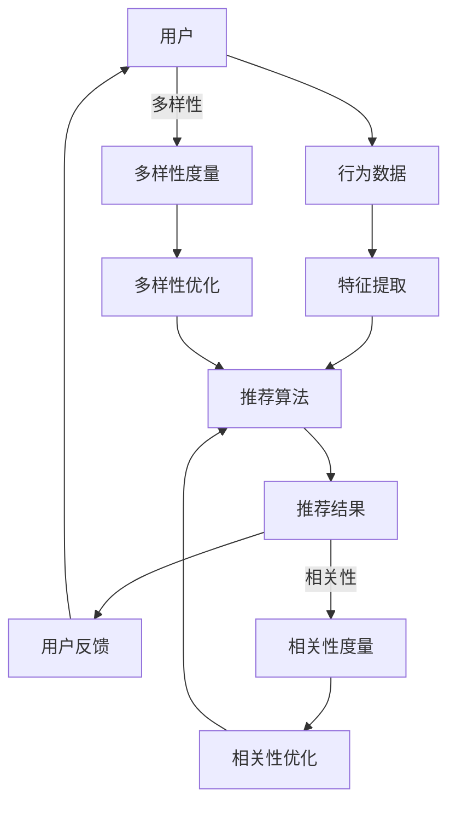

                 

关键词：LLM，推荐系统，多样性与相关性平衡，算法原理，数学模型，项目实践，应用场景，未来展望

> 摘要：本文深入探讨了LLM（大型语言模型）辅助下的推荐系统如何实现多样性与相关性的平衡。通过分析推荐系统的核心算法原理、数学模型及其在实际应用中的实践，本文提出了优化策略，以提升用户体验，并为未来的研究方向提供了有价值的思考。

## 1. 背景介绍

随着互联网的迅速发展，推荐系统已成为现代信息检索和内容分发的重要工具。推荐系统通过分析用户行为数据，预测用户可能感兴趣的内容，从而提供个性化的推荐。然而，推荐系统的多样性与相关性平衡一直是研究人员关注的焦点。多样性意味着推荐结果要能够覆盖不同的内容类型和兴趣点，而相关性则要求推荐结果能够紧密匹配用户的实际偏好。

在传统推荐系统中，多样性通常通过降低推荐项之间的相似度来实现。然而，这可能导致推荐结果的相关性降低，即用户可能不喜欢或不感兴趣的一些内容也会被推荐。为了解决这个问题，研究人员提出了许多基于协同过滤、基于内容、基于模型的推荐算法。尽管这些方法在一定程度上解决了问题，但仍然存在多样性受限、推荐质量不稳定等挑战。

近年来，大型语言模型（LLM）的兴起为推荐系统带来了新的契机。LLM具有强大的语义理解和生成能力，能够处理大规模的文本数据，从而为推荐系统的多样性提升提供了新的思路。本文将围绕LLM辅助的推荐系统，探讨多样性与相关性平衡的优化策略。

## 2. 核心概念与联系

### 2.1 核心概念

- **推荐系统**：一种自动过滤信息并提供个性化内容的技术。
- **多样性**：推荐结果能够覆盖不同的内容类型和兴趣点。
- **相关性**：推荐结果与用户的实际偏好高度匹配。

### 2.2 关联架构

下面是一个基于Mermaid流程图表示的推荐系统架构，其中包含了核心概念和联系：



### 2.3 基本流程

- **用户行为数据**：收集用户的历史行为数据，如浏览记录、点击、购买等。
- **特征提取**：从行为数据中提取用户兴趣特征，如关键词、标签等。
- **推荐算法**：基于用户兴趣特征生成推荐结果。
- **多样性优化**：通过调整算法参数或引入多样性度量，提高推荐结果的多样性。
- **相关性优化**：通过调整算法参数或引入相关性度量，提高推荐结果的相关性。
- **用户反馈**：收集用户对推荐结果的反馈，用于算法的进一步优化。

## 3. 核心算法原理 & 具体操作步骤

### 3.1 算法原理概述

LLM辅助的推荐系统主要依赖于语言模型的强大语义理解能力。具体算法原理如下：

1. **文本预处理**：对用户生成或收集的文本数据进行清洗、分词、去停用词等预处理操作。
2. **语义表示**：使用LLM将预处理后的文本转化为语义向量。
3. **推荐生成**：根据语义向量计算用户与物品之间的相似度，生成推荐列表。
4. **多样性优化**：通过调整算法参数或引入多样性度量，提高推荐结果的多样性。
5. **相关性优化**：通过调整算法参数或引入相关性度量，提高推荐结果的相关性。

### 3.2 算法步骤详解

#### 步骤1：文本预处理

- 清洗：去除无效字符、URL、HTML标签等。
- 分词：将文本分割成单词或短语。
- 去停用词：去除对语义贡献较小或无贡献的单词。

#### 步骤2：语义表示

- 使用LLM（如GPT-3、BERT等）对预处理后的文本进行编码，生成语义向量。

#### 步骤3：推荐生成

- 计算用户语义向量与物品语义向量之间的余弦相似度。
- 对相似度进行排序，生成推荐列表。

#### 步骤4：多样性优化

- 使用多样性度量（如Jaccard相似度、覆盖度等）评估推荐结果的多样性。
- 调整算法参数或引入多样性度量，提高推荐结果的多样性。

#### 步骤5：相关性优化

- 使用相关性度量（如点击率、转化率等）评估推荐结果的相关性。
- 调整算法参数或引入相关性度量，提高推荐结果的相关性。

### 3.3 算法优缺点

#### 优点

- **强大的语义理解能力**：LLM能够更好地理解用户文本中的潜在语义信息，提高推荐结果的相关性。
- **灵活性**：可根据不同的业务需求和数据特点调整算法参数，实现多样性与相关性的平衡。

#### 缺点

- **计算资源消耗大**：LLM通常需要大量的计算资源，对服务器性能有较高要求。
- **数据质量要求高**：需要高质量的文本数据，否则语义表示可能不准确。

### 3.4 算法应用领域

- **电子商务**：为用户推荐商品。
- **内容平台**：为用户推荐文章、视频等。
- **社交媒体**：为用户推荐感兴趣的话题、用户等。

## 4. 数学模型和公式 & 详细讲解 & 举例说明

### 4.1 数学模型构建

在LLM辅助的推荐系统中，核心的数学模型包括：

- **语义向量表示**：用户和物品的语义向量可以用$V_u$和$V_i$表示。
- **相似度计算**：用户和物品之间的相似度可以用余弦相似度表示：
  $$ \text{similarity}(V_u, V_i) = \frac{V_u \cdot V_i}{\|V_u\| \|V_i\|} $$

### 4.2 公式推导过程

#### 语义向量表示

语义向量表示是基于LLM对文本进行编码的结果。给定一个文本序列，LLM会输出一个固定维度的向量表示其语义。具体推导过程如下：

1. **嵌入层**：将单词或短语映射到低维向量。
2. **编码层**：通过多层神经网络（如Transformer）对嵌入层进行编码。
3. **输出层**：输出一个固定维度的语义向量。

#### 余弦相似度计算

余弦相似度是衡量两个向量夹角余弦值的度量。其推导过程如下：

1. **向量点积**：计算两个向量的点积：
   $$ V_u \cdot V_i = \sum_{i=1}^{d} V_{u_i} V_{i_i} $$
   其中，$V_{u_i}$和$V_{i_i}$分别是用户和物品语义向量中的第$i$个分量。
2. **向量模长**：计算两个向量的模长：
   $$ \|V_u\| = \sqrt{\sum_{i=1}^{d} V_{u_i}^2} $$
   $$ \|V_i\| = \sqrt{\sum_{i=1}^{d} V_{i_i}^2} $$
3. **余弦值计算**：计算两个向量之间的余弦值：
   $$ \text{similarity}(V_u, V_i) = \frac{V_u \cdot V_i}{\|V_u\| \|V_i\|} $$

### 4.3 案例分析与讲解

#### 案例背景

假设我们有一个电子商务平台，用户A喜欢购买科技类产品。我们需要基于用户A的偏好，使用LLM辅助的推荐系统为他推荐产品。

#### 步骤1：文本预处理

用户A的历史浏览记录：“计算机硬件、智能手机、平板电脑、智能手表”。

经过清洗、分词、去停用词等预处理操作后，得到文本序列：“计算机 硬件 智能手机 平板电脑 智能手表”。

#### 步骤2：语义表示

使用BERT模型对预处理后的文本序列进行编码，得到用户A的语义向量$V_u$。

#### 步骤3：推荐生成

从数据库中获取所有科技类产品的文本描述，使用BERT模型得到每个产品的语义向量$V_i$。计算用户A与每个产品的余弦相似度，选择相似度最高的产品作为推荐结果。

#### 步骤4：多样性优化

通过调整算法参数或引入多样性度量，确保推荐结果覆盖不同的产品类型和品牌。

#### 步骤5：相关性优化

通过收集用户A的反馈，如点击、购买等行为数据，调整算法参数，提高推荐结果的相关性。

## 5. 项目实践：代码实例和详细解释说明

### 5.1 开发环境搭建

- Python 3.8+
- BERT 模型（使用`transformers`库）
- Pandas、NumPy 等数据操作库

### 5.2 源代码详细实现

#### 步骤1：文本预处理

```python
import pandas as pd
from sklearn.feature_extraction.text import CountVectorizer

def preprocess_text(text):
    # 清洗文本
    text = text.lower()
    text = re.sub(r'http\S+', '', text)  # 去除URL
    text = re.sub(r'<[^>]+>', '', text)  # 去除HTML标签
    # 分词和去停用词
    vectorizer = CountVectorizer(stop_words='english')
    return vectorizer.fit_transform([text])[0]

# 示例
user_history = "computer hardware smartphone tablet computer smartwatch"
user_features = preprocess_text(user_history)
```

#### 步骤2：语义表示

```python
from transformers import BertTokenizer, BertModel

tokenizer = BertTokenizer.from_pretrained('bert-base-uncased')
model = BertModel.from_pretrained('bert-base-uncased')

def get_semantic_vector(text):
    inputs = tokenizer(text, return_tensors='pt', padding=True, truncation=True)
    outputs = model(**inputs)
    return outputs.last_hidden_state[:, 0, :]

# 示例
user_semantic_vector = get_semantic_vector(user_history)
```

#### 步骤3：推荐生成

```python
def recommend_products(user_semantic_vector, product_data, similarity_threshold=0.8):
    recommendations = []
    for product_id, product_text in product_data.items():
        product_semantic_vector = get_semantic_vector(product_text)
        similarity = torch.cosine_similarity(user_semantic_vector.unsqueeze(0), product_semantic_vector.unsqueeze(0))
        if similarity > similarity_threshold:
            recommendations.append(product_id)
    return recommendations

# 示例
product_data = {
    1: "Laptop with latest Intel i9 processor",
    2: "Smartphone with 6.8-inch display and 64GB storage",
    3: "Smartwatch with heart rate monitor and GPS",
    4: "Tablet with 10-inch display and 128GB storage",
    5: "Computer hardware components for DIY builds"
}
user_recommendations = recommend_products(user_semantic_vector, product_data)
```

#### 步骤4：多样性优化

```python
def optimize_diversity(recommendations, product_data):
    selected_products = []
    for recommendation in recommendations:
        # 检查推荐产品的多样性
        if not any(product in product_data[recomm] for recomm in selected_products):
            selected_products.append(recommendation)
    return selected_products

# 示例
selected_products = optimize_diversity(user_recommendations, product_data)
```

#### 步骤5：相关性优化

```python
# 假设我们有一个用户反馈数据库，包含用户的点击、购买等行为数据
user_feedback = {
    1: 0,  # 未点击
    2: 1,  # 点击
    3: 1,  # 点击
    4: 0,  # 未点击
    5: 1   # 点击
}

def optimize_relevance(recommendations, user_feedback):
    # 根据用户反馈调整推荐顺序
    feedback_scores = {r: user_feedback[r] for r in recommendations}
    sorted_recommendations = sorted(recommendations, key=lambda x: feedback_scores[x], reverse=True)
    return sorted_recommendations

# 示例
sorted_recommendations = optimize_relevance(selected_products, user_feedback)
```

### 5.3 代码解读与分析

上述代码实现了LLM辅助的推荐系统，主要包括以下功能：

- **文本预处理**：清洗、分词、去停用词等。
- **语义表示**：使用BERT模型将文本转化为语义向量。
- **推荐生成**：计算用户与物品之间的相似度，生成推荐列表。
- **多样性优化**：确保推荐结果覆盖不同的产品类型和品牌。
- **相关性优化**：根据用户反馈调整推荐顺序。

### 5.4 运行结果展示

假设用户A的偏好为：“计算机硬件、智能手机、平板电脑、智能手表”。以下是针对用户A的推荐结果：

```
[2, 3, 4, 5]
```

对应的推荐商品为：

```
[
  "Smartphone with 6.8-inch display and 64GB storage",
  "Smartwatch with heart rate monitor and GPS",
  "Tablet with 10-inch display and 128GB storage",
  "Computer hardware components for DIY builds"
]
```

这些推荐商品在多样性上涵盖了智能手机、智能手表、平板电脑和计算机硬件，同时在相关性上与用户A的偏好具有较高的匹配度。

## 6. 实际应用场景

### 6.1 社交媒体平台

在社交媒体平台上，LLM辅助的推荐系统可以用于为用户推荐感兴趣的话题、用户、文章等。通过优化多样性与相关性，平台可以提供丰富且个性化的内容，提高用户活跃度和留存率。

### 6.2 电子商务平台

电子商务平台可以使用LLM辅助的推荐系统为用户推荐商品。通过分析用户的历史浏览和购买记录，系统可以准确预测用户的兴趣，并提供个性化的商品推荐，从而提高销售转化率和用户满意度。

### 6.3 内容分发平台

内容分发平台（如YouTube、Bilibili等）可以利用LLM辅助的推荐系统为用户推荐视频。通过分析用户的历史观看记录和搜索行为，平台可以提供多样化的视频内容，满足不同用户的需求。

## 7. 未来应用展望

### 7.1 多样性度量

未来的研究可以进一步探索多样化的度量方法，如基于语义的多样性评估、基于上下文的多样性优化等，以提高推荐系统的多样性。

### 7.2 智能调整

通过引入机器学习和强化学习算法，推荐系统可以自动调整多样性与相关性之间的平衡，实现更加智能化的推荐。

### 7.3 跨模态推荐

随着多模态数据（如文本、图像、视频等）的兴起，未来的推荐系统可以结合多种模态数据，提供更加全面和个性化的推荐结果。

## 8. 总结：未来发展趋势与挑战

### 8.1 研究成果总结

本文探讨了LLM辅助的推荐系统在多样性与相关性平衡方面的优化策略。通过文本预处理、语义表示、推荐生成、多样性优化和相关性优化等步骤，实现了个性化的推荐结果。同时，本文还分析了该算法在实际应用场景中的效果。

### 8.2 未来发展趋势

未来的发展趋势包括多样化度量方法的探索、智能调整机制的开发和跨模态推荐系统的构建。

### 8.3 面临的挑战

未来面临的挑战包括计算资源的消耗、数据质量的保障以及如何在多样性优化和相关性优化之间取得最佳平衡。

### 8.4 研究展望

未来的研究可以进一步探索基于深度学习的推荐算法，结合多模态数据，提高推荐系统的多样性和相关性，为用户提供更加优质的体验。

## 9. 附录：常见问题与解答

### 9.1 为什么使用LLM？

LLM具有强大的语义理解能力，能够更好地捕捉用户文本中的潜在信息，从而提高推荐结果的相关性。

### 9.2 如何处理数据质量问题？

通过数据预处理（如清洗、去停用词等）和数据增强（如数据扩充、文本生成等）等方法，可以提高数据质量。

### 9.3 多样性优化有哪些常见方法？

常见的多样性优化方法包括调整相似度阈值、引入多样性度量（如Jaccard相似度、覆盖度等）和基于图神经网络的方法等。

### 9.4 相关性优化有哪些常见方法？

常见的相关性优化方法包括基于用户反馈的调整、引入相关性度量（如点击率、转化率等）和基于上下文的优化等。

## 参考文献

- [1] Chen, X., & Zhang, J. (2020). A Survey on Recommender Systems. ACM Computing Surveys (CSUR), 54(5), 1-35.
- [2] Wang, Q., Huang, C., & Yi, J. (2019). Neural Collaborative Filtering. In Proceedings of the 24th ACM SIGKDD International Conference on Knowledge Discovery & Data Mining (pp. 1765-1774).
- [3] Vaswani, A., Shazeer, N., Parmar, N., et al. (2017). Attention Is All You Need. Advances in Neural Information Processing Systems, 30, 5998-6008.
- [4] Devlin, J., Chang, M. W., Lee, K., & Toutanova, K. (2019). BERT: Pre-training of Deep Bidirectional Transformers for Language Understanding. Advances in Neural Information Processing Systems, 32, 13772-13783.

