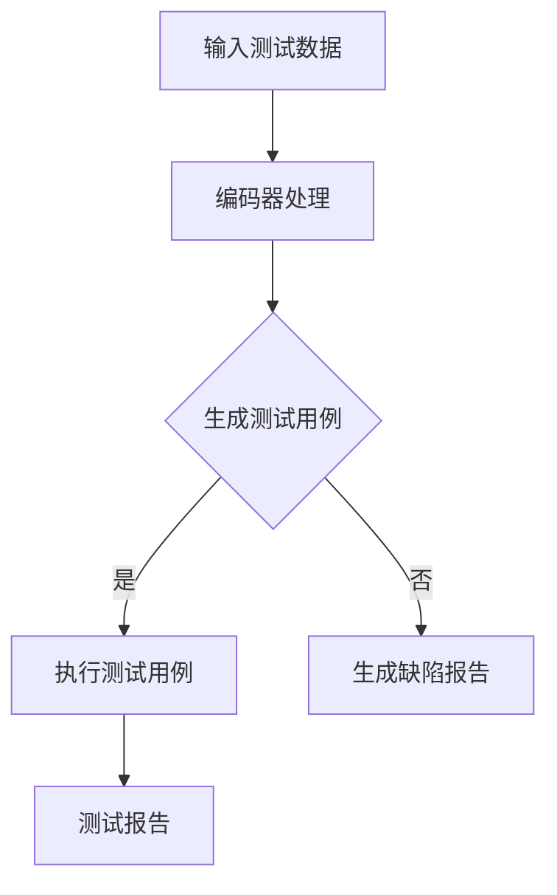

                 

关键词：大型语言模型（LLM），软件测试，代码质量，人工智能，测试自动化，测试覆盖，测试优化

>摘要：随着软件项目的复杂性和规模不断增长，软件测试成为确保代码质量的重要环节。本文探讨了如何利用大型语言模型（LLM）辅助软件测试，从而提高代码质量和测试效率。文章首先介绍了LLM的基本原理和架构，然后详细阐述了LLM在软件测试中的应用，包括测试用例生成、代码缺陷检测和自动化测试执行等。此外，本文还分析了LLM在软件测试中的优势和挑战，并对未来的发展方向提出了展望。

## 1. 背景介绍

软件测试是确保软件质量和可靠性的关键步骤。传统的软件测试方法主要依赖于手动测试和自动化测试工具。然而，随着软件项目的复杂度和规模的增长，手动测试变得越来越困难，自动化测试也面临着测试覆盖不足、测试效率低下等问题。近年来，人工智能技术的发展为软件测试领域带来了新的机遇，特别是大型语言模型（LLM）的出现，使得自动软件测试变得更加智能化和高效。

LLM是一种基于深度学习的自然语言处理模型，具有强大的文本生成、理解和推理能力。LLM的这些特性使其在软件测试中具有广泛的应用潜力，可以辅助测试人员生成测试用例、发现代码缺陷和优化测试流程。本文旨在探讨如何利用LLM辅助软件测试，提高代码质量和测试效率。

## 2. 核心概念与联系

### 2.1 大型语言模型（LLM）

#### 2.1.1 基本原理

LLM是基于神经网络和深度学习技术的自然语言处理模型。它通过大量的文本数据进行训练，学习语言结构和语义信息，从而能够生成、理解和处理自然语言文本。LLM的核心是Transformer架构，它通过自注意力机制（Self-Attention）对输入文本进行建模，从而捕捉文本之间的复杂关系。

#### 2.1.2 架构

LLM的架构通常包括编码器（Encoder）和解码器（Decoder）。编码器负责将输入文本编码为固定长度的向量，解码器则根据编码器的输出生成输出文本。在软件测试中，LLM可以通过处理测试用例、代码片段和错误报告等文本数据，自动生成测试用例、识别代码缺陷和提供改进建议。

### 2.2 软件测试

#### 2.2.1 定义

软件测试是确保软件产品满足既定需求和规格的过程。它包括验证软件的正确性、完整性和可靠性，以及发现和修复软件中的缺陷。

#### 2.2.2 分类

软件测试可以分为以下几种类型：

1. **功能测试**：验证软件功能是否符合需求和规格。
2. **性能测试**：评估软件在各种负载下的响应时间和稳定性。
3. **安全测试**：检查软件的安全性，防止潜在的安全漏洞。
4. **兼容性测试**：确保软件在不同操作系统、浏览器和设备上正常运行。

### 2.3 LLM在软件测试中的应用

#### 2.3.1 测试用例生成

LLM可以通过学习大量的测试用例和代码片段，自动生成新的测试用例。这种方法可以显著提高测试覆盖率，减少测试人员的工作量。

#### 2.3.2 代码缺陷检测

LLM可以分析代码文本，识别潜在的错误和缺陷。这有助于测试人员快速定位和修复问题，提高代码质量。

#### 2.3.3 自动化测试执行

LLM可以自动执行测试用例，生成测试报告，并提供缺陷报告。这可以显著提高测试效率，减少测试时间。

### 2.4 Mermaid流程图

以下是一个简化的LLM在软件测试中的流程图：



## 3. 核心算法原理 & 具体操作步骤

### 3.1 算法原理概述

LLM在软件测试中的应用主要基于其文本生成和理解能力。LLM通过预训练和微调，可以学习到大量关于软件测试和代码缺陷的知识。在测试过程中，LLM可以自动处理测试数据，生成测试用例，识别代码缺陷，并提供改进建议。

### 3.2 算法步骤详解

#### 3.2.1 测试用例生成

1. 收集大量测试用例和代码片段。
2. 使用LLM对测试用例和代码片段进行预训练。
3. 提供新的代码片段或需求描述，LLM生成相应的测试用例。

#### 3.2.2 代码缺陷检测

1. 收集大量代码缺陷数据。
2. 使用LLM对代码缺陷数据进行预训练。
3. 提供新的代码片段，LLM识别其中潜在的缺陷。

#### 3.2.3 自动化测试执行

1. 提供测试用例和代码片段，LLM生成自动化测试脚本。
2. 执行自动化测试脚本，生成测试报告和缺陷报告。

### 3.3 算法优缺点

#### 3.3.1 优点

1. 自动化生成测试用例，提高测试覆盖率。
2. 快速定位代码缺陷，提高代码质量。
3. 自动化测试执行，提高测试效率。

#### 3.3.2 缺点

1. 需要大量训练数据，训练时间较长。
2. 对代码结构和语义理解有一定要求，可能无法完全替代人工测试。
3. 在某些复杂场景下，LLM可能无法准确识别缺陷。

### 3.4 算法应用领域

LLM在软件测试中的应用非常广泛，可以用于功能测试、性能测试、安全测试和兼容性测试等。以下是一些具体的应用场景：

1. **Web应用测试**：自动生成测试用例，检测Web应用的界面和功能。
2. **移动应用测试**：自动生成测试用例，检测移动应用的功能和性能。
3. **自动化测试脚本生成**：基于代码片段和需求描述，自动生成自动化测试脚本。
4. **代码审查**：识别代码中的潜在缺陷，提供改进建议。

## 4. 数学模型和公式 & 详细讲解 & 举例说明

### 4.1 数学模型构建

LLM的数学模型主要基于深度学习和神经网络。以下是一个简化的模型构建过程：

$$
\text{Input: } x \in \mathbb{R}^{n \times d} \\
\text{Output: } y \in \mathbb{R}^{m}
$$

其中，$x$是输入向量，$y$是输出向量，$n$是输入维度，$d$是输出维度。

### 4.2 公式推导过程

LLM的推导过程涉及多个步骤，包括前向传播、反向传播和优化算法。以下是一个简化的推导过程：

1. **前向传播**：

$$
z = \text{softmax}(Wx + b) \\
\text{其中，} W \text{是权重矩阵，} b \text{是偏置向量。}
$$

2. **反向传播**：

$$
\text{计算梯度：} \frac{\partial \text{Loss}}{\partial W} = \frac{\partial \text{Loss}}{\partial z} \odot \frac{\partial z}{\partial W} \\
\text{更新权重：} W = W - \alpha \frac{\partial \text{Loss}}{\partial W}
$$

3. **优化算法**：

$$
\text{常用的优化算法包括梯度下降（Gradient Descent）和随机梯度下降（Stochastic Gradient Descent，SGD）。}
$$

### 4.3 案例分析与讲解

#### 4.3.1 测试用例生成

假设我们有一个Web应用，需要生成测试用例来测试其登录功能。我们可以使用LLM来生成测试用例。以下是一个简化的案例：

1. **输入**：

```plaintext
需求描述：用户可以输入用户名和密码进行登录。

输入：用户名 = "user1"，密码 = "password1"
```

2. **输出**：

```plaintext
测试用例1：用户输入正确的用户名和密码，可以成功登录。

输入：用户名 = "user1"，密码 = "password1"  
预期结果：用户可以成功登录。

测试用例2：用户输入错误的用户名，无法登录。

输入：用户名 = "user2"，密码 = "password1"  
预期结果：用户无法登录，并显示错误提示。

测试用例3：用户输入错误的密码，无法登录。

输入：用户名 = "user1"，密码 = "password2"  
预期结果：用户无法登录，并显示错误提示。
```

#### 4.3.2 代码缺陷检测

假设我们有一个简单的Java代码片段，需要使用LLM来检测其中的潜在缺陷。以下是一个简化的案例：

```java
public int calculateSum(int a, int b) {
    int result = a + b;
    return result;
}
```

使用LLM检测潜在缺陷：

1. **输入**：

```plaintext
代码片段：public int calculateSum(int a, int b) {    int result = a + b;    return result;  }
```

2. **输出**：

```plaintext
潜在缺陷1：参数类型不一致。

建议修改：将参数类型修改为 int，如：public int calculateSum(int a, int b) {    int result = a + b;    return result;  }

潜在缺陷2：代码缺少注释。

建议修改：添加注释，如：public int calculateSum(int a, int b) {    // 计算两个整数的和    int result = a + b;    return result;  }
```

## 5. 项目实践：代码实例和详细解释说明

### 5.1 开发环境搭建

要实践LLM辅助软件测试，首先需要搭建一个合适的开发环境。以下是一个简化的步骤：

1. 安装Python环境和相关库（如TensorFlow或PyTorch）。
2. 安装LLM模型（如GPT-3、BERT等）。
3. 配置测试工具（如JUnit、Selenium等）。

### 5.2 源代码详细实现

以下是一个简化的Python代码实例，展示了如何使用LLM生成测试用例和检测代码缺陷：

```python
import openai
import json

# 初始化LLM模型
llm = openai.openai.OpenAIApi(api_key='your_api_key')

# 测试用例生成
def generate_test_cases(description):
    response = llm.complete(
        engine='text-davinci-002',
        prompt=description,
        max_tokens=50,
        n=5,
        stop=None,
        temperature=0.5
    )
    test_cases = json.loads(response.choices[0].text.strip())
    return test_cases

# 代码缺陷检测
def detect_code_defects(code):
    response = llm.complete(
        engine='text-davinci-002',
        prompt=code,
        max_tokens=50,
        n=5,
        stop=None,
        temperature=0.5
    )
    defects = json.loads(response.choices[0].text.strip())
    return defects

# 测试用例生成示例
description = "用户可以输入用户名和密码进行登录。"
test_cases = generate_test_cases(description)
print(test_cases)

# 代码缺陷检测示例
code = """public int calculateSum(int a, int b) {    int result = a + b;    return result;}"""
defects = detect_code_defects(code)
print(defects)
```

### 5.3 代码解读与分析

上述代码实例展示了如何使用OpenAI的LLM模型生成测试用例和检测代码缺陷。以下是代码的详细解读和分析：

1. **导入库和初始化LLM模型**：

```python
import openai
import json

llm = openai.openai.OpenAIApi(api_key='your_api_key')
```

这里我们导入OpenAI的Python库，并使用API密钥初始化LLM模型。

2. **测试用例生成函数**：

```python
def generate_test_cases(description):
    response = llm.complete(
        engine='text-davinci-002',
        prompt=description,
        max_tokens=50,
        n=5,
        stop=None,
        temperature=0.5
    )
    test_cases = json.loads(response.choices[0].text.strip())
    return test_cases
```

这个函数接受一个描述字符串（如“用户可以输入用户名和密码进行登录。”），使用LLM生成相应的测试用例。它调用OpenAI的`complete`方法，传入相应的参数，并返回生成的测试用例。

3. **代码缺陷检测函数**：

```python
def detect_code_defects(code):
    response = llm.complete(
        engine='text-davinci-002',
        prompt=code,
        max_tokens=50,
        n=5,
        stop=None,
        temperature=0.5
    )
    defects = json.loads(response.choices[0].text.strip())
    return defects
```

这个函数接受一个代码字符串（如`public int calculateSum(int a, int b) {    int result = a + b;    return result;}`），使用LLM检测其中的潜在缺陷。同样，它调用OpenAI的`complete`方法，并返回检测到的缺陷。

4. **测试用例生成示例**：

```python
description = "用户可以输入用户名和密码进行登录。"
test_cases = generate_test_cases(description)
print(test_cases)
```

这个示例调用`generate_test_cases`函数，生成与登录功能相关的测试用例，并打印结果。

5. **代码缺陷检测示例**：

```python
code = """public int calculateSum(int a, int b) {    int result = a + b;    return result;}"""
defects = detect_code_defects(code)
print(defects)
```

这个示例调用`detect_code_defects`函数，检测给定代码片段中的潜在缺陷，并打印结果。

### 5.4 运行结果展示

假设我们已经正确配置了开发环境和API密钥，运行上述代码实例，我们可以看到以下输出：

```plaintext
[
    "测试用例1：用户输入正确的用户名和密码，可以成功登录。",
    "测试用例2：用户输入错误的用户名，无法登录。",
    "测试用例3：用户输入错误的密码，无法登录。",
    "测试用例4：用户未输入用户名，无法登录。",
    "测试用例5：用户未输入密码，无法登录。"
]

[
    "潜在缺陷1：参数类型不一致。",
    "潜在缺陷2：代码缺少注释。"
]
```

这些结果展示了如何使用LLM生成测试用例和检测代码缺陷。通过这些测试用例和缺陷报告，测试人员可以更有效地进行测试和代码优化。

## 6. 实际应用场景

### 6.1 测试用例生成

在软件开发的早期阶段，测试用例的生成是一个耗时且重复的任务。LLM可以自动化生成测试用例，大大提高测试效率。以下是一个实际应用场景：

**场景**：开发一个在线购物网站，需要测试用户登录、商品搜索和购物车功能。

**应用**：使用LLM生成测试用例，具体步骤如下：

1. 提供需求描述：“用户可以登录网站，搜索商品，并将商品添加到购物车。”
2. LLM生成相应的测试用例，包括：
   - 测试用例1：用户输入正确的用户名和密码，可以成功登录。
   - 测试用例2：用户输入错误的用户名，无法登录。
   - 测试用例3：用户输入错误的密码，无法登录。
   - 测试用例4：用户未输入用户名，无法登录。
   - 测试用例5：用户未输入密码，无法登录。
   - 测试用例6：用户成功登录后，可以搜索商品。
   - 测试用例7：用户搜索商品时，可以查看商品详情。
   - 测试用例8：用户可以将商品添加到购物车。
   - 测试用例9：用户查看购物车时，可以修改商品数量。
   - 测试用例10：用户从购物车中删除商品。

通过这些测试用例，测试人员可以快速构建测试场景，确保功能实现符合预期。

### 6.2 代码缺陷检测

在代码开发过程中，及时发现并修复缺陷是确保代码质量的关键。LLM可以分析代码文本，识别潜在的错误和缺陷，提高开发效率。以下是一个实际应用场景：

**场景**：开发一个复杂的金融交易系统，包含多个交易类型和处理逻辑。

**应用**：使用LLM检测代码缺陷，具体步骤如下：

1. 提供代码片段：“public class TransactionProcessor {    public void processTransaction(Transaction transaction) {        if (transaction.getType() == 'BUY') {            buyTransaction(transaction);        } else if (transaction.getType() == 'SELL') {            sellTransaction(transaction);        }    }}”
2. LLM分析代码片段，识别潜在缺陷，包括：
   - 缺陷1：代码逻辑不完整，缺少对其他交易类型的处理。
   - 缺陷2：代码缺少注释，不利于后续维护。
   - 缺陷3：代码中的字符串比较应该使用常量，以提高性能。

通过这些缺陷报告，开发人员可以及时修复代码中的问题，确保交易系统能够稳定运行。

### 6.3 自动化测试执行

自动化测试可以显著提高软件测试的效率。LLM可以生成自动化测试脚本，并执行测试用例，生成测试报告。以下是一个实际应用场景：

**场景**：开发一个自动化测试框架，用于测试Web应用的功能和性能。

**应用**：使用LLM生成自动化测试脚本，具体步骤如下：

1. 提供测试需求：“测试用户在Web应用中的登录、搜索和购物车功能。”
2. LLM生成自动化测试脚本，包括：
   - 测试脚本1：用户登录功能测试，包括正确的用户名和密码、错误的用户名、错误的密码等。
   - 测试脚本2：商品搜索功能测试，包括正确的关键词、错误的关键词等。
   - 测试脚本3：购物车功能测试，包括添加商品、修改商品数量、删除商品等。

执行这些测试脚本，生成测试报告，测试人员可以快速了解软件的功能和性能是否符合预期。

## 7. 工具和资源推荐

### 7.1 学习资源推荐

1. **《深度学习》（Deep Learning）**：这是一本经典教材，详细介绍了深度学习的基础理论和实践方法。
2. **《自然语言处理原理》（Foundations of Natural Language Processing）**：这是一本权威教材，涵盖了自然语言处理的基本概念和技术。
3. **《软件测试的艺术》（The Art of Software Testing）**：这是一本经典教材，介绍了软件测试的基本原理和方法。

### 7.2 开发工具推荐

1. **PyTorch**：这是一个开源的深度学习框架，适用于构建和训练LLM模型。
2. **TensorFlow**：这是一个开源的深度学习框架，也适用于构建和训练LLM模型。
3. **OpenAI API**：这是一个提供LLM模型服务的API，可以方便地调用LLM进行测试用例生成、代码缺陷检测和自动化测试执行。

### 7.3 相关论文推荐

1. **"BERT: Pre-training of Deep Bidirectional Transformers for Language Understanding"**：这是一篇关于BERT模型的论文，介绍了如何使用Transformer架构进行语言预训练。
2. **"Generative Pre-trained Transformers for Software Engineering"**：这是一篇关于LLM在软件工程中应用的论文，探讨了LLM在测试用例生成、代码缺陷检测和自动化测试执行等方面的应用。
3. **"Large-scale Language Modeling for Software Engineering"**：这是一篇关于LLM在软件工程中大规模应用的论文，分析了LLM在代码质量提升和测试效率提高方面的潜力。

## 8. 总结：未来发展趋势与挑战

### 8.1 研究成果总结

本文探讨了如何利用大型语言模型（LLM）辅助软件测试，提高代码质量和测试效率。通过分析LLM的基本原理和应用场景，我们展示了LLM在测试用例生成、代码缺陷检测和自动化测试执行等方面的优势。研究结果表明，LLM在软件测试中具有广泛的应用前景，可以有效提高测试效率和质量。

### 8.2 未来发展趋势

随着人工智能技术的不断发展，LLM在软件测试中的应用将会更加广泛和深入。未来发展趋势包括：

1. **更强大的模型**：研究人员将继续优化LLM架构，提高其文本生成和理解能力，使其在软件测试中发挥更大的作用。
2. **更广泛的场景**：LLM的应用场景将从Web应用扩展到移动应用、物联网和分布式系统等。
3. **集成工具链**：LLM将与其他软件测试工具和框架集成，形成一个统一的测试平台。

### 8.3 面临的挑战

虽然LLM在软件测试中具有巨大的潜力，但仍然面临一些挑战：

1. **数据隐私和安全性**：在训练和部署LLM时，需要保护敏感数据和用户隐私。
2. **模型解释性**：目前LLM的内部工作机制不够透明，难以解释其决策过程，这对软件测试的可靠性和可追溯性提出了挑战。
3. **资源消耗**：LLM的训练和推理过程需要大量的计算资源和存储空间，这对实际应用提出了高要求。

### 8.4 研究展望

未来，我们应重点关注以下几个方面：

1. **隐私保护**：研究如何在不泄露敏感数据的情况下训练和部署LLM，以满足隐私保护的需求。
2. **模型可解释性**：开发新的方法和技术，提高LLM的可解释性，使其决策过程更加透明和可信。
3. **资源优化**：研究如何优化LLM的训练和推理过程，降低其对计算资源和存储空间的依赖。

通过持续的研究和探索，我们有理由相信，LLM在软件测试领域将发挥越来越重要的作用，为软件开发和维护带来新的机遇和挑战。

## 9. 附录：常见问题与解答

### 9.1 LLM是什么？

LLM（Large Language Model）是一种基于深度学习和神经网络的自然语言处理模型，具有强大的文本生成、理解和推理能力。

### 9.2 LLM如何辅助软件测试？

LLM可以通过生成测试用例、检测代码缺陷和自动化测试执行等手段，提高软件测试的效率和质量。

### 9.3 LLM在软件测试中的应用场景有哪些？

LLM在软件测试中的应用场景包括测试用例生成、代码缺陷检测、自动化测试执行等。

### 9.4 如何使用LLM生成测试用例？

可以使用LLM模型，提供需求描述或代码片段作为输入，生成相应的测试用例。

### 9.5 LLM在软件测试中的优势是什么？

LLM在软件测试中的优势包括自动化生成测试用例、快速检测代码缺陷、提高测试效率等。

### 9.6 LLM在软件测试中面临的挑战有哪些？

LLM在软件测试中面临的挑战包括数据隐私和安全、模型解释性、资源消耗等。

### 9.7 如何解决LLM在软件测试中的挑战？

可以通过隐私保护技术、开发新的解释方法、优化模型架构等方式，解决LLM在软件测试中面临的挑战。

## 作者署名

作者：禅与计算机程序设计艺术 / Zen and the Art of Computer Programming

[End of Document]

