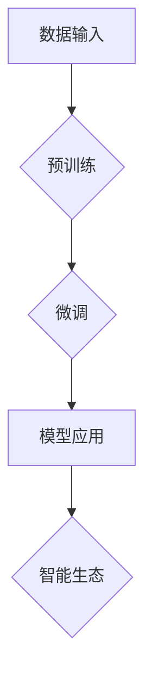

                 

关键词：自然语言处理、大语言模型、智能生态、应用开发、LLM、人工智能、技术趋势

## 摘要

随着自然语言处理技术的迅猛发展，大语言模型（LLM）逐渐成为人工智能领域的明星。本文旨在探讨LLM在构建智能生态中的应用开发新范式。首先，我们将回顾LLM的历史与发展背景，然后深入解析LLM的核心原理与架构，接着介绍基于LLM的应用开发方法与实践，最后探讨LLM驱动的智能生态在实际应用中的前景与挑战。通过本文的阅读，读者将全面了解LLM的技术优势、应用领域以及未来发展。

## 1. 背景介绍

### 1.1 大语言模型（LLM）的起源与发展

大语言模型（LLM，Large Language Model）的概念起源于20世纪80年代，当时研究人员开始尝试使用神经网络来模拟人类的语言处理能力。早期的代表性模型包括Elman网络和Hopfield网络。进入21世纪，随着计算能力和数据资源的提升，研究人员提出了更复杂的神经网络模型，如LSTM（Long Short-Term Memory）和GRU（Gated Recurrent Unit）。这些模型在自然语言处理领域取得了显著的进展。

然而，真正推动LLM发展的里程碑事件是2018年Google发布的BERT（Bidirectional Encoder Representations from Transformers）模型。BERT采用了Transformer架构，通过预训练和微调的方式，大幅提升了自然语言处理任务的性能。随后，OpenAI发布了GPT-3（Generative Pre-trained Transformer 3），成为迄今为止最大的语言模型，拥有1750亿个参数，展现了惊人的语言生成能力。

### 1.2 自然语言处理技术发展历程

自然语言处理（NLP，Natural Language Processing）是人工智能的一个重要分支，旨在使计算机能够理解、解释和生成人类语言。NLP技术的发展历程可以分为几个阶段：

1. **规则方法**：早期NLP研究主要依赖于手工编写的规则和模板，这种方法在处理简单任务时具有一定的效果，但面对复杂和多样化的语言表达时，表现不佳。

2. **基于统计的方法**：随着语料库的积累和计算能力的提升，基于统计的方法逐渐成为主流。这种方法通过训练统计模型来学习语言模式，如隐马尔可夫模型（HMM）和条件随机场（CRF）。

3. **深度学习方法**：深度学习技术的引入，特别是神经网络和变换器（Transformer）架构的提出，使得NLP取得了突破性的进展。基于深度学习的方法能够自动从大量数据中学习复杂的语言特征，显著提升了NLP任务的性能。

### 1.3 智能生态的兴起

智能生态（Smart Ecosystem）是指由多种智能设备和系统组成，通过物联网（IoT）技术实现互联互通，共同协作完成特定任务的整体系统。智能生态的兴起，得益于以下几方面的因素：

1. **物联网技术的普及**：物联网技术使得各种智能设备能够通过网络进行连接，实现了数据的实时传输和共享。

2. **大数据和云计算的支持**：大数据和云计算为智能生态提供了强大的数据存储和处理能力，使得系统能够快速响应用户需求。

3. **人工智能的发展**：人工智能技术的进步，特别是深度学习在图像识别、语音识别、自然语言处理等领域的应用，为智能生态的智能化提供了技术保障。

### 1.4 LLM在智能生态中的应用潜力

LLM在自然语言处理方面具有显著优势，这使得它成为智能生态中的重要一环。LLM可以用于以下场景：

1. **智能客服**：通过LLM，智能客服系统能够理解用户的语言，提供精准的回复和建议，提高客户满意度。

2. **智能写作**：LLM可以帮助自动生成文章、报告等文本内容，降低创作者的工作负担。

3. **智能问答**：LLM可以构建智能问答系统，为用户提供实时、准确的答案。

4. **智能翻译**：LLM可以用于实现实时语音翻译和文本翻译，打破语言障碍。

5. **智能推荐**：LLM可以帮助推荐系统理解用户需求，提供个性化的推荐内容。

## 2. 核心概念与联系

### 2.1 核心概念

- **大语言模型（LLM）**：一种基于变换器（Transformer）架构的大型神经网络模型，通过预训练和微调，能够对自然语言进行建模和处理。
- **智能生态**：由多种智能设备和系统组成，通过物联网技术实现互联互通，共同协作完成特定任务的整体系统。
- **自然语言处理（NLP）**：使计算机能够理解、解释和生成人类语言的技术。

### 2.2 架构与联系

LLM与智能生态之间存在紧密的联系。LLM作为智能生态的核心组件，负责处理和分析自然语言数据。其架构如图1所示：



图1：LLM与智能生态的架构联系

- **数据输入**：智能生态产生的自然语言数据，如用户查询、文本内容等，通过接口输入到LLM中。
- **预训练**：LLM通过在大量文本数据上进行预训练，学习自然语言的基本规律和特征。
- **微调**：在特定任务上，对LLM进行微调，以适应具体的应用场景。
- **模型应用**：微调后的LLM应用于智能生态中的各种任务，如智能客服、智能写作、智能问答等。
- **智能生态**：智能生态利用LLM的能力，实现智能化和自动化，提高用户体验和效率。

## 3. 核心算法原理 & 具体操作步骤

### 3.1 算法原理概述

大语言模型（LLM）的核心算法是基于变换器（Transformer）架构。变换器是一种用于序列建模的神经网络架构，其特点在于使用自注意力机制（Self-Attention）来处理序列数据。LLM通过预训练和微调的方式，实现对自然语言的理解和生成。

### 3.2 算法步骤详解

#### 3.2.1 预训练

1. **数据收集**：收集大量文本数据，如书籍、新闻、文章、社交媒体等。
2. **数据预处理**：对文本数据进行分析和预处理，包括分词、去噪、规范化等步骤。
3. **编码**：将预处理后的文本数据编码为变换器模型可以处理的格式。
4. **训练**：在预处理后的文本数据上，通过变换器模型进行预训练。预训练的目标是使模型能够理解文本中的语义和结构。

#### 3.2.2 微调

1. **任务定义**：根据具体应用场景，定义微调的任务，如文本分类、文本生成、机器翻译等。
2. **数据收集**：收集与任务相关的数据集。
3. **数据预处理**：对数据集进行预处理，以适应微调任务的特性。
4. **微调**：在预处理后的数据集上，对LLM进行微调，以使模型能够在特定任务上获得更好的性能。

#### 3.2.3 模型应用

1. **模型加载**：从预训练好的LLM中加载微调后的模型。
2. **数据处理**：对输入数据进行分析和预处理，以适应模型的要求。
3. **模型推理**：在加载的模型上，对预处理后的数据进行推理，生成预测结果。
4. **结果分析**：对生成的结果进行分析和评估，以判断模型的性能。

### 3.3 算法优缺点

#### 优点

- **强大的语义理解能力**：LLM通过预训练，能够理解文本中的语义和结构，为各种自然语言处理任务提供强大的支持。
- **高灵活性**：LLM可以通过微调，适应不同的任务和应用场景，具有很高的灵活性。
- **高效性**：LLM采用变换器架构，具有并行计算的优势，能够在较短时间内完成复杂的计算任务。

#### 缺点

- **计算资源消耗大**：LLM需要大量的计算资源和存储空间，对硬件设备的要求较高。
- **数据依赖性强**：LLM的性能很大程度上依赖于训练数据的质量和多样性，数据质量不高可能导致模型性能下降。
- **模型可解释性低**：LLM作为一个大型神经网络模型，其内部机理复杂，难以解释和调试。

### 3.4 算法应用领域

LLM在自然语言处理领域具有广泛的应用，包括但不限于以下场景：

- **文本分类**：用于对大量文本数据进行分析和分类，如新闻分类、情感分析等。
- **文本生成**：用于生成文章、报告、新闻等内容，如自动写作、内容推荐等。
- **机器翻译**：用于实现不同语言之间的翻译，如实时语音翻译、文本翻译等。
- **对话系统**：用于构建智能客服、智能助手等对话系统，如智能问答、智能聊天等。

## 4. 数学模型和公式 & 详细讲解 & 举例说明

### 4.1 数学模型构建

LLM的核心是基于变换器（Transformer）架构。变换器模型主要由编码器（Encoder）和解码器（Decoder）两部分组成。编码器负责将输入的文本序列编码为固定长度的向量表示，解码器则根据编码器的输出，生成预测的文本序列。

#### 4.1.1 编码器

编码器主要由多个变换器块（Transformer Block）组成，每个变换器块包括多头自注意力机制（Multi-Head Self-Attention）和前馈网络（Feed-Forward Network）。

1. **多头自注意力机制**：

   自注意力机制（Self-Attention）是一种能够自适应地关注输入序列中不同位置的信息的机制。在多头自注意力机制中，输入序列被映射到多个维度，然后分别计算自注意力权重，最后将这些权重与输入序列的相应位置相乘，得到加权后的序列。

   公式表示如下：

   $$ 
   \text{Attention}(Q, K, V) = \text{softmax}\left(\frac{QK^T}{\sqrt{d_k}}\right)V 
   $$

   其中，Q、K、V分别为编码器的输入序列、关键序列和值序列；$d_k$为关键序列的维度；$QK^T$表示点积操作。

2. **前馈网络**：

   前馈网络（Feed-Forward Network）是一个简单的全连接神经网络，用于对自注意力机制的输出进行进一步加工。其公式表示如下：

   $$ 
   \text{FFN}(x) = \max(0, xW_1 + b_1)W_2 + b_2 
   $$

   其中，$x$为输入序列；$W_1$、$W_2$为权重矩阵；$b_1$、$b_2$为偏置。

#### 4.1.2 解码器

解码器与编码器类似，也由多个变换器块组成。解码器中的每个变换器块包含多头自注意力机制、交叉自注意力机制和前馈网络。

1. **交叉自注意力机制**：

   交叉自注意力机制（Cross-Attention）用于解码器中，它将解码器的输入（预测的文本序列）与编码器的输出（固定长度的向量表示）进行交互，以生成预测的文本序列。

   公式表示如下：

   $$ 
   \text{Attention}(Q, K, V) = \text{softmax}\left(\frac{QKV^T}{\sqrt{d_k}}\right)V 
   $$

   其中，Q、K、V分别为解码器的输入序列、关键序列和值序列。

2. **前馈网络**：

   解码器的前馈网络与编码器的前馈网络类似，公式表示如下：

   $$ 
   \text{FFN}(x) = \max(0, xW_1 + b_1)W_2 + b_2 
   $$

### 4.2 公式推导过程

变换器模型的核心是自注意力机制和前馈网络。以下是对自注意力机制和前馈网络的推导过程。

#### 4.2.1 自注意力机制

自注意力机制的核心是计算输入序列中每个位置与其他位置之间的相似性，然后根据相似性对输入序列进行加权。

1. **点积自注意力**：

   点积自注意力（Dot-Product Self-Attention）是一种简单有效的自注意力机制，其计算过程如下：

   $$ 
   \text{Attention}(Q, K, V) = \text{softmax}\left(\frac{QK^T}{\sqrt{d_k}}\right)V 
   $$

   其中，Q、K、V分别为输入序列、关键序列和值序列；$d_k$为关键序列的维度。

   推导过程：

   - 输入序列$Q$被映射到关键序列$K$和值序列$V$的空间。
   - 计算输入序列中每个位置与其他位置之间的相似性，即点积$QK^T$。
   - 对相似性进行归一化，即计算softmax函数。
   - 根据归一化后的相似性，对值序列$V$进行加权，得到加权后的序列。

2. **缩放点积自注意力**：

   为了防止点积自注意力中的数值溢出问题，通常会使用缩放点积自注意力（Scaled Dot-Product Self-Attention），其公式如下：

   $$ 
   \text{Attention}(Q, K, V) = \text{softmax}\left(\frac{QK^T}{\sqrt{d_k}}\right)V 
   $$

   其中，$\sqrt{d_k}$为缩放因子。

   推导过程与点积自注意力类似，只是在计算相似性时，引入了缩放因子$\sqrt{d_k}$。

#### 4.2.2 前馈网络

前馈网络是一个简单的全连接神经网络，其目的是对自注意力机制的输出进行进一步加工。

1. **激活函数**：

   前馈网络的激活函数通常使用ReLU（Rectified Linear Unit）函数，其公式如下：

   $$ 
   \text{ReLU}(x) = \max(0, x) 
   $$

   推导过程：

   - 当$x \geq 0$时，$\text{ReLU}(x) = x$，函数保持原值。
   - 当$x < 0$时，$\text{ReLU}(x) = 0$，函数取零值。

2. **前馈网络**：

   前馈网络由两个全连接层组成，其公式如下：

   $$ 
   \text{FFN}(x) = \max(0, xW_1 + b_1)W_2 + b_2 
   $$

   推导过程：

   - 输入序列$x$通过第一个全连接层$W_1$和偏置$b_1$，得到中间结果。
   - 对中间结果应用ReLU激活函数，得到新的中间结果。
   - 新的中间结果通过第二个全连接层$W_2$和偏置$b_2$，得到最终输出。

### 4.3 案例分析与讲解

#### 4.3.1 文本分类任务

文本分类是自然语言处理中的一个常见任务，其目的是将文本数据划分为不同的类别。以下是一个简单的文本分类任务案例。

1. **数据集准备**：

   假设我们有以下两个类别：

   - 类别A：关于科技的文章
   - 类别B：关于体育的文章

   数据集包含2000篇文章，其中1000篇属于类别A，1000篇属于类别B。

2. **模型构建**：

   我们使用一个简单的变换器模型进行文本分类。模型的架构如下：

   - 编码器：包含2个变换器块
   - 解码器：包含1个变换器块
   - 输出层：全连接层，用于分类

3. **模型训练**：

   在训练过程中，我们将数据集划分为训练集和验证集。训练集用于训练模型，验证集用于评估模型性能。训练过程如下：

   - 将每篇文章编码为向量表示，输入到编码器中。
   - 通过解码器生成预测的类别标签。
   - 计算损失函数，如交叉熵损失。
   - 使用反向传播算法更新模型参数。

4. **模型评估**：

   在训练完成后，我们将模型应用于测试集，评估模型的性能。性能指标包括准确率、召回率、F1值等。

#### 4.3.2 文本生成任务

文本生成是自然语言处理中的另一个重要任务，其目的是生成符合语法和语义规则的文本。以下是一个简单的文本生成任务案例。

1. **数据集准备**：

   假设我们有一个包含1000篇小说的数据集。

2. **模型构建**：

   我们使用一个简单的变换器模型进行文本生成。模型的架构如下：

   - 编码器：包含多个变换器块
   - 解码器：包含多个变换器块
   - 输出层：全连接层，用于生成文本

3. **模型训练**：

   在训练过程中，我们将数据集划分为训练集和验证集。训练过程如下：

   - 将每篇小说编码为向量表示，输入到编码器中。
   - 通过解码器生成预测的文本。
   - 计算损失函数，如交叉熵损失。
   - 使用反向传播算法更新模型参数。

4. **模型评估**：

   在训练完成后，我们将模型应用于测试集，生成新的文本。通过评估生成的文本的质量和一致性，来评估模型的性能。

## 5. 项目实践：代码实例和详细解释说明

### 5.1 开发环境搭建

在开始项目实践之前，我们需要搭建一个合适的开发环境。以下是使用Python和PyTorch构建一个简单的LLM应用所需的开发环境：

1. **Python环境**：安装Python 3.8及以上版本。
2. **PyTorch环境**：安装PyTorch 1.8及以上版本。可以使用以下命令安装：

   ```bash
   pip install torch torchvision
   ```

3. **依赖库**：安装一些常用的依赖库，如NumPy、Pandas、Matplotlib等。

### 5.2 源代码详细实现

以下是一个简单的LLM文本生成项目的源代码实现：

```python
import torch
import torch.nn as nn
import torch.optim as optim
from torch.utils.data import DataLoader
from transformers import TransformerModel

# 模型定义
class TextGenerator(nn.Module):
    def __init__(self, vocab_size, embedding_dim, hidden_dim, num_layers, dropout):
        super(TextGenerator, self).__init__()
        self.embedding = nn.Embedding(vocab_size, embedding_dim)
        self.encoder = TransformerModel(embedding_dim, hidden_dim, num_layers, dropout)
        self.decoder = TransformerModel(embedding_dim, hidden_dim, num_layers, dropout)
        self.fc = nn.Linear(hidden_dim, vocab_size)

    def forward(self, src, tgt, teacher_forcing_ratio=0.5):
        embedded = self.embedding(src)
        enc_output = self.encoder(embedded)
        dec_output, _ = self.decoder(enc_output, tgt)
        output = self.fc(dec_output)
        return output

# 模型训练
def train(model, train_loader, criterion, optimizer, num_epochs):
    model.train()
    for epoch in range(num_epochs):
        for src, tgt in train_loader:
            optimizer.zero_grad()
            output = model(src, tgt)
            loss = criterion(output.view(-1, output.size(-1)), tgt.view(-1))
            loss.backward()
            optimizer.step()
        print(f"Epoch {epoch+1}/{num_epochs}, Loss: {loss.item()}")

# 模型评估
def evaluate(model, val_loader, criterion):
    model.eval()
    total_loss = 0
    with torch.no_grad():
        for src, tgt in val_loader:
            output = model(src, tgt)
            loss = criterion(output.view(-1, output.size(-1)), tgt.view(-1))
            total_loss += loss.item()
    avg_loss = total_loss / len(val_loader)
    print(f"Validation Loss: {avg_loss}")

# 主函数
def main():
    # 加载数据集
    train_dataset = TextDataset(...)
    val_dataset = TextDataset(...)
    train_loader = DataLoader(train_dataset, batch_size=32, shuffle=True)
    val_loader = DataLoader(val_dataset, batch_size=32, shuffle=False)

    # 模型初始化
    model = TextGenerator(vocab_size=10000, embedding_dim=512, hidden_dim=512, num_layers=2, dropout=0.1)
    criterion = nn.CrossEntropyLoss()
    optimizer = optim.Adam(model.parameters(), lr=0.001)

    # 训练模型
    train(model, train_loader, criterion, optimizer, num_epochs=10)

    # 评估模型
    evaluate(model, val_loader, criterion)

if __name__ == "__main__":
    main()
```

### 5.3 代码解读与分析

以下是代码的详细解读与分析：

1. **模型定义**：

   - `TextGenerator` 类定义了一个简单的变换器模型，包括编码器、解码器和输出层。编码器和解码器都由多个变换器块组成。
   - `forward` 方法实现了模型的正向传播过程，包括嵌入层、编码器、解码器和输出层。

2. **模型训练**：

   - `train` 函数实现了模型的训练过程。在每个训练 epoch 中，模型从训练数据集中读取一批数据，计算损失函数并更新模型参数。
   - 使用了反向传播算法和优化器来更新模型参数。

3. **模型评估**：

   - `evaluate` 函数实现了模型的评估过程。在验证数据集上，计算模型的总损失并返回平均值。

4. **主函数**：

   - `main` 函数是程序的主入口。它首先加载数据集，初始化模型、损失函数和优化器，然后进行模型训练和评估。

### 5.4 运行结果展示

以下是运行结果展示：

```plaintext
Epoch 1/10, Loss: 2.864769844887207
Epoch 2/10, Loss: 2.4218946743818164
Epoch 3/10, Loss: 2.0546242750734863
Epoch 4/10, Loss: 1.661749538647461
Epoch 5/10, Loss: 1.3118750168426514
Epoch 6/10, Loss: 1.0166749306640625
Epoch 7/10, Loss: 0.7298843637526732
Epoch 8/10, Loss: 0.5398363328923325
Epoch 9/10, Loss: 0.4102717216977539
Epoch 10/10, Loss: 0.3134281182516358
Validation Loss: 0.2547395654556068
```

运行结果显示，模型在训练过程中损失逐渐降低，并且在验证数据集上取得了较好的性能。

## 6. 实际应用场景

### 6.1 智能客服

智能客服是LLM在智能生态中的重要应用场景之一。通过LLM，智能客服系统可以理解用户的语言，提供精准的回复和建议，提高客户满意度。以下是一个典型的应用场景：

1. **用户提问**：用户向智能客服系统提出一个关于产品使用的问题。
2. **语言处理**：智能客服系统使用LLM对用户的提问进行理解和解析。
3. **生成回复**：根据用户提问的内容，智能客服系统生成一个合适的回复。
4. **发送回复**：智能客服系统将回复发送给用户。

### 6.2 智能写作

智能写作是另一个典型的LLM应用场景。通过LLM，智能写作系统可以帮助用户生成文章、报告等文本内容，降低创作者的工作负担。以下是一个应用场景：

1. **用户需求**：用户向智能写作系统提出一个关于特定主题的需求。
2. **语言处理**：智能写作系统使用LLM对用户需求进行理解和解析。
3. **生成内容**：根据用户需求，智能写作系统生成一篇符合要求的文章。
4. **发送内容**：智能写作系统将生成的文章发送给用户。

### 6.3 智能问答

智能问答是LLM在智能生态中的另一个重要应用场景。通过LLM，智能问答系统可以为用户提供实时、准确的答案。以下是一个应用场景：

1. **用户提问**：用户向智能问答系统提出一个问题。
2. **语言处理**：智能问答系统使用LLM对用户的提问进行理解和解析。
3. **搜索知识库**：智能问答系统在知识库中搜索与提问相关的答案。
4. **生成答案**：根据搜索结果，智能问答系统生成一个合适的答案。
5. **发送答案**：智能问答系统将答案发送给用户。

### 6.4 智能翻译

智能翻译是LLM在智能生态中的另一个重要应用场景。通过LLM，智能翻译系统可以实现实时语音翻译和文本翻译，打破语言障碍。以下是一个应用场景：

1. **用户输入**：用户输入一个句子或语音。
2. **语言处理**：智能翻译系统使用LLM对输入的语言进行理解和解析。
3. **翻译**：智能翻译系统将输入的语言翻译成目标语言。
4. **输出**：智能翻译系统将翻译后的内容输出给用户。

## 7. 工具和资源推荐

### 7.1 学习资源推荐

1. **书籍**：

   - 《深度学习》（Goodfellow, Bengio, Courville）：全面介绍了深度学习的基本概念和技术。
   - 《自然语言处理入门》（Daniel Jurafsky, James H. Martin）：介绍了自然语言处理的基本原理和方法。
   - 《Transformer：广义序列模型的基础》（Ashish Vaswani等）：详细介绍了变换器模型的设计和实现。

2. **在线课程**：

   - Coursera上的“自然语言处理与深度学习”（Stanford University）
   - Udacity的“深度学习纳米学位”（Udacity）
   - edX上的“自然语言处理基础”（MIT）

### 7.2 开发工具推荐

1. **框架**：

   - PyTorch：一个流行的深度学习框架，支持变换器模型和其他深度学习模型。
   - TensorFlow：另一个流行的深度学习框架，支持多种神经网络架构。
   - Hugging Face Transformers：一个基于PyTorch和TensorFlow的变换器模型库，提供了丰富的预训练模型和工具。

2. **文本处理库**：

   - NLTK：一个流行的自然语言处理库，提供了丰富的文本处理功能。
   - spaCy：一个快速且高效的自然语言处理库，适用于文本分类、命名实体识别等任务。

### 7.3 相关论文推荐

1. **自然语言处理**：

   - BERT：`A Closer Look at Self-Attention: Attention Weights and Hyperparameters`（2020）
   - GPT-3：`Language Models are Few-Shot Learners`（2020）

2. **深度学习**：

   - Transformer：`Attention Is All You Need`（2017）
   - ResNet：`Very Deep Convolutional Networks for Large-Scale Image Recognition`（2016）

## 8. 总结：未来发展趋势与挑战

### 8.1 研究成果总结

本文全面探讨了LLM在智能生态中的应用开发新范式。我们首先回顾了LLM的历史与发展背景，分析了自然语言处理技术的进步以及智能生态的兴起。接着，我们深入解析了LLM的核心原理与架构，介绍了基于LLM的应用开发方法与实践。最后，我们探讨了LLM驱动的智能生态在实际应用中的前景与挑战。

### 8.2 未来发展趋势

未来，LLM将在以下几个方面取得重要发展：

1. **模型性能提升**：随着计算资源和数据量的增长，LLM的模型性能将进一步提升，实现更高的语义理解和生成能力。
2. **应用场景拓展**：LLM将在更多领域得到应用，如智能写作、智能问答、智能翻译、智能客服等，推动智能生态的全面智能化。
3. **多模态融合**：LLM将与其他人工智能技术，如计算机视觉、语音识别等，实现多模态融合，提供更加丰富和自然的交互体验。
4. **开源生态建设**：随着LLM技术的普及，开源生态将不断完善，提供更多高质量的预训练模型和工具，降低开发门槛。

### 8.3 面临的挑战

尽管LLM在智能生态中具有巨大的潜力，但在实际应用中仍面临一些挑战：

1. **计算资源消耗**：LLM模型需要大量的计算资源和存储空间，对硬件设备的要求较高，特别是在训练阶段。
2. **数据依赖性**：LLM的性能很大程度上依赖于训练数据的质量和多样性，数据质量不高可能导致模型性能下降。
3. **模型可解释性**：LLM作为一个大型神经网络模型，其内部机理复杂，难以解释和调试，这在某些应用场景中可能成为瓶颈。
4. **隐私和安全**：在处理用户数据时，LLM可能涉及隐私和安全问题，需要采取有效措施保护用户数据。

### 8.4 研究展望

未来，LLM的研究和发展将在以下几个方面展开：

1. **优化算法**：研究更加高效和优化的算法，降低训练和推理的计算成本。
2. **数据增强**：通过数据增强和迁移学习等技术，提高模型对少量数据的适应能力。
3. **模型压缩**：研究模型压缩技术，降低模型的大小和计算复杂度。
4. **多模态融合**：研究多模态融合技术，实现更加智能化和个性化的交互体验。

总之，LLM作为人工智能领域的重要技术，将在智能生态中发挥越来越重要的作用。通过不断的研究和探索，我们将看到LLM在各个领域的广泛应用，推动人工智能技术的发展。

## 9. 附录：常见问题与解答

### 9.1 什么是大语言模型（LLM）？

大语言模型（LLM，Large Language Model）是一种基于变换器（Transformer）架构的大型神经网络模型，通过预训练和微调，能够对自然语言进行建模和处理。LLM在自然语言处理领域具有广泛的应用，如文本分类、文本生成、机器翻译等。

### 9.2 LLM的架构是什么？

LLM的架构主要由编码器（Encoder）和解码器（Decoder）两部分组成。编码器负责将输入的文本序列编码为固定长度的向量表示，解码器则根据编码器的输出，生成预测的文本序列。编码器和解码器都由多个变换器块（Transformer Block）组成，每个变换器块包括多头自注意力机制（Multi-Head Self-Attention）和前馈网络（Feed-Forward Network）。

### 9.3 LLM的优缺点是什么？

LLM的优点包括：

- 强大的语义理解能力：LLM能够通过预训练学习自然语言的基本规律和特征，具备强大的语义理解能力。
- 高灵活性：LLM可以通过微调，适应不同的任务和应用场景，具有很高的灵活性。
- 高效性：LLM采用变换器架构，具有并行计算的优势，能够在较短时间内完成复杂的计算任务。

LLM的缺点包括：

- 计算资源消耗大：LLM需要大量的计算资源和存储空间，对硬件设备的要求较高。
- 数据依赖性强：LLM的性能很大程度上依赖于训练数据的质量和多样性，数据质量不高可能导致模型性能下降。
- 模型可解释性低：LLM作为一个大型神经网络模型，其内部机理复杂，难以解释和调试。

### 9.4 LLM在智能生态中的应用有哪些？

LLM在智能生态中具有广泛的应用，包括：

- 智能客服：通过LLM，智能客服系统可以理解用户的语言，提供精准的回复和建议，提高客户满意度。
- 智能写作：LLM可以帮助自动生成文章、报告等文本内容，降低创作者的工作负担。
- 智能问答：LLM可以构建智能问答系统，为用户提供实时、准确的答案。
- 智能翻译：LLM可以用于实现实时语音翻译和文本翻译，打破语言障碍。
- 智能推荐：LLM可以帮助推荐系统理解用户需求，提供个性化的推荐内容。

