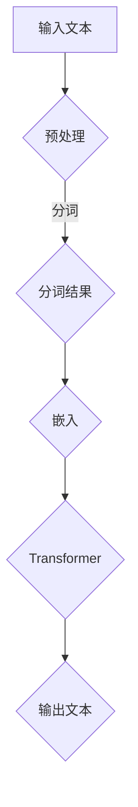

                 

关键词：大型语言模型，计算机架构，人工智能，深度学习，神经网络，模型压缩，高效计算。

> 摘要：本文深入探讨了大型语言模型（LLM）在计算机架构领域中的崛起，分析了其核心概念、算法原理、数学模型以及实际应用。通过对LLM的技术细节和未来发展趋势的探讨，旨在为读者提供全面的技术视角，了解这一新兴领域的重要性和潜力。

## 1. 背景介绍

随着互联网的迅猛发展和数据爆炸式增长，人工智能（AI）技术在过去十年取得了显著突破。特别是深度学习（Deep Learning）作为AI的重要分支，已经在图像识别、自然语言处理、语音识别等领域展现出强大的能力。而近年来，随着计算能力的提升和海量数据的积累，大型语言模型（LLM）逐渐崭露头角，成为计算机架构领域的一股新势力。

LLM的出现，源于对语言理解和生成需求的日益增长。传统的自然语言处理（NLP）方法，如规则匹配和统计模型，在处理复杂语言现象时存在明显局限。而LLM，通过大规模的神经网络模型，能够更好地模拟人类语言习得和表达能力，从而在文本生成、对话系统、机器翻译等任务上取得了令人瞩目的成果。

本文将从以下几个方面展开讨论：

- 核心概念与联系：介绍LLM的基本概念及其与其他技术的关联。
- 核心算法原理 & 具体操作步骤：详解LLM的算法原理和实现步骤。
- 数学模型和公式 & 详细讲解 & 举例说明：阐述LLM背后的数学模型和公式，并通过案例进行分析。
- 项目实践：提供实际代码实例，展示LLM的应用。
- 实际应用场景：探讨LLM在各个领域的应用。
- 未来应用展望：展望LLM的发展趋势和潜在挑战。

## 2. 核心概念与联系

### 2.1 大型语言模型（LLM）的定义

大型语言模型（Large Language Model，LLM）是一种基于深度学习技术的语言模型，通过学习大规模的语料库，能够生成自然语言文本、回答问题、进行对话等。LLM的核心是一个高度参数化的神经网络模型，通常使用数十亿个参数来表示语言知识。

### 2.2 语言模型的基本原理

语言模型（Language Model，LM）是自然语言处理的基础，其目标是预测下一个单词或字符的概率。传统语言模型主要基于统计方法，如N-gram模型，但这种方法在处理长文本和复杂语言现象时存在局限。

深度学习语言模型，如LLM，通过多层神经网络来捕捉语言的长期依赖关系。具体而言，LLM使用一种称为Transformer的架构，这是一种基于自注意力机制的神经网络模型，能够自动捕捉输入序列中各个位置之间的依赖关系。

### 2.3 LLM与其他技术的关联

LLM与其他AI技术有着紧密的联系：

- **深度学习**：LLM是基于深度学习技术的一种典型应用，其核心是神经网络模型的训练和应用。
- **自然语言处理（NLP）**：LLM是NLP领域的重要工具，能够用于文本生成、问答系统、机器翻译等任务。
- **计算机视觉**：虽然LLM主要用于处理文本数据，但也可以与计算机视觉技术结合，例如在图像描述生成、视频字幕生成等任务中发挥作用。
- **强化学习**：LLM可以与强化学习结合，用于构建智能代理，实现自动化决策和交互。

### 2.4 Mermaid流程图展示

为了更好地理解LLM的核心概念和架构，我们使用Mermaid流程图来展示LLM的基本工作流程。



在该流程图中：

- **A**：输入文本
- **B**：预处理，包括去除特殊字符、标记化等
- **C**：分词结果
- **D**：嵌入，将分词结果转化为向量表示
- **E**：Transformer，核心神经网络模型
- **F**：输出文本

通过该流程图，我们可以清晰地看到LLM从输入文本到生成输出文本的基本过程。

## 3. 核心算法原理 & 具体操作步骤

### 3.1 算法原理概述

LLM的核心是Transformer架构，这是一种基于自注意力机制的神经网络模型。Transformer的灵感来源于注意力机制在序列模型中的成功应用，例如在机器翻译和文本生成任务中。相比传统的循环神经网络（RNN），Transformer通过并行计算和自注意力机制，能够更高效地处理长序列数据。

### 3.2 算法步骤详解

以下是LLM的算法步骤：

1. **输入预处理**：对输入文本进行预处理，包括分词、标记化等操作，将文本转化为向量表示。
2. **嵌入（Embedding）**：将分词结果转化为嵌入向量，这些向量包含了词汇的语义信息。
3. **位置编码（Positional Encoding）**：由于Transformer没有循环结构，无法捕捉序列中的位置信息，因此引入位置编码来表示词汇的位置。
4. **多头自注意力（Multi-Head Self-Attention）**：通过多头自注意力机制，模型能够同时关注序列中的不同位置，并计算每个位置的重要程度。
5. **前馈网络（Feed-Forward Network）**：在自注意力层之后，使用前馈网络对每个位置的特征进行进一步处理。
6. **层归一化（Layer Normalization）**：对每个位置的特征进行归一化处理，有助于提高模型的训练效果。
7. **添加残差连接（Add & Residual Connection）**：通过添加残差连接，使模型在训练过程中能够更好地收敛。
8. **输出层**：将最终的输出经过softmax层，得到每个词汇的概率分布。

### 3.3 算法优缺点

**优点**：

- **并行计算**：Transformer的架构允许并行计算，相比RNN等序列模型，训练速度更快。
- **捕捉长期依赖关系**：通过多头自注意力机制，模型能够有效地捕捉序列中的长期依赖关系。
- **灵活性**：Transformer可以很容易地扩展到不同规模的任务，如文本生成、问答系统等。

**缺点**：

- **参数数量大**：Transformer的参数数量通常非常大，导致模型训练和部署成本较高。
- **计算复杂度高**：多头自注意力机制的计算复杂度较高，尤其是在处理长序列时，计算量较大。

### 3.4 算法应用领域

LLM在多个领域展现出强大的能力：

- **自然语言处理**：文本生成、对话系统、机器翻译等。
- **计算机视觉**：图像描述生成、视频字幕生成等。
- **强化学习**：智能代理、自动化决策等。

## 4. 数学模型和公式 & 详细讲解 & 举例说明

### 4.1 数学模型构建

LLM的数学模型主要包括以下几个方面：

1. **嵌入（Embedding）**：将词汇转化为向量表示，通常使用线性变换。
   $$ E = W_E \cdot X $$
   其中，$E$为嵌入向量，$W_E$为嵌入权重，$X$为词汇索引。

2. **位置编码（Positional Encoding）**：表示词汇的位置信息。
   $$ P = \text{sin}(i / 10000^{0.5} \cdot d_k) + \text{cos}(i / 10000^{0.5} \cdot d_k) $$
   其中，$P$为位置编码向量，$i$为位置索引，$d_k$为嵌入维度。

3. **多头自注意力（Multi-Head Self-Attention）**：
   $$ \text{Attention}(Q, K, V) = \text{softmax}(\frac{QK^T}{\sqrt{d_k}})V $$
   其中，$Q$、$K$、$V$分别为查询向量、键向量和值向量。

4. **前馈网络（Feed-Forward Network）**：
   $$ \text{FFN}(X) = \max(0, XW_1 + b_1)W_2 + b_2 $$
   其中，$X$为输入向量，$W_1$、$W_2$分别为权重矩阵，$b_1$、$b_2$为偏置。

5. **输出层**：
   $$ Y = \text{softmax}(W_Y \cdot X + b_Y) $$
   其中，$Y$为输出概率分布，$W_Y$为输出权重，$b_Y$为输出偏置。

### 4.2 公式推导过程

以下是LLM的公式推导过程：

1. **嵌入与位置编码**：

   嵌入向量 $E$ 和位置编码向量 $P$ 相加得到输入向量 $X$：
   $$ X = E + P $$

2. **多头自注意力**：

   计算查询向量 $Q$、键向量 $K$ 和值向量 $V$ 的点积，并通过softmax函数得到注意力权重：
   $$ \text{Attention}(Q, K, V) = \text{softmax}(\frac{QK^T}{\sqrt{d_k}})V $$
   其中，$d_k$ 为注意力头的维度。

3. **前馈网络**：

   对输入向量 $X$ 进行两次前馈神经网络计算：
   $$ \text{FFN}(X) = \max(0, XW_1 + b_1)W_2 + b_2 $$
   其中，$W_1$、$W_2$ 为前馈网络的权重，$b_1$、$b_2$ 为偏置。

4. **输出层**：

   通过softmax函数计算输出概率分布：
   $$ Y = \text{softmax}(W_Y \cdot X + b_Y) $$
   其中，$W_Y$ 为输出权重，$b_Y$ 为输出偏置。

### 4.3 案例分析与讲解

以文本生成任务为例，我们使用一个简化的LLM模型进行演示。

1. **输入预处理**：

   输入文本为：“今天天气很好，适合出去散步。”

   预处理后的分词结果为：今天、天气、很好、逗号、适合、出去、散步、句号。

2. **嵌入与位置编码**：

   假设词汇表大小为10000，嵌入维度为512。

   将分词结果转化为词汇索引，并计算嵌入向量 $E$ 和位置编码向量 $P$。

3. **多头自注意力**：

   假设使用8个注意力头，每个注意力头的维度为64。

   计算查询向量 $Q$、键向量 $K$ 和值向量 $V$，并计算多头自注意力。

4. **前馈网络**：

   对输入向量 $X$ 进行前馈神经网络计算。

5. **输出层**：

   通过softmax函数计算输出概率分布，并生成下一个词汇。

   重复上述过程，直到生成完整的文本。

通过以上步骤，我们可以看到LLM在文本生成任务中的基本工作流程。在实际应用中，LLM的参数和结构会更加复杂，但基本原理和计算步骤是一致的。

## 5. 项目实践：代码实例和详细解释说明

### 5.1 开发环境搭建

为了演示LLM的代码实现，我们需要搭建一个Python开发环境。以下是基本的开发环境搭建步骤：

1. **安装Python**：确保Python版本为3.6或更高版本。
2. **安装依赖库**：安装TensorFlow或PyTorch等深度学习框架，以及其他常用库，如NumPy、Pandas等。
3. **配置GPU环境**（可选）：如果使用GPU进行训练，需要安装CUDA和cuDNN。

### 5.2 源代码详细实现

以下是使用PyTorch实现一个简化的LLM模型的基本代码：

```python
import torch
import torch.nn as nn
import torch.optim as optim

# 嵌入层
class EmbeddingLayer(nn.Module):
    def __init__(self, vocab_size, embed_dim):
        super(EmbeddingLayer, self).__init__()
        self.weight = nn.Parameter(torch.randn(vocab_size, embed_dim))

    def forward(self, x):
        return self.weight[x]

# Transformer层
class TransformerLayer(nn.Module):
    def __init__(self, embed_dim, num_heads, dff):
        super(TransformerLayer, self).__init__()
        self.multihead_attn = nn.MultiheadAttention(embed_dim, num_heads)
        self.fc1 = nn.Linear(embed_dim, dff)
        self.fc2 = nn.Linear(dff, embed_dim)
        self.norm1 = nn.LayerNorm(embed_dim)
        self.norm2 = nn.LayerNorm(embed_dim)
        self.dropout = nn.Dropout(0.1)

    def forward(self, x, x_mask=None):
        attn_output, attn_output_weights = self.multihead_attn(x, x, x, attn_mask=x_mask)
        x = self.dropout(self.norm1(x + attn_output))
        ffn_output = self.fc2(self.dropout(self.fc1(x)))
        x = self.dropout(self.norm2(x + ffn_output))
        return x

# LLM模型
class LLM(nn.Module):
    def __init__(self, vocab_size, embed_dim, num_heads, dff):
        super(LLM, self).__init__()
        self.embedding = EmbeddingLayer(vocab_size, embed_dim)
        self.transformer_layers = nn.Sequential(
            *[TransformerLayer(embed_dim, num_heads, dff) for _ in range(num_layers)])
        self.fc = nn.Linear(embed_dim, vocab_size)

    def forward(self, x, x_mask=None):
        x = self.embedding(x)
        x = self.transformer_layers(x, x_mask)
        x = self.fc(x)
        return x

# 实例化模型、优化器和损失函数
model = LLM(vocab_size=10000, embed_dim=512, num_heads=8, dff=2048)
optimizer = optim.Adam(model.parameters(), lr=0.001)
criterion = nn.CrossEntropyLoss()

# 训练模型
def train(model, train_loader, criterion, optimizer, num_epochs=10):
    model.train()
    for epoch in range(num_epochs):
        for batch in train_loader:
            x, y = batch
            x_mask = (x != padding_idx).to(torch.float)
            y_pred = model(x)
            loss = criterion(y_pred.view(-1, vocab_size), y)
            optimizer.zero_grad()
            loss.backward()
            optimizer.step()
            print(f"Epoch [{epoch+1}/{num_epochs}], Loss: {loss.item()}")

# 加载训练数据
# (这里需要自定义数据加载器，加载处理后的训练数据)

# 执行训练
train(model, train_loader, criterion, optimizer)

# 保存模型
torch.save(model.state_dict(), "llm_model.pth")
```

### 5.3 代码解读与分析

在上面的代码中，我们首先定义了嵌入层、Transformer层和整个LLM模型。具体来说：

- **EmbeddingLayer**：嵌入层将词汇索引转化为嵌入向量，用于表示词汇的语义信息。
- **TransformerLayer**：Transformer层包括多头自注意力和前馈网络，用于处理输入序列。
- **LLM**：整个LLM模型由多个Transformer层堆叠而成，并在输出层使用softmax函数进行词汇预测。

在训练过程中，我们使用交叉熵损失函数和Adam优化器进行模型训练。具体步骤如下：

1. 将输入数据（词汇索引）和目标数据（实际词汇）传递给模型。
2. 计算输入序列的遮蔽掩码（x_mask）。
3. 通过嵌入层和Transformer层对输入序列进行处理。
4. 使用交叉熵损失函数计算损失。
5. 反向传播和优化模型参数。

### 5.4 运行结果展示

在完成训练后，我们可以使用测试集来评估模型性能。以下是测试过程的代码示例：

```python
# 加载测试数据
# (这里需要自定义数据加载器，加载处理后的测试数据)

# 评估模型
def evaluate(model, test_loader, criterion):
    model.eval()
    total_loss = 0
    with torch.no_grad():
        for batch in test_loader:
            x, y = batch
            x_mask = (x != padding_idx).to(torch.float)
            y_pred = model(x)
            loss = criterion(y_pred.view(-1, vocab_size), y)
            total_loss += loss.item()
    avg_loss = total_loss / len(test_loader)
    print(f"Test Loss: {avg_loss}")

# 执行评估
evaluate(model, test_loader, criterion)
```

通过上述步骤，我们可以计算并打印出测试集的平均损失，从而评估模型性能。

## 6. 实际应用场景

### 6.1 自然语言处理

自然语言处理（NLP）是LLM的重要应用领域。通过LLM，我们可以实现高效的文本生成、问答系统和机器翻译等任务。

- **文本生成**：LLM可以生成高质量的文本，如文章、故事、诗歌等。
- **问答系统**：LLM可以用于构建智能问答系统，如搜索引擎、客服机器人等。
- **机器翻译**：LLM在机器翻译领域也取得了显著进展，能够实现高效、准确的翻译。

### 6.2 计算机视觉

尽管LLM主要用于处理文本数据，但也可以与计算机视觉技术结合，实现更复杂的任务。

- **图像描述生成**：LLM可以生成图像的描述文本，应用于图像检索、辅助视觉任务等。
- **视频字幕生成**：LLM可以用于自动生成视频字幕，提高视频的可访问性。

### 6.3 强化学习

LLM可以与强化学习结合，用于构建智能代理，实现自动化决策和交互。

- **智能代理**：LLM可以作为智能代理的核心模块，实现自动化决策和交互。
- **游戏AI**：LLM可以应用于游戏AI，实现更智能的决策和行为。

### 6.4 其他应用领域

除了上述领域，LLM还可以应用于其他领域，如语音识别、文本情感分析等。

- **语音识别**：LLM可以用于语音识别系统的前端，提高识别准确性。
- **文本情感分析**：LLM可以用于文本情感分析，实现情感分类和情感极性判断。

## 7. 未来应用展望

随着LLM技术的不断发展，其应用前景将更加广阔。以下是一些未来应用展望：

- **更加高效的模型压缩**：通过模型压缩技术，如剪枝、量化等，可以显著降低LLM的模型大小和计算复杂度，使其在移动设备和边缘计算中发挥更大作用。
- **多模态数据处理**：LLM可以与其他AI技术（如计算机视觉、语音识别等）结合，实现多模态数据处理，提高智能化水平。
- **知识图谱与LLM融合**：将知识图谱与LLM结合，可以构建更强大的问答系统和智能代理，实现更精确的信息检索和推理。

## 8. 总结：未来发展趋势与挑战

### 8.1 研究成果总结

近年来，LLM技术在计算机架构领域取得了显著突破，展现了强大的能力。通过深入探讨LLM的核心概念、算法原理、数学模型和实际应用，我们可以看到其在自然语言处理、计算机视觉、强化学习等领域的广泛应用。同时，LLM的研究也不断推动着深度学习和人工智能技术的发展。

### 8.2 未来发展趋势

未来，LLM技术将在以下几个方面取得重要进展：

- **模型压缩与高效计算**：通过模型压缩和优化技术，降低LLM的模型大小和计算复杂度，实现更高效的计算。
- **多模态数据处理**：结合计算机视觉、语音识别等AI技术，实现多模态数据处理，提高智能化水平。
- **知识图谱与LLM融合**：将知识图谱与LLM结合，构建更强大的问答系统和智能代理。

### 8.3 面临的挑战

尽管LLM技术在多个领域取得了显著成果，但仍面临以下挑战：

- **计算资源消耗**：LLM的模型通常较大，对计算资源的需求较高，如何在有限的资源下高效地训练和部署模型仍需进一步研究。
- **数据隐私和安全**：在训练和部署LLM时，需要处理大量敏感数据，如何保护数据隐私和安全是一个重要问题。
- **模型解释性**：目前，LLM的决策过程较为复杂，缺乏解释性，如何提高模型的可解释性是一个亟待解决的问题。

### 8.4 研究展望

未来，LLM技术的研究将继续深入，以下是一些潜在的研究方向：

- **自适应模型压缩**：研究自适应的模型压缩技术，根据硬件和计算资源的变化，动态调整模型大小和计算复杂度。
- **联邦学习与LLM**：将联邦学习与LLM结合，实现分布式训练和部署，提高数据隐私和安全。
- **模型可解释性**：研究可解释性方法，提高LLM的决策透明度和可信度。

## 9. 附录：常见问题与解答

### 9.1 什么是LLM？

LLM是指大型语言模型，是一种基于深度学习技术的语言模型，通过学习大规模的语料库，能够生成自然语言文本、回答问题、进行对话等。

### 9.2 LLM的主要应用领域有哪些？

LLM的主要应用领域包括自然语言处理、计算机视觉、强化学习等。

### 9.3 LLM的算法原理是什么？

LLM的核心是Transformer架构，这是一种基于自注意力机制的神经网络模型，能够自动捕捉输入序列中各个位置之间的依赖关系。

### 9.4 如何评估LLM的性能？

可以使用多个指标来评估LLM的性能，如准确率、召回率、F1值等。此外，还可以通过人工评估模型生成文本的质量来评估LLM的性能。

### 9.5 LLM的训练过程需要多长时间？

LLM的训练时间取决于模型的规模、训练数据的大小、计算资源等因素。通常情况下，训练一个大规模的LLM模型可能需要数天甚至数周的时间。

### 9.6 LLM的模型压缩有哪些方法？

常见的LLM模型压缩方法包括剪枝、量化、知识蒸馏等。这些方法可以显著降低模型的计算复杂度和存储空间需求。

### 9.7 LLM的安全性问题如何解决？

解决LLM的安全性问题可以从多个方面入手，如数据加密、访问控制、模型解释性等。此外，还可以采用联邦学习等技术，实现分布式训练和部署，提高数据隐私和安全。

