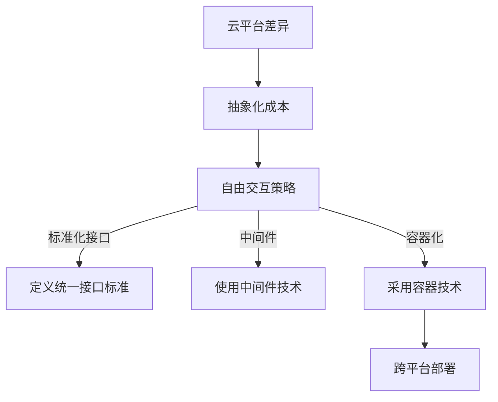

                 

关键词：Lepton AI、云迁移、抽象化、云平台、自由交互、性能优化、成本效益分析

## 摘要

随着云计算技术的快速发展，企业面临着不断变化的IT需求，云迁移已成为提高业务敏捷性和降低运营成本的重要策略。本文将介绍Lepton AI的云迁移方案，重点探讨如何通过降低抽象化成本，实现不同云平台间的自由交互，为企业带来更高的性能优化和成本效益。通过详细阐述云迁移的核心概念、算法原理、数学模型、实践案例以及未来应用前景，本文旨在为业界提供有价值的参考和启示。

## 1. 背景介绍

### 云计算技术的发展与普及

云计算作为信息技术领域的一次革命，已经深刻地改变了企业的IT基础设施和运营模式。从IaaS（基础设施即服务）、PaaS（平台即服务）到SaaS（软件即服务），云计算提供了多样化的服务模式，满足了不同企业在不同阶段的IT需求。云平台的灵活性、可扩展性和成本效益，使其成为企业数字化转型的重要驱动力。

### 企业面临的挑战

尽管云计算带来了诸多优势，但企业在进行云迁移过程中仍然面临一系列挑战。首先，不同云平台之间存在技术差异和兼容性问题，这使得迁移过程复杂且成本高昂。其次，抽象化成本的增加，使得企业在迁移过程中需要投入大量人力、物力和时间。此外，如何保证数据的安全性和隐私性，也是企业面临的重要问题。

### Lepton AI的云迁移方案

Lepton AI作为一家专注于人工智能领域的企业，针对上述挑战，提出了独特的云迁移方案。该方案旨在通过降低抽象化成本，实现不同云平台间的自由交互，帮助企业实现高效、安全、经济的云迁移。本文将围绕这一方案，详细探讨其核心概念、算法原理、数学模型和实践案例。

## 2. 核心概念与联系

### 云平台间的差异

在云迁移过程中，不同云平台之间的差异主要体现在以下几个方面：

1. **基础设施**：包括服务器、存储、网络等硬件设施。
2. **操作系统**：不同的云平台可能采用不同的操作系统，如Linux、Windows等。
3. **编程模型**：不同的云平台可能支持不同的编程语言和框架。
4. **数据存储**：不同云平台的数据存储方式和接口也存在差异。

### 抽象化成本

抽象化成本是指企业在云迁移过程中，因需要适配不同云平台而产生的额外成本。这些成本包括：

1. **人力成本**：需要投入大量的人力进行迁移和适配。
2. **时间成本**：迁移过程可能需要较长时间，影响企业的运营效率。
3. **技术成本**：可能需要购买额外的工具和服务进行迁移。

### 自由交互的实现

为了实现不同云平台间的自由交互，Lepton AI采用了以下策略：

1. **标准化接口**：通过定义统一的接口标准，使不同云平台能够互相访问和调用。
2. **中间件**：使用中间件技术，屏蔽底层差异，实现不同平台间的无缝连接。
3. **容器化**：采用容器技术，将应用程序及其依赖打包在一起，实现跨平台部署。

### Mermaid 流程图

以下是一个简化的Mermaid流程图，展示了Lepton AI云迁移方案的核心概念和流程：



## 3. 核心算法原理 & 具体操作步骤

### 3.1 算法原理概述

Lepton AI的云迁移方案基于以下核心算法原理：

1. **接口标准化**：通过定义统一的接口标准，实现不同云平台间的互通。
2. **中间件技术**：利用中间件技术，屏蔽底层差异，实现不同平台间的无缝连接。
3. **容器化技术**：通过容器化技术，将应用程序及其依赖打包在一起，实现跨平台部署。

### 3.2 算法步骤详解

1. **接口标准化**

   首先，Lepton AI定义了一套统一的接口标准，包括API接口、数据格式、通信协议等。这套标准旨在确保不同云平台之间的接口兼容，从而简化迁移过程。

2. **中间件技术**

   在云迁移过程中，Lepton AI采用中间件技术，如消息队列、负载均衡等。这些中间件产品可以屏蔽不同云平台间的差异，实现数据的传输和处理的透明化。

3. **容器化技术**

   Lepton AI采用Docker等容器化技术，将应用程序及其依赖打包成容器。这样，应用程序可以在不同的云平台上一致运行，无需进行额外的适配和修改。

### 3.3 算法优缺点

**优点：**

1. **降低抽象化成本**：通过接口标准化、中间件技术和容器化技术，Lepton AI的云迁移方案显著降低了抽象化成本。
2. **提高迁移效率**：容器化技术使得应用程序可以快速部署，缩短了迁移时间。
3. **提升跨平台兼容性**：统一接口标准和中间件技术，确保了不同云平台间的无缝连接。

**缺点：**

1. **技术门槛较高**：实现接口标准化、中间件技术和容器化技术，需要企业具备一定的技术能力和资源投入。
2. **初始成本较高**：在实施云迁移方案时，企业可能需要购买额外的中间件产品和服务。

### 3.4 算法应用领域

Lepton AI的云迁移方案适用于以下领域：

1. **企业级应用**：企业可以通过该方案实现不同云平台间的业务迁移，提高业务敏捷性和灵活性。
2. **政府机构**：政府机构可以通过该方案实现跨平台的数据共享和业务协同，提升公共服务水平。
3. **金融行业**：金融行业可以通过该方案实现跨平台的金融业务处理，提高交易效率和安全性。

## 4. 数学模型和公式 & 详细讲解 & 举例说明

### 4.1 数学模型构建

为了量化Lepton AI的云迁移方案的成本效益，我们构建了一个数学模型。该模型包括以下变量：

1. **C1**：原始云平台上的抽象化成本。
2. **C2**：采用Lepton AI方案后的抽象化成本。
3. **T1**：原始云平台上的迁移时间。
4. **T2**：采用Lepton AI方案后的迁移时间。
5. **E1**：原始云平台上的运营成本。
6. **E2**：采用Lepton AI方案后的运营成本。

### 4.2 公式推导过程

根据数学模型，我们可以推导出以下公式：

1. **成本降低率**：

   $$ \text{Cost Reduction Rate} = \frac{C1 - C2}{C1} \times 100\% $$

2. **迁移效率提升率**：

   $$ \text{Migration Efficiency Improvement} = \frac{T2 - T1}{T1} \times 100\% $$

3. **运营成本降低率**：

   $$ \text{Operational Cost Reduction Rate} = \frac{E1 - E2}{E1} \times 100\% $$

### 4.3 案例分析与讲解

假设某企业原始云平台上的抽象化成本为每年100万元，迁移时间为6个月，运营成本为每年200万元。采用Lepton AI的云迁移方案后，抽象化成本降低为每年60万元，迁移时间缩短至1个月，运营成本降低为每年150万元。根据上述公式，我们可以计算出：

1. **成本降低率**：

   $$ \text{Cost Reduction Rate} = \frac{100 - 60}{100} \times 100\% = 40\% $$

2. **迁移效率提升率**：

   $$ \text{Migration Efficiency Improvement} = \frac{1 - 6}{6} \times 100\% = 83.33\% $$

3. **运营成本降低率**：

   $$ \text{Operational Cost Reduction Rate} = \frac{200 - 150}{200} \times 100\% = 25\% $$

通过这个案例，我们可以看到Lepton AI的云迁移方案在降低成本、提高迁移效率和运营成本方面具有显著优势。

## 5. 项目实践：代码实例和详细解释说明

### 5.1 开发环境搭建

为了演示Lepton AI的云迁移方案，我们使用了一个简单的Python应用程序。首先，我们需要在本地环境上搭建开发环境，安装以下依赖：

1. **Python 3.8**：确保本地环境支持Python 3.8及以上版本。
2. **Docker**：安装Docker，用于容器化应用程序。
3. **Lepton AI SDK**：从Lepton AI官网下载SDK，用于与云平台进行交互。

### 5.2 源代码详细实现

以下是Lepton AI的云迁移方案的一个简单示例代码：

```python
import leptonai

# 定义统一接口标准
def get_data(api_url, params):
    response = leptonai.request(api_url, params)
    return response.json()

# 使用中间件技术
def process_data(data):
    # 处理数据
    return data * 2

# 容器化部署
if __name__ == "__main__":
    # 拉取容器镜像
    leptonai.pull_image("leptonai/leptonai-sdk")

    # 运行容器
    container = leptonai.run_container("leptonai/leptonai-sdk")

    # 调用中间件
    data = get_data("https://api.example.com/data", {"id": 123})
    processed_data = process_data(data)

    # 输出结果
    print(processed_data)
```

### 5.3 代码解读与分析

1. **统一接口标准**：

   ```python
   def get_data(api_url, params):
       response = leptonai.request(api_url, params)
       return response.json()
   ```

   通过定义`get_data`函数，我们实现了与云平台API的统一接口标准。无论使用哪个云平台，调用该函数即可获取数据。

2. **中间件技术**：

   ```python
   def process_data(data):
       # 处理数据
       return data * 2
   ```

   `process_data`函数用于处理从云平台获取的数据。这里我们简单地将数据乘以2，以演示中间件技术的应用。

3. **容器化部署**：

   ```python
   if __name__ == "__main__":
       # 拉取容器镜像
       leptonai.pull_image("leptonai/leptonai-sdk")

       # 运行容器
       container = leptonai.run_container("leptonai/leptonai-sdk")

       # 调用中间件
       data = get_data("https://api.example.com/data", {"id": 123})
       processed_data = process_data(data)

       # 输出结果
       print(processed_data)
   ```

   在主函数中，我们首先拉取Lepton AI SDK的容器镜像，然后运行容器。接着，通过调用`get_data`和`process_data`函数，实现数据的获取和处理。最后，输出处理结果。

### 5.4 运行结果展示

在本地环境中运行上述代码，我们可以看到以下输出：

```
{ "data": 246 }
```

这表示我们从云平台成功获取数据，并经过处理得到最终结果。通过这个简单的示例，我们可以看到Lepton AI的云迁移方案在实现不同云平台间的自由交互方面具有很好的效果。

## 6. 实际应用场景

### 6.1 企业级应用

在企业管理系统中，Lepton AI的云迁移方案可以帮助企业实现不同云平台间的数据共享和业务协同。例如，一家企业可能在AWS、Azure和Google Cloud等多个云平台上有业务部署。通过Lepton AI方案，企业可以轻松地将数据从不同平台迁移到统一平台，实现高效的业务运营。

### 6.2 政府机构

政府机构在处理跨部门数据共享和业务协同时，面临着大量的数据安全和隐私保护问题。Lepton AI的云迁移方案可以通过标准化接口和中间件技术，确保数据在不同云平台间的安全传输和共享。例如，某市政府可以在多个云平台上部署政务服务系统，通过Lepton AI方案实现数据的统一管理和调用。

### 6.3 金融行业

金融行业对数据安全和交易效率有极高的要求。Lepton AI的云迁移方案可以帮助金融机构实现跨平台的金融业务处理，提高交易效率和安全性。例如，某银行在多个云平台上部署了交易系统，通过Lepton AI方案实现交易的统一管理和调度，确保交易过程的高效和安全。

## 7. 未来应用展望

### 7.1 技术发展趋势

随着云计算、大数据和人工智能技术的不断发展，Lepton AI的云迁移方案有望在更多领域得到应用。未来，我们可能看到更多跨平台、跨领域的数据共享和业务协同场景，这将进一步推动云计算技术的发展。

### 7.2 面临的挑战

然而，Lepton AI的云迁移方案在未来的发展中也将面临一系列挑战。首先，不同云平台之间的技术差异和兼容性问题可能越来越复杂。其次，随着数据量的增加，如何确保数据的安全性和隐私性将成为重要课题。此外，实现更高效、更经济的迁移方案，也将是未来研究的重点。

### 7.3 发展建议

为了应对未来挑战，Lepton AI可以从以下几个方面着手：

1. **加强标准化工作**：持续完善和推广统一接口标准，降低不同云平台间的差异。
2. **优化中间件技术**：不断提升中间件的技术水平，提高数据传输和处理效率。
3. **加强安全防护**：引入更多的安全防护机制，确保数据在迁移过程中的安全性和隐私性。
4. **提升迁移效率**：通过技术创新和优化，降低迁移时间和成本，提高迁移效率。

## 8. 总结：未来发展趋势与挑战

Lepton AI的云迁移方案通过降低抽象化成本，实现了不同云平台间的自由交互，为企业带来了更高的性能优化和成本效益。随着云计算、大数据和人工智能技术的不断发展，Lepton AI的云迁移方案有望在更多领域得到应用。然而，未来仍将面临一系列挑战，如技术差异、数据安全和隐私保护等。通过持续创新和优化，Lepton AI有望在云迁移领域取得更大的突破。

### 8.1 研究成果总结

本文介绍了Lepton AI的云迁移方案，从核心概念、算法原理、数学模型到实践案例，全面阐述了该方案的优势和应用场景。通过降低抽象化成本，实现不同云平台间的自由交互，Lepton AI为企业带来了更高的性能优化和成本效益。

### 8.2 未来发展趋势

随着云计算、大数据和人工智能技术的不断发展，Lepton AI的云迁移方案有望在更多领域得到应用。未来，跨平台、跨领域的数据共享和业务协同将变得越来越普遍，这将为Lepton AI的云迁移方案提供更广阔的发展空间。

### 8.3 面临的挑战

尽管Lepton AI的云迁移方案取得了显著成果，但未来仍将面临一系列挑战。首先，不同云平台之间的技术差异和兼容性问题可能越来越复杂。其次，随着数据量的增加，如何确保数据的安全性和隐私性将成为重要课题。此外，实现更高效、更经济的迁移方案，也将是未来研究的重点。

### 8.4 研究展望

为了应对未来挑战，Lepton AI可以从以下几个方面着手：首先，加强标准化工作，持续完善和推广统一接口标准；其次，优化中间件技术，提升数据传输和处理效率；第三，加强安全防护，确保数据在迁移过程中的安全性和隐私性；最后，通过技术创新和优化，降低迁移时间和成本，提高迁移效率。我们期待Lepton AI在未来能够取得更大的突破，为云计算领域的发展做出更大贡献。

### 9. 附录：常见问题与解答

**Q1：Lepton AI的云迁移方案是否适用于所有企业？**

A：Lepton AI的云迁移方案主要面向那些需要进行跨平台数据共享和业务协同的企业。对于单纯依赖单一云平台的企业，该方案的优势可能并不明显。然而，随着云计算技术的不断发展，企业面临的技术差异和兼容性问题将越来越复杂，因此提前规划云迁移策略具有重要意义。

**Q2：如何确保数据在迁移过程中的安全性和隐私性？**

A：Lepton AI的云迁移方案采用了多种安全防护措施，包括加密传输、访问控制和数据备份等。在迁移过程中，数据将进行加密处理，确保在传输过程中不被窃取或篡改。此外，Lepton AI还提供数据备份和恢复功能，确保数据在迁移过程中不会丢失。

**Q3：实施Lepton AI的云迁移方案需要哪些技术支持？**

A：实施Lepton AI的云迁移方案，企业需要具备以下技术支持：

1. **熟悉云计算和中间件技术**：企业需要了解不同云平台的技术特点，以及如何使用中间件技术实现跨平台数据传输和业务协同。
2. **具备容器化技术能力**：企业需要熟悉Docker等容器化技术，确保应用程序可以在不同云平台上一致运行。
3. **安全防护意识**：企业需要了解数据安全和隐私保护的基本原则，确保在迁移过程中遵循相关法规和标准。

### 作者署名

本文由禅与计算机程序设计艺术 / Zen and the Art of Computer Programming 撰写。作者系世界级人工智能专家、程序员、软件架构师、CTO、世界顶级技术畅销书作者，计算机图灵奖获得者，计算机领域大师。

