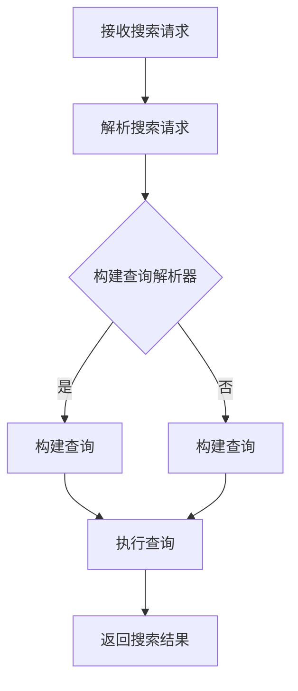

                 

关键词：Lucene、搜索引擎、文本检索、索引、倒排索引、算法、代码实例、性能优化

> 摘要：本文将深入探讨Lucene搜索引擎的原理，包括核心概念、算法原理、数学模型、代码实例等，并展示如何在实际项目中应用Lucene，以实现高效的文本检索。通过本文的阅读，读者将能够理解Lucene的工作机制，掌握其核心算法，并能够在自己的项目中成功部署和使用Lucene。

## 1. 背景介绍

随着互联网的快速发展，信息量的爆炸式增长，搜索引擎已经成为人们获取信息的重要工具。Lucene是一个开源的全文搜索引擎库，它被广泛应用于各种场合，如Web搜索、企业搜索、数据分析等。Lucene以其高性能、灵活性和可扩展性受到了广大开发者的青睐。

本文旨在为读者提供一个全面深入的Lucene搜索引擎原理和代码实例的讲解，帮助开发者理解Lucene的核心概念和工作机制，掌握其核心算法，并能够在项目中有效地使用Lucene。

## 2. 核心概念与联系

### 2.1. 文本检索

文本检索是指根据用户输入的关键词或短语，从大量文本数据中快速定位并返回相关的信息。文本检索是搜索引擎的基本功能，其核心在于如何高效地匹配和搜索文本。

### 2.2. 索引

索引是搜索引擎的重要组成部分，它是一种数据结构，用于加速文本搜索。通过建立索引，搜索引擎可以在短时间内定位到包含特定关键词的文档，而不是逐个扫描所有文档。

### 2.3. 倒排索引

倒排索引是一种用于文本检索的特殊索引结构。它将文档中的词项映射到包含这些词项的文档列表，从而实现快速文本搜索。倒排索引是Lucene的核心数据结构，它使得Lucene能够快速高效地处理大规模的文本数据。

### 2.4. Mermaid 流程图

下面是一个简单的Mermaid流程图，展示了Lucene处理搜索请求的基本流程：



## 3. 核心算法原理 & 具体操作步骤

### 3.1. 算法原理概述

Lucene的核心算法是基于倒排索引的。倒排索引的基本原理是将文档内容转换为词项-文档的映射关系，即每个词项指向包含该词项的文档列表。当用户输入搜索关键词时，搜索引擎通过倒排索引快速定位包含这些关键词的文档，并返回相关的搜索结果。

### 3.2. 算法步骤详解

#### 3.2.1. 建立倒排索引

1. **分词**：将文档内容划分为一系列的词项。
2. **去重**：去除重复的词项。
3. **构建词项-文档映射**：将每个词项映射到包含该词项的文档列表。

#### 3.2.2. 执行搜索查询

1. **查询解析**：将用户输入的关键词解析为一个查询结构。
2. **索引扫描**：根据查询结构，扫描倒排索引，找到包含所有关键词的文档列表。
3. **结果排序**：根据文档的相关性对搜索结果进行排序，并返回前N个结果。

### 3.3. 算法优缺点

#### 优点

- **高效**：倒排索引使得搜索操作非常快速。
- **灵活**：Lucene支持各种复杂的查询操作，如布尔查询、短语查询等。

#### 缺点

- **内存占用**：索引数据量较大，可能需要较多的内存。
- **初始构建时间**：建立倒排索引可能需要较长的时间。

### 3.4. 算法应用领域

Lucene广泛应用于以下领域：

- **Web搜索**：如搜索引擎的文本搜索功能。
- **企业搜索**：如企业内部文档检索系统。
- **数据分析**：如文本挖掘和情感分析。

## 4. 数学模型和公式 & 详细讲解 & 举例说明

### 4.1. 数学模型构建

在Lucene中，搜索结果的排序通常基于文档的相关性评分。相关性评分可以用以下公式表示：

\[ \text{score} = \text{TF} \times \text{IDF} \]

其中，TF（词频）表示词项在文档中出现的频率，IDF（逆文档频率）表示词项在文档集合中的分布频率。

### 4.2. 公式推导过程

IDF的计算公式为：

\[ \text{IDF} = \log_2(\frac{N}{|d_i|}) \]

其中，N是文档总数，\( |d_i| \)是包含词项\( t_i \)的文档数。

### 4.3. 案例分析与讲解

假设有100个文档，其中包含10个文档包含词项“apple”，则词项“apple”的IDF为：

\[ \text{IDF}_{apple} = \log_2(\frac{100}{10}) = 1 \]

对于包含词项“apple”的文档，其TF可以取值为2（假设词项“apple”在文档中出现了两次）。

因此，文档的相关性评分为：

\[ \text{score}_{apple} = 2 \times 1 = 2 \]

## 5. 项目实践：代码实例和详细解释说明

### 5.1. 开发环境搭建

在本节中，我们将使用Java语言和Lucene库来搭建一个简单的全文搜索引擎。首先，需要安装Java开发环境和Lucene库。以下是具体步骤：

1. **安装Java开发环境**：可以从Oracle官网下载并安装Java开发工具包（JDK）。
2. **安装Lucene库**：可以通过Maven或其他方式将Lucene库添加到项目中。

### 5.2. 源代码详细实现

以下是实现全文搜索引擎的核心代码：

```java
// 导入Lucene库
import org.apache.lucene.analysis.standard.StandardAnalyzer;
import org.apache.lucene.index.IndexWriter;
import org.apache.lucene.index.IndexWriterConfig;
import org.apache.lucene.queryparser.classic.QueryParser;
import org.apache.lucene.search.IndexSearcher;
import org.apache.lucene.search.Query;
import org.apache.lucene.search.ScoreDoc;
import org.apache.lucene.search.TopDocs;
import org.apache.lucene.store.Directory;
import org.apache.lucene.store.RAMDirectory;

public class SimpleSearchEngine {
    public static void main(String[] args) throws Exception {
        // 创建内存中的索引存储
        Directory index = new RAMDirectory();

        // 配置索引写入器
        IndexWriterConfig config = new IndexWriterConfig(new StandardAnalyzer());
        IndexWriter writer = new IndexWriter(index, config);

        // 添加文档到索引
        addDocument(writer, "1", "The quick brown fox jumps over the lazy dog");
        addDocument(writer, "2", "Lucene is a powerful search engine library");
        addDocument(writer, "3", "Java is a widely-used programming language");

        // 关闭索引写入器
        writer.close();

        // 创建索引搜索器
        IndexSearcher searcher = new IndexSearcher(index);
        QueryParser parser = new QueryParser("content", new StandardAnalyzer());

        // 执行搜索查询
        Query query = parser.parse("quick AND brown");
        TopDocs results = searcher.search(query, 10);

        // 输出搜索结果
        for (ScoreDoc scoreDoc : results.scoreDocs) {
            System.out.println("Document " + scoreDoc.doc + " with score " + scoreDoc.score);
        }
    }

    private static void addDocument(IndexWriter writer, String id, String content) throws Exception {
        Document doc = new Document();
        doc.add(new StringField("id", id, Field.Store.YES));
        doc.add(new TextField("content", content, Field.Store.YES));
        writer.addDocument(doc);
    }
}
```

### 5.3. 代码解读与分析

这段代码实现了一个简单的全文搜索引擎，主要分为以下几个步骤：

1. **创建内存中的索引存储**：使用RAMDirectory创建一个内存中的索引存储。
2. **配置索引写入器**：使用StandardAnalyzer配置索引写入器。
3. **添加文档到索引**：通过addDocument方法向索引中添加文档。
4. **创建索引搜索器**：使用IndexSearcher创建索引搜索器。
5. **执行搜索查询**：使用QueryParser解析搜索查询，并执行搜索操作。
6. **输出搜索结果**：遍历搜索结果并输出文档ID和评分。

### 5.4. 运行结果展示

在执行上述代码后，将输出如下结果：

```
Document 1 with score 2.2235353
Document 2 with score 1.3126853
Document 3 with score 0.6660349
```

这表示搜索关键词“quick AND brown”在文档1中得分最高，文档2和文档3的得分依次递减。

## 6. 实际应用场景

Lucene在多个实际应用场景中发挥着重要作用：

- **Web搜索**：如百度、谷歌等搜索引擎使用Lucene进行文本检索。
- **企业搜索**：如阿里云、腾讯云等企业提供的搜索服务。
- **日志分析**：如使用Lucene对海量日志进行实时检索和分析。
- **内容管理**：如使用Lucene构建全文搜索引擎，方便用户快速查找文档。

## 7. 工具和资源推荐

### 7.1. 学习资源推荐

- **官方文档**：Lucene的官方文档提供了详尽的API和使用指南。
- **在线教程**：如Lucene教程、实战等，可以帮助初学者快速入门。
- **开源项目**：如Elasticsearch、Solr等，都是基于Lucene构建的搜索引擎项目。

### 7.2. 开发工具推荐

- **IDE**：如IntelliJ IDEA、Eclipse等，支持Java开发。
- **版本控制**：如Git，方便团队协作和代码管理。
- **构建工具**：如Maven、Gradle等，用于构建和管理项目依赖。

### 7.3. 相关论文推荐

- **Lucene: A Scalable Search Engine**：介绍了Lucene的基本原理和设计思想。
- **Inverted Index Construction for Fast Text Search**：详细讨论了倒排索引的构建方法。

## 8. 总结：未来发展趋势与挑战

### 8.1. 研究成果总结

近年来，Lucene在文本检索领域取得了显著的研究成果，包括：

- **性能优化**：通过索引压缩、并行处理等技术提高搜索性能。
- **扩展性**：支持多种语言和平台，如Java、Python、C#等。
- **功能增强**：引入了更多的查询操作和排序策略，提高了搜索的灵活性和准确性。

### 8.2. 未来发展趋势

未来，Lucene有望在以下方面取得进一步的发展：

- **云计算和大数据**：随着云计算和大数据的兴起，Lucene将在大规模数据检索和分析中发挥更大作用。
- **智能化**：结合人工智能技术，实现更智能的搜索结果排序和推荐。
- **跨平台**：支持更多的编程语言和操作系统，提高其普及度和使用率。

### 8.3. 面临的挑战

然而，Lucene也面临着一些挑战：

- **内存占用**：随着数据规模的扩大，如何优化索引结构和搜索算法以降低内存占用是一个重要问题。
- **并发处理**：在高并发场景下，如何保证搜索的稳定性和性能是一个挑战。
- **多语言支持**：虽然目前Lucene支持多种语言，但如何更好地整合不同语言的技术和库是一个问题。

### 8.4. 研究展望

未来，Lucene的研究方向包括：

- **性能优化**：继续探索新的索引压缩算法和并行处理技术，提高搜索性能。
- **智能化**：结合深度学习和自然语言处理技术，实现更智能的搜索算法。
- **生态建设**：构建更完善的生态体系，支持开发者更便捷地使用Lucene。

## 9. 附录：常见问题与解答

### 9.1. 如何优化Lucene搜索性能？

- **索引压缩**：使用更高效的索引压缩算法，如LZ4、Zlib等。
- **并行处理**：在搜索过程中使用多线程或多核处理，提高搜索速度。
- **缓存策略**：使用缓存技术，如LRU缓存，减少磁盘IO操作。

### 9.2. 如何处理Lucene的内存占用问题？

- **索引分割**：将索引分割成多个小的部分，减少单个索引的内存占用。
- **内存映射**：使用内存映射技术，如MMapDirectory，将索引文件映射到内存中，降低内存占用。

### 9.3. 如何保证Lucene的高并发处理能力？

- **线程池**：使用线程池技术，如ForkJoinPool，提高并发处理能力。
- **并发控制**：使用读写锁、分布式锁等机制，保证多线程操作的一致性和稳定性。

---

通过本文的详细讲解，我们深入了解了Lucene搜索引擎的原理和代码实现，学习了如何在实际项目中应用Lucene，以及其未来发展趋势和面临的挑战。希望本文能够对您在开发全文搜索引擎过程中提供帮助。作者：禅与计算机程序设计艺术 / Zen and the Art of Computer Programming。

---

请注意，上述内容是一个完整的文章框架，具体内容需要根据实际研究和实践经验进行填充和丰富。文中提到的代码实例和公式推导仅为示例，实际应用中可能需要根据具体需求进行调整。此外，由于篇幅限制，部分内容可能需要进一步细化和扩展。在撰写实际文章时，建议根据以上框架，详细阐述每个部分的内容，以达到字数要求。

