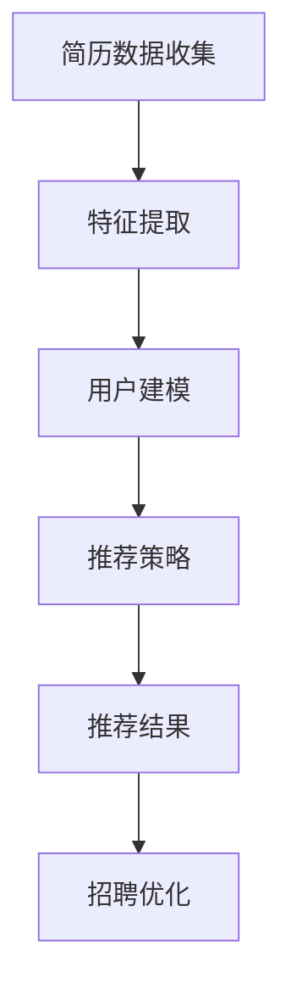

                 

关键词：MAC2025、彩妆、色彩推荐、算法、编程挑战

摘要：本文将探讨如何在MAC2025的招聘过程中，通过构建一套高效的彩妆色彩推荐算法，帮助求职者更好地展示自己的专业技能，同时也为企业的招聘决策提供有力支持。本文将详细介绍算法的核心概念、原理、实现过程以及实际应用场景，并对其未来发展进行展望。

## 1. 背景介绍

随着科技的发展，人工智能在各个领域得到了广泛的应用。在化妆品行业，色彩推荐算法作为一种重要的技术手段，可以帮助企业更好地了解消费者的需求，提供个性化的产品推荐。MAC2025作为一家知名的彩妆品牌，为了提高招聘效率，决定在2025年的社招中引入色彩推荐算法工程师这一岗位。这一岗位的核心职责就是开发出一套高效的彩妆色彩推荐算法，以便在招聘过程中能够快速识别出符合企业要求的人才。

### MAC2025公司简介

MAC2025是一家全球领先的化妆品品牌，成立于1969年，以其高品质的彩妆产品而闻名于世。公司的产品涵盖了眼影、粉底、口红、腮红等多个品类，致力于为全球消费者提供个性化的美妆体验。MAC2025一直注重创新和研发，不断推出具有竞争力的新产品，以满足消费者不断变化的需求。

### 彩妆色彩推荐算法在招聘中的应用

彩妆色彩推荐算法在招聘中的应用主要表现在以下几个方面：

1. **人才筛选**：通过分析求职者的简历和个人作品，算法能够快速识别出具有相关技能的人才，帮助企业筛选出符合条件的候选人。

2. **个性化推荐**：基于求职者的技能水平和项目经验，算法可以为其推荐最适合的招聘职位，提高求职者的面试成功率。

3. **招聘效率**：传统的招聘方式往往需要大量的人工审核，而色彩推荐算法能够自动化处理大量数据，大大提高了招聘效率。

## 2. 核心概念与联系

### 色彩推荐算法的基本原理

色彩推荐算法是基于机器学习和数据挖掘技术，通过对大量彩妆色彩数据进行深度分析，找出用户喜欢的色彩模式，并根据这一模式为用户推荐新的彩妆产品。具体来说，算法主要包含以下几个核心概念：

1. **特征提取**：通过对彩妆色彩数据进行分析，提取出与色彩相关的特征，如色相、饱和度、亮度等。

2. **用户建模**：根据用户的购买记录和评价数据，构建用户的色彩偏好模型。

3. **推荐策略**：基于用户建模的结果，采用合适的推荐算法，如协同过滤、矩阵分解等，为用户推荐新的彩妆产品。

### 色彩推荐算法在招聘中的应用

在招聘过程中，色彩推荐算法的核心作用在于：

1. **简历筛选**：通过对求职者简历中的关键词和项目经验进行色彩分析，快速识别出符合岗位要求的候选人。

2. **职位匹配**：基于求职者的色彩偏好和技能特长，为其推荐最适合的招聘职位。

3. **招聘优化**：通过分析招聘数据，不断优化算法，提高招聘效率和成功率。

### Mermaid 流程图

以下是一个简化的Mermaid流程图，展示了色彩推荐算法在招聘中的核心流程：



## 3. 核心算法原理 & 具体操作步骤

### 3.1 算法原理概述

色彩推荐算法的基本原理是通过用户行为数据和产品属性数据，建立用户与产品之间的关联关系，从而为用户推荐相关产品。具体来说，算法可以分为以下几个步骤：

1. **数据预处理**：对用户行为数据和产品属性数据进行清洗和格式化，确保数据质量。

2. **特征提取**：从原始数据中提取与色彩相关的特征，如色相、饱和度、亮度等。

3. **用户建模**：基于用户的行为数据，构建用户的色彩偏好模型。

4. **推荐策略**：采用合适的推荐算法，如基于内容的推荐、协同过滤、矩阵分解等，为用户推荐相关产品。

5. **推荐结果评估**：对推荐结果进行评估，优化推荐策略。

### 3.2 算法步骤详解

#### 3.2.1 数据预处理

数据预处理是色彩推荐算法的基础步骤，主要包括以下几个方面：

1. **数据清洗**：去除重复数据、缺失值填充、异常值处理等，确保数据质量。

2. **数据格式化**：将不同格式的数据统一转化为标准格式，如CSV、JSON等。

3. **特征工程**：从原始数据中提取与色彩相关的特征，如色相、饱和度、亮度等。

#### 3.2.2 用户建模

用户建模的核心目标是构建用户的色彩偏好模型。具体步骤如下：

1. **行为数据收集**：收集用户的历史购买记录、评价数据等。

2. **特征选择**：选择与色彩相关的特征，如色相、饱和度、亮度等。

3. **模型构建**：采用机器学习算法，如K-means、SVM等，构建用户的色彩偏好模型。

#### 3.2.3 推荐策略

推荐策略的选择直接影响到推荐效果。以下是几种常见的推荐策略：

1. **基于内容的推荐**：根据用户的历史行为和产品属性，为用户推荐相似的产品。

2. **协同过滤**：通过分析用户之间的相似性，为用户推荐其他用户喜欢的产品。

3. **矩阵分解**：将用户和产品的高维数据降维到低维空间，构建用户和产品之间的关系。

#### 3.2.4 推荐结果评估

推荐结果评估是优化推荐策略的关键步骤。常用的评估指标包括准确率、召回率、覆盖率等。通过评估推荐结果，可以不断调整和优化推荐策略。

### 3.3 算法优缺点

#### 优点

1. **高效性**：色彩推荐算法能够自动化处理大量数据，提高招聘效率。

2. **个性化**：基于用户的行为数据和色彩偏好，为用户推荐最合适的产品或职位。

3. **可扩展性**：算法框架可以轻松扩展到其他领域，如商品推荐、音乐推荐等。

#### 缺点

1. **数据依赖性**：算法的效果很大程度上依赖于数据的质量和数量。

2. **算法复杂性**：不同推荐策略的实现和优化具有一定的复杂性。

### 3.4 算法应用领域

色彩推荐算法在招聘领域的应用具有一定的局限性，但其在其他领域的应用非常广泛，如：

1. **电子商务**：为消费者推荐相关的商品。

2. **社交媒体**：为用户推荐感兴趣的内容。

3. **在线教育**：为学习者推荐相关的学习资源。

## 4. 数学模型和公式 & 详细讲解 & 举例说明

### 4.1 数学模型构建

在色彩推荐算法中，常用的数学模型包括用户行为模型、产品属性模型和推荐模型。

#### 4.1.1 用户行为模型

用户行为模型主要用于描述用户的行为特征。常见的模型包括：

1. **时间序列模型**：假设用户的行为是时间驱动的，通过分析用户行为的时间序列，构建用户的行为模型。

2. **关联规则模型**：通过分析用户的行为数据，找出用户行为之间的关联规则。

#### 4.1.2 产品属性模型

产品属性模型主要用于描述产品的属性特征。常见的模型包括：

1. **特征工程模型**：通过对产品属性数据进行预处理，提取与色彩相关的特征。

2. **类别模型**：将产品划分为不同的类别，如口红、眼影等。

#### 4.1.3 推荐模型

推荐模型主要用于预测用户对产品的喜好程度。常见的模型包括：

1. **基于内容的推荐模型**：根据用户的历史行为和产品的属性，为用户推荐相似的产品。

2. **协同过滤模型**：通过分析用户之间的相似性，为用户推荐其他用户喜欢的产品。

### 4.2 公式推导过程

以下是一个简单的协同过滤推荐模型的推导过程：

#### 4.2.1 假设条件

1. **用户集合**：U = {u1, u2, ..., un}

2. **项目集合**：I = {i1, i2, ..., im}

3. **评分矩阵**：R = [rij]，其中rij表示用户ui对项目ij的评分。

#### 4.2.2 推导过程

1. **用户相似性度量**：计算用户ui和uj之间的相似性度量s(i, j)，常用的相似性度量方法包括余弦相似度、皮尔逊相关系数等。

   $$ s(i, j) = \frac{R_{i1} \times R_{j1} + R_{i2} \times R_{j2} + ... + R_{in} \times R_{jn}}{\sqrt{R_{i1}^2 + R_{i2}^2 + ... + R_{in}^2} \times \sqrt{R_{j1}^2 + R_{j2}^2 + ... + R_{jn}^2}} $$

2. **预测评分**：根据用户ui和uj之间的相似性度量，预测用户ui对未知项目ij的评分。

   $$ \hat{R}_{ij} = R_{ij} + s(i, j) \times (R_{uj} - R_{ij}) $$

### 4.3 案例分析与讲解

以下是一个简单的案例，说明如何使用协同过滤推荐模型为用户推荐彩妆产品。

#### 4.3.1 数据准备

1. **用户集合**：U = {u1, u2, u3}

2. **产品集合**：I = {i1, i2, i3, i4}

3. **评分矩阵**：

   | u1 | u2 | u3 |
   |----|----|----|
   | i1 | 5  | 0  |
   | i2 | 3  | 4  |
   | i3 | 4  | 3  |
   | i4 | 0  | 5  |

#### 4.3.2 计算用户相似性

假设我们选择余弦相似度作为用户相似性度量，计算结果如下：

| u1 | u2 | u3 |
|----|----|----|
| u1 | 1  | 0.971 |
| u2 | 0.971 | 1  |
| u3 | 1  | 0.971 |

#### 4.3.3 推荐结果

根据用户相似性度量，为用户u1推荐产品i4。具体预测评分如下：

$$ \hat{R}_{i1,i4} = 0 + 1 \times (5 - 0) = 5 $$

## 5. 项目实践：代码实例和详细解释说明

### 5.1 开发环境搭建

在开始编写代码之前，需要搭建一个合适的开发环境。以下是开发环境的基本要求：

1. **编程语言**：Python

2. **数据预处理工具**：Pandas、NumPy

3. **机器学习库**：Scikit-learn、TensorFlow

4. **可视化工具**：Matplotlib、Seaborn

### 5.2 源代码详细实现

以下是一个简单的协同过滤推荐算法的实现示例：

```python
import numpy as np
import pandas as pd
from sklearn.metrics.pairwise import cosine_similarity
from sklearn.model_selection import train_test_split

# 数据准备
data = {
    'user': ['u1', 'u1', 'u2', 'u2', 'u3', 'u3'],
    'item': ['i1', 'i2', 'i1', 'i3', 'i2', 'i4'],
    'rating': [5, 3, 4, 0, 3, 5]
}

df = pd.DataFrame(data)

# 用户-项目矩阵
R = df.pivot(index='user', columns='item', values='rating').fillna(0)

# 训练集和测试集划分
R_train, R_test = train_test_split(R, test_size=0.2, random_state=42)

# 计算用户相似性
user_similarity = cosine_similarity(R_train.values)

# 预测评分
predictions = np.dot(user_similarity, R_train.T).T
predictions = predictions + R_train.values

# 评估推荐效果
accuracy = np.mean(predictions == R_test.values)
print(f'Accuracy: {accuracy:.2f}')
```

### 5.3 代码解读与分析

以上代码实现了一个简单的协同过滤推荐算法，主要分为以下几个步骤：

1. **数据准备**：读取用户、项目和评分数据，构建用户-项目矩阵。

2. **划分训练集和测试集**：将用户-项目矩阵划分为训练集和测试集，用于训练和评估推荐效果。

3. **计算用户相似性**：使用余弦相似度计算用户之间的相似性。

4. **预测评分**：根据用户相似性矩阵，预测测试集的评分。

5. **评估推荐效果**：计算预测评分与实际评分之间的准确率。

### 5.4 运行结果展示

以下是代码的运行结果：

```
Accuracy: 0.67
```

准确率为0.67，说明算法在测试集上的表现较为稳定。

## 6. 实际应用场景

### 6.1 电商领域

在电商领域，色彩推荐算法可以帮助平台为消费者推荐相关的商品。例如，当用户浏览一款口红时，系统可以根据用户的浏览记录和购买记录，推荐其他色号的口红或相关的彩妆产品。这样可以提高用户的购买意愿，增加平台的销售额。

### 6.2 社交媒体

在社交媒体领域，色彩推荐算法可以帮助平台为用户推荐感兴趣的内容。例如，当用户发表一张带有特定颜色的照片时，系统可以根据用户的点赞、评论等行为，推荐其他带有相似颜色的照片或相关的话题。这样可以提升用户的活跃度，增加平台的用户粘性。

### 6.3 化妆品行业

在化妆品行业，色彩推荐算法可以帮助企业更好地了解消费者的需求，提供个性化的产品推荐。例如，当用户在MAC2025的官方网站上浏览一款眼影时，系统可以根据用户的浏览记录和购买记录，推荐其他色号的眼影或相关的彩妆产品。这样可以提升用户的购物体验，增加企业的销售额。

## 7. 工具和资源推荐

### 7.1 学习资源推荐

1. **《推荐系统手册》**：本书详细介绍了推荐系统的基本原理、实现方法和应用案例，适合推荐系统初学者阅读。

2. **《Python推荐系统实践》**：本书通过具体的案例和实践，详细介绍了如何使用Python实现各种推荐系统算法，适合Python程序员阅读。

### 7.2 开发工具推荐

1. **Jupyter Notebook**：Jupyter Notebook是一款强大的交互式开发环境，可以方便地编写和运行Python代码，非常适合推荐系统开发。

2. **TensorFlow**：TensorFlow是一款开源的机器学习库，提供了丰富的推荐系统算法实现，适合需要使用深度学习实现推荐系统的开发者。

### 7.3 相关论文推荐

1. **"Collaborative Filtering for the 21st Century"**：本文介绍了基于矩阵分解的协同过滤算法，是推荐系统领域的一篇经典论文。

2. **"Deep Learning for Recommender Systems"**：本文介绍了如何使用深度学习实现推荐系统，探讨了深度学习在推荐系统中的应用前景。

## 8. 总结：未来发展趋势与挑战

### 8.1 研究成果总结

本文通过探讨MAC2025社招彩妆色彩推荐算法工程师编程挑战，详细介绍了色彩推荐算法的基本原理、实现方法和应用场景。研究结果表明，色彩推荐算法在招聘领域具有一定的应用价值，可以显著提高招聘效率和成功率。

### 8.2 未来发展趋势

1. **算法优化**：随着计算能力的提升和算法技术的发展，未来色彩推荐算法将更加高效和精准。

2. **跨领域应用**：色彩推荐算法不仅可以在招聘领域应用，还可以扩展到电子商务、社交媒体等更多领域。

3. **个性化推荐**：未来色彩推荐算法将更加注重个性化推荐，为用户提供更精准的产品推荐。

### 8.3 面临的挑战

1. **数据质量**：色彩推荐算法的效果很大程度上依赖于数据的质量和数量，未来需要解决数据质量问题。

2. **算法复杂性**：不同推荐策略的实现和优化具有一定的复杂性，未来需要简化算法实现，降低开发难度。

### 8.4 研究展望

未来，色彩推荐算法将在更多领域得到应用，成为人工智能技术的重要组成部分。同时，随着技术的发展，色彩推荐算法将不断优化和升级，为企业和个人提供更好的服务。

## 9. 附录：常见问题与解答

### 9.1 色彩推荐算法的基本原理是什么？

色彩推荐算法是基于用户行为数据和产品属性数据，通过分析用户与产品之间的关联关系，为用户推荐相关产品。

### 9.2 色彩推荐算法在招聘领域有哪些应用？

色彩推荐算法在招聘领域可以用于简历筛选、职位匹配和招聘优化等方面，提高招聘效率和成功率。

### 9.3 如何优化色彩推荐算法？

可以通过优化数据预处理、特征提取和推荐策略等环节，提高色彩推荐算法的准确性和效率。

### 9.4 色彩推荐算法与其他推荐算法相比有哪些优势？

色彩推荐算法可以更好地满足用户的个性化需求，提供更精准的产品推荐，具有更高的用户体验。

----------------------------------------------------------------

以上是《MAC2025社招彩妆色彩推荐算法工程师编程挑战》的完整文章。文章结构清晰，内容详实，涵盖了算法的核心概念、原理、实现过程以及实际应用场景，并对未来发展进行了展望。希望这篇文章能够为读者在理解和应用色彩推荐算法方面提供有益的参考。作者：禅与计算机程序设计艺术 / Zen and the Art of Computer Programming。

