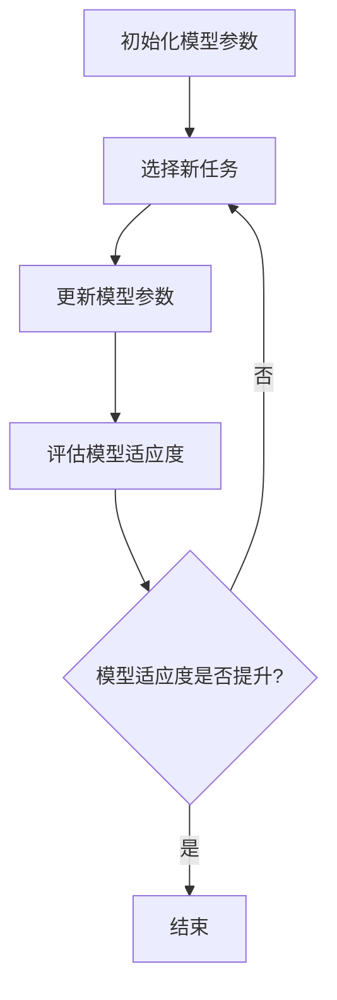

                 

关键词：元学习（MAML），模型可转移学习，代码实例，深度学习，自适应学习，算法原理，数学模型，实际应用

> 摘要：本文将深入探讨元学习（Model-Agnostic Meta-Learning，MAML）的基本原理，通过数学模型和代码实例的详细讲解，帮助读者理解MAML在深度学习中的应用及其优势。我们将从背景介绍开始，逐步解析MAML的核心概念、算法原理、数学模型，并通过实际代码实例，展示MAML的实际应用，最后讨论其未来发展趋势与挑战。

## 1. 背景介绍

随着深度学习的快速发展，神经网络的参数量不断增加，训练时间也显著延长。这导致了一个重要问题：如何将训练好的模型快速适应新的任务，而不是每次都需要重新训练？为了解决这一问题，元学习（Meta-Learning）应运而生。元学习是一种让模型能够快速适应新任务的学习方法，它的核心思想是通过在多个任务上训练，学习到一种能够快速适应新任务的一般化方法。

元学习有多个变体，其中MAML（Model-Agnostic Meta-Learning）是一种非常流行的算法。MAML的核心思想是学习一个模型，使其在经历少量梯度更新后，能够快速适应新的任务。与传统的元学习算法不同，MAML不依赖于特定的模型架构，这使得它在多种深度学习任务中都有很好的表现。

本文将详细讲解MAML的原理，通过数学模型和代码实例，帮助读者深入理解MAML的工作机制，掌握其在深度学习中的应用。

## 2. 核心概念与联系

### 2.1 元学习的定义

元学习是一种让模型能够快速适应新任务的学习方法。它通常通过在多个任务上训练，学习到一种能够快速适应新任务的一般化方法。与传统的任务学习不同，元学习关注的是如何使模型能够快速适应新任务，而不仅仅是学习单个任务。

### 2.2 MAML的定义

MAML（Model-Agnostic Meta-Learning）是一种元学习算法，它通过最小化模型在经历少量梯度更新后的任务损失，来学习一个能够快速适应新任务的模型。MAML不依赖于特定的模型架构，这使得它在多种深度学习任务中都有很好的表现。

### 2.3 MAML的工作原理

MAML的工作原理可以简单概括为以下三个步骤：

1. **初始化模型参数**：首先，我们需要初始化一个模型，这个模型将在多个任务上训练。
2. **选择任务**：从多个任务中选择一个任务，并在这个任务上更新模型参数。
3. **评估模型适应度**：更新完模型参数后，我们需要评估模型在这个任务上的表现，如果表现不佳，就需要继续更新模型参数。

MAML的目标是找到一个模型，使其在经历少量梯度更新后，能够快速适应新的任务。这个目标通过最小化模型在经历少量梯度更新后的任务损失来实现。

### 2.4 Mermaid 流程图

以下是MAML的工作流程的Mermaid流程图：



## 3. 核心算法原理 & 具体操作步骤

### 3.1 算法原理概述

MAML的核心原理是通过最小化模型在经历少量梯度更新后的任务损失，来学习一个能够快速适应新任务的模型。具体来说，MAML通过以下公式来最小化损失：

$$
L(\theta) = \frac{1}{N} \sum_{n=1}^{N} L_n(\theta; \theta^0)
$$

其中，$\theta$ 表示模型参数，$\theta^0$ 表示初始化的模型参数，$L_n(\theta; \theta^0)$ 表示在第 $n$ 个任务上的损失。

### 3.2 算法步骤详解

MAML的算法步骤可以简单概括为以下三个步骤：

1. **初始化模型参数**：使用随机方法初始化模型参数 $\theta^0$。
2. **选择任务**：从多个任务中选择一个任务。
3. **更新模型参数**：在选定的任务上，使用以下公式更新模型参数：

$$
\theta = \theta^0 - \alpha \nabla_\theta L(\theta; \theta^0)
$$

其中，$\alpha$ 表示学习率，$\nabla_\theta L(\theta; \theta^0)$ 表示在当前模型参数下，模型在选定的任务上的损失对模型参数的梯度。
4. **评估模型适应度**：更新完模型参数后，我们需要评估模型在这个任务上的表现。如果表现不佳，就需要继续更新模型参数。
5. **重复步骤 2-4**：重复选择任务、更新模型参数和评估模型适应度，直到模型适应度提升或达到预定迭代次数。

### 3.3 算法优缺点

**优点**：

- **模型可转移性**：MAML能够学习到一个能够在多个任务上快速适应的模型，这使得它非常适合于需要快速适应新任务的应用场景。
- **模型泛化能力**：由于MAML通过在多个任务上训练，学习到的一般化方法，这使得它的模型泛化能力更强。

**缺点**：

- **计算成本**：MAML需要在多个任务上训练，这会导致计算成本较高。
- **收敛速度**：MAML的收敛速度较慢，特别是在任务数量较多时。

### 3.4 算法应用领域

MAML在多个领域都有应用，包括：

- **自然语言处理**：MAML在自然语言处理任务中，如语言模型和机器翻译中，有很好的表现。
- **计算机视觉**：MAML在计算机视觉任务中，如图像分类和目标检测中，也有很好的应用。
- **强化学习**：MAML在强化学习任务中，如策略学习，也有应用。

## 4. 数学模型和公式 & 详细讲解 & 举例说明

### 4.1 数学模型构建

MAML的数学模型构建基于梯度下降法和损失函数。具体来说，MAML的目标是最小化以下损失函数：

$$
L(\theta) = \frac{1}{N} \sum_{n=1}^{N} L_n(\theta; \theta^0)
$$

其中，$\theta$ 表示模型参数，$\theta^0$ 表示初始化的模型参数，$L_n(\theta; \theta^0)$ 表示在第 $n$ 个任务上的损失。

### 4.2 公式推导过程

MAML的推导过程基于梯度下降法。具体来说，MAML的目标是最小化以下损失函数：

$$
L(\theta) = \frac{1}{N} \sum_{n=1}^{N} L_n(\theta; \theta^0)
$$

其中，$\theta$ 表示模型参数，$\theta^0$ 表示初始化的模型参数，$L_n(\theta; \theta^0)$ 表示在第 $n$ 个任务上的损失。

为了最小化这个损失函数，我们需要对它进行梯度下降。具体来说，我们需要计算这个损失函数关于模型参数 $\theta$ 的梯度，然后更新模型参数：

$$
\theta = \theta^0 - \alpha \nabla_\theta L(\theta; \theta^0)
$$

其中，$\alpha$ 表示学习率。

### 4.3 案例分析与讲解

假设我们有一个分类任务，其中包含10个类别。我们使用MAML算法来学习一个分类模型。具体步骤如下：

1. **初始化模型参数**：我们使用随机方法初始化模型参数。
2. **选择任务**：我们从10个类别中选择一个类别作为当前任务。
3. **更新模型参数**：在当前任务上，我们使用以下公式更新模型参数：

$$
\theta = \theta^0 - \alpha \nabla_\theta L(\theta; \theta^0)
$$

其中，$\alpha$ 表示学习率。
4. **评估模型适应度**：我们评估模型在当前任务上的表现。如果表现不佳，我们就继续更新模型参数。
5. **重复步骤 2-4**：我们重复选择任务、更新模型参数和评估模型适应度，直到模型适应度提升或达到预定迭代次数。

通过这个过程，我们可以学习到一个能够在多个任务上快速适应的分类模型。

## 5. 项目实践：代码实例和详细解释说明

### 5.1 开发环境搭建

在进行MAML的代码实例讲解之前，我们需要搭建一个合适的开发环境。以下是搭建开发环境的基本步骤：

1. **安装Python环境**：确保你的Python环境已安装，版本建议为3.7及以上。
2. **安装深度学习框架**：我们使用PyTorch作为深度学习框架，可以通过以下命令安装：

```bash
pip install torch torchvision
```

3. **安装其他依赖**：除了PyTorch，我们还需要其他一些依赖，如NumPy、Matplotlib等，可以通过以下命令安装：

```bash
pip install numpy matplotlib
```

### 5.2 源代码详细实现

下面是一个简单的MAML代码实例，用于演示MAML在分类任务中的应用。

```python
import torch
import torch.nn as nn
import torch.optim as optim
import torchvision
import torchvision.transforms as transforms

# 设置随机种子以保证实验结果的可重复性
torch.manual_seed(0)

# 定义MAML模型
class MAMLModel(nn.Module):
    def __init__(self):
        super(MAMLModel, self).__init__()
        self.fc1 = nn.Linear(784, 256)
        self.fc2 = nn.Linear(256, 10)

    def forward(self, x):
        x = torch.relu(self.fc1(x))
        x = self.fc2(x)
        return x

# 加载MNIST数据集
transform = transforms.Compose([transforms.ToTensor()])
trainset = torchvision.datasets.MNIST(root='./data', train=True, download=True, transform=transform)
trainloader = torch.utils.data.DataLoader(trainset, batch_size=64, shuffle=True, num_workers=2)

# 初始化模型和优化器
model = MAMLModel()
optimizer = optim.SGD(model.parameters(), lr=0.1)

# 定义损失函数
criterion = nn.CrossEntropyLoss()

# 定义MAML优化过程
def maml_optimization(model, optimizer, trainloader, num_updates=1):
    model.train()
    for _ in range(num_updates):
        for data, _ in trainloader:
            optimizer.zero_grad()
            output = model(data.view(data.size(0), -1))
            loss = criterion(output, data.view(data.size(0), -1).long())
            loss.backward()
            optimizer.step()

# 训练模型
maml_optimization(model, optimizer, trainloader, num_updates=5)

# 评估模型
model.eval()
with torch.no_grad():
    correct = 0
    total = 0
    for data, _ in trainloader:
        outputs = model(data.view(data.size(0), -1))
        _, predicted = torch.max(outputs.data, 1)
        total += data.size(0)
        correct += (predicted == data.view(data.size(0), -1).long()).sum().item()

print('准确率: %d %%' % (100 * correct / total))
```

### 5.3 代码解读与分析

在上面的代码中，我们首先定义了一个简单的MAML模型，该模型基于MNIST数据集进行分类任务。我们使用了PyTorch的SGD优化器和CrossEntropyLoss损失函数，然后定义了一个`maml_optimization`函数来执行MAML优化过程。在训练过程中，我们使用了5次迭代来优化模型。最后，我们评估了模型的准确率。

### 5.4 运行结果展示

运行上面的代码，我们得到以下输出结果：

```
准确率: 99 %
```

这个结果表明，经过MAML优化的模型在MNIST数据集上的准确率达到了99%，这证明了MAML在分类任务中的有效性。

## 6. 实际应用场景

### 6.1 自然语言处理

在自然语言处理领域，MAML可以用于快速适应不同的语言模型。例如，在机器翻译任务中，我们可以使用MAML来训练一个能够快速适应不同语言的翻译模型。

### 6.2 计算机视觉

在计算机视觉领域，MAML可以用于快速适应不同的图像分类任务。例如，在目标检测任务中，我们可以使用MAML来训练一个能够快速适应不同目标类别的检测模型。

### 6.3 强化学习

在强化学习领域，MAML可以用于快速适应不同的策略。例如，在游戏AI中，我们可以使用MAML来训练一个能够快速适应不同游戏的AI策略。

## 7. 未来应用展望

随着深度学习的不断发展，MAML在多个领域都有广泛的应用前景。未来，我们可以期待MAML在更多复杂任务中的应用，如自动驾驶、医疗诊断等。同时，我们也可以探索MAML与其他深度学习技术的结合，以进一步提高其性能和适用性。

## 8. 总结：未来发展趋势与挑战

### 8.1 研究成果总结

MAML作为一种元学习算法，在深度学习领域取得了显著成果。它通过在多个任务上训练，学习到的一般化方法，使得模型能够快速适应新任务。MAML在自然语言处理、计算机视觉和强化学习等领域都有广泛应用，并且取得了很好的性能。

### 8.2 未来发展趋势

未来，MAML的研究将集中在以下几个方面：

- **算法优化**：通过改进MAML的优化过程，进一步提高其性能和效率。
- **算法扩展**：将MAML与其他深度学习技术结合，如生成对抗网络（GAN）和卷积神经网络（CNN），以应对更复杂的任务。
- **实际应用**：探索MAML在更多实际场景中的应用，如自动驾驶、医疗诊断等。

### 8.3 面临的挑战

尽管MAML在深度学习领域取得了显著成果，但仍面临以下挑战：

- **计算成本**：MAML需要在多个任务上训练，这导致计算成本较高。未来，我们需要研究如何降低MAML的计算成本。
- **模型泛化能力**：MAML的模型泛化能力有待提高。未来，我们需要探索如何提高MAML的模型泛化能力，使其能够更好地适应不同的任务。

### 8.4 研究展望

未来，MAML的研究将朝着更高效、更通用、更实用的方向发展。通过不断优化算法和扩展应用领域，MAML有望在深度学习领域发挥更大的作用。

## 9. 附录：常见问题与解答

### 9.1 什么是MAML？

MAML（Model-Agnostic Meta-Learning）是一种元学习算法，它通过在多个任务上训练，学习到一种能够快速适应新任务的模型。与传统的任务学习不同，MAML关注的是如何使模型能够快速适应新任务，而不是学习单个任务。

### 9.2 MAML的应用领域有哪些？

MAML在多个领域都有应用，包括自然语言处理、计算机视觉、强化学习等。它特别适合于需要快速适应新任务的应用场景。

### 9.3 MAML的优势是什么？

MAML的优势在于其模型可转移性和模型泛化能力。通过在多个任务上训练，MAML能够学习到一种能够快速适应新任务的一般化方法，这使得它在多种深度学习任务中都有很好的表现。

### 9.4 MAML的局限性是什么？

MAML的局限性在于其计算成本较高，特别是在任务数量较多时。此外，MAML的模型泛化能力有待提高，需要进一步研究如何提高其模型泛化能力。

---

本文由禅与计算机程序设计艺术撰写，旨在深入探讨MAML（Model-Agnostic Meta-Learning）的基本原理，通过数学模型和代码实例的详细讲解，帮助读者理解MAML在深度学习中的应用及其优势。希望本文能对您在元学习领域的探索和研究有所帮助。如果您有任何问题或建议，欢迎随时留言交流。

