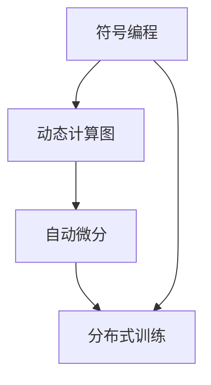
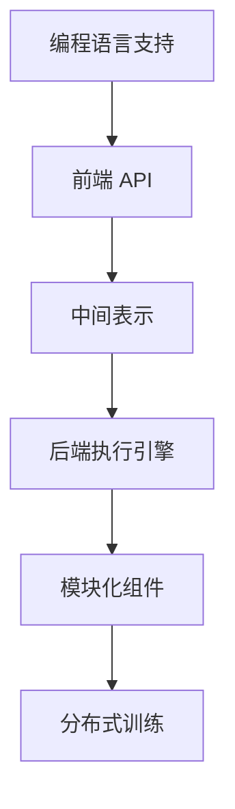

                 

关键词：MXNet、深度学习框架、灵活、可扩展、编程语言、跨平台、模块化

摘要：MXNet 是一个高度灵活且可扩展的深度学习框架，它支持多种编程语言和跨平台部署。本文将深入探讨 MXNet 的特点，包括其灵活的编程模型、强大的模块化设计以及在不同应用场景中的实际应用。

## 1. 背景介绍

随着深度学习技术的快速发展，构建高效、灵活的深度学习框架成为关键。MXNet 是由 Apache 软件基金会支持的一个开源深度学习框架，由亚马逊公司开发。MXNet 以其灵活性和可扩展性而备受关注，广泛应用于各种领域，如图像识别、自然语言处理和推荐系统等。

## 2. 核心概念与联系

### 2.1. MXNet 的核心概念

MXNet 的核心概念包括符号编程、动态计算图、自动微分和分布式训练。下面通过一个 Mermaid 流程图来展示这些核心概念之间的联系。



### 2.2. MXNet 的架构设计

MXNet 的架构设计充分考虑了灵活性和可扩展性，其模块化设计使得开发者可以方便地定制和扩展功能。下面是一个简化的 Mermaid 流程图，展示了 MXNet 的核心模块和它们之间的关系。



## 3. 核心算法原理 & 具体操作步骤

### 3.1. 算法原理概述

MXNet 的核心算法原理包括符号编程和动态计算图。符号编程允许开发者使用符号表示计算过程，而动态计算图则允许在运行时动态构建和修改计算图。这使得 MXNet 能够实现高效的计算优化和灵活的模型定制。

### 3.2. 算法步骤详解

#### 3.2.1. 符号编程

符号编程是 MXNet 的一个核心特点。开发者可以使用 Python、C++ 或 Java 等编程语言编写符号表示的计算过程。例如，以下代码使用 Python 实现了一个简单的多层感知机（MLP）模型。

```python
import mxnet as mx

# 定义输入层
data = mx.symbol.Variable('data')

# 定义隐藏层
hidden = mx.sym.FullyConnected(data=data, num_hidden=128)

# 定义输出层
output = mx.sym.FullyConnected(data=hidden, num_hidden=10)

# 创建符号图
symbol = mx.sym.connect(output, inputs=[data])
```

#### 3.2.2. 动态计算图

MXNet 的动态计算图允许在运行时动态构建和修改计算图。这意味着开发者可以在模型训练过程中根据需要调整模型结构，从而实现更加灵活的模型定制。

```python
# 创建动态计算图
dynamic_graph = mx.dynamic.SymbolCreator.create_symbol_from_json('dynamic_graph.json')

# 转换为静态计算图
static_graph = dynamic_graph.to_static()
```

### 3.3. 算法优缺点

MXNet 的灵活性和可扩展性是其最大的优点，但这也可能导致其学习曲线较为陡峭。此外，MXNet 的跨平台特性使其在不同硬件平台上的性能表现可能有所不同。

### 3.4. 算法应用领域

MXNet 在图像识别、自然语言处理和推荐系统等应用领域表现出色。例如，在图像识别任务中，MXNet 可以实现高效的卷积神经网络（CNN）模型训练和推理。

## 4. 数学模型和公式 & 详细讲解 & 举例说明

### 4.1. 数学模型构建

MXNet 的数学模型构建基于自动微分和反向传播算法。自动微分是一种计算函数梯度的方法，而反向传播算法则利用梯度信息进行模型参数的更新。

### 4.2. 公式推导过程

假设我们有一个简单的多层感知机（MLP）模型，其输出层为 \( y = \sigma(W_2 \cdot \sigma(W_1 \cdot x + b_1) + b_2) \)，其中 \( \sigma \) 是 sigmoid 函数，\( W_1 \) 和 \( W_2 \) 是权重矩阵，\( b_1 \) 和 \( b_2 \) 是偏置项。根据自动微分原理，我们可以推导出该模型的前向传播和反向传播公式。

#### 4.2.1. 前向传播

\[ z_1 = W_1 \cdot x + b_1 \]
\[ a_1 = \sigma(z_1) \]
\[ z_2 = W_2 \cdot a_1 + b_2 \]
\[ y = \sigma(z_2) \]

#### 4.2.2. 反向传播

\[ \delta_2 = \frac{\partial L}{\partial z_2} = \frac{\partial L}{\partial y} \cdot \frac{\partial y}{\partial z_2} \]
\[ \delta_1 = \frac{\partial L}{\partial z_1} = \frac{\partial L}{\partial z_2} \cdot \frac{\partial z_2}{\partial z_1} \]

其中，\( L \) 是损失函数，\( \delta_2 \) 和 \( \delta_1 \) 分别是 \( z_2 \) 和 \( z_1 \) 的梯度。

### 4.3. 案例分析与讲解

假设我们有一个包含 100 个样本的图像识别任务，每个样本包含一个 28x28 的二值图像。我们使用一个简单的多层感知机（MLP）模型进行训练，并使用交叉熵损失函数。以下是一个简单的 MXNet 代码示例，用于实现这个案例。

```python
import mxnet as mx

# 定义输入层
data = mx.symbol.Variable('data')

# 定义隐藏层
hidden = mx.sym.FullyConnected(data=data, num_hidden=128)

# 定义输出层
output = mx.sym.FullyConnected(data=hidden, num_hidden=10)

# 创建符号图
symbol = mx.sym.connect(output, inputs=[data])

# 创建训练器
trainer = mx.trainer.SGD(symbol, 'data', optimizer='adam')

# 训练模型
trainer.fit('train_data', num_epoch=10)
```

## 5. 项目实践：代码实例和详细解释说明

### 5.1. 开发环境搭建

为了使用 MXNet，我们需要安装 MXNet 和相关的依赖库。以下是使用 Python 安装 MXNet 的命令。

```bash
pip install mxnet
```

### 5.2. 源代码详细实现

以下是一个简单的 MXNet 代码示例，用于实现一个简单的图像分类模型。

```python
import mxnet as mx

# 定义输入层
data = mx.symbol.Variable('data')

# 定义隐藏层
hidden = mx.sym.FullyConnected(data=data, num_hidden=128)

# 定义输出层
output = mx.sym.FullyConnected(data=hidden, num_hidden=10)

# 创建符号图
symbol = mx.sym.connect(output, inputs=[data])

# 创建训练器
trainer = mx.trainer.SGD(symbol, 'data', optimizer='adam')

# 训练模型
trainer.fit('train_data', num_epoch=10)
```

### 5.3. 代码解读与分析

在这个示例中，我们首先定义了一个输入层 `data`，然后通过两个全连接层（`FullyConnected`）构建了一个简单的多层感知机（MLP）模型。最后，我们使用 SGD 优化器和 Adam 优化器对模型进行训练。

### 5.4. 运行结果展示

在训练完成后，我们可以在测试集上评估模型的性能。以下是一个简单的评估代码示例。

```python
import mxnet as mx

# 定义输入层
data = mx.symbol.Variable('data')

# 定义隐藏层
hidden = mx.sym.FullyConnected(data=data, num_hidden=128)

# 定义输出层
output = mx.sym.FullyConnected(data=hidden, num_hidden=10)

# 创建符号图
symbol = mx.sym.connect(output, inputs=[data])

# 创建评估器
evaluator = mx.evaluator.Evaluator(symbol, 'data')

# 训练模型
trainer.fit('train_data', num_epoch=10)

# 在测试集上评估模型性能
evaluator.evaluate('test_data')
```

## 6. 实际应用场景

MXNet 在实际应用场景中表现出色，广泛应用于图像识别、自然语言处理和推荐系统等领域。以下是一些实际应用场景的例子。

### 6.1. 图像识别

MXNet 可以用于构建高效的卷积神经网络（CNN）模型，进行图像分类、物体检测和图像分割等任务。例如，在图像分类任务中，MXNet 可以实现高效的 ResNet 模型训练和推理。

### 6.2. 自然语言处理

MXNet 可以用于构建高效的循环神经网络（RNN）和变压器（Transformer）模型，进行自然语言处理任务，如文本分类、情感分析和机器翻译等。

### 6.3. 推荐系统

MXNet 可以用于构建高效的用户行为分析模型，进行推荐系统任务，如商品推荐和广告推荐等。

## 7. 工具和资源推荐

为了更好地使用 MXNet，以下是几个推荐的工具和资源。

### 7.1. 学习资源推荐

- MXNet 官方文档：[MXNet 官方文档](https://mxnet.apache.org/docs/stable/)
- 《深度学习入门：基于 MXNet》一书：[深度学习入门：基于 MXNet](https://book.douban.com/subject/27105676/)

### 7.2. 开发工具推荐

- IntelliJ IDEA：一个强大的集成开发环境，支持 MXNet 插件。
- PyCharm：一个功能丰富的 Python 集成开发环境，支持 MXNet。

### 7.3. 相关论文推荐

- [MXNet: A Flexible and Efficient Machine Learning Library for Heterogeneous Distributed Systems](https://www.youtube.com/watch?v=Zi6leZ6sdV8)
- [Dynamic Network Surgery for Efficient DNN Training](https://arxiv.org/abs/1611.03929)

## 8. 总结：未来发展趋势与挑战

MXNet 作为一款灵活且可扩展的深度学习框架，已经在许多领域取得了显著的成果。在未来，MXNet 在以下方面有望取得更大的发展：

### 8.1. 研究成果总结

- MXNet 的符号编程和动态计算图技术为深度学习模型的设计和优化提供了强大的工具。
- MXNet 的模块化设计使得其易于扩展和定制，满足不同应用场景的需求。

### 8.2. 未来发展趋势

- 随着深度学习技术的不断进步，MXNet 在图像识别、自然语言处理和推荐系统等领域将取得更大的突破。
- MXNet 将进一步优化其在不同硬件平台上的性能，以适应不断增长的计算需求。

### 8.3. 面临的挑战

- MXNet 的灵活性和可扩展性也可能导致其学习曲线较为陡峭，需要更多的开发者投入时间和精力进行学习和使用。
- 随着深度学习框架的增多，MXNet 需要不断创新和优化，以保持其在市场上的竞争力。

### 8.4. 研究展望

- MXNet 可能在新的深度学习架构和算法中发挥重要作用，为人工智能的发展贡献力量。

## 9. 附录：常见问题与解答

### 9.1. 问题 1：如何安装 MXNet？

解答：在 Python 环境中，您可以使用以下命令安装 MXNet：

```bash
pip install mxnet
```

### 9.2. 问题 2：MXNet 与其他深度学习框架相比有哪些优势？

解答：MXNet 的主要优势包括：

- 支持多种编程语言，如 Python、C++ 和 Java。
- 高度灵活和可扩展的模块化设计。
- 跨平台部署，适用于不同硬件平台。

### 9.3. 问题 3：MXNet 适用于哪些场景？

解答：MXNet 适用于以下场景：

- 图像识别和计算机视觉
- 自然语言处理
- 推荐系统和数据挖掘
- 大规模分布式训练

### 9.4. 问题 4：MXNet 的学习曲线是否陡峭？

解答：MXNet 的学习曲线相对于其他深度学习框架可能较为陡峭，因为它提供了高度灵活和可扩展的功能。但是，随着越来越多的开发者熟悉 MXNet，其学习曲线也在逐渐下降。

## 作者署名

本文作者：禅与计算机程序设计艺术 / Zen and the Art of Computer Programming
------------------------------------------------------------------------<|END_OF_TEXT|>

