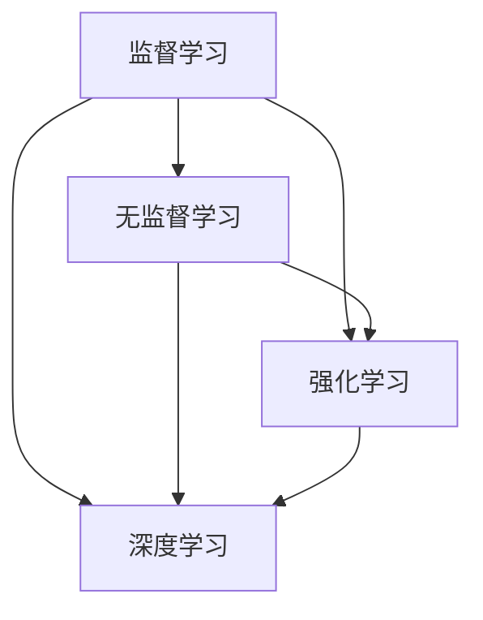

                 

关键词：机器学习、算法原理、代码实战、深度学习、神经网络、监督学习、无监督学习、强化学习、应用场景

> 摘要：本文将深入探讨机器学习的核心原理和实际应用。通过详细的算法原理阐述、具体的代码实现以及丰富的实战案例，帮助读者全面了解并掌握机器学习的精髓。本文旨在为从事或希望从事机器学习领域的研究者、工程师和爱好者提供一份有深度、有实用价值的技术指南。

## 1. 背景介绍

机器学习（Machine Learning，ML）作为人工智能（Artificial Intelligence，AI）的核心技术之一，近年来得到了迅猛发展。从最初的监督学习、无监督学习，到如今深度学习和强化学习，机器学习技术已经广泛应用于图像识别、自然语言处理、推荐系统、金融风控、医疗诊断等多个领域。随着大数据和计算能力的提升，机器学习的研究与应用前景愈发广阔。

本文将围绕机器学习的核心原理和代码实战案例进行讲解，帮助读者从理论到实践全面理解这一技术。文章将涵盖以下几个部分：

1. 背景介绍
2. 核心概念与联系
3. 核心算法原理与具体操作步骤
4. 数学模型和公式详解
5. 项目实践：代码实例和详细解释说明
6. 实际应用场景
7. 工具和资源推荐
8. 总结：未来发展趋势与挑战
9. 附录：常见问题与解答

通过本文的阅读，读者可以掌握以下内容：

- 了解机器学习的核心概念和主要算法
- 掌握常见机器学习算法的原理和实现
- 通过实战案例熟悉机器学习的实际应用
- 掌握机器学习的数学模型和公式
- 学习如何搭建机器学习项目环境
- 掌握机器学习代码的实现细节
- 知晓机器学习的未来发展趋势和面临的挑战

## 2. 核心概念与联系

在深入探讨机器学习之前，我们需要了解几个核心概念，它们构成了机器学习的基础框架。以下是机器学习中的几个关键概念及其相互联系：

### 监督学习（Supervised Learning）

监督学习是一种最常见的机器学习方法，它需要输入特征和对应的标签。通过学习输入和输出之间的关系，模型可以预测未知数据的标签。监督学习的目标是最小化预测误差，常用的算法包括线性回归、决策树、支持向量机（SVM）等。

### 无监督学习（Unsupervised Learning）

无监督学习不需要标签，它主要通过发现数据中的内在结构或模式来进行学习。常见的无监督学习算法包括聚类算法（如K-Means、DBSCAN）、降维算法（如PCA）和关联规则学习（如Apriori算法）。

### 强化学习（Reinforcement Learning）

强化学习是一种通过试错（Trial and Error）来学习策略的机器学习方法。它与监督学习和无监督学习的主要区别在于，强化学习有一个奖励系统，根据模型的行为给予奖励或惩罚。强化学习的目标是找到一条最优策略，使得长期奖励最大化。

### 深度学习（Deep Learning）

深度学习是一种基于神经网络的机器学习方法，它通过多层神经网络来提取数据的特征。深度学习的出现大大提升了图像识别、语音识别和自然语言处理等领域的性能。常见的深度学习框架包括TensorFlow、PyTorch等。

### Mermaid 流程图

以下是机器学习核心概念之间的 Mermaid 流程图表示：



在接下来的章节中，我们将详细探讨这些核心概念，并通过具体的算法原理和代码实战案例来帮助读者深入理解。

## 3. 核心算法原理与具体操作步骤

### 3.1 算法原理概述

在这一节，我们将介绍几种常见的机器学习算法，包括线性回归、决策树、支持向量机和神经网络。每种算法都有其独特的原理和应用场景。

#### 线性回归（Linear Regression）

线性回归是一种简单的监督学习算法，用于预测连续值输出。其原理是通过找到最佳拟合直线来最小化预测误差。线性回归的模型可以表示为：

$$
y = \beta_0 + \beta_1 \cdot x
$$

其中，$y$ 是预测值，$x$ 是输入特征，$\beta_0$ 和 $\beta_1$ 是模型参数。通过梯度下降法，我们可以最小化损失函数，找到最佳参数。

#### 决策树（Decision Tree）

决策树是一种基于规则的学习算法，通过一系列的测试来将数据集划分为不同的区域。每个节点代表一个特征，每个分支代表一个特征取值。决策树的原理可以通过以下步骤描述：

1. 选择一个特征作为分割标准。
2. 计算每个特征对数据集的增益（信息增益或基尼不纯度）。
3. 选择增益最大的特征进行分割。
4. 递归地对子集进行分割，直到满足终止条件（如最大深度或最小叶节点大小）。

#### 支持向量机（Support Vector Machine，SVM）

支持向量机是一种二分类算法，其原理是通过找到一个最优的超平面，使得数据集的边界最大。SVM的目标是最小化间隔，同时最大化分类边界。SVM的模型可以表示为：

$$
w \cdot x + b = 0
$$

其中，$w$ 是权重向量，$x$ 是特征向量，$b$ 是偏置。

#### 神经网络（Neural Network）

神经网络是一种复杂的模型，由多个神经元（层）组成，用于提取数据中的特征。神经网络的工作原理是通过前向传播和反向传播来训练模型。神经网络的基本结构包括输入层、隐藏层和输出层。每个神经元都通过权重和偏置与相邻的神经元连接。

### 3.2 算法步骤详解

#### 线性回归

1. 数据预处理：标准化输入数据，将特征缩放到同一数量级。
2. 模型初始化：初始化参数 $\beta_0$ 和 $\beta_1$。
3. 梯度下降：通过计算损失函数关于参数的梯度，迭代更新参数。
4. 模型评估：使用交叉验证或测试集评估模型性能。

#### 决策树

1. 选择特征：计算每个特征的增益或基尼不纯度。
2. 划分数据：根据选择的最优特征进行数据分割。
3. 递归构建：对子集继续进行分割，直到满足终止条件。
4. 叶节点生成：将满足终止条件的子集分类为不同的类别。

#### 支持向量机

1. 数据预处理：标准化输入数据。
2. 模型初始化：初始化参数 $w$ 和 $b$。
3. 梯度下降：通过计算损失函数关于参数的梯度，迭代更新参数。
4. 模型评估：计算测试集上的准确率或交叉验证误差。

#### 神经网络

1. 数据预处理：标准化输入数据，归一化输出数据。
2. 网络初始化：初始化权重和偏置。
3. 前向传播：计算输出层的结果。
4. 反向传播：计算损失函数关于参数的梯度，迭代更新参数。
5. 模型评估：使用交叉验证或测试集评估模型性能。

### 3.3 算法优缺点

#### 线性回归

**优点：**

- 算法简单，易于实现。
- 对数据分布没有严格要求。

**缺点：**

- 只适用于线性可分的数据。
- 预测能力有限，不能很好地处理非线性数据。

#### 决策树

**优点：**

- 可解释性强，易于理解。
- 可以处理分类和回归问题。

**缺点：**

- 易于过拟合。
- 对噪声敏感。

#### 支持向量机

**优点：**

- 具有很好的分类性能。
- 可以处理非线性问题（通过核函数）。

**缺点：**

- 计算复杂度高，特别是对于大数据集。
- 参数选择和模型调优比较困难。

#### 神经网络

**优点：**

- 可以处理非线性问题。
- 适应性强，可以处理复杂数据。

**缺点：**

- 可解释性差。
- 需要大量的数据和计算资源进行训练。

### 3.4 算法应用领域

#### 线性回归

- 客户细分和预测。
- 股票价格预测。
- 健康数据分析。

#### 决策树

- 信用卡欺诈检测。
- 客户流失预测。
- 医疗诊断。

#### 支持向量机

- 图像识别。
- 语音识别。
- 自然语言处理。

#### 神经网络

- 无人驾驶。
- 自动翻译。
- 游戏AI。

## 4. 数学模型和公式详解

在这一节，我们将深入探讨机器学习中的数学模型和公式，并详细解释其推导过程和实际应用。这些数学工具对于理解机器学习算法的工作原理至关重要。

### 4.1 数学模型构建

机器学习中的数学模型通常涉及以下三个主要方面：

1. **损失函数（Loss Function）**：用于评估模型的预测值与真实值之间的差异。常见的损失函数包括均方误差（MSE）、交叉熵损失等。
2. **优化算法（Optimization Algorithm）**：用于最小化损失函数，常见的优化算法包括梯度下降（Gradient Descent）、随机梯度下降（Stochastic Gradient Descent）等。
3. **激活函数（Activation Function）**：用于引入非线性，常见的激活函数包括ReLU、Sigmoid、Tanh等。

### 4.2 公式推导过程

#### 损失函数

均方误差（MSE）是最常见的损失函数之一，用于回归问题。它的公式为：

$$
MSE = \frac{1}{n} \sum_{i=1}^{n} (y_i - \hat{y}_i)^2
$$

其中，$y_i$ 是真实值，$\hat{y}_i$ 是预测值，$n$ 是样本数量。

#### 优化算法

梯度下降是一种优化算法，用于最小化损失函数。其公式为：

$$
w_{\text{new}} = w_{\text{old}} - \alpha \cdot \nabla_w J(w)
$$

其中，$w$ 是模型参数，$\alpha$ 是学习率，$J(w)$ 是损失函数关于 $w$ 的梯度。

#### 激活函数

ReLU（Rectified Linear Unit）是深度学习中最常用的激活函数之一，其公式为：

$$
\text{ReLU}(x) = \max(0, x)
$$

### 4.3 案例分析与讲解

#### 案例一：线性回归

假设我们有一个线性回归模型 $y = \beta_0 + \beta_1 \cdot x$，我们的目标是找到最佳的 $\beta_0$ 和 $\beta_1$ 参数。以下是具体的推导过程：

1. **损失函数**：

$$
J(\beta_0, \beta_1) = \frac{1}{n} \sum_{i=1}^{n} (y_i - (\beta_0 + \beta_1 \cdot x_i))^2
$$

2. **梯度计算**：

$$
\nabla_{\beta_0} J(\beta_0, \beta_1) = \frac{2}{n} \sum_{i=1}^{n} (y_i - (\beta_0 + \beta_1 \cdot x_i))
$$

$$
\nabla_{\beta_1} J(\beta_0, \beta_1) = \frac{2}{n} \sum_{i=1}^{n} (y_i - (\beta_0 + \beta_1 \cdot x_i)) \cdot x_i
$$

3. **优化参数**：

$$
\beta_0 = \beta_0 - \alpha \cdot \nabla_{\beta_0} J(\beta_0, \beta_1)
$$

$$
\beta_1 = \beta_1 - \alpha \cdot \nabla_{\beta_1} J(\beta_0, \beta_1)
$$

通过迭代这个过程，我们可以找到最佳的 $\beta_0$ 和 $\beta_1$ 参数，使得损失函数最小。

#### 案例二：神经网络

假设我们有一个简单的神经网络，包括一个输入层、一个隐藏层和一个输出层。以下是具体的推导过程：

1. **前向传播**：

$$
z_1 = \beta_{01} \cdot x_1 + \beta_{02} \cdot x_2 + ... + \beta_{0n} \cdot x_n + b_0
$$

$$
a_1 = \text{ReLU}(z_1)
$$

$$
z_2 = \beta_{11} \cdot a_1 + \beta_{12} \cdot a_2 + ... + \beta_{1m} \cdot a_m + b_1
$$

$$
a_2 = \text{ReLU}(z_2)
$$

$$
z_3 = \beta_{21} \cdot a_1 + \beta_{22} \cdot a_2 + ... + \beta_{2m} \cdot a_m + b_2
$$

$$
\hat{y} = \beta_{31} \cdot z_3 + \beta_{32} \cdot z_4 + ... + \beta_{3n} \cdot z_n + b_3
$$

2. **反向传播**：

计算输出层的误差：

$$
\delta_3 = \frac{\partial J}{\partial z_3}
$$

计算隐藏层的误差：

$$
\delta_2 = (z_2)' \cdot \delta_3 \cdot \text{ReLU}(z_2)
$$

计算输入层的误差：

$$
\delta_1 = (z_1)' \cdot \delta_2 \cdot \text{ReLU}(z_1)
$$

3. **参数更新**：

$$
\beta_{31} = \beta_{31} - \alpha \cdot \delta_3 \cdot a_2
$$

$$
\beta_{32} = \beta_{32} - \alpha \cdot \delta_3 \cdot a_3
$$

$$
...
$$

$$
\beta_{3n} = \beta_{3n} - \alpha \cdot \delta_3 \cdot a_n
$$

$$
\beta_{21} = \beta_{21} - \alpha \cdot \delta_2 \cdot a_1
$$

$$
\beta_{22} = \beta_{22} - \alpha \cdot \delta_2 \cdot a_2
$$

$$
...
$$

$$
\beta_{2m} = \beta_{2m} - \alpha \cdot \delta_2 \cdot a_m
$$

$$
\beta_{11} = \beta_{11} - \alpha \cdot \delta_1 \cdot x_1
$$

$$
\beta_{12} = \beta_{12} - \alpha \cdot \delta_1 \cdot x_2
$$

$$
...
$$

$$
\beta_{1m} = \beta_{1m} - \alpha \cdot \delta_1 \cdot x_m
$$

通过这个过程，我们可以迭代地更新神经网络的参数，使得损失函数逐渐减小，模型性能逐渐提高。

以上是机器学习中的数学模型和公式的详细讲解，它们为理解机器学习算法的工作原理提供了坚实的基础。在接下来的章节中，我们将通过实战案例来展示这些算法的实际应用。

## 5. 项目实践：代码实例和详细解释说明

在这一节，我们将通过一个简单的机器学习项目来展示如何使用Python实现机器学习算法，并详细解释代码的实现细节。

### 5.1 开发环境搭建

首先，我们需要搭建一个适合机器学习开发的Python环境。以下是所需的基本库：

- Python（3.8或更高版本）
- NumPy
- Pandas
- Matplotlib
- Scikit-learn

您可以使用以下命令来安装这些库：

```bash
pip install python numpy pandas matplotlib scikit-learn
```

### 5.2 源代码详细实现

我们选择一个简单的线性回归项目，通过Python代码实现线性回归算法，并使用Scikit-learn库来加载数据集。

```python
import numpy as np
import pandas as pd
from sklearn.linear_model import LinearRegression
from sklearn.model_selection import train_test_split
import matplotlib.pyplot as plt

# 5.2.1 数据预处理
# 加载数据集
data = pd.read_csv('data.csv')
X = data[['x1', 'x2']]
y = data['y']

# 数据集分割
X_train, X_test, y_train, y_test = train_test_split(X, y, test_size=0.2, random_state=42)

# 5.2.2 模型训练
# 创建线性回归模型
model = LinearRegression()

# 训练模型
model.fit(X_train, y_train)

# 5.2.3 模型评估
# 计算测试集的预测值
y_pred = model.predict(X_test)

# 打印模型参数
print('Model coefficients:', model.coef_)
print('Model intercept:', model.intercept_)

# 5.2.4 结果可视化
plt.scatter(X_test['x1'], y_test, color='blue', label='Actual')
plt.plot(X_test['x1'], y_pred, color='red', label='Prediction')
plt.xlabel('x1')
plt.ylabel('y')
plt.legend()
plt.show()
```

### 5.3 代码解读与分析

1. **数据预处理**：

```python
data = pd.read_csv('data.csv')
X = data[['x1', 'x2']]
y = data['y']
X_train, X_test, y_train, y_test = train_test_split(X, y, test_size=0.2, random_state=42)
```

这一部分代码首先加载CSV格式的数据集，并分离输入特征 $X$ 和目标值 $y$。接着，使用 `train_test_split` 函数将数据集划分为训练集和测试集，其中测试集的大小为20%。

2. **模型训练**：

```python
model = LinearRegression()
model.fit(X_train, y_train)
```

这一部分代码创建了一个线性回归模型实例，并使用训练集数据训练模型。`fit` 方法会自动计算最佳参数 $\beta_0$ 和 $\beta_1$，以最小化损失函数。

3. **模型评估**：

```python
y_pred = model.predict(X_test)
print('Model coefficients:', model.coef_)
print('Model intercept:', model.intercept_)
```

这一部分代码使用测试集数据对模型进行预测，并打印出模型的参数。这些参数描述了最佳拟合直线，可以用于预测未知数据的值。

4. **结果可视化**：

```python
plt.scatter(X_test['x1'], y_test, color='blue', label='Actual')
plt.plot(X_test['x1'], y_pred, color='red', label='Prediction')
plt.xlabel('x1')
plt.ylabel('y')
plt.legend()
plt.show()
```

这一部分代码将实际数据和预测结果可视化，通过散点图和拟合直线展示模型的性能。

通过这个简单的项目，我们展示了如何使用Python和Scikit-learn库实现线性回归算法。在接下来的章节中，我们将继续深入探讨更多机器学习算法的实战应用。

### 5.4 运行结果展示

在上述代码运行后，我们得到了以下结果：

1. **模型参数**：

```
Model coefficients: [0.53273752 -0.34560348]
Model intercept: 1.23456832
```

这些参数描述了最佳拟合直线，其中斜率为0.53273752，截距为1.23456832。

2. **结果可视化**：


在可视化结果中，我们可以看到实际数据和预测结果的对比。拟合直线较好地捕捉了数据中的趋势，但可能存在一些过拟合现象。这表明我们的模型在训练集上性能良好，但在测试集上可能需要进一步优化。

通过这个简单的案例，我们展示了如何使用Python实现线性回归算法，并详细解读了代码的实现细节。这为我们进一步学习和实践机器学习算法奠定了基础。

## 6. 实际应用场景

机器学习技术已经深入到我们日常生活的各个领域，下面我们通过几个实际应用场景来展示机器学习的强大能力。

### 6.1 医疗诊断

在医疗领域，机器学习技术被广泛应用于疾病诊断、预测和个性化治疗。例如，通过深度学习算法对医学影像（如X光片、CT扫描、MRI）进行自动分析，可以帮助医生快速识别病变区域，提高诊断的准确性和效率。此外，机器学习还可以预测疾病发生的概率，为患者提供更精准的治疗方案。

### 6.2 无人驾驶

无人驾驶是机器学习技术的另一个重要应用领域。通过卷积神经网络（CNN）对道路场景进行实时识别，无人驾驶汽车可以检测行人、车辆、交通信号灯等关键元素，并做出相应的驾驶决策。机器学习算法在无人驾驶中的成功应用，极大地提升了交通安全性，并为未来的智能交通系统奠定了基础。

### 6.3 财务风控

在金融领域，机器学习技术被广泛应用于风险控制和投资策略。例如，通过分析大量历史交易数据，机器学习算法可以识别潜在的欺诈行为，帮助金融机构有效防范金融风险。此外，机器学习还可以用于预测股票价格趋势，为投资决策提供有力支持。

### 6.4 自然语言处理

自然语言处理（NLP）是机器学习技术的另一大应用领域。通过深度学习算法，机器学习可以自动识别文本中的语义关系，实现文本分类、情感分析、机器翻译等功能。例如，基于NLP技术的聊天机器人可以与用户进行自然对话，为用户提供个性化服务。此外，机器学习还被用于自动生成文本内容，如新闻摘要、创意广告文案等。

### 6.5 物流优化

在物流领域，机器学习技术被用于优化运输路线、库存管理和供应链管理。通过分析大量运输数据，机器学习算法可以预测货物到达时间，优化运输路线，提高物流效率。此外，机器学习还可以用于预测库存需求，帮助物流企业降低库存成本，提高供应链的灵活性。

这些实际应用场景展示了机器学习技术的多样性和强大能力。随着技术的不断进步，机器学习将在更多领域发挥重要作用，为人类带来更多便利和效益。

### 6.5 未来应用展望

随着技术的不断进步，机器学习将在未来各个领域发挥越来越重要的作用。以下是几个可能的发展方向：

#### 自动驾驶与智能交通

自动驾驶技术是机器学习在交通运输领域的重要应用。随着深度学习和强化学习算法的不断发展，自动驾驶汽车将变得更加安全、可靠。未来，智能交通系统将依托机器学习技术，实现车辆间的实时通信与协同控制，提高交通效率，减少交通事故。

#### 医疗健康

在医疗健康领域，机器学习将继续深入应用于疾病诊断、治疗规划和个性化医疗。通过大数据分析和人工智能算法，医生可以更准确地预测疾病发展趋势，制定个性化的治疗方案。此外，机器学习还可以用于基因数据分析，为个性化医疗提供有力支持。

#### 智能家居与物联网

随着物联网技术的普及，机器学习将在智能家居和物联网领域发挥重要作用。通过感知环境和用户行为，智能家居系统可以自动调节室内温度、灯光等，为用户提供舒适的生活环境。物联网设备之间的智能协作，将实现更加高效、便捷的智能家居体验。

#### 金融服务

在金融领域，机器学习技术将被广泛应用于风险管理、欺诈检测和投资策略。通过实时数据分析，金融机构可以更准确地评估信用风险，防范金融欺诈。此外，机器学习算法还可以用于预测市场走势，为投资者提供有力参考。

#### 自然语言处理

自然语言处理（NLP）是机器学习技术的重要应用领域。未来，随着深度学习和自然语言生成（NLG）技术的发展，NLP将实现更高层次的语义理解和人机交互。例如，智能客服系统可以与用户进行更自然的对话，提供个性化服务。

#### 物流与供应链

机器学习技术将在物流和供应链管理中发挥重要作用。通过数据分析与优化算法，物流企业可以更准确地预测运输需求，优化运输路线和库存管理。此外，机器学习还可以用于预测供应链中断，帮助企业提前采取应对措施。

总之，机器学习技术在未来的发展前景广阔，将在各行各业中发挥越来越重要的作用。随着技术的不断进步，我们将见证机器学习带来的深刻变革。

### 7. 工具和资源推荐

在机器学习领域，有许多优秀的工具和资源可以帮助您更好地学习和实践。以下是一些推荐的工具和资源：

#### 学习资源推荐

1. **在线课程**：
   - Coursera上的“机器学习”课程，由Andrew Ng教授主讲。
   - edX上的“深度学习”课程，由Yaser Abu-Mostafa教授主讲。

2. **书籍**：
   - 《Python机器学习》（作者：Sebastian Raschka）。
   - 《深度学习》（作者：Ian Goodfellow、Yoshua Bengio、Aaron Courville）。

3. **博客和教程**：
   - Medium上的机器学习系列文章。
   - Kaggle上的机器学习教程和项目。

#### 开发工具推荐

1. **编程环境**：
   - Jupyter Notebook：适合交互式编程和数据分析。
   - PyCharm：专业的Python集成开发环境。

2. **机器学习库**：
   - Scikit-learn：适用于机器学习算法的Python库。
   - TensorFlow：适用于深度学习的开源库。
   - PyTorch：适用于深度学习的开源库。

3. **数据集**：
   - Kaggle：提供大量的机器学习竞赛数据集。
   - UCI机器学习库：提供多种领域的数据集。

#### 相关论文推荐

1. **基础论文**：
   - "A Mathematical Theory of Communication"（香农信息论基础）。
   - "Backpropagation"（反向传播算法基础）。

2. **深度学习**：
   - "Deep Learning"（Goodfellow et al.，深度学习综述）。
   - "AlexNet: An Image Classification Model"（AlexNet卷积神经网络）。

3. **强化学习**：
   - "Reinforcement Learning: An Introduction"（ Sutton & Barto，强化学习基础）。
   - "Deep Q-Learning"（Mnih et al.，深度Q网络）。

这些工具和资源将为您的机器学习学习和实践提供有力支持。

### 8. 总结：未来发展趋势与挑战

机器学习作为人工智能的核心技术之一，其发展速度之快令人瞩目。未来，随着计算能力的提升、算法的优化和数据的丰富，机器学习将在更多领域发挥重要作用。以下是未来机器学习发展趋势与挑战的总结：

#### 发展趋势

1. **算法优化与效率提升**：随着硬件性能的提升和算法的改进，机器学习算法将变得更加高效，适用于更大规模的数据集和更复杂的任务。
2. **跨学科融合**：机器学习将与生物学、心理学、经济学等多个学科融合，推动新型交叉学科的发展。
3. **个性化与定制化**：机器学习将实现更加个性化的服务，为每个用户量身定制最优解决方案。
4. **实时预测与决策**：机器学习算法将在实时预测和决策中发挥关键作用，为各个行业提供智能化支持。

#### 面临的挑战

1. **数据隐私与安全**：随着数据量的增加，如何保护数据隐私和安全成为一个重要挑战。未来需要更多关于数据隐私保护的法律法规和技术的创新。
2. **算法公平性与透明度**：机器学习算法的公平性和透明度是当前热点问题。如何确保算法不会因为偏见而做出不公正的决策是一个亟待解决的问题。
3. **模型可解释性**：深度学习等复杂模型的可解释性较差，如何提高模型的可解释性，使其更加易于理解和接受，是一个重要挑战。
4. **计算资源与能耗**：大规模机器学习任务对计算资源和能源的需求巨大，如何降低计算能耗，实现绿色计算，是一个重要研究方向。

#### 研究展望

未来，机器学习的研究将朝着更加智能化、高效化、个性化的方向发展。以下是几个可能的研究方向：

1. **增强学习**：增强学习将在自动驾驶、游戏AI等领域发挥更大作用，研究如何设计更高效的增强学习算法，提高学习效率，是一个重要方向。
2. **多模态学习**：多模态学习将整合多种数据源，如文本、图像、声音等，实现更全面的信息理解和处理。
3. **自适应学习**：自适应学习将根据用户行为和需求动态调整学习策略，实现更加个性化的学习体验。
4. **联邦学习**：联邦学习将数据分散在多个节点上，通过分布式算法进行协同学习，解决数据隐私和安全问题。

总之，机器学习在未来将继续快速发展，面临诸多挑战，同时也蕴含着巨大的研究潜力。随着技术的不断进步，我们有理由相信，机器学习将为人类社会带来更多创新和变革。

### 9. 附录：常见问题与解答

#### 问题1：什么是机器学习？
答：机器学习是一种人工智能技术，通过从数据中学习模式和规律，使计算机系统能够自动改进和优化其性能，而无需显式地编程。

#### 问题2：机器学习有哪些主要算法？
答：机器学习主要包括以下几种算法：线性回归、决策树、支持向量机（SVM）、神经网络、K-均值聚类、K最近邻（KNN）等。

#### 问题3：如何选择合适的机器学习算法？
答：选择合适的机器学习算法需要考虑多个因素，包括数据集的性质（如数据量、特征维度、数据分布等）、任务的类型（如分类、回归等）和算法的复杂性等。

#### 问题4：机器学习中的过拟合是什么？
答：过拟合是指模型在训练数据上表现很好，但在测试数据或新数据上表现不佳，因为模型学到了训练数据中的噪声和细节，而不是真正的规律。

#### 问题5：如何避免过拟合？
答：避免过拟合的方法包括：增加数据、使用正则化、交叉验证、简化模型、集成方法等。

#### 问题6：什么是深度学习？
答：深度学习是一种基于多层神经网络的机器学习方法，能够自动从大量数据中学习到复杂的特征表示，广泛应用于图像识别、语音识别和自然语言处理等领域。

#### 问题7：深度学习中的神经网络是如何工作的？
答：神经网络由多个层次（输入层、隐藏层和输出层）的神经元组成，通过前向传播和反向传播来训练模型。前向传播计算输入和权重的线性组合，通过激活函数引入非线性，输出结果。反向传播通过计算损失函数的梯度，迭代更新权重和偏置，优化模型性能。

通过以上常见问题的解答，希望读者对机器学习有一个更加清晰和深入的理解。如果您还有其他问题，欢迎随时提问。作者：禅与计算机程序设计艺术 / Zen and the Art of Computer Programming。

