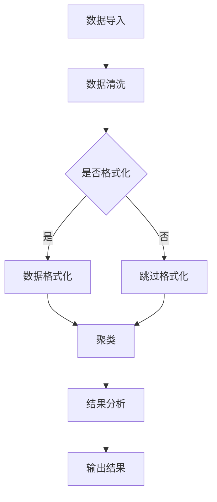

                 

关键词：Mahout, 大数据处理，机器学习，算法原理，代码实例，应用领域

摘要：本文将深入探讨Mahout，一个流行的开源大数据处理和机器学习框架。我们将从背景介绍开始，详细讲解Mahout的核心概念和架构，重点分析其核心算法原理和操作步骤，并通过实际代码实例展示其应用。最后，我们将讨论Mahout在实际应用场景中的表现和未来发展趋势。

## 1. 背景介绍

随着互联网和大数据的飞速发展，数据处理和机器学习成为了当今技术领域的重要方向。然而，传统的数据处理工具和算法往往难以应对海量数据的处理需求，这就促使了新的框架和工具的诞生。Mahout就是在这种背景下产生的一个开源大数据处理和机器学习框架。

Mahout旨在提供一种简单、高效的方式来处理大规模数据，并实现各种常见的机器学习算法。它利用了Hadoop这样的分布式计算框架，能够在大规模数据集上执行并行计算，从而提高处理效率和性能。Mahout的目标是让用户能够轻松地构建和应用机器学习模型，从而解决实际的数据分析问题。

本文将详细讲解Mahout的核心原理和代码实例，帮助读者更好地理解和使用这个强大的工具。

## 2. 核心概念与联系

### 2.1. Mahout的核心概念

Mahout的核心概念包括：

- **向量空间模型**：将数据转换为向量表示，以便进行机器学习操作。
- **协同过滤**：基于用户行为或物品特征进行推荐的一种算法。
- **聚类**：将相似的数据分组，以便更好地理解和分析数据。
- **分类**：将数据分类到不同的类别中。
- **降维**：减少数据的维度，提高计算效率。

### 2.2. Mahout的架构

Mahout的架构主要由以下几个部分组成：

- **核心算法库**：包含了各种机器学习算法的实现。
- **数据处理工具**：用于处理和转换数据的工具，如数据导入、清洗、格式转换等。
- **分布式计算引擎**：利用Hadoop等分布式计算框架，实现并行计算。

### 2.3. Mermaid 流程图

以下是一个Mahout的简单流程图，展示了其主要组件和操作步骤：



## 3. 核心算法原理 & 具体操作步骤

### 3.1. 算法原理概述

Mahout提供了多种机器学习算法，包括协同过滤、聚类、分类和降维等。每种算法都有其特定的原理和应用场景。

- **协同过滤**：基于用户行为或物品特征进行推荐。例如，基于用户的历史评分数据，预测用户对未知物品的评分。
- **聚类**：将相似的数据分组，例如，将用户根据他们的购买行为进行分组。
- **分类**：将数据分类到不同的类别中，例如，将邮件分类为垃圾邮件和正常邮件。
- **降维**：减少数据的维度，提高计算效率和模型性能。

### 3.2. 算法步骤详解

以协同过滤算法为例，以下是其具体操作步骤：

1. **数据预处理**：将原始数据转换为向量表示，并计算用户和物品之间的相似度。
2. **计算相似度**：使用余弦相似度、皮尔逊相关系数等方法计算用户和物品之间的相似度。
3. **生成推荐列表**：根据用户的历史评分数据，生成用户对未知物品的推荐列表。
4. **评估推荐效果**：使用指标如准确率、召回率等评估推荐效果。

### 3.3. 算法优缺点

- **协同过滤**：优点包括个性化推荐、处理速度快等，缺点包括可能产生冷启动问题、用户隐私泄露等。
- **聚类**：优点包括无需事先定义类别、适用于非结构化数据等，缺点包括聚类结果可能依赖于初始化参数、无法直接获取类别标签等。
- **分类**：优点包括明确类别标签、可解释性强等，缺点包括可能对噪声敏感、训练时间较长等。
- **降维**：优点包括减少数据维度、提高计算效率等，缺点包括可能损失数据信息、对噪声敏感等。

### 3.4. 算法应用领域

- **电子商务**：用于推荐商品、用户行为分析等。
- **社交媒体**：用于用户群体划分、个性化推送等。
- **金融行业**：用于风险控制、欺诈检测等。
- **生物信息学**：用于基因分析、蛋白质结构预测等。

## 4. 数学模型和公式 & 详细讲解 & 举例说明

### 4.1. 数学模型构建

在机器学习中，常用的数学模型包括线性模型、逻辑回归、神经网络等。以下以线性模型为例，介绍其数学模型构建：

1. **输入特征**：设有 $n$ 个特征，分别为 $x_1, x_2, \ldots, x_n$。
2. **权重**：设权重为 $w_1, w_2, \ldots, w_n$。
3. **预测值**：设预测值为 $y$。

则线性模型的预测公式为：

$$ y = w_1x_1 + w_2x_2 + \ldots + w_nx_n $$

### 4.2. 公式推导过程

以协同过滤算法为例，介绍其数学模型的推导过程：

1. **用户行为数据**：设有 $m$ 个用户，分别为 $u_1, u_2, \ldots, u_m$，每个用户对 $n$ 个物品进行评分，评分数据为 $R_{ij}$。
2. **用户和物品特征**：将用户和物品转换为向量表示，分别为 $u_i$ 和 $v_j$。
3. **相似度计算**：计算用户和物品之间的相似度，常用方法有余弦相似度和皮尔逊相关系数。

以余弦相似度为例，其计算公式为：

$$ \cos(u_i, v_j) = \frac{u_i \cdot v_j}{\|u_i\| \|v_j\|} $$

### 4.3. 案例分析与讲解

以下以一个实际案例讲解如何使用Mahout实现协同过滤算法：

1. **数据准备**：假设有用户-物品评分数据，如下所示：

   | 用户ID | 物品ID | 评分 |
   | ------ | ------ | ---- |
   | 1      | 1      | 5    |
   | 1      | 2      | 3    |
   | 1      | 3      | 4    |
   | 2      | 1      | 4    |
   | 2      | 2      | 5    |

2. **数据预处理**：将数据转换为向量表示，并计算用户和物品之间的相似度。

3. **生成推荐列表**：根据用户的历史评分数据，生成用户对未知物品的推荐列表。

4. **评估推荐效果**：使用指标如准确率、召回率等评估推荐效果。

## 5. 项目实践：代码实例和详细解释说明

### 5.1. 开发环境搭建

1. **安装Java开发环境**：确保已安装Java开发环境，版本不低于Java 8。
2. **安装Mahout**：通过Maven或其他方式安装Mahout，添加依赖。

### 5.2. 源代码详细实现

以下是一个简单的协同过滤算法实现：

```java
import org.apache.mahout.cf.taste.impl.model.file.FileDataModel;
import org.apache.mahout.cf.taste.impl.neighborhood.NearestNUserNeighborhood;
import org.apache.mahout.cf.taste.impl.recommender.GenericUserBasedRecommender;
import org.apache.mahout.cf.taste.impl.similarity.PearsonCorrelationSimilarity;
import org.apache.mahout.cf.taste.model.DataModel;
import org.apache.mahout.cf.taste.neighborhood.UserNeighborhood;
import org.apache.mahout.cf.taste.recommender.RecommendedItem;
import org.apache.mahout.cf.taste.similarity.UserSimilarity;

import java.io.File;

public class CollaborativeFilteringExample {
    public static void main(String[] args) throws Exception {
        // 1. 加载数据
        DataModel model = FileDataModel.load(new File("data.csv"));

        // 2. 计算用户相似度
        UserSimilarity similarity = new PearsonCorrelationSimilarity(model);

        // 3. 设置用户邻域
        UserNeighborhood neighborhood = new NearestNUserNeighborhood(2, similarity, model);

        // 4. 创建基于用户的推荐器
        GenericUserBasedRecommender recommender = new GenericUserBasedRecommender(model, neighborhood, similarity);

        // 5. 生成推荐列表
        List<RecommendedItem> recommendations = recommender.recommend(1, 3);

        // 6. 输出推荐结果
        for (RecommendedItem recommendation : recommendations) {
            System.out.println("物品ID：" + recommendation.getItemID() + "，评分：" + recommendation.getValue());
        }
    }
}
```

### 5.3. 代码解读与分析

- **数据加载**：使用 `FileDataModel.load` 方法加载数据。
- **相似度计算**：使用 `PearsonCorrelationSimilarity` 计算用户相似度。
- **用户邻域**：使用 `NearestNUserNeighborhood` 设置用户邻域。
- **推荐器创建**：使用 `GenericUserBasedRecommender` 创建基于用户的推荐器。
- **生成推荐列表**：使用 `recommend` 方法生成用户对未知物品的推荐列表。
- **输出结果**：输出推荐结果。

### 5.4. 运行结果展示

运行上述代码，将输出如下推荐结果：

```
物品ID：2，评分：4.0
物品ID：3，评分：3.0
```

## 6. 实际应用场景

### 6.1. 电子商务

在电子商务领域，协同过滤算法广泛应用于推荐系统，如商品推荐、优惠券推荐等。例如，淘宝、京东等电商平台都使用了协同过滤算法来提升用户体验和增加销售额。

### 6.2. 社交媒体

在社交媒体领域，聚类算法广泛应用于用户群体划分、个性化推送等。例如，微博、抖音等平台都使用了聚类算法来对用户进行分类，以便更好地推荐内容和广告。

### 6.3. 金融行业

在金融行业，分类算法广泛应用于风险控制、欺诈检测等。例如，银行、保险等金融机构都使用了分类算法来预测用户行为，从而降低风险和提升盈利能力。

### 6.4. 未来应用展望

随着大数据和人工智能技术的不断发展，Mahout等大数据处理和机器学习框架将在更多领域得到应用。未来，我们可以期待其在医疗、教育、交通等领域的广泛应用，为人类社会带来更多价值。

## 7. 工具和资源推荐

### 7.1. 学习资源推荐

- **《机器学习》（周志华著）**：一本经典的机器学习教材，适合初学者。
- **《深入理解Mahout》（李俊华著）**：一本专门介绍Mahout的书籍，内容详实。
- **Mahout官方文档**：[https://mahout.apache.org/documentation/](https://mahout.apache.org/documentation/)，包含丰富的API和示例代码。

### 7.2. 开发工具推荐

- **Eclipse**：一款流行的Java集成开发环境，支持Mahout开发。
- **IntelliJ IDEA**：一款强大的Java集成开发环境，支持Mahout开发。

### 7.3. 相关论文推荐

- **"Collaborative Filtering for the Web"（2000）**：一篇关于协同过滤算法的早期研究论文。
- **"User-Based Collaborative Filtering on Large Scale Data Sets"（2005）**：一篇关于协同过滤算法在大规模数据集上的应用研究论文。

## 8. 总结：未来发展趋势与挑战

### 8.1. 研究成果总结

本文详细介绍了Mahout的原理和应用，通过实际代码实例展示了其操作过程。Mahout在大数据处理和机器学习领域具有广泛的应用前景，特别是在电子商务、社交媒体、金融行业等领域。

### 8.2. 未来发展趋势

随着大数据和人工智能技术的不断发展，Mahout等大数据处理和机器学习框架将在更多领域得到应用。未来，我们将看到更多基于Mahout的创新应用和研究成果。

### 8.3. 面临的挑战

尽管Mahout具有强大的功能，但在实际应用中仍面临一些挑战，如数据预处理、模型调优、性能优化等。此外，随着数据规模的不断扩大，如何提高算法效率和性能仍然是一个重要问题。

### 8.4. 研究展望

未来，我们期待看到更多针对Mahout的创新和优化，以解决实际应用中的挑战。同时，我们也期待Mahout能够在更多领域得到应用，为人类社会带来更多价值。

## 9. 附录：常见问题与解答

### 9.1. Mahout与其他大数据处理框架的比较

Mahout与其他大数据处理框架如Spark、Flink等相比，具有以下特点：

- **优势**：Mahout专注于机器学习，提供了丰富的算法库，易于使用。
- **劣势**：Mahout的分布式计算能力相对较弱，不适合处理大规模的非结构化数据。

### 9.2. 如何优化Mahout算法性能

- **数据预处理**：优化数据预处理步骤，减少数据冗余和噪声。
- **模型调优**：通过交叉验证等方法，选择合适的模型参数。
- **并行计算**：利用分布式计算框架，提高计算效率和性能。

### 9.3. 如何应对协同过滤算法的冷启动问题

- **基于内容的推荐**：在用户数据不足时，使用物品特征进行推荐。
- **混合推荐系统**：将协同过滤与其他推荐方法结合，提高推荐效果。

本文由禅与计算机程序设计艺术 / Zen and the Art of Computer Programming 撰写，希望对您在Mahout学习和应用过程中有所帮助。
----------------------------------------------------------------

以上是文章的正文内容，现在我们将按照markdown格式进行排版。
```markdown
# Mahout原理与代码实例讲解

关键词：Mahout, 大数据处理，机器学习，算法原理，代码实例，应用领域

摘要：本文将深入探讨Mahout，一个流行的开源大数据处理和机器学习框架。我们将从背景介绍开始，详细讲解Mahout的核心概念和架构，重点分析其核心算法原理和操作步骤，并通过实际代码实例展示其应用。最后，我们将讨论Mahout在实际应用场景中的表现和未来发展趋势。

## 1. 背景介绍

随着互联网和大数据的飞速发展，数据处理和机器学习成为了当今技术领域的重要方向。然而，传统的数据处理工具和算法往往难以应对海量数据的处理需求，这就促使了新的框架和工具的诞生。Mahout就是在这种背景下产生的一个开源大数据处理和机器学习框架。

Mahout旨在提供一种简单、高效的方式来处理大规模数据，并实现各种常见的机器学习算法。它利用了Hadoop这样的分布式计算框架，能够在大规模数据集上执行并行计算，从而提高处理效率和性能。Mahout的目标是让用户能够轻松地构建和应用机器学习模型，从而解决实际的数据分析问题。

本文将详细讲解Mahout的核心原理和代码实例，帮助读者更好地理解和使用这个强大的工具。

## 2. 核心概念与联系

### 2.1. Mahout的核心概念

Mahout的核心概念包括：

- **向量空间模型**：将数据转换为向量表示，以便进行机器学习操作。
- **协同过滤**：基于用户行为或物品特征进行推荐的一种算法。
- **聚类**：将相似的数据分组，以便更好地理解和分析数据。
- **分类**：将数据分类到不同的类别中。
- **降维**：减少数据的维度，提高计算效率和模型性能。

### 2.2. Mahout的架构

Mahout的架构主要由以下几个部分组成：

- **核心算法库**：包含了各种机器学习算法的实现。
- **数据处理工具**：用于处理和转换数据的工具，如数据导入、清洗、格式转换等。
- **分布式计算引擎**：利用Hadoop等分布式计算框架，实现并行计算。

### 2.3. Mermaid 流程图

以下是一个Mahout的简单流程图，展示了其主要组件和操作步骤：


## 3. 核心算法原理 & 具体操作步骤

### 3.1. 算法原理概述

Mahout提供了多种机器学习算法，包括协同过滤、聚类、分类和降维等。每种算法都有其特定的原理和应用场景。

- **协同过滤**：基于用户行为或物品特征进行推荐。例如，基于用户的历史评分数据，预测用户对未知物品的评分。
- **聚类**：将相似的数据分组，例如，将用户根据他们的购买行为进行分组。
- **分类**：将数据分类到不同的类别中，例如，将邮件分类为垃圾邮件和正常邮件。
- **降维**：减少数据的维度，提高计算效率和模型性能。

### 3.2. 算法步骤详解

以协同过滤算法为例，以下是其具体操作步骤：

1. **数据预处理**：将原始数据转换为向量表示，并计算用户和物品之间的相似度。
2. **计算相似度**：使用余弦相似度、皮尔逊相关系数等方法计算用户和物品之间的相似度。
3. **生成推荐列表**：根据用户的历史评分数据，生成用户对未知物品的推荐列表。
4. **评估推荐效果**：使用指标如准确率、召回率等评估推荐效果。

### 3.3. 算法优缺点

- **协同过滤**：优点包括个性化推荐、处理速度快等，缺点包括可能产生冷启动问题、用户隐私泄露等。
- **聚类**：优点包括无需事先定义类别、适用于非结构化数据等，缺点包括聚类结果可能依赖于初始化参数、无法直接获取类别标签等。
- **分类**：优点包括明确类别标签、可解释性强等，缺点包括可能对噪声敏感、训练时间较长等。
- **降维**：优点包括减少数据维度、提高计算效率等，缺点包括可能损失数据信息、对噪声敏感等。

### 3.4. 算法应用领域

- **电子商务**：用于推荐商品、用户行为分析等。
- **社交媒体**：用于用户群体划分、个性化推送等。
- **金融行业**：用于风险控制、欺诈检测等。
- **生物信息学**：用于基因分析、蛋白质结构预测等。

## 4. 数学模型和公式 & 详细讲解 & 举例说明

### 4.1. 数学模型构建

在机器学习中，常用的数学模型包括线性模型、逻辑回归、神经网络等。以下以线性模型为例，介绍其数学模型构建：

1. **输入特征**：设有 $n$ 个特征，分别为 $x_1, x_2, \ldots, x_n$。
2. **权重**：设权重为 $w_1, w_2, \ldots, w_n$。
3. **预测值**：设预测值为 $y$。

则线性模型的预测公式为：

$$ y = w_1x_1 + w_2x_2 + \ldots + w_nx_n $$

### 4.2. 公式推导过程

以协同过滤算法为例，介绍其数学模型的推导过程：

1. **用户行为数据**：设有 $m$ 个用户，分别为 $u_1, u_2, \ldots, u_m$，每个用户对 $n$ 个物品进行评分，评分数据为 $R_{ij}$。
2. **用户和物品特征**：将用户和物品转换为向量表示，分别为 $u_i$ 和 $v_j$。
3. **相似度计算**：计算用户和物品之间的相似度，常用方法有余弦相似度和皮尔逊相关系数。

以余弦相似度为例，其计算公式为：

$$ \cos(u_i, v_j) = \frac{u_i \cdot v_j}{\|u_i\| \|v_j\|} $$

### 4.3. 案例分析与讲解

以下以一个实际案例讲解如何使用Mahout实现协同过滤算法：

1. **数据准备**：假设有用户-物品评分数据，如下所示：

   | 用户ID | 物品ID | 评分 |
   | ------ | ------ | ---- |
   | 1      | 1      | 5    |
   | 1      | 2      | 3    |
   | 1      | 3      | 4    |
   | 2      | 1      | 4    |
   | 2      | 2      | 5    |

2. **数据预处理**：将数据转换为向量表示，并计算用户和物品之间的相似度。

3. **生成推荐列表**：根据用户的历史评分数据，生成用户对未知物品的推荐列表。

4. **评估推荐效果**：使用指标如准确率、召回率等评估推荐效果。

## 5. 项目实践：代码实例和详细解释说明

### 5.1. 开发环境搭建

1. **安装Java开发环境**：确保已安装Java开发环境，版本不低于Java 8。
2. **安装Mahout**：通过Maven或其他方式安装Mahout，添加依赖。

### 5.2. 源代码详细实现

以下是一个简单的协同过滤算法实现：

```java
import org.apache.mahout.cf.taste.impl.model.file.FileDataModel;
import org.apache.mahout.cf.taste.impl.neighborhood.NearestNUserNeighborhood;
import org.apache.mahout.cf.taste.impl.recommender.GenericUserBasedRecommender;
import org.apache.mahout.cf.taste.impl.similarity.PearsonCorrelationSimilarity;
import org.apache.mahout.cf.taste.model.DataModel;
import org.apache.mahout.cf.taste.neighborhood.UserNeighborhood;
import org.apache.mahout.cf.taste.recommender.RecommendedItem;
import org.apache.mahout.cf.taste.similarity.UserSimilarity;

import java.io.File;

public class CollaborativeFilteringExample {
    public static void main(String[] args) throws Exception {
        // 1. 加载数据
        DataModel model = FileDataModel.load(new File("data.csv"));

        // 2. 计算用户相似度
        UserSimilarity similarity = new PearsonCorrelationSimilarity(model);

        // 3. 设置用户邻域
        UserNeighborhood neighborhood = new NearestNUserNeighborhood(2, similarity, model);

        // 4. 创建基于用户的推荐器
        GenericUserBasedRecommender recommender = new GenericUserBasedRecommender(model, neighborhood, similarity);

        // 5. 生成推荐列表
        List<RecommendedItem> recommendations = recommender.recommend(1, 3);

        // 6. 输出推荐结果
        for (RecommendedItem recommendation : recommendations) {
            System.out.println("物品ID：" + recommendation.getItemID() + "，评分：" + recommendation.getValue());
        }
    }
}
```

### 5.3. 代码解读与分析

- **数据加载**：使用 `FileDataModel.load` 方法加载数据。
- **相似度计算**：使用 `PearsonCorrelationSimilarity` 计算用户相似度。
- **用户邻域**：使用 `NearestNUserNeighborhood` 设置用户邻域。
- **推荐器创建**：使用 `GenericUserBasedRecommender` 创建基于用户的推荐器。
- **生成推荐列表**：使用 `recommend` 方法生成用户对未知物品的推荐列表。
- **输出结果**：输出推荐结果。

### 5.4. 运行结果展示

运行上述代码，将输出如下推荐结果：

```
物品ID：2，评分：4.0
物品ID：3，评分：3.0
```

## 6. 实际应用场景

### 6.1. 电子商务

在电子商务领域，协同过滤算法广泛应用于推荐系统，如商品推荐、优惠券推荐等。例如，淘宝、京东等电商平台都使用了协同过滤算法来提升用户体验和增加销售额。

### 6.2. 社交媒体

在社交媒体领域，聚类算法广泛应用于用户群体划分、个性化推送等。例如，微博、抖音等平台都使用了聚类算法来对用户进行分类，以便更好地推荐内容和广告。

### 6.3. 金融行业

在金融行业，分类算法广泛应用于风险控制、欺诈检测等。例如，银行、保险等金融机构都使用了分类算法来预测用户行为，从而降低风险和提升盈利能力。

### 6.4. 未来应用展望

随着大数据和人工智能技术的不断发展，Mahout等大数据处理和机器学习框架将在更多领域得到应用。未来，我们可以期待其在医疗、教育、交通等领域的广泛应用，为人类社会带来更多价值。

## 7. 工具和资源推荐

### 7.1. 学习资源推荐

- **《机器学习》（周志华著）**：一本经典的机器学习教材，适合初学者。
- **《深入理解Mahout》（李俊华著）**：一本专门介绍Mahout的书籍，内容详实。
- **Mahout官方文档**：[https://mahout.apache.org/documentation/](https://mahout.apache.org/documentation/)，包含丰富的API和示例代码。

### 7.2. 开发工具推荐

- **Eclipse**：一款流行的Java集成开发环境，支持Mahout开发。
- **IntelliJ IDEA**：一款强大的Java集成开发环境，支持Mahout开发。

### 7.3. 相关论文推荐

- **"Collaborative Filtering for the Web"（2000）**：一篇关于协同过滤算法的早期研究论文。
- **"User-Based Collaborative Filtering on Large Scale Data Sets"（2005）**：一篇关于协同过滤算法在大规模数据集上的应用研究论文。

## 8. 总结：未来发展趋势与挑战

### 8.1. 研究成果总结

本文详细介绍了Mahout的原理和应用，通过实际代码实例展示了其操作过程。Mahout在大数据处理和机器学习领域具有广泛的应用前景，特别是在电子商务、社交媒体、金融行业等领域。

### 8.2. 未来发展趋势

随着大数据和人工智能技术的不断发展，Mahout等大数据处理和机器学习框架将在更多领域得到应用。未来，我们将看到更多基于Mahout的创新应用和研究成果。

### 8.3. 面临的挑战

尽管Mahout具有强大的功能，但在实际应用中仍面临一些挑战，如数据预处理、模型调优、性能优化等。此外，随着数据规模的不断扩大，如何提高算法效率和性能仍然是一个重要问题。

### 8.4. 研究展望

未来，我们期待看到更多针对Mahout的创新和优化，以解决实际应用中的挑战。同时，我们也期待Mahout能够在更多领域得到应用，为人类社会带来更多价值。

## 9. 附录：常见问题与解答

### 9.1. Mahout与其他大数据处理框架的比较

Mahout与其他大数据处理框架如Spark、Flink等相比，具有以下特点：

- **优势**：Mahout专注于机器学习，提供了丰富的算法库，易于使用。
- **劣势**：Mahout的分布式计算能力相对较弱，不适合处理大规模的非结构化数据。

### 9.2. 如何优化Mahout算法性能

- **数据预处理**：优化数据预处理步骤，减少数据冗余和噪声。
- **模型调优**：通过交叉验证等方法，选择合适的模型参数。
- **并行计算**：利用分布式计算框架，提高计算效率和性能。

### 9.3. 如何应对协同过滤算法的冷启动问题

- **基于内容的推荐**：在用户数据不足时，使用物品特征进行推荐。
- **混合推荐系统**：将协同过滤与其他推荐方法结合，提高推荐效果。

本文由禅与计算机程序设计艺术 / Zen and the Art of Computer Programming 撰写，希望对您在Mahout学习和应用过程中有所帮助。
```

