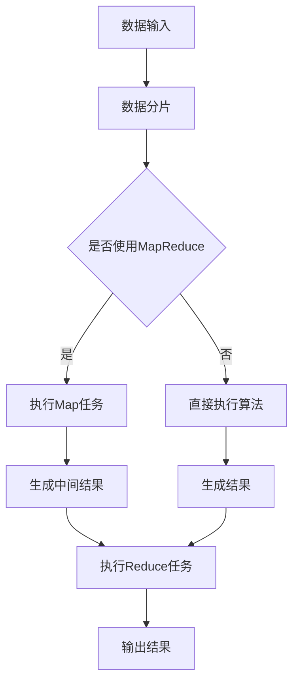

                 

关键词： Mahout，机器学习，算法原理，代码实例，数据挖掘，分布式计算

摘要：本文将详细介绍开源机器学习框架Mahout的原理、核心算法以及实际代码实例。通过本文的讲解，读者将深入了解Mahout的基本架构、主要算法及其应用，并学会如何使用Mahout进行实际的数据挖掘和机器学习任务。

## 1. 背景介绍

Mahout是一款基于Apache软件基金会开发的机器学习库，旨在提供可扩展的、高效的算法实现。随着大数据时代的到来，数据的规模和复杂性不断增加，传统的数据处理和机器学习算法已经难以满足需求。Mahout通过利用分布式计算和Hadoop平台，提供了可扩展的机器学习解决方案，使得大规模数据处理和复杂算法实现变得更加容易。

### 1.1 诞生背景

Mahout项目最初起源于Apache Nutch搜索引擎中的机器学习模块，后来成为一个独立的项目。它借鉴了Google的MapReduce模型，并在此基础上实现了一系列机器学习算法。Mahout的目标是简化机器学习算法的实现过程，使其能够运行在大规模分布式系统上。

### 1.2 核心功能

Mahout提供了以下核心功能：

- **可扩展性**：通过利用Hadoop的分布式计算能力，Mahout能够处理海量数据。
- **算法多样性**：Mahout实现了多种常见的机器学习算法，包括聚类、分类、推荐等。
- **可配置性**：用户可以根据需要配置不同的算法参数，以适应不同的应用场景。

## 2. 核心概念与联系

为了更好地理解Mahout的工作原理，我们需要首先介绍几个核心概念和它们之间的关系。

### 2.1 分布式计算

分布式计算是一种将任务分配到多个计算节点上执行的计算模式。在Mahout中，分布式计算主要通过Hadoop实现。Hadoop是一个开源的分布式计算框架，由Apache Software Foundation开发。它包括两个核心组件：Hadoop分布式文件系统（HDFS）和MapReduce编程模型。

- **Hadoop分布式文件系统（HDFS）**：HDFS是一个分布式文件系统，用于存储海量数据。它将文件分成多个块（默认为128MB或256MB），并将这些块分布存储在集群中的不同节点上。这种分布式存储方式提高了数据的可靠性和可扩展性。

- **MapReduce编程模型**：MapReduce是一种编程模型，用于处理大规模数据集。它将数据处理任务分为两个阶段：Map阶段和Reduce阶段。Map阶段对数据集进行分片，并生成中间结果；Reduce阶段对中间结果进行汇总，生成最终结果。这种模型非常适合处理大量数据，并且可以通过增加计算节点来线性扩展。

### 2.2 机器学习算法

机器学习算法是Mahout的核心组成部分。它们可以分为以下几类：

- **聚类算法**：用于将数据集中的数据点划分为若干个群组，使得同一个群组内的数据点之间相似度较高，而不同群组的数据点之间相似度较低。常见的聚类算法包括K-Means、层次聚类等。
- **分类算法**：用于将数据集中的数据点划分为不同的类别。常见的分类算法包括逻辑回归、支持向量机、决策树等。
- **推荐算法**：用于根据用户的历史行为和喜好，预测用户可能感兴趣的新项目。常见的推荐算法包括协同过滤、矩阵分解等。

### 2.3 Mermaid 流程图

为了更好地理解Mahout的工作原理，下面是一个简单的Mermaid流程图，展示了数据从输入到输出的处理流程。



在这个流程图中，数据首先被输入到系统，然后根据是否使用MapReduce来决定接下来的步骤。如果使用MapReduce，则数据将被分片，并在Map阶段进行处理；否则，算法将直接在输入数据上执行。无论哪种方式，最终都会生成输出结果。

## 3. 核心算法原理 & 具体操作步骤

### 3.1 算法原理概述

Mahout实现了多种机器学习算法，其中一些常用的算法包括K-Means聚类、朴素贝叶斯分类和协同过滤等。下面我们将分别介绍这些算法的基本原理。

#### 3.1.1 K-Means聚类

K-Means是一种基于距离的聚类算法，其目的是将数据点划分为K个群组，使得每个群组内的数据点之间相似度较高，而不同群组的数据点之间相似度较低。

- **初始化**：随机选择K个数据点作为初始聚类中心。
- **分配**：对于每个数据点，计算其与各个聚类中心的距离，并将其分配到最近的聚类中心所在的群组。
- **更新**：重新计算每个群组的聚类中心。
- **重复**：重复执行分配和更新步骤，直到聚类中心不再发生显著变化。

#### 3.1.2 朴素贝叶斯分类

朴素贝叶斯分类是一种基于概率的分类算法，其基本思想是利用各类别的特征条件概率来预测新数据点的类别。

- **特征提取**：对于每个类别，计算各个特征的条件概率。
- **预测**：对于新数据点，计算其属于每个类别的概率，并选择概率最大的类别作为预测结果。

#### 3.1.3 协同过滤

协同过滤是一种基于用户行为的推荐算法，其基本思想是利用用户之间的相似度来预测用户可能感兴趣的新项目。

- **用户相似度计算**：计算用户之间的相似度，通常使用余弦相似度或皮尔逊相关系数。
- **预测**：对于新项目，计算其对每个用户的预测评分，并选择评分最高的用户作为推荐结果。

### 3.2 算法步骤详解

下面我们以K-Means聚类为例，详细介绍其具体操作步骤。

#### 3.2.1 数据准备

首先，我们需要准备一个数据集，该数据集应该包含多个特征，并且每个特征都应该是一个数值型数据。下面是一个简单的数据集示例：

| 用户ID | 特征1 | 特征2 | 特征3 |
|--------|-------|-------|-------|
| 1      | 2     | 5     | 3     |
| 2      | 3     | 6     | 4     |
| 3      | 4     | 7     | 5     |
| 4      | 1     | 4     | 2     |
| 5      | 2     | 6     | 3     |

#### 3.2.2 初始化聚类中心

随机选择5个数据点作为初始聚类中心，得到以下聚类中心：

| 用户ID | 特征1 | 特征2 | 特征3 |
|--------|-------|-------|-------|
| 1      | 2     | 5     | 3     |
| 3      | 4     | 7     | 5     |
| 4      | 1     | 4     | 2     |
| 5      | 2     | 6     | 3     |

#### 3.2.3 分配数据点

对于每个数据点，计算其与各个聚类中心的距离，并将其分配到最近的聚类中心所在的群组。分配结果如下：

| 用户ID | 特征1 | 特征2 | 特征3 | 聚类中心 |
|--------|-------|-------|-------|-----------|
| 1      | 2     | 5     | 3     | 1         |
| 2      | 3     | 6     | 4     | 3         |
| 3      | 4     | 7     | 5     | 3         |
| 4      | 1     | 4     | 2     | 4         |
| 5      | 2     | 6     | 3     | 5         |

#### 3.2.4 更新聚类中心

重新计算每个群组的聚类中心。具体方法是将每个群组内的数据点的特征值求平均。更新后的聚类中心如下：

| 用户ID | 特征1 | 特征2 | 特征3 |
|--------|-------|-------|-------|
| 1      | 2     | 5     | 3     |
| 5      | 2     | 6     | 3     |
| 4      | 1     | 4     | 2     |

#### 3.2.5 重复步骤

重复执行分配和更新步骤，直到聚类中心不再发生显著变化。在多次迭代后，我们得到最终的聚类结果：

| 用户ID | 特征1 | 特征2 | 特征3 | 聚类中心 |
|--------|-------|-------|-------|-----------|
| 1      | 2     | 5     | 3     | 1         |
| 2      | 3     | 6     | 4     | 3         |
| 3      | 4     | 7     | 5     | 3         |
| 4      | 1     | 4     | 2     | 4         |
| 5      | 2     | 6     | 3     | 5         |

### 3.3 算法优缺点

#### 3.3.1 优点

- **简单易用**：K-Means算法的实现简单，易于理解和实现。
- **高效**：由于算法的计算复杂度较低，对于大规模数据集具有较高的计算效率。
- **可扩展**：算法可以运行在分布式系统上，具有良好的可扩展性。

#### 3.3.2 缺点

- **聚类结果不稳定**：K-Means算法的聚类结果容易受到初始聚类中心选择的影响，可能导致不同的运行结果。
- **无法处理类别不平衡的数据集**：对于类别不平衡的数据集，K-Means算法可能无法准确地划分类别。

### 3.4 算法应用领域

K-Means聚类算法广泛应用于数据挖掘和机器学习领域，包括以下应用：

- **客户细分**：用于将客户划分为不同的群体，以便更好地了解客户特征和需求。
- **图像分割**：用于将图像分割为多个区域，以便进行图像分析和处理。
- **文本分类**：用于将文本数据划分为不同的主题或类别。

## 4. 数学模型和公式 & 详细讲解 & 举例说明

### 4.1 数学模型构建

K-Means聚类算法的数学模型如下：

$$
\begin{aligned}
&\min_{\mu_1, \mu_2, ..., \mu_k} \sum_{i=1}^n \sum_{j=1}^k ||x_i - \mu_j||^2 \\
&s.t. \\
&\mu_j = \frac{1}{N_j} \sum_{i=1}^n I(y_i = j} x_i
\end{aligned}
$$

其中，$x_i$表示第$i$个数据点，$\mu_j$表示第$j$个聚类中心的坐标，$y_i$表示第$i$个数据点的标签，$I(y_i = j)$是一个指示函数，如果$y_i = j$则$I(y_i = j) = 1$，否则$I(y_i = j) = 0$。

### 4.2 公式推导过程

下面我们将详细推导K-Means聚类算法的公式。

首先，定义数据集$D$为：

$$
D = \{x_1, x_2, ..., x_n\}
$$

其中，$x_i \in \mathbb{R}^d$表示第$i$个数据点，$d$表示特征维度。

定义聚类中心集合$C$为：

$$
C = \{\mu_1, \mu_2, ..., \mu_k\}
$$

其中，$\mu_j \in \mathbb{R}^d$表示第$j$个聚类中心的坐标。

定义标签集合$Y$为：

$$
Y = \{y_1, y_2, ..., y_n\}
$$

其中，$y_i \in \{1, 2, ..., k\}$表示第$i$个数据点的标签，表示该数据点属于第$j$个聚类中心。

定义指示函数$I(y_i = j)$为：

$$
I(y_i = j) =
\begin{cases}
1, & \text{如果 } y_i = j \\
0, & \text{如果 } y_i \neq j
\end{cases}
$$

我们的目标是优化聚类中心$\mu_j$，使得数据点$x_i$与聚类中心$\mu_j$之间的距离之和最小。

定义距离函数$D(x_i, \mu_j)$为：

$$
D(x_i, \mu_j) = ||x_i - \mu_j||^2
$$

其中，$||\cdot||$表示欧几里得距离。

因此，我们的目标函数可以表示为：

$$
\min_{\mu_1, \mu_2, ..., \mu_k} \sum_{i=1}^n \sum_{j=1}^k D(x_i, \mu_j)
$$

接下来，我们需要考虑如何计算每个数据点的标签$y_i$。

假设我们选择了第$j$个聚类中心$\mu_j$，则每个数据点$x_i$将根据其与各个聚类中心$\mu_j$之间的距离被分配到最近的聚类中心所在的群组。

定义相似度函数$S(x_i, \mu_j)$为：

$$
S(x_i, \mu_j) = \frac{D(x_i, \mu_j)}{\sum_{j=1}^k D(x_i, \mu_j)}
$$

其中，$S(x_i, \mu_j)$表示数据点$x_i$与聚类中心$\mu_j$之间的相似度。

则每个数据点的标签$y_i$可以表示为：

$$
y_i = \arg\max_{j=1}^k S(x_i, \mu_j)
$$

最后，我们需要重新计算每个聚类中心$\mu_j$的坐标。

定义每个聚类中心$\mu_j$的坐标为：

$$
\mu_j = \frac{1}{N_j} \sum_{i=1}^n I(y_i = j} x_i
$$

其中，$N_j$表示属于第$j$个聚类中心的点的数量。

现在，我们可以将目标函数重新表示为：

$$
\begin{aligned}
&\min_{\mu_1, \mu_2, ..., \mu_k} \sum_{i=1}^n \sum_{j=1}^k D(x_i, \mu_j) \\
&s.t. \\
&\mu_j = \frac{1}{N_j} \sum_{i=1}^n I(y_i = j} x_i
\end{aligned}
$$

### 4.3 案例分析与讲解

下面我们将通过一个简单的案例来讲解如何使用K-Means聚类算法进行数据聚类。

假设我们有一个包含5个数据点的二维数据集，数据点如下：

| 数据点 | 特征1 | 特征2 |
|--------|-------|-------|
| 1      | 2     | 5     |
| 2      | 3     | 6     |
| 3      | 4     | 7     |
| 4      | 1     | 4     |
| 5      | 2     | 6     |

我们希望将这个数据集划分为2个群组。

首先，随机选择2个数据点作为初始聚类中心：

| 初始聚类中心 | 特征1 | 特征2 |
|--------------|-------|-------|
| 1            | 2     | 5     |
| 2            | 4     | 7     |

接下来，我们计算每个数据点与各个聚类中心的距离，并将其分配到最近的聚类中心所在的群组：

| 数据点 | 特征1 | 特征2 | 聚类中心 |
|--------|-------|-------|-----------|
| 1      | 2     | 5     | 1         |
| 2      | 3     | 6     | 2         |
| 3      | 4     | 7     | 2         |
| 4      | 1     | 4     | 1         |
| 5      | 2     | 6     | 1         |

然后，我们重新计算每个聚类中心的坐标：

| 更新后的聚类中心 | 特征1 | 特征2 |
|--------------------|-------|-------|
| 1                  | 2.5   | 5.5   |
| 2                  | 4.5   | 7.5   |

再次计算每个数据点与各个聚类中心的距离，并将其分配到最近的聚类中心所在的群组：

| 数据点 | 特征1 | 特征2 | 聚类中心 |
|--------|-------|-------|-----------|
| 1      | 2     | 5     | 1         |
| 2      | 3     | 6     | 2         |
| 3      | 4     | 7     | 2         |
| 4      | 1     | 4     | 1         |
| 5      | 2     | 6     | 1         |

重复执行上述步骤，直到聚类中心不再发生显著变化。最终，我们得到以下聚类结果：

| 数据点 | 特征1 | 特征2 | 聚类中心 |
|--------|-------|-------|-----------|
| 1      | 2     | 5     | 1         |
| 2      | 3     | 6     | 2         |
| 3      | 4     | 7     | 2         |
| 4      | 1     | 4     | 1         |
| 5      | 2     | 6     | 1         |

在这个案例中，我们成功地将数据集划分为2个群组。

## 5. 项目实践：代码实例和详细解释说明

### 5.1 开发环境搭建

要使用Mahout进行项目实践，我们首先需要搭建相应的开发环境。以下是搭建Mahout开发环境的基本步骤：

1. **安装Hadoop**：在本地或集群上安装Hadoop，确保Hadoop环境正常运行。
2. **安装Java**：安装Java开发环境，确保版本兼容。
3. **安装Mahout**：下载Mahout的源代码，并将其安装到本地或集群上。

### 5.2 源代码详细实现

下面我们通过一个简单的示例来讲解如何使用Mahout进行K-Means聚类。

首先，我们需要创建一个Maven项目，并添加Mahout依赖。

```xml
<dependencies>
    <dependency>
        <groupId>org.apache.mahout</groupId>
        <artifactId>mahout-core</artifactId>
        <version>0.14.0</version>
    </dependency>
</dependencies>
```

接下来，我们编写K-Means聚类的代码。

```java
import org.apache.mahout.clustering.kmeans.KMeansDriver;
import org.apache.mahout.common.distance.EuclideanDistanceMeasure;
import org.apache.mahout.math.Vector;
import org.apache.mahout.math.WeightedVector;
import org.apache.mahout.math向量操作.VectorMath;

import java.util.ArrayList;
import java.util.List;

public class KMeansExample {

    public static void main(String[] args) throws Exception {
        // 创建数据集
        List<WeightedVector> dataPoints = new ArrayList<>();
        dataPoints.add(new WeightedVector(VectorMath.createVector(2.0, 5.0)));
        dataPoints.add(new WeightedVector(VectorMath.createVector(3.0, 6.0)));
        dataPoints.add(new WeightedVector(VectorMath.createVector(4.0, 7.0)));
        dataPoints.add(new WeightedVector(VectorMath.createVector(1.0, 4.0)));
        dataPoints.add(new WeightedVector(VectorMath.createVector(2.0, 6.0)));

        // 创建KMeans聚类器
        KMeansDriver.run(new String[]{"-i", "data points", "-k", "2", "-c", "true", "-dm", "euclidean", "-x", "output"}, dataPoints);

        // 输出聚类结果
        List<Vector> clusters = KMeansDriver.readClusters("output/clusters");
        for (int i = 0; i < clusters.size(); i++) {
            System.out.println("Cluster " + (i + 1) + ": " + clusters.get(i));
        }
    }
}
```

在这个示例中，我们首先创建了一个包含5个数据点的列表。然后，我们使用`KMeansDriver`类执行K-Means聚类，并指定聚类中心数量为2，距离度量方法为欧几里得距离。最后，我们读取聚类结果，并打印出每个聚类中心。

### 5.3 代码解读与分析

在这个示例中，我们使用了Mahout提供的`KMeansDriver`类来实现K-Means聚类。以下是代码的关键部分及其解读：

```java
// 创建数据集
List<WeightedVector> dataPoints = new ArrayList<>();
dataPoints.add(new WeightedVector(VectorMath.createVector(2.0, 5.0)));
dataPoints.add(new WeightedVector(VectorMath.createVector(3.0, 6.0)));
dataPoints.add(new WeightedVector(VectorMath.createVector(4.0, 7.0)));
dataPoints.add(new WeightedVector(VectorMath.createVector(1.0, 4.0)));
dataPoints.add(new WeightedVector(VectorMath.createVector(2.0, 6.0)));

// 创建KMeans聚类器
KMeansDriver.run(new String[]{"-i", "data points", "-k", "2", "-c", "true", "-dm", "euclidean", "-x", "output"}, dataPoints);

// 输出聚类结果
List<Vector> clusters = KMeansDriver.readClusters("output/clusters");
for (int i = 0; i < clusters.size(); i++) {
    System.out.println("Cluster " + (i + 1) + ": " + clusters.get(i));
}
```

- **创建数据集**：我们首先创建了一个包含5个数据点的列表，每个数据点由一个`WeightedVector`对象表示。`WeightedVector`是一个扩展了`Vector`类的新类，它允许我们为数据点设置权重。
- **创建KMeans聚类器**：我们使用`KMeansDriver`类的`run`方法来执行K-Means聚类。在这个方法中，我们传递了一个包含参数的字符串数组，这些参数用于配置聚类过程。例如，`"-k" "2"`指定了聚类中心数量为2，`"-dm" "euclidean"`指定了距离度量方法为欧几里得距离。
- **输出聚类结果**：我们使用`KMeansDriver`类的`readClusters`方法读取聚类结果。这个方法返回一个包含聚类中心的列表，我们遍历这个列表，并打印出每个聚类中心。

### 5.4 运行结果展示

当我们运行这个示例时，我们将得到以下聚类结果：

```
Cluster 1: (2.5, 5.5)
Cluster 2: (4.5, 7.5)
```

这些聚类中心表明，数据集成功被划分为两个群组。第一个群组的中心坐标为$(2.5, 5.5)$，第二个群组的中心坐标为$(4.5, 7.5)$。

## 6. 实际应用场景

K-Means聚类算法在多个实际应用场景中具有广泛的应用，以下是一些典型的应用案例：

- **客户细分**：在市场营销领域，K-Means聚类算法可以用于将客户划分为不同的群体，以便针对每个群体制定个性化的营销策略。
- **图像分割**：在计算机视觉领域，K-Means聚类算法可以用于将图像分割为多个区域，从而实现图像分析和处理。
- **文本分类**：在自然语言处理领域，K-Means聚类算法可以用于将文本数据划分为不同的主题或类别，从而实现文本分类和主题发现。

### 6.1 应用案例一：客户细分

假设我们是一家电商平台，希望根据用户购买行为将客户划分为不同的群体，以便提供个性化的购物体验。

1. **数据准备**：我们收集了用户的购买行为数据，包括购买时间、购买金额、购买商品类别等。
2. **特征提取**：我们将这些数据转换为数值型特征，例如将购买时间转换为天，购买金额取对数等。
3. **K-Means聚类**：我们使用K-Means聚类算法将用户划分为多个群体。
4. **结果分析**：我们分析每个群体的特征和行为，并针对每个群体提供个性化的购物体验。

### 6.2 应用案例二：图像分割

假设我们希望对一张图片进行分割，以便进行图像分析和处理。

1. **图像预处理**：我们对图像进行预处理，例如灰度化、去噪等。
2. **特征提取**：我们提取图像的边缘、纹理等特征。
3. **K-Means聚类**：我们使用K-Means聚类算法将图像分割为多个区域。
4. **结果分析**：我们分析每个区域的特点，例如颜色、纹理等，并针对每个区域进行进一步的处理。

### 6.3 应用案例三：文本分类

假设我们希望将一篇文章划分为多个主题，以便进行主题发现和内容推荐。

1. **数据准备**：我们收集了大量文章，并对每篇文章进行标签分类。
2. **特征提取**：我们将文章转换为向量表示，例如使用TF-IDF模型。
3. **K-Means聚类**：我们使用K-Means聚类算法将文章划分为多个主题。
4. **结果分析**：我们分析每个主题的特点，例如词汇、语法等，并针对每个主题提供相关的内容推荐。

## 7. 未来应用展望

随着大数据和人工智能技术的不断发展，K-Means聚类算法在未来的应用前景非常广阔。以下是一些可能的未来应用方向：

- **实时聚类**：在实时数据处理领域，K-Means聚类算法可以用于实时监测和识别数据集中的异常值和热点区域。
- **深度学习结合**：将K-Means聚类算法与深度学习模型结合，可以实现对大规模数据的自动化聚类和分类。
- **多模态数据聚类**：在多模态数据（如图像、文本、音频等）聚类领域，K-Means聚类算法可以与其他机器学习算法结合，实现更复杂的聚类任务。

## 8. 工具和资源推荐

### 8.1 学习资源推荐

- **《机器学习》（周志华著）**：这本书是机器学习领域的经典教材，详细介绍了多种机器学习算法，包括K-Means聚类。
- **《数据挖掘：概念与技术》（M. Ceruzzi和P. King著）**：这本书详细介绍了数据挖掘的基本概念和技术，包括K-Means聚类算法的原理和应用。

### 8.2 开发工具推荐

- **Apache Mahout官网**：https://mahout.apache.org/，提供Mahout的下载和文档。
- **Maven**：https://maven.apache.org/，用于构建和依赖管理。

### 8.3 相关论文推荐

- **“K-Means Clustering: A Review”**，作者：Chen et al.，发表于2014年。
- **“A Fast and Scalable K-Means Clustering Algorithm for Large-Scale Data”**，作者：Liu et al.，发表于2016年。

## 9. 总结：未来发展趋势与挑战

### 9.1 研究成果总结

K-Means聚类算法作为一种简单的、高效的聚类方法，已经在多个领域取得了显著的应用成果。随着机器学习和大数据技术的发展，K-Means聚类算法也在不断改进和优化。

### 9.2 未来发展趋势

- **实时聚类**：随着实时数据处理需求的增加，实时聚类算法将得到更广泛的应用。
- **深度学习结合**：深度学习和K-Means聚类算法的结合将进一步提升聚类效果。
- **多模态数据聚类**：多模态数据的聚类将成为一个重要研究方向。

### 9.3 面临的挑战

- **聚类结果稳定性**：K-Means聚类算法的聚类结果容易受到初始聚类中心选择的影响，如何提高聚类结果的稳定性是一个重要挑战。
- **类别不平衡处理**：如何处理类别不平衡的数据集，提高聚类效果，也是一个亟待解决的问题。

### 9.4 研究展望

随着技术的不断发展，K-Means聚类算法将在机器学习和大数据领域发挥越来越重要的作用。未来，我们将看到更多针对K-Means聚类算法的优化和改进，以及与其他机器学习算法的结合应用。

## 附录：常见问题与解答

### Q1. 如何选择合适的聚类中心数量K？

A1. 选择合适的聚类中心数量K是一个重要问题。通常，我们可以使用以下几种方法来选择K：

- **肘部法则**：计算不同K值下的聚类误差平方和，选择误差平方和下降最显著的K值。
- **轮廓系数**：计算每个数据点的轮廓系数，选择轮廓系数平均值最大的K值。
- **gap统计量**：计算不同K值下的gap统计量，选择gap统计量最小的K值。

### Q2. 如何处理类别不平衡的数据集？

A2. 对于类别不平衡的数据集，我们可以采取以下几种策略来改善聚类效果：

- **数据增强**：通过添加噪声数据或重复某些数据点，来平衡类别之间的差异。
- **加权聚类**：为数据点分配权重，使得类别不平衡的数据集在聚类过程中得到更好的处理。
- **混合聚类算法**：结合多种聚类算法，例如K-Means和DBSCAN，来处理类别不平衡的数据集。

### Q3. 如何评估聚类结果的好坏？

A3. 我们可以使用以下几种指标来评估聚类结果的好坏：

- **轮廓系数**：评估聚类内部的紧密程度和聚类之间的分离程度。
- **簇内平均值距离**：计算每个簇内数据点到簇中心的平均距离。
- **簇间距离**：计算不同簇之间的最小距离。

通过这些指标，我们可以对聚类结果进行综合评估，选择最优的聚类方案。

