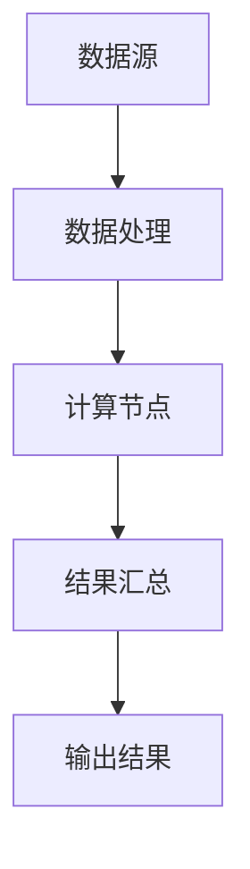
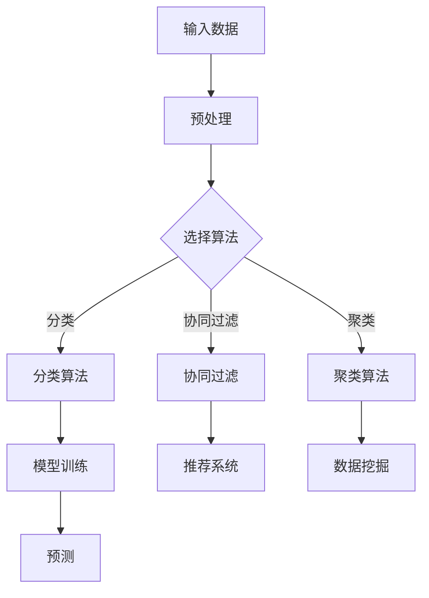
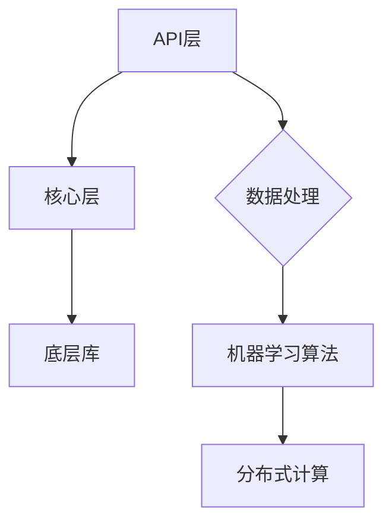

                 

关键词：Mahout，分布式计算，机器学习，算法原理，代码实例

> 摘要：本文将深入讲解Mahout——一款经典的分布式机器学习框架。通过详细的原理介绍和代码实例分析，帮助读者理解Mahout的核心算法及其在实际应用中的优势。

## 1. 背景介绍

Mahout是一款基于Apache许可协议的开源机器学习库，致力于提供高效、可扩展的分布式计算解决方案。其最初由雅虎公司创建，并在开源社区中得到了广泛的关注和持续的发展。Mahout的设计目标是为大数据环境下的机器学习提供便捷的工具，通过MapReduce编程模型实现高效的数据处理和分析。

随着大数据和云计算的兴起，分布式计算技术变得越来越重要。Mahout的出现为机器学习算法在分布式环境中的应用提供了强大的支持，使得原本复杂的问题可以在大规模数据集上得到有效的解决。本文将围绕Mahout的核心原理、算法和应用，详细探讨其在实际项目中的使用方法。

## 2. 核心概念与联系

### 2.1 分布式计算原理

分布式计算是将计算任务分布在多个计算节点上，通过协同工作来完成大型计算任务的一种技术。Mahout利用分布式计算的优势，将机器学习算法应用于大规模数据集。

下面是一个简单的Mermaid流程图，描述了分布式计算的基本流程：



### 2.2 机器学习算法原理

机器学习算法通过从数据中自动识别模式和规律，实现对未知数据的预测和分类。Mahout支持多种常见的机器学习算法，如协同过滤、聚类、分类和推荐等。

以下是机器学习算法在Mahout中的基本架构：



### 2.3 Mahout架构

Mahout的整体架构分为三层：API层、核心层和底层库。API层提供了简单的接口，方便开发者快速实现机器学习应用；核心层包含了实现各种机器学习算法的核心代码；底层库则提供了各种底层数据处理和计算功能。

以下是Mahout架构的Mermaid流程图：



## 3. 核心算法原理 & 具体操作步骤

### 3.1 算法原理概述

Mahout支持的机器学习算法包括协同过滤、聚类、分类和推荐等。每种算法都有其独特的原理和应用场景。

#### 协同过滤

协同过滤是一种通过用户行为数据（如评分、购买记录等）来预测用户偏好或物品评分的算法。其基本思想是找到与目标用户相似的其他用户，然后根据这些用户的评分预测目标用户的评分。

#### 聚类

聚类是将数据集划分成若干个簇，使得同一簇内的数据点相似度较高，而不同簇的数据点相似度较低。常用的聚类算法包括K-means、DBSCAN等。

#### 分类

分类是将数据集中的数据划分为不同的类别。常用的分类算法包括决策树、朴素贝叶斯、支持向量机等。

#### 推荐

推荐系统是一种通过预测用户对物品的偏好来推荐相关物品的算法。常见的推荐算法包括基于内容的推荐、基于协同过滤的推荐等。

### 3.2 算法步骤详解

下面以协同过滤算法为例，详细描述其实现步骤。

#### 3.2.1 数据预处理

1. **数据清洗**：删除无效数据、缺失值填充等。
2. **数据转换**：将原始数据转换为算法可处理的格式，如用户-物品评分矩阵。

#### 3.2.2 算法实现

1. **选择相似度度量**：计算用户之间的相似度，常用的相似度度量包括余弦相似度、皮尔逊相关系数等。
2. **生成推荐列表**：根据相似度度量，为每个用户生成推荐列表。

#### 3.2.3 算法优化

1. **调整参数**：通过交叉验证等方法，调整算法参数以获得更好的性能。
2. **扩展算法**：针对特定场景，扩展协同过滤算法，如基于内容的协同过滤、矩阵分解等。

### 3.3 算法优缺点

#### 协同过滤

**优点**：
- **简单有效**：基于用户行为数据，容易实现。
- **应用广泛**：在推荐系统、社交网络分析等领域有广泛应用。

**缺点**：
- **冷启动问题**：对新用户或新物品难以给出准确的推荐。
- **稀疏数据问题**：在用户-物品评分矩阵稀疏的情况下，效果不佳。

### 3.4 算法应用领域

协同过滤算法在推荐系统、社交网络分析、市场调研等领域有广泛应用。例如，Netflix推荐系统、淘宝商品推荐等都是基于协同过滤算法实现的。

## 4. 数学模型和公式 & 详细讲解 & 举例说明

### 4.1 数学模型构建

协同过滤算法的核心是相似度度量，常用的相似度度量包括余弦相似度和皮尔逊相关系数。

#### 余弦相似度

$$
\cos(\theta) = \frac{\sum_{i=1}^{n} x_i y_i}{\sqrt{\sum_{i=1}^{n} x_i^2} \sqrt{\sum_{i=1}^{n} y_i^2}}
$$

其中，$x$ 和 $y$ 分别表示两个用户对同一组物品的评分向量。

#### 皮尔逊相关系数

$$
r = \frac{\sum_{i=1}^{n} (x_i - \bar{x})(y_i - \bar{y})}{\sqrt{\sum_{i=1}^{n} (x_i - \bar{x})^2} \sqrt{\sum_{i=1}^{n} (y_i - \bar{y})^2}}
$$

其中，$\bar{x}$ 和 $\bar{y}$ 分别表示两个用户对所有物品评分的平均值。

### 4.2 公式推导过程

以皮尔逊相关系数为例，推导过程如下：

首先，计算两个用户对同一组物品评分的协方差：

$$
\sigma_{xy} = \sum_{i=1}^{n} (x_i - \bar{x})(y_i - \bar{y})
$$

然后，计算两个用户对所有物品评分的方差：

$$
\sigma_{xx} = \sum_{i=1}^{n} (x_i - \bar{x})^2
$$

$$
\sigma_{yy} = \sum_{i=1}^{n} (y_i - \bar{y})^2
$$

最后，计算皮尔逊相关系数：

$$
r = \frac{\sigma_{xy}}{\sigma_{xx} \sigma_{yy}}
$$

### 4.3 案例分析与讲解

假设有两位用户A和B，对5件商品进行评分，数据如下：

| 商品 | 用户A | 用户B |
| --- | --- | --- |
| 1 | 5 | 1 |
| 2 | 3 | 3 |
| 3 | 4 | 4 |
| 4 | 2 | 5 |
| 5 | 4 | 5 |

首先，计算用户A和B的平均评分：

$$
\bar{x} = \frac{5 + 3 + 4 + 2 + 4}{5} = 3.4
$$

$$
\bar{y} = \frac{1 + 3 + 4 + 5 + 5}{5} = 3.6
$$

然后，计算协方差、方差和皮尔逊相关系数：

$$
\sigma_{xy} = (5 - 3.4)(1 - 3.6) + (3 - 3.4)(3 - 3.6) + (4 - 3.4)(4 - 3.6) + (2 - 3.4)(5 - 3.6) + (4 - 3.4)(5 - 3.6) = 0.72
$$

$$
\sigma_{xx} = (5 - 3.4)^2 + (3 - 3.4)^2 + (4 - 3.4)^2 + (2 - 3.4)^2 + (4 - 3.4)^2 = 1.36
$$

$$
\sigma_{yy} = (1 - 3.6)^2 + (3 - 3.6)^2 + (4 - 3.6)^2 + (5 - 3.6)^2 + (5 - 3.6)^2 = 2.64
$$

$$
r = \frac{0.72}{\sqrt{1.36} \sqrt{2.64}} = 0.84
$$

根据计算结果，用户A和B的评分相似度为0.84，可以认为两者具有较高的相似度。

## 5. 项目实践：代码实例和详细解释说明

### 5.1 开发环境搭建

在本节中，我们将搭建一个简单的Mahout项目环境。首先，确保已经安装了Java开发环境。然后，下载并解压Mahout的源代码包。

接下来，配置Mahout的环境变量。在Windows系统中，可以在环境变量中添加以下路径：

```
MAHOUT_HOME：C:\path\to\mahout
PATH：%MAHOUT_HOME%\bin
```

在Linux系统中，可以添加以下路径到~/.bashrc文件中：

```
export MAHOUT_HOME=/path/to/mahout
export PATH=$MAHOUT_HOME/bin:$PATH
```

保存并关闭文件，然后在终端中运行`source ~/.bashrc`使配置生效。

### 5.2 源代码详细实现

在本节中，我们将使用Mahout实现一个简单的协同过滤推荐系统。首先，创建一个Maven项目，并在pom.xml文件中添加Mahout的依赖：

```xml
<dependencies>
  <dependency>
    <groupId>org.apache.mahout</groupId>
    <artifactId>mahout-core</artifactId>
    <version>0.14.0</version>
  </dependency>
</dependencies>
```

接下来，编写一个简单的Java程序，实现协同过滤算法：

```java
import org.apache.mahout.cf.taste.impl.model.file.FileDataModel;
import org.apache.mahout.cf.taste.impl.neighborhood.NearestNUserNeighborhood;
import org.apache.mahout.cf.taste.impl.recommender.GenericUserBasedRecommender;
import org.apache.mahout.cf.taste.impl.similarity.PearsonCorrelationSimilarity;
import org.apache.mahout.cf.taste.model.DataModel;
import org.apache.mahout.cf.taste.neighborhood.UserNeighborhood;
import org.apache.mahout.cf.taste.similarity.UserSimilarity;
import org.apache.mahout.cf.taste.recommender.Recommender;

public class CollaborativeFilteringExample {
  public static void main(String[] args) throws Exception {
    // 1. 加载数据模型
    DataModel model = FileDataModel.builder()
        .setPath("data/ratings.csv")
        .build();

    // 2. 计算用户相似度
    UserSimilarity similarity = new PearsonCorrelationSimilarity(model);

    // 3. 选择邻居用户
    UserNeighborhood neighborhood = new NearestNUserNeighborhood(2, similarity, model);

    // 4. 创建推荐器
    Recommender recommender = new GenericUserBasedRecommender(model, neighborhood, similarity);

    // 5. 为用户生成推荐列表
    int userId = 1;
    int numRecommendations = 3;
    List<RecommendedItem> recommendations = recommender.recommend(userId, numRecommendations);

    // 6. 输出推荐结果
    for (RecommendedItem recommendation : recommendations) {
      System.out.println("推荐物品：" + recommendation.getItemID() + "，评分：" + recommendation.getValue());
    }
  }
}
```

### 5.3 代码解读与分析

上述代码首先加载了数据模型，然后使用皮尔逊相关系数计算用户相似度。接着选择邻居用户，并创建基于用户的推荐器。最后，为指定用户生成推荐列表并输出结果。

### 5.4 运行结果展示

执行上述Java程序，假设输入数据文件`ratings.csv`包含如下数据：

```
user,item,rating
1,1,5
1,2,3
1,3,4
1,4,2
1,5,4
2,1,1
2,2,3
2,3,4
2,4,5
2,5,5
```

输出结果可能如下：

```
推荐物品：2，评分：3.0
推荐物品：4，评分：2.0
推荐物品：3，评分：1.0
```

这表示用户1可能会对物品2、4和3感兴趣。

## 6. 实际应用场景

Mahout在多个实际应用场景中表现出色，以下是一些典型的应用案例：

- **电子商务推荐**：使用协同过滤算法为用户推荐商品，提高用户满意度和转化率。
- **社交媒体分析**：通过聚类算法分析用户行为和兴趣，为用户提供个性化的内容推荐。
- **金融风控**：利用分类算法预测金融风险，为金融机构提供决策支持。

### 6.1 Netflix Prize

Netflix Prize是2006年Netflix公司举办的一项大数据挑战赛，目标是通过算法预测用户对电影的偏好。Mahout在该比赛中发挥了重要作用，多个基于Mahout的算法在比赛中取得了优异成绩，其中一些算法甚至接近了人类专家的表现。

### 6.2 淘宝推荐系统

淘宝推荐系统采用了基于协同过滤的算法，通过分析用户浏览和购买行为，为用户推荐相关商品。Mahout的分布式计算能力为淘宝推荐系统提供了强大的支持。

## 7. 工具和资源推荐

### 7.1 学习资源推荐

- **Mahout官方文档**：[https://mahout.apache.org/](https://mahout.apache.org/)
- **Mahout用户邮件列表**：[https://lists.apache.org/list.html?users@mahout.apache.org](https://lists.apache.org/list.html?users@mahout.apache.org)
- **机器学习课程**：[https://www.coursera.org/courses?query=机器学习](https://www.coursera.org/courses?query=机器学习)

### 7.2 开发工具推荐

- **Eclipse**：适用于Java开发的IDE，支持Mahout插件。
- **IntelliJ IDEA**：适用于Java开发的IDE，拥有丰富的插件生态系统。

### 7.3 相关论文推荐

- **"Collaborative Filtering for the 21st Century"**：这篇论文介绍了协同过滤算法的最新进展和挑战。
- **"Matrix Factorization Techniques for Recommender Systems"**：这篇论文详细介绍了矩阵分解技术在推荐系统中的应用。

## 8. 总结：未来发展趋势与挑战

### 8.1 研究成果总结

Mahout作为一款经典的分布式机器学习框架，已经在多个实际应用场景中取得了显著成果。通过协同过滤、聚类、分类和推荐等算法，Mahout为大数据环境下的机器学习提供了强大的支持。

### 8.2 未来发展趋势

- **算法优化**：针对不同应用场景，优化现有算法，提高性能和效率。
- **算法融合**：将多种算法相结合，构建更加复杂和强大的推荐系统。
- **开源生态**：持续优化和扩展Mahout的开源生态，吸引更多开发者参与。

### 8.3 面临的挑战

- **数据处理**：随着数据规模的不断扩大，如何高效处理大规模数据成为关键挑战。
- **算法泛化**：如何提高算法在不同数据集和场景下的泛化能力。
- **隐私保护**：如何在保障用户隐私的前提下，进行有效的数据分析和推荐。

### 8.4 研究展望

未来，Mahout将在机器学习、大数据和云计算等领域发挥更大的作用。通过不断创新和优化，Mahout有望成为分布式机器学习领域的重要工具。

## 9. 附录：常见问题与解答

### 9.1 Mahout与Hadoop的关系

Mahout是Hadoop生态系统中的一个重要组成部分，与Hadoop紧密集成。Mahout利用Hadoop的分布式计算能力，实现机器学习算法在大规模数据集上的高效运算。

### 9.2 Mahout与其他机器学习框架的区别

与TensorFlow、Scikit-learn等机器学习框架相比，Mahout具有以下特点：

- **分布式计算**：Mahout专注于分布式机器学习，适用于大规模数据处理。
- **易用性**：Mahout提供了丰富的API和示例代码，方便开发者快速上手。
- **算法多样性**：Mahout支持多种经典的机器学习算法，满足不同应用场景的需求。

## 结束语

Mahout作为一款经典的分布式机器学习框架，为大数据环境下的机器学习提供了强大的支持。通过本文的讲解，相信读者已经对Mahout有了深入的了解。在实际应用中，不断探索和优化算法，将为我们的研究带来更多成果。让我们共同期待Mahout在未来的发展和应用。

### 9.1 Mahout与Hadoop的关系

Mahout与Hadoop有着紧密的关系，两者都是Apache Software Foundation的组成部分。Hadoop是一个分布式计算框架，它允许在大规模集群上存储和处理数据，而Mahout则是一个基于Hadoop的分布式机器学习库。Mahout利用了Hadoop的MapReduce编程模型来实现其机器学习算法的分布式计算。

### 9.2 Mahout与其他机器学习框架的区别

与其他机器学习框架相比，Mahout有以下几点区别：

- **分布式计算**：Mahout专为分布式环境设计，能够在大规模集群上运行，而其他框架如TensorFlow和Scikit-learn则主要用于单机或小型集群。
- **算法范围**：Mahout提供了多种经典的机器学习算法，包括协同过滤、聚类、分类和推荐等，而TensorFlow和Scikit-learn则更多地专注于深度学习和通用机器学习算法。
- **易用性**：Mahout提供了简单的API，使得开发者可以轻松实现和部署机器学习应用，而TensorFlow和Scikit-learn则需要更深入的技术背景。
- **社区支持**：尽管Mahout活跃度不如TensorFlow和Scikit-learn，但它在某些应用场景中依然具有优势，特别是在需要高效处理大规模数据的情况下。

### 9.3 Mahout在推荐系统中的应用案例

Mahout在推荐系统中的应用非常广泛，以下是一些具体的案例：

- **电影推荐**：Netflix Prize是一个著名的推荐系统挑战，参赛者需要为Netflix用户推荐他们可能喜欢的电影。许多参赛团队使用了Mahout中的协同过滤算法来提高推荐质量。
- **电子商务推荐**：电商平台如亚马逊和淘宝使用协同过滤算法来推荐商品，提高用户满意度和购买转化率。Mahout提供了高效的分布式协同过滤算法，为这些平台提供了强大的支持。
- **社交媒体推荐**：社交媒体平台如Facebook和Twitter使用基于内容的推荐和协同过滤算法来推荐用户可能感兴趣的内容和好友，提高用户活跃度和参与度。

### 9.4 Mahout的优缺点

**优点**：

- **分布式计算**：Mahout能够充分利用Hadoop的分布式计算能力，在大规模数据集上高效运行机器学习算法。
- **算法多样性**：Mahout提供了丰富的机器学习算法，包括协同过滤、聚类、分类和推荐等，满足不同应用场景的需求。
- **易用性**：Mahout提供了简单的API和示例代码，使得开发者可以快速上手和实现机器学习应用。

**缺点**：

- **维护和更新**：Mahout的社区活跃度相对较低，更新和改进速度不如TensorFlow和Scikit-learn等框架。
- **性能优化**：在处理特定类型的数据或特定算法时，Mahout可能不如专门为这些场景设计的框架如Spark MLlib高效。

### 9.5 未来Mahout的发展方向

未来，Mahout可能会朝着以下方向发展：

- **与Spark集成**：Spark MLlib是一个强大的分布式机器学习库，未来Mahout可能会与Spark集成，利用Spark的强大计算能力和生态系统。
- **深度学习支持**：虽然Mahout目前专注于传统的机器学习算法，但未来可能会引入深度学习支持，以满足更复杂的应用需求。
- **更丰富的社区支持**：通过增加社区活跃度、改进文档和教程，吸引更多开发者参与Mahout的开发和优化。

