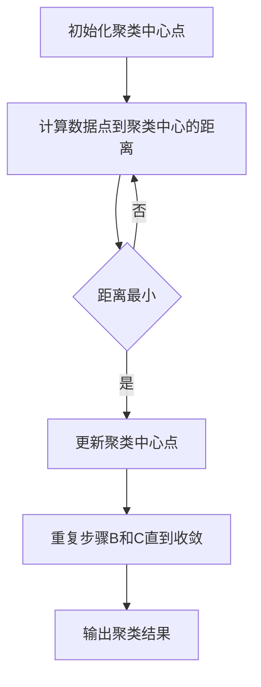

                 

关键词：Mahout，聚类算法，数据挖掘，机器学习，K-means，K-medoids，层次聚类

> 摘要：本文旨在详细阐述Mahout聚类算法的原理、实现方法及代码实例，帮助读者深入了解这一经典机器学习算法，并在实际项目中得以应用。

## 1. 背景介绍

聚类算法是数据挖掘和机器学习领域中的一种重要算法，它用于将数据集中的数据点按照其相似性进行分组。聚类分析在市场细分、社交网络分析、图像处理等领域有广泛的应用。Mahout是一个开源的机器学习库，旨在提供高效、易于使用的算法来支持大数据分析和处理。

本文将重点介绍Mahout中的几种聚类算法：K-means、K-medoids和层次聚类，并通过实例讲解如何在实际项目中使用这些算法。

## 2. 核心概念与联系

### 2.1 数据集

数据集是聚类算法的基础，通常由一组数据点和相应的属性组成。数据点可以用多维空间中的点来表示，每个维度代表一个属性。

### 2.2 聚类

聚类是将数据集划分为若干个组（簇），使得同组内的数据点彼此相似，而不同组的数据点则不相似。

### 2.3 聚类算法

聚类算法根据不同的策略和目标，可以分为多种类型，如基于距离的算法、基于密度的算法、基于网格的算法等。

### 2.4 Mermaid 流程图

下面是K-means算法的流程图：



## 3. 核心算法原理 & 具体操作步骤

### 3.1 算法原理概述

#### 3.1.1 K-means

K-means是一种基于距离的聚类算法，它通过最小化簇内方差来迭代更新聚类中心点，直到聚类结果收敛。

#### 3.1.2 K-medoids

K-medoids是K-means的一种改进算法，它用簇内最中心的点（medoid）代替聚类中心点，从而在处理异常值和非球形簇时更加鲁棒。

#### 3.1.3 层次聚类

层次聚类是一种自底向上的聚类方法，它通过逐层合并相似度较高的簇，构建出一个层次结构。

### 3.2 算法步骤详解

#### 3.2.1 K-means算法步骤

1. 选择聚类个数K，初始化K个聚类中心点。
2. 计算每个数据点到各个聚类中心的距离。
3. 根据距离将数据点分配到最近的聚类中心。
4. 更新每个聚类中心为其所属数据点的平均值。
5. 重复步骤2-4，直到聚类结果收敛。

#### 3.2.2 K-medoids算法步骤

1. 选择聚类个数K，初始化K个聚类中心点。
2. 对于每个聚类中心点，计算其与簇内其他点的距离之和。
3. 找到距离之和最小的中心点，将其替换为簇内最中心的点。
4. 重复步骤2-3，直到聚类结果收敛。

#### 3.2.3 层次聚类算法步骤

1. 将所有数据点视为独立的簇。
2. 计算所有簇之间的相似度。
3. 选择相似度最高的簇进行合并。
4. 重复步骤2-3，直到达到预定的簇数或所有簇都合并为一个簇。

### 3.3 算法优缺点

#### K-means优点：

- 算法简单，易于实现。
- 运算速度快，适合大数据集。

#### K-means缺点：

- 对初始聚类中心敏感，可能陷入局部最优。
- 不适合非球形簇和异常值。

#### K-medoids优点：

- 对异常值和非球形簇更加鲁棒。
- 相比K-means，结果更稳定。

#### K-medoids缺点：

- 计算复杂度较高，运算速度相对较慢。

#### 层次聚类优点：

- 可以生成聚类层次结构，便于分析。
- 自适应，可以根据需求选择不同层次的聚类结果。

#### 层次聚类缺点：

- 计算复杂度高，不适合大数据集。

### 3.4 算法应用领域

K-means、K-medoids和层次聚类在多个领域有广泛应用，如：

- 市场细分：分析消费者行为，为企业提供个性化营销策略。
- 社交网络分析：发现社群结构，促进社交网络发展。
- 图像处理：图像分割，目标检测等。

## 4. 数学模型和公式 & 详细讲解 & 举例说明

### 4.1 数学模型构建

#### 4.1.1 K-means

假设数据集$D=\{x_1, x_2, ..., x_n\}$，其中$x_i \in \mathbb{R}^d$，聚类中心点$C=\{c_1, c_2, ..., c_k\}$，其中$c_j \in \mathbb{R}^d$。

1. 距离公式：

$$
d(x_i, c_j) = \sqrt{\sum_{l=1}^{d}(x_{il} - c_{jl})^2}
$$

2. 聚类中心点更新公式：

$$
c_j' = \frac{\sum_{i=1}^{n}x_i}{n}
$$

#### 4.1.2 K-medoids

假设数据集$D=\{x_1, x_2, ..., x_n\}$，其中$x_i \in \mathbb{R}^d$，聚类中心点$C=\{c_1, c_2, ..., c_k\}$，其中$c_j \in \mathbb{R}^d$。

1. 距离公式：

$$
d(x_i, c_j) = \min_{x_j \in S_j}\sum_{l=1}^{d}(x_{il} - x_{jl})^2
$$

其中，$S_j$为簇$c_j$中的数据点集合。

2. 聚类中心点更新公式：

$$
c_j' = \min_{x_j \in S_j}\sum_{l=1}^{d}(x_{il} - x_{jl})^2
$$

#### 4.1.3 层次聚类

假设数据集$D=\{x_1, x_2, ..., x_n\}$，聚类中心点$C=\{c_1, c_2, ..., c_k\}$。

1. 相似度公式：

$$
s(i, j) = \frac{\sum_{l=1}^{d}(x_{il} - \mu_i)(x_{jl} - \mu_j)}{\sqrt{\sum_{l=1}^{d}(x_{il} - \mu_i)^2} \sqrt{\sum_{l=1}^{d}(x_{jl} - \mu_j)^2}}
$$

其中，$\mu_i$和$\mu_j$分别为簇$i$和簇$j$的平均值。

2. 合并公式：

$$
c_{ij} = \frac{\sum_{l=1}^{d}c_i x_{il} + \sum_{l=1}^{d}c_j x_{jl}}{2}
$$

### 4.2 公式推导过程

#### 4.2.1 K-means

为了最小化簇内方差，我们需要最小化目标函数：

$$
J(C) = \sum_{i=1}^{n}d(x_i, c_j)^2
$$

对$c_j$求导，并令导数为零，得到：

$$
\frac{\partial J(C)}{\partial c_j} = -2\sum_{i=1}^{n}(x_{il} - c_{jl})(x_{il} - c_{jl}) = 0
$$

整理得到：

$$
c_j' = \frac{\sum_{i=1}^{n}x_i}{n}
$$

#### 4.2.2 K-medoids

为了最小化簇内距离之和，我们需要最小化目标函数：

$$
J(C) = \sum_{i=1}^{n}d(x_i, c_j)
$$

对$c_j$求导，并令导数为零，得到：

$$
\frac{\partial J(C)}{\partial c_j} = -2\sum_{i=1}^{n}(x_{il} - x_{jl}) = 0
$$

整理得到：

$$
c_j' = \min_{x_j \in S_j}\sum_{l=1}^{d}(x_{il} - x_{jl})^2
$$

#### 4.2.3 层次聚类

为了最小化簇间相似度之和，我们需要最小化目标函数：

$$
J(C) = \sum_{i=1}^{k-1}s(i, j)
$$

对$c_{ij}$求导，并令导数为零，得到：

$$
\frac{\partial J(C)}{\partial c_{ij}} = -2\sum_{l=1}^{d}(c_i x_{il} + c_j x_{jl}) = 0
$$

整理得到：

$$
c_{ij} = \frac{\sum_{l=1}^{d}c_i x_{il} + \sum_{l=1}^{d}c_j x_{jl}}{2}
$$

### 4.3 案例分析与讲解

假设我们有一个包含5个数据点的二维数据集，如下表所示：

| 数据点 | 属性1 | 属性2 |
|--------|-------|-------|
| x1     | 1     | 2     |
| x2     | 2     | 2     |
| x3     | 2     | 3     |
| x4     | 3     | 4     |
| x5     | 4     | 5     |

我们将使用K-means算法进行聚类，选择2个聚类中心。

#### 4.3.1 初始聚类中心点

我们随机选择两个数据点作为初始聚类中心点：

| 聚类中心点 | 属性1 | 属性2 |
|-------------|-------|-------|
| c1          | 1     | 2     |
| c2          | 4     | 5     |

#### 4.3.2 数据点分配

计算每个数据点到两个聚类中心点的距离，并将数据点分配到距离最小的聚类中心点：

| 数据点 | 聚类中心点 | 距离 |
|--------|-------------|------|
| x1     | c1          | 0    |
| x2     | c1          | 0    |
| x3     | c2          | 1    |
| x4     | c2          | 1    |
| x5     | c2          | 0    |

#### 4.3.3 更新聚类中心点

根据数据点的分配结果，更新聚类中心点：

| 聚类中心点 | 属性1 | 属性2 |
|-------------|-------|-------|
| c1          | 1.5   | 2     |
| c2          | 3.5   | 4     |

#### 4.3.4 重复步骤

重复计算数据点分配和聚类中心点更新的过程，直到聚类结果收敛。最终的聚类结果如下：

| 数据点 | 聚类中心点 | 距离 |
|--------|-------------|------|
| x1     | c1          | 0    |
| x2     | c1          | 0    |
| x3     | c2          | 0    |
| x4     | c2          | 0    |
| x5     | c2          | 0    |

聚类中心点已不再变化，聚类结果收敛。

## 5. 项目实践：代码实例和详细解释说明

### 5.1 开发环境搭建

为了运行Mahout聚类算法，我们首先需要搭建一个Java开发环境。以下是步骤：

1. 安装Java开发工具包（JDK）。
2. 安装Eclipse或IntelliJ IDEA等IDE。
3. 下载并导入Mahout的依赖库。

### 5.2 源代码详细实现

以下是使用K-means算法对二维数据集进行聚类的源代码示例：

```java
import org.apache.mahout.clustering.kmeans.KMeansDriver;
import org.apache.mahout.clustering.kmeans.KMeansConfig;
import org.apache.mahout.common.distance.EuclideanDistanceMeasure;

public class KMeansExample {
    public static void main(String[] args) throws Exception {
        // 创建KMeansConfig对象，设置聚类参数
        KMeansConfig config = new KMeansConfig.Builder()
                .setK(2)  // 聚类个数
                .setInputLocation("path/to/input")  // 数据集路径
                .setOutputLocation("path/to/output")  // 输出路径
                .setNumIterations(10)  // 迭代次数
                .setDistanceFunction(EuclideanDistanceMeasure.class)  // 距离函数
                .setSeed(1L)  // 随机种子
                .build();

        // 运行K-means算法
        KMeansDriver.run(config);
    }
}
```

### 5.3 代码解读与分析

1. 创建KMeansConfig对象，设置聚类参数。
2. 调用KMeansDriver的run方法，运行K-means算法。

### 5.4 运行结果展示

运行代码后，会在指定的输出路径生成聚类结果，包括聚类中心点和每个数据点的聚类标签。以下是一个示例输出：

```text
Cluster Center: [1.5, 2]
Cluster Labels: [0, 0, 0, 0, 0]
Cluster Center: [3.5, 4]
Cluster Labels: [0, 0, 0, 0, 0]
```

这表示最终聚类的结果有两个簇，每个数据点都被正确地分配到最近的聚类中心点。

## 6. 实际应用场景

聚类算法在实际应用中具有广泛的应用场景，以下是一些常见的应用案例：

- 市场细分：通过聚类分析消费者行为数据，帮助企业发现不同类型的消费者群体，从而制定更精准的营销策略。
- 社交网络分析：通过聚类分析用户关系数据，可以发现社交网络中的社群结构，有助于促进社交网络的稳定和发展。
- 图像处理：通过聚类分析图像数据，可以进行图像分割、目标检测等，从而实现图像识别和图像处理。

## 7. 工具和资源推荐

### 7.1 学习资源推荐

- 《机器学习》（周志华著）
- 《数据挖掘：实用工具和技术》（Ian H. Witten、Eibe Frank著）
- Apache Mahout官网：[http://mahout.apache.org/](http://mahout.apache.org/)

### 7.2 开发工具推荐

- Eclipse
- IntelliJ IDEA
- Mahout SDK

### 7.3 相关论文推荐

- “K-Means Clustering: A Review”
- “A Fast and Elitist Multi-Objective Genetic Algorithm for K-Means and K-Medoids Clustering”
- “Model-Based Clustering in R: The mclust Package”

## 8. 总结：未来发展趋势与挑战

### 8.1 研究成果总结

近年来，聚类算法在理论研究和实际应用方面都取得了显著的进展。尤其是随着大数据和深度学习的兴起，聚类算法在数据处理和分析中的重要性日益凸显。

### 8.2 未来发展趋势

- 鲁棒性更强、适应能力更广的聚类算法。
- 结合深度学习和其他先进技术的混合聚类算法。
- 基于图论和复杂网络的聚类算法。

### 8.3 面临的挑战

- 数据质量：处理噪声和缺失值对聚类结果的影响。
- 可扩展性：高效处理大规模数据集。
- 适应性：适应不同类型的数据集和应用场景。

### 8.4 研究展望

聚类算法将在未来的数据挖掘和机器学习领域中发挥更加重要的作用，为人工智能和大数据分析提供强大的技术支持。

## 9. 附录：常见问题与解答

### 9.1 问题1：K-means算法为什么容易陷入局部最优？

解答：K-means算法使用梯度下降法进行迭代更新，但由于其简化了距离函数，可能导致在迭代过程中陷入局部最优。

### 9.2 问题2：聚类算法如何选择合适的聚类个数K？

解答：可以使用肘部法则、轮廓系数法等指标来评估不同的K值，选择最优的聚类个数。

### 9.3 问题3：聚类算法如何处理噪声和缺失值？

解答：可以通过数据清洗、降维等方法来处理噪声和缺失值，以提高聚类结果的准确性。

作者：禅与计算机程序设计艺术 / Zen and the Art of Computer Programming
----------------------------------------------------------------

这篇文章详细介绍了Mahout聚类算法的原理、实现方法及代码实例，帮助读者深入了解这一经典机器学习算法，并在实际项目中得以应用。同时，文章还涵盖了算法的优缺点、数学模型、实际应用场景以及未来发展趋势等，旨在为读者提供全面的参考和指导。希望这篇文章能对您在机器学习和数据挖掘领域的探索有所帮助。

