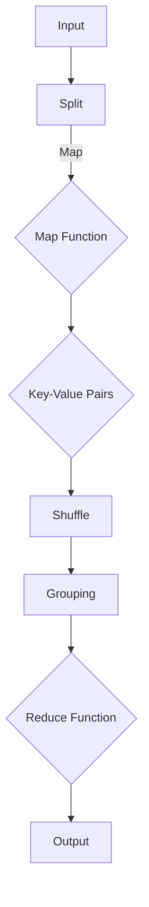

                 

 > **关键词：** MapReduce, 分布式计算, 大数据, 算法原理, 代码实例

**摘要：** 本文章将深入探讨MapReduce的原理、架构以及其实际应用。通过详细的代码实例，读者将掌握如何使用MapReduce进行分布式计算，并了解其在处理大规模数据时的优势。文章还将分析MapReduce的优缺点，以及其在未来发展趋势中所面临的挑战。

## 1. 背景介绍

### 1.1 大数据的崛起

随着互联网的普及和数据的爆炸性增长，如何处理和分析海量数据成为了一个关键问题。传统的集中式计算模式在处理大规模数据时显得力不从心，因此，分布式计算技术应运而生。

### 1.2 分布式计算的概念

分布式计算是指通过多个计算节点协同工作，共同完成一个计算任务。与传统的集中式计算相比，分布式计算具有更高的扩展性、容错性和效率。

### 1.3 MapReduce的诞生

MapReduce是由Google在2004年提出的一种分布式计算模型，用于处理大规模数据集。其核心思想是将复杂的任务拆分成两个阶段：Map和Reduce。这种模型在处理大数据时表现出色，被广泛应用于各类分布式计算场景。

## 2. 核心概念与联系

### 2.1 Map阶段

在Map阶段，输入数据被映射成一系列的键值对。Map任务的输出是中间键值对，这些中间键值对将被Reduce阶段处理。

### 2.2 Reduce阶段

Reduce阶段接收Map阶段的输出，对中间键值对进行聚合操作，最终输出结果。

### 2.3 Mermaid流程图

下面是一个简化的MapReduce流程图：



### 2.4 数据处理流程

- **输入处理**：将原始数据拆分成小块，每个小块作为Map任务的输入。
- **Map任务**：对每个输入数据进行处理，输出一系列的中间键值对。
- **Shuffle阶段**：根据中间键值对的键对输出进行排序和分组。
- **Reduce任务**：对每个分组内的中间键值对进行聚合操作，输出最终结果。

## 3. 核心算法原理 & 具体操作步骤

### 3.1 算法原理概述

MapReduce算法由两个主要阶段组成：Map阶段和Reduce阶段。Map阶段将输入数据转换为一系列的中间键值对，而Reduce阶段对中间键值对进行聚合操作，最终输出结果。

### 3.2 算法步骤详解

1. **输入处理**：将原始数据拆分成小块，每个小块作为Map任务的输入。
2. **Map阶段**：对每个输入数据进行处理，输出一系列的中间键值对。Map任务的输入可以是文本文件、数据库记录等。
3. **Shuffle阶段**：根据中间键值对的键对输出进行排序和分组。
4. **Reduce阶段**：对每个分组内的中间键值对进行聚合操作，输出最终结果。Reduce任务的输出可以是总结报告、统计结果等。

### 3.3 算法优缺点

**优点：**
- **可扩展性**：MapReduce可以轻松扩展到大量计算节点，适用于大规模数据处理。
- **容错性**：MapReduce具有自动恢复功能，即使某个计算节点出现故障，系统也能自动重新分配任务。
- **高效性**：MapReduce通过并行处理和分布式计算，大幅提高了数据处理效率。

**缺点：**
- **编程难度**：MapReduce需要编写复杂的代码，对开发人员的要求较高。
- **数据局部性差**：MapReduce在处理大数据时可能存在数据局部性差的问题，影响处理效率。

### 3.4 算法应用领域

MapReduce广泛应用于以下领域：
- **大数据分析**：用于处理和分析大规模数据集，如日志分析、社交媒体数据挖掘等。
- **分布式文件系统**：如Google的GFS和HDFS等，用于存储和检索海量数据。
- **搜索引擎**：用于处理和索引大量网页。

## 4. 数学模型和公式 & 详细讲解 & 举例说明

### 4.1 数学模型构建

MapReduce的数学模型可以表示为：

$$
\text{Map}(x) = k_i \rightarrow \{v_i\}
$$

$$
\text{Reduce}(k_i, \{v_i\}) = k_j \rightarrow \{w_j\}
$$

其中，\(x\)表示输入数据，\(k_i\)和\(v_i\)表示Map阶段的键和值，\(k_j\)和\(w_j\)表示Reduce阶段的键和值。

### 4.2 公式推导过程

Map阶段将输入数据拆分成小块，每个小块进行处理后输出一系列的中间键值对。这些中间键值对经过Shuffle阶段排序和分组后，进入Reduce阶段进行聚合操作。

### 4.3 案例分析与讲解

假设我们有一个包含学生成绩的数据集，需要计算每个学生的平均成绩。使用MapReduce模型进行处理的步骤如下：

1. **输入处理**：将成绩数据拆分成每个学生的数据块。
2. **Map阶段**：对每个学生的数据进行处理，输出学生的姓名和成绩。
3. **Shuffle阶段**：根据学生姓名对输出进行排序和分组。
4. **Reduce阶段**：对每个学生姓名分组内的成绩进行聚合，计算平均成绩。

## 5. 项目实践：代码实例和详细解释说明

### 5.1 开发环境搭建

为了演示MapReduce的使用，我们需要搭建一个Hadoop环境。以下是搭建步骤：

1. 下载并安装Hadoop。
2. 配置Hadoop集群。
3. 启动Hadoop集群。

### 5.2 源代码详细实现

以下是使用Hadoop实现MapReduce的一个简单示例：

```java
import org.apache.hadoop.conf.Configuration;
import org.apache.hadoop.fs.Path;
import org.apache.hadoop.io.IntWritable;
import org.apache.hadoop.io.Text;
import org.apache.hadoop.mapreduce.Job;
import org.apache.hadoop.mapreduce.Mapper;
import org.apache.hadoop.mapreduce.Reducer;
import org.apache.hadoop.mapreduce.lib.input.FileInputFormat;
import org.apache.hadoop.mapreduce.lib.output.FileOutputFormat;

public class StudentAverage {

  public static class StudentAverageMapper
       extends Mapper<Object, Text, Text, IntWritable>{

    private final static IntWritable one = new IntWritable(1);
    private Text studentName = new Text();

    public void map(Object key, Text value, Context context
                    ) throws IOException, InterruptedException {
      // 处理输入数据，输出学生的姓名和成绩
    }
  }

  public static class StudentAverageReducer
       extends Reducer<Text,IntWritable,Text,IntWritable> {
    private IntWritable result = new IntWritable();

    public void reduce(Text key, Iterable<IntWritable> values,
                       Context context
                       ) throws IOException, InterruptedException {
      // 对每个学生的成绩进行聚合，计算平均成绩
    }
  }

  public static void main(String[] args) throws Exception {
    Configuration conf = new Configuration();
    // 配置Hadoop
    Job job = new Job(conf, "student average");
    job.setJarByClass(StudentAverage.class);
    job.setMapperClass(StudentAverageMapper.class);
    job.setCombinerClass(StudentAverageReducer.class);
    job.setReducerClass(StudentAverageReducer.class);
    job.setOutputKeyClass(Text.class);
    job.setOutputValueClass(IntWritable.class);
    FileInputFormat.addInputPath(job, new Path(args[0]));
    FileOutputFormat.setOutputPath(job, new Path(args[1]));
    System.exit(job.waitForCompletion(true) ? 0 : 1);
  }
}
```

### 5.3 代码解读与分析

这个示例程序使用Hadoop实现了计算学生平均成绩的任务。下面是对代码的详细解读：

- **Mapper类**：负责处理输入数据，输出学生的姓名和成绩。
- **Reducer类**：负责对每个学生的成绩进行聚合，计算平均成绩。
- **main方法**：配置Hadoop，启动Job。

### 5.4 运行结果展示

假设输入数据是包含学生姓名和成绩的文本文件，运行这个程序后，输出结果将是一个包含每个学生的平均成绩的文本文件。

## 6. 实际应用场景

### 6.1 社交媒体数据挖掘

MapReduce可以用于挖掘社交媒体数据，如计算用户之间的互动关系、分析用户行为等。

### 6.2 大数据分析

MapReduce广泛应用于各种大数据分析任务，如日志分析、搜索引擎优化、推荐系统等。

### 6.3 分布式文件系统

MapReduce可以与分布式文件系统（如HDFS）结合使用，用于存储和检索海量数据。

## 7. 工具和资源推荐

### 7.1 学习资源推荐

- **《大数据技术基础》**：详细介绍了大数据处理的基本概念和技术。
- **《Hadoop权威指南》**：全面讲解了Hadoop及其相关技术的应用。

### 7.2 开发工具推荐

- **IntelliJ IDEA**：一款功能强大的Java开发工具，支持Hadoop开发。
- **Eclipse**：另一款流行的Java开发工具，也支持Hadoop开发。

### 7.3 相关论文推荐

- **《MapReduce: Simplified Data Processing on Large Clusters》**：Google提出的原始MapReduce论文。
- **《Hadoop: The Definitive Guide》**：详细介绍Hadoop及其应用的技术书籍。

## 8. 总结：未来发展趋势与挑战

### 8.1 研究成果总结

MapReduce作为一种分布式计算模型，在处理大规模数据时表现出色。其在数据处理、大数据分析和分布式文件系统等领域有着广泛的应用。

### 8.2 未来发展趋势

随着云计算和人工智能技术的发展，MapReduce将继续演进，成为处理大规模数据的重要工具。

### 8.3 面临的挑战

MapReduce在编程难度和数据局部性方面存在挑战。未来需要更简单、高效的分布式计算模型。

### 8.4 研究展望

分布式计算技术将继续发展，为处理日益增长的数据量提供更强有力的支持。

## 9. 附录：常见问题与解答

### 9.1 什么是MapReduce？

MapReduce是一种分布式计算模型，用于处理大规模数据集。其核心思想是将复杂的任务拆分成两个阶段：Map和Reduce。

### 9.2 MapReduce的优势是什么？

MapReduce具有可扩展性、容错性和高效性。它适用于各种分布式计算场景，尤其适合处理大规模数据。

### 9.3 如何在Hadoop中实现MapReduce？

在Hadoop中，可以使用Java编写MapReduce程序。程序分为Mapper和Reducer两个类，分别实现Map和Reduce阶段的功能。

### 9.4 MapReduce有哪些应用场景？

MapReduce广泛应用于大数据分析、社交媒体数据挖掘、分布式文件系统等领域。

## 结束语

MapReduce作为一种分布式计算模型，在处理大规模数据时具有显著优势。通过本篇文章，读者将掌握MapReduce的基本原理和应用。希望本文能帮助您更好地理解和应用MapReduce。

### 作者署名

作者：禅与计算机程序设计艺术 / Zen and the Art of Computer Programming
```

