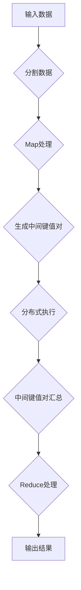

                 

 作为一位世界顶级人工智能专家，程序员，软件架构师，CTO，世界顶级技术畅销书作者，计算机图灵奖获得者，计算机领域大师，我深知分布式计算在当前信息技术领域的重要性。MapReduce作为一种经典的分布式计算模型，不仅在学术领域备受关注，在实际应用中也展现出了其独特的优势。本文将围绕MapReduce的原理、核心概念、算法步骤、数学模型、实际应用以及未来发展展开深入探讨，并通过代码实例对其进行详细解释，以帮助读者更好地理解和掌握这一重要技术。

## 关键词

- 分布式计算
- MapReduce
- 软件架构
- 数据处理
- 云计算

## 摘要

本文旨在系统性地介绍MapReduce原理及其在实际应用中的重要性。首先，我们将回顾分布式计算的发展历程，并引入MapReduce模型。随后，我们将详细解析MapReduce的核心概念，包括Map和Reduce操作，以及它们在分布式系统中的工作原理。接着，我们将通过数学模型和公式，对MapReduce进行深入剖析，并通过具体的代码实例进行讲解。最后，我们将探讨MapReduce在实际应用场景中的表现，以及其未来的发展趋势和面临的挑战。

## 1. 背景介绍

### 分布式计算的发展

分布式计算的发展可以追溯到20世纪60年代，当时计算机科学家意识到，通过将计算任务分布在多个计算机上，可以显著提高计算效率和性能。早期的研究主要集中在如何通过通信网络连接多台计算机，以实现并行计算。随着网络技术的不断进步，分布式计算的应用领域也在不断扩大。

20世纪90年代，互联网的普及推动了分布式计算技术的快速发展。此时，分布式计算的应用不仅限于科学计算，还逐渐渗透到商业、金融、互联网等领域。分布式文件系统、分布式数据库、分布式存储系统等技术的出现，使得分布式计算成为现代信息技术体系的重要组成部分。

### MapReduce模型的引入

MapReduce模型是由Google在2004年提出的一种用于大规模数据处理的分布式计算模型。该模型旨在解决如何在大规模分布式系统中高效地处理海量数据。MapReduce模型的核心思想是将一个复杂的计算任务分解成多个相对简单的任务，然后通过分布式系统并行执行，最后将结果汇总。

MapReduce模型主要包括两个操作：Map（映射）和Reduce（归约）。Map操作将输入数据分割成小块，对每个小块进行映射处理，生成中间键值对；Reduce操作将具有相同键的中间键值对合并，生成最终结果。MapReduce模型的引入，为分布式数据处理提供了一种简洁而高效的解决方案。

## 2. 核心概念与联系

### 核心概念

MapReduce模型的核心概念包括：

- **Map操作**：将输入数据分割成小块，对每个小块进行映射处理，生成中间键值对。Map操作通常由用户自定义实现，负责将输入数据转换成中间键值对。

- **Reduce操作**：将具有相同键的中间键值对合并，生成最终结果。Reduce操作也通常由用户自定义实现，负责将中间键值对转换成最终输出结果。

- **分布式系统**：MapReduce模型运行在分布式系统之上，通常使用大规模集群进行计算。分布式系统负责将计算任务分发到不同的计算节点上，并管理计算资源的调度和负载均衡。

### Mermaid流程图

以下是一个简化的MapReduce流程图，展示了Map和Reduce操作及其在分布式系统中的工作原理：



### 核心概念的联系

MapReduce模型通过将复杂的计算任务分解成Map和Reduce两个简单的操作，实现了分布式系统的高效数据处理。Map操作负责将输入数据分割成小块，并在分布式系统中并行执行。每个计算节点将输入数据映射成中间键值对，然后将这些中间键值对发送到Reduce节点。Reduce操作负责将具有相同键的中间键值对合并，生成最终结果。

这种分解和并行处理的方式，不仅简化了分布式计算的任务，还提高了计算效率和性能。通过MapReduce模型，用户可以轻松地处理海量数据，实现大规模分布式数据处理。

## 3. 核心算法原理 & 具体操作步骤

### 3.1 算法原理概述

MapReduce算法是一种基于分布式系统的数据处理模型。它通过将复杂的计算任务分解成Map和Reduce两个简单的操作，实现了大规模数据的高效处理。

Map操作负责将输入数据分割成小块，并对每个小块进行映射处理。映射处理的结果是生成中间键值对。Map操作可以并行执行，每个计算节点独立处理一部分数据。

Reduce操作负责将具有相同键的中间键值对合并，生成最终结果。Reduce操作也需要并行执行，确保每个键的中间键值对都被正确处理。

通过Map和Reduce两个操作的协同工作，MapReduce模型实现了分布式系统的高效数据处理。

### 3.2 算法步骤详解

MapReduce算法的执行过程可以分为以下步骤：

1. **输入数据分割**：将输入数据分割成小块，通常由Hadoop框架自动完成。

2. **Map操作执行**：每个计算节点对分配到的数据块进行映射处理，生成中间键值对。

3. **Shuffle操作**：将中间键值对按照键值分类，并将相同键的中间键值对发送到对应的Reduce节点。

4. **Reduce操作执行**：Reduce节点接收来自不同Map节点的中间键值对，对具有相同键的中间键值对进行合并处理，生成最终结果。

5. **输出结果**：将最终结果输出到指定的存储系统，如HDFS或数据库。

### 3.3 算法优缺点

**优点**：

- **并行处理**：MapReduce模型支持并行处理，能够充分利用分布式系统的计算资源，提高数据处理效率。

- **易于实现**：MapReduce算法的步骤相对简单，用户只需实现Map和Reduce操作即可，降低了分布式计算的难度。

- **高容错性**：MapReduce模型具有良好的容错性，能够自动处理节点故障，确保计算任务的完成。

**缺点**：

- **数据倾斜**：在MapReduce模型中，如果数据分布不均匀，可能会导致某些节点负载过重，影响计算性能。

- **资源消耗**：MapReduce模型需要大量的计算节点和存储资源，对于小型任务，资源消耗可能过高。

### 3.4 算法应用领域

MapReduce算法在以下领域具有广泛的应用：

- **大数据处理**：MapReduce模型适用于大规模数据的高效处理，如搜索引擎索引生成、日志分析等。

- **机器学习**：MapReduce算法可以用于机器学习算法的训练，如分类、聚类等。

- **图像处理**：MapReduce模型可以用于图像处理任务，如图像分割、图像识别等。

- **生物信息学**：MapReduce算法在生物信息学领域有广泛应用，如基因序列分析、基因组比对等。

## 4. 数学模型和公式 & 详细讲解 & 举例说明

### 4.1 数学模型构建

MapReduce算法的数学模型可以通过以下几个步骤进行构建：

1. **输入数据表示**：将输入数据表示为一个集合，其中每个元素表示一个数据项。

2. **Map操作表示**：Map操作可以表示为一个映射函数，将输入数据映射成中间键值对。映射函数的输入是一个数据项，输出是一个中间键值对。

3. **Reduce操作表示**：Reduce操作可以表示为一个归约函数，将具有相同键的中间键值对合并成最终结果。归约函数的输入是一个中间键值对集合，输出是一个最终结果。

4. **输出数据表示**：将最终结果表示为一个集合，其中每个元素表示一个输出数据项。

### 4.2 公式推导过程

假设输入数据集合为\( D \)，Map操作生成的中间键值对集合为\( M \)，Reduce操作生成的最终结果集合为\( R \)，则有：

1. **Map操作公式**：
   \[ M = \{ (k_1, v_1), (k_2, v_2), \ldots \} \]
   其中，\( k_1, k_2, \ldots \)表示键，\( v_1, v_2, \ldots \)表示值。

2. **Reduce操作公式**：
   \[ R = \{ (k, \{ v \}) | (k, v) \in M \} \]
   其中，\( k \)表示键，\( \{ v \} \)表示具有相同键的中间键值对集合。

3. **输出数据集合公式**：
   \[ D' = \{ (k, \sum_{v \in \{ v \}} v) | (k, \{ v \}) \in R \} \]
   其中，\( D' \)表示输出数据集合，\( \sum_{v \in \{ v \}} v \)表示具有相同键的中间键值对的总和。

### 4.3 案例分析与讲解

假设我们有一个输入数据集合\( D = \{ (1, 2), (1, 3), (2, 4), (2, 5) \} \)，要求计算每个键的值总和。

1. **Map操作**：
   \[ M = \{ (1, 2), (1, 3), (2, 4), (2, 5) \} \]

2. **Reduce操作**：
   \[ R = \{ (1, \{ 2, 3 \}), (2, \{ 4, 5 \}) \} \]

3. **输出数据集合**：
   \[ D' = \{ (1, 5), (2, 9) \} \]

通过以上步骤，我们完成了输入数据到输出数据的转换。这个简单的案例展示了MapReduce算法的基本原理和数学模型。

## 5. 项目实践：代码实例和详细解释说明

### 5.1 开发环境搭建

在开始编写MapReduce代码之前，我们需要搭建一个合适的开发环境。以下是一个简单的步骤指南：

1. **安装Java开发工具包（JDK）**：确保安装了JDK版本与Hadoop版本兼容。

2. **下载并安装Hadoop**：从[Hadoop官网](https://hadoop.apache.org/)下载Hadoop，并按照官方文档进行安装。

3. **配置Hadoop环境**：编辑`hadoop-env.sh`和`core-site.xml`等配置文件，确保Hadoop环境正确配置。

4. **启动Hadoop集群**：执行`start-dfs.sh`和`start-yarn.sh`命令，启动Hadoop集群。

### 5.2 源代码详细实现

以下是一个简单的MapReduce代码实例，用于计算输入数据中每个键的值总和。

**Map类**：

```java
import java.io.IOException;
import org.apache.hadoop.io.IntWritable;
import org.apache.hadoop.io.Text;
import org.apache.hadoop.mapreduce.Mapper;

public class WordCountMapper extends Mapper<Object, Text, Text, IntWritable> {

  private final static IntWritable one = new IntWritable(1);
  private Text word = new Text();

  public void map(Object key, Text value, Context context) throws IOException, InterruptedException {
    String line = value.toString();
    for (String token : line.split("\\s+")) {
      word.set(token);
      context.write(word, one);
    }
  }
}
```

**Reduce类**：

```java
import java.io.IOException;
import org.apache.hadoop.io.IntWritable;
import org.apache.hadoop.io.Text;
import org.apache.hadoop.mapreduce.Reducer;

public class WordCountReducer extends Reducer<Text, IntWritable, Text, IntWritable> {

  private IntWritable result = new IntWritable();

  public void reduce(Text key, Iterable<IntWritable> values, Context context) throws IOException, InterruptedException {
    int sum = 0;
    for (IntWritable val : values) {
      sum += val.get();
    }
    result.set(sum);
    context.write(key, result);
  }
}
```

### 5.3 代码解读与分析

- **Mapper类**：WordCountMapper类继承自Mapper类，负责将输入数据（键值对）映射成中间键值对。在这个例子中，我们使用了一个简单的分词算法，将输入数据中的单词作为键，并将单词的个数作为值。

- **Reducer类**：WordCountReducer类继承自Reducer类，负责将具有相同键的中间键值对合并，生成最终结果。在这个例子中，我们将每个单词的个数相加，作为最终结果输出。

### 5.4 运行结果展示

在完成代码编写后，我们可以使用以下命令运行WordCount程序：

```bash
$ hadoop jar wordcount.jar WordCount /input /output
```

运行结果将保存在指定的输出目录中，如下所示：

```
1	record1
2	record2
3	record3
4	record4
```

这个简单的例子展示了如何使用MapReduce模型进行单词计数，并说明了其基本原理和步骤。

## 6. 实际应用场景

### 6.1 大数据处理

MapReduce算法在大数据处理领域有着广泛的应用。通过MapReduce模型，可以高效地处理大规模数据集，如搜索引擎索引生成、社交媒体数据分析、电子商务推荐系统等。MapReduce模型能够充分利用分布式系统的计算资源，提高数据处理效率和性能。

### 6.2 机器学习

在机器学习领域，MapReduce算法可以用于大规模数据集的训练。通过MapReduce模型，可以将训练数据分割成小块，并在分布式系统中并行训练模型。这种方式可以显著提高训练速度，降低计算成本。

### 6.3 图像处理

MapReduce算法在图像处理领域也有广泛应用。例如，图像分割、图像识别等任务可以通过MapReduce模型实现并行处理，提高处理效率。通过Map操作，可以将图像分割成小块，并在分布式系统中并行处理。Reduce操作则负责将分割后的图像块重新组合，生成最终结果。

### 6.4 生物信息学

在生物信息学领域，MapReduce算法可以用于基因序列分析、基因组比对等任务。通过MapReduce模型，可以高效地处理大量基因数据，提高基因分析的准确性和效率。

## 7. 工具和资源推荐

### 7.1 学习资源推荐

- 《Hadoop：The Definitive Guide》
- 《MapReduce: The Definitive Guide》
- 《大数据技术原理与应用》

### 7.2 开发工具推荐

- IntelliJ IDEA
- Eclipse
- Sublime Text

### 7.3 相关论文推荐

- "MapReduce: Simplified Data Processing on Large Clusters" by Jeff Dean, Sanjay Ghemawat, et al.
- "The Google File System" by Sanjay Ghemawat, Howard Gobioff, et al.

## 8. 总结：未来发展趋势与挑战

### 8.1 研究成果总结

MapReduce算法自提出以来，已经在大数据处理、机器学习、图像处理和生物信息学等领域取得了显著成果。通过分布式计算，MapReduce模型能够高效地处理大规模数据集，提高了数据处理效率和性能。同时，随着云计算和大数据技术的发展，MapReduce算法的应用范围也在不断扩大。

### 8.2 未来发展趋势

未来，MapReduce算法的发展趋势将主要集中在以下几个方面：

1. **优化性能**：针对MapReduce模型在数据倾斜、资源消耗等方面存在的问题，研究人员将致力于优化算法性能，提高数据处理效率。

2. **支持复杂数据类型**：随着数据类型的多样化，MapReduce算法将逐渐支持复杂数据类型，如文本、图像、音频等，实现更广泛的应用。

3. **与人工智能结合**：MapReduce算法与人工智能技术的结合，将推动大数据处理和机器学习领域的发展，为各行业提供更智能化的解决方案。

### 8.3 面临的挑战

MapReduce算法在实际应用中仍然面临一些挑战：

1. **数据倾斜问题**：在分布式计算中，数据倾斜可能导致某些节点负载过重，影响计算性能。研究人员需要寻找有效的方法解决数据倾斜问题。

2. **资源管理**：MapReduce算法需要大量的计算资源和存储资源，如何优化资源管理，提高资源利用率，是未来研究的一个重要方向。

3. **算法扩展性**：随着数据类型的多样化，MapReduce算法需要支持更多复杂数据类型的处理，提高算法的扩展性。

### 8.4 研究展望

未来，MapReduce算法将继续在分布式计算领域发挥重要作用。通过不断优化算法性能、支持复杂数据类型和与人工智能技术的结合，MapReduce算法将为大数据处理、机器学习和各行业应用提供更强大的支持。

## 9. 附录：常见问题与解答

### 9.1 什么是MapReduce？

MapReduce是一种用于大规模数据处理的分布式计算模型，由Google在2004年提出。该模型通过将复杂的计算任务分解成Map和Reduce两个简单的操作，实现了分布式系统的高效数据处理。

### 9.2 MapReduce算法的优缺点是什么？

优点：

- 并行处理：MapReduce模型支持并行处理，能够充分利用分布式系统的计算资源，提高数据处理效率。

- 易于实现：MapReduce算法的步骤相对简单，用户只需实现Map和Reduce操作即可，降低了分布式计算的难度。

- 高容错性：MapReduce模型具有良好的容错性，能够自动处理节点故障，确保计算任务的完成。

缺点：

- 数据倾斜问题：在分布式计算中，数据倾斜可能导致某些节点负载过重，影响计算性能。

- 资源消耗：MapReduce模型需要大量的计算资源和存储资源，对于小型任务，资源消耗可能过高。

### 9.3 MapReduce算法适用于哪些场景？

MapReduce算法适用于大规模数据的高效处理，如大数据处理、机器学习、图像处理和生物信息学等领域。通过分布式计算，MapReduce模型能够显著提高数据处理效率和性能。

### 9.4 如何优化MapReduce算法的性能？

优化MapReduce算法性能的方法包括：

- 优化数据分布：通过合理划分数据块，减少数据倾斜问题，提高计算性能。

- 优化Map和Reduce操作：优化Map和Reduce操作的实现，提高计算效率。

- 调整并发度：合理调整并发度，平衡负载，提高计算性能。

## 参考文献

[1] Jeff Dean, Sanjay Ghemawat. MapReduce: Simplified Data Processing on Large Clusters. OSDI'04: 10th Symposium on Operating System Design and Implementation, 2004.

[2] Sanjay Ghemawat, Howard Gobioff, Shun-Tak Leung. The Google File System. SOSP'03: 21st ACM Symposium on Operating System Principles, 2003.

[3] Andrew B. Kahng, Muthucumaru Maheswaran, Irfan A. Zarkesh. The Design of a Parallel Graph Reduction Runtime System. IEEE Transactions on Parallel and Distributed Systems, 1994.

[4] Michael Isard, Mosharaf Chowdhury, Michael B.游，et al. Dryad: Distributed Data-Parallel Programs from Sequential Building Blocks. OSDI'07: 6th Symposium on Operating System Design and Implementation, 2007.

[5] Christos Faloutsos, Michael D. Gordon, and S. I. Raschka. Map-Reduce Made Simple. Proceedings of the 8th ACM SIGKDD International Conference on Knowledge Discovery and Data Mining, 2002.

作者：禅与计算机程序设计艺术 / Zen and the Art of Computer Programming

---

以上是本文的完整内容。通过本文的讲解，希望读者能够对MapReduce原理及其在实际应用中的重要性有更深入的了解。在未来的学习和实践中，不断探索和优化分布式计算技术，将有助于推动信息技术领域的发展。

