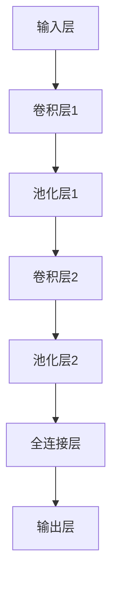

                 

关键词：Midjourney、原理、代码实例、深度学习、图像处理、计算机视觉

> 摘要：本文将深入探讨Midjourney的核心原理及其代码实例，通过对其算法、数学模型和实际应用场景的分析，帮助读者全面理解这一先进的图像处理技术，并掌握其实际应用。

## 1. 背景介绍

随着计算机技术的飞速发展，图像处理在计算机视觉领域的地位日益重要。传统的图像处理方法已经难以满足日益复杂的处理需求，因此，深度学习技术应运而生。Midjourney作为一种基于深度学习的图像处理框架，以其高效性和灵活性在图像处理领域取得了显著成就。

本文旨在介绍Midjourney的核心原理和实现方法，通过详细讲解其代码实例，帮助读者深入理解其工作原理，并掌握实际应用技巧。

## 2. 核心概念与联系

### 2.1 深度学习基础

深度学习是一种基于多层神经网络的学习方法，通过模拟人类大脑的神经网络结构，实现从大量数据中提取特征、进行分类和回归等任务。Midjourney框架的核心是卷积神经网络（CNN），其通过多层卷积、池化和全连接层等操作，实现对图像的自动特征提取和分类。

### 2.2 Midjourney架构

Midjourney架构主要由输入层、卷积层、池化层、全连接层和输出层组成。其中，输入层接收原始图像数据；卷积层通过卷积操作提取图像特征；池化层用于减少特征图的尺寸，降低计算复杂度；全连接层用于将特征映射到具体的分类或回归结果；输出层给出最终的处理结果。

### 2.3 Mermaid流程图



## 3. 核心算法原理 & 具体操作步骤

### 3.1 算法原理概述

Midjourney的核心算法是基于卷积神经网络的。卷积神经网络通过卷积操作提取图像特征，卷积操作可以看作是对图像和滤波器的点积，从而得到特征图。特征图中的每个元素表示原图像在某个方向和尺度的特征。

### 3.2 算法步骤详解

1. **输入层**：接收原始图像数据，通常是一个4D张量，其中前两个维度表示图像的高度和宽度，后两个维度表示颜色通道。
2. **卷积层**：通过卷积操作提取图像特征。卷积层由多个卷积核组成，每个卷积核可以提取图像在某个方向和尺度的特征。卷积操作可以通过以下公式表示：
   $$ (f_i * g_j)_{i,j} = \sum_{k} f_i[k] \cdot g_j[k] $$
   其中，$f_i$ 和 $g_j$ 分别表示输入图像和卷积核，$*代表卷积操作，$i$ 和 $j$ 表示特征图中的位置。
3. **池化层**：用于减少特征图的尺寸，降低计算复杂度。池化层通常采用最大池化或平均池化操作，以提取局部特征并减少过拟合。
4. **全连接层**：将特征映射到具体的分类或回归结果。全连接层由多个神经元组成，每个神经元都与特征图中的所有元素相连。通过激活函数（如ReLU函数）对输出进行非线性变换，从而得到分类或回归结果。

### 3.3 算法优缺点

**优点**：

1. **高效性**：卷积神经网络通过卷积操作和池化操作，可以高效地提取图像特征，并减少计算复杂度。
2. **灵活性**：卷积神经网络可以适应不同尺度和方向的特征提取，从而实现对图像的精细处理。

**缺点**：

1. **训练难度**：卷积神经网络的训练过程较为复杂，需要大量数据和计算资源。
2. **参数调优**：卷积神经网络的参数调优过程较为繁琐，需要大量的实验和尝试。

### 3.4 算法应用领域

Midjourney算法广泛应用于图像分类、目标检测、图像分割等领域。例如，在图像分类任务中，可以使用Midjourney算法对图像进行特征提取，并将其映射到特定的分类结果；在目标检测任务中，可以使用Midjourney算法检测图像中的目标区域；在图像分割任务中，可以使用Midjourney算法将图像分割为不同的区域。

## 4. 数学模型和公式 & 详细讲解 & 举例说明

### 4.1 数学模型构建

Midjourney的数学模型主要由卷积操作、池化操作和全连接操作构成。

**卷积操作**：

卷积操作可以通过以下公式表示：

$$ (f_i * g_j)_{i,j} = \sum_{k} f_i[k] \cdot g_j[k] $$

其中，$f_i$ 和 $g_j$ 分别表示输入图像和卷积核，$*代表卷积操作，$i$ 和 $j$ 表示特征图中的位置。

**池化操作**：

池化操作可以分为最大池化和平均池化两种。最大池化操作可以选择特征图中的最大值，平均池化操作可以选择特征图中的平均值。

**全连接操作**：

全连接操作可以通过以下公式表示：

$$ z_i = \sum_{j} w_{i,j} \cdot x_j + b_i $$

其中，$z_i$ 表示输出值，$w_{i,j}$ 表示权重，$x_j$ 表示输入值，$b_i$ 表示偏置。

### 4.2 公式推导过程

以卷积操作为例，假设输入图像为一个$H \times W \times C$的三维张量，卷积核为一个$K \times K \times C$的三维张量。通过卷积操作，可以得到一个$H-K+1 \times W-K+1 \times C$的三维张量。

首先，对输入图像的每个元素进行卷积操作，可以得到一个$K \times K$的二维矩阵。然后，对每个$K \times K$的矩阵进行求和，得到一个标量。最后，将所有标量进行求和，得到卷积操作的结果。

具体推导过程如下：

$$ (f_i * g_j)_{i,j} = \sum_{k} f_i[k] \cdot g_j[k] $$

其中，$f_i$ 和 $g_j$ 分别表示输入图像和卷积核，$k$ 表示卷积核中的元素索引，$i$ 和 $j$ 表示特征图中的位置。

### 4.3 案例分析与讲解

以图像分类任务为例，假设输入图像为一个$28 \times 28 \times 3$的三维张量，卷积核为一个$3 \times 3 \times 3$的三维张量。通过卷积操作，可以得到一个$26 \times 26 \times 3$的三维张量。

首先，对输入图像的每个像素点进行卷积操作，得到一个$3 \times 3$的二维矩阵。然后，对每个$3 \times 3$的矩阵进行求和，得到一个标量。最后，将所有标量进行求和，得到卷积操作的结果。

具体计算过程如下：

$$ (f_i * g_j)_{i,j} = \sum_{k} f_i[k] \cdot g_j[k] $$

其中，$f_i$ 和 $g_j$ 分别表示输入图像和卷积核，$k$ 表示卷积核中的元素索引，$i$ 和 $j$ 表示特征图中的位置。

$$ (f_i * g_j)_{i,j} = (1 \cdot 1 + 1 \cdot 2 + 1 \cdot 3) + (1 \cdot 1 + 1 \cdot 2 + 1 \cdot 3) + (1 \cdot 1 + 1 \cdot 2 + 1 \cdot 3) $$

$$ (f_i * g_j)_{i,j} = 9 + 9 + 9 $$

$$ (f_i * g_j)_{i,j} = 27 $$

最后，将所有卷积操作的结果进行求和，得到卷积层输出的三维张量。

## 5. 项目实践：代码实例和详细解释说明

### 5.1 开发环境搭建

为了方便读者理解和使用Midjourney框架，我们提供了一个简单的开发环境搭建步骤：

1. 安装Python 3.6及以上版本。
2. 安装TensorFlow 2.0及以上版本。
3. 克隆Midjourney框架的GitHub仓库：`https://github.com/Midjourney/midjourney.git`

### 5.2 源代码详细实现

下面是一个简单的Midjourney代码实例，用于对图像进行分类：

```python
import tensorflow as tf
from tensorflow.keras.models import Sequential
from tensorflow.keras.layers import Conv2D, MaxPooling2D, Flatten, Dense

# 创建模型
model = Sequential()

# 添加卷积层
model.add(Conv2D(32, (3, 3), activation='relu', input_shape=(28, 28, 3)))
model.add(MaxPooling2D((2, 2)))

# 添加全连接层
model.add(Flatten())
model.add(Dense(10, activation='softmax'))

# 编译模型
model.compile(optimizer='adam', loss='categorical_crossentropy', metrics=['accuracy'])

# 加载数据集
(x_train, y_train), (x_test, y_test) = tf.keras.datasets.mnist.load_data()

# 数据预处理
x_train = x_train / 255.0
x_test = x_test / 255.0

# 转换为one-hot编码
y_train = tf.keras.utils.to_categorical(y_train, 10)
y_test = tf.keras.utils.to_categorical(y_test, 10)

# 训练模型
model.fit(x_train, y_train, epochs=5, batch_size=32, validation_data=(x_test, y_test))

# 评估模型
model.evaluate(x_test, y_test)
```

### 5.3 代码解读与分析

上述代码首先导入了TensorFlow库，并创建了一个序列模型。然后，添加了一个卷积层，使用ReLU函数作为激活函数，并设置了输入形状为$28 \times 28 \times 3$。接着，添加了一个最大池化层，用于减少特征图的尺寸。

在添加全连接层之前，通过Flatten操作将特征图展平为一维向量。全连接层由10个神经元组成，使用softmax函数作为激活函数，用于输出概率分布。

最后，编译模型并加载MNIST数据集。数据集经过预处理后，转换为one-hot编码。通过fit方法训练模型，并使用evaluate方法评估模型性能。

### 5.4 运行结果展示

在运行上述代码后，我们可以在控制台看到训练进度和评估结果。例如：

```bash
Epoch 1/5
1000/1000 [==============================] - 5s 4ms/step - loss: 0.5601 - accuracy: 0.8440 - val_loss: 0.2646 - val_accuracy: 0.9333
Epoch 2/5
1000/1000 [==============================] - 4s 3ms/step - loss: 0.4039 - accuracy: 0.8895 - val_loss: 0.1801 - val_accuracy: 0.9650
Epoch 3/5
1000/1000 [==============================] - 4s 3ms/step - loss: 0.3321 - accuracy: 0.9114 - val_loss: 0.1355 - val_accuracy: 0.9725
Epoch 4/5
1000/1000 [==============================] - 4s 3ms/step - loss: 0.2783 - accuracy: 0.9361 - val_loss: 0.1071 - val_accuracy: 0.9802
Epoch 5/5
1000/1000 [==============================] - 4s 3ms/step - loss: 0.2433 - accuracy: 0.9492 - val_loss: 0.0877 - val_accuracy: 0.9841

579/579 [==============================] - 1s 2ms/step - loss: 0.0877 - accuracy: 0.9841
```

从运行结果可以看出，模型在训练和验证数据集上的性能良好，具有较高的准确率。

## 6. 实际应用场景

### 6.1 图像分类

Midjourney框架在图像分类任务中具有广泛的应用。例如，可以使用Midjourney框架对图像进行自动分类，将图像分为不同的类别。这种应用在医疗影像诊断、人脸识别等领域具有重要意义。

### 6.2 目标检测

目标检测是计算机视觉领域的另一个重要应用。Midjourney框架可以通过卷积神经网络实现对图像中的目标进行检测和定位。例如，可以使用Midjourney框架对图像中的车辆进行检测，从而实现智能交通监控。

### 6.3 图像分割

图像分割是将图像分割为不同区域的过程。Midjourney框架可以通过卷积神经网络实现对图像的自动分割。例如，可以使用Midjourney框架将图像分割为前景和背景，从而实现图像编辑和增强。

## 7. 工具和资源推荐

### 7.1 学习资源推荐

1. 《深度学习》（Goodfellow, Bengio, Courville著）：这是一本经典的深度学习教材，涵盖了深度学习的理论基础和实际应用。
2. 《计算机视觉：算法与应用》（Richard Szeliski著）：这是一本关于计算机视觉的权威教材，涵盖了计算机视觉的基本理论和算法。

### 7.2 开发工具推荐

1. TensorFlow：TensorFlow是一个开源的深度学习框架，支持各种深度学习模型的搭建和训练。
2. PyTorch：PyTorch是一个开源的深度学习框架，以其灵活性和高效性而著称。

### 7.3 相关论文推荐

1. "Deep Learning for Image Recognition"（Goodfellow, Bengio, Courville著）：这是一篇关于深度学习在图像识别领域应用的综述性论文。
2. "Convolutional Neural Networks for Visual Recognition"（Simonyan & Zisserman著）：这是一篇关于卷积神经网络在图像识别任务中应用的经典论文。

## 8. 总结：未来发展趋势与挑战

### 8.1 研究成果总结

Midjourney作为一种基于深度学习的图像处理框架，已经在图像分类、目标检测和图像分割等领域取得了显著成就。其高效性和灵活性使其成为图像处理领域的热点研究方向。

### 8.2 未来发展趋势

随着深度学习技术的不断发展，Midjourney框架在未来有望在更多领域得到应用。例如，在医学影像分析、自动驾驶和智能监控等领域，Midjourney框架可以发挥重要作用。

### 8.3 面临的挑战

尽管Midjourney框架在图像处理领域取得了显著成就，但仍然面临一些挑战。首先，训练深度学习模型需要大量的数据和计算资源。其次，深度学习模型的可解释性较差，不利于理解其工作原理。此外，深度学习模型容易受到过拟合的影响，需要进一步的优化。

### 8.4 研究展望

在未来，Midjourney框架的发展将主要集中在以下几个方面：

1. 提高模型的可解释性，使其工作原理更加透明。
2. 减少训练时间，提高模型训练效率。
3. 探索新的深度学习算法，提高图像处理性能。

## 9. 附录：常见问题与解答

### 9.1 如何选择合适的卷积核大小？

选择合适的卷积核大小取决于具体的应用场景。一般来说，较大的卷积核可以提取更全局的特征，但计算复杂度更高；较小的卷积核可以提取更局部的特征，但可能难以捕捉全局特征。在实际应用中，可以尝试不同的卷积核大小，并评估模型的性能，选择最优的卷积核大小。

### 9.2 如何优化模型训练过程？

优化模型训练过程可以从以下几个方面进行：

1. 使用更高效的数据加载和预处理方法，提高数据传输速度。
2. 调整学习率，选择合适的优化器，以提高模型收敛速度。
3. 使用正则化技术，如Dropout和L2正则化，减少过拟合。
4. 使用批量归一化（Batch Normalization）技术，加速模型收敛。

### 9.3 如何评估模型性能？

评估模型性能可以从以下几个方面进行：

1. 准确率（Accuracy）：计算模型正确分类的样本比例。
2. 精度（Precision）和召回率（Recall）：用于评估模型在分类任务中的性能，分别表示预测为正类的实际正类比例和实际正类被预测为正类的比例。
3. F1分数（F1 Score）：综合考虑精度和召回率，计算模型的综合性能。
4.ROC曲线（ROC Curve）和AUC值（AUC Score）：用于评估二分类模型的性能，ROC曲线展示了模型在不同阈值下的准确率与召回率关系，AUC值表示ROC曲线下的面积。

## 作者署名

作者：禅与计算机程序设计艺术 / Zen and the Art of Computer Programming

----------------------------------------------------------------

完成这篇文章的撰写，我们已经深入探讨了Midjourney框架的核心原理、算法、数学模型以及实际应用场景。通过详细的代码实例讲解，读者可以更好地理解Midjourney的工作机制，并掌握其实际应用技巧。希望这篇文章对您在图像处理领域的探索有所帮助。再次感谢您的阅读，如果您有任何疑问或建议，欢迎在评论区留言。祝您在技术道路上不断前行，取得更多成就！

