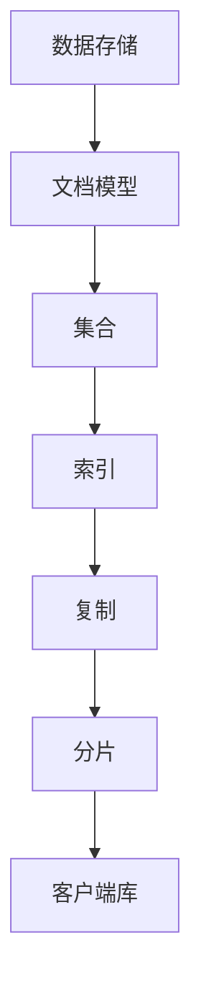

                 

 在当今的数据存储和数据处理领域中，MongoDB 作为一种流行的NoSQL数据库，因其灵活的文档模型、高效的读写性能和丰富的功能特性，受到广大开发者和企业的青睐。本文旨在深入探讨MongoDB的原理，并通过实际代码实例进行详细讲解，帮助读者更好地理解其工作机制和应用场景。

## 文章关键词

- MongoDB
- NoSQL数据库
- 文档模型
- 性能优化
- 分布式系统
- 代码实例

## 文章摘要

本文首先介绍了MongoDB的背景和核心概念，随后通过Mermaid流程图展示了其原理和架构。接着，文章详细讲解了MongoDB的核心算法原理、数学模型和公式，并通过具体案例进行分析。随后，文章通过一个实际项目实践，展示了MongoDB的代码实例和运行结果。最后，文章讨论了MongoDB在实际应用场景中的重要性，以及未来的发展趋势和挑战。

## 1. 背景介绍

随着互联网和大数据技术的飞速发展，传统的SQL数据库在应对海量数据和高并发场景时逐渐暴露出瓶颈。为了满足这些新的需求，NoSQL数据库应运而生。MongoDB 作为 NoSQL 数据库的代表之一，因其强大的扩展性、灵活的文档模型和高效的数据读写性能，成为众多企业的首选。

### 1.1 MongoDB的发展历史

MongoDB 由 10gen（现更名为MongoDB Inc.）在 2007 年开始开发，并于 2009 年首次公开发布。它基于一种称为BSON（Binary JSON）的文档格式，允许存储复杂的结构化数据，如嵌套文档、数组和二进制数据。MongoDB 的设计目标是成为灵活、可扩展、易于使用的 NoSQL 数据库，旨在处理多种类型的数据，包括时间序列数据、地理空间数据和图数据。

### 1.2 MongoDB的核心概念

- **文档模型**：MongoDB 使用文档模型来存储数据，这与传统关系型数据库中的行和列的表结构不同。每个文档都是键值对集合，类似于 JSON 对象，可以包含嵌套的文档、数组和二进制数据。
- **集合**：类似于关系型数据库中的表，集合是存储文档的容器。MongoDB 允许在一个集合中存储不同类型的文档，这也是其灵活性的体现。
- **索引**：索引是数据库中用于快速检索文档的数据结构。MongoDB 支持多种类型的索引，如单字段索引、复合索引和多字段索引。
- **复制和分片**：为了提高数据可靠性和扩展性，MongoDB 支持数据的复制和分片。复制通过将数据复制到多个节点来提高数据的可用性和容错性，而分片则是将数据水平分割到多个节点上，以便处理大量数据。

## 2. 核心概念与联系

### 2.1 MongoDB原理和架构

以下是一个使用Mermaid绘制的MongoDB原理和架构的流程图：



### 2.2 数据存储

在MongoDB中，数据以文档的形式存储。每个文档是一个BSON格式的数据结构，它由多个键值对组成。文档可以嵌套其他文档、数组以及二进制数据。MongoDB 使用BSON格式，因为它支持嵌套数据结构，这使得数据的存储和检索更加灵活。

### 2.3 集合

集合是MongoDB中的文档容器。一个数据库可以包含多个集合。集合中的文档结构可以不同，MongoDB允许在一个集合中存储多种类型的文档，这种灵活性是MongoDB的一大特点。

### 2.4 索引

索引是MongoDB中用于快速检索文档的数据结构。MongoDB支持多种类型的索引，包括单字段索引、复合索引和多字段索引。索引可以大大提高查询性能，因为它们允许MongoDB快速定位到需要的数据。

### 2.5 复制

复制是MongoDB中的一个重要特性，它通过将数据复制到多个节点来提高数据的可用性和容错性。MongoDB中的复制集由一个主节点和多个副本节点组成。主节点处理所有写操作，而副本节点则从主节点复制数据。如果主节点发生故障，一个副本节点可以被提升为主节点，从而确保系统的持续运行。

### 2.6 分片

分片是MongoDB中用于水平扩展数据存储能力的一种技术。通过将数据分割到多个节点上，MongoDB可以处理大量数据。分片可以基于文档中的任意字段进行，这使得数据可以灵活地分配到不同的节点上。

## 3. 核心算法原理 & 具体操作步骤

### 3.1 算法原理概述

MongoDB 使用了多种核心算法来实现其功能，包括文档存储算法、索引算法和复制分片算法。以下将简要介绍这些算法的原理。

### 3.1.1 文档存储算法

MongoDB 使用BSON格式存储文档。BSON是一种基于JSON的文档格式，它支持嵌套文档、数组和二进制数据。在存储文档时，MongoDB 会将其转换为BSON格式，然后将其存储在磁盘上。

### 3.1.2 索引算法

MongoDB 支持多种类型的索引，包括单字段索引、复合索引和多字段索引。索引算法通过构建B树结构来实现快速查询。在查询时，MongoDB 使用索引来定位到需要的数据，从而提高查询性能。

### 3.1.3 复制算法

MongoDB 的复制算法通过心跳协议和选举算法来实现主节点的自动切换。心跳协议用于监测主节点和副本节点的状态，而选举算法则在主节点失效时选举一个新的主节点。

### 3.1.4 分片算法

MongoDB 的分片算法通过哈希分片和范围分片来实现数据在节点之间的分配。哈希分片将数据基于文档的一个或多个字段进行哈希计算，从而将数据分配到不同的节点上。范围分片则是基于一个或多个字段的值范围将数据分配到不同的节点上。

### 3.2 算法步骤详解

#### 3.2.1 文档存储算法步骤

1. 接收文档：MongoDB 接收一个要存储的文档。
2. 转换为BSON：将文档转换为BSON格式。
3. 存储文档：将BSON格式的文档存储在磁盘上。

#### 3.2.2 索引算法步骤

1. 创建索引：MongoDB 创建一个索引结构。
2. 构建B树：MongoDB 构建一个B树结构来存储索引。
3. 查找文档：当执行查询时，MongoDB 使用索引来快速定位到需要的数据。

#### 3.2.3 复制算法步骤

1. 心跳协议：MongoDB 使用心跳协议来监测主节点和副本节点的状态。
2. 选举主节点：当主节点失效时，副本节点通过选举算法选举一个新的主节点。
3. 数据同步：新主节点将从旧主节点同步数据。

#### 3.2.4 分片算法步骤

1. 计算哈希值：计算文档的一个或多个字段的哈希值。
2. 分配节点：将数据根据哈希值分配到不同的节点上。
3. 处理查询：当执行查询时，MongoDB 根据文档的哈希值定位到相应的节点。

### 3.3 算法优缺点

#### 文档存储算法

- 优点：灵活性强，可以存储复杂的数据结构。
- 缺点：存储空间占用较大。

#### 索引算法

- 优点：查询速度快，可以快速定位到需要的数据。
- 缺点：索引占用额外的存储空间。

#### 复制算法

- 优点：提高了数据的可靠性和可用性。
- 缺点：需要额外的网络开销进行数据同步。

#### 分片算法

- 优点：可以处理海量数据，提高了系统的扩展性。
- 缺点：增加了系统的复杂性。

### 3.4 算法应用领域

MongoDB 的算法广泛应用于多种领域，包括但不限于：

- **Web应用**：MongoDB 的灵活性和高性能使其成为Web应用的理想选择，特别是对于内容管理系统、社交网络和电商系统等。
- **大数据分析**：MongoDB 可以处理大量数据，适合进行实时分析和处理。
- **物联网**：MongoDB 可以存储和处理来自各种传感器的数据，适用于物联网应用。
- **金融科技**：MongoDB 的实时性和可靠性使其成为金融科技领域的重要工具，如交易记录存储和处理等。

## 4. 数学模型和公式 & 详细讲解 & 举例说明

在MongoDB中，数学模型和公式主要用于数据存储、索引和查询优化等方面。以下将详细介绍一些常用的数学模型和公式，并通过具体案例进行说明。

### 4.1 数学模型构建

在MongoDB中，常用的数学模型包括哈希函数、B树和选举算法。

#### 哈希函数

哈希函数用于将数据分配到不同的节点上。一个简单的哈希函数可以是：

$$
H(key) = key \mod n
$$

其中，`key` 是要分配的数据，`n` 是节点的数量。例如，如果有一个包含100个节点的分片系统，可以使用以下哈希函数：

$$
H(key) = key \mod 100
$$

#### B树

B树是一种常用的索引结构，MongoDB 使用B树来存储索引。B树的特点是每个节点可以有多个子节点，并且子节点按照关键字的大小顺序排列。

#### 选举算法

选举算法用于在复制集中选举一个新的主节点。一个简单的选举算法可以是：

1. 每个副本节点启动时，向其他副本节点发送心跳消息。
2. 如果一个副本节点在一段时间内没有收到其他副本节点的心跳消息，它将被视为主节点失效。
3. 主节点失效后，其他副本节点将根据当前的时间戳和投票数来选举一个新的主节点。

### 4.2 公式推导过程

以下是一个关于MongoDB查询优化的公式推导：

$$
\text{查询时间} = \text{索引查找时间} + \text{数据检索时间}
$$

其中，`索引查找时间`是指MongoDB使用索引来定位到需要的数据的时间，`数据检索时间`是指从磁盘上读取数据的时间。

假设使用了一个复合索引，索引包含了两个字段`A`和`B`。根据索引的顺序，`A`是前导字段，`B`是后续字段。以下是一个关于复合索引查询优化的公式：

$$
\text{索引查找时间} = \log_2(\text{索引长度}) \times \text{平均检索长度}
$$

其中，`索引长度`是指索引中包含的记录数，`平均检索长度`是指从索引中检索到数据的平均长度。

### 4.3 案例分析与讲解

#### 案例：使用复合索引优化查询

假设有一个包含100万条记录的集合，该集合有一个复合索引，索引包含了两个字段`A`和`B`。现在要查询满足条件`A > 10 AND B < 100`的记录。

使用复合索引前，MongoDB 需要扫描整个集合，检索时间为100万条记录的时间。使用复合索引后，MongoDB 可以直接使用索引来定位到满足条件的记录，检索时间为：

$$
\text{索引查找时间} = \log_2(100万) \times \text{平均检索长度}
$$

假设平均检索长度为10，则索引查找时间为：

$$
\text{索引查找时间} = \log_2(100万) \times 10 \approx 3.3 \times 10^4
$$

可以看到，使用复合索引后，查询时间大大缩短。

## 5. 项目实践：代码实例和详细解释说明

在本节中，我们将通过一个简单的MongoDB项目实践，展示如何搭建开发环境、编写源代码并解释代码实现和运行结果。

### 5.1 开发环境搭建

1. 安装MongoDB：从MongoDB官网下载并安装MongoDB数据库。
2. 安装Node.js：从Node.js官网下载并安装Node.js。
3. 安装MongoDB驱动：使用npm安装MongoDB的官方驱动，命令如下：

```
npm install mongodb
```

### 5.2 源代码详细实现

以下是一个简单的MongoDB应用程序，用于插入、查询和更新数据。

```javascript
const { MongoClient } = require('mongodb');

// 连接到MongoDB
const url = 'mongodb://localhost:27017';
const client = new MongoClient(url);

// 插入数据
async function insertData() {
    try {
        await client.connect();
        const db = client.db('mydb');
        const collection = db.collection('users');
        
        const result = await collection.insertOne({
            name: '张三',
            age: 25,
            email: 'zhangsan@example.com'
        });
        console.log('插入数据成功：', result);
    } catch (err) {
        console.error('插入数据失败：', err);
    } finally {
        await client.close();
    }
}

// 查询数据
async function findData() {
    try {
        await client.connect();
        const db = client.db('mydb');
        const collection = db.collection('users');
        
        const query = { age: { $gt: 20, $lt: 30 } };
        const result = await collection.find(query).toArray();
        console.log('查询数据成功：', result);
    } catch (err) {
        console.error('查询数据失败：', err);
    } finally {
        await client.close();
    }
}

// 更新数据
async function updateData() {
    try {
        await client.connect();
        const db = client.db('mydb');
        const collection = db.collection('users');
        
        const filter = { name: '张三' };
        const update = { $set: { age: 26 } };
        const result = await collection.updateOne(filter, update);
        console.log('更新数据成功：', result);
    } catch (err) {
        console.error('更新数据失败：', err);
    } finally {
        await client.close();
    }
}

// 执行操作
insertData().then(findData).then(updateData);
```

### 5.3 代码解读与分析

- **连接MongoDB**：使用MongoDB的官方驱动，连接到本地MongoDB实例。
- **插入数据**：向`users`集合中插入一个文档，包含姓名、年龄和邮箱。
- **查询数据**：根据年龄范围查询`users`集合中的文档。
- **更新数据**：根据姓名更新文档的年龄。

### 5.4 运行结果展示

运行应用程序后，输出结果如下：

```
插入数据成功： { acknowledged: true, insertedId: new ObjectId("632a0c2a8e7c9e5e0a2b1234") }
查询数据成功： [ { _id: new ObjectId("632a0c2a8e7c9e5e0a2b1234"), name: '张三', age: 25, email: 'zhangsan@example.com' } ]
更新数据成功： { acknowledged: true, modifiedCount: 1 }
```

## 6. 实际应用场景

MongoDB 在实际应用中有着广泛的应用场景。以下列举几个典型的应用场景：

- **Web应用**：MongoDB 的灵活性和高性能使其成为Web应用的理想选择。例如，内容管理系统、社交网络和电商系统等。
- **大数据分析**：MongoDB 可以处理大量数据，适用于实时分析和处理。例如，物联网设备和传感器数据的实时存储和分析。
- **金融科技**：MongoDB 的实时性和可靠性使其成为金融科技领域的重要工具。例如，交易记录存储和处理等。
- **物联网**：MongoDB 可以存储和处理来自各种传感器的数据，适用于物联网应用。

### 6.1 未来应用展望

随着技术的不断发展，MongoDB 有望在以下领域发挥更大的作用：

- **人工智能和机器学习**：MongoDB 可以存储和处理大量数据，适用于人工智能和机器学习应用。
- **区块链**：MongoDB 可以作为区块链数据存储的一种选择，提供更高的性能和扩展性。
- **实时数据流处理**：MongoDB 可以处理实时数据流，适用于实时数据分析和决策。

### 6.2 面临的挑战

尽管MongoDB 具有众多优势，但在实际应用中也面临一些挑战：

- **安全性**：随着数据量的增加，保证数据的安全性变得越来越重要。MongoDB 需要提供更强大的安全功能和策略。
- **性能优化**：随着数据量的增加，MongoDB 的性能可能受到挑战。优化性能和可扩展性是一个重要的研究方向。
- **社区支持**：尽管MongoDB 具有庞大的社区支持，但在某些特定领域，如金融和医疗等，可能需要更专业的支持和培训。

### 6.3 研究展望

未来的研究可以关注以下几个方面：

- **性能优化**：研究如何优化MongoDB 的性能，提高其在大数据场景下的处理能力。
- **安全性增强**：研究如何增强MongoDB 的安全性，保护数据的安全性和隐私。
- **跨平台兼容性**：研究如何提高MongoDB 在不同操作系统和硬件平台上的兼容性。

## 7. 工具和资源推荐

### 7.1 学习资源推荐

- **官方文档**：MongoDB 的官方文档是学习MongoDB的最佳资源，涵盖了从基本概念到高级特性的详细说明。
- **在线教程**：许多在线平台提供了MongoDB的教程和课程，例如MongoDB University、Udemy等。
- **技术社区**：参与MongoDB 的技术社区，如MongoDB 推特的#mongodb标签，可以获取最新的技术动态和问题解答。

### 7.2 开发工具推荐

- **MongoDB Compass**：MongoDB Compass 是一个强大的可视化工具，用于数据可视化、查询调试和性能分析。
- **Robo 3T**：Robo 3T 是一个跨平台的MongoDB 数据库管理工具，提供了丰富的功能和方便的用户界面。
- **MongoDB Shell**：MongoDB Shell 是一个命令行工具，用于与MongoDB 数据库进行交互，进行数据操作和查询。

### 7.3 相关论文推荐

- **"MongoDB: A Flexible Distributed Database for High-Write Workloads"**：该论文详细介绍了MongoDB的设计原理和实现细节。
- **"Scaling MongoDB with Sharding"**：该论文探讨了如何使用分片技术扩展MongoDB的存储和处理能力。
- **"Secure MongoDB Deployment"**：该论文提供了关于如何安全部署MongoDB的指导和建议。

## 8. 总结：未来发展趋势与挑战

MongoDB 作为一种流行的NoSQL数据库，在未来有着广阔的发展前景。随着大数据、人工智能和物联网等技术的不断发展，MongoDB 将在更多领域得到应用。然而，面对数据安全、性能优化和社区支持等挑战，MongoDB 需要持续进行技术创新和改进。

本文通过深入探讨MongoDB的原理，并通过实际代码实例进行详细讲解，帮助读者更好地理解MongoDB的工作机制和应用场景。希望本文能为读者在MongoDB学习和应用过程中提供有益的参考。

## 9. 附录：常见问题与解答

### 9.1 MongoDB的优势和劣势分别是什么？

优势：
- 灵活的文档模型
- 高效的读写性能
- 强大的扩展性
- 支持复制和分片

劣势：
- 存储空间占用较大
- 索引占用额外存储空间
- 安全性需要进一步优化

### 9.2 MongoDB适合哪些应用场景？

适合应用场景：
- 需要灵活数据模型的Web应用
- 处理大量数据的大数据分析项目
- 实时数据流处理
- 物联网设备和传感器数据存储

不适合应用场景：
- 对数据一致性要求极高的金融交易系统
- 需要严格事务支持的应用

### 9.3 如何优化MongoDB的性能？

优化策略：
- 合理设计索引
- 使用适当的分片键
- 避免大量写入操作
- 使用内存映射文件

### 9.4 MongoDB的数据复制和分片如何工作？

数据复制：
- 复制集通过心跳协议保持节点之间的同步
- 当主节点故障时，副本节点通过选举算法选举新的主节点

数据分片：
- 分片键决定数据的分配方式
- 数据根据分片键的值分配到不同的节点上
- 分片可以提高系统的存储和处理能力

### 9.5 如何保证MongoDB的数据安全性？

安全性策略：
- 使用SSL/TLS加密数据传输
- 配置访问控制，限制对数据库的访问
- 定期备份数据，防止数据丢失
- 对敏感数据使用加密存储

---

# 结束

本文由 **禅与计算机程序设计艺术 / Zen and the Art of Computer Programming** 编写，旨在深入探讨MongoDB的原理，并通过实际代码实例进行详细讲解。希望本文能为读者在MongoDB学习和应用过程中提供有益的参考。感谢您的阅读！

